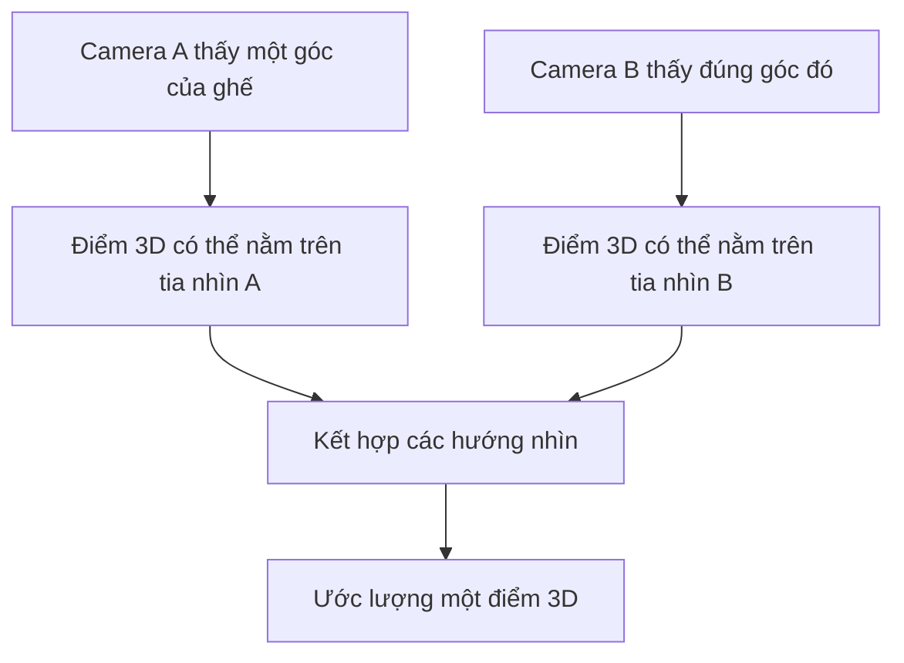
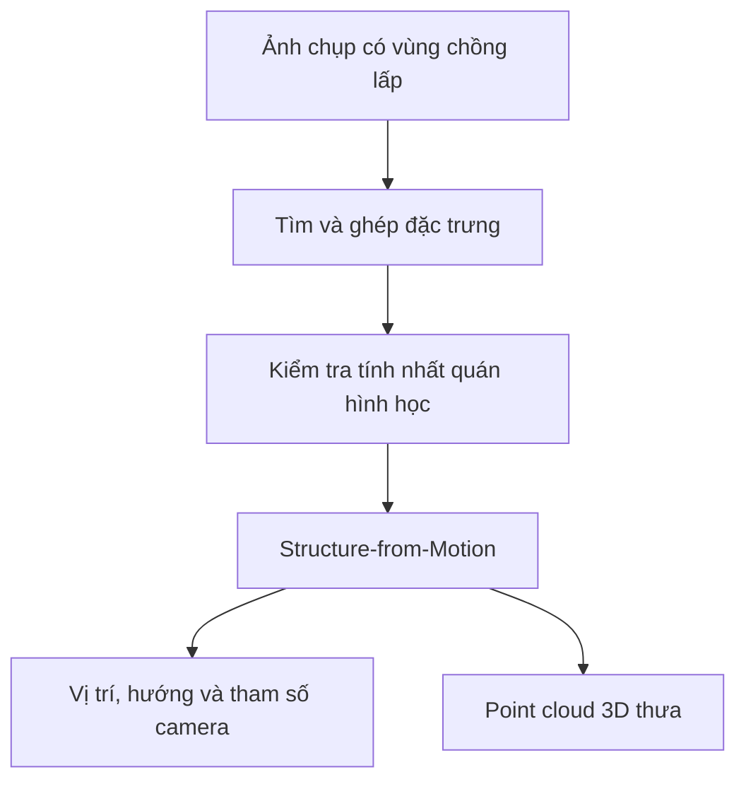
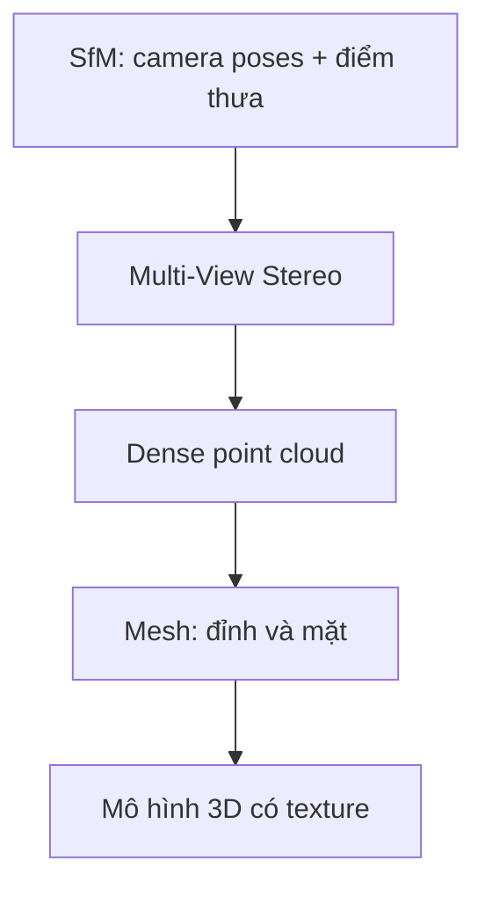
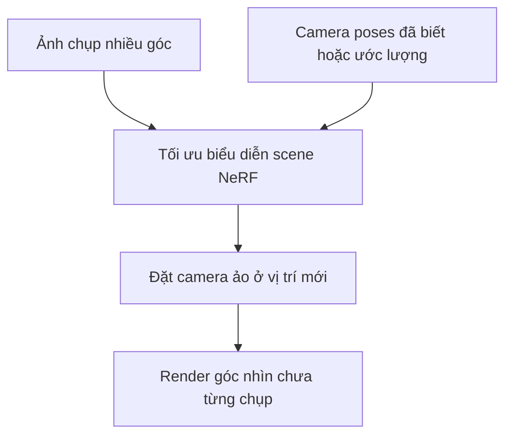

Một bức ảnh là mặt phẳng 2D. Nhưng nếu chụp cùng một căn phòng hoặc chiếc ghế từ nhiều vị trí, máy tính có thể ước lượng camera đã đứng ở đâu và các điểm trong scene nằm ở đâu trong không gian 3D.

Hãy tưởng tượng bạn đi một vòng quanh chiếc ghế bằng điện thoại và chụp 80 ảnh. Mỗi file chứa pixel, không có field ghi "ghế cách camera 1,8 mét" hay "góc này nằm tại (x, y, z)". Manh mối 3D nằm ở **cách cùng một chi tiết thay đổi vị trí trên các bức ảnh**.

Đó là ý tưởng trung tâm của **3D Reconstruction**.

## 1. Vì sao một góc nhìn chưa đủ?

Một điểm trong thế giới 3D được chiếu lên một vị trí trên ảnh. Từ pixel đó, ta biết hướng nhìn, nhưng chưa biết chính xác điểm nằm xa bao nhiêu. Vật nhỏ ở gần và vật lớn ở xa có thể cho hình ảnh khá giống nhau. Model học máy có thể đoán độ sâu từ các dấu hiệu quen thuộc, nhưng một ảnh đơn lẻ không xác định duy nhất toàn bộ hình học của scene.

Di chuyển camera, cùng một điểm sẽ xuất hiện ở vị trí khác trên ảnh. Nhiều quan sát tạo thêm ràng buộc hình học, hơi giống việc hai mắt nhìn cùng một vật từ hai vị trí khác nhau.

Phần khó là xác định "góc" trong ảnh A và ảnh B thật sự là **cùng một điểm vật lý**.

## 2. Trước tiên phải tìm điểm tương ứng giữa các ảnh

Pipeline truyền thống tìm các vị trí dễ nhận biết trên ảnh, thường gọi là **keypoint**: góc cạnh, vùng có texture đặc trưng hoặc pattern cục bộ. Sau đó nó mô tả vùng quanh keypoint, đề xuất điểm tương ứng giữa các ảnh rồi kiểm tra các cặp đó có phù hợp với hình học camera hay không.

[Tài liệu COLMAP](https://colmap.github.io/tutorial.html) chia phần này thành feature detection/extraction, feature matching kèm geometric verification, rồi reconstruction. Bước xác minh quan trọng vì hai pixel trông giống nhau có thể thuộc hai chỗ khác nhau. Match sai sẽ kéo mô hình 3D lệch đi.

Feature matching mới nói hai quan sát trên ảnh *có thể* là cùng một điểm ngoài đời. Nó chưa cho biết tọa độ 3D của điểm ấy.

## 3. Structure-from-Motion tìm vị trí camera và những điểm 3D đầu tiên

Để dựng scene, ta cần biết vị trí, hướng của từng camera và các tham số như tiêu cự, đặc tính ống kính. Trong nhiều bộ ảnh, không phải mọi thông tin này đều biết trước.

**Structure-from-Motion (SfM)** dùng các ảnh chồng lấp để ước lượng đồng thời cấu hình camera (**motion**) và một tập điểm 3D thưa của scene (**structure**). [COLMAP mô tả SfM](https://colmap.github.io/tutorial.html) theo cách này. Khi đã có ước lượng hình học camera và các điểm tương ứng, **triangulation** kết hợp những tia nhìn để xác định vị trí 3D. Pixel ngoài đời có nhiễu, nên phần mềm phải tinh chỉnh nhiều ước lượng về camera và điểm cùng lúc, thay vì mong các tia giao nhau hoàn hảo.

**Point cloud** là tập tọa độ 3D, thường kèm màu và đôi khi có hướng bề mặt. Bản thưa có thể cho thấy dáng chung của ghế hoặc căn phòng, nhưng chưa phải bề mặt chi tiết.

Còn một giới hạn rất quan trọng: **ảnh từ một camera đơn thông thường chỉ cho hình học tới một hệ số tỷ lệ chưa biết**. Mô hình có thể biết ghế rộng gấp đôi vật bên cạnh, nhưng không tự biết ghế rộng 0,5 hay 1 mét. Muốn đo bằng mét, cần thêm mốc kích thước đã biết, cặp camera stereo có khoảng cách chuẩn, cảm biến depth hoặc thông tin đo đạc khác. Đây là [scale ambiguity của monocular SfM](https://openaccess.thecvf.com/content_cvpr_2014/html/Ventura_A_Minimal_Solution_2014_CVPR_paper.html).

## 4. Multi-View Stereo làm hình học dày hơn

Các điểm thưa đủ giúp định vị camera, nhưng chưa mô tả rõ tường, mặt bàn hay phần cong của ghế. **Multi-View Stereo (MVS)** dùng camera poses đã tìm được cùng nhiều pixel hơn để ước lượng độ sâu, hướng bề mặt, rồi kết hợp thành point cloud dày hơn.

[Pipeline dense reconstruction của COLMAP](https://github.com/colmap/colmap/blob/main/doc/tutorial.rst) có thể tạo depth và normal maps, hợp nhất thành dense point cloud, ước lượng surface mesh và tùy chọn phủ texture bằng ảnh gốc.

**Mesh** nối các đỉnh thành những mặt, tạo bề mặt tường minh mà nhiều công cụ 3D dễ xử lý. Texture mapping thêm vẻ ngoài từ ảnh chụp. Nhưng point cloud dày hay mesh nhìn đẹp **không tự động** là bản đo chính xác cho kỹ thuật; phải kiểm tra theo sai số mà công việc yêu cầu.

## 5. Cách chụp quan trọng hơn chỉ riêng số lượng ảnh

COLMAP khuyên chụp ảnh có **độ chồng lấp cao**, để một vật xuất hiện trong nhiều góc nhìn, và cần **di chuyển vị trí camera**, không chỉ đứng nguyên chỗ xoay máy. Chỉ xoay tại chỗ tạo rất ít baseline để suy ra độ sâu bằng triangulation. Scene nên có texture, ánh sáng tương đối ổn định và tránh phản chiếu mạnh.

| Điều kiện chụp | Vì sao quan trọng? |
| --- | --- |
| Nhiều góc có chồng lấp, từ các vị trí khác nhau | Cùng một điểm có thể được ghép và suy ra vị trí 3D. |
| Ảnh rõ và đủ sáng | Dễ theo dõi keypoint và chi tiết hơn. |
| Texture đặc trưng | Tường gạch dễ ghép điểm hơn tường trắng trơn. |
| Ít phản chiếu và chuyển động | Gương, kính, nước và vật di chuyển phá vỡ giả định matching đơn giản. |
| Góc nhìn mang thêm thông tin, không chỉ thêm frame | Hàng nghìn frame video gần giống nhau đóng góp ít hình học hơn các góc khác biệt. |

Đây cũng là bài học dữ liệu từ [Active Learning](../active-learning-which-images-to-label-vi/): **thông tin mới quan trọng hơn số lượng thô**. COLMAP thậm chí gợi ý giảm frame rate khi lấy ảnh từ video có nhiều frame gần trùng.

## 6. NeRF tập trung vào việc render góc nhìn mới

Con đường cổ điển hướng đến hình học tường minh như điểm và mesh. Một hướng khác hỏi: **liệu ta có thể học biểu diễn của scene để render một bức ảnh thuyết phục từ vị trí camera chưa từng chụp?**

[Paper NeRF gốc](https://arxiv.org/abs/2003.08934) train trên nhiều ảnh cùng camera poses đã biết. Neural field ánh xạ vị trí 3D và hướng nhìn sang mật độ cùng màu phụ thuộc góc nhìn; thông tin dọc tia nhìn được kết hợp bằng volume rendering để tạo view mới.

Với ảnh thật, camera poses có thể đến từ SfM. Kết quả NeRF rất hấp dẫn cho virtual tour hoặc novel-view synthesis, dù biểu diễn bên dưới không phải mesh tam giác truyền thống. Một bề mặt *trông đúng* trên ảnh render không chứng minh mọi mặt khuất hay kích thước vật lý đều chính xác.

## 7. 3D Gaussian Splatting dùng một cách biểu diễn khác

[Paper 3D Gaussian Splatting (3DGS) gốc](https://doi.org/10.1145/3592433) bắt đầu từ các điểm thưa có được khi ước lượng camera, rồi tối ưu rất nhiều Gaussian 3D. Mỗi Gaussian có vị trí, vùng chiếm trong không gian, độ mờ và màu sắc. Renderer chuyên dụng chiếu và phối chúng để tạo góc nhìn mới; paper cho thấy khả năng render thời gian thực trong những điều kiện họ đánh giá.

Nhìn ở mức khái quát:

| Cách biểu diễn | Điểm mạnh chính | Điều cần cẩn trọng |
| --- | --- | --- |
| SfM + MVS + mesh | Hình học và bề mặt tường minh | Vẫn phải kiểm tra scale và sai số hình học. |
| NeRF | Tạo góc nhìn mới chân thực | Không tự có mesh hay collision model dùng trực tiếp. |
| 3DGS | Render góc nhìn mới đẹp và nhanh | Gaussian không tự tạo bề mặt kín hoặc bản đồ đúng kích thước thực. |

Chúng không phải ba pipeline loại trừ nhau. NeRF gốc giả định đã có camera poses; 3DGS gốc khởi tạo từ điểm thưa. Hình học camera cổ điển thường là bước nền cho cách render mới. Nhiều biến thể hiện đại cũng có thể kết hợp hoặc chuyển đổi giữa các cách biểu diễn.

## 8. Scene tĩnh là trường hợp dễ hơn

Từ đầu bài, ta giả định **camera di chuyển còn chiếc ghế đứng yên**. Một con phố khó hơn: xe, người, lá cây và màn hình đều thay đổi khi chụp. Một điểm trong ảnh đầu có thể đã dịch chuyển trước ảnh tiếp theo, phá vỡ giả định mọi ảnh cùng mô tả một scene 3D cố định.

Dynamic reconstruction phải mô hình cả **3D và thời gian**, hoặc tách vật di chuyển khỏi background tĩnh. Chỉ tăng số frame không giải được vấn đề ấy.

## Bạn thật sự cần loại "3D" nào?

Với virtual tour, mục tiêu chính có thể là hình ảnh thuyết phục khi đổi góc nhìn. Với đo đạc CAD hoặc robot tránh va chạm, hình học tường minh, đã hiệu chuẩn và được kiểm chứng lại quan trọng hơn. Robot không thể suy ra đường đi an toàn chỉ vì scene render trông rất thật.

3D reconstruction ghép các quan sát tương ứng từ nhiều góc để ước lượng chuyển động camera và cấu trúc scene. Đầu ra có thể là điểm thưa, mesh dày, neural field hoặc Gaussians. Cách biểu diễn phù hợp tùy việc ta muốn **ngắm nhìn, đo đạc, mô phỏng hay hành động**.

Đó là lý do chủ đề này nối với [Physical AI](../what-is-physical-ai-vi/): robot cần nhiều hơn câu "trong ảnh có một chiếc bàn". Nó cần ước lượng đáng tin về vị trí của bàn trong không gian mà nó phải di chuyển.

## Nguồn tham khảo

- [Image-Based 3D Reconstruction Tutorial - COLMAP](https://colmap.github.io/tutorial.html)
- [Dense Reconstruction and Texturing - COLMAP documentation](https://github.com/colmap/colmap/blob/main/doc/tutorial.rst)
- [NeRF: Representing Scenes as Neural Radiance Fields for View Synthesis - Mildenhall et al.](https://arxiv.org/abs/2003.08934)
- [3D Gaussian Splatting for Real-Time Radiance Field Rendering - Kerbl et al.](https://doi.org/10.1145/3592433)
- [A Minimal Solution to the Generalized Pose-and-Scale Problem - CVPR/CVF](https://openaccess.thecvf.com/content_cvpr_2014/html/Ventura_A_Minimal_Solution_2014_CVPR_paper.html)
