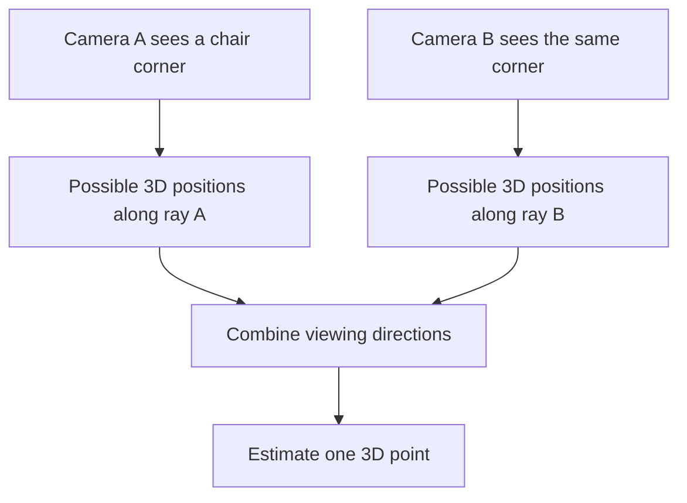
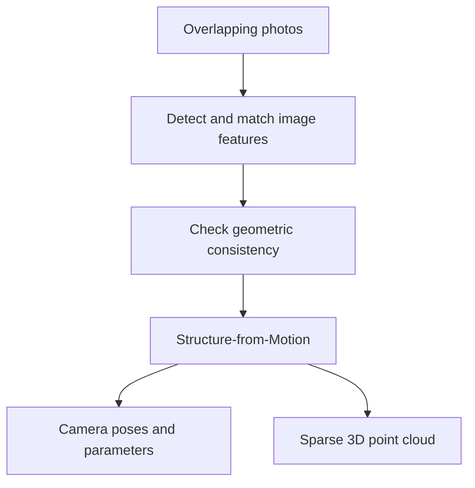
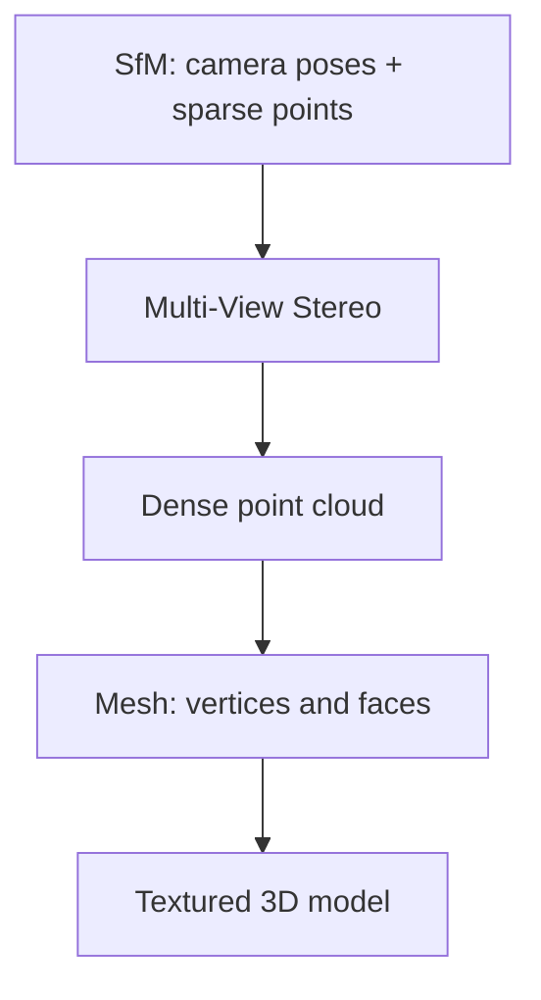
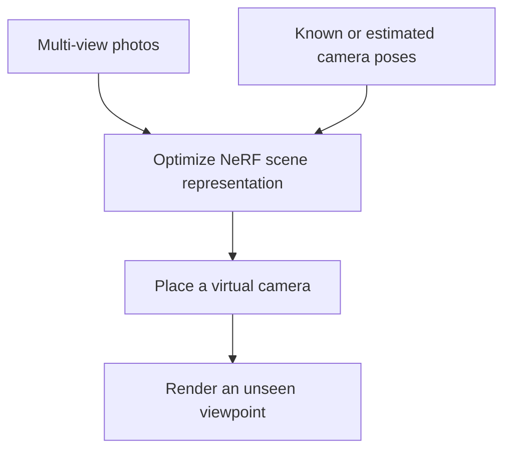

A photograph is a flat image. Yet if you photograph the same room or chair from several positions, a computer can estimate where the cameras were and where points in the scene lie in 3D.

Imagine walking around a chair with your phone and taking 80 photos. Each file contains pixels, not a field saying "the chair is 1.8 meters away" or "this corner is at (x, y, z)." The 3D clues are in **how the same visible parts move across images**.

That is the central idea of **3D reconstruction**.

## 1. Why one view is ambiguous

A point in a 3D scene projects to a position on the camera image. From that pixel alone, we know a viewing direction, not the point's exact distance. A small object nearby and a larger object farther away can make similar images. A learned model may guess depth from familiar visual clues, but a single view does not uniquely determine all scene geometry.

Move the camera, and the same point appears at different image locations. Those different observations add geometric constraints, a little like the two slightly different views from our eyes.

The hard part is knowing that the "corner" in image A and the "corner" in image B are really the **same physical point**.

## 2. First find correspondences between photos

A traditional pipeline detects distinctive image locations, often called **keypoints**: corners, textured patches, or other local patterns. It describes the area around each keypoint, proposes matches between photos, and checks whether those matches agree with a plausible camera geometry.

The [COLMAP tutorial](https://colmap.github.io/tutorial.html) describes these stages as feature detection and extraction, feature matching with geometric verification, and reconstruction. Verification matters because two similar-looking pixels can come from different places. A bad match can pull the estimated scene in the wrong direction.

Feature matching tells us that two image measurements *may* refer to one world point. It does not yet tell us that point's 3D coordinates.

## 3. Structure-from-Motion recovers cameras and sparse 3D points

To reconstruct a scene, we need to know each camera's position and orientation, along with camera parameters such as focal length and lens behavior. In many photo collections, these are not all known in advance.

**Structure-from-Motion (SfM)** uses overlapping images to estimate both the camera configuration (**motion**) and a sparse set of 3D scene points (**structure**). COLMAP describes SfM this way in its [official tutorial](https://colmap.github.io/tutorial.html). Once camera geometry and matching image points are estimated, **triangulation** combines their viewing directions to place points in 3D. Real image measurements are noisy, so software refines many camera and point estimates together rather than expecting rays to cross perfectly.

A **point cloud** is a collection of 3D coordinates, often with color and sometimes surface directions. The sparse result may show the outline of a chair or room, but it is not yet a detailed surface.

There is also an important limit: **ordinary monocular photos alone usually recover geometry only up to an unknown global scale**. A reconstruction may know the chair is twice as wide as another object without knowing whether it is 0.5 or 1 meter wide. Recovering meters needs extra information such as a known-size object, calibrated stereo baseline, depth sensor, or other metric reference. This is a well-known [scale ambiguity in monocular SfM](https://openaccess.thecvf.com/content_cvpr_2014/html/Ventura_A_Minimal_Solution_2014_CVPR_paper.html).

## 4. Multi-View Stereo turns sparse points into denser geometry

Sparse points are enough to help locate cameras, but not enough to describe a wall, tabletop, or curved chair surface. **Multi-View Stereo (MVS)** uses the recovered camera poses and more image pixels to estimate depth and surface directions, then combines them into a denser point cloud.

COLMAP's [dense reconstruction pipeline](https://github.com/colmap/colmap/blob/main/doc/tutorial.rst) can create depth and normal maps, fuse a dense point cloud, estimate a surface mesh, and optionally texture that mesh from the original photographs.

A **mesh** connects vertices into faces, making an explicit surface that many 3D tools can process. Texture mapping adds appearance from the photos. Neither a dense cloud nor a pretty mesh is automatically an engineering-grade measurement; the result must be checked against the accuracy the task requires.

## 5. Photo quality matters more than photo count alone

COLMAP recommends substantial **overlap** between photos, with objects visible in several views, and a change of **camera position**, not only rotating in place. Pure rotation provides little baseline for triangulating depth. It also recommends textured scenes, similar lighting, and avoiding strong reflections or specular surfaces.

| Capture condition | Why it matters |
| --- | --- |
| Overlapping views from different positions | The same points can be matched and triangulated. |
| Sharp, well-exposed photos | Keypoints and details are easier to track. |
| Distinctive texture | A brick wall gives more stable matches than a blank white wall. |
| Limited reflections and movement | Mirrors, glass, water, and moving objects violate simple matching assumptions. |
| Informative viewpoints, not only extra frames | Thousands of near-identical video frames add less geometry than varied views. |

This is the same data lesson from [Active Learning](../active-learning-which-images-to-label/): **new information matters more than raw count**. COLMAP even suggests downsampling video frames when they are too similar.

## 6. NeRF focuses on rendering a new viewpoint

The classical route aims at explicit geometry such as points and meshes. A different route asks: **can we learn a scene representation that renders a convincing image from a camera position we did not photograph?**

The original [NeRF paper](https://arxiv.org/abs/2003.08934) trains on multiple images of a scene with known camera poses. Its neural field maps a 3D location and viewing direction to density and view-dependent color; rays through that field are combined with volume rendering to produce a new view.

For real photos, camera poses can come from a method such as SfM. NeRF's result can be compelling for virtual tours or novel-view synthesis, even though the underlying representation is not a conventional triangle mesh. A rendered surface that *looks* right is not proof that every hidden surface or physical dimension is accurate.

## 7. 3D Gaussian Splatting offers another scene representation

The original [3D Gaussian Splatting (3DGS) paper](https://doi.org/10.1145/3592433) begins with sparse points from camera calibration and optimizes many 3D Gaussians. Each has a position, spatial extent, opacity, and appearance. A specialized renderer projects and blends them to create new views, with real-time rendering demonstrated in the paper's evaluated settings.

In broad terms:

| Representation | Primary strength | Important caution |
| --- | --- | --- |
| SfM + MVS + mesh | Explicit geometry and surfaces | Scale and geometric accuracy still need validation. |
| NeRF | Photorealistic novel views | Not automatically a directly usable mesh or collision model. |
| 3DGS | High-quality, fast novel-view rendering | Gaussians are not automatically a watertight surface or metric map. |

These are not mutually exclusive pipelines. The original NeRF assumes camera poses are available; the original 3DGS initializes from sparse points. Classical camera geometry often provides the starting point for neural or Gaussian rendering. Modern variants can combine or convert representations in different ways.

## 8. A static scene is the easier case

So far, we have assumed the **camera moves while the chair stays still**. A street scene is harder: cars, people, leaves, and screens change while photographs are taken. A point in one image may move before the next image, breaking the idea that all views describe one fixed 3D scene.

Dynamic reconstruction has to model **3D plus time**, or separate moving objects from the static background. That is a different problem from simply supplying more frames.

## What kind of "3D" do you actually need?

For a virtual tour, convincing appearance from new viewpoints may be the main goal. For CAD measurements or robot collision checking, explicit, calibrated, and validated geometry matters more. A robot cannot safely infer a free path merely because a scene render looks photorealistic.

3D reconstruction joins corresponding observations across viewpoints to estimate camera motion and scene structure. From there, it may produce sparse points, a dense mesh, a neural field, or Gaussians. The right output depends on whether you want to **look around, measure, simulate, or act**.

That is why this topic connects to [Physical AI](../what-is-physical-ai/): a robot needs more than "there is a table in the photo." It needs a trustworthy estimate of where the table is in the space where it must move.

## References

- [Image-Based 3D Reconstruction Tutorial - COLMAP](https://colmap.github.io/tutorial.html)
- [Dense Reconstruction and Texturing - COLMAP documentation](https://github.com/colmap/colmap/blob/main/doc/tutorial.rst)
- [NeRF: Representing Scenes as Neural Radiance Fields for View Synthesis - Mildenhall et al.](https://arxiv.org/abs/2003.08934)
- [3D Gaussian Splatting for Real-Time Radiance Field Rendering - Kerbl et al.](https://doi.org/10.1145/3592433)
- [A Minimal Solution to the Generalized Pose-and-Scale Problem - CVPR/CVF](https://openaccess.thecvf.com/content_cvpr_2014/html/Ventura_A_Minimal_Solution_2014_CVPR_paper.html)
