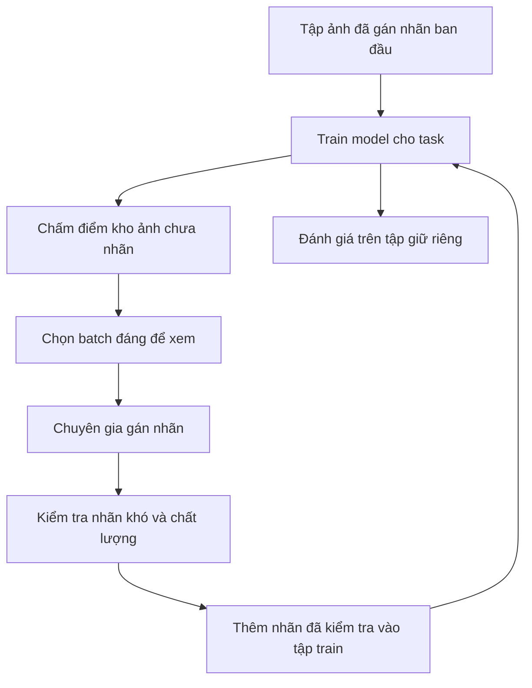

Bạn có một triệu ảnh nhưng ngân sách chỉ đủ cho chuyên gia gắn nhãn **1.000 ảnh**. Chọn ngẫu nhiên là điểm bắt đầu hợp lý. Tuy nhiên, nếu nhiều ảnh gần như trùng nhau hoặc model đã xử lý tốt, liệu cùng ngân sách ấy có thể dạy model nhiều hơn không?

**Active Learning** đưa model vào quá trình quyết định đó. Model giúp chọn sample để con người gán nhãn, rồi học từ những nhãn mới. Nó **không tự tạo ground truth**.

[Bài Self-Supervised Learning trước](../self-supervised-learning-visual-representations-vi/) hỏi làm sao học từ ảnh chưa nhãn. Bài này hỏi **ảnh nào đáng nhận nhãn tiếp theo từ con người**.

## 1. Gán nhãn trở thành một vòng lặp

Trong workflow thông thường, team có thể gán nhãn lượng dữ liệu vừa túi tiền, train một lần rồi đánh giá. Với pool-based active learning, việc chọn ảnh và train lặp lại nhiều vòng:

Vòng lặp chỉ có ích nếu ảnh được chọn cải thiện task **trên mỗi đơn vị chi phí gán nhãn**. [Google Research mô tả active learning](https://research.google/pubs/consistency-based-active-learning-minimizing-the-labeling-budgets/) là ưu tiên sample giá trị cao để giảm ngân sách gán nhãn. Chữ "giá trị" chính là phần khó: trước khi label và retrain, ta chưa thể biết chắc một ảnh sẽ giúp bao nhiêu.

## 2. Uncertainty: hỏi ở nơi model đang lưỡng lự

Giả sử một classifier hai class dự đoán:

| Ảnh | Mèo | Chó | Nhìn ban đầu |
| --- | ---: | ---: | --- |
| A | 99% | 1% | Model có vẻ chắc chắn |
| B | 51% | 49% | Model đang phân vân |
| C | 97% | 3% | Model có vẻ chắc chắn |

Nếu chỉ được gán nhãn thêm một ảnh, B trông hấp dẫn nhất. **Uncertainty sampling** chọn các case gần ranh giới quyết định hiện tại. Với nhiều class, có thể nhìn khoảng cách nhỏ giữa hai class đầu hoặc mức phân tán của dự đoán.

Nhưng những con số trên là **score của model**, không phải lời bảo đảm rằng 99% dự đoán kiểu này đều đúng. Model có thể rất tự tin mà vẫn sai, đặc biệt khi input lạ. [Nghiên cứu về dự đoán rất tự tin trên ảnh con người không nhận ra](https://openaccess.thecvf.com/content_cvpr_2015/html/Nguyen_Deep_Neural_Networks_2015_CVPR_paper.html) cho thấy vì sao chỉ nhìn softmax score là chưa đủ để quyết định ảnh nào "đáng label".

## 3. Batch bất định nhất có thể toàn ảnh hỏng hoặc ảnh trùng

Hãy tưởng tượng chọn 1.000 frame có uncertainty cao nhất. Batch có thể chứa ảnh mờ, camera bị che, file hỏng, vật ngoài phạm vi task hoặc hàng trăm ảnh gần như giống hệt của cùng một lỗi. Một số là failure case có giá trị; số khác thậm chí không thể gắn nhãn có ý nghĩa theo policy hiện tại.

Vì vậy, **uncertainty cao không đồng nghĩa giá trị thông tin cao**. Trước tiên nên lọc sample không dùng được và quy định cách xử lý case ngoài phạm vi. Sau đó xem batch đã bao phủ nhiều điều kiện hay chỉ lặp lại một pattern.

Đây là lúc **diversity** quan trọng. Trong không gian đặc trưng, ảnh có thể nằm ở các vùng tương ứng với camera, ánh sáng, phiên bản sản phẩm hoặc kiểu lỗi khác nhau. Với ngân sách nhỏ, lấy đại diện của nhiều vùng liên quan có thể hữu ích hơn mười ảnh khó nhưng giống hệt nhau.

[Cách tiếp cận core-set của Sener và Savarese](https://arxiv.org/abs/1708.00489) xem active learning như bài toán chọn tập con đại diện cho kho dữ liệu lớn. [BADGE](https://arxiv.org/abs/1906.03671) là một phương pháp khác kết hợp uncertainty và diversity khi chọn cả batch. Không cần triển khai hai thuật toán này mới rút được bài học: **case khó còn phải mang thêm thông tin mới**.

## 4. Random sampling vẫn là baseline nghiêm túc

Nói chọn ngẫu nhiên là lãng phí nghe có vẻ hấp dẫn, nhưng quá mạnh. Một seed set ngẫu nhiên có thể cho model đầu tiên độ bao phủ rộng khi nó còn biết rất ít. Mẫu ngẫu nhiên cũng cho ta thấy tần suất bình thường của production, điều mà một hàng chờ toàn ảnh khó dễ che mất.

Nhiều phương pháp active learning cho kết quả không ổn định khi so công bằng với random selection; một [nghiên cứu CVPR 2022](https://openaccess.thecvf.com/content/CVPR2022/papers/Munjal_Towards_Robust_and_Reproducible_Active_Learning_Using_Neural_Networks_CVPR_2022_paper.pdf) là lời nhắc hữu ích. Hãy **so với random baseline mạnh ở cùng ngân sách nhãn**, không so với một baseline yếu sẵn.

Cần giữ một **tập evaluation riêng, đại diện cho production**. Nhãn của tập này không được chọn theo active policy và không đem train. Nếu dashboard chỉ đo trên ảnh khó do model tự chọn, ta có thể hiểu sai chất lượng ngoài đời. Đồng thời vẫn nên có các lát cắt thử thách cho lỗi hiếm nhưng hậu quả cao; trung bình trên traffic bình thường có thể che mất chúng.

## 5. Lúc mới bắt đầu và khi model quá tự tin đều có điểm mù

Khi chưa có nhãn nào, task classifier không biết ảnh nào chứa thông tin hữu ích. Cách bắt đầu thực tế là gán nhãn một seed set nhỏ chọn ngẫu nhiên hoặc đa dạng, train model đầu tiên, rồi mới active selection. Paper Google Research ở trên cũng nghiên cứu câu hỏi khi nào việc chọn ảnh dựa vào model bắt đầu có ích.

Ngay cả sau đó, confidence vẫn không hoàn hảo. Một defect hoàn toàn mới có thể bị model dự đoán "normal" với confidence rất cao và không bao giờ lọt vào nhóm "uncertain nhất". Để giảm điểm mù này, team có thể kết hợp uncertainty với độ mới của embedding, thay đổi trong metadata camera hoặc sản phẩm, failure production đã biết và báo cáo trực tiếp từ con người.

Những tín hiệu này chỉ chỉ ra **case đáng xem**, không chứng minh đó là class mới hay defect. Con người vẫn cung cấp đáp án.

## 6. Một batch cần policy chọn ảnh, không chỉ một score

Để minh họa, một vòng gán nhãn 1.000 ảnh có thể chia:

| Nguồn ảnh | Số lượng ví dụ | Vì sao có trong batch? |
| --- | ---: | --- |
| Ảnh chưa chắc chắn nhưng đúng phạm vi task | 300 | Làm rõ ranh giới quyết định |
| Vùng dữ liệu đa dạng hoặc trông mới | 250 | Bao phủ điều kiện còn thiếu |
| Failure đã xảy ra ở production | 200 | Học từ lỗi đã được chứng minh |
| Case hiếm, tác động lớn do metadata hoặc chuyên gia đánh dấu | 150 | Phản ánh rủi ro nghiệp vụ |
| Ảnh chọn ngẫu nhiên | 100 | Giữ khả năng khám phá điểm mù |
| **Tổng** | **1.000** | |

Đây là **số minh họa**, không phải tỷ lệ chuẩn. Cách chia đúng tùy chi phí gán nhãn, tần suất, rủi ro của task và độ đáng tin của model hiện tại. Hiếm không tự động đồng nghĩa quan trọng; quan trọng cũng không có nghĩa model sẽ xếp nó vào nhóm uncertain. Policy cần tính đến hậu quả nghiệp vụ một cách rõ ràng.

Khi so các chiến lược, đừng chỉ nhìn điểm cuối của model. Hãy tính thời gian chuyên gia, số ảnh không dùng được, mức bất đồng nhãn và số nhãn cần để đạt metric mục tiêu.

## 7. Ảnh khó nhất cũng có thể là ảnh khó gán nhãn nhất

Active Learning thường đưa các case gần ranh giới cho con người. Đó cũng là nơi chuyên gia có thể bất đồng: đây là scratch, dent hay texture vẫn chấp nhận được?

Nếu team lấy ngay câu trả lời đầu tiên mà không định nghĩa nhãn rõ, một sample "giá trị cao" sẽ thành training signal nhiễu. Nên có hướng dẫn nhãn, ví dụ minh họa, lựa chọn "mơ hồ hoặc ngoài phạm vi" và đường review khi chuyên gia bất đồng. Đôi khi làm rõ nghĩa của "defect" còn hữu ích hơn mua thêm 10.000 nhãn không nhất quán.

Vì vậy Active Learning là **workflow giữa model, dữ liệu và con người**. Chất lượng chọn ảnh, chất lượng gán nhãn, thời gian retrain và cách đánh giá đều quyết định vòng lặp có đáng làm hay không.

## 8. Ba chiến lược dữ liệu, ba câu hỏi khác nhau

| Chiến lược | Câu hỏi nó trả lời |
| --- | --- |
| [Synthetic Data](../synthetic-data-training-rare-cases-vi/) | Tình huống còn thiếu nào có thể tạo hoặc mô phỏng? |
| [Self-Supervised Learning](../self-supervised-learning-visual-representations-vi/) | Ta học được gì từ dữ liệu đang có nhưng thiếu nhãn cho task? |
| Active Learning | Ví dụ thật nào nên được con người gán nhãn tiếp theo? |

Chúng có thể phối hợp. Backbone tự giám sát cung cấp đặc trưng để chọn ảnh. Task model cho biết những vùng còn yếu. Nếu production đã có ảnh thật của vùng đó, chọn để chuyên gia gán nhãn. Nếu chưa có, synthetic data được kiểm tra cẩn thận có thể mở rộng độ bao phủ. Trong mọi trường hợp, hãy đo cải thiện trên dữ liệu thật giữ riêng, không chỉ trên batch được chọn.

## Nguồn lực khan hiếm là sự chú ý của chuyên gia

Active Learning không chỉ là thuật toán giảm số nhãn. Nó giúp dùng thời gian của con người ở nơi có thể dạy hệ thống nhiều nhất, đồng thời giữ đủ ảnh ngẫu nhiên và tập đánh giá độc lập để biết cách chọn thông minh ấy có thật sự hiệu quả không.

Câu hỏi không phải **"Ta đã gán nhãn bao nhiêu ảnh?"** mà là **"Mỗi vòng gán nhãn đã dạy ta điều gì, và nó có cải thiện công việc model phải làm không?"**

## Nguồn tham khảo

- [Consistency-based active learning: Minimizing the labeling budgets - Google Research](https://research.google/pubs/consistency-based-active-learning-minimizing-the-labeling-budgets/)
- [Active Learning for Convolutional Neural Networks: A Core-Set Approach - Sener and Savarese](https://arxiv.org/abs/1708.00489)
- [Deep Batch Active Learning by Diverse, Uncertain Gradient Lower Bounds (BADGE) - Ash et al.](https://arxiv.org/abs/1906.03671)
- [Towards Robust and Reproducible Active Learning Using Neural Networks - CVPR/CVF](https://openaccess.thecvf.com/content/CVPR2022/papers/Munjal_Towards_Robust_and_Reproducible_Active_Learning_Using_Neural_Networks_CVPR_2022_paper.pdf)
- [Deep Neural Networks Are Easily Fooled: High Confidence Predictions for Unrecognizable Images - CVPR/CVF](https://openaccess.thecvf.com/content_cvpr_2015/html/Nguyen_Deep_Neural_Networks_2015_CVPR_paper.html)
