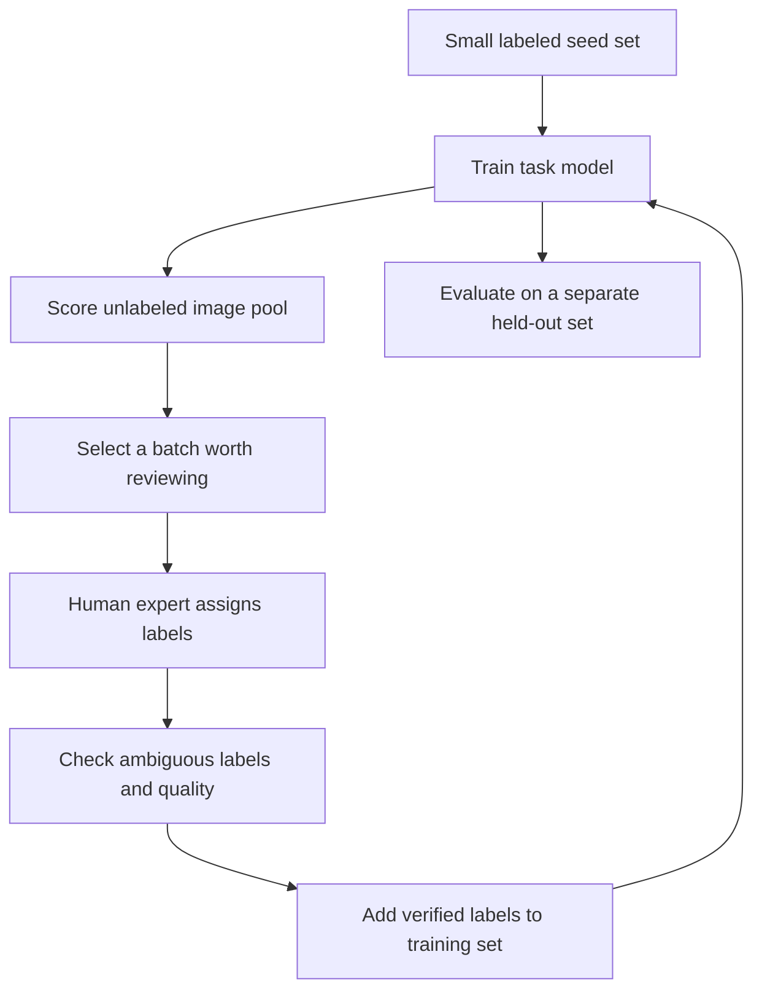

You have a million images, but your budget covers only **1,000 expert labels**. Randomly choosing images is a sensible starting point. Yet if many images are near-duplicates or cases the model already handles well, could the same labeling budget teach it more?

**Active Learning** puts the current model into that decision process. The model helps select samples for a person to label, then learns from the new labels. It does **not** create ground truth on its own.

The [previous article on Self-Supervised Learning](../self-supervised-learning-visual-representations/) asked how to learn from images without labels. This one asks **which images deserve the next human label**.

## 1. Labeling becomes a loop

In a conventional workflow, a team may label what it can afford, train once, and evaluate. In pool-based active learning, selection and training happen repeatedly:

The loop only helps if selected images improve the task **per unit of annotation cost**. [Google Research describes active learning](https://research.google/pubs/consistency-based-active-learning-minimizing-the-labeling-budgets/) as prioritizing high-value samples to reduce labeling budgets. The word "value" is the difficult part: we do not know a sample's true value before labeling and retraining.

## 2. Uncertainty: ask where the model hesitates

Suppose a binary classifier predicts:

| Image | Cat | Dog | Initial intuition |
| --- | ---: | ---: | --- |
| A | 99% | 1% | Model appears confident |
| B | 51% | 49% | Model is unsure |
| C | 97% | 3% | Model appears confident |

If only one image could be labeled, B looks attractive. **Uncertainty sampling** selects cases near the model's current decision boundary. Multiclass versions can use a small gap between the top classes or high prediction entropy.

But these numbers are **model scores**, not a promise that 99% of such predictions are correct. A model can be confidently wrong, particularly on unfamiliar inputs. [Research on high-confidence predictions for unrecognizable images](https://openaccess.thecvf.com/content_cvpr_2015/html/Nguyen_Deep_Neural_Networks_2015_CVPR_paper.html) illustrates why a softmax score alone is a weak definition of "worth labeling."

## 3. The most uncertain batch may be mostly junk or duplicates

Imagine selecting the 1,000 most uncertain frames. You may get blurred images, covered cameras, corrupt files, objects outside the task, or hundreds of near-identical views of one defect. Some are valuable failure cases; others cannot be given a meaningful label under the current policy.

High uncertainty is therefore **not identical to high information value**. First filter unusable samples and decide how out-of-scope cases should be labeled or rejected. Then consider whether the chosen batch covers different conditions, rather than one repeated pattern.

This is where **diversity** matters. In a learned representation space, images may form regions corresponding to different cameras, lighting, product variants, or defect appearances. With a small budget, representatives from several relevant regions may be more useful than ten almost-identical uncertain images.

[Sener and Savarese's core-set approach](https://arxiv.org/abs/1708.00489) frames active learning as selecting a subset representative of the larger pool. [BADGE](https://arxiv.org/abs/1906.03671) is a later method that combines uncertainty and diversity in batch selection. You do not need to deploy either algorithm to use the lesson: **hard examples should also add something new**.

## 4. Random sampling remains a serious baseline

It is tempting to say that random selection wastes labels. That is too strong. A random seed set can give the initial model broad coverage when it knows very little. A random sample can also reveal ordinary production frequencies that a deliberately hard labeling queue would hide.

Several active-learning methods have shown inconsistent gains over random selection under controlled comparisons; a [CVPR 2022 study](https://openaccess.thecvf.com/content/CVPR2022/papers/Munjal_Towards_Robust_and_Reproducible_Active_Learning_Using_Neural_Networks_CVPR_2022_paper.pdf) is a useful caution. **Measure against a strong random baseline at the same label budget**, not against an obviously weak one.

Keep a separate, representative **evaluation set** whose labels are not selected by the active policy and are not used for training. Otherwise, a dashboard measured only on actively chosen hard cases can misrepresent real-world performance. Also keep challenge slices for rare but costly failures; an average over normal traffic can hide them.

## 5. Cold start and overconfidence create blind spots

With zero labels, a task classifier has no reliable idea which images are informative. A practical start is to label a small random or diverse seed set, train a first model, then begin active selection. The Google Research paper above specifically investigates when learning-based selection becomes useful.

Even after that, confidence is imperfect. A new type of defect might be confidently classified as normal and never appear among the "most uncertain" samples. To reduce this blind spot, teams can combine uncertainty with novelty in embeddings, changes in camera or product metadata, known production failures, and direct human reports.

These signals are **candidates for review**, not proof an image is a new class or a defect. Human review supplies the answer.

## 6. A batch needs a policy, not just a score

For illustration, a 1,000-image labeling round might allocate:

| Source | Example budget | Why include it? |
| --- | ---: | --- |
| Uncertain, in-scope images | 300 | Refine current decision boundaries |
| Diverse or novel-looking regions | 250 | Cover conditions the set lacks |
| Known production failures | 200 | Learn from demonstrated mistakes |
| Rare, high-impact cases flagged by metadata or experts | 150 | Reflect business risk |
| Random images | 100 | Preserve exploration and detect blind spots |
| **Total** | **1,000** | |

These numbers are **not a recommended universal ratio**. The right mix depends on labeling cost, prevalence, task risk, and how reliable the current model is. Rare does not mean important by itself; important does not mean the model will rank it as uncertain. A review policy should explicitly include business impact.

When comparing strategies, track more than the final model score. Count expert minutes, unusable samples, disagreement rates, and the number of labels needed to reach a target metric.

## 7. The hardest images may also be hardest to label

Active Learning often sends boundary cases to humans. Those are exactly the cases on which experts may disagree: is this a scratch, a dent, or acceptable texture?

If the team accepts the first answer without a clear label definition, a "high-value" sample can become noisy training data. Provide a label guide, examples, an "ambiguous or out of scope" option, and a review path for disagreements. Sometimes clarifying the meaning of "defect" is more useful than buying another 10,000 inconsistent labels.

Active Learning is therefore a **workflow between model, data, and people**. Selection quality, annotation quality, retraining time, and evaluation all affect whether the loop is worthwhile.

## 8. Three data strategies, three different questions

| Strategy | Question it answers |
| --- | --- |
| [Synthetic Data](../synthetic-data-training-rare-cases/) | Which missing situations can we create or simulate? |
| [Self-Supervised Learning](../self-supervised-learning-visual-representations/) | What can we learn from the data we have without task labels? |
| Active Learning | Which real examples should a person label next? |

They can work together. A self-supervised backbone can provide features for selection. The task model can then expose weak regions. If real images of a weak region exist, select them for expert labeling. If they do not, carefully validated synthetic data may expand coverage. In every case, evaluate improvement on held-out real data rather than only on the selected batch.

## The scarce resource is expert attention

Active Learning is not simply an algorithm for reducing the number of labels. It is a way to spend limited human attention where it may teach the system most, while retaining enough random coverage and independent evaluation to know whether the clever selection really helped.

The question is not **"How many images did we label?"** but **"What did each round of labels teach us, and did it improve the work the model must do?"**

## References

- [Consistency-based active learning: Minimizing the labeling budgets - Google Research](https://research.google/pubs/consistency-based-active-learning-minimizing-the-labeling-budgets/)
- [Active Learning for Convolutional Neural Networks: A Core-Set Approach - Sener and Savarese](https://arxiv.org/abs/1708.00489)
- [Deep Batch Active Learning by Diverse, Uncertain Gradient Lower Bounds (BADGE) - Ash et al.](https://arxiv.org/abs/1906.03671)
- [Towards Robust and Reproducible Active Learning Using Neural Networks - CVPR/CVF](https://openaccess.thecvf.com/content/CVPR2022/papers/Munjal_Towards_Robust_and_Reproducible_Active_Learning_Using_Neural_Networks_CVPR_2022_paper.pdf)
- [Deep Neural Networks Are Easily Fooled: High Confidence Predictions for Unrecognizable Images - CVPR/CVF](https://openaccess.thecvf.com/content_cvpr_2015/html/Nguyen_Deep_Neural_Networks_2015_CVPR_paper.html)
