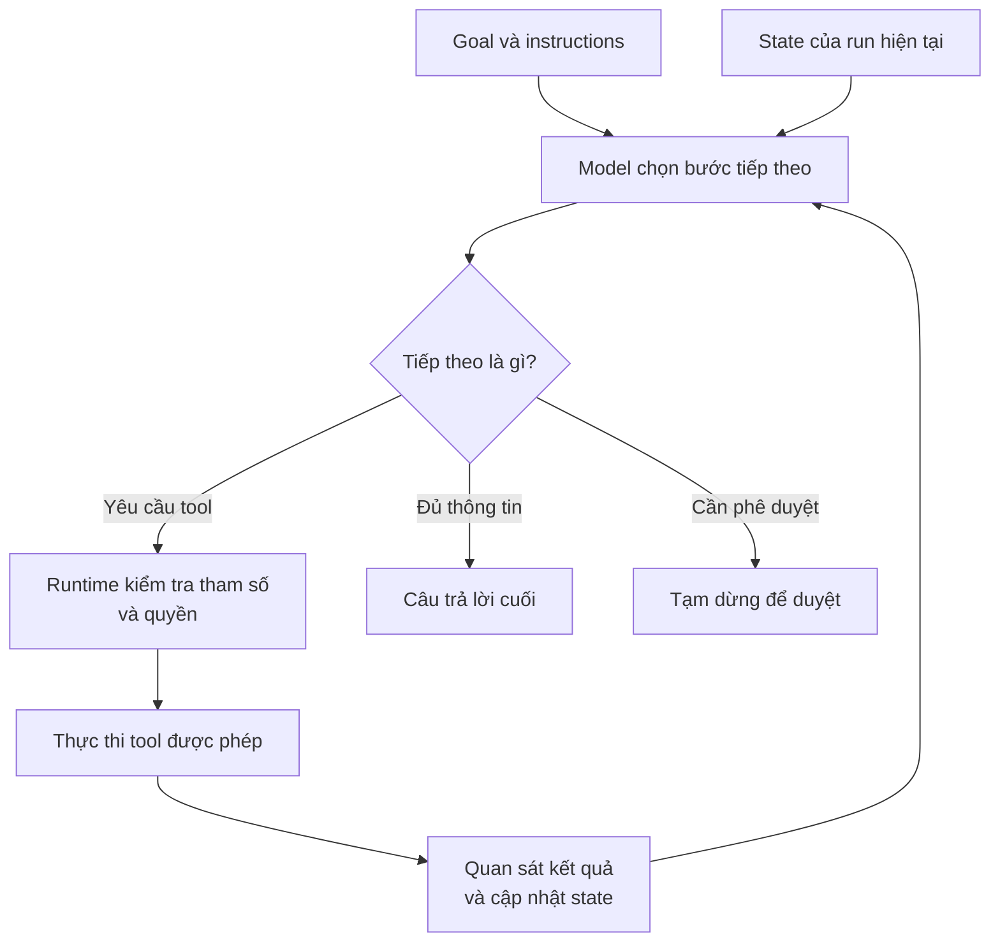
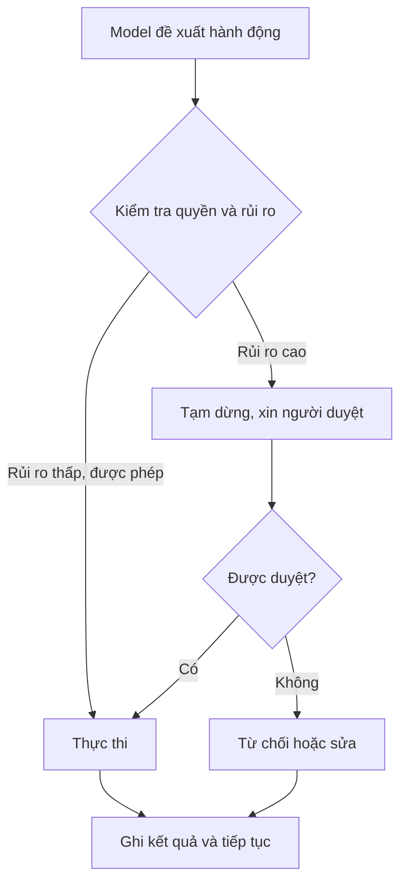
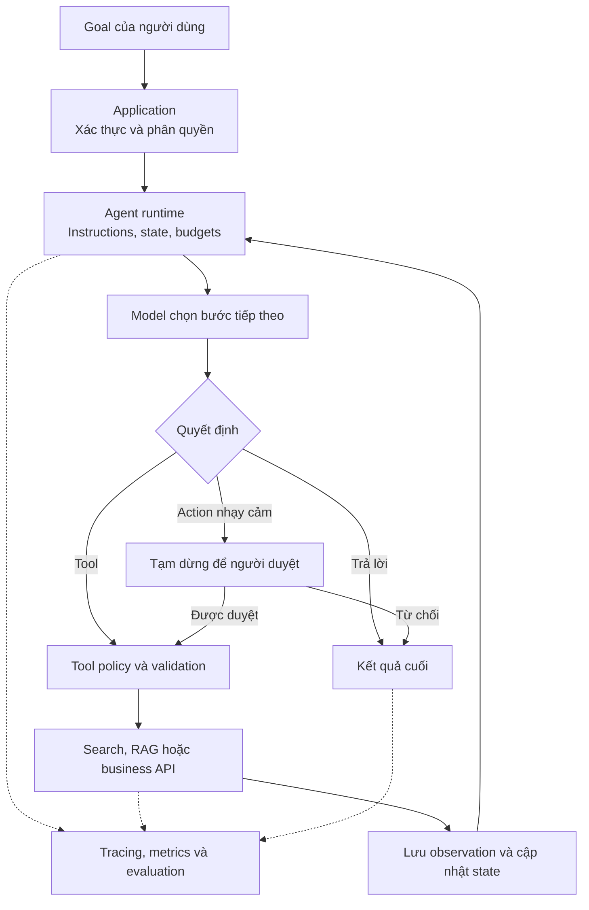

"Kiểm tra đơn hàng 123 giúp tôi" có thể là một việc đơn giản cho chatbot: gọi order API, đọc trạng thái rồi trả lời.

Giờ hãy thử một yêu cầu khác:

> "Đơn hàng này giao trễ rồi. Tìm nguyên nhân, kiểm tra khách có đủ điều kiện hoàn tiền không, nếu được thì xử lý giúp tôi. Nếu số tiền quá lớn, hãy hỏi tôi trước."

Hệ thống có thể phải kiểm tra đơn hàng, xem lịch sử vận chuyển, đọc policy hoàn tiền, tính số tiền, quyết định có cần phê duyệt không, thực hiện hành động rồi báo kết quả. Số bước và thứ tự thực hiện phụ thuộc vào những gì các bước trước tìm thấy.

Điểm mấu chốt không phải AI có gọi được API hay không. [Chatbot production ở bài trước](../production-ai-chatbot-request-vi/) đã dùng được tool. Câu hỏi quan trọng là:

> **Ai chọn bước tiếp theo?**

## 1. Có tool chưa có nghĩa đã có Agent

Giả sử application code quy định: "Nếu người dùng hỏi thời tiết, gọi Weather API rồi nhờ LLM diễn đạt kết quả." Model nhìn thấy dữ liệu từ tool, nhưng developer đã chọn sẵn đường đi. Một pipeline luôn tìm tài liệu, tóm tắt, trích action item và trả JSON vẫn là workflow định trước, dù từng bước đều gọi LLM.

Agent cho model nhiều quyền hơn trong việc chọn bước *trong phạm vi được cho phép*, dựa vào goal hiện tại và những gì nó vừa quan sát.

| Cách làm | Ai quyết định đường đi? | Ví dụ |
| --- | --- | --- |
| Workflow cố định | Application code | Search → tóm tắt → trả JSON |
| Agent | Model trong giới hạn runtime | Search, xem kết quả, chọn tool tiếp hoặc trả lời |

[Anthropic phân biệt](https://www.anthropic.com/engineering/building-effective-agents) workflow có code path định trước với Agent tự điều hướng process và tool use linh hoạt hơn. Ranh giới này không phải nhãn thần kỳ: một hệ thống có thể nằm giữa hai phía. Điều đáng nhìn là model được quyền điều khiển workflow tới đâu.

## 2. Agent tối thiểu vẫn cần một runtime

Về mặt ý tưởng, Agent cần model, instructions và tools. Nhưng để *chạy* một task nhiều bước, nó còn cần application hoặc runtime loop. Runtime gọi model, đọc output, thực thi tool hợp lệ, mang kết quả và state sang bước sau, kiểm tra giới hạn, rồi trả lời hoặc tạm dừng ở một điểm kết thúc.

[Tài liệu Agents SDK của OpenAI](https://developers.openai.com/api/docs/guides/agents/running-agents) mô tả vòng này: gọi model, kiểm tra output, thực thi tool call hoặc handoff, rồi tiếp tục đến khi có kết quả cuối hoặc điểm dừng khác. Model tham gia ra quyết định, nhưng **model không phải toàn bộ hệ thống Agent**.

## 3. Mỗi observation có thể đổi bước tiếp theo

Giả sử goal là "Tìm ba khách hàng có ticket khẩn cấp nhất hôm nay và tạo follow-up task cho account manager."

Đầu tiên model có thể yêu cầu tool tìm các ticket khẩn cấp trong ngày. Tool trả về 23 ticket. Model lại chọn cách xác định ba case cần ưu tiên nhất, có thể lấy thêm thông tin khách hàng. Sau đó nó đề xuất tạo follow-up task và cuối cùng báo kết quả.

Bước tiếp theo phụ thuộc vào tool result, không chỉ vào lời nhắn ban đầu. Agent loop lặp lại:

> **Quan sát state → chọn action → thực thi → xem kết quả → quyết định tiếp.**

Điều này không buộc model phải viết kế hoạch mười bước từ đầu. Lập kế hoạch trước là một pattern hợp lệ; chọn từng bước trong giới hạn cũng là một pattern. Workflow cố định còn có thể đặt một Agent ở đúng bước mơ hồ, trong khi code bình thường xử lý parsing, validation và lưu kết quả.

## 4. Model đề xuất; runtime thực thi có kiểm soát

Giả sử model đề xuất `issue_refund(order_id=123, amount=500)`. Đây là một tool call được đề xuất, không phải quyền chuyển tiền.

Runtime hoặc business service phải kiểm tra tham số, danh tính và quyền của người dùng, áp policy hoàn tiền, xem mức tiền có cần phê duyệt không rồi ghi lại kết quả. Model không nên tự làm lớp authorization cuối cùng của chính nó.

Tool được thiết kế tốt sẽ giúp Agent chọn đúng hơn. Thay vì đưa quyền rộng như `execute_sql(query)`, ứng dụng có thể cung cấp `get_customer_order`, `check_refund_eligibility` và `request_refund`, mỗi tool có input và quyền rõ ràng. [Hướng dẫn thiết kế tool của Anthropic](https://www.anthropic.com/engineering/writing-tools-for-agents) nhấn mạnh mục đích riêng biệt và mô tả rõ cho từng tool.

Một nhân viên giỏi vẫn có thể bấm sai nếu bảng điều khiển có 200 nút không nhãn. Tool interface chính là bảng điều khiển của Agent.

## 5. Agent state rộng hơn chat history

Conversation history ghi lại user và assistant đã nói gì. Một task đang chạy còn có thể cần biết goal, bước hiện tại, kết quả tool, file trung gian, quyết định approval, số lần retry, budget còn lại và action nào đã xảy ra.

| Conversation history | Agent run state |
| --- | --- |
| "User yêu cầu viết báo cáo" | Đã kiểm tra những nguồn nào? |
| "Assistant nói đang thực hiện" | Tool nào thành công hoặc thất bại? |
| Những message trước | Đang chờ duyệt gì? Còn việc nào? |

Memory có liên quan nhưng không giống state. **Memory** hỏi điều gì từ tương tác cũ còn hữu ích về sau. **Run state** hỏi task hiện tại đang ở đâu. Một coding Agent có thể không cần sở thích của bạn từ sáu tháng trước, nhưng phải biết nó vừa sửa file nào và test nào đang fail.

Sự khác nhau càng rõ khi run tạm dừng. [OpenAI mô tả](https://developers.openai.com/api/docs/guides/agents/guardrails-approvals) approval như một interruption có resumable state: application duyệt hoặc từ chối rồi tiếp tục cùng run, không cần giả vờ đó là một task mới.

## 6. Agent phải biết dừng

Một loop không giới hạn có thể tiếp tục search, retry và tiêu token rất lâu sau khi công việc hữu ích đã xong.

Runtime production cần điều kiện dừng rõ ràng, chẳng hạn:

- goal đã hoàn thành và có final answer;
- cần user bổ sung thông tin;
- action nhạy cảm phải chờ con người duyệt;
- tool lỗi liên tục nên không thể đi tiếp;
- đã vượt giới hạn số bước, thời gian hoặc chi phí.

Run có thể kết thúc thành công, tạm dừng có chủ đích hoặc thất bại với lý do rõ ràng. [Tài liệu running agents của OpenAI](https://developers.openai.com/api/docs/guides/agents/running-agents) phân biệt các tình huống này. Autonomy không phải "cho chạy mãi"; đó là tự do giải task *bên trong ranh giới đã định*.

## 7. Approval là quyết định kiến trúc theo mức rủi ro

Đọc product catalog và xóa tài khoản khách hàng không nên có cùng policy. Soạn email và gửi email cho 10.000 người cũng vậy.

Agent có thể tự search, đọc, tính toán và tạo bản nháp. Với hoàn tiền lớn, xóa dữ liệu, deploy, chuyển tiền hoặc xuất bản, hệ thống có thể tạm dừng trước khi tool chạy:

[Hướng dẫn approval của OpenAI](https://developers.openai.com/api/docs/guides/agents/guardrails-approvals) đặt điểm kiểm tra ở ranh giới tool, trước khi side effect xảy ra. Có con người trong vòng lặp không chứng tỏ Agent "chưa đủ thông minh". Đó là lựa chọn dựa trên hậu quả của hành động.

## 8. Lỗi Agent khó nhìn hơn lỗi chatbot

Chatbot có thể chỉ trả lời sai. Agent còn có thể hiểu sai goal, chọn sai tool, truyền tham số sai, đọc sai kết quả, lặp action, gọi tool thừa hoặc không biết dừng.

Final answer thậm chí có thể đúng nhưng đường đi lãng phí hoặc không an toàn. Tìm giá một sản phẩm mà Agent gọi sáu lần web search và một lần database, trong khi chỉ cần một query đúng quyền. Đáp án đúng, nhưng latency và cost không tốt.

Vì thế eval Agent cần nhìn xa hơn final text:

- Run có hoàn thành goal không?
- Tool và argument có đúng không?
- Có call nào thừa hoặc lặp không?
- Agent có dừng hoặc xin trợ giúp đúng lúc không?
- Có tuân thủ quyền và policy approval không?

[Hướng dẫn eval Agent của OpenAI](https://developers.openai.com/api/docs/guides/agent-evals) dùng trace toàn bộ model call, tool call, guardrail và handoff để xem hành vi ở cấp workflow. Trace giúp tìm *quyết định sai đầu tiên*, không chỉ câu cuối đáng thất vọng. Input và tool result nhạy cảm vẫn cần kiểm soát khi ghi log.

## 9. Một Agent production có thể trông thế nào?

Có thể gom architecture thành một vòng lặp có kiểm soát:

Đây là bản đồ khái niệm, không phải yêu cầu cho mọi app. Nó cho thấy Agent thật sự nằm trong sự phối hợp giữa **model, state, tools và runtime loop**. Runtime biến quyết định của model thành một process có thể tạm dừng, giới hạn, audit và debug.

## 10. Bắt đầu với một Agent nếu một Agent đã đủ

Khi task lớn lên, rất dễ nghĩ ngay tới Research Agent, Planning Agent, Coding Agent, Review Agent, Manager Agent và Security Agent. Đôi khi cần specialist thật. Nhưng nhiều trường hợp, một Agent có phạm vi rõ và tool thiết kế tốt sẽ dễ kiểm thử, vận hành hơn.

Chỉ nên cân nhắc nhiều Agent khi instructions xung đột, trách nhiệm các tool chồng lấn, các domain cần ownership hoặc quyền riêng, hay một Agent liên tục chọn sai dù đã cải thiện tool và eval. Đó là phản ứng trước limitation đo được, không phải bản nâng cấp tự động.

[Hướng dẫn evaluation chính thức của OpenAI](https://developers.openai.com/api/docs/guides/evaluation-best-practices) khuyên dùng eval để quyết định có nên tách single Agent; [Anthropic cũng khuyên](https://www.anthropic.com/engineering/building-effective-agents) bắt đầu từ pattern đơn giản nhất đáp ứng yêu cầu.

## Agent Architecture là sự linh hoạt có kiểm soát

Agent không đơn thuần là chatbot gắn thật nhiều tool. Đó là hệ thống trong đó model có thể ảnh hưởng đến bước tính toán tiếp theo khi quan sát state của task đang thay đổi.

Sự linh hoạt ấy hữu ích với công việc khó viết sẵn mọi nhánh: điều tra bug, research một vấn đề hoặc xử lý ticket từ đầu đến cuối. Đổi lại, tính dự đoán giảm. Kiến trúc Agent tốt vì vậy cân bằng tự do với ranh giới tool rõ ràng, state, điều kiện dừng, human approval và evaluation.

> **Model chọn trong những bước tiếp theo được phép. Hệ thống xung quanh quyết định điều gì được thực thi, khi nào phải dừng và cách phục hồi.**

Khi một Agent phải ôm quá nhiều domain và tool chồng lấn, sự cân bằng đó có thể dẫn đến specialist. Cho tới lúc ấy, single Agent được giới hạn rõ thường là điểm bắt đầu dễ hiểu hơn.

## Nguồn tham khảo

- [Anthropic - Building effective agents](https://www.anthropic.com/engineering/building-effective-agents)
- [Anthropic - Writing effective tools for agents](https://www.anthropic.com/engineering/writing-tools-for-agents)
- [OpenAI Docs - Running agents](https://developers.openai.com/api/docs/guides/agents/running-agents)
- [OpenAI Docs - Guardrails and human review](https://developers.openai.com/api/docs/guides/agents/guardrails-approvals)
- [OpenAI Docs - Evaluate agent workflows](https://developers.openai.com/api/docs/guides/agent-evals)
- [OpenAI Docs - Evaluation best practices](https://developers.openai.com/api/docs/guides/evaluation-best-practices)
