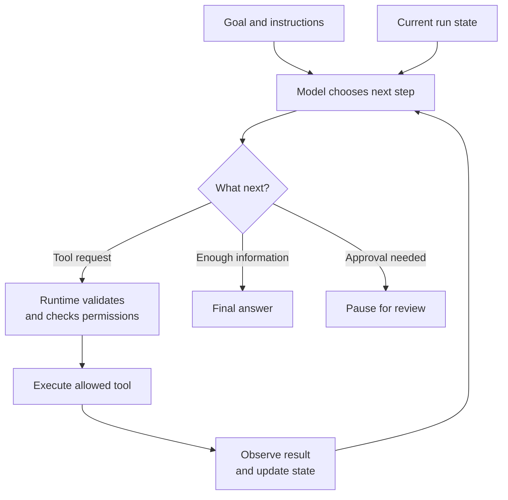
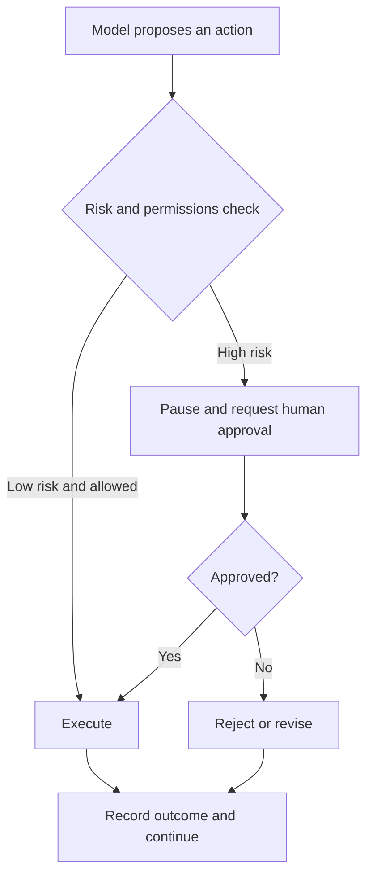
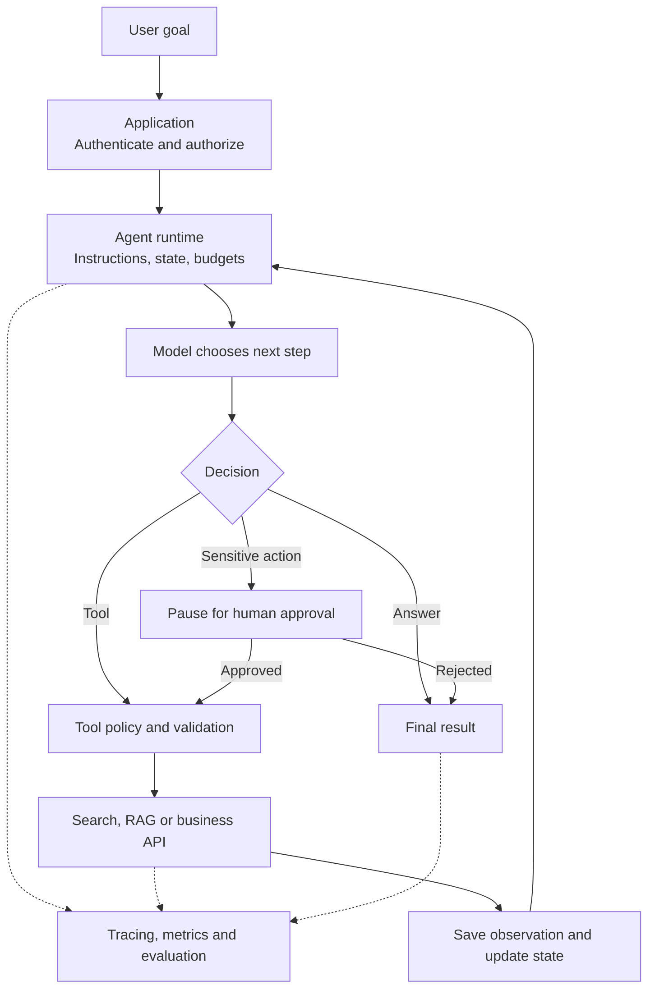

"Check order 123 for me" can be a simple chatbot task: call an order API, read the status, and answer.

Now imagine a different request:

> "This order is late. Find out why, check whether the customer qualifies for a refund, process it if allowed, and ask me first if the amount is too large."

The system may need to inspect the order, look up shipping events, read a refund policy, calculate an amount, decide whether approval is required, execute an action, and report what happened. The number and order of steps can depend on what each earlier step reveals.

The key question is not whether AI can call an API. The [production chatbot we examined earlier](../production-ai-chatbot-request/) could already use a tool. The key question is:

> **Who chooses the next step?**

## 1. Having tools does not automatically make an Agent

Suppose application code says: "For weather questions, call the weather API, then ask the LLM to phrase the result." The model sees tool data, but the developer chose the route. A document pipeline that always searches, summarizes, extracts action items, and returns JSON is still a predefined workflow even if each step calls an LLM.

An Agent gives the model more control over which approved step to take next, based on the current goal and what it has observed so far.

| Pattern | Who determines the path? | Example |
| --- | --- | --- |
| Fixed workflow | Application code | Search → summarize → return JSON |
| Agent | Model within runtime boundaries | Search, inspect results, choose a tool or answer |

[Anthropic distinguishes](https://www.anthropic.com/engineering/building-effective-agents) workflows with predefined code paths from Agents that dynamically direct their process and tool use. The boundary is not a magic label: systems can sit anywhere between the two. The useful distinction is how much control the model has over the workflow.

## 2. The smallest Agent still needs a runtime

At a conceptual level, an Agent needs a model, instructions, and tools. But to *run* a multi-step task, it also needs an application or runtime loop. That runtime calls the model, interprets its output, executes allowed tools, carries results and state forward, checks limits, and returns or pauses at a stopping point.

[OpenAI's Agents SDK documentation](https://developers.openai.com/api/docs/guides/agents/running-agents) describes this loop: call the model, inspect its output, execute tool calls or handoffs, and continue until a final result or another stopping point. The model participates in decisions, but **the model is not the entire Agent system**.

## 3. The loop makes each new observation matter

Imagine the goal: "Find today's three most urgent customer tickets and create follow-up tasks for their account managers."

The model may first ask a search tool for today's urgent tickets. The tool returns 23. The model then chooses how to identify the top three, perhaps requesting customer details. After those results, it asks for follow-up tasks to be created and finally reports the outcome.

The next step depends on the tool result, not only on the original user message. An Agent loop repeatedly does this:

> **Observe current state → choose an action → execute it → inspect the result → decide again.**

This does not require the model to write a ten-step plan before it begins. Planning everything in advance is one valid pattern; choosing one bounded step at a time is another. A deterministic workflow can also contain an Agent at just one ambiguous step, while ordinary code handles predictable parsing, validation, and saving.

## 4. The model proposes; the runtime enforces

Suppose the model proposes `issue_refund(order_id=123, amount=500)`. That is a proposed tool call, not permission to move money.

The runtime or business service must validate the arguments, confirm the user's identity and authority, enforce refund policy, check whether the amount needs approval, and record the result. The model should not be its own final authorization layer.

Good tool design helps. Instead of exposing a broad `execute_sql(query)` capability with excessive privileges, an application might offer `get_customer_order`, `check_refund_eligibility`, and `request_refund`, each with narrow permissions and clear inputs. [Anthropic's tool-design guidance](https://www.anthropic.com/engineering/writing-tools-for-agents) emphasizes clear, distinct purposes and descriptions for tools.

A capable employee can still make mistakes in front of a control panel with 200 unlabeled buttons. Tool interfaces are the Agent's control panel.

## 5. Agent state is larger than chat history

A conversation history records what the user and assistant said. A running task may also need to track the goal, current step, tool outputs, intermediate files, approval decisions, retry count, remaining budget, and whether an action already happened.

| Conversation history | Agent run state |
| --- | --- |
| "User asked for a report" | Which sources have been checked? |
| "Assistant said it is working" | Which tool calls succeeded or failed? |
| Previous messages | What is awaiting approval? What remains? |

Memory is related but different. **Memory** asks what from earlier interactions should remain useful later. **Run state** asks where this task is right now. A coding Agent may not need a six-month-old preference, but it must know which files it changed and which test failed in the current run.

This difference matters when a run pauses. [OpenAI documents](https://developers.openai.com/api/docs/guides/agents/guardrails-approvals) approval as an interruption with resumable state: the application can approve or reject, then resume the same run instead of pretending it is a completely new task.

## 6. An Agent must know when to stop

A loop without limits can keep searching, retrying, and spending tokens long after the useful work is done.

A production runtime needs explicit stopping conditions, such as:

- the goal is complete and the final answer is ready;
- the user must provide missing information;
- a human must approve a sensitive action;
- repeated tool failures prevent progress;
- a maximum turn, time, or cost budget is reached.

The runtime may end successfully, pause intentionally, or fail with a clear reason. [OpenAI's run documentation](https://developers.openai.com/api/docs/guides/agents/running-agents) treats those as distinct outcomes. Autonomy does not mean "run forever"; it means freedom to solve the task *inside a defined boundary*.

## 7. Approval is a design choice about risk

Reading a product catalog and deleting a customer account should not have the same policy. Drafting an email and sending it to 10,000 recipients should not either.

An Agent might be permitted to search, read, calculate, and draft automatically. For a large refund, deletion, deployment, transfer, or publication, the system can pause before the tool executes:

[OpenAI's approval guidance](https://developers.openai.com/api/docs/guides/agents/guardrails-approvals) puts the check at the tool boundary, before side effects occur. A human checkpoint is not evidence that the Agent is "not smart enough." It reflects the consequences of an action.

## 8. Agent failures are harder to see than chatbot failures

A chatbot may simply give the wrong answer. An Agent can misunderstand the goal, pick the wrong tool, supply bad arguments, misread a result, repeat an action, call unnecessary tools, or fail to stop.

A final answer can even be correct while the route to it is wasteful or unsafe. Imagine looking up one product price using six web searches and a database call when one authorized database query would suffice. The answer is right; latency and cost are not.

So Agent evals should inspect more than final text:

- Did the run complete the goal?
- Were the right tools and arguments used?
- Were any calls unnecessary or repeated?
- Did it stop or escalate at the right point?
- Did it respect permissions and approval policy?

[OpenAI's agent-evaluation guidance](https://developers.openai.com/api/docs/guides/agent-evals) uses end-to-end traces of model calls, tool calls, guardrails, and handoffs to inspect workflow behavior. A trace lets you find the *first wrong decision*, not just the disappointing final sentence. Sensitive inputs and tool results still require careful logging controls.

## 9. What a production Agent can look like

The full architecture can be summarized as a controlled loop:

This is a conceptual map, not a requirement for every app. It shows where the Agent really lives: in the interaction among **model, state, tools, and runtime loop**. The runtime turns model decisions into a process that can be paused, limited, audited, and debugged.

## 10. Start with one Agent when one is enough

When a task grows, it is tempting to invent research, planning, coding, review, manager, and security Agents immediately. Sometimes specialists are appropriate. Often one clearly scoped Agent with well-designed tools is simpler to test and operate.

Multiple Agents become worth considering when instructions conflict, tool responsibilities overlap, domains need different ownership or permissions, or one Agent repeatedly chooses the wrong path despite clearer tools and eval-driven improvements. That is an architectural response to a measured limitation, not an automatic upgrade.

[OpenAI's official evaluation guidance](https://developers.openai.com/api/docs/guides/evaluation-best-practices) recommends letting evals drive the decision to split a single Agent; [Anthropic similarly advises](https://www.anthropic.com/engineering/building-effective-agents) starting with the simplest pattern that works.

## Agent architecture is controlled flexibility

An Agent is not merely a chatbot with many tools attached. It is a system in which the model can influence the next computational step as it observes changing task state.

That creates useful flexibility for tasks whose route cannot be fully scripted: investigating a bug, researching a question, or handling a support case end to end. It also reduces predictability. Good Agent architecture therefore balances freedom with clear tool boundaries, state, stop conditions, human approval, and evaluation.

> **The model chooses among permitted next steps. The surrounding system decides what can execute, when to stop, and how to recover.**

When one Agent becomes overloaded with unrelated domains and overlapping tools, that balance may motivate specialists. Until then, a well-bounded single Agent is usually the clearer starting point.

## References

- [Anthropic - Building effective agents](https://www.anthropic.com/engineering/building-effective-agents)
- [Anthropic - Writing effective tools for agents](https://www.anthropic.com/engineering/writing-tools-for-agents)
- [OpenAI Docs - Running agents](https://developers.openai.com/api/docs/guides/agents/running-agents)
- [OpenAI Docs - Guardrails and human review](https://developers.openai.com/api/docs/guides/agents/guardrails-approvals)
- [OpenAI Docs - Evaluate agent workflows](https://developers.openai.com/api/docs/guides/agent-evals)
- [OpenAI Docs - Evaluation best practices](https://developers.openai.com/api/docs/guides/evaluation-best-practices)
