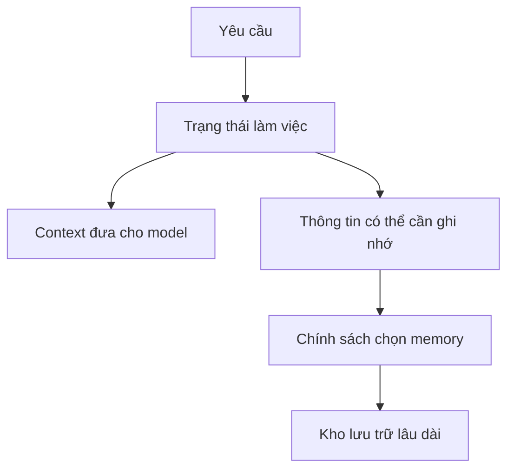

Nhiều sơ đồ mô tả bộ nhớ của Agent như một cơ sở dữ liệu nối với LLM. Hình dung đó hữu ích, nhưng che mất phần khó hơn.

Một hệ thống memory phải quyết định **điều gì đáng giữ lại**, **biểu diễn nó như thế nào**, **ai được đọc**, và **khi nào nó cần quay lại context của model**.

## State không phải memory

**State** là thông tin workflow cần để tiếp tục đúng ngay lúc này. **Memory** là thông tin có thể vẫn hữu ích sau khi bước hiện tại, lượt hội thoại hoặc cả phiên làm việc kết thúc.

Nếu mọi trường trong state đều trở thành memory, hệ thống sẽ tích lũy nhiều thông tin nhiễu. Nếu không giữ lại gì, mỗi lượt mới lại phải bắt đầu từ số không.

## Bốn quyết định của một lớp memory

### 1. Chọn lọc

Một cuộc hội thoại thô chưa phải là memory. Bước chọn lọc quyết định quan sát nào đủ giá trị để giữ lâu dài.

Ứng viên có thể là sở thích ổn định, thông tin đã kiểm chứng, quyết định đã thống nhất, việc chưa hoàn thành và bản tóm tắt của công việc kéo dài nhiều phiên.

### 2. Biểu diễn

Cùng một sự kiện có thể được lưu dưới dạng văn bản gốc, dữ kiện có cấu trúc, bản tóm tắt ngắn, embedding hoặc kết hợp nhiều dạng.

Cách biểu diễn quyết định về sau hệ thống có thể tìm lại thông tin như thế nào.

### 3. Tìm lại

Tìm memory không chỉ là đo mức tương đồng ngữ nghĩa. Thời gian, thực thể liên quan, phạm vi, state của workflow và quyền truy cập đôi khi quan trọng không kém khoảng cách giữa các embedding.

### 4. Đưa vào context

Ngay cả memory đúng cũng có thể gây hại nếu được đưa vào sai prompt. Việc đưa memory trở lại là một quyết định về mức liên quan và ngân sách context.

## Memory dùng chung làm thay đổi kiến trúc

Trong một sản phẩm có nhiều chức năng, mỗi chức năng giữ memory riêng có thể tạo ra sự "mất trí nhớ" không cần thiết. Luồng tạo báo cáo biết một thông tin mà luồng chat tự do lại không thấy, dù cả hai phục vụ cùng một người dùng và cùng lĩnh vực công việc.

Cách tổ chức thường hữu ích hơn là một lớp memory dùng chung với **phạm vi rõ ràng**:

| Phạm vi | Ví dụ | Thời gian tồn tại thường gặp |
| :-- | :-- | :-- |
| Một lượt | Kết quả gọi tool | Vài giây |
| Một phiên | Phân tích đang thực hiện | Vài phút |
| Người dùng | Sở thích | Nhiều tháng |
| Workspace | Quyết định chung | Nhiều tháng |
| Thực thể | Thông tin về cửa hàng hoặc dự án | Tùy trường hợp |

## Cách hình dung hữu ích

Hãy coi memory như một **bộ biên dịch context**. Lưu trữ chỉ là một công đoạn. Giá trị thực sự nằm ở chính sách biến một lịch sử thông tin rất lớn thành phần context nhỏ nhất nhưng đủ để model đưa ra quyết định tiếp theo cho đúng.

Vì vậy, chất lượng memory cuối cùng phải được đánh giá bằng **hành vi của hệ thống**, không phải số lượng vector đã ghi thành công.
