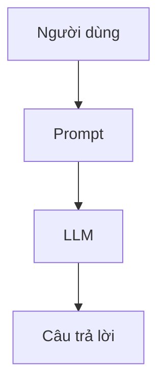
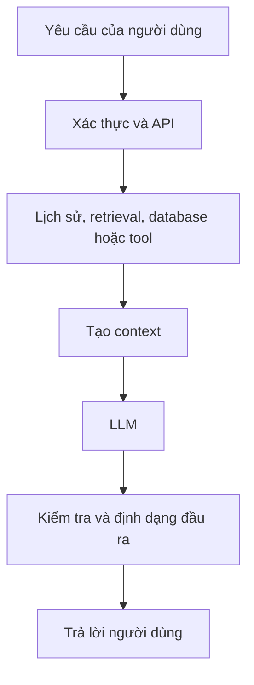
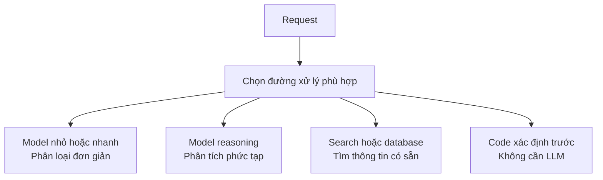
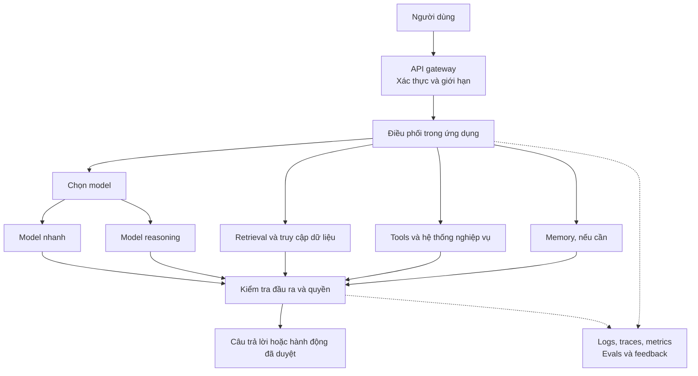

Một AI có thể trả lời rất ấn tượng trong demo. Bạn chọn được model mạnh, nối thêm tài liệu công ty và một API, dựng giao diện chat, rồi trình diễn cho cả team thấy mọi thứ hoạt động.

Hai tuần sau khi ra mắt, người dùng thật lại thấy một câu chuyện khác. Có câu trả lời mất ba giây, câu gần giống mất 25 giây. Traffic tăng thì request timeout. Model gọi đúng tool nhưng có nguy cơ lấy nhầm dữ liệu người khác. Một request trông rẻ, nhưng hóa đơn cuối ngày không rẻ. Nhà cung cấp model gặp sự cố và cả tính năng biến mất.

Model vẫn là model hôm demo. Thứ thay đổi là **môi trường xung quanh nó**.

Ở [bài trước về benchmark](../benchmarks-vs-real-work-vi/), chúng ta đã thấy điểm số cao không bảo đảm AI sẽ làm tốt công việc của bạn. Nhưng ngay cả khi đã chọn đúng model, xây một sản phẩm đáng tin cậy vẫn là một bài toán khác.

## 1. Demo hỏi "Nó có làm được không?"

Một prototype có thể đơn giản như sau:

Đây là cách hợp lý để thử một ý tưởng. Model có đọc được những tài liệu này rồi trả lời câu hỏi không? Nếu có, bạn đã kiểm chứng được một điều có giá trị.

Ở giai đoạn này, một câu trả lời mất 15 giây vẫn có thể chấp nhận. API lỗi thì chạy lại bằng tay. Mới vài đồng nghiệp thử, nên chi phí và khả năng chịu tải của database chưa lộ rõ.

Production đặt ra câu hỏi khó hơn:

> **Nó có làm đúng, đủ nhanh, đủ rẻ, đủ an toàn và đủ ổn định cho nhiều người trong thời gian dài không?**

[AWS mô tả](https://docs.aws.amazon.com/prescriptive-guidance/latest/gen-ai-lifecycle-operational-excellence/preprod-architecting.html) sự chuyển dịch tương tự từ proof of concept sang preproduction: performance và cost trở thành quyết định kiến trúc, không còn là chuyện để sau xử lý.

## 2. Một người dùng và 10.000 người dùng là hai bài toán khác nhau

Một request chạy tốt trong demo chưa cho biết điều gì xảy ra khi nhiều request đến cùng lúc. Provider có rate limit; backend có giới hạn connection; database hoặc tool bên ngoài có thể chậm. Request chậm giữ tài nguyên lâu hơn, trong khi request mới vẫn tiếp tục dồn vào.

Lúc này ta cần đến những kỹ thuật quen thuộc của distributed systems: queue, timeout, load balancing, retry có kiểm soát, backpressure, autoscaling và circuit breaker. Chúng không phải công nghệ "đặc biệt dành cho AI". AI chỉ đưa thêm một thành phần rất mạnh nhưng thường chậm và tốn chi phí vào một hệ thống vốn đã phức tạp.

Chẳng hạn, [tài liệu rate limit của OpenAI](https://developers.openai.com/api/docs/guides/rate-limits) phân biệt giới hạn request mỗi phút với token mỗi phút, và khuyến nghị retry có giới hạn kèm exponential backoff. Cứ liên tục gửi lại khi API đã bị giới hạn có thể làm tình hình tệ hơn.

Con số "10.000 người dùng" ở đây chỉ để minh họa, không phải mốc tải mà hệ thống nào cũng phải đạt. Điều cần kiểm tra là traffic, mức đồng thời và lượng token của **workload thật**.

## 3. Latency của model không phải latency người dùng cảm nhận

Một request thật có thể đi qua nhiều bước:

LLM chỉ là một đoạn của hành trình đó. Nếu retrieval mất một giây, tool mất bốn giây và model mất sáu giây, tăng tốc model thêm 10% cũng khó biến trải nghiệm thành tức thì.

Ít nhất cần phân biệt hai mốc:

- **Time to first token (TTFT):** bao lâu thì người dùng thấy AI bắt đầu trả lời.
- **Time to completion:** bao lâu thì toàn bộ câu trả lời hoàn tất.

Streaming có thể cải thiện mốc đầu mà không nhất thiết rút ngắn mốc sau. Rộng hơn, [hướng dẫn tối ưu latency của OpenAI](https://developers.openai.com/api/docs/guides/latency-optimization) đề cập đến giảm lượng output, bớt những lời gọi không cần thiết, chạy song song các bước độc lập và đôi khi không dùng LLM cho việc không cần LLM.

Câu hỏi của production không chỉ là "Model nhanh bao nhiêu?" mà là **"Toàn bộ hành trình của người dùng nhanh bao nhiêu?"**

## 4. Model mạnh nhất không cần xử lý mọi request

Một model mạnh có thể phân loại email, trích mã đơn hàng, tóm tắt một đoạn văn và giải một bài toán tài chính khó. Đưa tất cả cho cùng model đó rất đơn giản, nhưng có thể làm tăng chi phí và thời gian chờ không cần thiết.

Một router có thể đưa từng loại việc đến đường xử lý phù hợp:

Không phải app nào cũng cần router. Đây chỉ là một ví dụ về cân bằng **chất lượng, chi phí và latency**. Như đã bàn trong bài [Một siêu AI hay một đội AI chuyên biệt?](../one-super-ai-or-team-of-specialists-vi/), nhiều model có thể cùng tồn tại vì mỗi công việc cần một mức tài nguyên khác nhau. [AWS cũng khuyến nghị](https://docs.aws.amazon.com/prescriptive-guidance/latest/gen-ai-lifecycle-operational-excellence/preprod-architecting.html) chọn model vừa đủ mạnh khi vẫn đạt yêu cầu chất lượng.

## 5. Một request rẻ vẫn có thể thành hóa đơn lớn

Giả sử, chỉ để minh họa, một request tốn $0.02 và sản phẩm nhận 500.000 request mỗi ngày:

> **$0.02 × 500.000 = $10.000 mỗi ngày**

Đó là chưa tính retrieval, embedding, reranking, storage, monitoring, tool bên ngoài, compute và retry. Chi phí thật phụ thuộc hoàn toàn vào workload và nhà cung cấp.

Khi scale, những quyết định nhỏ bắt đầu quan trọng: Có thể cache câu trả lời một cách an toàn không? Câu nào cũng cần gửi toàn bộ lịch sử hội thoại sao? Có cần retrieve 20 tài liệu không? Model nhỏ hơn có đạt chuẩn chất lượng không? Các bước độc lập có thể chạy song song không? Chạy song song có thể giảm latency nhưng không nhất thiết giảm tổng chi phí.

[AWS khuyến nghị xây cost model](https://docs.aws.amazon.com/prescriptive-guidance/latest/gen-ai-lifecycle-operational-excellence/preprod-architecting.html) và cập nhật nó theo query volume, token usage, giá model cùng hạ tầng hỗ trợ. Một sản phẩm càng được dùng nhiều càng lỗ vẫn là một sản phẩm có vấn đề, dù câu trả lời rất hay.

## 6. HTTP 200 không có nghĩa câu trả lời đúng

Hãy tưởng tượng assistant của công ty nói: "Nhân viên được nghỉ 15 ngày." API trả về `200 OK`. Văn bản trôi chảy, định dạng đẹp. Nhưng chính sách thật quy định 12 ngày.

Với hạ tầng, request đã thành công. Với người dùng, nó thất bại.

Vì vậy cần theo dõi hai lớp:

| Sức khỏe hệ thống | Hành vi AI |
| --- | --- |
| Uptime, latency, error rate, queue depth | Chất lượng câu trả lời, retrieval, quyết định gọi tool, phản hồi người dùng |
| Tải compute và database | Token usage, chi phí mỗi task, kết quả eval |

[OpenAI lưu ý](https://developers.openai.com/api/docs/guides/evaluation-best-practices) output của generative AI có tính biến thiên, nên test phần mềm truyền thống một mình không đủ đo mọi hành vi quan trọng. [AWS khuyến nghị](https://docs.aws.amazon.com/prescriptive-guidance/latest/gen-ai-lifecycle-operational-excellence/preprod-hardening.html) kết hợp metrics, logs, traces, tín hiệu chất lượng và feedback. Với prompt hay response nhạy cảm, chỉ ghi log khi chính sách quyền riêng tư và quyền truy cập cho phép.

Một AI system có thể gần như luôn online nhưng vẫn đưa ra câu trả lời tệ. **Hạ tầng khỏe không đồng nghĩa sản phẩm tốt.**

## 7. Khi AI được hành động, sai lầm có hậu quả lớn hơn

Chatbot nhớ nhầm giờ họp thì gây phiền. Agent hiểu sai "hủy đặt chỗ của tôi" rồi gọi API hủy chỗ là một mức rủi ro khác.

Tool calling có thể cho Agent biết có những hành động nào. Nó không tự quyết định người dùng nào được phép thực hiện hành động đó. Ranh giới quyền hạn phải được kiểm tra ở application và các dịch vụ cung cấp tool.

Một assistant đọc lịch không nên tự có quyền xóa lịch. Agent phân tích database có thể không cần quyền ghi. Hoàn tiền số nhỏ có thể tự động; hoàn tiền số lớn có thể phải chờ người phụ trách phê duyệt.

Các lớp kiểm soát thực tế gồm authentication, authorization theo từng người dùng, quyền tối thiểu cho tool, kiểm tra đầu vào, phê duyệt hành động rủi ro cao và audit log. [Hướng dẫn production của OpenAI](https://developers.openai.com/api/docs/guides/production-best-practices) xem bảo mật và quản lý quyền truy cập là các vấn đề riêng cần giải quyết. Model thông minh hơn không thay thế được kiểm tra quyền.

## 8. Mỗi thành phần hữu ích cũng thêm một kiểu lỗi

RAG đưa kiến thức nội bộ vào câu trả lời, nhưng retriever có thể chọn nhầm tài liệu, phiên bản cũ hoặc tài liệu người dùng không có quyền xem. Tool kết nối hệ thống nghiệp vụ, nhưng có thể timeout hoặc bị gọi hai lần. Memory giữ lại ngữ cảnh, nhưng memory cũ hoặc lẫn giữa hai người dùng có thể làm câu trả lời tệ đi.

| Thành phần thêm vào | Nó giải quyết gì? | Câu hỏi mới xuất hiện |
| --- | --- | --- |
| Retrieval | Model thiếu dữ liệu riêng hoặc mới | Có tìm đúng tài liệu và đúng quyền không? |
| Tools | Model không thể tác động tới hệ thống ngoài | Timeout, retry hoặc gọi trùng thì sao? |
| Memory | Ngữ cảnh không tồn tại lâu dài | Memory còn đúng và thuộc đúng người không? |

Đó là lý do production AI có thể trở thành một **hệ thống gồm nhiều thành phần**, không chỉ "model + prompt". Nhưng điều đó **không** có nghĩa càng nhiều service càng tốt. Chỉ thêm một lớp khi nó giải quyết vấn đề đã thấy rõ; nếu không, ta chỉ cộng thêm bài toán distributed systems vào bài toán AI đang có.

## 9. Chuẩn bị cho ngày một thành phần gặp lỗi

Demo thường được trình diễn lúc mọi dependency đều khỏe. Production phải xử lý cả khi model timeout, vector database không truy cập được hoặc API nghiệp vụ bị lỗi.

Tùy tác vụ, cách phản ứng phù hợp có thể là retry có giới hạn, chuyển sang model dự phòng, trả lời từ cache có ghi rõ giới hạn, chuyển sang chế độ ít chức năng hơn hoặc bàn giao cho con người. Đôi khi báo lỗi rõ ràng còn an toàn hơn đưa dữ liệu cũ hoặc dữ liệu sai quyền.

Nếu AI recommendation gặp sự cố, website bán hàng có thể hiển thị sản phẩm bán chạy. Nếu retriever bị lỗi, assistant có thể nói rằng nó chưa kiểm chứng được chính sách, thay vì tự đoán.

Đó là **graceful degradation**: một thành phần hỏng làm giảm khả năng của hệ thống, nhưng không nhất thiết kéo sập cả sản phẩm. [Tài liệu reliability của Google Cloud](https://docs.cloud.google.com/architecture/framework/reliability/graceful-degradation) giải thích nguyên tắc này và nhấn mạnh việc kiểm thử nó trong điều kiện thực tế.

## 10. Kiến trúc dần hình thành xung quanh model

Khi yêu cầu thực tế xuất hiện, demo ban đầu có thể phát triển thành một hệ thống như sau:

Đây là bản đồ các trách nhiệm *có thể* cần, **không phải template bắt buộc**. Chatbot nhỏ có thể không cần router hay memory. Workflow batch có thể không cần streaming. App không dùng RAG thì không cần vector database.

Điều thay đổi là khối lượng engineering xung quanh model: performance, cost, quyền truy cập, quan sát hệ thống và phục hồi khi lỗi. [AWS nhấn mạnh end-to-end tracing](https://docs.aws.amazon.com/prescriptive-guidance/latest/gen-ai-lifecycle-operational-excellence/preprod-hardening.html) vì một request của người dùng có thể đi qua nhiều lần gọi model, tool và database trước khi hoàn tất.

## Động cơ mạnh vẫn cần cả chiếc xe

Động cơ Formula 1 không tự tạo thành chiếc xe an toàn nếu thiếu phanh, tay lái, hệ thống làm mát, cảm biến và khung xe. Tương tự, model mạnh nâng trần năng lực của AI product, nhưng không tự biến sản phẩm thành thứ đáng tin cậy.

Chất lượng, latency, cost, security, scalability, observability và trải nghiệm người dùng luôn có những điểm phải đánh đổi. Thêm context có thể cải thiện câu trả lời nhưng tăng thời gian chờ. Retry giúp chịu lỗi nhưng cũng có thể làm tải tăng. Cache giảm thời gian và chi phí nhưng đặt ra câu hỏi về độ mới của dữ liệu. Agent linh hoạt hơn nhưng khó dự đoán hơn.

Đây là những **trade-off kiến trúc**, không phải chi tiết có thể để đến sau khi ra mắt mới sửa.

> **Demo chứng minh một ý tưởng AI có thể chạy. Production chứng minh cả hệ thống có thể tiếp tục hoạt động tốt cho người dùng thật.**

## Nguồn tham khảo

- [AWS - Kiến trúc ứng dụng generative AI cho production](https://docs.aws.amazon.com/prescriptive-guidance/latest/gen-ai-lifecycle-operational-excellence/preprod-architecting.html)
- [AWS - Tăng độ tin cậy cho ứng dụng generative AI](https://docs.aws.amazon.com/prescriptive-guidance/latest/gen-ai-lifecycle-operational-excellence/preprod-hardening.html)
- [OpenAI - Rate limits](https://developers.openai.com/api/docs/guides/rate-limits)
- [OpenAI - Latency optimization](https://developers.openai.com/api/docs/guides/latency-optimization)
- [OpenAI - Evaluation best practices](https://developers.openai.com/api/docs/guides/evaluation-best-practices)
- [OpenAI - Production best practices](https://developers.openai.com/api/docs/guides/production-best-practices)
- [Google Cloud - Design for graceful degradation](https://docs.cloud.google.com/architecture/framework/reliability/graceful-degradation)
