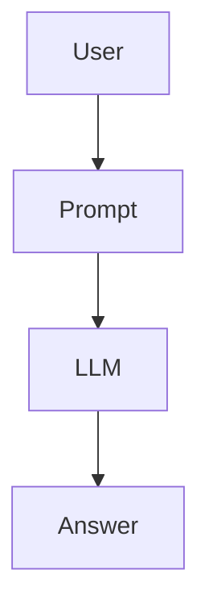
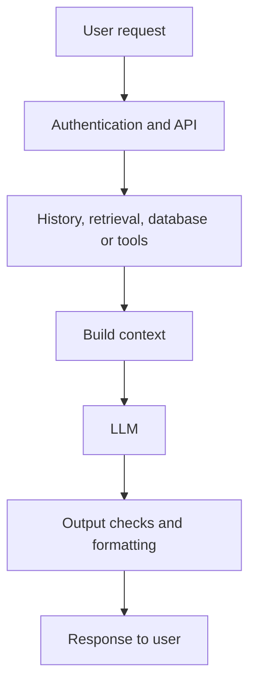
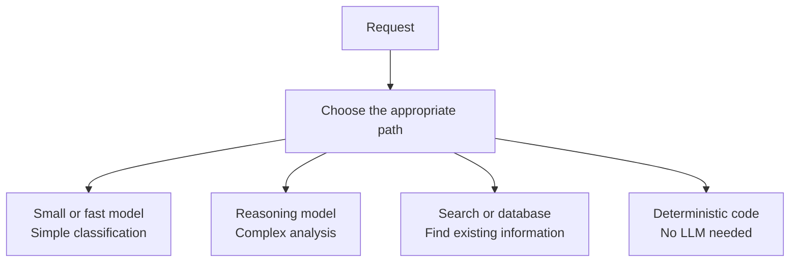
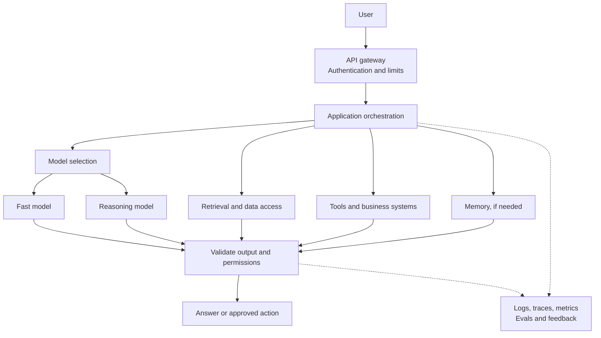

An AI demo can be genuinely impressive. You choose a strong model, connect company documents and an API, build a chat interface, and show your team that it works.

Two weeks after launch, real users tell a different story. One answer takes three seconds; a similar one takes 25. Traffic causes timeouts. The model calls the right tool but might retrieve another user's data. A cheap-looking request becomes an expensive daily bill. The model provider has an outage and the feature disappears.

The model is the same one that worked in the demo. What changed was **the environment around it**.

In the [previous article on benchmarks](../benchmarks-vs-real-work/), we saw why a high score does not guarantee success on your own work. Even after choosing the right model, however, building a dependable product is another problem.

## 1. A demo asks "Can it work?"

A prototype can be as simple as:

That is a sensible way to test an idea. Can the model read these documents and answer a question? If yes, you have learned something valuable.

At this stage, a 15-second response may be tolerable. A failed request can be retried manually. Only a few colleagues are testing, so cost and database capacity are not yet obvious problems.

Production asks a harder question:

> **Can it do the right thing, quickly, affordably, safely, and consistently for many people over time?**

[AWS describes](https://docs.aws.amazon.com/prescriptive-guidance/latest/gen-ai-lifecycle-operational-excellence/preprod-architecting.html) the same shift from proof of concept to preproduction: performance and cost become architectural decisions, not cleanup tasks for later.

## 2. One user and 10,000 users are different problems

A successful request in a demo does not tell you what happens when requests arrive together. Model providers have rate limits; your backend has connection limits; a database or external tool may slow down. Slow requests occupy resources while new ones keep arriving.

This is where familiar distributed-systems techniques matter: queues, timeouts, load balancing, controlled retries, backpressure, autoscaling, and circuit breakers. They are not uniquely "AI" technologies. AI adds a powerful but often slow and costly component to an already complex system.

For example, [OpenAI's rate-limit guidance](https://developers.openai.com/api/docs/guides/rate-limits) distinguishes requests per minute from tokens per minute and recommends bounded retries with exponential backoff. Repeatedly hammering a throttled API can make the situation worse.

The number "10,000 users" here is illustrative, not a capacity target. The practical question is how your *own* request volume, concurrency, and token usage behave under load.

## 3. Model latency is not user latency

A real request may travel through several steps:

The LLM is only one part of that journey. If retrieval takes one second, a tool takes four, and generation takes six, shaving 10% off model time will not transform the whole experience.

Measure at least two different moments:

- **Time to first token:** when the user first sees a response begin.
- **Time to completion:** when the full response is ready.

Streaming can improve the first without necessarily shortening the second. More broadly, [OpenAI's latency guidance](https://developers.openai.com/api/docs/guides/latency-optimization) suggests reducing output, avoiding unnecessary calls, parallelizing independent steps, and sometimes not using an LLM at all.

The production question is not only "How fast is the model?" It is **"How fast is the entire user journey?"**

## 4. The strongest model is not the right tool for every request

A powerful model might classify an email, extract an order number, summarize a paragraph, and solve a difficult financial question. Sending all four requests to it is simple, but simplicity may come with unnecessary cost and delay.

A router can direct different work to different paths:

This is not a rule that every app needs a router. It is an example of the quality-cost-latency trade-off. As discussed in [One Super AI or a Team of Specialists?](../one-super-ai-or-team-of-specialists/), a system may combine models because different tasks deserve different resources. [AWS likewise recommends](https://docs.aws.amazon.com/prescriptive-guidance/latest/gen-ai-lifecycle-operational-excellence/preprod-architecting.html) right-sized models where they meet the quality bar.

## 5. Cheap per request can be expensive per day

Suppose, purely as an illustration, one request costs $0.02 and the product handles 500,000 requests per day:

> **$0.02 × 500,000 = $10,000 per day**

That excludes retrieval, embeddings, reranking, storage, monitoring, external tools, compute, and retries. Actual costs depend on the workload and provider.

At scale, small design decisions matter: Can an answer be cached safely? Does every question need the whole conversation history? Do we need 20 retrieved documents? Could a smaller model meet the quality target? Could independent steps run concurrently? Parallelism may lower latency without lowering total cost.

[AWS recommends a living cost model](https://docs.aws.amazon.com/prescriptive-guidance/latest/gen-ai-lifecycle-operational-excellence/preprod-architecting.html) that includes query volume, token usage, model prices, and supporting infrastructure. A product whose usage grows faster than its economic value has a production problem even if its answers are excellent.

## 6. HTTP 200 does not mean the answer is right

Imagine a company assistant answers: "Employees receive 15 days of leave." The API returns `200 OK`. The text is fluent. But the actual policy says 12 days.

From an infrastructure perspective, the request succeeded. From the user's perspective, it failed.

That is why monitoring needs two layers:

| System health | AI behavior |
| --- | --- |
| Uptime, latency, error rate, queue depth | Answer quality, retrieval quality, tool decisions, user feedback |
| Compute and database load | Token usage, cost per task, evaluation results |

[OpenAI notes](https://developers.openai.com/api/docs/guides/evaluation-best-practices) that generative output varies, so conventional software tests alone cannot measure every important behavior. [AWS recommends](https://docs.aws.amazon.com/prescriptive-guidance/latest/gen-ai-lifecycle-operational-excellence/preprod-hardening.html) correlating metrics, logs, traces, quality signals, and feedback. Log sensitive prompts or responses only when privacy and access policies permit it.

An AI system can be available nearly all the time and still give poor answers. **Infrastructure health is not the same as product quality.**

## 7. When AI can act, mistakes become more consequential

A chatbot getting a meeting time wrong is inconvenient. An Agent misunderstanding "cancel my booking" and calling a cancellation API is a different class of failure.

Tool calling can tell an Agent what actions exist. It does not decide which user is authorized to perform them. That boundary belongs in the surrounding application and tool services.

A read-only calendar assistant should not automatically gain delete access. A database analysis Agent may not need write access. A small refund might be automated; a large one might require a person to approve it.

Practical controls include authentication, per-user authorization, least-privilege tool credentials, input validation, approval for high-risk actions, and an audit trail. [OpenAI's production guidance](https://developers.openai.com/api/docs/guides/production-best-practices) treats security and access management as production concerns. A smarter model cannot replace permission checks.

## 8. Every useful component adds another failure mode

RAG can supply internal facts, but retrieval may choose the wrong document, a stale version, or material the user should not see. A tool can connect to a business system, but it may time out or be invoked twice. Memory can preserve context, but a stale or cross-user memory can make an answer worse.

| Added capability | Problem it solves | New question it creates |
| --- | --- | --- |
| Retrieval | Model lacks current or private facts | Was the right, authorized document found? |
| Tools | Model cannot act in external systems | What happens on timeout, retry, or duplicate execution? |
| Memory | Context does not persist | Is this memory current and attached to the right user? |

This is why production AI can become a *compound system*, not just "model + prompt." But it does **not** mean more services are always better. Add a layer when it solves a demonstrated problem; otherwise you may only add distributed-systems problems to the AI problems you already had.

## 9. Design for the day something fails

A demo is usually shown when every dependency is healthy. Production has to handle a model timeout, an unavailable vector database, or a failed business API.

Depending on the task, the right response may be a bounded retry, a fallback model, a clearly labeled cached answer, a reduced-feature mode, or a handoff to a human. Sometimes it is safer to fail visibly than to serve stale or unauthorized information.

If recommendation AI is unavailable, an e-commerce site might show bestsellers. If a document retriever is unavailable, an assistant might say it cannot verify a policy instead of inventing one.

This is **graceful degradation**: a failed component reduces capability without necessarily taking down the entire product. [Google Cloud's reliability guidance](https://docs.cloud.google.com/architecture/framework/reliability/graceful-degradation) explains the principle and the importance of testing it under realistic conditions.

## 10. The architecture grows around the model

As requirements appear, the simple demo can evolve into something like this:

This is a map of possible responsibilities, **not** a mandatory template. A small chatbot may need no router or memory. A batch workflow may need no streaming. An app without RAG does not need a vector database.

What changes is the engineering work surrounding the model: performance, cost, permissions, observability, and recovery. [AWS emphasizes end-to-end tracing](https://docs.aws.amazon.com/prescriptive-guidance/latest/gen-ai-lifecycle-operational-excellence/preprod-hardening.html) because one user request can include several model calls, tools, and database queries before it finishes.

## A strong engine still needs the rest of the vehicle

A Formula 1 engine cannot make a safe car without brakes, steering, cooling, sensors, and a chassis. Likewise, a strong model raises the capability ceiling of an AI product, but does not make the product reliable by itself.

Quality, latency, cost, security, scalability, observability, and user experience pull against each other. More context may improve an answer but increase delay. Retries can improve resilience but amplify load. Caching can save time and money but raise freshness questions. An Agent may be flexible but harder to predict.

These are architectural trade-offs, not details to fix after launch.

> **A demo proves that an AI idea can work. Production proves that the whole system can keep working for real people.**

## References

- [AWS - Architecting generative AI applications for production](https://docs.aws.amazon.com/prescriptive-guidance/latest/gen-ai-lifecycle-operational-excellence/preprod-architecting.html)
- [AWS - Hardening the generative AI application](https://docs.aws.amazon.com/prescriptive-guidance/latest/gen-ai-lifecycle-operational-excellence/preprod-hardening.html)
- [OpenAI - Rate limits](https://developers.openai.com/api/docs/guides/rate-limits)
- [OpenAI - Latency optimization](https://developers.openai.com/api/docs/guides/latency-optimization)
- [OpenAI - Evaluation best practices](https://developers.openai.com/api/docs/guides/evaluation-best-practices)
- [OpenAI - Production best practices](https://developers.openai.com/api/docs/guides/production-best-practices)
- [Google Cloud - Design for graceful degradation](https://docs.cloud.google.com/architecture/framework/reliability/graceful-degradation)

