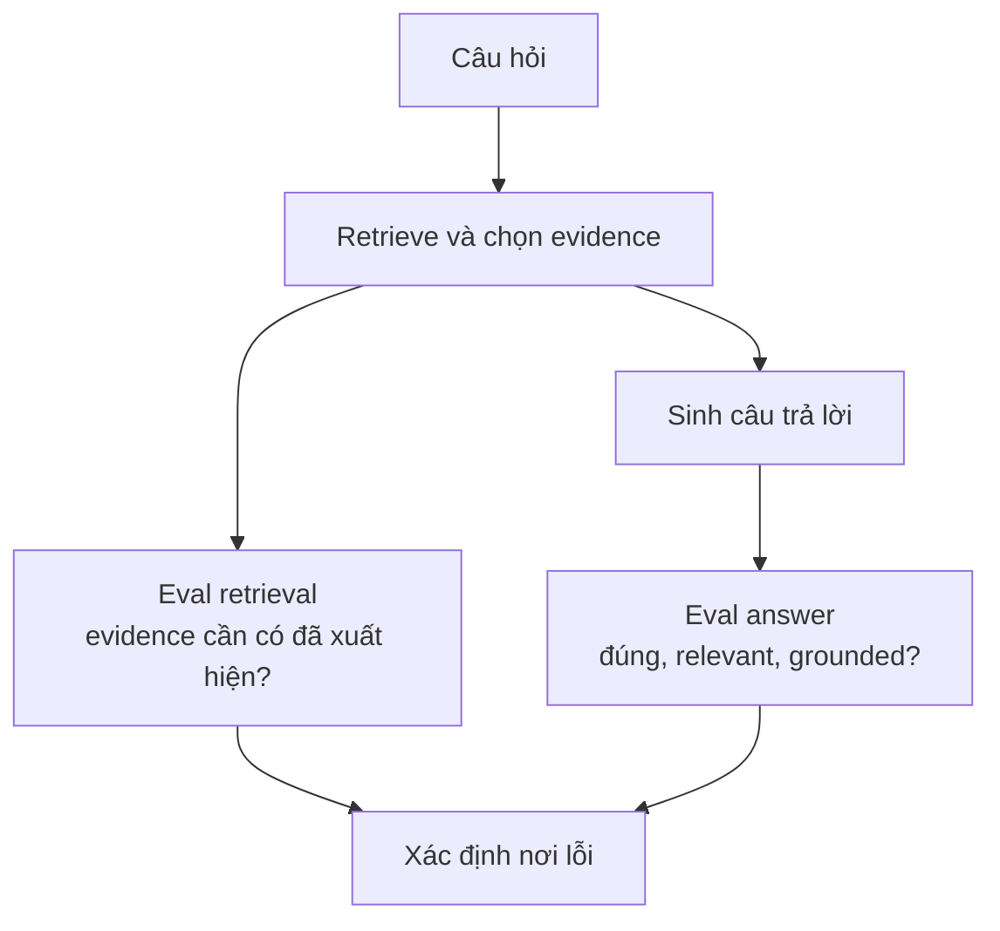
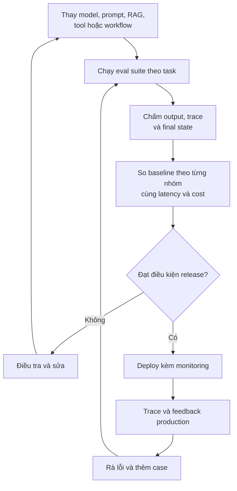

Một model mới ra mắt với benchmark cao hơn và demo ấn tượng hơn. Trước khi thay model trong production, có một câu hỏi hữu ích hơn: **Hệ thống của bạn có thực sự làm công việc của nó tốt hơn không?**

Ở [bài trước về observability](../ai-observability-wrong-answer-vi/), chúng ta dùng trace để xem tài liệu nào được retrieve, model và tool nào được gọi, mỗi bước mất bao lâu và tốn bao nhiêu token. Một trace có thể hoàn toàn khỏe:

| Bước | Thời gian |
| --- | ---: |
| Retrieval | 0,4 s |
| Model | 2,1 s |
| Tool | 0,7 s |
| HTTP response | 200 OK |

Nhưng nó chưa tự trả lời được: **Kết quả có tốt không?**

Đó là công việc của evaluation, thường gọi ngắn là **eval**.

## 1. Eval bắt đầu từ việc định nghĩa thành công

Test phần mềm truyền thống thường so output với một kỳ vọng rất rõ. Hai cộng hai phải bằng bốn. Một request tạo đơn hàng hợp lệ có thể phải tạo đúng một đơn.

Output GenAI linh hoạt hơn. Hai bản tóm tắt khác câu chữ vẫn có thể đều rất tốt. Vì vậy "Output có giống hệt chuỗi expected không?" thường là câu hỏi sai.

Eval nên hỏi những điều phản ánh task thật:

- Câu trả lời có đúng sự thật và có bằng chứng không?
- Nó có giải quyết yêu cầu của user không?
- Agent có chọn đúng tool và argument không?
- Nó có tránh hành động vượt quyền không?
- Kết quả có đạt giới hạn latency và cost chấp nhận được không?

[Hướng dẫn evaluation của OpenAI](https://developers.openai.com/api/docs/guides/evaluation-best-practices) mô tả eval là bài test có cấu trúc, bám vào task thực tế của ứng dụng thay vì chỉ dùng metric học thuật chung chung. [Anthropic cũng lưu ý](https://www.anthropic.com/engineering/demystifying-evals-for-ai-agents) rằng viết eval buộc team thống nhất thế nào được coi là thành công.

Câu hỏi đầu tiên vì vậy không phải "Dùng model nào để chấm?" mà là **"Sản phẩm này thực sự phải làm đúng điều gì?"**

## 2. Biến yêu cầu mơ hồ thành một task kiểm tra được

Giả sử khách hàng nói: "Đơn của tôi chưa tới. Kiểm tra giúp tôi." Một tiêu chí success quá yếu là "Agent có trả lời". Gần như câu nào cũng pass.

Một task tốt hơn có thể yêu cầu hệ thống tìm đúng đơn, tra đúng trạng thái, không bịa thông tin giao hàng, không tự hoàn tiền khi chưa được phép và giải thích bước tiếp theo rõ ràng.

Một case cụ thể:

| Thành phần | Ví dụ |
| --- | --- |
| Input | "Kiểm tra giúp tôi đơn 12345" |
| Hành vi cần có | Gọi order lookup với ID 12345; không gọi refund |
| Kết quả cần có | Báo đúng trạng thái trong môi trường test |
| Ràng buộc | Không lộ dữ liệu khách khác; không tự làm hành động chưa duyệt |

Task này **không** ép Agent viết đúng một câu văn. Nó mô tả hành vi và kết quả thật sự quan trọng.

Khi nói về Agent eval, [Anthropic dùng](https://www.anthropic.com/engineering/demystifying-evals-for-ai-agents) vài thuật ngữ hữu ích: **task** là test case; **trial** là một lần chạy; **grader** chấm một khía cạnh của thành công; **trace hoặc transcript** ghi quá trình chạy. **Outcome** là trạng thái cuối của môi trường. Agent nói "Đã hoàn tiền" không chứng minh việc hoàn tiền thật sự xảy ra.

## 3. Bắt đầu từ lỗi thật, không cần dựng một benchmark khổng lồ

Eval dataset không nhất thiết phải có hàng nghìn case ngay từ đầu. Anthropic gợi ý **20 đến 50 task đơn giản lấy từ những lỗi thực tế** có thể là điểm khởi đầu tốt cho một Agent còn mới, rồi mở rộng khi sản phẩm trưởng thành. Đây là kinh nghiệm khởi đầu, không phải cỡ mẫu đúng cho mọi hệ thống.

Hãy nghĩ tới những lỗi support team đã gặp:

- User nhập order ID theo format lạ.
- User chỉ viết "returns" hoặc đổi chủ đề giữa chừng.
- Tool trả một field mơ hồ.
- Refund cần approval.
- Agent gọi cùng một tool hai lần.

Mỗi sự cố có thể trở thành một test case. Như vậy bug production biến thành regression test, thay vì chỉ được vá một lần rồi quên.

Dataset nên có request phổ biến, case khó, lỗi đã biết, edge case và safety case. Nó cần kiểm tra cả việc hệ thống **không được** làm, chứ không chỉ những việc phải làm. Một trăm biến thể gọn gàng của "Đơn hàng 123 ở đâu?" không nói được nhiều về user viết "đơn đâu r" hoặc không nhớ mã đơn.

[Hướng dẫn của OpenAI](https://developers.openai.com/api/docs/guides/evaluation-best-practices) khuyến nghị dataset theo task, phản ánh usage thật và chứa cả edge lẫn adversarial case. Ví dụ lấy từ production cần được rà quyền riêng tư, che dữ liệu nhạy cảm và kiểm soát truy cập trước khi thành dữ liệu test dùng lại.

## 4. Chọn grader phù hợp với câu hỏi

Một task có thể cần nhiều grader. Đừng ép toàn bộ chất lượng vào một score khi chưa hiểu các phần của nó.

| Loại grader | Hợp với | Ví dụ |
| --- | --- | --- |
| Code-based | Sự kiện và state kiểm tra được chính xác | Đúng tool, đúng order ID, JSON hợp lệ, test pass |
| Model-based | Nhận định cần rubric rõ ràng | Relevance, tone, completeness, grounding |
| Human | Phán đoán chuyên môn hoặc case mơ hồ | Diễn giải policy, edge case tranh cãi, kiểm tra judge |

Nếu code kiểm tra được refund tool *không* bị gọi, hãy dùng code. Nhờ model khác đoán một tool call đã xảy ra hay chưa chỉ thêm bất định.

Khi phải dùng model để chấm, hãy cho nó rubric hẹp và đủ evidence. So sánh hai câu trả lời hoặc phân loại theo tiêu chí cụ thể thường hữu ích hơn hỏi mở "Câu này có tốt không?" [OpenAI bàn về](https://developers.openai.com/api/docs/guides/evaluation-best-practices) việc dùng tiêu chí rõ ràng và đối chiếu chấm tự động với đánh giá của con người.

Model judge vẫn là model. Nó có thể thích câu trả lời dài, hiểu sai policy hoặc bất đồng với chuyên gia. Hãy so điểm của nó với ví dụ đã được con người chấm, đọc những chỗ bất đồng và cho phép "không đủ thông tin để kết luận". [Anthropic khuyến nghị](https://www.anthropic.com/engineering/demystifying-evals-for-ai-agents) hiệu chỉnh model grader bằng đánh giá của chuyên gia.

## 5. RAG cần eval riêng retrieval và answer

Giả sử trợ lý trả "12 ngày" trong khi policy thử việc hiện tại ghi "10 ngày". Grader của final answer có thể đánh FAIL, nhưng chưa chỉ ra phải sửa đâu.

[Pipeline RAG](../production-rag-architecture-vi/) đặt ra ít nhất hai câu hỏi:

1. Retrieval và context assembly có đưa evidence đúng, mới nhất tới model không?
2. Với evidence đó, phần generation có tạo câu trả lời đúng, relevant và grounded không?

Ở retrieval, có thể kiểm tra nguồn cần thiết có xuất hiện trong top results không, các chunk được chọn có liên quan không, và policy cũ có bị ưu tiên hơn policy mới không. Ở answer, kiểm tra correctness, độ đầy đủ và các nhận định có thực sự dựa trên nguồn đã cung cấp không. [Tài liệu OpenAI](https://developers.openai.com/api/docs/guides/evaluation-best-practices) dùng bài toán hỏi đáp trên tài liệu để minh họa việc đánh giá context bên cạnh response cuối.

Nếu evidence chưa từng tới model, đổi model có thể không giúp gì. Nếu evidence đúng đã có mà answer vẫn sai, hãy xem generation, prompt hoặc lớp kiểm tra câu trả lời.

## 6. Agent eval phải nhìn cả đường đi lẫn kết quả

Agent có thể tới đúng final answer bằng một đường đi tốn kém hoặc thiếu an toàn. Để kiểm tra tồn kho sản phẩm A, một run có thể dùng inventory tool một lần; run khác web search hai lần, hỏi CRM, gọi inventory hai lần rồi mới trả lời.

Cả hai có thể báo cùng con số. Chỉ một cách có process hợp lý.

Agent eval hữu ích có thể chấm:

- Goal completion và final state thực tế.
- Chọn tool và argument.
- Hành động thừa, loop và handoff.
- Tuân thủ approval và quyền truy cập.
- Latency, token, cost và khả năng phục hồi lỗi.

[Hướng dẫn Agent eval của OpenAI](https://developers.openai.com/api/docs/guides/agent-evals) mô tả trace grading để kiểm tra tool selection, handoff và policy adherence. Trace làm đường đi hiện ra, nhưng grader vẫn phải quyết định đường đi ấy có chấp nhận được không.

Đừng ép task chỉ được pass khi Agent đi đúng một chuỗi bước, nếu có nhiều đường an toàn đều đạt mục tiêu. Hãy nghiêm với điều quan trọng, như "không hoàn tiền khi chưa được duyệt", và linh hoạt với chi tiết triển khai không ảnh hưởng kết quả.

## 7. Một lần pass không chứng minh hệ thống ổn định

Cùng một task có thể pass lần này và fail lần khác. Chẳng hạn năm trial cho bốn pass, một fail. Thông tin đó hữu ích hơn một lần pass, dù năm trial vẫn quá ít để khẳng định chính xác độ tin cậy.

Hãy chạy nhiều trial khi variability quan trọng, đặc biệt với Agent nhiều bước hoặc hành vi an toàn liên quan trực tiếp tới user. Cần phân biệt xác suất thành công ngay lần đầu với khả năng "ít nhất một lần thành công sau nhiều lần thử". Khách hàng thường chỉ trải nghiệm lần đầu, không phải kết quả tốt nhất trong năm lượt. [Anthropic phân tích](https://www.anthropic.com/engineering/demystifying-evals-for-ai-agents) rõ sự khác biệt này khi nói về tính không xác định của Agent.

Số trial nên tương xứng quyết định cần đưa ra. Kiểm tra nhanh lúc development có thể cần ít hơn release gate của workflow quan trọng. Hãy báo cả cỡ mẫu và sự không chắc chắn, thay vì coi mọi tỷ lệ phần trăm đều chính xác tuyệt đối.

## 8. Capability suite và regression suite trả lời hai câu hỏi khác nhau

**Capability suite** hỏi hệ thống làm được công việc mới, khó hơn tới đâu. **Regression suite** hỏi những hành vi từng ổn định có còn hoạt động không.

| Loại suite | Câu hỏi | Thường chứa |
| --- | --- | --- |
| Capability | "Giờ làm được task khó hơn chưa?" | Case mới, khó, còn nhiều dư địa cải thiện |
| Regression | "Thay đổi này có làm hỏng việc phải chạy không?" | Bug đã biết, flow chính, safety check |

Prompt mới có thể giúp research tốt hơn nhưng khiến Agent quên xin approval trước khi refund. Model mới có thể reasoning tốt hơn nhưng chọn tool kém hơn.

Cần cả hai loại. [Anthropic mô tả](https://www.anthropic.com/engineering/demystifying-evals-for-ai-agents) cách chuyển những capability case đã làm tốt vào regression suite khi chúng trở thành hành vi sản phẩm phải giữ.

## 9. So sánh model trên workload của chính bạn

Benchmark công khai là một tín hiệu nền hữu ích, như [bài benchmark trước](../benchmarks-vs-real-work-vi/) đã bàn. Nó không tự quyết định việc deploy cho support Agent của bạn.

Hãy chạy system hiện tại và bản candidate trên **cùng** task set, với dữ liệu và môi trường tool được kiểm soát giống nhau nếu có thể. So theo từng chiều, không chỉ theo điểm trung bình:

| Chiều đánh giá | Cần hỏi gì? |
| --- | --- |
| Support correctness | Trả lời đơn hàng và policy có chính xác hơn không? |
| RAG grounding | Nhận định có được evidence hỗ trợ không? |
| Tool use | Có chọn đúng tool với argument đúng không? |
| Safety | Có giữ ranh giới approval không? |
| Efficiency | Latency, token, cost và retry thay đổi ra sao? |

Giả sử bản mới đưa accuracy chung từ 82% lên 86%, nhưng các case refund nhạy cảm lại tệ đi. Trung bình đã che mất lý do nên hoãn release.

Tương tự, một version nâng chất lượng từ 91% lên 93% nhưng làm latency và cost tăng gấp ba có đáng dùng không còn tùy sản phẩm. Eval không làm trade-off biến mất. Nó khiến trade-off có thể nhìn thấy và bàn bạc bằng dữ liệu.

## 10. Điểm cao vẫn có thể đánh lừa

Dashboard ghi "Eval Score: 94,7%" trông rất yên tâm. Nhưng nếu case thông thường pass 99%, còn một nhóm safety rất quan trọng chỉ pass 60% thì sao? Nếu dataset có quá nhiều câu dễ, grader thích câu trả lời dài hoặc traffic production đã thay đổi thì sao?

Hãy đọc failed trace và giải thích của grader. Xem từng nhóm case quan trọng riêng. Với hành vi rủi ro cao, có thể cần release gate bắt buộc thay vì cho điểm trung bình cao bù một lỗi nghiêm trọng.

Cũng phải kiểm tra chính bài test. Task mơ hồ hoặc grader lỗi có thể đánh trượt một giải pháp đúng. Anthropic ghi nhận những trường hợp cấu hình evaluation sai làm thay đổi cách diễn giải kết quả. Score chỉ là bằng chứng nếu task, environment và logic chấm đáng tin.

## 11. Chạy eval trước release và học sau release

Một vòng lặp hữu ích có hai phía:

[Hướng dẫn OpenAI](https://developers.openai.com/api/docs/guides/evaluation-best-practices) khuyến nghị đánh giá lặp lại khi hệ thống thay đổi và biến lỗi production thành case mới. Trong [bài observability](../ai-observability-wrong-answer-vi/), ta đã thấy trace giúp điều tra một request thất bại. Ở đây, cùng request đó có thể trở thành test chặn lỗi quay lại trước lần release sau.

Eval không làm AI trở nên deterministic. Nó cho team một cách đo lường để quản lý hệ thống có tính biến thiên. Sản phẩm AI không tiến bộ vì model âm thầm học từ mọi cuộc hội thoại. Nó tiến bộ khi team biến kết quả đã quan sát thành dữ liệu tốt hơn, tiêu chí success rõ hơn, thay đổi an toàn hơn và những bài test tiếp tục được chạy.

## Nguồn tham khảo

- [Evaluation best practices - OpenAI Developers](https://developers.openai.com/api/docs/guides/evaluation-best-practices)
- [Evaluate agent workflows - OpenAI Developers](https://developers.openai.com/api/docs/guides/agent-evals)
- [Demystifying evals for AI agents - Anthropic](https://www.anthropic.com/engineering/demystifying-evals-for-ai-agents)
