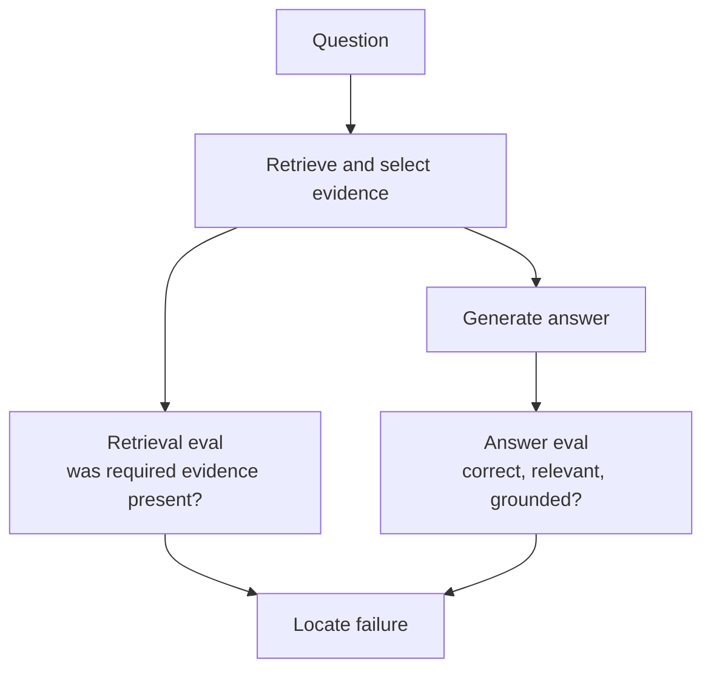
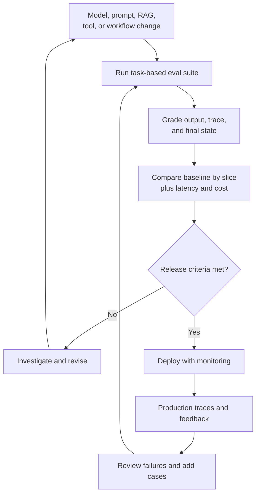

A new model arrives with a higher benchmark score and a more impressive demo. Before replacing the model in production, there is a more useful question: **Does your system actually do its job better?**

In the [previous article on observability](../ai-observability-wrong-answer/), we looked at traces that reveal which documents were retrieved, which model and tools were called, how long each step took, and how many tokens were used. A trace may be perfectly healthy:

| Step | Duration |
| --- | ---: |
| Retrieval | 0.4 s |
| Model | 2.1 s |
| Tool | 0.7 s |
| HTTP response | 200 OK |

But it cannot by itself answer: **Was the result good?**

That is the job of evaluation, often shortened to **eval**.

## 1. An eval starts with a definition of success

Traditional tests can often compare an output to a precise expectation. Two plus two should equal four. A valid order-creation request might need to create exactly one order.

Generative outputs are more flexible. Two summaries can use different words and both be excellent. So "Does the response exactly match this string?" is often the wrong test.

An eval instead asks questions that reflect the task:

- Is the answer factually correct and supported by the available evidence?
- Did it solve the user's request?
- Did the Agent choose the right tool and arguments?
- Did it avoid actions outside its permissions?
- Was the result delivered within acceptable latency and cost?

[OpenAI's evaluation best practices](https://developers.openai.com/api/docs/guides/evaluation-best-practices) describe evals as structured tests designed around real application tasks, not just generic academic metrics. [Anthropic likewise notes](https://www.anthropic.com/engineering/demystifying-evals-for-ai-agents) that writing evals forces a team to agree on what success means.

The first question is therefore not "Which scoring model should we use?" It is **"What must this product do correctly?"**

## 2. Turn a vague requirement into a testable task

Suppose a customer says: "My order has not arrived. Please check it." An unhelpful success criterion is "The Agent responds." Almost any answer passes.

A useful task definition might require the system to identify the correct order, look up its current status, avoid inventing delivery information, refrain from issuing a refund without authorization, and explain the next step clearly.

One concrete case could be:

| Part | Example |
| --- | --- |
| Input | "Can you check order 12345?" |
| Expected behavior | Call order lookup with ID 12345; do not call refund |
| Expected outcome | Report the actual status from the test environment |
| Constraints | No private data from another customer; no unapproved side effect |

This does **not** prescribe one exact sentence. It describes the behavior and outcome that matter.

For Agent evals, [Anthropic uses](https://www.anthropic.com/engineering/demystifying-evals-for-ai-agents) four useful terms: a **task** is the test case; a **trial** is one attempt; a **grader** checks an aspect of success; and a **trace or transcript** records the attempt. The **outcome** is the state left in the environment. An Agent saying "Refund complete" is not proof that a refund actually occurred.

## 3. Start with real failures, not a giant imaginary benchmark

An eval dataset need not begin with thousands of cases. Anthropic suggests that **20 to 50 simple tasks drawn from real failures** can be a useful start for an early Agent, then the set can grow as the product matures. That is a starting heuristic, not a statistically universal sample size.

Consider issues a support team has actually seen:

- A user types an order ID in an unusual format.
- The user says only "returns" or changes topic midway.
- A tool returns an ambiguous field.
- A refund requires approval.
- The Agent calls the same tool twice.

Each incident can become a test case. This turns a production bug into a regression test instead of a one-time patch.

A representative dataset should combine common requests, hard cases, known failures, edge cases, and safety cases. It should include what the system **must not** do as well as what it must do. One hundred neat variations of "Where is order 123?" will not tell you much about users who write "where's my order" or do not remember their order ID.

[OpenAI's guide](https://developers.openai.com/api/docs/guides/evaluation-best-practices) recommends task-specific datasets that reflect real usage and include edge and adversarial cases. Production-derived examples need privacy review, redaction, and appropriate access controls before becoming reusable test data.

## 4. Choose graders that fit the question

A single task can have several graders. Do not collapse all quality into one score before you understand its parts.

| Grader | Best suited to | Example |
| --- | --- | --- |
| Code-based | Deterministic facts and state | Correct tool, exact order ID, valid JSON, test passes |
| Model-based | Judgments with a clear rubric | Relevance, tone, completeness, grounding |
| Human | Expert or ambiguous judgments | Policy interpretation, disputed edge case, judge calibration |

If code can verify that the refund tool was *not* called, use code. Asking another model to guess whether a tool call happened would add uncertainty.

When a model must judge, give it a narrow rubric and the evidence needed to decide. Pairwise comparison or classification against concrete criteria is usually more informative than "Is this answer good?" [OpenAI discusses](https://developers.openai.com/api/docs/guides/evaluation-best-practices) using specific criteria and calibrating automated evaluation with human judgment.

A model judge is still a model. It may favor longer answers, misread a policy, or disagree with experts. Compare its grades against human-labeled examples, inspect disagreements, and allow "cannot determine" when evidence is insufficient. [Anthropic's guidance](https://www.anthropic.com/engineering/demystifying-evals-for-ai-agents) recommends calibrating model graders with human experts.

## 5. RAG needs separate retrieval and answer evals

Suppose an assistant answers "12 days" when the current probation policy says "10 days." A final-answer grader can mark the response wrong, but it does not reveal what to fix.

The [RAG pipeline](../production-rag-architecture/) has at least two questions:

1. Did retrieval and context assembly put the necessary, current evidence in front of the model?
2. Given that evidence, did generation produce a correct, relevant, grounded answer?

For retrieval, useful checks include whether the required source appears in top results, whether the selected chunks are relevant, and whether an old policy was preferred over the current one. For the answer, check correctness, coverage, and whether claims follow from the supplied sources. [OpenAI's documentation](https://developers.openai.com/api/docs/guides/evaluation-best-practices) uses document Q&A to illustrate evaluating context and final responses separately.

If evidence never reached the model, changing the model may not help. If the right evidence was present and the answer was still wrong, investigate generation, prompt design, or answer checks.

## 6. Agent evals must inspect both path and outcome

An Agent can reach a correct final answer through an unnecessarily expensive or unsafe route. To check stock for product A, one run might use the inventory tool once; another might search the web twice, query CRM, call inventory twice, and then answer.

Both may report the same number. Only one follows a sensible process.

A useful Agent eval can grade:

- Goal completion and final environment state.
- Tool choice and arguments.
- Unnecessary actions, loops, and handoffs.
- Approval and permission compliance.
- Latency, tokens, cost, and error recovery.

[OpenAI's Agent evaluation guide](https://developers.openai.com/api/docs/guides/agent-evals) describes trace grading for tool selection, handoffs, and policy adherence. A trace makes the path visible, but a grader still needs to decide whether that path was acceptable.

Avoid over-constraining the test to one exact sequence when several safe routes can succeed. Be strict about what matters, such as "never issue a refund without approval", and flexible about harmless implementation details.

## 7. One pass does not establish reliability

The same task can pass on one run and fail on another. For example, five trials might yield four passes and one failure. That is more informative than a single pass, though five trials are still too few for a precise reliability claim.

Run repeated trials where variability matters, especially for multi-step Agents or user-facing safety behavior. Separate the probability of success on one attempt from "at least one success after many attempts". A customer usually experiences the first attempt, not the best of five. [Anthropic's discussion of Agent nondeterminism](https://www.anthropic.com/engineering/demystifying-evals-for-ai-agents) makes this distinction explicit.

The number of trials should match the decision. A quick development check may need fewer runs than a release gate for a critical workflow. Report sample sizes and uncertainty rather than pretending every percentage is exact.

## 8. Capability and regression suites answer different questions

A **capability suite** asks what difficult new work the system can do. A **regression suite** asks whether previously reliable behavior still works.

| Suite | Question | Typical contents |
| --- | --- | --- |
| Capability | "Can we do harder tasks now?" | New, challenging cases with room to improve |
| Regression | "Did this change break required behavior?" | Known bugs, core flows, safety checks |

A new prompt can improve research quality and simultaneously make the Agent forget to request approval before a refund. A model upgrade can improve reasoning and worsen tool selection.

Both suites matter. [Anthropic describes](https://www.anthropic.com/engineering/demystifying-evals-for-ai-agents) moving successful capability cases into the regression suite once they become behavior the product must keep.

## 9. Compare model changes on your workload

A public benchmark is useful background, as [the earlier benchmark article](../benchmarks-vs-real-work/) discussed. It is not a deployment decision for your support Agent.

Run the current and candidate systems on the **same** task set, with controlled data and tool environments where possible. Compare by dimension, not only by overall average:

| Dimension | What to ask |
| --- | --- |
| Support correctness | Are order and policy answers more accurate? |
| RAG grounding | Are claims supported by the retrieved evidence? |
| Tool use | Are tools chosen with correct arguments? |
| Safety | Are approval boundaries respected? |
| Efficiency | What happened to latency, tokens, cost, and retries? |

Imagine the candidate raises overall accuracy from 82% to 86%, but critical refund-safety cases get worse. The average alone hides the reason to pause the release.

Similarly, a version that improves quality from 91% to 93% while tripling latency and cost may or may not be worth it. Evaluation does not make trade-offs disappear. It makes them visible for a product decision.

## 10. A high score can still be misleading

An "Eval Score: 94.7%" dashboard looks reassuring. But what if common cases pass 99% while a small set of critical safety cases passes only 60%? What if the dataset contains too many easy questions, the grader favors long responses, or real traffic has changed since the dataset was created?

Read failed traces and grader explanations. Check important slices separately. For high-risk behavior, consider hard release gates instead of letting a broad average compensate for a critical failure.

Also inspect the test itself. A vague task or broken grader can penalize a valid solution. Anthropic documents examples where evaluation setup errors changed the interpretation of results. A score is evidence only if the task, environment, and grading logic are trustworthy.

## 11. Run evals before release and learn after release

A useful loop has two sides:

[OpenAI's guidance](https://developers.openai.com/api/docs/guides/evaluation-best-practices) calls for evaluating changes repeatedly and mining production failures for new cases. In the [observability article](../ai-observability-wrong-answer/), we saw how traces make a failed request inspectable. Here, the same request can become a test that catches the failure before the next release.

An eval does not make AI deterministic. It gives a team a measurable way to manage a variable system. A production AI product does not improve because the model silently learns from every conversation. It improves when the team turns observed outcomes into better data, clearer success criteria, safer changes, and tests that continue to run.
