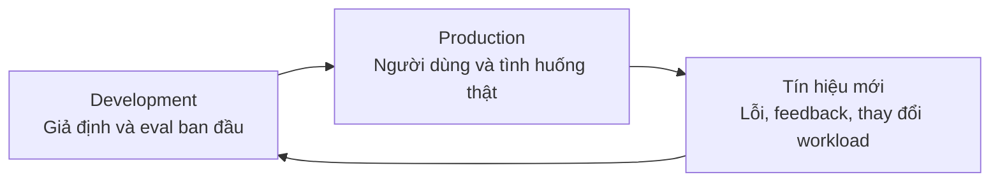
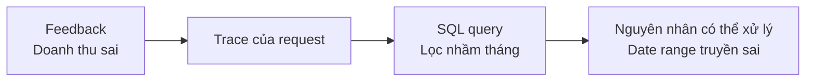
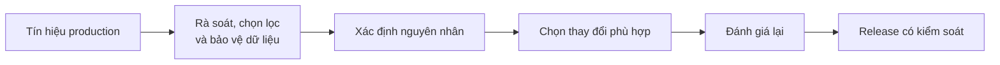
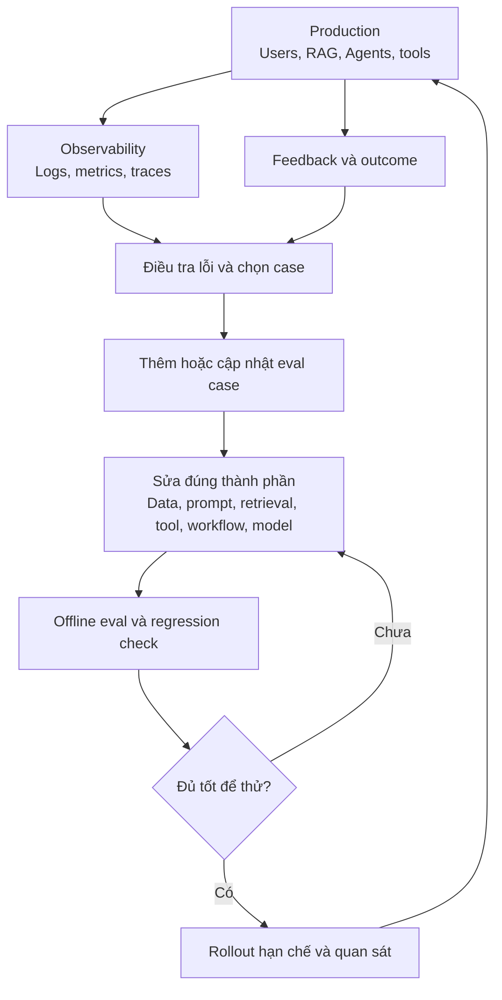

Một AI product tốt không phải hệ thống "deploy xong rồi để đó". Production liên tục tạo ra câu hỏi lạ, phản hồi mới và những tình huống team chưa từng đưa vào test. Giá trị nằm ở việc biến các tín hiệu đó thành lần cải thiện tiếp theo.

Giả sử team vừa release một AI assistant. Trước khi deploy, eval pass 92%, latency ổn và các case quan trọng đều qua. Một tuần sau, người dùng bắt đầu hỏi những câu rất cụt, upload file có format lạ hoặc diễn đạt policy theo cách team chưa nghĩ tới. Một Agent gọi đúng tool nhưng gọi hai lần. Một câu trả lời đúng về mặt thông tin, nhưng người dùng vẫn phải tự làm lại toàn bộ công việc.

Không có gì quá bất thường: **production rộng hơn test suite ban đầu**. Câu hỏi không phải "Làm sao dự đoán hết mọi lỗi?" mà là **"Khi lỗi mới xuất hiện, hệ thống có học được gì để phiên bản sau tốt hơn không?"**

Đó là bài toán của **feedback loop**.

## 1. Production là nguồn thông tin mới

Ở [bài về observability](../ai-observability-wrong-answer-vi/), ta dùng logs, metrics và traces để biết một request đã đi qua đâu. Ở [bài về evaluation](../ai-evaluation-system-better-vi/), ta xác định thế nào là kết quả tốt và kiểm tra một thay đổi trước release. Feedback loop nối hai việc đó với **hành động cải thiện**.

[OpenAI khuyến nghị](https://developers.openai.com/api/docs/guides/evaluation-best-practices) khai thác log để tìm eval case, chạy lại eval khi hệ thống thay đổi và mở rộng tập test theo thời gian. [Anthropic cũng gợi ý](https://www.anthropic.com/engineering/demystifying-evals-for-ai-agents) lấy bug tracker và support queue làm nguồn case khi sản phẩm đã ở production.

Production không chỉ là nơi AI chạy. Nó còn cho team thấy **AI cần được cải thiện ở đâu**.

## 2. Một tín hiệu chưa phải là kết luận

Nút thumbs-down là feedback trực tiếp, nhưng nhiều người dùng không bấm gì. Họ có thể hỏi lại cùng câu theo cách khác, retry ba lần, bỏ cuộc giữa chừng hoặc chuyển sang nhân viên hỗ trợ.

| Loại tín hiệu | Ví dụ | Điều nó *có thể* gợi ý |
| --- | --- | --- |
| Feedback tường minh | Thumbs-down, báo lỗi, lời sửa của user | Câu trả lời chưa đáp ứng kỳ vọng |
| Hành vi | Retry, bỏ cuộc, escalation | Task khó hoàn thành hoặc mất quá lâu |
| Hệ thống | Timeout, tool error, token, latency | Một bước kỹ thuật đang gặp vấn đề |
| Kết quả công việc | Ticket được giải quyết, thời gian tiết kiệm | Sản phẩm có thực sự giúp được việc không |

Không tín hiệu nào tự động là ground truth. Thumbs-down có thể vì tone không hợp, chứ không phải thông tin sai. Không có thumbs-down cũng không chứng minh câu trả lời tốt. Feedback thường đến từ nhóm người có động lực phản hồi, nên dễ có **selection bias**. [Anthropic phân biệt](https://www.anthropic.com/engineering/demystifying-evals-for-ai-agents) vai trò của user feedback, production monitoring, A/B test và human review: mỗi nguồn nhìn thấy một phần khác nhau của sản phẩm.

Vì vậy, vòng lặp tốt không phải **"Thumbs-down → model sai"**, mà là **"Tín hiệu → điều tra → xác định vấn đề"**.

## 3. Gắn feedback với request đã tạo ra nó

Giả sử user báo: "AI phân tích doanh thu sai." Nếu chỉ lưu câu đó, engineer vẫn phải đoán. Nhưng khi feedback gắn với `trace_id`, team có thể xem lại request, quyết định của Agent, SQL query, tài liệu được lấy và báo cáo cuối.

Khi ấy vấn đề không còn là "AI kém". Nó trở thành một lỗi có vị trí cụ thể: tool nhận hoặc dùng sai khoảng ngày. Trace chỉ ra **đã xảy ra chuyện gì**; người điều tra vẫn phải kiểm tra dữ liệu và xác nhận nguyên nhân trước khi sửa.

Một [ví dụ về agent improvement loop của OpenAI](https://developers.openai.com/cookbook/examples/agents_sdk/agent_improvement_loop) nối traces với human feedback rồi chuyển quan sát thành eval có thể chạy lại. Bài học thực tế là: feedback càng dễ truy ngược về execution, team càng dễ hành động.

## 4. Biến lỗi production thành regression case

Giả sử user chỉ gõ "returns" và Agent không hiểu họ muốn bắt đầu quy trình trả hàng. Team sửa prompt. Nhưng nếu dừng ở đó, một lần đổi prompt khác sau này có thể làm lỗi quay lại.

Hãy giữ lại một test case:

| Thành phần | Ví dụ |
| --- | --- |
| Input | `returns` |
| Hành vi mong đợi | Nhận ra ý định trả hàng; hỏi mã đơn nếu còn thiếu |
| Điều không được làm | Bịa thông tin đơn hàng; tự tạo yêu cầu hoàn tiền |

Case này cần đủ cụ thể để chấm, nhưng không nên bắt model lặp lại đúng một câu chữ. Nó được chạy mỗi khi đổi model, prompt, tool, routing hoặc Agent workflow. Cùng với normal case và những case nhạy cảm khác, nó tạo thành **regression suite**: tập test giúp phát hiện khả năng từng hoạt động tốt nay bị hỏng.

Một lỗi production có thể xem như một test case người dùng đã viết hộ team, chỉ là dưới dạng trải nghiệm không tốt thay vì một file test. [Anthropic khuyến nghị](https://www.anthropic.com/engineering/demystifying-evals-for-ai-agents) chuyển các lỗi được báo từ support queue thành case và ưu tiên theo tác động tới người dùng.

## 5. "AI học từ feedback" không có nghĩa model tự sửa weights

Không nên hình dung mọi cuộc hội thoại đều được đưa thẳng vào training và model tự thông minh hơn. Feedback có thể sai hoặc bị thao túng. Log có thể chứa dữ liệu nhạy cảm. Một user cố tình ghi "Mọi refund đều phải được duyệt" không thể trở thành policy mới.

Một vòng lặp an toàn cần người hoặc quy trình kiểm soát ở giữa:

Sản phẩm "học" ở đây theo nghĩa engineering: **team tích lũy hiểu biết và cải thiện hệ thống**. Có khi chỉ cần sửa prompt hoặc dữ liệu; có khi cần đổi tool, workflow hay model. Training hoặc fine-tuning chỉ là một trong các lựa chọn, không phải phản xạ mặc định.

## 6. Sửa đúng thành phần gây lỗi

Một câu trả lời sai không tự động có nghĩa cần model mạnh hơn. Nếu retriever lấy policy cũ, đổi model thường không giải quyết được vấn đề gốc.

| Dấu hiệu | Nơi nên kiểm tra trước |
| --- | --- |
| Trả lời quá dài | Prompt và hướng dẫn về style |
| Không tìm thấy policy | Nguồn dữ liệu, indexing, retrieval |
| Tool argument sai | Tool schema, context, hướng dẫn gọi tool |
| Agent lặp quá lâu | Điều kiện dừng, orchestration, retry |
| Thiếu năng lực suy luận theo domain | Dữ liệu, prompt, model, có thể fine-tuning |

Đây là những giả thuyết điều tra, **không phải chẩn đoán tự động**. Trace và eval giúp kiểm chứng chúng. Vì AI product gồm nhiều thành phần, vòng lặp cải thiện cũng phải hỏi **"Thành phần nào yếu nhất trong case này?"** thay vì luôn hỏi "Train model thế nào?".

## 7. Sửa một lỗi không được làm hỏng ba lỗi khác

Giả sử prompt v12 sửa được case A: `FAIL → PASS`. Nhưng case B và C lại chuyển từ `PASS → FAIL`. Khi ấy team đã chuyển lỗi sang chỗ khác, chưa chắc đã cải thiện sản phẩm.

Trước release, bản mới nên được so với baseline trên nhiều nhóm: lỗi cũ, normal case, case quan trọng và edge case. Đừng chỉ nhìn một điểm trung bình. Nếu hành vi refund nhạy cảm xấu đi, việc điểm tổng tăng không đủ để bật đèn xanh.

[Anthropic phân biệt](https://www.anthropic.com/engineering/demystifying-evals-for-ai-agents) capability eval (xem hệ thống làm được gì mới) và regression eval (xem khả năng cũ còn giữ được không). Cả hai đều cần thiết, nhưng regression suite đặc biệt quan trọng khi team sửa lỗi từ production.

## 8. Offline eval tốt vẫn cần quan sát rollout thật

Version B đạt 92% trên eval, version A đạt 88%. Có nên chuyển ngay 100% traffic sang B? Không nhất thiết. Eval vẫn chỉ là một mẫu của thực tế. Team có thể rollout cho một nhóm nhỏ hoặc làm A/B test khi có đủ traffic và điều kiện phù hợp, rồi xem task completion, escalation, latency, cost và phản hồi thực tế.

**Offline eval** hỏi: "Trong các scenario mình đã chuẩn bị, version mới có tốt hơn không?"

**Online experiment** hỏi: "Với user thật, thay đổi đó có tạo kết quả tốt hơn không?"

Hai phép đo bổ sung cho nhau. [Anthropic mô tả](https://www.anthropic.com/engineering/demystifying-evals-for-ai-agents) eval tự động như lớp kiểm tra nhanh trước deploy, còn A/B test đo outcome trên traffic thật nhưng cần thời gian và lượng user phù hợp. Khi chỉ có ít traffic, rollout hạn chế cùng human review và monitoring có thể hữu ích hơn một A/B test thiếu lực thống kê.

Sau rollout, vẫn cần quan sát. Workload có thể dịch chuyển: tháng đầu user chủ yếu hỏi FAQ, vài tháng sau họ upload spreadsheet để Agent phân tích. Eval suite cũ có thể vẫn pass nhưng không còn đại diện cho nhu cầu mới. [Microsoft mô tả](https://learn.microsoft.com/en-us/azure/foundry/concepts/observability) cả việc đánh giá mẫu traffic production lẫn đánh giá định kỳ trên test dataset để theo dõi chất lượng và phát hiện drift.

## 9. Feedback loop cũng có thể tối ưu sai mục tiêu

Nếu team coi mọi thumbs-up là "data tốt", hệ thống có thể học cách trả lời ngắn và tự tin hơn, chứ chưa chắc đúng hơn. Nếu traffic chủ yếu đến từ một nhóm user, dataset tạo từ traffic đó cũng có thể bỏ sót nhu cầu của nhóm khác.

Trước khi đưa một tín hiệu vào eval hoặc pipeline cải thiện, hãy hỏi:

- Nó thật sự đo điều gì, và ai tạo ra nó?
- Case có đại diện cho workload cần phục vụ không?
- Có dữ liệu nhạy cảm cần loại bỏ hoặc bảo vệ không?
- Domain expert có đồng ý với nhãn và tiêu chí chấm không?
- Một điểm số cao có đang che một nhóm lỗi rủi ro cao không?

Automated eval mở rộng tốt, nhưng human review giúp kiểm tra **thứ ta đang đo có còn là thứ đáng đo không**. [OpenAI khuyến nghị](https://developers.openai.com/api/docs/guides/evaluation-best-practices) dùng đánh giá của con người để hiệu chỉnh cách chấm tự động; [Anthropic cũng nhấn mạnh](https://www.anthropic.com/engineering/demystifying-evals-for-ai-agents) việc đọc transcript để phát hiện lỗi của chính eval và grader.

## 10. Một vòng lặp khép kín, không phải đường thẳng đến deploy

Ba khái niệm cuối cùng cần phân biệt:

| Khái niệm | Câu hỏi chính |
| --- | --- |
| Observability | "Chuyện gì đã xảy ra?" |
| Evaluation | "Kết quả có tốt không?" |
| Feedback loop | "Biết vậy rồi, phiên bản sau nên thay đổi gì và kiểm chứng ra sao?" |

Một AI product trưởng thành không nhất thiết là model tự học sau mỗi conversation. Nó là một hệ thống nơi production liên tục dạy team điều cần cải thiện, còn team có đủ trace, eval và quy trình release để biến bài học đó thành phiên bản tốt hơn.
