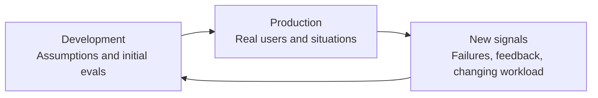
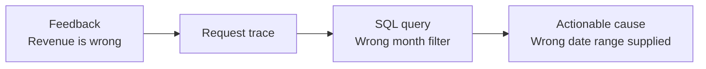
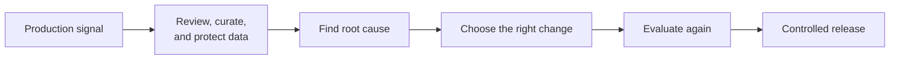
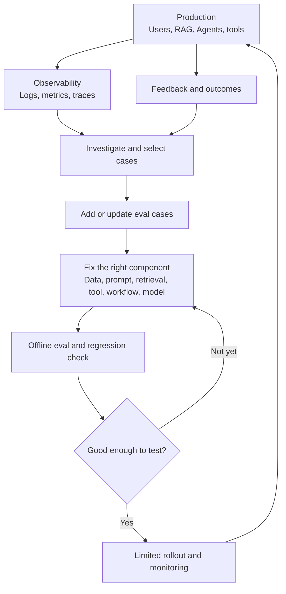

A good AI product is not something you deploy and leave alone. Production keeps producing unfamiliar questions, new feedback, and situations the team never put in a test. The value is in turning those signals into the next improvement.

Suppose a team has just released an AI assistant. Before launch, its eval pass rate is 92%, latency looks fine, and the important cases pass. A week later, users start asking vague questions, uploading oddly formatted files, and phrasing policy questions in unexpected ways. An Agent calls the right tool, but calls it twice. One answer is technically correct, yet the user still has to redo the entire job.

Nothing here is particularly surprising: **production is broader than the original test suite**. The useful question is not "How do we predict every failure?" It is **"When a new failure appears, can the system learn something that makes the next version better?"**

That is the problem a **feedback loop** addresses.

## 1. Production is a source of new information

In the [observability article](../ai-observability-wrong-answer/), we used logs, metrics, and traces to see what happened during a request. In the [evaluation article](../ai-evaluation-system-better/), we defined success and tested a change before release. A feedback loop connects those practices to an **improvement decision**.

[OpenAI recommends](https://developers.openai.com/api/docs/guides/evaluation-best-practices) mining logs for eval cases, running evals as the system changes, and growing the test set over time. [Anthropic likewise suggests](https://www.anthropic.com/engineering/demystifying-evals-for-ai-agents) looking at bug trackers and support queues once a product is in production.

Production is not merely where the AI runs. It also shows the team **where the AI needs to improve**.

## 2. A signal is not a conclusion

A thumbs-down is explicit feedback, but many users never click it. They may rephrase the same question, retry three times, abandon the conversation, or ask for a human instead.

| Signal | Examples | What it *might* suggest |
| --- | --- | --- |
| Explicit feedback | Thumbs-down, bug report, user correction | The answer did not meet an expectation |
| Behavior | Retry, abandonment, escalation | The task was difficult or too slow |
| System | Timeout, tool error, tokens, latency | A technical step may be failing |
| Work outcome | Ticket resolved, time saved | Whether the product actually helped |

None of these signals is automatically ground truth. A thumbs-down might be about tone rather than accuracy. The absence of one does not prove the answer was useful. Feedback is often supplied by a self-selected group of users, which introduces **selection bias**. [Anthropic distinguishes](https://www.anthropic.com/engineering/demystifying-evals-for-ai-agents) user feedback, production monitoring, A/B tests, and human review because each reveals a different part of the product.

A good loop is therefore not **"Thumbs-down → model wrong"**. It is **"Signal → investigate → understand the problem"**.

## 3. Connect feedback to the request that produced it

Imagine a user reports: "The AI got the revenue analysis wrong." If that comment is all the team stores, an engineer still has to guess. If it is linked to a `trace_id`, the team can inspect the request, the Agent's decisions, the SQL query, retrieved documents, and the final report.

The failure is no longer just "the AI is bad." It has a specific location: the data tool received or used the wrong date range. The trace tells us **what happened**; a person still has to verify the data and confirm the root cause.

An [OpenAI example of an agent improvement loop](https://developers.openai.com/cookbook/examples/agents_sdk/agent_improvement_loop) connects traces to human feedback and turns observations into repeatable evals. The practical lesson is simple: feedback is more actionable when it can be traced back to an execution.

## 4. Turn a production failure into a regression case

Suppose a user types only "returns," and the Agent fails to recognize that they want to start a return. The team fixes the prompt. But if it stops there, a later prompt change may bring the failure back.

Keep a test case instead:

| Part | Example |
| --- | --- |
| Input | `returns` |
| Expected behavior | Recognize return intent; ask for an order ID if missing |
| Forbidden behavior | Invent order details; create a refund without authorization |

The case should be specific enough to grade without demanding one exact sentence. Run it whenever the model, prompt, tools, routing, or Agent workflow changes. Together with normal and high-risk cases, it becomes part of a **regression suite**: tests that catch a capability that used to work but no longer does.

A production bug is almost a test case the user wrote for the team, except it arrived as a bad experience rather than a test file. [Anthropic recommends](https://www.anthropic.com/engineering/demystifying-evals-for-ai-agents) turning support-reported failures into cases and prioritizing them by user impact.

## 5. "Learning from feedback" does not mean updating weights automatically

We should not imagine every conversation flowing straight into training while the model silently grows smarter. Feedback can be wrong or manipulated. Logs may contain sensitive data. A user who submits "Every refund should be approved" must not be able to rewrite company policy.

A safer loop puts review and controls in the middle:

The product "learns" in an engineering sense: **the team accumulates evidence and improves the system**. Sometimes the right change is to a prompt or a data source; sometimes it is a tool, workflow, or model. Training and fine-tuning are options, not the default reflex.

## 6. Fix the component that actually failed

A wrong answer does not automatically call for a stronger model. If the retriever fetched an outdated policy, replacing the model is unlikely to address the underlying problem.

| Symptom | Check here first |
| --- | --- |
| Answers are too long | Prompt and style instructions |
| Policy cannot be found | Data source, indexing, retrieval |
| Wrong tool argument | Tool schema, context, tool-use instructions |
| Agent loops for too long | Stopping condition, orchestration, retry behavior |
| Weak domain reasoning | Data, prompt, model, possibly fine-tuning |

These are investigation leads, **not automatic diagnoses**. Traces and evals help test them. Because an AI product has many components, the improvement loop should ask **"Which component is weakest in this case?"** rather than always asking "How do we train the model?"

## 7. Fixing one failure must not break three others

Suppose prompt v12 fixes case A: `FAIL → PASS`. But cases B and C flip from `PASS → FAIL`. The team may have moved the failure, not improved the product.

Before release, compare the candidate with the baseline across known failures, normal tasks, critical cases, and edge cases. Do not rely only on one average score. If sensitive refund behavior regresses, a higher overall score should not hide it.

[Anthropic distinguishes](https://www.anthropic.com/engineering/demystifying-evals-for-ai-agents) capability evals, which probe what a system can newly do, from regression evals, which check whether it still does what it used to do. Both matter, but regression tests are especially important after a production fix.

## 8. A good offline eval still needs a real-world rollout

Version B scores 92% in an eval and version A scores 88%. Should B immediately receive 100% of traffic? Not necessarily. An eval set is still a sample of reality. The team might first roll out to a small group, or run an A/B test when there is enough traffic and an appropriate setup, then compare task completion, escalation, latency, cost, and user feedback.

**Offline eval** asks: "Is the new version better on the scenarios we prepared?"

**Online experiment** asks: "Does the change produce better outcomes for real users?"

The two complement each other. [Anthropic describes](https://www.anthropic.com/engineering/demystifying-evals-for-ai-agents) automated evals as a fast pre-deployment check and A/B tests as a way to measure outcomes on live traffic, albeit one that needs time and sufficient volume. With little traffic, a limited rollout with human review and monitoring may be more useful than an underpowered A/B test.

Monitoring continues after rollout. The workload can shift: at first users mostly ask FAQs; months later they upload spreadsheets for the Agent to analyze. The old eval suite may still pass while no longer reflecting the new work. [Microsoft describes](https://learn.microsoft.com/en-us/azure/foundry/concepts/observability) both sampling production traffic for continuous evaluation and running scheduled evaluations on test datasets to watch quality and detect drift.

## 9. A feedback loop can optimize the wrong goal

If a team treats every thumbs-up as "good data," the system may learn to sound brief and confident, not necessarily to be more accurate. If most traffic comes from one user group, a dataset built only from that traffic may miss other users' needs.

Before turning a signal into an eval or an improvement input, ask:

- What does it actually measure, and who produced it?
- Does the case represent the workload the product should serve?
- Does it contain sensitive data that needs to be removed or protected?
- Do domain experts agree with the label and scoring criteria?
- Is a high average hiding a serious failure in an important slice?

Automated evals scale, while human review checks **whether we are still measuring what matters**. [OpenAI recommends](https://developers.openai.com/api/docs/guides/evaluation-best-practices) calibrating automated scoring with human judgment; [Anthropic also stresses](https://www.anthropic.com/engineering/demystifying-evals-for-ai-agents) reading transcripts to catch problems in the evals and graders themselves.

## 10. A loop, not a straight line to deployment

Three ideas are worth keeping distinct:

| Practice | Main question |
| --- | --- |
| Observability | "What happened?" |
| Evaluation | "Was the result good?" |
| Feedback loop | "Given that evidence, what should change next, and how will we validate it?" |

A mature AI product does not necessarily have a model that learns from every conversation. It has a system in which production keeps teaching the team what to improve, and the team has enough traces, evals, and release discipline to turn that lesson into a better version.
