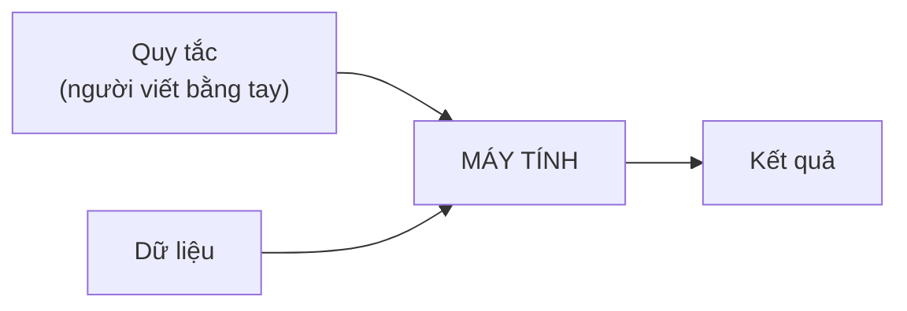
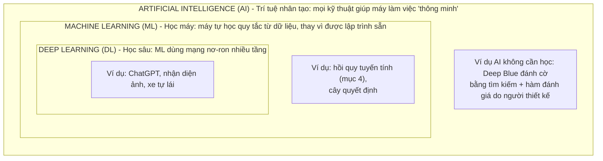
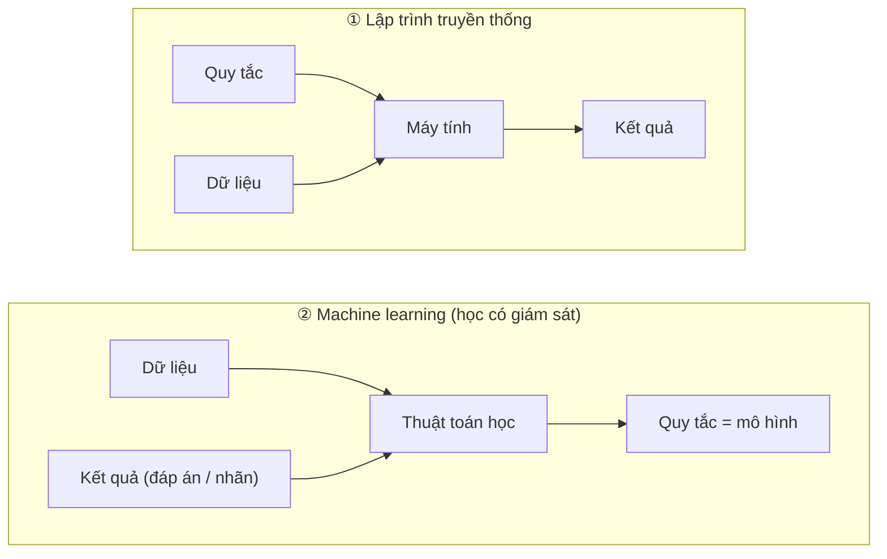
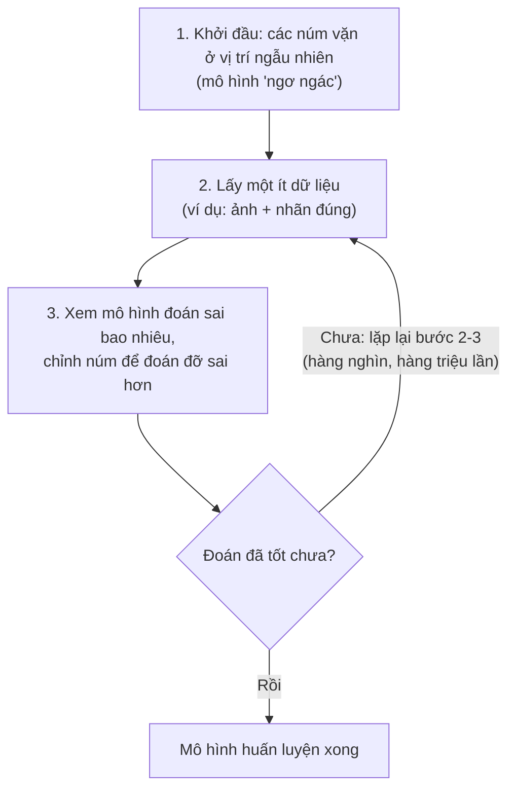
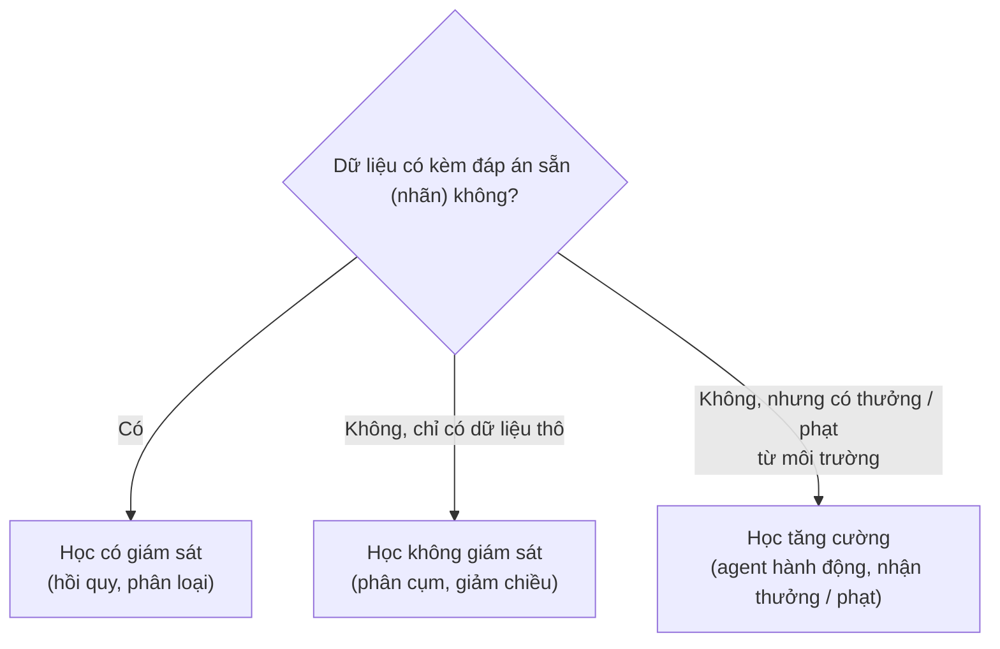

> **Mục tiêu bài học:** Sau bài này, bạn sẽ hiểu AI, Machine Learning (ML) và Deep Learning (DL) là gì, chúng khác nhau ra sao, khi nào cần dùng chúng, và một hệ thống "máy học" thực chất gồm những thành phần nào.

## 1. Chuyện gì xảy ra khi bạn nói "Hey Siri"?

Hãy tưởng tượng một buổi sáng bình thường: bạn cầm điện thoại lên và nói *"Hey Siri, chỉ đường đến quán cà phê gần nhất"*.

Trong vài giây ngắn ngủi đó, một chuỗi việc đã diễn ra:

- Điện thoại **nghe** và nhận ra bạn vừa gọi nó (nhận diện giọng nói).
- Nó **chuyển lời nói thành chữ** (speech-to-text).
- Nó **hiểu** bạn đang muốn tìm đường (hiểu ngôn ngữ).
- Bản đồ **dự đoán** thời gian di chuyển cho từng tuyến đường.

Không có lập trình viên nào ngồi viết tay từng quy tắc kiểu *"nếu âm thanh có tần số X thì đó là chữ Hey Siri"*. Thay vào đó, máy đã **học** những khả năng này **từ dữ liệu** - và "máy học từ dữ liệu như thế nào?" chính là câu hỏi mà bài này bắt đầu trả lời.

## 2. Lập trình truyền thống: viết quy tắc bằng tay

Trước tiên, hãy xem cách phần mềm "bình thường" hoạt động.

Giả sử bạn xây một trang bán hàng online. Bạn sẽ ngồi liệt kê các quy tắc:

- Khi khách bấm "Thêm vào giỏ" → thêm một dòng vào bảng giỏ hàng.
- Khi giỏ hàng trống mà khách bấm "Thanh toán" → hiện thông báo lỗi.
- Khi đơn hàng trên 500k → miễn phí vận chuyển.

Cách làm này gọi là **lập trình truyền thống**: con người nghĩ ra **quy tắc (rules)**, máy chỉ việc làm theo.

Cách này rất tốt - **nếu bạn có thể viết ra quy tắc**. Và đây là điểm mấu chốt: sách *Dive into Deep Learning* có một câu rất hay:

> *"Khi bạn có thể tự nghĩ ra lời giải đúng 100%, bạn thường không cần đến machine learning."*

Nhưng thử nghĩ xem, bạn sẽ viết quy tắc thế nào cho những bài toán sau?

- Nhìn một bức ảnh, cho biết trong ảnh có con mèo hay không.
- Nghe một đoạn âm thanh, cho biết người nói có gọi "Hey Siri" hay không.
- Dự đoán thời tiết ngày mai từ ảnh vệ tinh.

Lấy ví dụ bài toán "Hey Siri": mỗi giây, micro thu về khoảng **44.000 con số** (biên độ sóng âm). Bạn sẽ viết quy tắc gì để biến 44.000 con số đó thành câu trả lời "có/không"? **Không ai viết nổi.** Điều thú vị là: chính chúng ta thì nghe phát nhận ra ngay tiếng "Hey Siri" - nhưng ta *không thể diễn tả thành quy tắc* cách bộ não mình làm điều đó.

Đây chính là lúc machine learning xuất hiện.

## 3. Ba khái niệm: AI, Machine Learning, Deep Learning

Ba thuật ngữ này hay bị dùng lẫn lộn. Thực ra chúng lồng vào nhau như ba vòng tròn đồng tâm: deep learning nằm trong machine learning, machine learning nằm trong AI:

### 3.1. AI - Trí tuệ nhân tạo (khái niệm rộng nhất)

**AI** là mục tiêu lớn: làm cho máy móc thực hiện được những việc mà bình thường cần trí thông minh của con người - hiểu ngôn ngữ, nhận diện hình ảnh, chơi cờ, lái xe...

AI không nhất thiết phải "học". Ví dụ Deep Blue - cỗ máy thắng vua cờ Kasparov năm 1997 - đánh cờ chủ yếu bằng cách tìm kiếm trên không gian nước đi với tốc độ khổng lồ, kết hợp hàm đánh giá do con người thiết kế. Nó vẫn là AI, nhưng không học theo cách các mô hình ML hiện đại học từ dữ liệu.

### 3.2. Machine Learning - Học máy

**Machine learning là ngành nghiên cứu các thuật toán có thể học từ kinh nghiệm.** Khi thuật toán tích lũy thêm kinh nghiệm (thường ở dạng **dữ liệu**) và được huấn luyện đúng cách, hiệu quả của nó thường tăng lên.

So sánh với trang bán hàng ở trên: trang web đó chạy mãi một logic, dù phục vụ 1 khách hay 1 triệu khách thì nó vẫn y như cũ, cho đến khi lập trình viên tự tay sửa code. Còn với một hệ thống ML, khi có thêm dữ liệu, ta có thể **huấn luyện lại (retrain)** mô hình để nó tốt lên - sự cải tiến đến từ dữ liệu, chứ không phải từ việc con người viết lại quy tắc.

Có thể hình dung ML như việc **đảo ngược** lập trình truyền thống: đầu ra của cách cũ trở thành đầu vào của cách mới, và ngược lại.

Ví dụ: muốn máy nhận diện mèo, ta **không** mô tả "mèo có tai nhọn, có ria...". Ta đưa cho máy **hàng nghìn tấm ảnh** kèm nhãn "mèo" / "không phải mèo", và để thuật toán **tự tìm ra quy luật**. Sách *Dive into Deep Learning* gọi đây là **"lập trình bằng dữ liệu" (programming with data)** - một cách nói rất hay để bạn ghi nhớ.

> ⚠️ **Lưu ý nhỏ:** Sơ đồ "đảo ngược" ở trên mô tả **học có giám sát (supervised learning)** - nhóm bài toán mà dữ liệu có kèm đáp án, thường gặp trong thực tế và sẽ được giới thiệu ở mục 6. Học không giám sát và học tăng cường đặt vấn đề theo cách khác, không có "Kết quả (đáp án)" ở đầu vào.

### 3.3. Deep Learning - Học sâu

**Deep learning** là một nhánh của machine learning, dùng mô hình gọi là **mạng nơ-ron nhân tạo (neural network)** gồm **nhiều tầng (layers)** xử lý nối tiếp nhau. Chữ **"deep" (sâu)** nghĩa đen là: dữ liệu đi qua *nhiều tầng biến đổi* trước khi ra kết quả.

Ví dụ trực quan với bài toán nhận diện khuôn mặt:

- **Tầng đầu** học nhận ra những thứ đơn giản: cạnh, góc, vệt sáng tối.
- **Tầng giữa** ghép chúng thành mắt, mũi, tai.
- **Tầng sâu hơn** ghép tiếp thành cả khuôn mặt.

Ưu thế nổi bật của deep learning so với ML truyền thống:

1. **Tự học đặc trưng (features).** Trước kia, chuyên gia phải ngồi thiết kế bằng tay các "đặc trưng" từ dữ liệu thô (ví dụ thuật toán phát hiện cạnh trong ảnh) rồi mới đưa vào mô hình - công đoạn gọi là *feature engineering*, rất tốn công. Deep learning học **thẳng từ dữ liệu thô** (điểm ảnh, sóng âm, văn bản): toàn bộ các tầng được huấn luyện **cùng lúc, từ đầu đến cuối** (end-to-end).
2. **Xử lý tốt dữ liệu "khó".** Ảnh, âm thanh, văn bản dài ngắn khác nhau - những thứ mà phương pháp cổ điển xử lý rất chật vật.
3. **Tận dụng được dữ liệu lớn.** Khả năng của các mô hình như ChatGPT đến từ việc huấn luyện mạng nơ-ron trên lượng dữ liệu khổng lồ, với sức mạnh tính toán rất lớn.

> 💡 **Ghi nhớ nhanh:** AI là *mục tiêu*, Machine Learning là *phương pháp* (học từ dữ liệu), Deep Learning là *một nhánh của phương pháp đó, dùng mạng nơ-ron nhiều tầng*. Mọi DL đều là ML, mọi ML đều là AI - nhưng chiều ngược lại thì không.

## 4. Máy "học" như thế nào?

Bạn có thể đã từng "làm machine learning" mà không biết. Đây là ví dụ (lấy từ sách *Dive into Deep Learning*):

Bạn gọi thợ đến thông ống nước. Thợ làm **3 giờ**, tính **350 nghìn**. Bạn của bạn gọi đúng thợ đó, làm **2 giờ**, tính **250 nghìn**. Giờ có người hỏi: *"Nếu thợ làm 4 giờ thì hết bao nhiêu?"*

Bạn sẽ nhẩm: mỗi giờ chênh nhau 100 nghìn → công thợ là **100 nghìn/giờ**, cộng thêm **50 nghìn phí đến nhà**. Vậy 4 giờ sẽ là 100×4 + 50 = **450 nghìn**.

Chúc mừng - bạn vừa làm đúng những gì một mô hình ML làm:

| Bước | Bạn vừa làm | Tên gọi trong ML |
|---|---|---|
| 1 | Thu thập 2 hóa đơn | **Dữ liệu (data)** |
| 2 | Đoán dạng công thức: `tiền = a × giờ + b` | **Mô hình (model)** |
| 3 | Tìm `a = 100, b = 50` sao cho khớp với hóa đơn | **Huấn luyện (training)** |
| 4 | Tính tiền cho ca 4 giờ | **Dự đoán (prediction)** |

> 🔧 **Thử ngay:** Thợ làm **5 giờ** thì hết bao nhiêu? Đáp số: 100×5 + 50 = **550 nghìn**. Giờ có thêm hóa đơn thứ ba: làm **1 giờ**, tính **150 nghìn** - mô hình `100 × giờ + 50` có còn khớp không? 100×1 + 50 = 150 → khớp, chưa cần "chỉnh núm" gì.

Đây thực chất là **hồi quy tuyến tính (linear regression)** - một trong những mô hình ML đơn giản và lâu đời nhất (Gauss đã dùng từ đầu thế kỷ 19 cho thiên văn học!). Các mô hình hiện đại phức tạp hơn nhiều, nhưng **tinh thần thì y hệt**: tìm các con số (tham số) sao cho mô hình khớp với dữ liệu.

### Các "núm vặn" và vòng lặp huấn luyện

Hãy hình dung mô hình như một cỗ máy có rất nhiều **núm vặn (parameters - tham số)**. Vặn các núm khác nhau, máy cho ra kết quả khác nhau. Ở ví dụ trên chỉ có 2 núm (`a` và `b`); các mạng nơ-ron hiện đại có thể có từ **hàng triệu đến hàng tỷ** tham số như vậy.

**"Học" chính là quá trình tìm ra vị trí đúng của các núm vặn đó**, và nó diễn ra theo vòng lặp:

## 5. Bốn thành phần để hiểu quá trình học của một mô hình

Một cách hữu ích để hình dung quá trình huấn luyện ML là qua bốn thành phần sau (cách trình bày này theo sách *Dive into Deep Learning*):

### ① Dữ liệu (Data)

Nguyên liệu để học. Mỗi **mẫu (example)** gồm các **đặc trưng (features)**, tức thông tin đầu vào, và thường kèm **nhãn (label)** là đáp án đúng.

- *Dự đoán giá nhà:* features = diện tích, số phòng ngủ, khoảng cách vào trung tâm; label = giá bán.
- *Nhận diện mèo:* features = các điểm ảnh; label = "mèo" / "không phải mèo".

Với máy tính, mọi thứ đều phải được đổi thành **con số**: một tấm ảnh màu 200×200 pixel chính là 200 × 200 × 3 = 120.000 con số (3 kênh màu đỏ-lục-lam).

> 🔧 **Thử ngay:** Bộ ảnh chữ số viết tay MNIST (sẽ nhắc ở mục 7) gồm các ảnh xám (grayscale) cỡ **28×28** điểm ảnh, chỉ 1 kênh màu. Mỗi ảnh là bao nhiêu con số? Đáp số: 28 × 28 × 1 = **784**. Nhỏ hơn tấm ảnh màu 200×200 ở trên khoảng 150 lần - một lý do khiến MNIST là "bài tập vỡ lòng" của nhận diện ảnh.

Hai điều quan trọng về dữ liệu:

- **Nhiều dữ liệu chất lượng thường giúp mô hình tốt hơn.** Sự dồi dào của dữ liệu là một trong những lý do lớn khiến deep learning bùng nổ.
- **Dữ liệu rác → kết quả rác** (*garbage in, garbage out*). Nếu dữ liệu đầy lỗi, hoặc thiên lệch (ví dụ: hệ thống chẩn đoán ung thư da chưa từng "nhìn thấy" da màu tối), mô hình sẽ sai - thậm chí sai một cách bất công với một nhóm người.

### ② Mô hình (Model)

Cỗ máy biến đầu vào thành dự đoán - chính là "cỗ máy nhiều núm vặn" ở trên. Có thể là một công thức đơn giản (đường thẳng) hoặc một mạng nơ-ron với hàng triệu đến hàng tỷ tham số. Với deep learning, mô hình gồm **nhiều tầng biến đổi nối tiếp nhau**.

### ③ Hàm mục tiêu (Objective / Loss function)

Thước đo cho biết mô hình đang làm **tốt hay tệ đến mức nào**, bằng một con số. Theo quy ước, số càng **thấp** càng tốt, nên nó hay được gọi là **hàm mất mát (loss function)** - "mất mát" càng ít càng tốt.

- Dự đoán số (giá nhà): thường dùng **bình phương sai số** - (dự đoán − thực tế)².
- Phân loại (mèo/chó): loss đo xem dự đoán của mô hình lệch khỏi nhãn đúng bao nhiêu (hàm cụ thể sẽ bàn ở Bài 10).

Không có thước đo này thì không thể "học", vì máy không biết thế nào là "tiến bộ".

### ④ Thuật toán tối ưu (Optimization algorithm)

Cách **chỉnh các núm vặn** để giảm mất mát. Thuật toán kinh điển là **gradient descent (hạ dốc theo gradient)**: ở mỗi bước, xem xét việc vặn nhẹ từng núm sẽ làm mất mát tăng hay giảm, rồi vặn theo hướng **giảm**. Giống như người đi xuống núi trong sương mù: không thấy đường xuống chân núi, nhưng luôn bước về phía dốc xuống. (Bài 11 sẽ nói kỹ.)

> 💡 **Công thức ghi nhớ:** **Dữ liệu** + **Mô hình** + **Thước đo sai** + **Cách chỉnh sửa** ≈ một vòng lặp huấn luyện ML điển hình.

## 6. Các kiểu bài toán Machine Learning (nhìn lướt)

Phần này chỉ giới thiệu nhanh để bạn có "bản đồ" - bài 05 sẽ đi sâu.

### 6.1. Học có giám sát (Supervised Learning)

Dữ liệu có **kèm đáp án (nhãn)**. Giống học sinh luyện đề **có đáp án ở cuối sách**: làm bài, so đáp án, rút kinh nghiệm. Đây là nhóm bài toán rất thường gặp trong thực tế. Hai dạng chính:

| Dạng | Câu hỏi đặc trưng | Đầu ra | Ví dụ |
|---|---|---|---|
| **Hồi quy (Regression)** | *"Bao nhiêu?"* | Một con số | Giá nhà? Ngày mai mưa bao nhiêu mm? |
| **Phân loại (Classification)** | *"Loại nào?"* | Một nhóm/lớp | Email này spam hay không? Ảnh này là chữ số 0-9 nào? |

Mẹo phân biệt: câu hỏi **"how much / how many"** → hồi quy; câu hỏi **"which one"** → phân loại.

> 🔧 **Thử ngay:** Xếp loại 3 bài toán sau. (a) Dự đoán tiền điện tháng tới của nhà bạn. (b) Đọc một bình luận trên Shopee, cho biết khách khen hay chê. (c) Ước lượng nhiệt độ lúc 12 giờ trưa mai. Đáp số: (a) hồi quy - "bao nhiêu tiền?"; (b) phân loại - hai lớp khen / chê; (c) hồi quy - nhiệt độ là một con số.

Lưu ý thú vị: mô hình phân loại thường trả về **xác suất** ("90% đây là mèo") chứ không khẳng định chắc nịch. Và xác suất cao chưa chắc đã đủ để hành động: nếu mô hình nói cây nấm bạn hái *"chỉ 20% khả năng là nấm độc"*, bạn vẫn không nên ăn - vì cái giá của 20% đó là mạng sống. Quyết định = xác suất × hậu quả.

### 6.2. Học không giám sát (Unsupervised Learning)

Dữ liệu **không có nhãn** - chỉ có một đống dữ liệu và câu hỏi mở: *"tìm xem trong này có cấu trúc gì thú vị không?"* Ví dụ:

- **Phân cụm (clustering):** tự gom khách hàng thành các nhóm có hành vi giống nhau.
- **Giảm chiều (dimensionality reduction):** nén hàng nghìn cột dữ liệu xuống vài con số quan trọng nhất mà vẫn giữ được "chất".

### 6.3. Học tăng cường (Reinforcement Learning)

Máy là một **tác nhân (agent)** tương tác với môi trường: thực hiện hành động → nhận **phần thưởng** hoặc **hình phạt** → dần rút ra chiến lược tốt. Giống huấn luyện thú cưng bằng bánh thưởng. Reinforcement learning là một thành phần quan trọng trong những hệ thống như AlphaGo (chương trình thắng nhà vô địch cờ vây thế giới), và cũng được dùng trong robot, xe tự lái.

Tóm tắt ba nhóm bằng một câu hỏi:

## 7. Vì sao Deep Learning bùng nổ (mà mãi gần đây mới bùng nổ)?

Điều bất ngờ: ý tưởng mạng nơ-ron **không hề mới** - nó có từ những năm 1940-1950, lấy cảm hứng từ cách các nơ-ron trong não kết nối với nhau. Nhưng suốt nhiều thập kỷ nó bị "xếp xó" vì hai lý do: **thiếu dữ liệu** và **thiếu sức mạnh tính toán**.

Ba thứ thay đổi cuộc chơi (khoảng từ 2010):

1. **Dữ liệu khổng lồ** - Internet, điện thoại, cảm biến giá rẻ tạo ra dữ liệu nhiều chưa từng có. Cuối thập niên 1990, bộ dữ liệu 60.000 ảnh chữ số viết tay (MNIST) đã được coi là "khổng lồ"; ngày nay các mô hình học từ hàng tỷ văn bản và hình ảnh.
2. **Sức mạnh tính toán (GPU)** - con chip vốn sinh ra để chơi game hóa ra lại cực giỏi làm các phép tính của mạng nơ-ron; lượng phép tính mỗi giây mà một hệ thống huấn luyện có thể thực hiện đã tăng nhiều bậc độ lớn trong hai thập kỷ.
3. **Tiến bộ thuật toán và công cụ mã nguồn mở** - những ý tưởng mới (dropout, attention, Transformer...) cùng các thư viện như PyTorch, TensorFlow. Các tác giả sách *Dive into Deep Learning* kể rằng năm 2014, huấn luyện một mô hình hồi quy logistic còn là bài tập khó cho nghiên cứu sinh tiến sĩ mới ở Carnegie Mellon; nay việc đó chỉ cần chưa đến 10 dòng code.

Kết quả cụ thể: trong cuộc thi nhận diện ảnh ImageNet (ILSVRC), tỷ lệ lỗi top-5 (mô hình được phép đưa ra 5 phương án, tính là sai nếu cả 5 đều trượt) của đội đứng đầu giảm từ khoảng **28%** năm 2010 xuống khoảng **2,25%** năm 2017. Rồi đến lượt các mô hình ngôn ngữ lớn (như ChatGPT, Claude) - bản chất là các mạng nơ-ron rất sâu học từ lượng văn bản khổng lồ.

### Dòng thời gian tóm tắt

| Năm | Cột mốc |
|---|---|
| Đầu thế kỷ 19 | Phương pháp "bình phương tối thiểu" được hình thành và phát triển (Legendre, Gauss) - tổ tiên của hồi quy tuyến tính |
| 1950 | Alan Turing đặt câu hỏi *"Máy móc có thể suy nghĩ không?"* (Turing test) |
| 1957 | Perceptron - một trong những mô hình nơ-ron nhân tạo sơ khai có ảnh hưởng lớn (bản thân ý tưởng nơ-ron nhân tạo đã có từ 1943) |
| 1997 | Deep Blue (IBM) thắng vua cờ Kasparov (AI dựa trên tìm kiếm quy mô lớn + hàm đánh giá thiết kế tay) |
| 2012 | AlexNet thắng áp đảo cuộc thi nhận diện ảnh ImageNet - deep learning "trở lại" |
| 2016 | AlphaGo thắng nhà vô địch cờ vây thế giới |
| 2017 | Kiến trúc **Transformer** ra đời - nền tảng của phần lớn mô hình ngôn ngữ lớn hiện đại |
| 2022 | **ChatGPT** ra mắt - được ước tính đạt 100 triệu người dùng hằng tháng chỉ sau khoảng 2 tháng, một kỷ lục tăng trưởng ở thời điểm đó |
| 2023-2024 | GPT-4, Claude, Gemini: các mô hình **đa phương thức (multimodal)** - cùng lúc hiểu văn bản, hình ảnh, âm thanh |
| 2024-2025 | Các **mô hình suy luận (reasoning models)** biết "suy nghĩ từng bước" trước khi trả lời; **AI agent** bắt đầu tự thực hiện chuỗi công việc thay người dùng |

### Làn sóng hiện tại: AI tạo sinh (Generative AI)

Trước đây, ML chủ yếu dùng để **phân loại và dự đoán** (email này có phải spam không? giá nhà là bao nhiêu?). Làn sóng mới - **AI tạo sinh** - đi xa hơn: mô hình học được "phân bố" của dữ liệu tốt đến mức có thể **tạo ra nội dung mới**: viết văn, viết code, vẽ tranh, dựng video từ vài dòng mô tả.

> ⚠️ **Lưu ý nhỏ:** AI tạo sinh không đồng nghĩa với một kiến trúc duy nhất. Phần lớn AI tạo sinh hiện đại vẫn là deep learning: các mô hình ngôn ngữ lớn thường được xây trên kiến trúc Transformer, còn các hệ tạo ảnh và video có thể dùng Transformer, diffusion hoặc kết hợp nhiều kiến trúc - điểm chung là đều được huấn luyện trên dữ liệu khổng lồ.

> 📊 **Tốc độ phổ cập của AI qua vài con số** (theo báo cáo AI Index 2025 của Đại học Stanford):
> - Năm 2024, **78%** doanh nghiệp được khảo sát dùng AI trong ít nhất một khâu công việc, so với 55% của năm trước đó.
> - Chi phí suy luận (inference) với một mô hình đạt hiệu năng tương đương GPT-3.5 giảm khoảng **280 lần** trong 18 tháng (từ ~20 USD xuống ~0,07 USD cho một triệu token).
> - Tại Mỹ, số tin tuyển dụng nhắc đến kỹ năng AI tạo sinh tăng từ khoảng **16.000 lên 66.000** trong một năm.

## 8. ML ở quanh bạn nhiều hơn bạn tưởng

Machine learning đã "ẩn mình" trong đời sống từ lâu:

- **Lọc email spam**, phát hiện giao dịch thẻ gian lận.
- **Gợi ý phim/nhạc/sản phẩm** trên Netflix, Spotify, Shopee, TikTok.
- **Xếp hạng kết quả tìm kiếm** trên Google.
- **Trợ lý ảo** Siri, Alexa, Google Assistant.
- **Mở khóa điện thoại bằng khuôn mặt**, camera tự lấy nét vào mặt người.
- **Chẩn đoán y tế** (phát hiện ung thư da từ ảnh), **xe tự lái** (phần nhận diện hình ảnh).
- **Chatbot AI** viết văn, dịch thuật, viết code.

### AI "made in Vietnam" 🇻🇳

Không cần nhìn đâu xa, ngay tại Việt Nam AI cũng đang được làm và dùng hàng ngày:

- **Zalo AI (VNG):** trợ lý giọng nói tiếng Việt **Kiki** trên ô tô, chuyển giọng nói thành văn bản ngay trong app Zalo - các bài toán xử lý ngôn ngữ và giọng nói **tiếng Việt** mà mô hình nước ngoài làm chưa tốt.
- **VinAI (Vingroup):** viện nghiên cứu AI có nhiều công bố tại các hội nghị lớn của ngành (NeurIPS, CVPR...), đồng thời phát triển các sản phẩm AI cho ô tô như camera giám sát người lái.
- **FPT.AI:** trợ lý ảo và chatbot cho ngân hàng, tài chính, logistics - theo công bố của FPT, nền tảng đã xử lý hơn **200 triệu lượt tương tác tự động**.

Điều này có nghĩa là: những kiến thức trong loạt bài này có đất dụng võ ngay tại thị trường Việt Nam, không chỉ ở Silicon Valley.

### Và khi nào KHÔNG cần ML?

Đừng dùng dao mổ trâu để giết gà. Nếu bài toán có quy tắc rõ ràng, viết ra được, đúng 100% - hãy lập trình truyền thống:

- Tính thuế, tính lãi suất → có công thức sẵn.
- Kiểm tra mật khẩu đủ 8 ký tự → một câu lệnh `if`.

Chỉ nghĩ đến ML khi: quy tắc **phức tạp đến mức không mô tả nổi** (nhận diện ảnh, hiểu tiếng nói), hoặc quy luật **thay đổi liên tục theo thời gian** (xu hướng spam, thị hiếu người dùng), **và** bạn có (hoặc thu thập được) **dữ liệu**.

## Tóm tắt bài học

- **Lập trình truyền thống:** người viết quy tắc → máy làm theo. **Machine learning:** máy tự rút ra quy tắc từ dữ liệu và đáp án - *"lập trình bằng dữ liệu"*.
- **AI ⊃ ML ⊃ DL:** AI là mục tiêu làm máy thông minh; ML là cách đạt mục tiêu bằng việc học từ dữ liệu; DL là nhánh ML dùng mạng nơ-ron nhiều tầng - đặc biệt hiệu quả với dữ liệu phức tạp như ảnh, âm thanh, văn bản.
- Có thể hình dung quá trình học của một mô hình ML qua **4 thành phần**: **dữ liệu** → **mô hình** (cỗ máy nhiều núm vặn) → **hàm mất mát** (thước đo sai) → **thuật toán tối ưu** (cách chỉnh núm để bớt sai).
- Ba nhóm bài toán lớn: **học có giám sát** (có đáp án - hồi quy & phân loại), **học không giám sát** (không đáp án - tìm cấu trúc), **học tăng cường** (thưởng/phạt).
- Deep learning bùng nổ nhờ bộ ba: **dữ liệu lớn + GPU + công cụ mã nguồn mở**.
- Dữ liệu quyết định chất lượng: *garbage in, garbage out*.

## Câu hỏi tự kiểm tra

1. Nêu điểm khác nhau cốt lõi giữa lập trình truyền thống và machine learning. Vẽ lại sơ đồ "đảo ngược" nếu bạn nhớ.
2. Câu nào đúng: *"Mọi deep learning đều là AI"* hay *"Mọi AI đều là deep learning"*? Vì sao?
3. Bài toán nào sau đây là **hồi quy**, bài nào là **phân loại**?
   - a) Dự đoán số phòng khách sạn được đặt vào cuối tuần tới.
   - b) Nhận diện biển số xe trong ảnh là của tỉnh nào.
   - c) Ước lượng thời gian giao hàng của một đơn shipper.
4. Trong 4 thành phần của hệ thống ML, "hàm mất mát" đóng vai trò gì? Nếu thiếu nó, chuyện gì xảy ra?
5. Kể 3 lý do khiến deep learning chỉ mới bùng nổ khoảng chục năm gần đây dù ý tưởng đã có từ giữa thế kỷ 20.
6. Hãy nghĩ về công việc/đời sống của chính bạn: có việc gì bạn *làm được dễ dàng* nhưng *không thể viết ra quy tắc* để dạy người khác từng bước? (Đó chính là ứng viên sáng giá cho machine learning!)

## Đọc thêm

**Nguồn nền tảng của bài:**

| Nguồn | Đọc phần nào |
|---|---|
| **Dive into Deep Learning (d2l.ai)** | Chương 1 - *Introduction*: ví dụ wake word, 4 thành phần, các loại bài toán ML |
| **An Introduction to Statistical Learning (ISLP)** | Chương 1-2: góc nhìn thống kê, lịch sử, dự đoán vs. suy luận |
| **Mathematics for Machine Learning (MML)** | Chương 1: ba khái niệm cốt lõi - data, model, learning |

**Nguồn online bổ sung (miễn phí):**

- [Machine Learning cơ bản](https://machinelearningcoban.com/) - blog tiếng Việt kinh điển của Vũ Hữu Tiệp, giải thích ML rất dễ hiểu.
- [Stanford AI Index Report](https://hai.stanford.edu/ai-index) - báo cáo thường niên về hiện trạng AI toàn cầu: số liệu, xu hướng, việc làm (các con số trong bài lấy từ bản 2025).
- [AI Timeline 2020-2026 (Machine Brief)](https://www.machinebrief.com/timeline) - dòng thời gian các cột mốc AI gần đây, cập nhật liên tục.

> **Bài tiếp theo:** [Python và công cụ dữ liệu cho AI](../python-data-tools-for-ai-vi/) - chuẩn bị "đồ nghề" - Python, NumPy, Pandas - để bắt đầu tự tay làm việc với dữ liệu.
