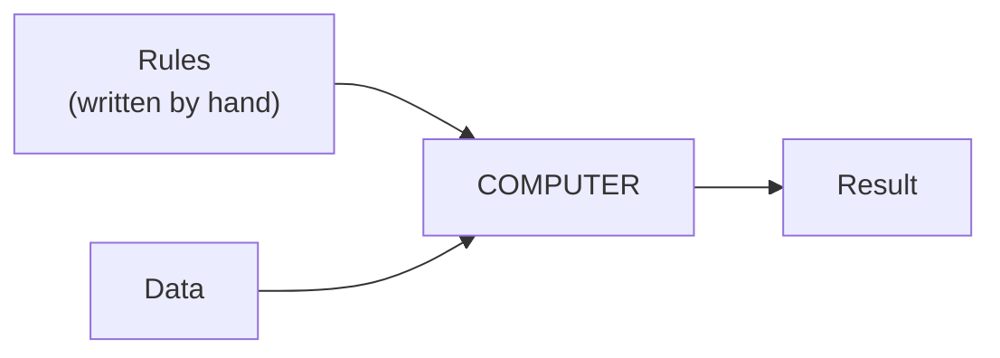
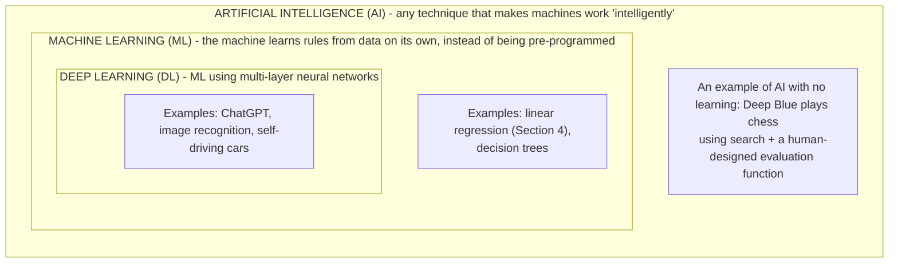
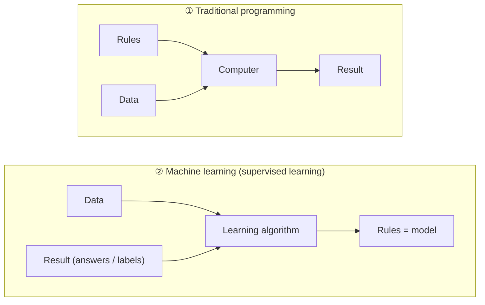
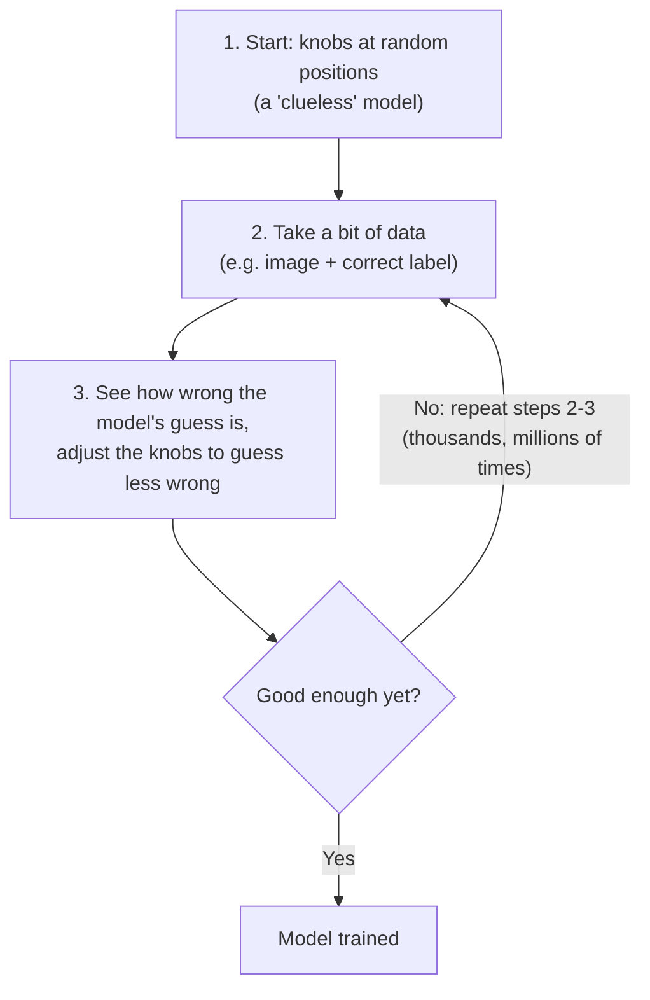
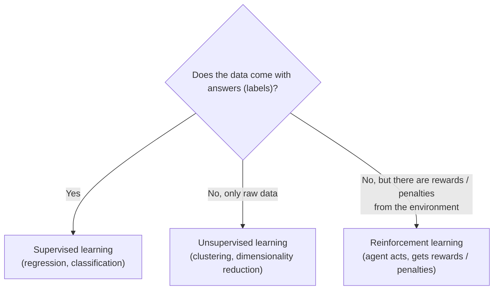

> **Learning objectives:** After this lesson, you will understand what AI, Machine Learning (ML), and Deep Learning (DL) are, how they differ, when you need them, and what components a "learning machine" actually consists of.

## 1. What happens when you say "Hey Siri"?

Picture an ordinary morning: you pick up your phone and say *"Hey Siri, directions to the nearest coffee shop"*.

In those few short seconds, a chain of things has happened:

- The phone **listens** and recognizes that you just called it (voice recognition).
- It **converts your speech into text** (speech-to-text).
- It **understands** that you want directions (language understanding).
- The map **predicts** the travel time for each route.

No programmer sat down and hand-wrote each rule like *"if the sound has frequency X then that is the phrase Hey Siri"*. Instead, the machine **learned** these abilities **from data** - and "how does a machine learn from data?" is exactly the question this lesson begins to answer.

## 2. Traditional programming: writing rules by hand

First, let's look at how "normal" software works.

Suppose you are building an online store. You would sit down and list the rules:

- When the customer clicks "Add to cart" → add a row to the cart table.
- When the cart is empty and the customer clicks "Checkout" → show an error message.
- When the order is over 500,000 VND → free shipping.

This approach is called **traditional programming**: humans come up with the **rules**, and the machine simply follows them.

This works very well - **if you can write the rules down**. And here is the crux: the book *Dive into Deep Learning* has a lovely line:

> *"When you can come up with a 100% correct solution yourself, you usually don't need machine learning."*

But think about it: how would you write rules for the following problems?

- Look at a photo and say whether there is a cat in it.
- Listen to an audio clip and say whether the speaker said "Hey Siri".
- Predict tomorrow's weather from satellite images.

Take the "Hey Siri" problem: every second, the microphone captures about **44,000 numbers** (sound wave amplitudes). What rule would you write to turn those 44,000 numbers into a "yes/no" answer? **Nobody can.** The interesting part is that we ourselves recognize "Hey Siri" effortlessly - yet we *cannot express as rules* how our brains do it.

This is exactly where machine learning comes in.

## 3. Three concepts: AI, Machine Learning, Deep Learning

These three terms are often used interchangeably. In fact they nest inside one another like three concentric circles: deep learning sits inside machine learning, and machine learning sits inside AI:

### 3.1. AI - Artificial Intelligence (the broadest concept)

**AI** is the big goal: getting machines to do things that normally require human intelligence - understanding language, recognizing images, playing chess, driving...

AI does not necessarily have to "learn". For example, Deep Blue - the machine that beat world chess champion Kasparov in 1997 - played chess mainly by searching the space of possible moves at enormous speed, combined with an evaluation function designed by humans. It is still AI, but it does not learn the way modern ML models learn from data.

### 3.2. Machine Learning

**Machine learning is the study of algorithms that can learn from experience.** As they accumulate more experience (usually in the form of **data**) and are trained properly, the algorithms' performance typically improves.

Compare this with the online store above: that website runs the same logic forever; whether it serves 1 customer or 1 million, it stays exactly the same until a programmer edits the code by hand. With an ML system, on the other hand, when more data comes in, we can **retrain** the model so it gets better - the improvement comes from data, not from humans rewriting the rules.

You can think of ML as **inverting** traditional programming: the output of the old approach becomes the input of the new one, and vice versa.

Example: to get a machine to recognize cats, we do **not** describe "a cat has pointy ears, whiskers...". We give the machine **thousands of photos** labeled "cat" / "not cat", and let the algorithm **find the patterns on its own**. *Dive into Deep Learning* calls this **"programming with data"** - a memorable phrase worth holding on to.

> ⚠️ **A small note:** The "inverted" diagram above describes **supervised learning** - the family of problems where the data comes with answers, which is common in practice and will be introduced in Section 6. Unsupervised learning and reinforcement learning frame the problem differently, with no "Result (answers)" as input.

### 3.3. Deep Learning

**Deep learning** is a branch of machine learning that uses a model called an **artificial neural network** made up of **many layers** that process data one after another. The word **"deep"** literally means: data passes through *many layers of transformation* before a result comes out.

An intuitive example with face recognition:

- The **first layers** learn to recognize simple things: edges, corners, light and dark patches.
- The **middle layers** combine these into eyes, noses, ears.
- The **deeper layers** combine those further into whole faces.

The standout advantages of deep learning over traditional ML:

1. **It learns features on its own.** Previously, experts had to hand-design "features" from raw data (for example, an edge-detection algorithm for images) before feeding them into a model - a step called *feature engineering*, which is very labor-intensive. Deep learning learns **directly from raw data** (pixels, sound waves, text): all the layers are trained **together, end-to-end**.
2. **It handles "hard" data well.** Images, audio, text of varying lengths - things that classical methods struggle with.
3. **It can exploit big data.** The capabilities of models like ChatGPT come from training neural networks on enormous amounts of data and computing power.

> 💡 **Quick takeaway:** AI is the *goal*, Machine Learning is the *method* (learning from data), Deep Learning is *a branch of that method, using multi-layer neural networks*. All DL is ML, all ML is AI - but not the other way around.

## 4. How does a machine "learn"?

You may have already "done machine learning" without knowing it. Here is an example (taken from *Dive into Deep Learning*):

You call a plumber to unclog a pipe. The plumber works **3 hours** and charges **350,000 VND**. Your friend calls the same plumber, who works **2 hours** and charges **250,000 VND**. Now someone asks: *"If the plumber works 4 hours, how much will it cost?"*

You would reason: each extra hour costs 100,000 VND → the labor rate is **100,000 VND/hour**, plus a **50,000 VND call-out fee**. So 4 hours would be 100×4 + 50 = **450,000 VND**.

Congratulations - you just did exactly what an ML model does:

| Step | What you just did | Name in ML |
|---|---|---|
| 1 | Collect 2 invoices | **Data** |
| 2 | Guess the form of the formula: `cost = a × hours + b` | **Model** |
| 3 | Find `a = 100, b = 50` so that it matches the invoices | **Training** |
| 4 | Compute the cost for a 4-hour job | **Prediction** |

> 🔧 **Try it now:** If the plumber works **5 hours**, how much does it cost? Answer: 100×5 + 50 = **550,000 VND**. Now a third invoice arrives: **1 hour** of work, charged **150,000 VND** - does the model `100 × hours + 50` still fit? 100×1 + 50 = 150 → it fits, no "knob adjustment" needed yet.

This is essentially **linear regression** - one of the simplest and oldest ML models (Gauss was using it in the early 19th century for astronomy!). Modern models are far more complex, but **the spirit is exactly the same**: find the numbers (parameters) that make the model fit the data.

### The "knobs" and the training loop

Think of a model as a machine with lots of **knobs (parameters)**. Turn the knobs differently and the machine produces different outputs. In the example above there are only 2 knobs (`a` and `b`); modern neural networks can have **millions to billions** of such parameters.

**"Learning" is precisely the process of finding the right positions for those knobs**, and it happens in a loop:

## 5. Four components for understanding how a model learns

A useful way to picture ML training is through the following four components (this presentation follows *Dive into Deep Learning*):

### ① Data

The raw material for learning. Each **example** consists of **features** - the input information - and usually a **label** - the correct answer.

- *Predicting house prices:* features = floor area, number of bedrooms, distance to the city center; label = sale price.
- *Recognizing cats:* features = the pixels; label = "cat" / "not cat".

For a computer, everything must be converted into **numbers**: a 200×200 pixel color image is 200 × 200 × 3 = 120,000 numbers (3 color channels: red, green, blue).

> 🔧 **Try it now:** The MNIST handwritten digit dataset (mentioned again in Section 7) consists of grayscale images of **28×28** pixels, with just 1 color channel. How many numbers is each image? Answer: 28 × 28 × 1 = **784**. About 150 times smaller than the 200×200 color image above - one reason MNIST is the "first exercise" of image recognition.

Two important things about data:

- **More high-quality data usually makes a better model.** The abundance of data is one of the big reasons deep learning took off.
- **Garbage in → garbage out.** If the data is full of errors, or biased (for example, a skin cancer diagnosis system that has never "seen" dark skin), the model will be wrong - and possibly unfairly wrong for one group of people.

### ② Model

The machine that turns inputs into predictions - the "machine with many knobs" from above. It might be a simple formula (a straight line) or a neural network with millions to billions of parameters. In deep learning, the model consists of **many layers of transformation chained together**.

### ③ Objective / Loss function

The yardstick that tells you **how well or how badly** the model is doing, as a single number. By convention, **lower** is better, so it is commonly called a **loss function** - the less "loss" the better.

- Predicting a number (house price): typically the **squared error** - (prediction − actual)².
- Classification (cat/dog): the loss measures how far the model's prediction deviates from the correct label (the specific function will be discussed in Lesson 10).

Without this yardstick, there can be no "learning", because the machine has no idea what "progress" means.

### ④ Optimization algorithm

The way to **adjust the knobs** to reduce the loss. The classic algorithm is **gradient descent**: at each step, consider whether nudging each knob slightly would make the loss go up or down, then turn it in the direction that makes it **go down**. It is like a hiker descending a mountain in fog: you can't see the way to the bottom, but you always step in the downhill direction. (Lesson 11 will cover this in detail.)

> 💡 **Formula to remember:** **Data** + **Model** + **Yardstick for error** + **Way to adjust** ≈ a typical ML training loop.

## 6. Types of Machine Learning problems (a quick look)

This section is only a quick introduction so you have a "map" - Lesson 05 will go deeper.

### 6.1. Supervised Learning

The data **comes with answers (labels)**. It is like a student doing practice tests **with the answer key at the back of the book**: do the exercise, check the answer, learn from it. This is a very common family of problems in practice. Two main types:

| Type | Characteristic question | Output | Examples |
|---|---|---|---|
| **Regression** | *"How much?"* | A number | House price? How many mm of rain tomorrow? |
| **Classification** | *"Which kind?"* | A group/class | Is this email spam or not? Which digit 0-9 is in this image? |

A tip for telling them apart: a **"how much / how many"** question → regression; a **"which one"** question → classification.

> 🔧 **Try it now:** Classify these 3 problems. (a) Predict your household's electricity bill next month. (b) Read a review on Shopee and tell whether the customer is praising or complaining. (c) Estimate the temperature at noon tomorrow. Answer: (a) regression - "how much money?"; (b) classification - two classes, praise / complaint; (c) regression - temperature is a number.

An interesting note: classification models usually return a **probability** ("90% this is a cat") rather than a flat assertion. And a high probability is not necessarily enough to act on: if the model says the mushroom you picked *"has only a 20% chance of being poisonous"*, you still should not eat it - because the price of that 20% is your life. Decision = probability × consequence.

### 6.2. Unsupervised Learning

The data has **no labels** - just a pile of data and an open question: *"is there any interesting structure in here?"* Examples:

- **Clustering:** automatically group customers into clusters with similar behavior.
- **Dimensionality reduction:** compress thousands of data columns down to a few most important numbers while keeping the "essence".

### 6.3. Reinforcement Learning

The machine is an **agent** interacting with an environment: it takes actions → receives **rewards** or **penalties** → gradually works out a good strategy. It is like training a pet with treats. Reinforcement learning is an important component of systems like AlphaGo (the program that beat the world Go champion), and is also used in robotics and self-driving cars.

The three families summed up in one question:

## 7. Why did Deep Learning take off (and why only recently)?

The surprise: the idea of neural networks is **not new at all** - it dates back to the 1940s-1950s, inspired by how neurons in the brain connect to each other. But for decades it was "shelved" for two reasons: **lack of data** and **lack of computing power**.

Three things changed the game (from around 2010):

1. **Massive data** - the Internet, phones, and cheap sensors generate more data than ever before. In the late 1990s, a dataset of 60,000 handwritten digit images (MNIST) was considered "huge"; today, models learn from billions of texts and images.
2. **Computing power (GPUs)** - chips originally built for gaming turned out to be extremely good at the computations of neural networks; the number of operations per second that a training system can perform has grown by many orders of magnitude over two decades.
3. **Algorithmic advances and open-source tools** - new ideas (dropout, attention, Transformers...) together with libraries like PyTorch and TensorFlow. The authors of *Dive into Deep Learning* recount that in 2014, training a logistic regression model was still a hard homework problem for new PhD students at Carnegie Mellon; today it takes fewer than 10 lines of code.

A concrete result: in the ImageNet image recognition competition (ILSVRC), the top-5 error rate (the model gets 5 guesses and is counted wrong only if all 5 miss) of the winning team dropped from about **28%** in 2010 to about **2.25%** in 2017. Then came the large language models (like ChatGPT, Claude) - essentially very deep neural networks that learn from an enormous amount of text.

### A condensed timeline

| Year | Milestone |
|---|---|
| Early 19th century | The "least squares" method is formulated and developed (Legendre, Gauss) - the ancestor of linear regression |
| 1950 | Alan Turing asks *"Can machines think?"* (Turing test) |
| 1957 | The Perceptron - one of the early and highly influential artificial neuron models (the idea of an artificial neuron itself dates from 1943) |
| 1997 | Deep Blue (IBM) beats world chess champion Kasparov (AI based on large-scale search + a hand-designed evaluation function) |
| 2012 | AlexNet wins the ImageNet image recognition competition by a wide margin - deep learning "returns" |
| 2016 | AlphaGo beats the world Go champion |
| 2017 | The **Transformer** architecture is born - the foundation of most modern large language models |
| 2022 | **ChatGPT** launches - estimated to reach 100 million monthly users in about 2 months, a growth record at the time |
| 2023-2024 | GPT-4, Claude, Gemini: **multimodal** models - understanding text, images, and audio at the same time |
| 2024-2025 | **Reasoning models** that "think step by step" before answering; **AI agents** begin carrying out chains of tasks on the user's behalf |

### The current wave: Generative AI

Previously, ML was mostly used for **classification and prediction** (is this email spam? what is the house price?). The new wave - **generative AI** - goes further: the model learns the "distribution" of the data so well that it can **create new content**: writing prose, writing code, painting pictures, producing video from a few lines of description.

> ⚠️ **A small note:** Generative AI is not synonymous with a single architecture. Most modern generative AI is still deep learning: large language models are usually built on the Transformer architecture, while image and video generation systems may use Transformers, diffusion, or a combination of several architectures - what they have in common is that they are all trained on enormous amounts of data.

> 📊 **The speed of AI adoption in a few numbers** (according to Stanford University's AI Index 2025 report):
> - In 2024, **78%** of surveyed businesses used AI in at least one part of their work, compared with 55% the year before.
> - The inference cost of a model matching GPT-3.5 performance fell about **280-fold** in 18 months (from ~20 USD to ~0.07 USD per million tokens).
> - In the US, the number of job postings mentioning generative AI skills rose from about **16,000 to 66,000** in one year.

## 8. ML is around you more than you think

Machine learning has been "hiding" in everyday life for a long time:

- **Email spam filtering**, detecting fraudulent card transactions.
- **Movie/music/product recommendations** on Netflix, Spotify, Shopee, TikTok.
- **Ranking search results** on Google.
- **Virtual assistants** Siri, Alexa, Google Assistant.
- **Unlocking your phone with your face**, cameras that auto-focus on people's faces.
- **Medical diagnosis** (detecting skin cancer from photos), **self-driving cars** (the image recognition part).
- **AI chatbots** that write, translate, and code.

### AI "made in Vietnam" 🇻🇳

No need to look far: right in Vietnam, AI is being built and used every day:

- **Zalo AI (VNG):** the Vietnamese-language voice assistant **Kiki** in cars, speech-to-text right inside the Zalo app - **Vietnamese** language and speech processing problems that foreign models still don't handle well.
- **VinAI (Vingroup):** an AI research institute with many publications at the field's major conferences (NeurIPS, CVPR...), which also develops AI products for cars such as driver monitoring cameras.
- **FPT.AI:** virtual assistants and chatbots for banking, finance, and logistics - according to FPT, the platform has handled more than **200 million automated interactions**.

What this means: the knowledge in this series has a place to be put to use right in the Vietnamese market, not just in Silicon Valley.

### And when do you NOT need ML?

Don't use a sledgehammer to crack a nut. If the problem has clear rules that can be written down and are 100% correct - use traditional programming:

- Computing taxes, computing interest → the formula already exists.
- Checking that a password has at least 8 characters → a single `if` statement.

Only think about ML when: the rules are **too complex to describe** (image recognition, speech understanding), or the patterns **keep changing over time** (spam trends, user tastes), **and** you have (or can collect) **data**.

## Lesson summary

- **Traditional programming:** humans write the rules → the machine follows them. **Machine learning:** the machine derives the rules from data and answers on its own - *"programming with data"*.
- **AI ⊃ ML ⊃ DL:** AI is the goal of making machines smart; ML is a way to reach that goal by learning from data; DL is the branch of ML that uses multi-layer neural networks - especially effective on complex data like images, audio, and text.
- You can picture how an ML model learns through **4 components**: **data** → **model** (a machine with many knobs) → **loss function** (yardstick for error) → **optimization algorithm** (how to adjust the knobs to reduce the error).
- Three big families of problems: **supervised learning** (with answers - regression & classification), **unsupervised learning** (no answers - finding structure), **reinforcement learning** (rewards/penalties).
- Deep learning took off thanks to the trio: **big data + GPUs + open-source tools**.
- Data determines quality: *garbage in, garbage out*.

## Self-check questions

1. State the core difference between traditional programming and machine learning. Redraw the "inverted" diagram if you remember it.
2. Which statement is correct: *"All deep learning is AI"* or *"All AI is deep learning"*? Why?
3. Which of the following problems is **regression**, and which is **classification**?
   - a) Predicting the number of hotel rooms booked next weekend.
   - b) Recognizing which province a license plate in a photo belongs to.
   - c) Estimating the delivery time of a courier's order.
4. Among the 4 components of an ML system, what role does the "loss function" play? If it were missing, what would happen?
5. Give 3 reasons why deep learning only took off in roughly the last decade even though the idea has existed since the mid-20th century.
6. Think about your own work/life: is there something you *do easily* but *cannot write down as rules* to teach someone else step by step? (That is a prime candidate for machine learning!)

## Further reading

**Primary sources for this lesson:**

| Source | Which part to read |
|---|---|
| **Dive into Deep Learning (d2l.ai)** | Chapter 1 - *Introduction*: the wake word example, the 4 components, the types of ML problems |
| **An Introduction to Statistical Learning (ISLP)** | Chapters 1-2: the statistical perspective, history, prediction vs. inference |
| **Mathematics for Machine Learning (MML)** | Chapter 1: the three core concepts - data, model, learning |

**Additional free online sources:**

- [Machine Learning cơ bản](https://machinelearningcoban.com/) - the classic Vietnamese-language blog by Vũ Hữu Tiệp, explaining ML in a very accessible way.
- [Stanford AI Index Report](https://hai.stanford.edu/ai-index) - the annual report on the state of AI worldwide: figures, trends, jobs (the numbers in this lesson come from the 2025 edition).
- [AI Timeline 2020-2026 (Machine Brief)](https://www.machinebrief.com/timeline) - a continuously updated timeline of recent AI milestones.

> **Next lesson:** [Python & Data Tools for AI](../python-data-tools-for-ai/) - getting your "toolkit" ready - Python, NumPy, Pandas - to start working with data hands-on.
