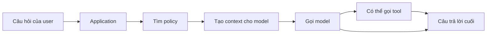
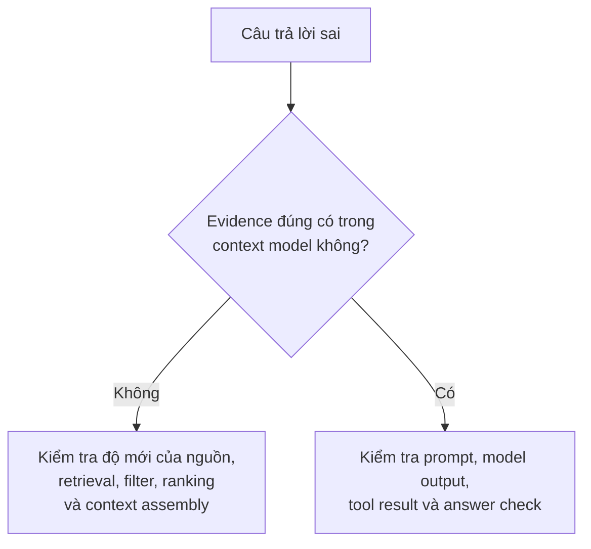
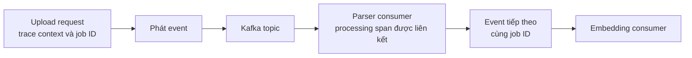
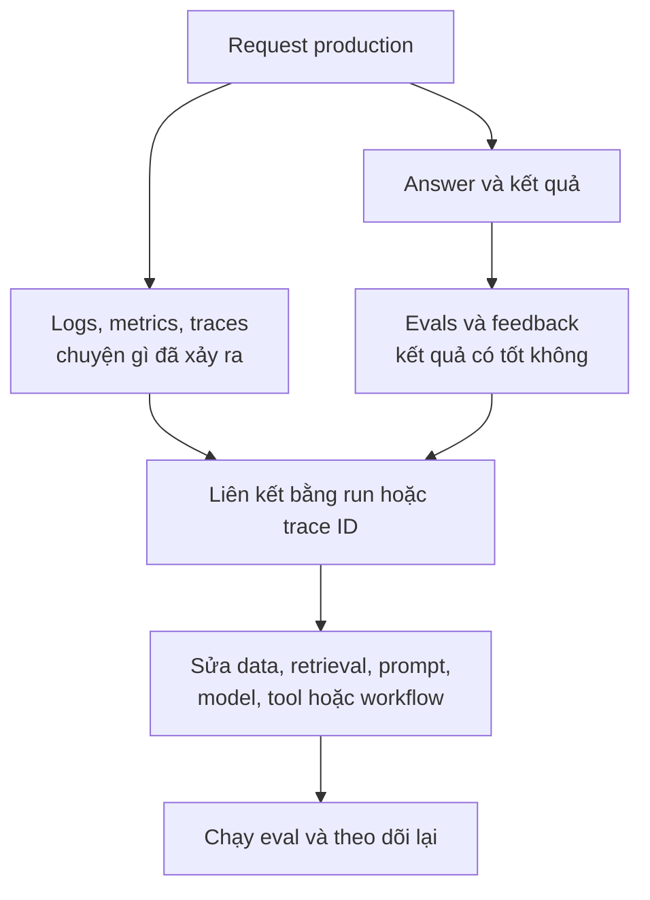

Một API trả HTTP 500 báo hiệu vấn đề khá rõ. Nhưng ứng dụng AI có thể trả HTTP 200, viết rất mượt, và vẫn hoàn toàn sai. Vì vậy quan sát AI production không thể dừng ở CPU, latency và error rate.

Giả sử một nhân viên hỏi: "Nhân viên thử việc được nghỉ bao nhiêu ngày?" Trợ lý trả lời "12 ngày" sau 3,2 giây. Server vẫn khỏe. Chính sách thật là **10 ngày**.

Về mặt hạ tầng, request thành công. Về mặt công việc của user, nó thất bại. Team nên tìm ở đâu trước?

## 1. Service khỏe vẫn có thể đưa ra câu trả lời tệ

Monitoring truyền thống vẫn rất cần. Database down, GPU quá tải hay timeout đều có thể phá sản phẩm AI như bất kỳ ứng dụng nào khác. Nhưng AI có thêm những lỗi mà dashboard sức khỏe hệ thống khó thấy:

- Retrieval lấy bản policy cũ.
- Tài liệu đúng đã được lấy, nhưng context builder bỏ mất đoạn quan trọng.
- Model nhìn thấy evidence đúng mà vẫn trả lời sai.
- Agent chọn nhầm tool hoặc lặp lại cùng một lần search nhiều lần.
- Câu trả lời đúng, nhưng mất 35 giây và dùng quá nhiều token.

Câu hỏi hữu ích không chỉ là **"Hệ thống có chạy không?"** mà còn là **"Request này đã trải qua những gì, và kết quả có tốt không?"** [Hướng dẫn observability cho GenAI của AWS](https://docs.aws.amazon.com/AmazonCloudWatch/latest/monitoring/GenAI-observability.html) đặt sức khỏe hạ tầng bên cạnh usage, hoạt động của model và Agent, cùng tín hiệu chất lượng.

Observability giúp ta nhìn thấy quá trình. Nó không tự chứng minh vì sao model chọn một từ cụ thể; nó cung cấp bằng chứng để engineer kiểm tra các nguyên nhân khả dĩ.

## 2. Chỉ nhìn final answer thì chưa đủ để debug

Nếu team chỉ lưu câu hỏi, câu trả lời và tổng latency, con số "12 ngày" có rất nhiều lời giải thích. Retriever lấy nhầm tài liệu? Lấy đúng tài liệu nhưng bản cũ? Model bỏ qua evidence? Hay tool đã trả lỗi?

Một request production có thể đi qua:

**Trace** ghi lại các thao tác trong một run. Mỗi thao tác có thời gian thường được biểu diễn bằng một **span**. Nhờ trace, câu "Request mất 18 giây" có thể được tách ra:

| Span | Thời gian | Ta biết được gì? |
| --- | ---: | --- |
| Retrieval | 0,8 s | Tìm kiếm khá nhanh |
| Model call 1 | 2,7 s | Lần sinh đầu khá nhanh |
| Inventory tool | 10,4 s | Có vẻ là nút thắt latency |
| Model call 2 | 4,1 s | Lần sinh cuối diễn ra sau tool |

Các số trên chỉ để minh họa. Điều quan trọng là chỗ cần sửa có thể nằm ở tool, không phải model. [Tài liệu Agent tracing chính thức của OpenAI](https://developers.openai.com/api/docs/guides/agents/integrations-observability) mô tả trace gồm model call, tool call, handoff, guardrail và custom span.

## 3. Logs, metrics và traces trả lời những câu hỏi khác nhau

AI observability mở rộng các công cụ quen thuộc của distributed systems chứ không thay thế chúng.

| Tín hiệu | Câu hỏi chính | Ví dụ |
| --- | --- | --- |
| Logs | Điều gì đã xảy ra ở một bước cụ thể? | Tool call timeout ở request 123 |
| Metrics | Xu hướng nào đang thay đổi? | P95 latency tăng sau deploy |
| Traces | Một request đã đi qua đâu? | Retrieval, model, tool, model, answer |

Log hữu ích để xem chi tiết. Metric giúp thấy xu hướng và tạo alert. Trace nối các bước thành một câu chuyện. Kết hợp lại, chúng giúp phân biệt lỗi diện rộng với một request bất thường.

Với AI, câu chuyện đó cần thêm context so với HTTP trace thông thường. Những field hữu ích có thể là phiên bản model và prompt, số input/output token, ID tài liệu được lấy, tên và trạng thái tool, số lần retry, cùng lý do run dừng. Đừng mặc định framework sẽ tự ghi đủ; những bước đặc thù của ứng dụng cần được instrument riêng.

[GenAI conventions của OpenTelemetry](https://github.com/open-telemetry/semantic-conventions-genai/blob/main/docs/gen-ai/gen-ai-spans.md) cung cấp cách đặt tên chung cho usage model và các thao tác liên quan. Conventions và instrumentation vẫn phát triển, nên field thực tế có được phụ thuộc thư viện và phiên bản đang dùng.

## 4. Với RAG, phải nhìn đường đi của evidence

Trong [RAG](../production-rag-architecture-vi/), answer nằm ở cuối một chuỗi: query, retrieval, chunk được chọn, context đưa vào model, response.

Giả sử evidence cần thiết nằm trong Policy 2026, chunk 41. Trace lại chỉ có Policy 2024, chunk 12 và một FAQ cũ. Đổi prompt hoặc đổi model khó chữa được lỗi thiếu evidence này. Model chưa hề thấy chính sách hiện tại.

Một RAG trace hữu ích có thể ghi:

- Query và metadata filter đã dùng, trong giới hạn chính sách quyền riêng tư.
- ID, version, rank và score của document/chunk được lấy.
- Những chunk nào thực sự đi vào context của model.
- Answer có dựa vào hoặc trích dẫn những chunk đó không.

Ranh giới này giúp phân biệt **retrieval hoặc context failure** với **generation failure**. Cả hai có thể tạo cùng một answer sai, nhưng cần cách sửa khác nhau. [Hướng dẫn RAG evaluation của AWS](https://docs.aws.amazon.com/bedrock/latest/userguide/knowledge-base-eval-llm-results.html) cũng xem relevance và coverage của retrieval là những câu hỏi riêng với chất lượng response.

Score chỉ là dấu hiệu để điều tra, không chứng minh một chunk là đúng. Không nhất thiết chép nguyên văn toàn bộ tài liệu nhạy cảm vào telemetry nếu ID ổn định và quyền truy cập nguồn đã đủ cho việc debug.

## 5. Agent trace cho thấy chất lượng quá trình, không chỉ output

[Agent](../agent-architecture-next-step-vi/) có thể đi theo nhiều đường hợp lệ dù yêu cầu gần giống nhau. Nó có thể chọn tool, xem kết quả, search tiếp, handoff cho Agent khác hoặc dừng để xin approval. Một sơ đồ A-B-C cố định không giải thích được Agent thực sự đã làm gì.

Với mỗi run, ta có thể hỏi:

- Agent chọn tool nào, theo thứ tự nào, với argument gì?
- Nó có lặp việc, retry hay handoff không?
- Hành động nhạy cảm có được dừng để phê duyệt không?
- Run hoàn thành mục tiêu hay dừng vì chạm limit?

Một Agent có thể trả đúng "Tồn kho còn 142 sản phẩm" sau bốn lần web search và hai lần gọi inventory database. Agent khác có cùng câu trả lời chỉ sau một lần tra inventory. User thấy kết quả giống nhau, nhưng đường đi đầu tiên chậm hơn, tốn hơn và có nhiều cơ hội lỗi hơn.

[Hướng dẫn Agent eval của OpenAI](https://developers.openai.com/api/docs/guides/agent-evals) khuyến nghị dùng trace để xem việc chọn tool, handoff và tuân thủ policy, rồi chấm nhiều ví dụ lặp lại để tìm regression. Trace thể hiện hành động và output quan sát được, không phải suy nghĩ nội bộ ẩn của model.

## 6. Kafka làm call stack không còn liền mạch

Trong [bài Kafka trước](../kafka-event-driven-ai-systems-vi/), một lần upload tài liệu tạo event; parser xử lý nó; event tiếp theo khởi động embedding. Những bước đó có thể chạy ở các máy khác nhau, cách nhau vài phút.

Nếu upload request và embedding job không có context chung, chúng trông như hai việc không liên quan. Hãy mang theo những ID như document ID và job ID, rồi truyền trace context trong metadata của message khi thiết kế tracing yêu cầu. Khi đó engineer có thể hỏi: "Tài liệu được upload khi nào, consumer nào đã xử lý và nó mắc ở đâu?"

Với fan-out hoặc batch bất đồng bộ, consumer span có thể được **liên kết** tới message context của producer, thay vì là một child span đơn giản. [Messaging conventions của OpenTelemetry](https://opentelemetry.io/docs/specs/semconv/messaging/messaging-spans/) giải thích vì sao phải truyền message-creation context và vì sao span link thường là cách biểu diễn phù hợp.

Chỉ có trace ID chưa phải phép màu. Instrumentation còn phải truyền context, ghi span có ý nghĩa và giữ cách liên kết công việc khi một trace mới bắt đầu.

## 7. Version và token usage biến triệu chứng thành manh mối

Giả sử user bắt đầu phàn nàn về report sau một lần deploy. Trace cho thấy data source và kết quả retrieval không đổi, nhưng prompt template v18 đã thay v17. Phạm vi điều tra lập tức hẹp lại. Lưu version của model, prompt, retriever, index và tool giúp tái hiện regression dễ hơn. [AWS khuyến nghị quản lý phiên bản prompt và asset liên quan để truy vết](https://docs.aws.amazon.com/wellarchitected/latest/generative-ai-lens/genops03.html).

Token count còn chỉ ra loại lỗi khác. Nếu input token trung bình tăng từ 4.000 lên 11.500 sau một release, context builder có thể đang gửi chunk trùng, quá nhiều chat history hoặc tool schema quá lớn. Chất lượng trông vẫn như cũ nhưng chi phí tăng.

Nên theo dõi input/output token, latency, retry và ước tính cost theo application và model. Token giúp ước tính chi phí, nhưng hóa đơn provider có thể khác vì giá và cách tính cached token khác nhau. [Ví dụ observability của OpenTelemetry](https://opentelemetry.io/blog/2026/genai-observability/) cho thấy cách ghi duration và token usage của model call.

## 8. Thu nhiều telemetry hơn chưa chắc tốt hơn

Prompt, tool argument, tài liệu được retrieve và response có thể chứa thông tin cá nhân, source code, policy nội bộ, hợp đồng hoặc credential user paste nhầm. Log toàn bộ nội dung có thể tạo một kho dữ liệu nhạy cảm thứ hai trong hệ thống monitoring.

Mặc định an toàn hơn là thu metadata đủ cho phần lớn tình huống: ID, version, thời gian, token count, status và tham chiếu tới nguồn đã được cho phép. Chỉ lưu full content khi có lý do rõ ràng, cùng redaction, sampling, access control, thời hạn lưu và mục đích sử dụng cụ thể.

[OpenTelemetry cảnh báo](https://github.com/open-telemetry/semantic-conventions-genai/blob/main/docs/gen-ai/gen-ai-spans.md) input/output message và tool argument có thể chứa dữ liệu nhạy cảm. Một field có trong tracing schema không có nghĩa phải ghi nó cho mọi user.

Bản thân observability cũng có ngân sách. Field có quá nhiều giá trị khác nhau, payload lớn và lưu vô thời hạn đều khiến telemetry tốn kém, khó dùng.

## 9. Dashboard xanh không chứng minh AI đang hữu ích

Dashboard có thể báo availability 99,99%, ít HTTP error và P95 latency tốt, trong khi user complaint tăng. Sức khỏe vận hành và chất lượng sản phẩm là hai loại tín hiệu khác nhau.

Một cách nhìn thực tế gồm nhiều lớp:

| Lớp | Tín hiệu ví dụ |
| --- | --- |
| System | Availability, P95 latency, queue hoặc consumer lag |
| Cost | Token usage, cost ước tính mỗi request, retry |
| RAG | Độ mới của nguồn, relevance, thiếu evidence |
| Agent | Tool success, call sai, số turn, việc gọi thừa |
| Product | Task completion, feedback, escalation, kiểm tra mẫu chất lượng |

Không phải sản phẩm nào cũng cần mọi metric. Hãy bắt đầu từ định nghĩa "làm tốt" của chính workload. Feedback hữu ích nhưng có nhiễu: user có thể không thích một câu trả lời đúng, hoặc không báo một câu trả lời sai. Gắn feedback với run cụ thể để điều tra và sau này biến thành test case. [Hướng dẫn production feedback của AWS](https://docs.aws.amazon.com/prescriptive-guidance/latest/gen-ai-lifecycle-operational-excellence/prod-monitoring-feedback.html) khuyến nghị liên kết feedback với application trace.

## 10. Observability và evaluation bổ sung cho nhau

Observability hỏi **"Chuyện gì đã xảy ra?"** Evaluation hỏi **"Kết quả đó đã đủ tốt chưa?"**

Trace có thể ghi retriever lấy chunk 12, 18 và 31. Eval mới hỏi evidence cần thiết có nằm trong ba chunk đó không. Trace có thể ghi Agent gọi refund tool. Eval hỏi Agent *có nên* gọi tool đó cho khách hàng này không.

Đây không phải bức tường cứng giữa hai team hoặc hai công cụ. Điểm eval và feedback của con người có thể trở thành quality signal trên dashboard observability. Trace có thể cung cấp các ví dụ thất bại cho eval dataset chạy lặp lại. Nhưng thời gian, token và HTTP status tự chúng không chứng minh câu trả lời đúng sự thật.

Mục tiêu không phải thu một kho log lớn nhất có thể. Mục tiêu là có đủ *bằng chứng an toàn và được nối với nhau* để khi ai đó nói "AI trả lời sai", team có thể xác định vấn đề nằm ở data, retrieval, prompt, model, tool, quyết định của Agent, queue hay hạ tầng.

Đó là lúc một hệ thống AI có tính xác suất trở thành thứ engineer thực sự debug được, thay vì một chiếc hộp đen mà mỗi lần sai lại chỉ biết thử đổi prompt.

## Nguồn tham khảo

- [Generative AI observability - AWS CloudWatch](https://docs.aws.amazon.com/AmazonCloudWatch/latest/monitoring/GenAI-observability.html)
- [Integrations and observability for agents - OpenAI Developers](https://developers.openai.com/api/docs/guides/agents/integrations-observability)
- [GenAI spans semantic conventions - OpenTelemetry](https://github.com/open-telemetry/semantic-conventions-genai/blob/main/docs/gen-ai/gen-ai-spans.md)
- [Production monitoring and feedback - AWS Prescriptive Guidance](https://docs.aws.amazon.com/prescriptive-guidance/latest/gen-ai-lifecycle-operational-excellence/prod-monitoring-feedback.html)
- [Evaluate agent workflows - OpenAI Developers](https://developers.openai.com/api/docs/guides/agent-evals)
