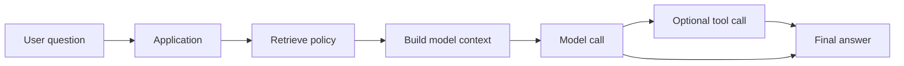
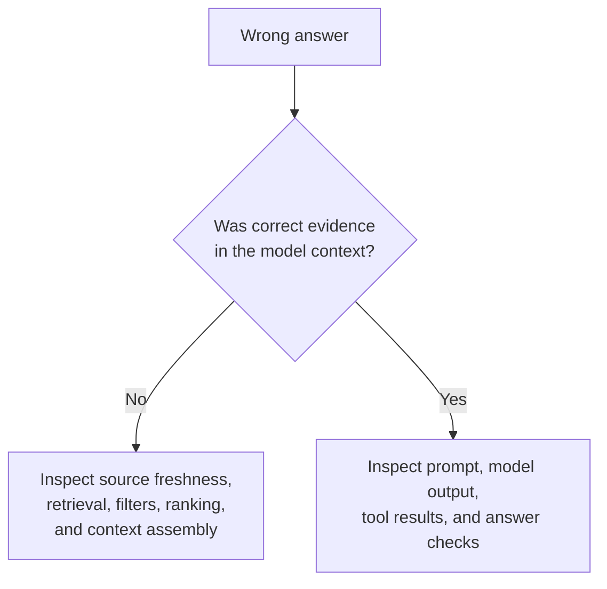
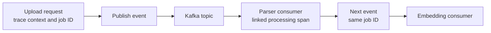
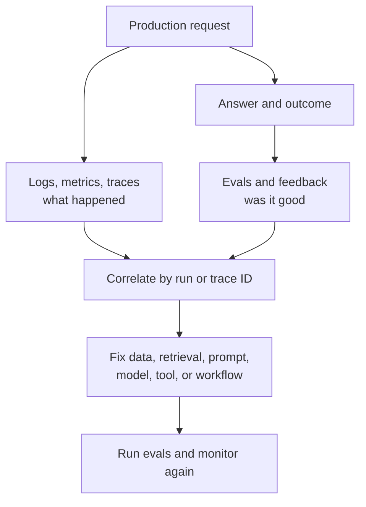

An API returning HTTP 500 clearly signals a problem. An AI application can return HTTP 200, produce a fluent answer, and still be wrong. That is why observing a production AI system cannot stop at CPU, latency, and error rate.

Suppose an employee asks: "How many days of leave does a probationary employee get?" The assistant replies "12 days" in 3.2 seconds. The server is healthy. The real policy says **10 days**.

Infrastructure succeeded. The user's task failed. Where should the team look first?

## 1. A healthy service can still deliver a bad answer

Traditional monitoring remains essential. A down database, overloaded GPU, or timeout can break an AI product just as it breaks any other application. But AI adds failures that ordinary service-health dashboards may not show:

- Retrieval finds an outdated policy.
- The right document is retrieved, but the context builder drops the relevant paragraph.
- The model sees the correct evidence and still answers incorrectly.
- An Agent calls the wrong tool or repeats the same search several times.
- The answer is correct, but takes 35 seconds and uses far more tokens than necessary.

The useful question is not only **"Is the system running?"** It is **"What happened during this request, and was the outcome good?"** [AWS's guidance for generative AI observability](https://docs.aws.amazon.com/AmazonCloudWatch/latest/monitoring/GenAI-observability.html) includes infrastructure health alongside usage, model and Agent activity, and quality signals.

Observability makes the path inspectable. It does not automatically prove why a model chose a particular word; it gives engineers evidence to test likely causes.

## 2. The final answer is not enough to debug

If the team stores only the question, final answer, and total latency, "12 days" has many possible explanations. Was the wrong document retrieved? Was it the right document but an old version? Did the model ignore the evidence? Was there a tool error?

A production path may look like this:

A **trace** records the operations within one run. Each timed operation is often represented by a **span**. With a trace, "The request took 18 seconds" can become:

| Span | Duration | What it tells us |
| --- | ---: | --- |
| Retrieval | 0.8 s | Search was quick |
| Model call 1 | 2.7 s | Initial generation was quick |
| Inventory tool | 10.4 s | Likely latency bottleneck |
| Model call 2 | 4.1 s | Final generation followed the tool |

The numbers are illustrative. The point is that the fix may be in the tool, not the model. [OpenAI's official Agent tracing guidance](https://developers.openai.com/api/docs/guides/agents/integrations-observability) describes traces that include model calls, tool calls, handoffs, guardrails, and custom spans.

## 3. Logs, metrics, and traces answer different questions

AI observability extends the familiar tools of distributed systems rather than replacing them.

| Signal | Main question | Example |
| --- | --- | --- |
| Logs | What happened at a specific step? | Tool call timed out for request 123 |
| Metrics | What trend is changing? | P95 latency rose after deployment |
| Traces | How did one request move through the system? | Retrieval, model, tool, model, answer |

A log line is useful for detail. A metric is useful for trends and alerts. A trace connects the steps into one story. Together they help distinguish a system-wide regression from one unusual request.

For AI, the story needs more context than a standard HTTP trace. Useful fields may include model and prompt versions, input and output token counts, retrieved document IDs, tool names and statuses, retry count, and the reason a run stopped. Do not assume a framework captures all of these automatically; instrument the application-specific steps yourself.

[OpenTelemetry's GenAI conventions](https://github.com/open-telemetry/semantic-conventions-genai/blob/main/docs/gen-ai/gen-ai-spans.md) define common vocabulary for model usage and related operations. The conventions and instrumentations evolve, so the exact available fields depend on the libraries and versions in use.

## 4. RAG failures require looking at the evidence path

For [RAG](../production-rag-architecture/), an answer is the end of a longer path: query, retrieval, selected chunks, context construction, model response.

Suppose the expected evidence is in Policy 2026, chunk 41. The trace shows only Policy 2024, chunk 12 and an old FAQ. Changing the prompt or model is unlikely to repair the missing evidence. The model never saw the current rule.

A useful RAG trace can record:

- The query and any filters used, subject to privacy policy.
- Retrieved document and chunk IDs, versions, ranks, and scores.
- Which chunks were actually passed to the model.
- Whether the answer cites or relies on those chunks.

This distinction separates **retrieval or context failure** from **generation failure**. Both can produce the same wrong final answer, but they require different fixes. [AWS's RAG evaluation guidance](https://docs.aws.amazon.com/bedrock/latest/userguide/knowledge-base-eval-llm-results.html) also treats retrieval relevance and coverage as questions separate from response quality.

Scores are diagnostic clues, not proof that a chunk is correct. Sensitive document text need not be copied wholesale into telemetry if stable IDs and controlled access to the source are enough.

## 5. Agent traces show process quality, not just output quality

An [Agent](../agent-architecture-next-step/) can take different valid paths for similar requests. It may choose a tool, inspect its result, search again, hand off to another Agent, or pause for approval. A fixed A-to-B-to-C diagram is not enough to explain what it did.

For each run, useful questions include:

- Which tools were selected, in what order, and with what arguments?
- Did the Agent repeat work, retry, or hand off?
- Was a sensitive action paused for approval?
- Did the run complete the goal or stop because it hit a limit?

An Agent might correctly answer "142 items remain in stock" after calling web search four times and the inventory database twice. Another gets the same answer with one inventory lookup. The user-facing answer is identical, but the first path is slower, costlier, and offers more chances to fail.

[OpenAI's Agent evaluation guide](https://developers.openai.com/api/docs/guides/agent-evals) recommends using traces to inspect tool selection, handoffs, and policy adherence, then grading repeated examples to find regressions. A trace shows observable actions and outputs, not the model's hidden internal reasoning.

## 6. Kafka breaks the neat request call stack

In the [previous Kafka article](../kafka-event-driven-ai-systems/), a document upload produced an event; a parser consumed it; another event started embedding. Those steps may happen on different machines minutes apart.

If the upload request and embedding job have no shared context, they can look unrelated. Carry identifiers such as document ID and job ID, and propagate trace context in message metadata where the tracing design calls for it. Then an engineer can ask: "When was this document uploaded, which consumer handled it, and where did it wait?"

For asynchronous fan-out or batches, a consumer span may be **linked** to the producer's message context rather than appear as one simple child span. [OpenTelemetry's messaging conventions](https://opentelemetry.io/docs/specs/semconv/messaging/messaging-spans/) explain why propagating message-creation context is needed and why span links are often the right representation.

A trace ID alone is not magic. Instrumentation must propagate context, record meaningful spans, and preserve a way to correlate work when a new trace is started.

## 7. Versions and token usage turn symptoms into clues

Suppose complaints about reports begin after a deployment. The traces show the same data source and retrieval results, but prompt template v18 replaced v17. That narrows the investigation. Recording model, prompt, retriever, index, and tool versions makes regressions easier to reproduce. [AWS recommends versioned prompts and related assets for traceability](https://docs.aws.amazon.com/wellarchitected/latest/generative-ai-lens/genops03.html).

Token counts can reveal a different failure. If average input tokens rise from 4,000 to 11,500 after a release, the context builder may be sending duplicate chunks, too much chat history, or oversized tool schemas. Quality may look unchanged while cost grows.

Track input and output tokens, latency, retries, and cost estimates by application and model. Token counts help estimate cost, but provider billing may differ because pricing and cached-token accounting vary. [OpenTelemetry's GenAI observability examples](https://opentelemetry.io/blog/2026/genai-observability/) show duration and token-usage signals for model calls.

## 8. More telemetry is not always better

Prompts, tool arguments, retrieved documents, and responses may contain personal data, source code, internal policy, contracts, or pasted credentials. Logging all content can create a second sensitive-data store inside the monitoring platform.

A safer default is to collect metadata needed for most investigations: IDs, versions, timing, token counts, statuses, and approved source references. Capture full content only when justified, with redaction, sampling, access controls, retention limits, and a clear purpose.

[OpenTelemetry warns](https://github.com/open-telemetry/semantic-conventions-genai/blob/main/docs/gen-ai/gen-ai-spans.md) that input/output messages and tool arguments can contain sensitive information. Their presence in a tracing schema is not an instruction to record them for every user.

Observability itself has a budget. High-cardinality fields, giant payloads, and indefinite retention can make telemetry costly and hard to use.

## 9. A green dashboard does not prove the AI is useful

A dashboard could show 99.99% availability, low HTTP errors, and good P95 latency while user complaints rise. Operational health and product quality are different signals.

A practical view has several layers:

| Layer | Example signals |
| --- | --- |
| System | Availability, P95 latency, queue or consumer lag |
| Cost | Token usage, estimated cost per request, retries |
| RAG | Source freshness, retrieval relevance, missing evidence |
| Agent | Tool success, invalid calls, turns, unnecessary work |
| Product | Task completion, user feedback, escalation, sampled quality checks |

Not every product needs every metric. Start with a definition of success for its actual workload. Feedback is useful but noisy: a user may dislike a correct answer or fail to report a wrong one. Attach feedback to the specific run so it can be investigated and later turned into a test case. [AWS's production feedback guidance](https://docs.aws.amazon.com/prescriptive-guidance/latest/gen-ai-lifecycle-operational-excellence/prod-monitoring-feedback.html) recommends linking feedback with application traces.

## 10. Observability and evaluation reinforce each other

Observability asks **"What happened?"** Evaluation asks **"Was that good enough?"**

A trace may say the retriever returned chunks 12, 18, and 31. An eval asks whether the necessary evidence was among them. A trace may say the Agent called the refund tool. An eval asks whether it *should* have called that tool for this customer.

This is not a hard wall between two teams or tools. Evaluation scores and human feedback can become quality signals on an observability dashboard. Traces can supply failed examples for repeatable eval datasets. But timing, tokens, and HTTP status alone do not establish factual correctness.

The goal is not to collect the largest possible log archive. It is to have enough *safe, connected evidence* that when someone says "The AI is wrong", the team can identify whether the problem lies in data, retrieval, prompt, model, tool, Agent decision, queue, or infrastructure.

That is when a probabilistic AI system becomes something engineers can actually debug, instead of a black box they keep poking with a new prompt.
