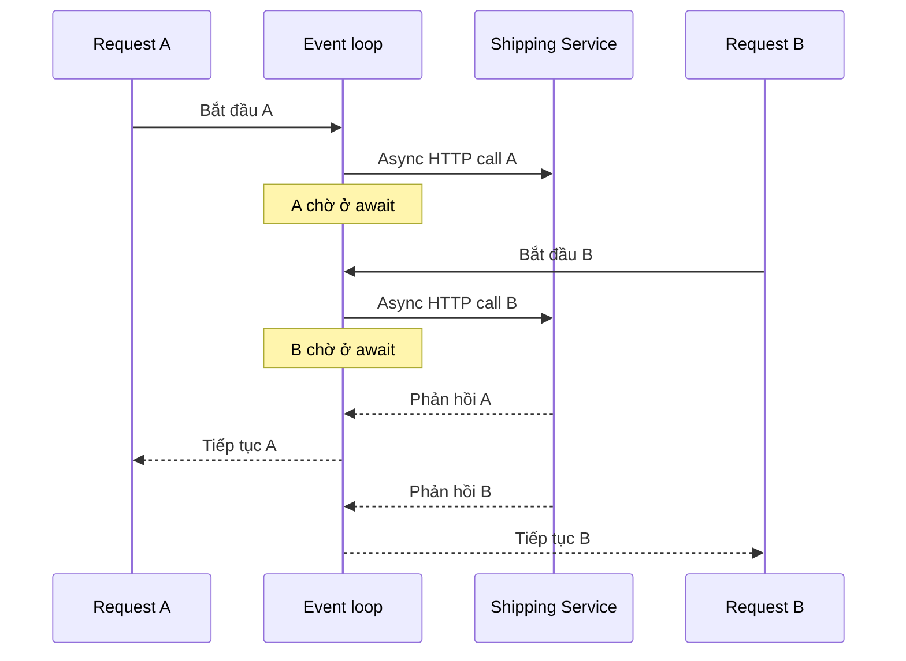
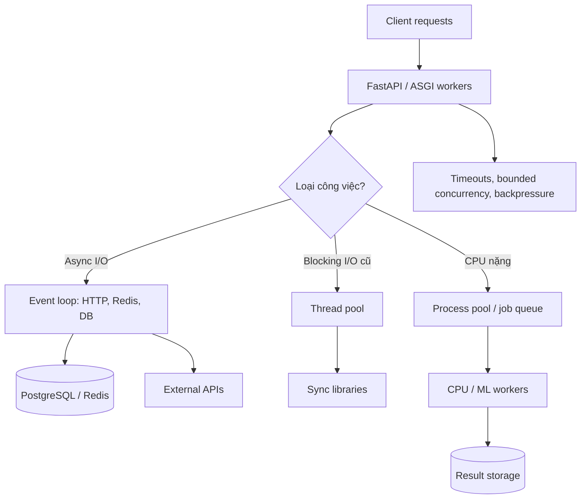

*Backend đã viết bằng `async def` và chạy trên server nhiều CPU core, nhưng khi vài chục request cùng tới, latency vẫn tăng. Một request tính toán nặng còn làm chậm cả các request đơn giản. Vì sao?*

## 1. Đổi sang async nhưng API không nhanh hơn

Giả sử một endpoint FastAPI cần đọc sản phẩm từ PostgreSQL rồi gọi Shipping Service và Promotion Service. Team đổi hàm xử lý từ `def` sang `async def`:

```python
@app.get("/products/{product_id}/details")
async def get_product_details(product_id: int):
    product = get_product_from_db(product_id)
    shipping = get_shipping_fee(product_id)
    promotion = get_promotion(product_id)
    return {"product": product, "shipping": shipping, "promotion": promotion}
```

Nhưng ba hàm bên trong vẫn dùng I/O đồng bộ. Khi một lời gọi HTTP chờ phản hồi, nó có thể chặn thread đang chạy event loop. Các coroutine khác trên cùng loop không được tiếp tục như kỳ vọng. Vấn đề không nằm ở FastAPI mà ở việc nhầm **asynchronous programming**, **concurrency** và **parallelism** là một.

## 2. Concurrency khác parallelism thế nào?

Hãy tưởng tượng một đầu bếp đặt nồi lên bếp rồi thái rau trong lúc chờ nước sôi. Hai công việc tiến triển chồng lấn, nhưng người đó không thao tác bằng hai đôi tay cùng một lúc: đó là **concurrency**. Hai đầu bếp thực sự cùng làm việc ở hai vị trí là ví dụ của **parallelism**.

| Khái niệm | Ý nghĩa | Ví dụ |
| :--- | :--- | :--- |
| Tuần tự | Xong A mới bắt đầu B | Gọi API A rồi mới gọi API B |
| Concurrency | A và B tiến triển chồng lấn | Chờ API A trong lúc xử lý request B |
| Parallelism | A và B thực sự chạy cùng lúc | Hai process tính trên hai CPU core |
| Lập trình async | Tổ chức việc chờ mà không chặn luồng thực thi | `await client.get(...)` |

Trong mô hình `asyncio` thông thường, một event loop quản lý nhiều task trên một thread. Khi task đang chờ I/O và nhường quyền, loop chạy task khác. Nhưng nếu task liên tục tính toán mà không nhường quyền, các task còn lại vẫn phải chờ. **Concurrency không tự tạo CPU parallelism.**

## 3. Event loop làm gì khi gặp `await`?

Request A gửi một async HTTP call tới Shipping Service. Trong lúc chờ, event loop có thể xử lý Request B. Khi phản hồi của A sẵn sàng, loop lên lịch để A tiếp tục:



`await` **không mặc định tạo thread mới**. Coroutine có thể tạm dừng khi chờ một awaitable chưa hoàn thành; loop tận dụng thời gian đó cho việc khác. Không phải *mọi* biểu thức `await` đều chắc chắn chuyển sang task khác, và một thư viện I/O đồng bộ không trở nên non-blocking chỉ vì nằm trong hàm `async def`.

## 4. Async tận dụng thời gian chờ, không làm thời gian chờ biến mất

`asyncio.sleep()` giúp minh họa mà không cần network thật:

```python
import asyncio
import time

async def fetch_product(product_id: int):
    await asyncio.sleep(1)  # mô phỏng I/O chờ một giây
    return {"id": product_id}

async def main():
    start = time.perf_counter()
    sequential = [await fetch_product(i) for i in range(5)]
    print("sequential:", time.perf_counter() - start)

    start = time.perf_counter()
    concurrent = await asyncio.gather(*(fetch_product(i) for i in range(5)))
    print("concurrent:", time.perf_counter() - start)

asyncio.run(main())
```

Năm lần chờ tuần tự mất khoảng năm giây; khi được lên lịch đồng thời, tổng thời gian có thể gần một giây hơn, chưa tính overhead. **Mỗi lần chờ vẫn dài một giây; async chỉ cho các lần chờ chồng lấn.** Đây là ví dụ mô phỏng, không phải benchmark network hay database: hệ thống thật còn giới hạn connection pool, downstream và network.

## 5. Phân biệt I/O-bound và CPU-bound

**I/O-bound** dành nhiều thời gian chờ PostgreSQL, Redis, external API hoặc socket. Async client/driver phù hợp có thể giúp backend phục vụ công việc khác trong lúc chờ. **CPU-bound** dành phần lớn thời gian tính toán như vòng lặp Python nặng, xử lý ảnh hoặc biến đổi dữ liệu lớn. Đổi nó thành `async def` không khiến phép tính tự chạy trên nhiều core.

| Workload | Hướng thường phù hợp |
| :--- | :--- |
| HTTP, Redis, database I/O | Async client/driver hoặc offload I/O đồng bộ |
| Thư viện blocking cũ | Sync endpoint hoặc thread pool |
| Python code tốn CPU | Process pool hoặc worker process |
| ML inference | Native/GPU runtime hoặc worker chuyên dụng |

Đây là gợi ý, không phải quy tắc tuyệt đối: NumPy, thư viện ML và các native extension có thể tự dùng nhiều thread hoặc GPU. Hãy đo workload thực tế.

## 6. Blocking code bên trong `async def`

```python
import time

@app.get("/slow")
async def slow():
    time.sleep(5)
    return {"status": "ok"}
```

`time.sleep(5)` chặn thread của event loop trong năm giây. Nếu thực sự chỉ cần đợi, `await asyncio.sleep(5)` sẽ nhường quyền cho loop. Nhưng không thể biến `requests.get(...)` thành async bằng cách thêm `await`: cần async-compatible HTTP client hoặc đưa blocking call sang thread khác.

Điểm cần phân biệt là **hàm được khai báo async** và **toàn bộ đường xử lý thực sự không chặn event loop**.

## 7. FastAPI chạy `async def` và `def` khác nhau

FastAPI chạy async path operation trên event loop, còn sync path operation khai báo bằng `def` được offload qua thread pool. Vì vậy, nếu đang dùng thư viện I/O đồng bộ, một sync endpoint thường hợp lý hơn việc gọi thư viện ấy trực tiếp trong `async def`:

```python
import requests

@app.get("/external")
def get_external():
    response = requests.get("https://example.com/api", timeout=3)
    response.raise_for_status()
    return response.json()
```

Thread pool cũng hữu hạn. Theo tài liệu Starlette, limiter AnyIO mặc định có **40 token** cho những tác vụ offload tương ứng; sync dependencies và một số hoạt động nội bộ có thể dùng cùng limiter. Không nên hiểu cứng rằng mọi ứng dụng luôn có đúng 40 OS thread. Tăng giới hạn có thể tăng memory và contention. **Thread pool tránh chặn event loop, chứ không làm concurrency vô hạn.**

## 8. Dùng async HTTP client và tái sử dụng connection

Nếu Shipping Service và Promotion Service độc lập, có thể gọi song song bằng HTTPX `AsyncClient`:

```python
import asyncio
import httpx

async def get_shipping(client: httpx.AsyncClient, product_id: int):
    response = await client.get(f"https://shipping.example.com/products/{product_id}")
    response.raise_for_status()
    return response.json()

async def get_promotion(client: httpx.AsyncClient, product_id: int):
    response = await client.get(f"https://promotion.example.com/products/{product_id}")
    response.raise_for_status()
    return response.json()

async def get_details(client: httpx.AsyncClient, product_id: int):
    shipping, promotion = await asyncio.gather(
        get_shipping(client, product_id),
        get_promotion(client, product_id),
    )
    return {"shipping": shipping, "promotion": promotion}
```

Trong đoạn minh họa, `client` phải được tạo trong một async context hợp lệ. Nếu hai service đều mất một giây, tổng thời gian có thể gần thời gian của call chậm hơn thay vì tổng cả hai, nếu không có bottleneck khác.

HTTPX `AsyncClient` có connection pooling. Tạo client mới trên mỗi request thường bỏ lỡ khả năng tái sử dụng connection. Trong production, có thể tạo một client cho mỗi worker ở application lifespan rồi đóng lúc shutdown:

```python
from contextlib import asynccontextmanager
import httpx
from fastapi import FastAPI

@asynccontextmanager
async def lifespan(app: FastAPI):
    async with httpx.AsyncClient(
        timeout=3.0,
        limits=httpx.Limits(max_connections=50, max_keepalive_connections=20),
    ) as client:
        app.state.http_client = client
        yield

app = FastAPI(lifespan=lifespan)
```

Các con số chỉ để minh họa; cần chọn theo traffic và giới hạn của downstream. Async giúp không chặn loop lúc chờ network; pooling quản lý và tái sử dụng kết nối. Hai việc khác nhau nhưng cần phối hợp.

## 9. Async không làm PostgreSQL chạy SQL nhanh hơn

Với SQLAlchemy `AsyncSession` và driver async, `await session.execute(...)` cho event loop cơ hội chạy task khác trong lúc chờ. Nhưng query mất năm giây trên PostgreSQL không tự thành một giây. Nhiều request vẫn có thể xếp hàng chờ database connection.

Một lỗi cần tránh:

```python
await asyncio.gather(
    query_orders(session),
    query_payments(session),
)
```

Nếu cả hai task dùng **cùng một** `AsyncSession`, cách này không an toàn. SQLAlchemy quy định không chia sẻ `AsyncSession` giữa các task chạy đồng thời; mỗi task cần session riêng nếu thực sự phải chạy độc lập. Nhưng hai query trên hai connection cũng không mặc nhiên nhanh hơn một query tốt, và có thể mất một transaction snapshot chung. Trước khi tăng concurrency, hãy xem lại SQL, index, số round-trip, batch query và phạm vi transaction.

## 10. CPU-bound code vẫn chiếm event loop

```python
def heavy_calculation(n: int) -> int:
    return sum(i * i for i in range(n))

@app.get("/calculate")
async def calculate():
    return {"result": heavy_calculation(30_000_000)}
```

Vòng lặp tính toán này không có điểm chờ I/O để nhường quyền. Nó chiếm event-loop thread, làm các request khác bị trì hoãn. Đổi `heavy_calculation` thành `async def` mà vẫn giữ cùng phép tính không tạo thêm CPU core. **Async không phải một phép biến đổi thuật toán CPU-bound thành parallel computation.**

## 11. GIL, threads và processes

Trong CPython build thông thường có **GIL**, nhiều thread không cùng thực thi Python bytecode trên cùng interpreter tại một thời điểm. Vì vậy, dùng thread pool cho cùng một thuật toán thuần Python tốn CPU thường không giúp tận dụng nhiều core. Ngoại lệ có thể gồm native extension giải phóng GIL, thư viện tính toán đa luồng, hoặc CPython free-threaded build tùy chọn từ Python 3.13. Kết luận phải gắn với version, build và workload cụ thể.

**Thread pool** hữu ích cho blocking I/O khi chưa có async client phù hợp:

```python
import asyncio
import requests

def blocking_request():
    return requests.get("https://example.com/api", timeout=3).json()

async def get_data():
    return await asyncio.to_thread(blocking_request)
```

`to_thread()` giải phóng event-loop thread trong lúc lời gọi đồng bộ chạy, nhưng không tự tạo connection pooling tối ưu và thường không tăng tốc pure-Python CPU work trên CPython có GIL.

**Process pool** phù hợp hơn cho phép tính độc lập đủ nặng:

```python
import asyncio
from concurrent.futures import ProcessPoolExecutor

def heavy_calculation(n: int) -> int:
    return sum(i * i for i in range(n))

async def run_calculation(executor: ProcessPoolExecutor, n: int) -> int:
    loop = asyncio.get_running_loop()
    return await loop.run_in_executor(executor, heavy_calculation, n)
```

Các process có thể dùng nhiều core, nhưng phải chuyển arguments/results giữa process, tốn memory và thời gian khởi tạo. Đừng tạo pool mới cho mỗi HTTP request; quản lý vòng đời và số job trong application lifecycle. Hàm gửi sang worker phải import/serialize được. Parallelism chỉ đáng giá nếu công việc đủ lớn để bù overhead.

## 12. Khi nào tách CPU work khỏi HTTP request?

Báo cáo lớn, xử lý video, feature engineering hoặc batch inference có thể kéo dài hàng phút. Giữ HTTP request mở suốt thời gian đó gây timeout và khó phục hồi. Một mô hình khác là trả `job_id`, đưa công việc vào queue bền vững và cho client theo dõi tiến độ:

```text
POST /api/reports
-> {"job_id":"JOB-1001","status":"queued"}
```

Worker service xử lý ngoài request lifecycle. Celery cùng Redis/RabbitMQ là một lựa chọn, không phải lựa chọn duy nhất. `asyncio.create_task()` chỉ tạo task trong process hiện tại; nó không tự cung cấp durable queue, retry bền vững hay phục hồi sau restart. Job quan trọng còn cần state, retry và idempotency.

## 13. Một backend có thể kết hợp nhiều execution model

Một service thực tế có thể dùng async cho network I/O, thread pool cho thư viện blocking cũ, và process pool hoặc worker service cho CPU work:



**Không cần biến mọi thành phần thành async.** Điều quan trọng là ranh giới tài nguyên và vòng đời của từng loại công việc được thiết kế rõ.

## 14. Thêm Uvicorn workers có làm request nhanh hơn?

`uvicorn main:app --workers 4` chạy bốn worker process. Mỗi worker có runtime, event loop, memory và pools riêng theo mô hình triển khai thông thường. Nhiều worker có thể giúp xử lý thêm request hoặc tận dụng nhiều core, **không** làm một query PostgreSQL mất 500 ms tự giảm còn 125 ms.

Tài nguyên downstream lại có thể tăng theo worker. Bốn worker, mỗi pool tối đa 10 connection, có thể cho phép tới 40 connection; ba replica như vậy có giới hạn tiềm năng 120. Nếu mỗi worker còn tạo process pool bốn process, số CPU worker cũng nhân lên. Đừng tăng worker chỉ theo số core mà quên memory, database và external APIs.

Các worker process không mặc nhiên chia sẻ dictionary, in-memory cache, rate-limit counter hay local queue. State cần dùng chung phải đặt ở Redis, database hoặc hệ thống phù hợp. Async điều phối nhiều task trong một process; multiprocessing tăng khả năng chạy song song nhưng làm việc chia sẻ state phức tạp hơn.

## 15. Async không có nghĩa concurrency vô hạn

`asyncio.gather()` có thể tạo hàng nghìn task gọi Promotion Service. Điều đó dễ gây HTTP 429, chờ connection, timeout, memory tăng hoặc retry storm. Có thể giới hạn số call đồng thời bằng semaphore:

```python
import asyncio

semaphore = asyncio.Semaphore(10)

async def limited_fetch(product_id: int):
    async with semaphore:
        return await fetch_promotion(product_id)
```

Semaphore này chỉ điều phối những task dùng **cùng đối tượng** trong một process; nó không tạo giới hạn toàn cục qua nhiều worker/replica. Nó cũng không ngăn code tạo sẵn hàng trăm nghìn task đang chờ. Workload lớn còn cần bounded queue hoặc worker pool giới hạn lượng công việc được nhận.

Rate limiting kiểm soát *tốc độ* request vào; concurrency limiting kiểm soát *số việc đang chạy*. Async không thay thế hai cơ chế đó.

## 16. Timeout, cancellation và backpressure

Nếu Shipping Service chậm, coroutine đang chờ vẫn chiếm memory, request context và có thể giữ tài nguyên khác. Khi tốc độ request đến lớn hơn tốc độ hoàn thành, lượng việc tồn đọng tăng dù event loop không bị chặn.

```python
async with asyncio.timeout(3):
    result = await fetch_shipping_fee()
```

Timeout yêu cầu hủy task đang chờ, nhưng cancellation của `asyncio` có tính hợp tác: blocking CPU code hoặc việc đã offload sang thread không nhất thiết dừng ngay. Một call bên ngoài có side effect cũng có thể đã thực hiện xong dù request phía mình timeout. Retry phải tính đến điều đó.

**Backpressure** ngăn nhận hoặc khởi tạo công việc vượt khả năng phục vụ: giới hạn concurrent calls, hàng đợi hữu hạn, timeout, retry budget, circuit breaker hoặc phản hồi suy giảm. Async giúp tận dụng lúc chờ; backpressure ngăn tạo quá nhiều việc đang chờ.

## 17. Benchmark async đúng mục tiêu

Một request đơn lẻ chạy 150 ms ở bản sync và 155 ms ở bản async không đủ để kết luận async vô ích. Lợi ích của async thường nằm ở khả năng phục vụ nhiều I/O-bound request với tài nguyên phù hợp. Hãy thử ba workload:

1. **I/O-bound:** external API có latency được kiểm soát; so sync/async ở nhiều mức concurrency.
2. **CPU-bound:** phép tính thuần Python; so chạy trực tiếp trên loop với offload phù hợp.
3. **Mixed:** database, external API và một phép tính nhỏ trong cùng request.

Đo requests/giây, p50/p95/p99 latency, error/timeout rate, CPU, memory, event-loop lag, thread-pool saturation, connection-pool wait và downstream latency. Tăng tải từng mức 1, 10, 50, 100, 200 request đồng thời: sau điểm bão hòa, throughput có thể gần như đứng yên trong khi latency tiếp tục tăng.

Giữ điều kiện so sánh tương đương. Đừng so async client có connection pooling với sync client mở TCP connection mới mỗi request rồi quy mọi chênh lệch cho `async`. Cũng đừng so bốn async worker với một sync worker. **Đo đúng thay đổi đang muốn đánh giá.**

## 18. Chọn execution model bằng những câu hỏi thực tế

- Workload chủ yếu chờ I/O hay tính toán CPU?
- Thư viện đang dùng có hỗ trợ async thật không?
- Công việc cần hoàn thành trong HTTP request hay có thể thành background job?
- Các bước có độc lập để chạy chồng lấn hoặc song song không?
- PostgreSQL, HTTP pool và external services có chịu được concurrency mới không?
- Benchmark trên workload tương ứng có chứng minh lợi ích không?

Thiết kế đơn giản và ổn định thường tốt hơn một tổ hợp concurrency phức tạp không đem lại hiệu quả đo được.

## 19. Những sai lầm thường gặp

- Cho rằng `async def` tự làm hàm chạy song song hoặc CPU code nhanh hơn.
- Gọi thư viện HTTP/database đồng bộ trực tiếp trên event loop.
- Dùng `asyncio.gather()` không giới hạn, gây quá tải downstream.
- Chia sẻ cùng `AsyncSession` cho các task chạy đồng thời.
- Tăng Uvicorn workers mà không nhân số connection pool và CPU worker phía sau.
- Xem timeout là bằng chứng mọi side effect hoặc thread work đã dừng.
- Dùng `create_task()` như một durable job queue.
- Chỉ benchmark một request, hoặc cố biến mọi thành phần thành async.

## 20. Kết luận

Async hữu ích khi backend phải chờ nhiều thao tác I/O: nó cho các công việc tiến triển chồng lấn. Nó không tự làm SQL chạy nhanh hơn, không biến CPU-bound Python code thành parallel computation và không mở rộng vô hạn năng lực downstream. Threads phù hợp với nhiều trường hợp blocking I/O; processes hoặc runtime chuyên dụng phù hợp hơn với tính toán nặng; công việc kéo dài có thể cần worker service.

**Backend nhanh không phải backend có nhiều `async def` nhất. Đó là backend chọn đúng mô hình thực thi cho từng workload, kiểm soát concurrency và không dồn quá nhiều việc vào các tài nguyên phía sau.** Đôi khi tối ưu quan trọng nhất là biết khi nào nên chờ và khi nào không nhận thêm công việc mới.

## References và tài liệu đọc thêm

- [Python: Coroutines and Tasks](https://docs.python.org/3.14/library/asyncio-task.html)
- [Python: Developing with asyncio](https://docs.python.org/3.14/library/asyncio-dev.html)
- [Python: concurrent.futures](https://docs.python.org/3.14/library/concurrent.futures.html)
- [Python: Free-Threading Support](https://docs.python.org/3.14/howto/free-threading-python.html)
- [FastAPI: Concurrency and async/await](https://fastapi.tiangolo.com/async/)
- [Starlette: Thread Pool](https://www.starlette.io/threadpool/)
- [HTTPX: Async Support](https://www.python-httpx.org/async/)
- [SQLAlchemy: Asynchronous I/O](https://docs.sqlalchemy.org/en/20/orm/extensions/asyncio.html)
- [SQLAlchemy: Session Basics](https://docs.sqlalchemy.org/en/20/orm/session_basics.html)
- [Uvicorn: Deployment](https://www.uvicorn.org/deployment/)
- [Python: asyncio Synchronization Primitives](https://docs.python.org/3.14/library/asyncio-sync.html)
- [FastAPI: Background Tasks](https://fastapi.tiangolo.com/tutorial/background-tasks/)
