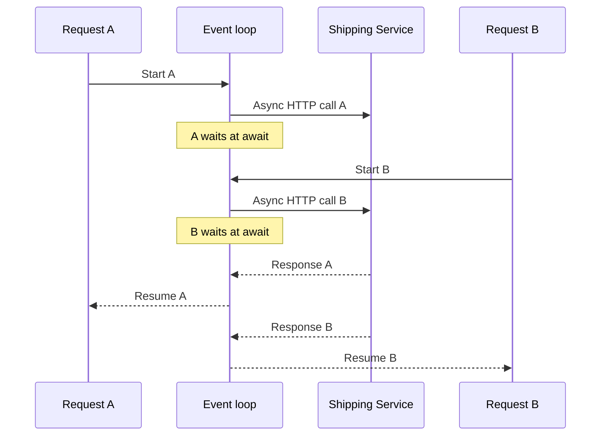
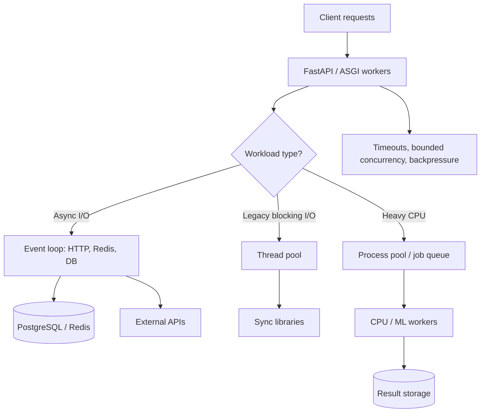

*The backend uses `async def` and runs on a server with several CPU cores. Yet latency climbs when a few dozen requests arrive together, and one expensive calculation slows down even simple requests. Why?*

## 1. Switching to async did not make the API faster

Imagine a FastAPI endpoint that reads a product from PostgreSQL and calls Shipping and Promotion services. The team changes its handler from `def` to `async def`:

```python
@app.get("/products/{product_id}/details")
async def get_product_details(product_id: int):
    product = get_product_from_db(product_id)
    shipping = get_shipping_fee(product_id)
    promotion = get_promotion(product_id)
    return {"product": product, "shipping": shipping, "promotion": promotion}
```

But the functions inside still perform synchronous I/O. An HTTP call can block the thread running the event loop while it waits for a response. Other coroutines on that loop cannot continue as expected. FastAPI is not at fault; the team has conflated **asynchronous programming**, **concurrency**, and **parallelism**.

## 2. Concurrency versus parallelism

Picture one cook placing a pot on the stove, then chopping vegetables while the water heats. The jobs overlap, but the cook is not using two pairs of hands at once: that is **concurrency**. Two cooks genuinely working at the same time illustrate **parallelism**.

| Concept | Meaning | Example |
| :--- | :--- | :--- |
| Sequential | Finish A before starting B | Call API A, then call API B |
| Concurrency | A and B make overlapping progress | Handle request B while waiting for API A |
| Parallelism | A and B actually run at once | Two processes compute on two CPU cores |
| Async programming | Organize waits without blocking the execution thread | `await client.get(...)` |

In a typical `asyncio` setup, one event loop coordinates many tasks on one thread. When a task waits for I/O and yields, the loop can run another. If a task keeps calculating without yielding, the others still wait. **Concurrency does not automatically create CPU parallelism.**

## 3. What happens at `await`?

Request A sends an async HTTP call to Shipping. While it waits, the event loop can handle Request B. When A's response arrives, the loop schedules A to resume:



`await` **does not create a new thread by default**. A coroutine may suspend while awaiting unfinished work; the loop uses that time for other tasks. Not *every* `await` necessarily switches tasks, and a synchronous I/O library does not become non-blocking merely because it is called inside `async def`.

## 4. Async overlaps waiting; it does not erase the wait

`asyncio.sleep()` demonstrates the idea without real networking:

```python
import asyncio
import time

async def fetch_product(product_id: int):
    await asyncio.sleep(1)  # simulate a one-second I/O wait
    return {"id": product_id}

async def main():
    start = time.perf_counter()
    sequential = [await fetch_product(i) for i in range(5)]
    print("sequential:", time.perf_counter() - start)

    start = time.perf_counter()
    concurrent = await asyncio.gather(*(fetch_product(i) for i in range(5)))
    print("concurrent:", time.perf_counter() - start)

asyncio.run(main())
```

Five sequential one-second waits take roughly five seconds; scheduled together, the total can be closer to one second, plus overhead. **Each wait is still one second; async allows the waits to overlap.** This is a simulation, not a network or database benchmark. Real results depend on connection pools, downstream limits, and network conditions.

## 5. Identify I/O-bound and CPU-bound work

**I/O-bound** work spends much of its time waiting for PostgreSQL, Redis, an external API, or a socket. A suitable async client or driver can let the backend serve other work during that wait. **CPU-bound** work spends its time calculating, such as a heavy Python loop, image processing, or large transformations. Writing `async def` does not make those computations run on multiple cores.

| Workload | Often suitable approach |
| :--- | :--- |
| HTTP, Redis, database I/O | Async client/driver or offloaded sync I/O |
| Legacy blocking library | Sync endpoint or thread pool |
| CPU-heavy Python code | Process pool or worker processes |
| ML inference | Native/GPU runtime or dedicated workers |

These are guidelines, not absolute rules: NumPy, ML libraries, and native extensions may use their own threads or a GPU. Measure the actual workload.

## 6. Blocking code inside `async def`

```python
import time

@app.get("/slow")
async def slow():
    time.sleep(5)
    return {"status": "ok"}
```

`time.sleep(5)` blocks the event-loop thread for five seconds. If the operation really is just a wait, `await asyncio.sleep(5)` yields to the loop. But adding `await` cannot turn `requests.get(...)` into async I/O; use an async-compatible HTTP client or move the blocking call to another thread.

The distinction is between **declaring a function async** and **having a request path that actually avoids blocking the event loop**.

## 7. FastAPI treats `async def` and `def` differently

FastAPI executes async path operations through the event loop and offloads synchronous `def` path operations to a thread pool. If an endpoint uses a synchronous I/O library, a sync handler may be more appropriate than calling that library directly inside `async def`:

```python
import requests

@app.get("/external")
def get_external():
    response = requests.get("https://example.com/api", timeout=3)
    response.raise_for_status()
    return response.json()
```

The thread pool is finite. Starlette documents a default AnyIO capacity limiter of **40 tokens** for the relevant offloaded work; sync dependencies and some internal operations may share it. This should not be read as a guarantee that every app always has exactly 40 OS threads. Raising the limit can increase memory use and contention. **A thread pool protects the loop from blocking calls; it does not provide unlimited concurrency.**

## 8. Use an async HTTP client and reuse connections

If Shipping and Promotion are independent, HTTPX `AsyncClient` can call them concurrently:

```python
import asyncio
import httpx

async def get_shipping(client: httpx.AsyncClient, product_id: int):
    response = await client.get(f"https://shipping.example.com/products/{product_id}")
    response.raise_for_status()
    return response.json()

async def get_promotion(client: httpx.AsyncClient, product_id: int):
    response = await client.get(f"https://promotion.example.com/products/{product_id}")
    response.raise_for_status()
    return response.json()

async def get_details(client: httpx.AsyncClient, product_id: int):
    shipping, promotion = await asyncio.gather(
        get_shipping(client, product_id),
        get_promotion(client, product_id),
    )
    return {"shipping": shipping, "promotion": promotion}
```

Here `client` is assumed to have been created in a valid async context. If both services take about one second, total waiting time can be closer to the slower call than to their sum, provided nothing else bottlenecks.

HTTPX `AsyncClient` has connection pooling. Constructing one per request often forfeits reuse across requests. In production, create a client per worker during application lifespan and close it at shutdown:

```python
from contextlib import asynccontextmanager
import httpx
from fastapi import FastAPI

@asynccontextmanager
async def lifespan(app: FastAPI):
    async with httpx.AsyncClient(
        timeout=3.0,
        limits=httpx.Limits(max_connections=50, max_keepalive_connections=20),
    ) as client:
        app.state.http_client = client
        yield

app = FastAPI(lifespan=lifespan)
```

The numbers are illustrative; size them for actual traffic and downstream capacity. Async avoids blocking the loop during network waits; pooling manages and reuses connections. They solve different problems and must work together.

## 9. Async does not make PostgreSQL run SQL faster

With SQLAlchemy `AsyncSession` and an async driver, `await session.execute(...)` lets the event loop run another task while PostgreSQL responds. But a query taking five seconds on PostgreSQL does not become a one-second query. Requests can still queue for database connections.

Avoid this pattern:

```python
await asyncio.gather(
    query_orders(session),
    query_payments(session),
)
```

It is unsafe if both tasks use the **same** `AsyncSession`. SQLAlchemy says not to share one `AsyncSession` across concurrent tasks; use a separate session per task if the queries truly need to run independently. Even then, two queries on two connections are not automatically faster than one well-designed query, and they may lose a shared transaction snapshot. First consider SQL, indexes, round-trips, batching, and transaction scope.

## 10. CPU-bound code still occupies the event loop

```python
def heavy_calculation(n: int) -> int:
    return sum(i * i for i in range(n))

@app.get("/calculate")
async def calculate():
    return {"result": heavy_calculation(30_000_000)}
```

The calculation has no I/O wait at which to yield. It occupies the event-loop thread and delays other requests. Changing `heavy_calculation` to `async def` without changing the work does not add CPU cores. **Async does not transform a CPU-bound algorithm into parallel computation.**

## 11. The GIL, threads, and processes

In a regular CPython build with the **GIL**, multiple threads do not simultaneously execute Python bytecode in the same interpreter. A thread pool therefore usually will not make the same pure-Python CPU-heavy algorithm use several cores. Exceptions can include native extensions that release the GIL, multithreaded numerical libraries, or the optional free-threaded CPython build available since Python 3.13. Conclusions depend on version, build, and workload.

A **thread pool** helps offload blocking I/O when there is no suitable async client:

```python
import asyncio
import requests

def blocking_request():
    return requests.get("https://example.com/api", timeout=3).json()

async def get_data():
    return await asyncio.to_thread(blocking_request)
```

`to_thread()` frees the event-loop thread while the sync call runs, but it does not automatically add optimal connection pooling and generally does not accelerate pure-Python CPU work on GIL-enabled CPython.

A **process pool** can suit sufficiently large, independent calculations:

```python
import asyncio
from concurrent.futures import ProcessPoolExecutor

def heavy_calculation(n: int) -> int:
    return sum(i * i for i in range(n))

async def run_calculation(executor: ProcessPoolExecutor, n: int) -> int:
    loop = asyncio.get_running_loop()
    return await loop.run_in_executor(executor, heavy_calculation, n)
```

Processes can use several cores, but moving arguments and results between them, memory use, and startup all cost time. Do not create a new pool for every HTTP request; manage its lifetime and job count with the application. Functions sent to workers must be importable and serializable. Parallelism is worthwhile only when the computation outweighs this overhead.

## 12. When should CPU work leave the HTTP request?

Large reports, video processing, feature engineering, or batch inference may take minutes. Keeping an HTTP request open throughout invites timeouts and makes recovery difficult. Another approach returns a `job_id`, puts work on a durable queue, and lets the client track progress:

```text
POST /api/reports
-> {"job_id":"JOB-1001","status":"queued"}
```

A worker service processes the task outside the request lifecycle. Celery with Redis/RabbitMQ is one option, not the only one. `asyncio.create_task()` merely starts a task in the current process; it does not create a durable queue, persistent retries, or restart recovery. Important jobs also need state, retries, and idempotency.

## 13. A backend can combine execution models

A real service can use async for network I/O, a thread pool for legacy blocking libraries, and process pools or worker services for CPU work:



**Not every component needs to become async.** What matters is clearly designing resource boundaries and the lifecycle of each kind of work.

## 14. Do more Uvicorn workers make one request faster?

`uvicorn main:app --workers 4` starts four worker processes. In a typical deployment, each has its own runtime, event loop, memory, and pools. More workers may serve more requests or use more cores, but they do **not** turn a 500 ms PostgreSQL query into a 125 ms query.

Downstream capacity can multiply with worker count. Four workers whose database pools each permit ten connections can allow up to 40; three such replicas have a potential upper bound of 120. If each worker also starts a four-process pool, CPU workers multiply too. Do not pick worker count by CPU cores alone while ignoring memory, database capacity, and external APIs.

Worker processes do not automatically share a dictionary, in-memory cache, rate-limit counter, or local queue. Shared state needs Redis, a database, or another suitable store. Async coordinates tasks within a process; multiprocessing permits parallel execution but makes shared state more complicated.

## 15. Async does not mean unlimited concurrency

`asyncio.gather()` can create thousands of tasks calling Promotion. That can cause downstream 429s, connection waits, timeouts, more memory use, or retry storms. A semaphore can bound simultaneous calls:

```python
import asyncio

semaphore = asyncio.Semaphore(10)

async def limited_fetch(product_id: int):
    async with semaphore:
        return await fetch_promotion(product_id)
```

This semaphore coordinates only tasks using **that same object** in one process; it is not a global limit across workers or replicas. Nor does it stop the program from creating hundreds of thousands of tasks that sit waiting. Larger workloads also need bounded queues or worker pools that limit admitted work.

Rate limiting controls the *arrival rate*; concurrency limiting controls *work in progress*. Async replaces neither.

## 16. Timeouts, cancellation, and backpressure

If Shipping slows down, waiting coroutines still occupy memory, request context, and possibly other resources. If arrivals continuously outpace completions, the backlog grows even though the loop itself is not blocked.

```python
async with asyncio.timeout(3):
    result = await fetch_shipping_fee()
```

A timeout requests cancellation of waiting work, but `asyncio` cancellation is cooperative: blocking CPU code or work offloaded into a thread need not stop immediately. An external call may also have produced a side effect before your request timed out. Retry behavior must account for that.

**Backpressure** prevents the system from admitting or creating more work than it can serve: cap concurrent calls, use bounded queues, timeouts, retry budgets, circuit breakers, or a degraded response. Async makes waiting efficient; backpressure prevents too much work from waiting.

## 17. Benchmark async against the right goal

One request taking 150 ms with sync code and 155 ms with async code does not settle the question. Async's benefit often lies in serving many I/O-bound requests with appropriate resource use. Test three workloads:

1. **I/O-bound:** an external API with controlled latency; compare sync and async across concurrency levels.
2. **CPU-bound:** pure-Python calculation; compare running on the loop with appropriate offloading.
3. **Mixed:** database, external API, and a small calculation in one request.

Measure requests per second, p50/p95/p99 latency, errors and timeouts, CPU, memory, event-loop lag, thread-pool saturation, connection-pool wait, and downstream latency. Increase load stepwise, for example 1, 10, 50, 100, and 200 concurrent requests. Past saturation, throughput may barely rise while latency keeps increasing.

Keep comparisons fair. Do not compare an async client with connection pooling to a sync client that opens a fresh TCP connection on every request and attribute the whole difference to `async`. Do not compare four async workers with one sync worker either. **Measure the change you actually want to evaluate.**

## 18. Questions for choosing an execution model

- Is the workload mainly waiting for I/O or computing on the CPU?
- Does the library truly support async operations?
- Must the job finish within the HTTP request, or can it be a background job?
- Are the steps independent enough to overlap or run in parallel?
- Can PostgreSQL, HTTP pools, and external services handle the new concurrency?
- Does a representative benchmark show a benefit?

A simple, stable design is usually preferable to complex concurrency with no measurable payoff.

## 19. Common mistakes

- Assume `async def` itself makes functions parallel or CPU work faster.
- Call sync HTTP/database libraries directly on the event loop.
- Use unbounded `asyncio.gather()` and overload downstream systems.
- Share one `AsyncSession` among concurrent tasks.
- Add Uvicorn workers without multiplying downstream connection pools and CPU workers in the capacity plan.
- Treat a timeout as proof that every side effect or thread operation stopped.
- Treat `create_task()` as a durable job queue.
- Benchmark only one request or try to make every component async.

## 20. Conclusion

Async is valuable when a backend waits on many I/O operations: it lets work make overlapping progress. It does not make SQL run faster, turn CPU-heavy Python code into parallel computation, or expand downstream capacity without limit. Threads can handle many blocking-I/O cases; processes or specialized runtimes suit heavier computation; long jobs may need a worker service.

**A fast backend is not the one with the most `async def` functions. It chooses the right execution model for each workload, bounds concurrency, and avoids sending more work downstream than those systems can handle.** Sometimes the most important optimization is knowing when to wait and when to stop accepting new work.

## References and further reading

- [Python: Coroutines and Tasks](https://docs.python.org/3.14/library/asyncio-task.html)
- [Python: Developing with asyncio](https://docs.python.org/3.14/library/asyncio-dev.html)
- [Python: concurrent.futures](https://docs.python.org/3.14/library/concurrent.futures.html)
- [Python: Free-Threading Support](https://docs.python.org/3.14/howto/free-threading-python.html)
- [FastAPI: Concurrency and async/await](https://fastapi.tiangolo.com/async/)
- [Starlette: Thread Pool](https://www.starlette.io/threadpool/)
- [HTTPX: Async Support](https://www.python-httpx.org/async/)
- [SQLAlchemy: Asynchronous I/O](https://docs.sqlalchemy.org/en/20/orm/extensions/asyncio.html)
- [SQLAlchemy: Session Basics](https://docs.sqlalchemy.org/en/20/orm/session_basics.html)
- [Uvicorn: Deployment](https://www.uvicorn.org/deployment/)
- [Python: asyncio Synchronization Primitives](https://docs.python.org/3.14/library/asyncio-sync.html)
- [FastAPI: Background Tasks](https://fastapi.tiangolo.com/tutorial/background-tasks/)
