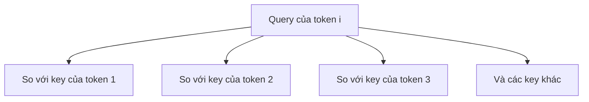
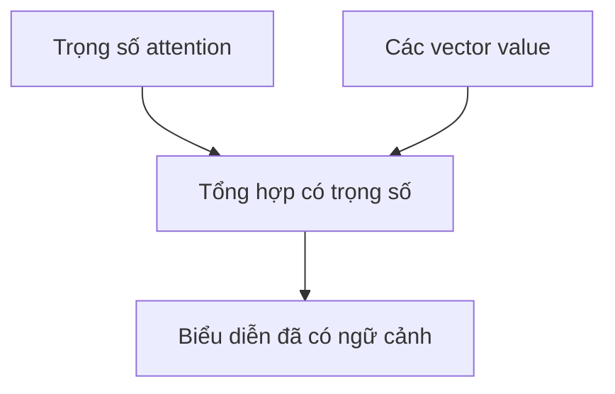

Attention cho mỗi token một cách thu thập thông tin từ các token khác dựa trên mức liên quan mà model học được.

Ý tưởng cốt lõi sẽ dễ hiểu hơn nếu tạm gác toàn bộ kiến trúc transformer sang một bên.

## Ba góc nhìn về cùng một token

Từ biểu diễn của mỗi token, model tạo ra ba vector:

- **query (truy vấn)** - tôi đang tìm loại thông tin nào?
- **key (khóa)** - tôi có thể cung cấp loại thông tin nào?
- **value (giá trị)** - nếu được chọn, tôi sẽ truyền thông tin gì?

Cả ba là những phép chiếu tuyến tính được học từ cùng trạng thái ban đầu của token.

## Query được so với các key

Với một token, query của nó được so với từng key ứng viên bằng tích vô hướng.

Các điểm thu được được chuẩn hóa thành **trọng số attention**. Trọng số lớn hơn nghĩa là token hiện tại sẽ lấy nhiều thông tin hơn từ vị trí tương ứng.

## Các value được trộn theo trọng số

Đầu ra là tổ hợp có trọng số của những vector value:

Vì vậy, attention không chỉ là "nhìn vào" một token khác. Nó là cơ chế **định tuyến thông tin phụ thuộc vào nội dung**.

## Vì sao phải chia tỉ lệ tích vô hướng?

Khi số chiều vector tăng, tích vô hướng thô có thể trở nên rất lớn. Trong scaled dot-product attention, điểm số được chia cho căn bậc hai của số chiều key trước khi đi qua softmax.

Lý do thực tế là giúp tối ưu hóa ổn định hơn: nếu không chia tỉ lệ, softmax có thể trở nên quá sắc, khiến gradient kém hữu ích.

## Multi-head attention học nhiều kiểu quan hệ

Thay vì chỉ thực hiện attention một lần trên toàn bộ biểu diễn, transformer dùng nhiều **head** với các phép chiếu học được khác nhau.

Mỗi head có thể học một số pattern riêng, nhưng gán cho từng head một khái niệm rõ ràng theo cách con người hiểu là điều dễ gây ngộ nhận.

Tác dụng quan trọng về kiến trúc là model có nhiều không gian con song song để định tuyến thông tin.

## Causal mask giới hạn những gì được nhìn thấy

Model ngôn ngữ tự hồi quy không được dùng token ở tương lai để dự đoán token tiếp theo. **Causal mask** chặn attention nhìn về phía trước:

| Vị trí đang xử lý | Các vị trí được nhìn thấy |
| :-- | :-- |
| 1 | 1 |
| 2 | 1 đến 2 |
| 3 | 1 đến 3 |

Nhờ vậy, thiết lập dự đoán token tiếp theo vẫn được giữ đúng trong lúc huấn luyện.

## Attention mạnh, nhưng không phải bộ nhớ lâu dài

Model chỉ có thể attention tới thông tin đang nằm trong context hiện tại. Bản thân attention không tạo ra long-term memory.

Nếu một thông tin nằm ngoài context window, một hệ thống khác phải tìm lại hoặc tóm tắt nó trước khi attention có thể sử dụng.

Sự khác biệt này đặc biệt quan trọng trong kiến trúc RAG và memory của Agent.

## Cách hình dung có thể dùng lại

Hãy nghĩ về attention như:

> **Chấm điểm mức liên quan bằng tham số đã học, rồi trộn thông tin theo các trọng số ấy.**

Chừng đó là đủ để hiểu vì sao attention xuất hiện trong transformer, model đa phương thức và nhiều kiến trúc neural có tính chất gần với truy xuất thông tin.
