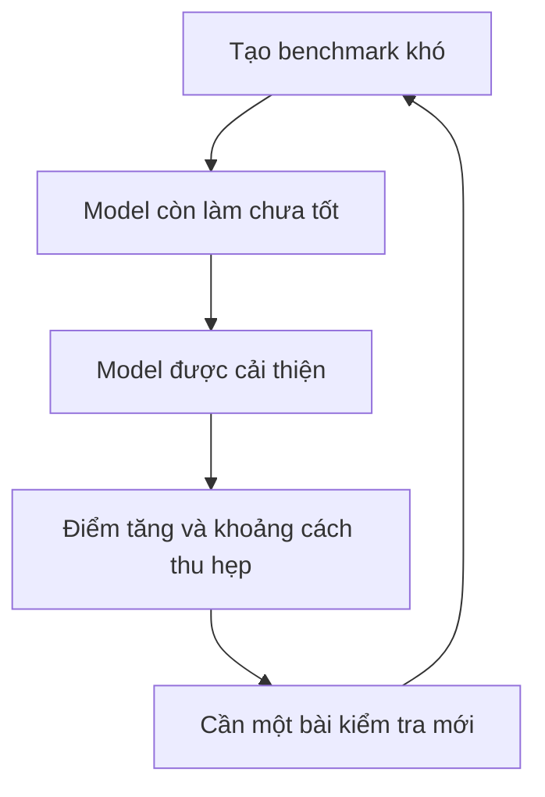
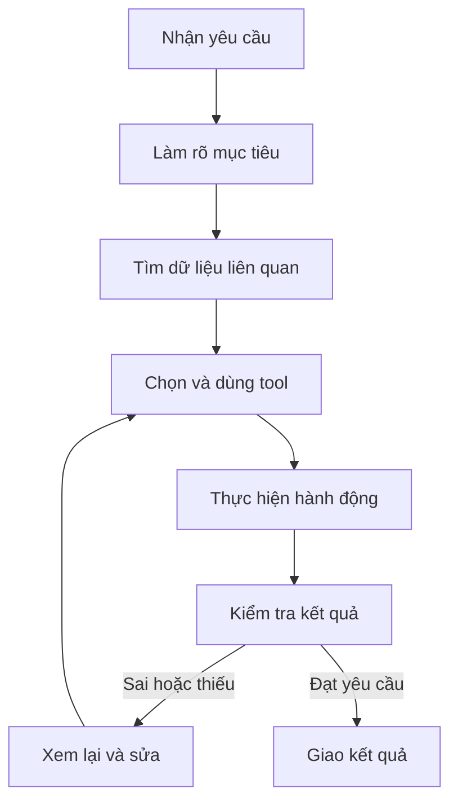

Giả sử có hai model AI. Model A đạt 94 điểm trên một benchmark, còn Model B đạt 89. Nếu chỉ nhìn hai con số, chọn A có vẻ rất hợp lý.

Nhưng khi đưa vào hệ thống chăm sóc khách hàng, B lại trả lời đúng chính sách công ty hơn. Khi sửa code trong repository của bạn, B ít làm hỏng những phần đang chạy hơn. Với một task dài, A đôi khi đi sai hướng giữa chừng rồi không tự phục hồi được.

Vậy 94 điểm kia nói lên điều gì?

Đây là ví dụ giả định, nhưng câu hỏi là thật. Benchmark rất hữu ích. Rắc rối bắt đầu khi ta yêu cầu nó trả lời một câu hỏi mà nó chưa được thiết kế để trả lời.

## 1. Benchmark là bài kiểm tra, không phải "IQ của AI"

Một benchmark đưa cho nhiều model cùng một tập câu hỏi hoặc task, rồi chấm kết quả theo cách đã định. Nó có thể kiểm tra toán, code, hiểu hình ảnh, kiến thức hoặc khả năng sửa một issue trong phần mềm.

Nhờ đó, ta có thể hỏi:

> **Model nào làm tốt hơn trên loại task này, trong điều kiện này, với cách chấm này?**

Đó là câu hỏi có giá trị. Nhưng nó khác với:

> **Model nào sẽ làm tốt hơn trong sản phẩm của tôi?**

Hãy nghĩ tới bài thi lý thuyết lái xe. Điểm cao cho thấy người thi biết nhiều quy tắc quan trọng. Nó chưa nói hết người đó sẽ xử lý thế nào khi trời mưa, đường đông hoặc xe phía trước phanh gấp.

Benchmark đo một lát cắt năng lực. Sản phẩm cần cả hệ thống vận hành tốt.

## 2. Một benchmark tốt rồi cũng có thể "hết đất để đo"

Model tiến bộ nhanh, nên bài kiểm tra từng giúp phân biệt chúng rất rõ có thể dần trở nên quá dễ.

[Chương Technical Performance của Stanford AI Index 2026](https://hai.stanford.edu/ai-index/2026-ai-index-report/technical-performance) ghi nhận điểm của các frontier model trên Humanity's Last Exam tăng khoảng 30 điểm phần trăm chỉ trong một năm. Báo cáo cũng lưu ý một số evaluation mới tiến gần bão hòa chỉ sau vài tháng.

Hãy tưởng tượng một bài thi mà các thí sinh mạnh lần lượt đạt 99, 99,4 và 99,7 điểm. Khoảng cách nhỏ không chứng minh năng lực của họ gần như giống nhau. Có thể bài thi đã không còn đủ chỗ để phân biệt.

Đó là một lý do người ta tiếp tục thiết kế các evaluation khó hơn, như GPQA, Humanity's Last Exam và FrontierMath. Chu kỳ có thể lặp lại:

Đạt gần 100% ở một bài thi không có nghĩa mọi vấn đề ngoài bài thi đã được giải quyết. Nó cho biết model đã làm rất tốt trong phạm vi bài thi đó đo được.

## 3. Năng lực AI không tăng đồng đều

Một cái bẫy khác là nghĩ năng lực của model có thể gói vào một con số. Nó có thể rất mạnh ở một việc, nhưng lại bất ngờ yếu ở việc khác.

Cũng trong [Stanford AI Index 2026](https://hai.stanford.edu/ai-index/2026-ai-index-report/technical-performance), một hệ thống AI đạt huy chương vàng ở International Mathematical Olympiad năm 2025, còn kết quả cao nhất mà báo cáo ghi nhận trên ClockBench, benchmark đọc đồng hồ kim, là 50,6%.

Điều này không tạo thành quy luật chung rằng "AI giỏi toán nhưng không biết xem giờ". Nó cho thấy thành tích ở một task chưa đảm bảo thành tích tương đương ở task khác.

Biết model rất mạnh ở A chưa đủ để suy ra nó cũng mạnh như vậy ở B, nhất là khi B cần loại dữ liệu, tool hoặc cách xử lý lỗi khác.

## 4. Công việc thật thường bắt đầu bằng sự mơ hồ

Benchmark thường cố định nghĩa rõ input, môi trường và tiêu chí thành công. Yêu cầu ngoài đời có khi xuất hiện trước cả lúc mọi người thống nhất thế nào là "thành công".

Giả sử một kỹ sư nhận được yêu cầu:

> "Giúp tôi cải thiện hệ thống recommendation này."

Cải thiện cái gì: CTR, doanh thu, retention, tốc độ phản hồi hay độ đa dạng gợi ý? Có được dùng model đắt hơn không? Được dùng dữ liệu nào? Metric hiện tại có đáng tin không?

Trước khi giải bài toán kỹ thuật, người kỹ sư phải làm rõ mục tiêu và ràng buộc. Một AI Agent được giao cùng việc cũng phải đối mặt với bước đó.

Benchmark có thể chủ ý loại bớt sự mơ hồ để đo một kỹ năng chính xác hơn. Trong production, nhận ra và xử lý sự mơ hồ lại là một phần của công việc.

## 5. Task càng dài, lỗi nhỏ càng dễ thành lỗi của cả workflow

Một Agent có thể phải đưa ra nhiều quyết định nối tiếp, thay vì chỉ trả lời một câu hỏi:

Từng bước riêng lẻ có thể trông khá đáng tin. Nhưng task chỉ thành công nếu cả chuỗi hoạt động.

Để minh họa, giả sử một task có mười bước *độc lập*, và mỗi bước thành công với xác suất 95%. Xác suất thành công ở cả mười bước khi đó là **0,95¹⁰ ≈ 60%**.

Lỗi của Agent thật không độc lập, và Agent có thể kiểm tra, phục hồi. Vì vậy, 60% không phải tỷ lệ đo được hay dự báo cho một sản phẩm. Ví dụ này chỉ cho thấy **độ tin cậy của từng bước** khác **độ tin cậy của cả workflow**.

### METR đặt một câu hỏi khác

[Task-completion time horizon của METR](https://metr.org/time-horizons/) xem khả năng hoàn thành thay đổi thế nào khi task khó hơn. "Thời lượng" ở đây là thời gian ước tính một chuyên gia con người cần để làm task, **không phải** thời gian Agent AI chạy.

Ví dụ, mốc *50% time horizon* là độ dài task theo thước đo thời gian của con người mà Agent được dự đoán còn khoảng 50% khả năng hoàn thành trong bộ task của METR.

Cách nhìn này hữu ích khi đánh giá công việc nhiều bước. Nhưng giới hạn cũng rất rõ: task của METR chủ yếu thuộc software engineering, machine learning và cybersecurity; chúng tương đối độc lập và có tiêu chí thành công xác định. METR lưu ý không nên coi kết quả đó là thước đo cho mọi loại công việc tri thức.

Một evaluation gần thực tế hơn vẫn chỉ là một evaluation cụ thể.

## 6. Đôi khi vấn đề nằm ở chính bài thi

Điểm cao không phải lúc nào cũng chỉ phản ánh khả năng áp dụng sang tình huống mới.

Nếu câu hỏi và lời giải của benchmark đã public, tài liệu tương tự có thể xuất hiện trong dữ liệu training. Việc model từng gặp chúng không chứng minh nó chỉ học thuộc đáp án, nhưng khiến điểm số khó diễn giải hơn. Bản thân task cũng có thể mơ hồ, đáp án tham chiếu sai hoặc test bác bỏ một lời giải hợp lệ.

Tháng 2/2026, [OpenAI giải thích vì sao họ ngừng dùng SWE-bench Verified để báo cáo năng lực coding của frontier model](https://openai.com/index/why-we-no-longer-evaluate-swe-bench-verified/). Cuộc audit của họ tìm thấy test có vấn đề ở một số task khó, cùng bằng chứng về việc model đã tiếp xúc với dữ liệu liên quan trong training. Đây là đánh giá của OpenAI về benchmark cụ thể này, không có nghĩa mọi kết quả SWE-bench trước đó đều vô nghĩa.

Còn một điểm cần phân biệt: một kết quả trên leaderboard có thể đo cả **hệ thống**, chứ không chỉ model. [Leaderboard SWE-bench Verified](https://www.swebench.com/verified.html) có các hệ thống dùng Agent loop và thành phần hỗ trợ khác nhau. Nó cũng có thiết lập "bash-only" dùng mini-SWE-agent để việc so sánh model trong cùng một môi trường dễ hơn.

Cùng một model, nhưng tool, instruction, context, cơ chế kiểm tra và phục hồi khác nhau có thể cho kết quả khác nhau. [Một tài liệu của OpenAI về evaluation bên thứ ba](https://openai.com/index/trustworthy-third-party-evaluations-foundations/) gọi những phần bao quanh model là *harness* và giải thích vì sao chúng ảnh hưởng tới kết quả quan sát được.

> **Hiệu năng của model và hiệu năng của cả hệ thống có liên quan, nhưng không phải cùng một phép đo.**

## 7. Pass test vẫn có thể chưa giải quyết đúng việc

Kỹ sư phần mềm hẳn quen tình huống này: tất cả unit test đều xanh, nhưng người dùng vẫn nói "Không phải cái tôi cần".

Test đã kiểm tra những gì chúng ta viết vào test. Nó không tự tìm ra một yêu cầu bị bỏ sót.

Một Agent chăm sóc khách hàng cũng vậy. Nó có thể đạt điểm cao về độ đúng của thông tin mà vẫn làm người dùng khó chịu vì trả lời chậm, quá dài, hỏi lại dữ liệu hệ thống đã có hoặc không giải quyết xong yêu cầu.

Độ chính xác rất quan trọng. Nó chỉ là một phần của trải nghiệm hỗ trợ tốt.

Câu hỏi khó nhất khi làm eval đôi khi không phải "Câu trả lời có pass không?", mà là "Chúng ta đã định nghĩa đúng thế nào là làm tốt công việc này chưa?"

## 8. Vậy benchmark có còn đáng tin không?

Có, nếu ta đọc nó như một phép đo có phạm vi rõ ràng.

Benchmark toán hữu ích khi chọn model giải toán. Benchmark coding liên quan hơn khi xây coding Agent. Nhưng không cái nào trực tiếp cho biết chatbot có tuân thủ policy công ty hay người dùng có giải quyết xong yêu cầu hỗ trợ hay không.

Lúc này, eval cho **chính workload của bạn** trở nên cần thiết. [Hướng dẫn evaluation của OpenAI](https://developers.openai.com/api/docs/guides/evaluation-best-practices) khuyến nghị dùng case sát tác vụ thực tế, lấy từ dữ liệu production, log, yêu cầu thông thường và edge case. [Hướng dẫn eval cho Agent của Anthropic](https://www.anthropic.com/engineering/demystifying-evals-for-ai-agents) gợi ý bắt đầu từ những điều team vẫn kiểm tra thủ công, rồi biến bug report và lỗi người dùng gặp thành case có thể chạy lại.

Với Agent chăm sóc khách hàng, bạn có thể kiểm tra:

- nó có tìm và áp dụng đúng policy không;
- nó xử lý câu hỏi ngắn hoặc mơ hồ ra sao;
- nó chọn đúng tool và truyền đúng dữ liệu đầu vào không;
- khi nào nó cần nhờ con người xem lại;
- nó giải quyết yêu cầu với thời gian và chi phí chấp nhận được không.

Chạy lại các case đó khi model, prompt, tool hoặc policy thay đổi. Đồng thời theo dõi phản hồi của người dùng thật: một tập test cố định không thể dự đoán mọi tình huống mới.

Benchmark public giúp trả lời: "Model này nhìn chung mạnh đến đâu ở loại task này?" Eval nội bộ giúp trả lời: "Hệ thống của mình có làm tốt công việc người dùng cần không?"

## Bài kiểm tra cuối cùng vẫn là công việc của bạn

Nếu xây hệ thống đọc hóa đơn, hãy test trên những hóa đơn bạn thực sự nhận. Nếu xây RAG cho tài liệu công ty, hãy dùng những câu hỏi nhân viên thực sự hỏi. Nếu xây coding Agent, hãy đưa nó vào repository và workflow giống môi trường của bạn.

Việc chọn model cho sản phẩm nên dựa trên nhiều lớp bằng chứng:

| Lớp đánh giá | Câu hỏi cần trả lời |
| --- | --- |
| Benchmark public của model | Đây có phải điểm xuất phát tốt không? |
| Eval theo domain | Nó xử lý đúng dữ liệu và yêu cầu của mình không? |
| Eval cả hệ thống | Tool, context và phục hồi lỗi có phối hợp tốt không? |
| Phản hồi production | Nó có hữu ích và ổn định với người dùng thật không? |

Model A đạt 94 và Model B đạt 89 vẫn là thông tin có giá trị. Nhưng trước khi khẳng định A tốt hơn cho sản phẩm của mình, hãy hỏi thêm:

> **94 điểm trên cái gì?**

Benchmark giúp ta chọn điểm xuất phát, không đưa ra phán quyết cuối cùng. Model nào phù hợp với sản phẩm phải được kiểm chứng trên dữ liệu, workflow và người dùng thật. Và ngay cả khi đã chọn đúng model, chất lượng sản phẩm vẫn phụ thuộc vào cách cả hệ thống vận hành.

## Nguồn tham khảo

- [Stanford HAI - AI Index 2026: Technical Performance](https://hai.stanford.edu/ai-index/2026-ai-index-report/technical-performance)
- [METR - Task-Completion Time Horizons of Frontier AI Models](https://metr.org/time-horizons/)
- [OpenAI - Vì sao SWE-bench Verified không còn đo tốt frontier coding](https://openai.com/index/why-we-no-longer-evaluate-swe-bench-verified/)
- [SWE-bench - Leaderboard Verified và thiết lập bash-only](https://www.swebench.com/verified.html)
- [OpenAI - Tài liệu về evaluation bên thứ ba](https://openai.com/index/trustworthy-third-party-evaluations-foundations/)
- [OpenAI Developers - Evaluation best practices](https://developers.openai.com/api/docs/guides/evaluation-best-practices)
- [Anthropic - Demystifying evals for AI agents](https://www.anthropic.com/engineering/demystifying-evals-for-ai-agents)
