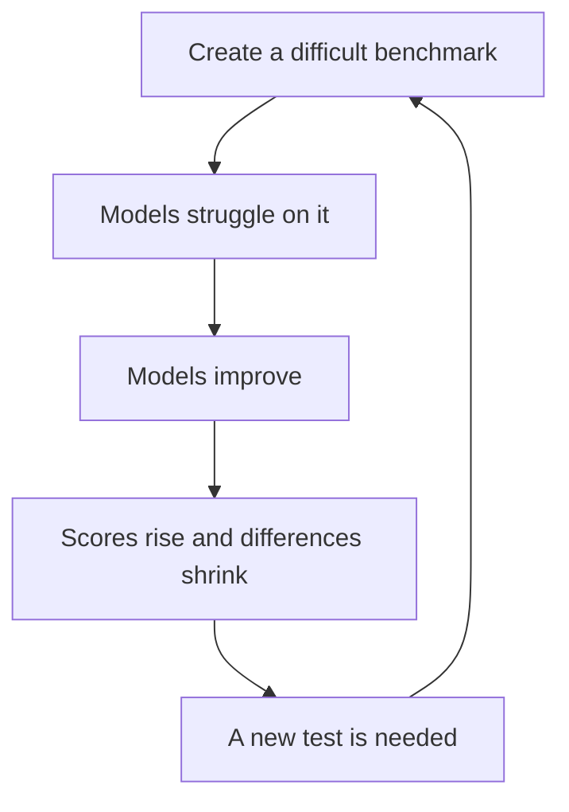
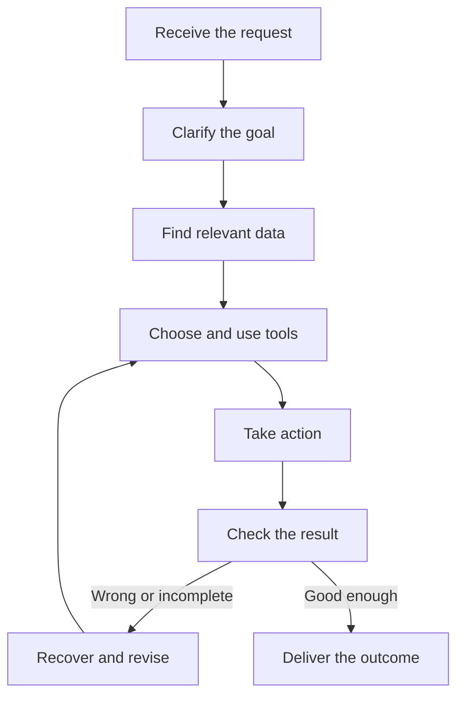

Imagine two AI models. Model A scores 94 on a benchmark; Model B scores 89. If those numbers are all we know, A looks like the obvious choice.

Now put them into a customer support system. B answers questions about your company's policies more accurately. In your codebase, B is less likely to break something that already works. On a long task, A sometimes goes off course and fails to recover.

What, then, did the 94 tell us?

The example is hypothetical, but the question is real. Benchmarks are useful. We get into trouble when we ask a benchmark to answer a question it was never designed to answer.

## 1. A benchmark is a test, not an AI IQ score

A benchmark gives models the same set of questions or tasks and grades their results using a defined method. It might test math, coding, image understanding, factual knowledge, or the ability to resolve software issues.

That lets us ask a valuable question:

> **Which model did better on these tasks, under these conditions, with this grading method?**

But that is different from asking:

> **Which model will do better in my product?**

Think of a driving theory exam. A high score shows that someone knows important rules. It does not tell you how they will handle rain, traffic, or a car braking suddenly in front of them.

A benchmark measures a slice of capability. A product depends on the behavior of the whole system.

## 2. A good benchmark can run out of room

Models improve quickly, and a test that once separated them well may eventually become too easy.

The [Stanford AI Index 2026 technical performance chapter](https://hai.stanford.edu/ai-index/2026-ai-index-report/technical-performance) reports a roughly 30 percentage point gain by frontier models on Humanity's Last Exam in one year. It also notes that some new evaluations approach saturation within months.

Imagine a test on which strong candidates score 99, 99.4, and 99.7. The small gaps do not prove that their abilities are almost identical. The test may simply have little room left to distinguish them.

That is one reason researchers keep designing harder evaluations, including benchmarks such as GPQA, Humanity's Last Exam, and FrontierMath. The pattern can repeat:

Near-perfect performance on one test does not mean the broader problem is solved. It means the model performs very well on the part that test measures.

## 3. AI capability is uneven

Another trap is imagining capability as a single number. A model can be excellent at one kind of work and unexpectedly weak at another.

The same [Stanford AI Index chapter](https://hai.stanford.edu/ai-index/2026-ai-index-report/technical-performance) describes a sharp contrast: an AI system earned a gold medal at the 2025 International Mathematical Olympiad, while the leading result it reports on ClockBench, an analog-clock reading benchmark, was 50.6%.

This does not establish a general rule that AI "can do math but cannot tell time." It shows why success on one task does not guarantee similar success on another.

Knowing that a model is strong at A is not enough to predict its performance at B, especially when B involves different inputs, tools, or failure modes.

## 4. Real work starts with ambiguity

A benchmark usually tries to specify the input, environment, and success criteria clearly. Real requests often arrive before anyone has agreed on what success means.

Suppose someone asks an engineer:

> "Can you improve our recommendation system?"

Improve what: click-through rate, revenue, retention, response time, or diversity? Is a more expensive model allowed? Which data may be used? Can we trust the existing metrics?

Before solving the technical problem, the engineer has to clarify the goal and the constraints. An AI Agent in that role faces the same need.

A benchmark may deliberately remove ambiguity to isolate a skill. In production, recognizing and resolving ambiguity can be part of the work itself.

## 5. Long tasks turn small errors into workflow failures

An Agent may need to carry out a chain of decisions rather than answer a single question:

Each step might look reliable on its own. The complete task succeeds only if the sequence works.

For illustration, suppose a task has ten *independent* steps and each step succeeds 95% of the time. The probability of succeeding at every step would be **0.95¹⁰ ≈ 60%**.

Real Agent failures are not independent, and Agents can check and recover. So 60% is not a measured success rate or a prediction for a real product. It simply illustrates the difference between **per-step reliability** and **end-to-end reliability**.

### A different question from METR

[METR's task-completion time horizon](https://metr.org/time-horizons/) asks how success changes as tasks become more demanding. A task's "duration" here is the estimated time a human expert would need to finish it, **not** the time the AI spends running.

For example, a 50% time horizon is the human-task duration at which an Agent is predicted to complete tasks in METR's suite about half the time.

That framing is useful for thinking about sustained, multi-step work. It also has a clear boundary: METR's tasks are mostly self-contained software engineering, machine learning, and cybersecurity tasks with well-specified success criteria. METR explicitly warns against treating the result as a measure of every kind of knowledge work.

Even a more realistic evaluation is still a particular evaluation.

## 6. Sometimes the test itself is the problem

A high score can reflect more than generalizable ability.

If benchmark questions and solutions are public, similar material may appear in training data. Exposure does not prove that a model merely memorized an answer, but it makes the score harder to interpret. A task can also have an ambiguous prompt, an incorrect reference answer, or tests that reject a valid solution.

In February 2026, [OpenAI explained why it stopped using SWE-bench Verified to report frontier coding capability](https://openai.com/index/why-we-no-longer-evaluate-swe-bench-verified/). Its audit identified flawed tests on some difficult instances and evidence of training-data exposure. That is OpenAI's assessment of this specific benchmark, not a claim that every earlier SWE-bench result was meaningless.

There is a second distinction: a leaderboard entry may measure an entire **system**, not just a model. The [SWE-bench Verified leaderboard](https://www.swebench.com/verified.html) includes systems with different Agent loops and supporting components. It also provides a more standardized "bash-only" setup using mini-SWE-agent to make model comparisons easier.

The same model can behave differently when its tools, instructions, context, checks, and recovery loop change. An [OpenAI playbook on third-party evaluations](https://openai.com/index/trustworthy-third-party-evaluations-foundations/) calls those surrounding components the *harness* and explains why they can change the observed result.

> **Model performance and system performance are related, but they are not the same measurement.**

## 7. Passing a test can still miss the user's goal

Software engineers know this situation: every unit test is green, yet a user says, "That isn't what I needed."

The tests verified the behavior they were written to check. They did not capture a missing requirement.

The same thing can happen with a customer support Agent. It may score highly on factual accuracy but still frustrate users because it responds too slowly, gives overly long answers, asks for information the system already has, or never resolves the request.

Accuracy matters. It is only one part of a useful support experience.

The hardest evaluation question is often not "Did the answer pass?" It is "Did we define success in a way that matches the work?"

## 8. So should we trust benchmarks?

Yes, if we read them as measurements with a defined scope.

A math benchmark helps when choosing a model for math. A coding benchmark is relevant when building a coding Agent. Neither directly tells us whether a chatbot will follow our company's policy or whether users will finish their support requests.

That is where evaluation of **your own workload** becomes essential. [OpenAI's evaluation guidance](https://developers.openai.com/api/docs/guides/evaluation-best-practices) recommends task-specific cases drawn from realistic use, including production data, logs, ordinary requests, and edge cases. [Anthropic's Agent eval guidance](https://www.anthropic.com/engineering/demystifying-evals-for-ai-agents) suggests starting with the checks teams already do manually, then turning bug reports and user failures into repeatable cases.

For a support Agent, that could mean checking:

- whether it finds and applies the right policy;
- whether it handles short or ambiguous questions;
- whether it selects the right tool and passes the right inputs;
- whether it asks for human review when needed;
- whether it resolves the request within an acceptable time and cost.

Run those cases again when the model, prompt, tools, or policy changes. Track real user feedback as well: a fixed test set cannot predict every new situation.

A public benchmark helps answer, "How strong is this model on a known kind of task?" Your own eval helps answer, "Does this system do the job our users need?"

## The best final test is your work

If you build an invoice reader, test it on invoices you actually receive. If you build RAG for company documents, use the questions employees really ask. If you build a coding Agent, test it in repositories and workflows like yours.

A practical model choice should consider several kinds of evidence:

| Evidence | What it helps answer |
| --- | --- |
| Public model benchmark | Is this model a promising starting point? |
| Domain eval | Does it handle our data and requirements? |
| System eval | Do tools, context, and recovery work together? |
| Production feedback | Is it useful and reliable for real users? |

Model A's 94 and Model B's 89 are still valuable information. Before declaring A the better choice for your product, ask one more question:

> **94 points on what?**

A benchmark helps us choose a starting point, not reach a final verdict. Which model fits a product must be tested against real data, workflows, and users. And even after choosing the right model, the product's quality still depends on how the whole system works.

## References

- [Stanford HAI - AI Index 2026: Technical Performance](https://hai.stanford.edu/ai-index/2026-ai-index-report/technical-performance)
- [METR - Task-Completion Time Horizons of Frontier AI Models](https://metr.org/time-horizons/)
- [OpenAI - Why SWE-bench Verified no longer measures frontier coding capabilities](https://openai.com/index/why-we-no-longer-evaluate-swe-bench-verified/)
- [SWE-bench - Verified leaderboard and bash-only setup](https://www.swebench.com/verified.html)
- [OpenAI - A shared playbook for trustworthy third-party evaluations](https://openai.com/index/trustworthy-third-party-evaluations-foundations/)
- [OpenAI Developers - Evaluation best practices](https://developers.openai.com/api/docs/guides/evaluation-best-practices)
- [Anthropic - Demystifying evals for AI agents](https://www.anthropic.com/engineering/demystifying-evals-for-ai-agents)
