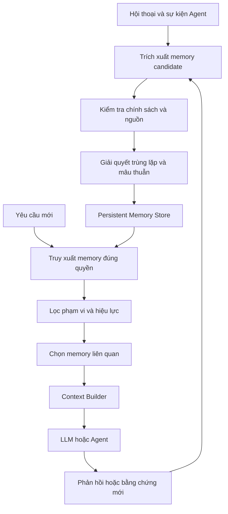
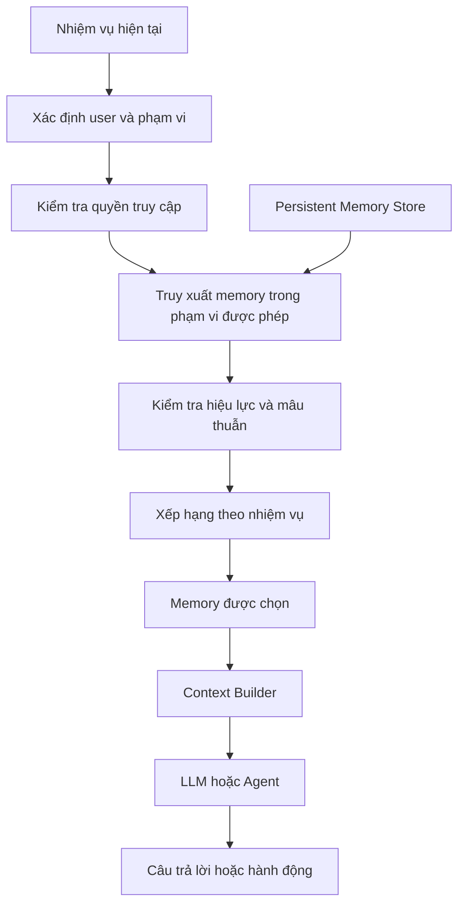

Một AI Agent có thể ghi nhớ rất nhiều thông tin từ các cuộc hội thoại trước. Nhưng nếu không biết thông tin nào còn đúng, việc nhớ đôi khi lại khiến nó quyết định sai.

## 1. Khi AI nhớ rất tốt, nhưng nhớ sai điều cần thiết

Giả sử AI Assistant hỗ trợ một người quản lý phân tích doanh thu chuỗi cửa hàng. Người này từng nói:

> "Khi phân tích doanh thu, tôi muốn xem kết quả theo từng tuần và ưu tiên biểu đồ cột."

AI ghi lại sở thích ấy và áp dụng trong những lần sau. Một tháng sau, người quản lý đổi ý:

> "Từ giờ, các báo cáo doanh thu mặc định theo tháng nhé. Biểu đồ đường sẽ dễ theo dõi xu hướng hơn."

AI đồng ý, tạo báo cáo theo tháng. Nhưng trong phiên kế tiếp, khi được hỏi "Cho tôi xem tình hình doanh thu gần đây", nó lại dùng biểu đồ cột theo tuần.

Memory Store vẫn chứa sở thích cũ. Thông tin mới có thể đã được ghi thêm, nhưng hệ thống không xác định được rằng nó **thay thế** bản trước. Khi truy xuất, cả hai cùng xuất hiện; model có thể chọn bản cũ vì điểm similarity cao hơn hoặc vì nó được diễn đạt rõ hơn.

Vấn đề không còn là AI có nhớ được hay không. **Nó có biết điều gì đáng nhớ, thông tin nào còn hiệu lực và khi nào phải ngừng sử dụng một memory hay không?**

Bài [Bộ nhớ của Agent là bài toán kiến trúc context](../agent-memory-is-context-architecture-vi/) ở phần Learn giới thiệu vai trò của memory. Ở đây, chúng ta đi sâu vào cách xây hệ thống vận hành đáng tin cậy: lưu, truy xuất, cập nhật, giải quyết mâu thuẫn, xóa và kiểm thử.

## 2. Task State không phải Long-Term Memory

Khi tạo báo cáo, Agent có thể cần lưu cửa hàng đang phân tích, kỳ báo cáo, các bước đã hoàn thành, kết quả từ tools và câu hỏi còn mở. Những thông tin này thuộc **task state**. Chúng có thể được lưu bền vững để khôi phục sau lỗi mà vẫn không trở thành long-term memory.

| Thành phần | Mục đích | Phạm vi |
| :-- | :-- | :-- |
| Conversation history | Lưu các lượt tương tác | Một cuộc hội thoại hoặc thread |
| Task state | Giữ trạng thái thực thi | Một task hoặc workflow |
| Checkpoint | Khôi phục tiến trình | Theo execution hoặc thread |
| Long-term memory | Tái sử dụng thông tin có giá trị | Nhiều phiên hoặc task |
| Knowledge Base | Cung cấp tài liệu, dữ liệu nghiệp vụ | Theo nguồn chính thức |

Tỷ lệ tăng trưởng doanh thu tháng 8 được truy vấn trong một phiên phân tích không nhất thiết phải được Agent nhớ mãi. Ngược lại, sở thích trình bày báo cáo có thể hữu ích qua nhiều phiên.

[LangGraph](https://docs.langchain.com/oss/python/langgraph/persistence) dùng checkpointer để lưu state theo thread và store cho thông tin cần dùng xuyên thread. Hai cơ chế giải quyết hai nhu cầu khác nhau. Cũng đừng coi Knowledge Base là memory của Agent: chính sách giá và số liệu chính thức phải được lấy từ nguồn nghiệp vụ đang có hiệu lực, không phải từ bản tóm tắt cũ mà Agent từng lưu. **Memory bổ sung bối cảnh, không thay thế nguồn sự thật có thẩm quyền.**

## 3. Memory System cần nhiều hơn Vector Database

Một cách làm phổ biến là tóm tắt hội thoại, tạo embeddings, lưu vào vector database rồi dùng similarity search. Cách này giúp tìm lại thông tin, nhưng không tự quyết định "theo tuần" hay "theo tháng" là sở thích hiện hành. Cả hai đều giống câu hỏi về kỳ báo cáo.

Vì vậy, hệ thống cần hai pipeline:

- **Memory Write Pipeline** quyết định điều gì được lưu, cập nhật hoặc vô hiệu hóa.
- **Memory Read Pipeline** quyết định memory nào được truy xuất và đưa vào context hiện tại.



*Hình 1. Memory có vòng đời ghi, đọc và cập nhật; vector search chỉ là một phần của bước truy xuất.*

Hệ thống còn phải trả lời: có nên lưu không, bản mới có thay bản cũ không, ai được xem, thông tin có còn hiệu lực và có cần xóa không. Đây là bài toán **memory management**, không chỉ là tìm kiếm vector.

## 4. Memory Write: Không phải thông tin nào cũng đáng lưu

Nếu người dùng hỏi "Doanh thu hôm qua là bao nhiêu?", AI nên truy vấn nguồn dữ liệu nghiệp vụ. Con số ấy có thể thay đổi hoặc được tính lại; thường không cần lưu thành long-term memory. Nhưng câu "Tôi thường xem báo cáo theo tháng" có thể là **memory candidate** hữu ích. Candidate vẫn cần được kiểm tra trước khi chấp nhận.

| Tiêu chí | Câu hỏi |
| :-- | :-- |
| Reusability | Có hữu ích trong các nhiệm vụ sau không? |
| Durability | Khả năng còn đúng trong tương lai? |
| Confidence | Có đủ căn cứ tin thông tin này không? |
| Scope | Thuộc người dùng, nhóm hay Agent nào? |
| Sensitivity | Có được phép và có cần lưu không? |
| Redundancy | Đã có memory tương đương chưa? |

Quy tắc không lưu loại dữ liệu nhạy cảm phải được thực thi bằng code và chính sách, không giao hoàn toàn cho LLM. Model có thể giúp nhận diện sở thích được diễn đạt tự nhiên.

Việc ghi có thể diễn ra **in-band**, ngay trên đường xử lý request: thông tin mới sẵn sàng nhanh nhưng tăng latency. Hoặc ghi **deferred**, qua job sau khi Agent hoàn thành bước hay phiên tương tác: nhẹ hơn cho request chính, nhưng memory có thể chưa kịp xuất hiện ở request kế tiếp. [Tài liệu memory của LangChain](https://docs.langchain.com/oss/python/concepts/memory) cũng trình bày hai lựa chọn này.

Với cài đặt có schema rõ ràng và cần áp dụng tức thì, chẳng hạn kỳ báo cáo mặc định, có thể cập nhật application settings trực tiếp. Memory Writer chỉ đồng bộ thông tin cần thiết cho Agent. **Không phải mọi dữ liệu lâu dài đều cần đi qua LLM Memory Pipeline.**

## 5. Memory Update: Khi thông tin thay đổi

Nếu người dùng đổi từ "theo tuần" sang "mặc định theo tháng" mà Memory Writer chỉ `INSERT`, cả hai bản sẽ cùng tồn tại. Thao tác quản lý có thể được thiết kế như sau:

| Thao tác | Khi sử dụng |
| :-- | :-- |
| ADD | Thông tin mới có giá trị |
| UPDATE | Sửa hoặc bổ sung bản hiện có |
| SUPERSEDE | Bản mới thay thế trạng thái cũ |
| INVALIDATE | Không còn được dùng như thông tin hiện hành |
| DELETE | Phải xóa theo yêu cầu hoặc chính sách |
| NO-OP | Không cần thay đổi |

Đây là bộ thao tác minh họa, không phải API chuẩn của một framework. [Mem0](https://docs.mem0.ai/core-concepts/memory-operations/update) và [LangMem](https://langchain-ai.github.io/langmem/concepts/conceptual_guide/) đều có cơ chế cập nhật thông tin, không chỉ thêm bản ghi.

Một memory có cấu trúc có thể như sau:

```json
{
  "id": "mem_report_period_001",
  "scope": {
    "organization_id": "ORG_001",
    "user_id": "USER_001"
  },
  "type": "user_preference",
  "key": "default_report_period",
  "value": "monthly",
  "source": "explicit_user_instruction",
  "observed_at": "2026-09-15T10:30:00Z",
  "valid_from": "2026-09-15",
  "status": "active",
  "version": 2
}
```

Schema này chỉ để minh họa. `scope` cho biết ai sở hữu thông tin; `source` và `status` giúp đánh giá độ tin cậy và hiệu lực. `observed_at` khác `valid_from`: một quy định được ghi nhận hôm nay nhưng tháng sau mới có hiệu lực thì không được áp dụng ngay.

## 6. Conflict Resolution: Memory nào đúng?

Chọn bản mới nhất chưa chắc an toàn. Một lời nói trực tiếp của người dùng như "Tôi muốn báo cáo theo tháng" có thể đáng tin hơn bản tóm tắt do LLM tạo sau đó: "Người dùng có thể thích báo cáo theo tuần".

Khi giải quyết mâu thuẫn, cần xét:

- **Source authority:** lời xác nhận trực tiếp hay suy luận chưa kiểm chứng?
- **Temporal validity:** thông tin nào có hiệu lực ở thời điểm đang hỏi?
- **Specificity:** mặc định chung hay ngoại lệ của một nhiệm vụ?
- **Confidence và policy:** dữ kiện chắc chắn hay giả thuyết; có quy tắc ưu tiên nguồn không?

Ví dụ: "Mặc định theo tháng, nhưng riêng chiến dịch này hãy chia theo tuần." Hai yêu cầu không mâu thuẫn; chúng có **phạm vi khác nhau**. Hệ thống không được cập nhật sở thích mặc định thành theo tuần chỉ vì yêu cầu tạm thời xuất hiện sau.

Thông tin cũ có thể được đánh dấu `superseded` để phục vụ câu hỏi lịch sử. Nhưng nếu người dùng yêu cầu xóa hoặc chính sách lưu giữ yêu cầu, không được giữ bản cũ chỉ để tiện temporal reasoning. **Lưu lịch sử thay đổi và thực hiện quyền xóa là hai yêu cầu phải được thiết kế riêng.** Khi không đủ chắc chắn, nên hỏi lại hoặc giữ trạng thái chưa xác minh.

## 7. Memory Retrieval: Nhớ đúng cho đúng nhiệm vụ

Khi được yêu cầu "Tạo báo cáo doanh thu gần đây", Agent có thể cần sở thích xem theo tháng và dùng biểu đồ đường. Cửa hàng người dùng quản lý chỉ hữu ích nếu được xác nhận đúng phạm vi truy cập. Chương trình khuyến mãi cũ chưa chắc liên quan.



*Hình 2. Quyền truy cập được kiểm tra trước khi truy xuất; sau đó chỉ memory hợp lệ, liên quan mới vào context.*

Có thể kết hợp **direct lookup** cho key biết trước (`default_report_period`), **metadata filtering** theo user, tổ chức và thời gian, **semantic search** cho thông tin tự nhiên, hoặc **hybrid search** khi cần cả từ khóa lẫn ngữ nghĩa. Namespace giúp tổ chức dữ liệu, nhưng không thay thế authorization ở application hoặc storage layer.

Không phải request nào cũng cần memory. Một phép cộng đơn giản không cần tải toàn bộ sở thích; tránh truy xuất không cần thiết giúp giảm latency và chi phí.

## 8. Khi nhiều Agent cùng dùng Memory

Analytics Agent xử lý số liệu, Knowledge Agent tìm tài liệu, Report Agent tạo báo cáo. Sở thích ngôn ngữ báo cáo có thể hữu ích cho Report Agent, nhưng Analytics Agent không cần toàn bộ thông tin cá nhân của người dùng.

Một cách phân vùng logic là:

```text
organization / ORG_001
    shared_preferences
    approved_procedures

users / USER_001
    report_preferences
    personal_memory

agents / analytics_agent
    verified_experiences

tasks / TASK_001
    temporary_state
```

Đây không phải đề xuất cho tất cả dữ liệu vào chung một backend. `temporary_state` thường phù hợp với checkpoint hoặc task store hơn long-term memory. Quyền ghi cũng cần phân biệt: Knowledge Agent tìm được tài liệu mới không có nghĩa nó được tự sửa chính sách trong shared memory. Dữ liệu thẩm quyền cao cần quy trình phê duyệt và versioning riêng. **Chia sẻ memory không đồng nghĩa với tự do đọc và ghi mọi thông tin.**

## 9. Xóa, hết hạn và quản lý vòng đời

Nếu chỉ ghi và truy xuất, Memory Store sẽ tích lũy dữ liệu lỗi thời. Vòng đời cần ít nhất bốn khái niệm:

| Cơ chế | Ý nghĩa |
| :-- | :-- |
| Expiration | Hết giá trị sau một thời điểm |
| Invalidation | Không còn được dùng như thông tin hiện hành |
| Consolidation | Gộp các bản trùng hoặc liên quan |
| Deletion | Xóa theo yêu cầu hoặc chính sách |

"Đang phân tích chiến dịch tháng 8" chỉ có thể hữu ích cho task ngắn. Một thiết lập mặc định được xác nhận có thể tồn tại đến khi thay đổi hoặc xóa. Không nên áp cùng TTL cho mọi memory.

Khi xóa, phải xét cả search index, cache, summaries, materialized views và backup theo chính sách vận hành. Xóa record gốc nhưng vector index vẫn trả về nội dung cũ thì Agent chưa thực sự ngừng sử dụng nó.

Production cũng cần xử lý ghi trùng và cập nhật đồng thời. Nếu hai thay đổi sở thích đến gần nhau và job bất đồng bộ hoàn tất sai thứ tự, bản cũ có thể ghi đè bản mới. Version checking, idempotent writes và quy tắc thứ tự sự kiện giúp hạn chế lỗi này.

## 10. Đánh giá Memory System như thế nào?

Chỉ kiểm tra Agent nhớ được một fact là chưa đủ. Hệ thống còn phải cập nhật, đọc đúng phạm vi và biết khi nào không nên dựa vào memory.

### 10.1. Kiểm tra ghi

Với câu "Từ giờ mặc định báo cáo theo tháng", expected memory có thể là:

```json
{
  "type": "user_preference",
  "key": "default_report_period",
  "value": "monthly"
}
```

Kiểm tra giá trị, nguồn và scope; đồng thời kiểm tra hệ thống **không lưu** dữ liệu tạm thời hoặc bị cấm.

### 10.2. Kiểm tra truy xuất và sử dụng

Memory lưu đúng chưa chắc được lấy khi cần. Cần kiểm tra bản hiện hành có được ưu tiên, bản trái quyền có lọt vào context và Agent có áp dụng thông tin đúng cách không. Ground truth ở đây phụ thuộc lịch sử thay đổi và thời gian, không chỉ độ giống nhau của văn bản.

### 10.3. Kiểm tra cập nhật và mâu thuẫn

Tạo chuỗi ba phiên: phiên 1 thích báo cáo theo tuần, phiên 2 đổi mặc định sang tháng, phiên 3 yêu cầu báo cáo mà không nhắc kỳ. Kết quả đúng ở phiên 3 là **theo tháng**. Thử thêm trường hợp một yêu cầu riêng theo tuần không được ghi đè mặc định.

### 10.4. Kiểm tra khi không nên dùng Memory

Nếu người dùng hỏi "Tháng trước tôi chọn màu biểu đồ nào?" mà không có bằng chứng đáng tin, Agent phải biết **không suy đoán**. Memory đã xóa hoặc vô hiệu hóa cũng không được ảnh hưởng câu trả lời. Khả năng quên và từ chối trả lời thiếu căn cứ quan trọng không kém khả năng nhớ lại.

## 11. Benchmark công khai đáng tham khảo

[LongMemEval](https://arxiv.org/abs/2410.10813), công bố tại ICLR 2025, có 500 câu hỏi về trích xuất thông tin, suy luận qua nhiều phiên, suy luận thời gian, cập nhật kiến thức và abstention. Thông tin để trả lời có thể nằm rải rác qua nhiều cuộc hội thoại.

[MemoryAgentBench](https://arxiv.org/abs/2507.05257), từ nghiên cứu tại ICLR 2026, đánh giá retrieval chính xác, học trong quá trình tương tác, hiểu ngữ cảnh dài và xử lý thông tin xung đột hoặc cần quên. Các bộ test công khai hữu ích để so sánh chiến lược, nhưng không thay thế eval theo nghiệp vụ của ứng dụng.

Với Assistant báo cáo kinh doanh, một bộ test riêng có thể gồm:

| Scenario | Điều cần kiểm chứng |
| :-- | :-- |
| Remember Preference | Ghi nhớ sở thích hợp lệ |
| Update Preference | Dùng giá trị mới sau thay đổi |
| Temporary Override | Yêu cầu tạm thời không ghi đè mặc định |
| Cross-Session Recall | Truy xuất ở phiên mới |
| Conflict Resolution | Không ưu tiên bản sai hoặc lỗi thời |
| Scope Isolation | Không dùng memory của người khác |
| Forgetting | Không đọc memory đã xóa |
| Abstention | Không suy đoán khi thiếu bằng chứng |

Ngoài PASS/FAIL, có thể đo retrieval hit rate, stale-memory usage rate, unnecessary-memory-write rate, token overhead và latency. Đây là metric engineering cần định nghĩa cho ứng dụng. Hãy so với baseline không có memory hoặc chỉ dùng thread state: nếu memory tốn thêm tài nguyên mà không cải thiện task success, cần xem lại giá trị của nó.

## 12. Tự xây hay dùng framework?

**LangGraph** cung cấp checkpointer và store primitives. **LangMem** hỗ trợ trích xuất, hợp nhất và quản lý long-term memory. **Mem0** tập trung vào thao tác lưu, tìm kiếm và cập nhật. [Anthropic Memory Tool](https://platform.claude.com/docs/en/agents-and-tools/tool-use/memory-tool) cung cấp giao diện file operations để Agent yêu cầu đọc/ghi; ứng dụng triển khai storage và kiểm soát quyền.

Các công cụ này giải quyết những phần khác nhau. Nếu chỉ có vài preference với schema rõ ràng, bảng PostgreSQL cùng logic cập nhật thông thường có thể đơn giản và đáng tin hơn vector retrieval. Nếu Agent phải nhớ kinh nghiệm phi cấu trúc qua nhiều phiên, công cụ memory chuyên dụng có thể hữu ích.

Trước khi chọn framework, hãy trả lời: **Cần nhớ loại thông tin nào, nó thay đổi ra sao và kiểm chứng bằng cách nào?**

## 13. Những nguyên tắc khi đưa vào production

1. Đừng lưu tất cả những gì Agent thấy; dữ liệu tạm thời thuộc task state hoặc nguồn nghiệp vụ.
2. Đừng dùng semantic similarity để quyết định điều gì là sự thật hoặc còn hiệu lực.
3. Thiết kế update, invalidation và deletion ngay từ đầu, không chỉ `INSERT`.
4. Phân biệt suy luận của model với thông tin người dùng đã xác nhận.
5. Thực thi quyền đọc, ghi và xóa bằng application hoặc storage layer.
6. Kiểm thử cả khả năng quên và cập nhật, không chỉ nhớ lại.

## 14. Kết luận

Agent Memory trong production không chỉ là lưu lịch sử hội thoại, tạo embeddings rồi tìm kiếm tương tự. Nó cần quyết định điều gì đáng nhớ, nguồn và phạm vi nào đáng tin, thông tin nào đang hiện hành, khi nào phải ngừng dùng hoặc xóa hẳn.

Không phải ứng dụng nào cũng cần kiến trúc phức tạp. Có hệ thống chỉ cần checkpoint và bảng preference; có Agent cần memory xuyên phiên, semantic retrieval và hợp nhất kinh nghiệm. Mức độ phức tạp phải tương xứng với lợi ích đo được.

**Agent có bộ nhớ tốt không phải Agent nhớ nhiều nhất, mà là Agent biết thông tin nào còn đáng tin, khi nào nên dùng và khi nào phải để quá khứ không làm sai quyết định hiện tại.**

## Tài liệu tham khảo

1. [LangChain - Memory Overview](https://docs.langchain.com/oss/python/concepts/memory) - short-term và long-term memory, cách cập nhật.
2. [LangGraph - Persistence](https://docs.langchain.com/oss/python/langgraph/persistence) - checkpoint, thread state và store.
3. [LangChain - Long-Term Memory](https://docs.langchain.com/oss/python/langchain/long-term-memory) - store, namespace và thông tin xuyên phiên.
4. [LangMem - Long-Term Memory in LLM Applications](https://langchain-ai.github.io/langmem/concepts/conceptual_guide/) - trích xuất và hợp nhất memory.
5. [Mem0 - Add Memory](https://docs.mem0.ai/core-concepts/memory-operations/add) và [Update Memory](https://docs.mem0.ai/core-concepts/memory-operations/update) - thao tác ghi và cập nhật.
6. [Anthropic - Memory Tool](https://platform.claude.com/docs/en/agents-and-tools/tool-use/memory-tool) - giao diện đọc/ghi memory do ứng dụng triển khai.
7. [Wu et al. - LongMemEval (ICLR 2025)](https://arxiv.org/abs/2410.10813) và [bộ code](https://github.com/xiaowu0162/LongMemEval).
8. [Hu et al. - MemoryAgentBench (ICLR 2026)](https://arxiv.org/abs/2507.05257) và [bộ code](https://github.com/HUST-AI-HYZ/MemoryAgentBench).
