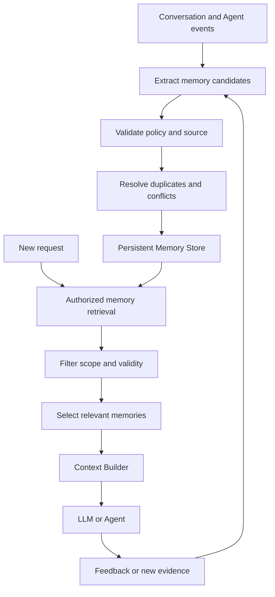
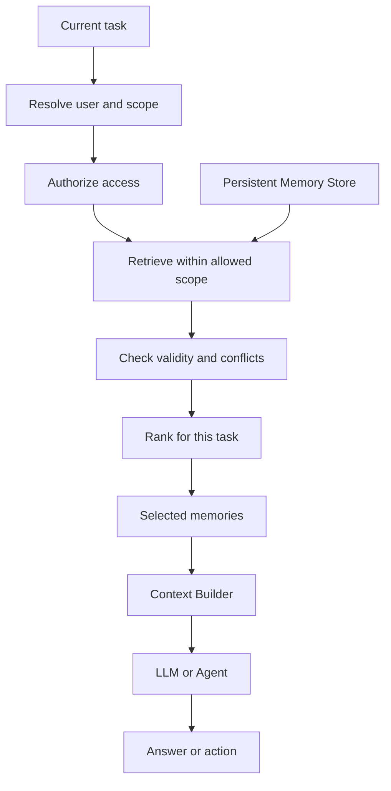

An AI Agent can retain thousands of details from earlier conversations. But remembering becomes harmful if the system cannot tell which details are still true.

## 1. When an Agent remembers the wrong thing

Imagine an AI Assistant helping a retail manager analyze revenue. The manager once said:

> "When you analyze revenue, show weekly results and use bar charts."

The Assistant remembers this preference and applies it in later reports. A month later, the manager changes it:

> "From now on, make monthly reports the default. A line chart makes trends easier to follow."

The Assistant agrees and produces a monthly report. But in the next conversation, when asked for recent revenue, it returns a weekly bar chart again.

The memory store still holds the old preference. The new instruction may have been added, but the system never established that it **superseded** the previous one. Retrieval returns both, and the model may choose the old version because of similarity score, ordering, or wording.

The question is no longer whether the Agent *can* remember. **Can it decide what deserves to be remembered, what remains valid, and when an old memory must stop influencing its answer?**

The [Agent Memory lesson in Learn](../agent-memory-is-context-architecture/) introduces memory as part of context architecture. Here we examine the production mechanics: writing, retrieving, updating, resolving conflicts, deleting, and testing memory.

## 2. Task state is not long-term memory

While preparing a report, an Agent may need to retain the store being analyzed, the reporting period, completed steps, tool results, and open questions. This is **task state**. It may be persisted for recovery without becoming long-term memory.

| Component | Purpose | Scope |
| :-- | :-- | :-- |
| Conversation history | Records exchanges | A conversation or thread |
| Task state | Tracks execution | A task or workflow |
| Checkpoint | Restores execution | An execution or thread |
| Long-term memory | Reuses valuable information | Multiple sessions or tasks |
| Knowledge base | Supplies business documents and data | An authoritative source |

An August growth figure fetched during one analysis need not be remembered forever. A reporting preference may be useful across sessions.

[LangGraph's persistence model](https://docs.langchain.com/oss/python/langgraph/persistence) uses checkpointers for thread state and stores for information shared across threads. These serve different purposes. A knowledge base is also not automatically Agent memory: official prices, policies, and financial figures should come from the effective business source, not an old summary the Agent happened to save. **Memory adds context; it does not replace an authoritative source of truth.**

## 3. A memory system needs more than a vector database

A common design summarizes conversations, embeds the summaries, saves them in a vector database, and runs similarity search later. That can find relevant information. It cannot, by similarity alone, decide whether "weekly" or "monthly" is the current default. Both match a query about report preferences.

A practical system therefore needs two pipelines:

- The **Memory Write Pipeline** decides what to save, update, or invalidate.
- The **Memory Read Pipeline** decides which memories to retrieve and include in current context.



*Figure 1. Memory has a write, read, and update lifecycle. Vector search is only one part of retrieval.*

The system must also ask: Should this be saved? Does it replace an earlier record? Who may read it? Is it still valid? Must it be deleted? Those are **memory-management** decisions, not vector-search features.

## 4. Memory writes: not everything deserves to be saved

If a user asks "What was yesterday's revenue?", the Assistant should query the business data source. That figure may change or be recalculated; it usually does not belong in long-term memory. "I usually view monthly revenue reports" is different. It might become a useful **memory candidate**, but a candidate still needs validation.

| Criterion | Question |
| :-- | :-- |
| Reusability | Will it help with future tasks? |
| Durability | Is it likely to stay useful? |
| Confidence | Is the claim well supported? |
| Scope | Which user, team, or Agent owns it? |
| Sensitivity | Is storing it permitted and necessary? |
| Redundancy | Is an equivalent memory already present? |

Rules against storing sensitive categories must be enforced by application policy and code, not left entirely to an LLM. A model can still help recognize a preference expressed in natural language.

Writing can happen **in-band**, on the request path: the change becomes available quickly, but adds latency. Or it can be **deferred** to a background job after a step or interaction: less work on the response path, but the next request may arrive before the write completes. [LangChain's memory overview](https://docs.langchain.com/oss/python/concepts/memory) describes this trade-off.

For a structured setting that must apply immediately, such as the default reporting period, update an application setting directly. A Memory Writer can then synchronize what the Agent needs to know. **Not every durable fact needs an LLM-driven memory pipeline.**

## 5. Memory updates: when information changes

If the user changes from weekly to monthly reports and the writer only runs `INSERT`, both preferences remain active. A design might support these operations:

| Operation | Use |
| :-- | :-- |
| ADD | New valuable information |
| UPDATE | Correct or enrich an existing record |
| SUPERSEDE | Replace an earlier state |
| INVALIDATE | Stop treating a record as current |
| DELETE | Remove it under a request or policy |
| NO-OP | Make no change |

These names are illustrative, not a framework API. [Mem0](https://docs.mem0.ai/core-concepts/memory-operations/update) and [LangMem](https://langchain-ai.github.io/langmem/concepts/conceptual_guide/) both provide ways to update information rather than only append records.

A structured memory might look like this:

```json
{
  "id": "mem_report_period_001",
  "scope": {
    "organization_id": "ORG_001",
    "user_id": "USER_001"
  },
  "type": "user_preference",
  "key": "default_report_period",
  "value": "monthly",
  "source": "explicit_user_instruction",
  "observed_at": "2026-09-15T10:30:00Z",
  "valid_from": "2026-09-15",
  "status": "active",
  "version": 2
}
```

This schema is only an example. `scope` identifies ownership; `source` and `status` help establish trust and validity. `observed_at` differs from `valid_from`: a policy recorded today but effective next month should not be applied early.

## 6. Conflict resolution: which memory is right?

Choosing the newest record is not always safe. A direct user instruction, "I want monthly reports," may be more authoritative than a later LLM-generated summary saying, "The user may prefer weekly reports."

Resolve conflicts using:

- **Source authority:** direct confirmation or unverified inference?
- **Temporal validity:** which rule applies at the time being discussed?
- **Specificity:** a general default or a one-task exception?
- **Confidence and policy:** verified fact or hypothesis; is there a business source-priority rule?

Consider: "Monthly by default, but use weekly figures for this campaign." These instructions do not conflict. They apply at **different scopes**. The temporary request must not overwrite the default.

An old memory may be marked `superseded` when change history is useful. But a deletion request or retention rule may require removing it rather than keeping it for temporal reasoning. **Keeping a change history and honoring deletion are separate design requirements.** If the relationship between records is unclear, ask the user or keep the claim unverified instead of choosing arbitrarily.

## 7. Memory retrieval: the right memory for the right task

For "Make a recent revenue report," the monthly default and line-chart preference matter. The user's assigned store may matter if access scope is confirmed. An old promotion campaign may not matter at all.



*Figure 2. Authorization precedes retrieval; only valid, useful memories reach the model's context.*

Use **direct lookup** for a known key such as `default_report_period`, **metadata filtering** for user, organization, and validity period, **semantic search** for naturally worded experiences, or **hybrid search** when lexical and semantic matching both matter. Namespaces organize information but do not replace authorization at the application or storage layer.

Memory need not be consulted on every request. A simple arithmetic question gains little from loading report preferences. Avoiding irrelevant reads can reduce latency and cost.

## 8. Memory shared across Agents

An Analytics Agent handles figures, a Knowledge Agent finds business documents, and a Report Agent writes the result. A report-language preference may help the Report Agent, but the Analytics Agent does not need the user's full personal history.

One logical partition might be:

```text
organization / ORG_001
    shared_preferences
    approved_procedures

users / USER_001
    report_preferences
    personal_memory

agents / analytics_agent
    verified_experiences

tasks / TASK_001
    temporary_state
```

This does not imply that every category belongs in one backend. `temporary_state` usually fits a checkpoint or task store better than long-term memory. Write permissions matter too: finding a new document does not give the Knowledge Agent permission to change an approved company policy in shared memory. Authoritative data needs its own approval and versioning process. **Sharing memory does not mean unrestricted reading and writing.**

## 9. Expiry, deletion, and lifecycle management

Without lifecycle rules, a memory store fills with obsolete or low-quality claims. Distinguish at least four mechanisms:

| Mechanism | Meaning |
| :-- | :-- |
| Expiration | Loses value after a time |
| Invalidation | Must no longer be used as current information |
| Consolidation | Combines duplicate or related records |
| Deletion | Removes information under a request or policy |

"The user is analyzing the August campaign" may be useful only during a short task. A confirmed default setting may last until changed or deleted. A single TTL for all memories is therefore a poor fit.

Deletion must also consider search indexes, caches, summaries, materialized views, and backups under the applicable operational policy. If the primary record disappears but the vector index still returns its content, the Agent has not really stopped using it.

Production systems also need concurrency and duplicate-write controls. Two preference updates can arrive close together; asynchronous jobs may finish out of order and let the older value overwrite the newer one. Version checks, idempotent writes, and event-ordering rules help prevent this.

## 10. How do we evaluate a memory system?

Testing whether an Agent recalls one fact is not enough. It must also update records, read within scope, and know when not to trust memory.

### 10.1. Test writes

For "Make monthly revenue reports the default," an expected record might be:

```json
{
  "type": "user_preference",
  "key": "default_report_period",
  "value": "monthly"
}
```

Check the value, scope, and source. Also test that temporary or prohibited information is **not** stored.

### 10.2. Test retrieval and use

A correctly stored record might still be missed. Check whether current memories outrank obsolete ones, whether cross-user information leaks into context, and whether the Agent applies a retrieved preference correctly. The ground truth depends on change history and time, not just textual similarity.

### 10.3. Test updates and conflicts

Construct three sessions: in session 1 the user prefers weekly reports; in session 2 they switch the default to monthly; in session 3 they request a report without naming a period. The correct result is **monthly**. Add a case where a one-off weekly request must not change that default.

### 10.4. Test when memory should not be used

If the user asks "What chart color did I choose last month?" and no reliable memory exists, the Agent should **not guess**. Deleted or invalidated memory must no longer affect answers. Forgetting and abstention are as important to test as recall.

## 11. Useful public benchmarks

[LongMemEval](https://arxiv.org/abs/2410.10813), published at ICLR 2025, has 500 questions testing information extraction, multi-session reasoning, temporal reasoning, knowledge updates, and abstention. Evidence can be distributed across many conversations.

[MemoryAgentBench](https://arxiv.org/abs/2507.05257), from an ICLR 2026 study, tests accurate retrieval, test-time learning, long-range understanding, and handling conflicting or outdated information. Public benchmarks help compare approaches, but cannot replace application-specific evaluation.

For our retail Assistant, a focused test suite could include:

| Scenario | What to verify |
| :-- | :-- |
| Remember Preference | Save a valid preference |
| Update Preference | Use the new value after a change |
| Temporary Override | Preserve the default after a one-off request |
| Cross-Session Recall | Retrieve memory in a new session |
| Conflict Resolution | Reject a wrong or stale record |
| Scope Isolation | Never use another user's memory |
| Forgetting | Never retrieve deleted memory |
| Abstention | Avoid guessing without evidence |

Beyond pass/fail, measure retrieval hit rate, stale-memory usage, unnecessary writes, token overhead, and latency. These are engineering metrics to define for the application. Compare against a baseline with no long-term memory or only thread state. If memory increases cost without improving task success, the design needs reconsideration.

## 12. Build it yourself or use a framework?

**LangGraph** offers checkpointers and store primitives. **LangMem** supports memory extraction, consolidation, and management. **Mem0** focuses on adding, searching, and updating memories. [Anthropic's Memory Tool](https://platform.claude.com/docs/en/agents-and-tools/tool-use/memory-tool) provides file-operation requests, while the application implements storage and access control.

These solve different parts of the problem. For a few well-structured preferences, a PostgreSQL table and ordinary update logic may be simpler and more reliable than vector retrieval. If an Agent must carry unstructured experience across sessions and retrieve it semantically, specialized memory tools can be valuable.

Before choosing a framework, ask: **What kind of information must be remembered, how can it change, and how will we verify it?**

## 13. Production principles

1. Do not store everything the Agent sees; short-lived data belongs in task state or its business source.
2. Do not mistake semantic similarity for truth or temporal validity.
3. Design update, invalidation, and deletion from the beginning, not only `INSERT`.
4. Keep model inferences distinct from user-confirmed facts.
5. Enforce read, write, and delete permissions in the application or storage layer.
6. Test forgetting and updates, not just recall.

## 14. Conclusion

Production Agent memory is not simply conversation history plus embeddings and similarity search. It must decide what is worth retaining, which sources and scopes are trustworthy, which facts are current, and when a record must stop being used or be deleted.

Not every application needs a complex architecture. Some need only checkpoints and a preference table; others benefit from cross-session memory, semantic retrieval, and experience consolidation. The complexity should earn its place through measurable value.

**A good memory system is not the one that remembers the most. It is the one that knows what remains trustworthy, when to use it, and when the past must stop shaping a decision.**

## References and further reading

1. [LangChain - Memory Overview](https://docs.langchain.com/oss/python/concepts/memory) - short- and long-term memory and update strategies.
2. [LangGraph - Persistence](https://docs.langchain.com/oss/python/langgraph/persistence) - checkpoints, thread state, and stores.
3. [LangChain - Long-Term Memory](https://docs.langchain.com/oss/python/langchain/long-term-memory) - stores, namespaces, and cross-session data.
4. [LangMem - Long-Term Memory in LLM Applications](https://langchain-ai.github.io/langmem/concepts/conceptual_guide/) - extraction and consolidation.
5. [Mem0 - Add Memory](https://docs.mem0.ai/core-concepts/memory-operations/add) and [Update Memory](https://docs.mem0.ai/core-concepts/memory-operations/update) - write and update operations.
6. [Anthropic - Memory Tool](https://platform.claude.com/docs/en/agents-and-tools/tool-use/memory-tool) - application-implemented read and write operations.
7. [Wu et al. - LongMemEval (ICLR 2025)](https://arxiv.org/abs/2410.10813) and [code](https://github.com/xiaowu0162/LongMemEval).
8. [Hu et al. - MemoryAgentBench (ICLR 2026)](https://arxiv.org/abs/2507.05257) and [code](https://github.com/HUST-AI-HYZ/MemoryAgentBench).
