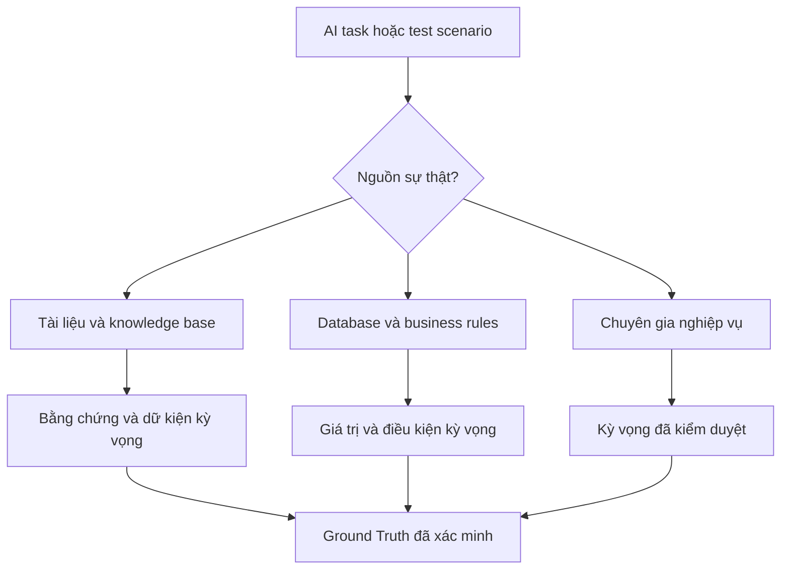
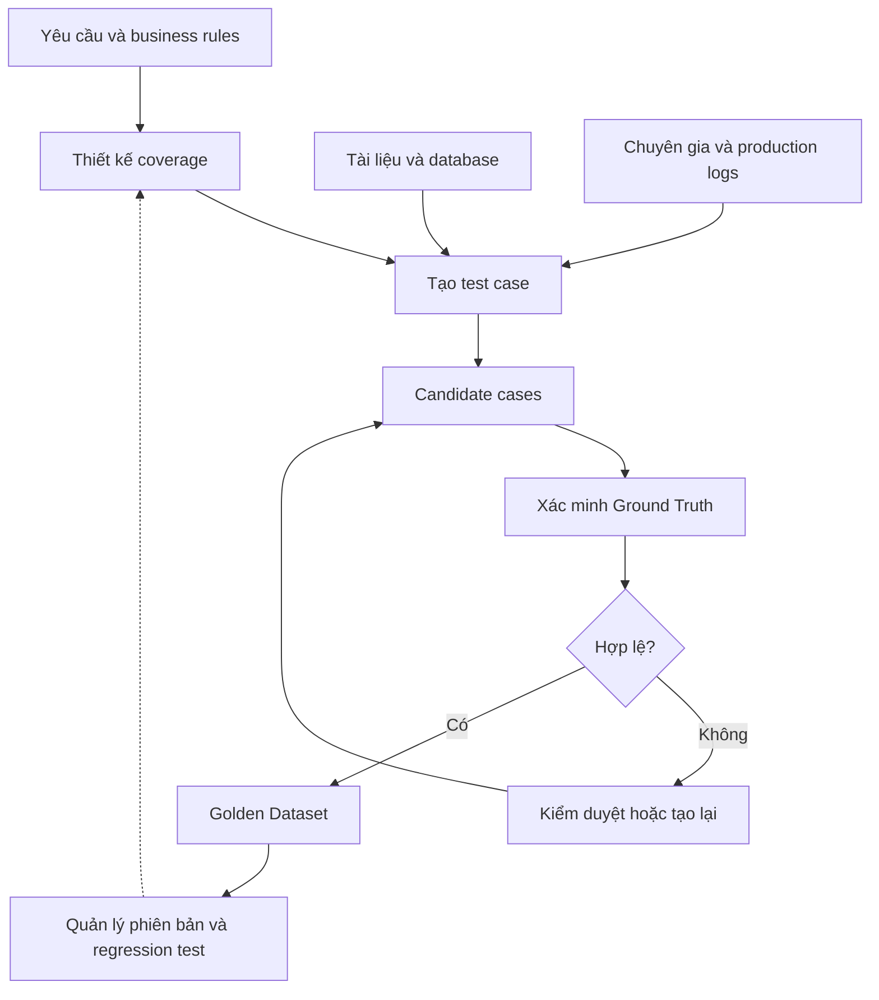

Một AI Assistant có thể trả lời rất thuyết phục. Nhưng trước khi đánh giá câu trả lời đó tốt đến đâu, chúng ta cần biết điều gì mới thực sự là **đúng**.

## 1. AI trả lời rồi, nhưng ai quyết định thế nào là đúng?

Giả sử chúng ta đang xây một AI Assistant hỗ trợ quản lý cửa hàng bán lẻ. Người quản lý hỏi:

> "Doanh thu tháng 8 tăng bao nhiêu so với tháng 7?"

AI trả lời: "Doanh thu tháng 8 tăng 15% so với tháng 7, cho thấy hoạt động kinh doanh đang cải thiện." Nghe hợp lý, nhưng 15% có đúng không? Nếu con số đến từ database, ta có thể chạy một câu SQL độc lập để kiểm tra. Nếu nó đến từ báo cáo, ta cần đối chiếu dữ liệu và công thức tính trong báo cáo ấy.

Bây giờ thử đổi câu hỏi: "Khách hàng có thể trả lại sản phẩm sau 7 ngày không?" Lần này, SQL có thể không phải thứ ta cần. Đáp án nằm trong chính sách trả hàng hiện hành, và chính sách đó có thể kèm nhiều điều kiện. Trả lời rằng khách được trả hàng trong mọi trường hợp vẫn có thể sai.

Cuối cùng, người dùng yêu cầu: "Hủy đơn hàng DH-102 giúp tôi." AI báo đã hủy thành công. Nhưng trạng thái đơn trong hệ thống đã thay đổi chưa? Đơn đó có đủ điều kiện để hủy không?

Ba tình huống cần ba cách kiểm chứng: kiểm tra số liệu, đối chiếu chính sách và xác minh trạng thái hệ thống. Vấn đề đầu tiên không phải chọn model nào để chấm AI, mà là **đáp án đúng đến từ đâu và làm thế nào để kiểm chứng nó**.

Đó là bài toán của *Ground Truth*.

## 2. Ground Truth thực sự là gì?

Trong Machine Learning truyền thống, Ground Truth thường là nhãn hoặc giá trị được coi là đúng để huấn luyện hay đánh giá model. Với bài toán phân loại ảnh chó và mèo, đó có thể là nhãn `cat` hoặc `dog`.

Nhưng với Chatbot, RAG hay AI Agent, kết quả đúng không phải lúc nào cũng là một nhãn duy nhất. Một câu hỏi có thể có nhiều cách trả lời đúng. Một Agent có thể hoàn thành nhiệm vụ bằng nhiều chuỗi hành động hợp lệ. Có lúc hành vi đúng là hỏi lại hoặc từ chối đoán khi thiếu thông tin.

Một vài khái niệm cần phân biệt:

| Khái niệm | Ý nghĩa |
| :-- | :-- |
| Test Case | Một tình huống cụ thể mà hệ thống cần xử lý |
| Test Dataset | Tập hợp các tình huống dùng để đánh giá |
| Ground Truth | Dữ kiện, quy tắc hoặc kết quả đã được xác nhận là đúng |
| Reference Answer | Câu trả lời mẫu để đối chiếu, nếu bài toán cần |
| Evaluation Oracle | Quy tắc hoặc cơ chế xác định kết quả có đạt không |
| Golden Dataset | Bộ case đã được kiểm chứng và chấp nhận để kiểm thử lặp lại |

Chẳng hạn, một test case phân tích doanh thu có thể gồm:

| Thành phần | Nội dung |
| :-- | :-- |
| Input | Doanh thu tháng 8 tăng bao nhiêu so với tháng 7? |
| Scenario | Sales Analytics |
| Ground Truth | Tháng 7: 200 triệu; tháng 8: 230 triệu đồng |
| Expected Fact | Tăng 15% |
| Source | Database snapshot |
| Expected Behavior | Nêu đúng tỷ lệ tăng trưởng và kỳ so sánh |

"Cao hơn 15%" và "Tăng 15% so với tháng 7" đều có thể chấp nhận. Một câu rất trôi chảy nhưng nói tăng 18% vẫn sai. **Ground Truth không nhất thiết là một đoạn văn bản.** Nó có thể là dữ kiện, phép tính, bằng chứng, quy tắc hoặc trạng thái kỳ vọng của hệ thống.

Từ đây có hai công việc liên quan nhưng khác nhau:

- **Test Case Generation:** Tạo những tình huống ta muốn dùng để kiểm thử AI.
- **Ground Truth Construction:** Xác định và kiểm chứng kết quả kỳ vọng cho các tình huống ấy.

LLM có thể sinh hàng trăm câu hỏi, nhưng không vì thế mà nó tự động trở thành nguồn sự thật cho hàng trăm câu trả lời.

## 3. Ground Truth có thể đến từ đâu?

Không có một nguồn Ground Truth phù hợp với mọi hệ thống. Với chatbot hỏi đáp, thông tin đúng có thể nằm trong tài liệu. Với Analytics Agent, kết quả có thể đến từ phép tính trên database. Với workflow, ta cần business rules và trạng thái cuối cùng. Một case thực tế có thể cần kết hợp nhiều nguồn.



*Hình 1. Nguồn sự thật thay đổi theo loại nhiệm vụ. Một test case có thể cần nhiều nguồn cùng lúc.*

### 3.1. Human-Curated: Khi chuyên gia xác định kết quả đúng

Cách trực tiếp nhất là để con người thiết kế test case và kiểm duyệt kết quả kỳ vọng. Chuyên gia nghiệp vụ có thể tạo các tình huống: khách trả sản phẩm chưa dùng sau 3 ngày; trả sản phẩm đã dùng sau 10 ngày; hoặc yêu cầu hoàn tiền nhưng chưa cho biết tình trạng sản phẩm.

Con người có thể đưa vào hiểu biết nghiệp vụ mà tài liệu hoặc dữ liệu thô chưa phản ánh đầy đủ. Cách này đặc biệt hữu ích với ngoại lệ, quyết định có phần chủ quan và hành động rủi ro cao.

Hạn chế là **khó mở rộng**. Yêu cầu chuyên gia viết hàng nghìn case vừa tốn thời gian vừa không đảm bảo không bỏ sót. Vì vậy, một tập case ban đầu được kiểm duyệt thường là nền tảng tốt để các phương pháp khác mở rộng độ bao phủ.

### 3.2. Programmatic Ground Truth: Khi kết quả có thể tính toán

Giả sử database kiểm thử chứa dữ liệu:

| Tháng | Doanh thu |
| :-- | --: |
| Tháng 7 | 200 triệu đồng |
| Tháng 8 | 230 triệu đồng |

Tỷ lệ tăng trưởng là:

$$
\frac{230-200}{200}\times100=15\%
$$

Ta có thể dùng SQL, script hoặc quy tắc xác định trước để tính expected result, thay vì nhờ LLM đoán đáp án. Cách này hợp với SQL Agent, Analytics Agent, trích xuất dữ liệu có cấu trúc và workflow có điều kiện rõ ràng.

Nhưng một câu SQL chạy thành công chưa chắc tạo ra Ground Truth đúng. Nếu chọn sai kỳ so sánh, tính cả đơn đã hủy hoặc áp dụng sai định nghĩa doanh thu, kết quả vẫn sai về nghiệp vụ. Code giúp phép kiểm tra nhất quán, tái lập được; **logic phía sau code vẫn cần được xác minh**.

### 3.3. Document-Grounded Generation: Khi sự thật nằm trong tài liệu

Với câu hỏi "Khách hàng được hoàn tiền trong trường hợp nào?", đáp án có thể nằm trong chính sách trả hàng và hoàn tiền, không nằm ở một phép tính SQL.

Một pipeline tạo case từ tài liệu có thể là:

**Tài liệu → ngữ cảnh liên quan → câu hỏi → dữ kiện tham chiếu đề xuất → xác minh bằng chứng**

Câu hỏi *single-hop* có thể chỉ hỏi thời hạn trả hàng theo một chính sách. Câu hỏi *multi-hop* có thể hỏi sản phẩm được trả đúng hạn nhưng đã qua sử dụng thì có được hoàn tiền không, đòi hỏi kết hợp nhiều điều kiện.

[Ragas](https://docs.ragas.io/en/latest/getstarted/rag_testset_generation/) là một ví dụ về framework tạo testset RAG từ tài liệu. Pipeline của nó xây dựng và làm giàu Knowledge Graph, rồi dùng query synthesizers để tạo scenario và câu hỏi, trong đó có các biến thể single-hop, multi-hop. Cách này mở rộng độ bao phủ hơn việc chỉ tạo một câu hỏi độc lập cho mỗi chunk.

Tuy nhiên, LLM vẫn có thể hiểu sai tài liệu khi viết reference answer. Tìm được một đoạn evidence có vẻ liên quan chưa đủ; ta phải xác minh rằng nó **thực sự hỗ trợ những facts** được đưa vào Ground Truth.

## 4. Khi cần hàng trăm test case, có phải viết tay?

Vài chục câu hỏi có thể chưa phản ánh hết cách người dùng tương tác: viết tắt, thiếu thông tin, hỏi mơ hồ hoặc đổi ý giữa chừng. Synthetic Generation và dữ liệu production giúp mở rộng bộ test, miễn là ta giữ rõ sự khác nhau giữa tạo case và xác minh sự thật.

### 4.1. LLM-Based Synthetic Generation

Từ câu hỏi "Doanh thu tháng 8 tăng bao nhiêu so với tháng 7?", LLM có thể tạo thêm:

- "Tháng 8 bán tốt hơn tháng 7 bao nhiêu phần trăm?"
- "So sánh doanh thu hai tháng 7 và 8 giúp tôi."
- "Doanh thu tháng 8 có tăng không? Tăng bao nhiêu?"
- "Tháng 8 tăng doanh thu so với tháng trước à?"

Ta cũng có thể chủ động tạo *boundary cases* như doanh thu gốc bằng 0; *ambiguous cases* không nêu kỳ so sánh; yêu cầu ngoài phạm vi; hoặc tình huống *adversarial* cố khiến AI bỏ qua quy định.

[DeepEval](https://deepeval.com/docs/synthetic-data-generation-introduction) có công cụ tạo candidate goldens từ documents, contexts hay case sẵn có, kể cả scenario hội thoại nhiều lượt. Tài liệu của họ cũng khuyến nghị kiểm duyệt các golden được sinh ra, đặc biệt với ứng dụng rủi ro cao.

Rủi ro dễ gặp là một LLM tạo cả câu hỏi và đáp án, rồi một LLM khác tự tin chấp nhận đáp án sai. Bộ test trông hợp lý nhưng chứa Ground Truth không đáng tin. Với kết quả tính được, hãy kiểm bằng code. Với câu hỏi tài liệu, hãy đối chiếu evidence. Với nghiệp vụ phức tạp, cần chuyên gia kiểm duyệt. Synthetic Generation tăng **độ đa dạng**, không tự đảm bảo **độ đúng**.

### 4.2. Production-Driven Dataset: Khi người dùng mang đến case mới

Production logs cho thấy những tình huống đội phát triển chưa lường trước. Chẳng hạn người dùng hỏi: "Tháng này bán tốt hơn mà sao lợi nhuận lại giảm?" AI phải phân biệt doanh thu với lợi nhuận và kiểm tra chi phí, giá vốn hoặc khuyến mãi. Nếu hệ thống xử lý sai, tương tác đó có thể trở thành candidate regression test.

Nhưng log chỉ cho biết **điều gì đã xảy ra**, không tự xác định **điều gì đáng lẽ phải xảy ra**. Một câu trả lời được chấp nhận chưa chắc đúng; phản hồi tiêu cực cũng không nhất thiết là lỗi sự thật. Ta cần phân tích bối cảnh, xác định hành vi kỳ vọng và xác minh trước khi đưa case vào Golden Dataset. Dữ liệu nhạy cảm trong log cũng cần được xử lý phù hợp.

## 5. Với AI Agent, Ground Truth đôi khi là trạng thái cuối cùng

AI Agent có thể gọi tools, cập nhật database hoặc chạy workflow nhiều bước. Một reference answer không đủ để xác định thành công.

Giả sử người dùng yêu cầu: "Hủy đơn hàng DH-102 giúp tôi." Trong môi trường kiểm thử, đơn này đã được giao. Nếu chính sách không cho hủy đơn đã giao, Agent cần kiểm tra trạng thái, tránh gọi API hủy đơn và hướng dẫn người dùng bước tiếp theo phù hợp.

Test case khi đó cần ghi rõ:

- Trạng thái đơn hàng ban đầu.
- Các công cụ Agent được phép sử dụng.
- Business rules phải tuân thủ.
- Những hành động bị cấm.
- Trạng thái cuối cùng được chấp nhận.

Một User Simulator có thể đóng vai khách hàng, cung cấp thông tin qua nhiều lượt và phản hồi theo kịch bản định trước. Họ benchmark công khai [τ-bench](https://github.com/sierra-research/tau2-bench), gồm cả τ²-bench và τ³-bench, là ví dụ đáng tham khảo cho hướng đánh giá tương tác giữa user, Agent và tools.

Như [Anthropic giải thích về Agent eval](https://www.anthropic.com/engineering/demystifying-evals-for-ai-agents), lời Agent nói rằng đã hoàn thành công việc khác với **outcome**, tức trạng thái thực sự còn lại trong môi trường. Hai Agent có thể đi theo hai chuỗi tool call khác nhau nhưng đều hoàn thành nhiệm vụ hợp lệ. Vì vậy, Ground Truth nên mô tả **kết quả cần đạt cùng ràng buộc bắt buộc**, thay vì chỉ một chuỗi hành động mẫu. Nếu phải xác thực danh tính trước khi sửa tài khoản, hãy đưa bước đó vào điều kiện kiểm thử.

## 6. Từ case rời rạc đến Golden Dataset đáng tin cậy

Một câu hỏi được sinh ra chưa tự động trở thành Golden Test Case. Dù đến từ chuyên gia, tài liệu, LLM hay logs, nó vẫn cần được xác minh theo bốn khía cạnh.

**Coverage - Độ bao phủ:** Bộ test có những scenario và mức rủi ro nào? Một nghìn câu hỏi doanh thu đơn giản vẫn có thể bỏ trống trường hợp thiếu dữ liệu, kỳ gốc bằng 0 hoặc yêu cầu ngoài phạm vi. Coverage Matrix giúp thấy các khoảng trống trước khi chạy theo số lượng case.

**Correctness - Độ đúng:** Facts kỳ vọng có thực sự theo từ nguồn không? Kiểm reference answer bằng evidence, phép tính SQL bằng quy tắc nghiệp vụ và outcome của Agent bằng chính sách. Nếu thiếu dữ liệu, hành vi đúng có thể là hỏi làm rõ chứ không phải tạo câu trả lời nghe hợp lý.

**Consistency - Tính nhất quán:** Các case có mâu thuẫn không? Một case dùng thời hạn trả hàng 7 ngày, case khác dùng 14 ngày. Một trong hai có thể sai, hoặc chúng thuộc các phiên bản chính sách khác nhau. Cần lưu phiên bản nguồn và thời điểm hiệu lực.

**Reproducibility - Khả năng tái lập:** Có thể chạy lại test trong cùng điều kiện không? Database thật thay đổi theo thời gian. Khi cần, hãy dùng snapshot, khoảng thời gian cố định hoặc môi trường kiểm thử có thể khôi phục.

Golden Dataset không nhất thiết phải lớn ngay từ đầu. Quan trọng là ta biết mỗi case kiểm tra điều gì, Ground Truth được xác minh thế nào và cách tái tạo tình huống.

## 7. Một pipeline xây dựng Golden Dataset trong thực tế



*Hình 2. Case đi từ yêu cầu và nguồn dữ liệu qua bước xác minh trước khi trở thành regression test có thể dùng lại.*

Bắt đầu từ năng lực hệ thống cần có, rồi thiết kế coverage theo scenario và mức rủi ro. Từ đó chọn cách tạo case phù hợp: SQL cho dữ kiện số, tài liệu cho câu hỏi RAG, môi trường mô phỏng cho workflow Agent. Case mới tạo chỉ là *candidate*. Sau khi kiểm evidence, rules, tính nhất quán và những điều kiện bắt buộc, case đạt yêu cầu mới vào Golden Dataset.

Ví dụ một case có thể lưu như sau:

```json
{
  "id": "TC-001",
  "scenario": "sales_growth",
  "input": "Doanh thu tháng 8 tăng bao nhiêu so với tháng 7?",
  "ground_truth": {
    "expected_facts": {
      "july_revenue": 200000000,
      "august_revenue": 230000000,
      "growth_percent": 15.0
    },
    "source": "sales_snapshot_v1"
  },
  "expected_behavior": [
    "Report correct growth percentage",
    "Use the correct comparison period"
  ],
  "review_status": "approved"
}
```

Đây chỉ là cấu trúc minh họa, không phải schema bắt buộc của framework nào. Điều quan trọng là lưu được kết quả kỳ vọng **cùng nguồn và điều kiện xác định nó**. Khi đổi model, prompt, retrieval logic hoặc tools, ta có thể chạy lại bộ case. Khi nghiệp vụ và dữ liệu thay đổi, dataset cũng cần được rà soát và tạo phiên bản mới.

## 8. Phương pháp nào hợp với bài toán nào?

| Bài toán | Phương pháp nên ưu tiên | Ground Truth cần có |
| :-- | :-- | :-- |
| FAQ Chatbot | Human-Curated, Document-Grounded | Facts và chính sách kỳ vọng |
| RAG Chatbot | Document-Grounded, Synthetic Generation | Evidence và reference facts |
| SQL / Analytics Agent | Programmatic checks, expert review | Giá trị tính toán và kết quả truy vấn |
| Customer Support Agent | Production cases, scenario simulation | Business rules và expected outcomes |
| Multi-Agent Workflow | Simulation, programmatic validation | Trạng thái cuối và ràng buộc bắt buộc |
| Report / Insight Generator | Database facts, document evidence, expert review | Facts, coverage và kết luận kỳ vọng |

Hệ thống thực tế thường kết hợp nhiều phương pháp. AI Assistant phân tích bán hàng có thể dùng SQL cho số liệu, tài liệu nghiệp vụ cho điều kiện và LLM để sinh thêm cách diễn đạt câu hỏi. Sau khi triển khai, production logs tiếp tục bổ sung case mới.

Mục tiêu không phải chọn một công cụ tạo dataset rồi giao toàn bộ việc cho nó, mà là **phân biệt nguồn sự thật, công cụ tạo test case và cơ chế kiểm chứng**.

## 9. Chính bộ test cũng phải giành được sự tin cậy

Khi nói về AI Evaluation, ta thường nghĩ đến Accuracy, Faithfulness hay Answer Relevancy. Nhưng có một câu hỏi nền tảng hơn: **Ta dựa vào đâu để biết AI thực sự đúng hay sai?**

Golden Dataset đáng tin không chỉ là tập câu hỏi và câu trả lời mẫu. Nó phản ánh những nhiệm vụ hệ thống thực sự xử lý, chỉ rõ nguồn của facts và outcomes kỳ vọng, đồng thời cho phép kiểm chứng chúng. Human-Curated, Document-Grounded, Programmatic Ground Truth, Synthetic Generation, Production Logs và Simulation giải quyết những phần khác nhau của cùng một bài toán.

Đừng chỉ hỏi làm sao tạo được nhiều test case. Hãy hỏi làm sao biết chúng đang **kiểm tra đúng điều cần kiểm tra**. Khi đã có dataset đủ vững, ta mới chọn cách chấm phù hợp: so với reference, kiểm bằng code, dùng LLM-as-a-Judge hoặc đánh giá hành động và trạng thái cuối của Agent. Đó là lớp tiếp theo của một AI Evaluation System hoàn chỉnh.

## Nguồn tham khảo

1. [Ragas - Testset Generation for RAG](https://docs.ragas.io/en/latest/getstarted/rag_testset_generation/) - tạo testset từ tài liệu với Knowledge Graph và query synthesizers.
2. [DeepEval - Synthetic Data Generation](https://deepeval.com/docs/synthetic-data-generation-introduction) - tạo candidate goldens từ tài liệu và ví dụ, mô phỏng hội thoại.
3. [OpenAI - Evaluation Best Practices](https://developers.openai.com/api/docs/guides/evaluation-best-practices) - dataset theo task, human review và continuous evaluation.
4. [Anthropic - Demystifying Evals for AI Agents](https://www.anthropic.com/engineering/demystifying-evals-for-ai-agents) - tasks, graders, traces, outcomes và môi trường đánh giá.
5. [Sierra Research - τ-bench family](https://github.com/sierra-research/tau2-bench) - benchmark công khai cho tương tác giữa Agent, user và tools.
6. [DeepEval - Evaluation Datasets](https://deepeval.com/docs/evaluation-datasets) - tổ chức và tái sử dụng goldens qua nhiều lần đánh giá.
