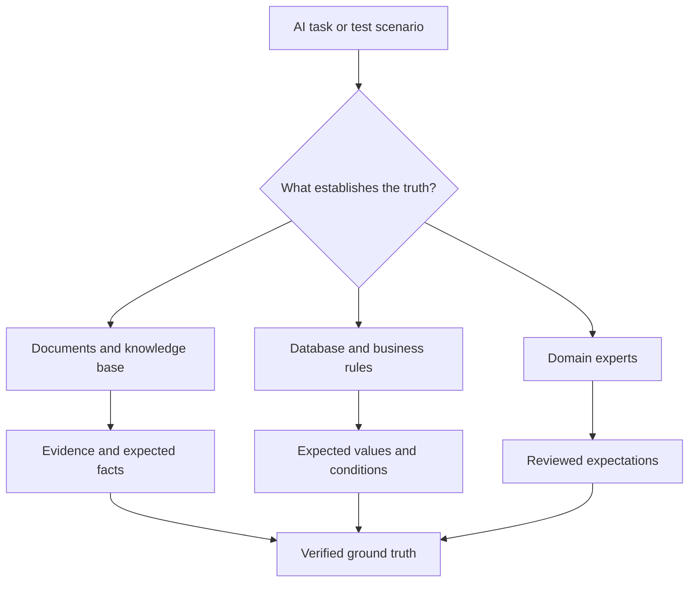
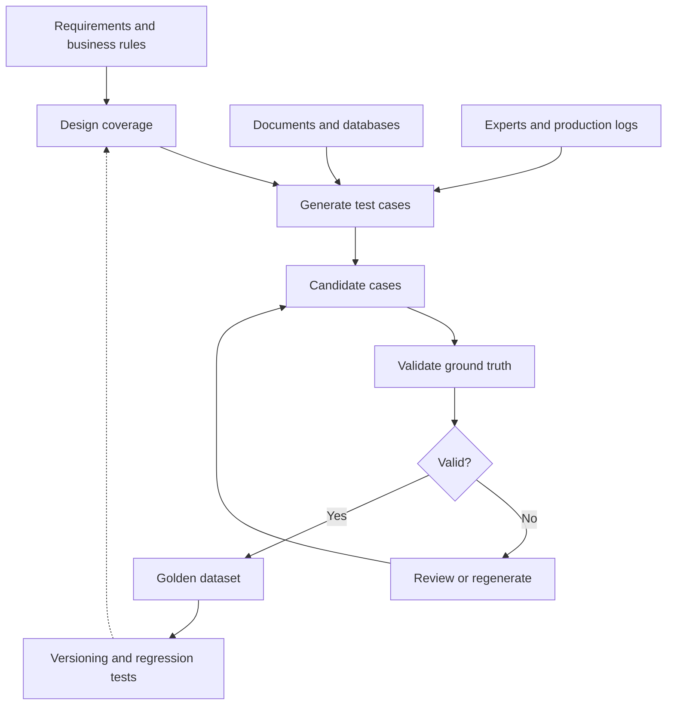

An AI Assistant can give a convincing answer. But before we judge how good that answer is, we need to know what would actually count as **correct**.

## 1. The AI gave an answer, but who decides whether it is right?

Imagine an AI Assistant for a retail store. A manager asks:

> "How much did revenue grow in August compared with July?"

The AI replies: "Revenue rose 15% in August, indicating that business is improving." It sounds plausible. But is the 15% correct? If the number came from a database, we could verify it with an independent SQL query. If it came from a report, we would need to check the report's data and calculation.

Now consider a different question: "Can a customer return a product after seven days?" SQL may not be the source of truth here. The answer depends on the current return policy and its conditions. Saying "yes, in every case" could be wrong even when the seven-day window has not closed.

Finally, a user asks the Assistant to cancel order DH-102. The AI says the cancellation succeeded. Did the order's status actually change? Was it eligible for cancellation in the first place?

These three tasks need three different checks: a calculation, a policy, and a system state. The first problem is not choosing a model to grade the AI. It is deciding **where the right answer comes from and how we can verify it**.

That is the ground-truth problem.

## 2. What does ground truth mean here?

In traditional machine learning, ground truth is often the label or value treated as correct for training or evaluation. For an image classifier, that might be `cat` or `dog`.

For chatbots, RAG systems, and AI Agents, the answer may be less like a single label. A question can have several valid phrasings. An Agent can complete the same task through different valid actions. Sometimes the correct behavior is to ask for clarification or refuse to guess.

These related terms are worth separating:

| Term | Meaning |
| :-- | :-- |
| Test case | One situation the system must handle |
| Test dataset | A collection of situations used for evaluation |
| Ground truth | Verified facts, rules, or outcomes treated as correct |
| Reference answer | A sample answer for comparison, when the task needs one |
| Evaluation oracle | The rule or mechanism that decides whether a result passes |
| Golden dataset | A reviewed set of cases accepted for repeated testing |

For example, a revenue-analysis test case could contain:

| Field | Example |
| :-- | :-- |
| Input | How much did August revenue grow compared with July? |
| Scenario | Sales analytics |
| Ground truth | July: VND 200 million; August: VND 230 million |
| Expected fact | Growth of 15% |
| Source | Database snapshot |
| Expected behavior | State the correct rate and comparison period |

"Up 15%" and "15% higher than July" can both pass. A fluent answer that says 18% cannot. **Ground truth need not be a block of reference text.** It may be a fact, a calculation, evidence, a rule, or an expected system state.

This gives us two distinct jobs:

- **Test-case generation:** create situations we want the AI to handle.
- **Ground-truth construction:** establish and verify the expected facts or outcomes for those situations.

An LLM can generate hundreds of questions. That does not automatically make it the source of truth for their answers.

## 3. Where can ground truth come from?

No source works for every AI system. A chatbot may rely on documents; an analytics Agent may need a database calculation; a workflow Agent may need business rules and a final-state check. One case can require more than one source.



*Figure 1. The source of truth depends on the task. A real test case may combine several sources.*

### 3.1. Human-curated cases: experts define the expected result

The most direct approach is to have people design cases and review their expected outcomes. A policy expert might cover requests to return an unused product after three days, a used product after ten days, or a product whose condition the customer has not described.

This can capture business knowledge that raw data or written policies miss. It is particularly useful for exceptions, subjective judgments, and high-risk actions. The limitation is scale: asking experts to write thousands of cases takes time and still leaves blind spots. A reviewed seed set is often a good starting point, with other methods used to broaden coverage.

### 3.2. Programmatic ground truth: calculate what can be calculated

Suppose a test database contains:

| Month | Revenue |
| :-- | --: |
| July | VND 200 million |
| August | VND 230 million |

The expected growth rate is:

$$
\frac{230-200}{200}\times100=15\%
$$

We can use an independent SQL query, script, or deterministic rule to calculate the expected result. This is especially useful for SQL and analytics Agents, structured extraction, and workflows with explicit conditions.

But a query that runs is not necessarily a correct oracle. It could use the wrong comparison period, include cancelled orders, or apply the wrong definition of revenue. Code makes a check consistent and reproducible; **the business logic behind that code still needs review**.

### 3.3. Document-grounded generation: find facts in evidence

For a question such as "When is a customer eligible for a refund?", the truth may be in the current return and refund policies rather than in SQL. A document-based pipeline can look like this:

**Documents → relevant context → questions → proposed reference facts → evidence validation**

A single-hop question might ask for the return window in one policy. A multi-hop question might ask whether a product returned on time but already used is refundable, requiring several conditions to be combined.

[Ragas](https://docs.ragas.io/en/latest/getstarted/rag_testset_generation/) is one example of a framework for generating RAG testsets from documents. Its pipeline builds and enriches a knowledge graph, then uses query synthesizers to create scenarios and questions, including single-hop and multi-hop variants. This can cover more than one isolated question per document chunk.

However, an LLM can misread the source while drafting a reference answer. Finding a supporting-looking passage is not enough: we must verify that the evidence **actually entails the facts** we put into the ground truth.

## 4. Do we have to write hundreds of test cases by hand?

A few dozen cases may not cover how people really use a system. Users abbreviate, omit context, ask ambiguous questions, or change their minds. Synthetic generation and production data can help, provided we keep case generation separate from truth verification.

### 4.1. LLM-based synthetic generation

Starting from "How much did August revenue grow compared with July?", an LLM might produce:

- "What percentage more did we sell in August than July?"
- "Compare July and August revenue for me."
- "Did August revenue increase, and by how much?"
- "Was August better than the previous month?"

We can also deliberately create boundary cases, such as zero baseline revenue; ambiguous cases with no time period; out-of-scope requests; and adversarial attempts to bypass policy.

[DeepEval's synthetic-data tools](https://deepeval.com/docs/synthetic-data-generation-introduction) can generate candidate goldens from documents, contexts, or existing examples, including conversational scenarios. Its documentation also recommends reviewing generated goldens, especially for high-stakes uses.

The risk is that one LLM creates both the question and answer while another LLM confidently approves the wrong answer. The dataset may look coherent but encode false ground truth. Use code for calculable facts, source evidence for document questions, and expert review for complicated business decisions. Synthetic generation increases **diversity**, not guaranteed **correctness**.

### 4.2. Production-driven cases

Production logs reveal situations the team did not anticipate. A user might ask: "Sales improved this month, so why did profit fall?" That requires distinguishing revenue from profit and checking costs, discounts, or cost of goods sold. If the Assistant fails, that interaction can become a candidate regression test.

But a log shows **what happened**, not what **should have happened**. A user accepting an answer does not prove it was correct; negative feedback does not always mean the facts were wrong. Review the context, determine the expected behavior, and verify it before promoting the case into the golden dataset. Handle sensitive production data appropriately as part of that review.

## 5. For Agents, ground truth may be the final state

An Agent can call tools, update a database, or carry out a multi-step workflow. One reference sentence is rarely enough to establish success.

Consider "Cancel order DH-102." In the test environment, that order has already been delivered. If policy forbids cancelling delivered orders, the Agent should check the status, avoid calling the cancellation API, and explain the applicable next step.

The test needs an initial order state, available tools, business rules, prohibited actions, and acceptable final states. A user simulator can play the customer across several turns and respond according to a defined scenario. Public benchmarks in the [τ-bench family](https://github.com/sierra-research/tau2-bench), including τ²-bench and τ³-bench, illustrate this style of tool-agent-user evaluation.

As [Anthropic's guide to Agent evals](https://www.anthropic.com/engineering/demystifying-evals-for-ai-agents) points out, the Agent's claim that an action succeeded is different from the **outcome** left in the environment. Two Agents may follow different valid tool-call paths and still reach the same correct outcome. Ground truth should therefore specify **required results and constraints**, not merely one example sequence. If a step such as identity verification is mandatory, include it explicitly.

## 6. From candidate cases to a trustworthy golden dataset

A generated question is not automatically a golden case. Whether it comes from an expert, documents, an LLM, or logs, it needs validation along four dimensions.

**Coverage:** Which scenarios and risk levels are represented? A thousand easy revenue questions still miss missing-data cases, zero denominators, and unsupported requests. A coverage matrix helps expose those gaps before we chase a case count.

**Correctness:** Do the expected facts really follow from the source? Check generated answers against evidence, SQL calculations against business definitions, and Agent outcomes against policy. If the information is insufficient, asking for clarification may be the correct expected behavior.

**Consistency:** Do cases contradict one another? A seven-day return window in one case and a fourteen-day window in another may indicate an error or different policy versions. Record the source version and effective date.

**Reproducibility:** Can the test be run again under the same conditions? A live database can change between runs. Use snapshots, fixed time ranges, or resettable test environments where needed.

A golden dataset need not start large. It should make clear what each case tests, how its truth was verified, and how to recreate the situation.

## 7. A practical pipeline for building a golden dataset



*Figure 2. Cases move from requirements and source material through validation before they become reusable regression tests.*

Start with the system's required capabilities, then design coverage by scenario and risk. Generate candidates with the method that fits each task: SQL for numeric facts, documents for RAG questions, or a simulated environment for workflow Agents. Promote a case only after checking evidence, rules, consistency, and required constraints.

One case might be stored like this:

```json
{
  "id": "TC-001",
  "scenario": "sales_growth",
  "input": "How much did August revenue grow compared with July?",
  "ground_truth": {
    "expected_facts": {
      "july_revenue": 200000000,
      "august_revenue": 230000000,
      "growth_percent": 15.0
    },
    "source": "sales_snapshot_v1"
  },
  "expected_behavior": [
    "Report the correct growth percentage",
    "Use the correct comparison period"
  ],
  "review_status": "approved"
}
```

This is an illustrative structure, not the required schema of any framework. The point is to preserve the expected result **and** the source and conditions behind it. When the model, prompt, retrieval logic, or tools change, we can rerun the same cases. When the business rules or data change, the dataset needs review and a new version.

## 8. Which method fits which task?

| Task | Methods to prioritize | What counts as ground truth |
| :-- | :-- | :-- |
| FAQ chatbot | Human-curated, document-grounded | Expected facts and policies |
| RAG chatbot | Document-grounded, synthetic generation | Evidence and reference facts |
| SQL or analytics Agent | Programmatic checks, expert review | Calculated values and query results |
| Customer-support Agent | Production cases, scenario simulation | Business rules and expected outcomes |
| Multi-Agent workflow | Simulation, programmatic validation | Final state and mandatory constraints |
| Report or insight generator | Database facts, document evidence, expert review | Facts, coverage, and expected findings |

Real systems often combine these methods. A sales Assistant might use SQL for numbers, policy documents for eligibility rules, and an LLM for question variants. Later, production logs can expose new cases. The goal is not to hand the entire job to one dataset tool. It is to keep the **source of truth**, the **case generator**, and the **verification mechanism** distinct.

## 9. The test dataset needs to earn our trust

AI evaluation often starts with metrics such as accuracy, faithfulness, or answer relevancy. A more basic question comes first: **What evidence tells us whether the AI was right or wrong?**

A trustworthy golden dataset is more than questions paired with sample answers. It reflects tasks the system actually faces, identifies where its expected facts and outcomes came from, and makes those expectations verifiable. Expert curation, document-grounded generation, programmatic checks, synthetic variants, production cases, and simulation each solve a different part of that problem.

Do not ask only how to generate more test cases. Ask how we know they test the **right thing**. Once the dataset is sound, we can choose appropriate graders: reference comparisons, code checks, LLM-as-a-Judge, or evaluation of an Agent's actions and final state. That is the next layer of a complete AI evaluation system.

## References and further reading

1. [Ragas - Testset Generation for RAG](https://docs.ragas.io/en/latest/getstarted/rag_testset_generation/) - document-based testset generation with a knowledge graph and query synthesizers.
2. [DeepEval - Synthetic Data Generation](https://deepeval.com/docs/synthetic-data-generation-introduction) - candidate goldens from documents and examples, plus conversational simulation.
3. [OpenAI - Evaluation Best Practices](https://developers.openai.com/api/docs/guides/evaluation-best-practices) - task-specific datasets, human review, and continuous evaluation.
4. [Anthropic - Demystifying Evals for AI Agents](https://www.anthropic.com/engineering/demystifying-evals-for-ai-agents) - tasks, graders, traces, outcomes, and evaluation environments.
5. [Sierra Research - τ-bench family](https://github.com/sierra-research/tau2-bench) - public tool-agent-user benchmarks and simulated tasks.
6. [DeepEval - Evaluation Datasets](https://deepeval.com/docs/evaluation-datasets) - organizing and reusing goldens across evaluations.
