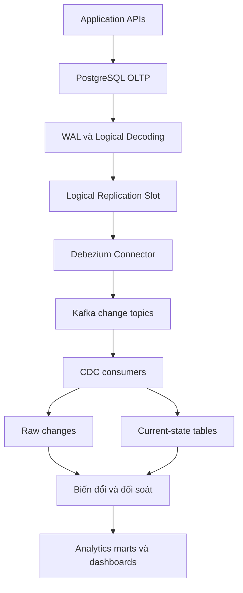
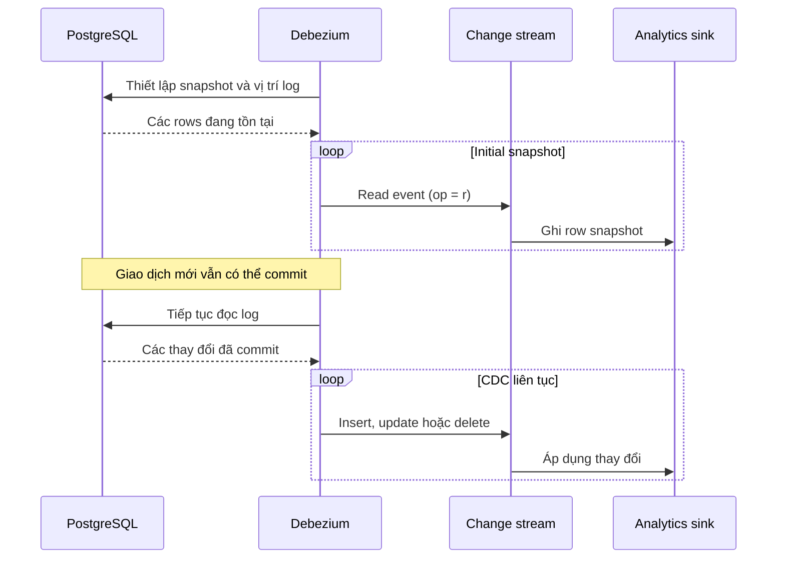

*Một đơn hàng vừa được thanh toán trong PostgreSQL. Làm sao hệ thống Analytics biết điều đó nhanh chóng mà không phải liên tục chạy `SELECT` để hỏi dữ liệu nào đã thay đổi?*

## 1. Khi Data Pipeline chậm hơn hoạt động kinh doanh

Trong [bài OLTP vs OLAP](../oltp-vs-olap-analytics-and-transactional-databases-vi/), chúng ta đã tách xử lý giao dịch khỏi phân tích. PostgreSQL vẫn quản lý đơn hàng và thanh toán; một hệ thống khác phục vụ báo cáo. Vấn đề tiếp theo là chuyển dữ liệu giữa hai nơi.

Cách đầu tiên có thể là một job chạy theo lịch:

```sql
SELECT *
FROM orders
WHERE created_at > :last_sync_time;
```

Nó tìm được đơn mới, nhưng bỏ sót đơn tạo hôm qua vừa hoàn tiền hôm nay và không thể thấy row đã bị xóa vật lý. Chuyển sang `updated_at` bắt được nhiều lần cập nhật hơn nếu mọi thao tác ghi đều duy trì cột đó, nhưng vẫn bỏ sót hard delete. Ranh giới timestamp, phân trang, checkpoint và thời điểm commit cũng cần xử lý cẩn thận. Càng nhiều bảng và polling jobs, database giao dịch càng chịu thêm tải đọc.

Thay vì liên tục hỏi "Có gì đổi chưa?", ta muốn nhận luồng thông tin "Đây là những thay đổi đã commit." Đó là ý tưởng của **Change Data Capture (CDC)**.

## 2. CDC thu thập điều gì?

CDC thu thập những thay đổi ở nguồn, thường là `INSERT`, `UPDATE` và `DELETE`, rồi đưa chúng đến các hệ thống phía sau. Một đơn hàng có thể chuyển từ `pending` sang `paid`, rồi thành `refunded`. Pipeline log-based có thể quan sát từng thay đổi thay vì suy luận từ những lần nhìn trạng thái hiện tại theo lịch.

| Câu hỏi | Polling theo timestamp | Log-based CDC |
| :--- | :--- | :--- |
| Phát hiện thay đổi bằng cách nào? | Query lặp lại | Đọc transaction log đã giải mã |
| Xóa vật lý? | Cần cơ chế bổ sung | Có thể phát delete event |
| Độ mới | Phụ thuộc lịch | Có thể gần realtime |
| Chi phí phía nguồn | Các Query lặp lại | WAL, logical decoding, replication overhead |
| Vận hành | Jobs và checkpoints | Connector, offsets, slots, lag, recovery |

CDC không miễn phí và không phải lúc nào cũng tốt hơn. Một báo cáo cập nhật hằng ngày với ít dữ liệu có thể dùng batch đơn giản. CDC hấp dẫn hơn khi cập nhật và xóa dữ liệu đều quan trọng, yêu cầu freshness cao hoặc nhiều consumers cần cùng một change feed. Nó giúp tránh *polling liên tục*, chứ không xóa bỏ nhu cầu nạp dữ liệu ban đầu hay đối soát định kỳ.

## 3. WAL, Logical Decoding, Replication Slot và LSN

**Write-Ahead Log (WAL)** là một phần trong cơ chế độ bền và phục hồi của PostgreSQL. Thay đổi được ghi log trước khi các data pages tương ứng được ghi xuống theo quy trình lưu trữ. WAL không phải sẵn một luồng JSON business events; nó được thiết kế cho database engine.

**Logical Decoding** chuyển thông tin từ WAL thành luồng thay đổi dữ liệu ở mức logic thông qua output plugin. PostgreSQL cung cấp `pgoutput`; connector như Debezium có thể sử dụng nó để nhận thay đổi của các bảng được cấu hình. Khả năng lấy giá trị cũ của row khi update/delete phụ thuộc vào replica identity.

**LSN** (Log Sequence Number) chỉ vị trí trong WAL. **Replication Slot** theo dõi WAL mà consumer có thể vẫn cần và tiến độ đã xác nhận. Nếu Connector dừng, Slot có thể giúp nó tiếp tục từ vị trí thích hợp. Đổi lại, Slot bị kẹt có thể khiến PostgreSQL phải giữ WAL lâu hơn, làm dung lượng lưu trữ tăng mạnh.

## 4. Từ PostgreSQL đến Analytical Model

Một kiến trúc có thể dùng Debezium và Kafka:



PostgreSQL vẫn là nguồn vận hành. Debezium giải mã các thay đổi đã commit thành events có cấu trúc; Kafka có thể phân phối và lưu chúng theo cấu hình. Consumers tạo raw history, current-state tables hoặc cả hai. Sau đó các phép biến đổi áp dụng định nghĩa nghiệp vụ để tạo báo cáo.

Kafka là **một cách triển khai, không phải điều kiện bắt buộc để có CDC**. Quan trọng hơn, đưa thay đổi của row lên topic không tự tính được doanh thu hay lợi nhuận. CDC chuyển thay đổi; Data Modeling mới tạo ý nghĩa cho chúng.

## 5. Một change event trông như thế nào?

Nếu `ORD-1001` đổi từ `pending` sang `paid`, một envelope giản lược theo kiểu Debezium có thể trông như sau:

```json
{
  "before": { "id": "ORD-1001", "status": "pending" },
  "after": { "id": "ORD-1001", "status": "paid" },
  "source": {
    "db": "retail",
    "schema": "public",
    "table": "orders",
    "lsn": 12345678
  },
  "op": "u"
}
```

Đây chỉ là **minh họa**, không phải payload được bảo đảm: envelope và cách biểu diễn thật phụ thuộc Connector và converter. `before` có thể thiếu hoặc không đầy đủ. Debezium thường dùng `c` cho create, `u` cho update, `d` cho delete và `r` cho snapshot read.

**Replica Identity** trong PostgreSQL quyết định giá trị cũ nào có thể được cung cấp cho update/delete. Khi bảng có Primary Key, identity mặc định thường đủ thông tin nhận diện row nhưng không nhất thiết có toàn bộ row cũ. Nếu cần đầy đủ giá trị trước khi đổi, có thể cân nhắc:

```sql
ALTER TABLE orders REPLICA IDENTITY FULL;
```

Cách này có thể làm tăng WAL và chi phí; không nên bật cho mọi bảng theo mặc định. Với nhiều current-state sinks, khóa định danh và dữ liệu `after` đã đủ.

## 6. Dữ liệu cũ cần được Snapshot

Giả sử PostgreSQL đã có 20 triệu đơn hàng khi ta mới triển khai CDC. WAL không phải kho lưu vô hạn toàn bộ lịch sử từ ngày hệ thống bắt đầu. Chỉ stream thay đổi mới thì Analytics Sink không có những rows đang tồn tại.

Debezium có thể tạo **Initial Snapshot** cho các bảng cần đồng bộ, rồi tiếp tục đọc từ vị trí log đã được phối hợp:



Snapshot và vị trí WAL phải được phối hợp để các writes phát sinh trong lúc snapshot chạy không bị bỏ qua. Consumers vẫn phải xử lý snapshot records, khả năng event bị phát lại và thứ tự áp dụng. Connector hoàn thành snapshot không có nghĩa mọi Analytical Model đã được đối soát và công bố.

Debezium còn hỗ trợ **Incremental Snapshot**, đọc bảng theo từng chunks trong khi luồng thay đổi tiếp tục chạy. Cơ chế xử lý va chạm giúp tránh row snapshot cũ ghi đè thay đổi mới trong những trường hợp được hỗ trợ. Nếu tự viết backfill, cần chủ động xử lý cuộc đua này.

## 7. CDC không tự bảo đảm Exactly-once cho toàn pipeline

Giả sử event `pending` sang `paid` được Connector phát hoặc Consumer áp dụng, rồi tiến trình gặp lỗi trước khi offset hay tiến độ được lưu bền vững. Khi khôi phục, event đã từng thấy có thể xuất hiện lại.

**At-most-once** có nguy cơ mất event; **at-least-once** có thể phát lại; **exactly-once** chỉ có ý nghĩa trong ranh giới và cơ chế được định nghĩa cụ thể. Bảo đảm trong Kafka hoặc stream processor không tự động bao trùm một Analytics Database bên ngoài.

Consumer sau không an toàn khi event lặp lại:

```python
daily_revenue += order_amount
```

Xử lý một thay đổi thanh toán hai lần sẽ cộng gấp đôi. Current-state sink có thể UPSERT theo Primary Key, đồng thời kiểm tra source position hoặc version để event cũ không ghi đè event mới. Với aggregates cộng dồn, hãy ghi nhận event identity thích hợp và cập nhật tổng trong cùng Transaction của sink, hoặc dùng thiết kế deduplication tương đương. **Đừng mặc định một LSN riêng lẻ là event ID duy nhất cho mọi connector, bảng, snapshot và Transaction.**

**CDC cung cấp các thay đổi; Consumer phải biến chúng thành trạng thái đúng ở hệ thống đích.**

## 8. Thứ tự, UPDATE và DELETE

### Thứ tự chỉ được bảo đảm trong phạm vi nhất định

Đơn hàng đi qua `pending -> paid -> refunded`. Nếu Sink áp dụng `refunded` rồi bị event `paid` cũ ghi đè, báo cáo sẽ sai. Kafka bảo đảm thứ tự **trong một partition**, không phải thứ tự toàn cục giữa mọi partitions. Dùng key ổn định như `order_id` có thể đưa events của cùng đơn vào cùng partition khi cấu hình phù hợp. Nó không tạo thứ tự toàn cục giữa các bảng hay topics.

Một Transaction nguồn có thể sửa cả `orders` và `payments`; Consumers của hai topics có thể thấy chúng ở những thời điểm khác nhau. Debezium có thể cung cấp transaction metadata nếu được cấu hình, nhưng Consumer phải thiết kế cách dùng nó.

### UPDATE không phải lần bán mới

Nếu đơn đã thanh toán rồi hoàn tiền, cộng nguyên giá trị đơn vào tổng sau *mỗi* update là sai. Có thể duy trì current-state table rồi tính lại các aggregates bị ảnh hưởng, hoặc tính delta đã định nghĩa rõ giữa trạng thái trước và sau. Khoản hoàn tiền điều chỉnh kỳ bán ban đầu hay ghi ở kỳ hoàn tiền là **business rule**, không phải một setting của CDC.

### DELETE không luôn là business event

Xóa vật lý ở nguồn có thể tạo delete event và, trong cấu hình Kafka dùng compaction, thêm tombstone có value bằng `null`. Nhưng sản phẩm chuyển sang `inactive` là update, không phải xóa vật lý. Đơn hàng bị hủy vẫn có thể cần lưu dấu vết trong báo cáo. Hãy quyết định mỗi thao tác ảnh hưởng thế nào tới current-state và historical models.

Tương tự, `UPDATE status = 'paid'` là thay đổi row; business event `OrderPaid` có thể yêu cầu bằng chứng mạnh hơn rằng thanh toán đã được xác nhận. Nếu downstream cần business events rõ nghĩa, [Transactional Outbox](https://debezium.io/documentation/reference/stable/transformations/outbox-event-router.html) có thể phù hợp hơn việc suy diễn mọi semantics từ raw table changes.

## 9. Raw Changes chưa phải Business Metrics

Debezium có thể đồng bộ `orders`, `order_items` và `payments` rất nhanh, nhưng vẫn chưa trả lời được "Doanh thu tháng 8 là bao nhiêu?" nếu thiếu quy tắc về status, giảm giá, hoàn tiền, múi giờ và điều chỉnh lịch sử.

| Lớp logic | Trách nhiệm |
| :--- | :--- |
| Raw changes | Lưu thay đổi nguồn và metadata theo chính sách retention rõ ràng. |
| Current state hoặc staging | Duy trì trạng thái entity có thể dùng hoặc dữ liệu đã chuẩn hóa. |
| Analytical models hoặc marts | Áp dụng business rules, tạo facts, dimensions và metrics. |

Ba lớp này không nhất thiết là ba hệ thống vật lý riêng. Chúng phân chia trách nhiệm. Pipeline có thể **đúng về CDC** nhưng **sai về metrics** do transformations sai. Cả hai cần được kiểm chứng riêng.

## 10. Rủi ro vận hành: Slot bị kẹt và WAL Retention

Nếu Debezium dừng trong khi PostgreSQL tiếp tục xử lý Transactions, Logical Slot có thể giữ WAL mà Connector còn cần. Với database bận rộn, lượng WAL giữ lại có thể lớn đến mức đe dọa dung lượng disk. Vì vậy không thể chỉ nhìn trạng thái `RUNNING` của Connector.

```sql
SELECT
    slot_name,
    active,
    restart_lsn,
    confirmed_flush_lsn,
    wal_status
FROM pg_replication_slots
WHERE slot_type = 'logical';
```

`restart_lsn` liên quan đến WAL cũ nhất có thể vẫn cần; `confirmed_flush_lsn` thể hiện tiến độ Logical Consumer đã xác nhận. Không trường nào riêng lẻ cho biết độ mới cuối cùng của dashboard. Hãy theo dõi kết hợp Slot Status, WAL Retention, dung lượng disk, tiến độ Connector và Consumer Lag.

PostgreSQL có thể giới hạn WAL do slots giữ bằng `max_slot_wal_keep_size`. Cách này bảo vệ storage nhưng có giá: nếu WAL cần thiết đã bị xóa, Slot có thể không dùng được và Connector cần resnapshot hoặc phương án recovery khác. Debezium heartbeats có thể giúp trong một số cấu hình mà xác nhận tiến độ chậm. Cấu hình và kế hoạch phục hồi là quyết định vận hành, không phải các mặc định nên sao chép máy móc.

## 11. Schema Evolution và Backfill

Thêm `promotion_code` vào `orders` có thể là migration đơn giản cho ứng dụng, nhưng lại làm một Consumer đang kỳ vọng schema cứng bị lỗi. Hãy thay đổi Producers và Consumers theo nguyên tắc tương thích. Schema Registry có thể giúp quản lý quy tắc cấu trúc với Avro hoặc Protobuf, nhưng không thể nhận ra một cột giữ nguyên tên mà đổi ý nghĩa nghiệp vụ.

Giả sử công thức xử lý hoàn tiền của dashboard sai suốt sáu tháng. Các CDC events mới sẽ không sửa dữ liệu lịch sử đã công bố. Ta cần **Backfill** từ raw data còn lưu đủ hoặc nguồn có thẩm quyền khác. Trong lúc Backfill chạy, thay đổi mới vẫn đến. Nếu không có chiến lược version, watermark, thay thế partition hoặc cutover, row cũ do Backfill ghi có thể đè lên Current State mới. Backfill là bài toán phối hợp với hệ thống đang chạy, không chỉ là chạy lại câu SQL cũ.

## 12. Làm sao biết Pipeline đang đúng?

Connector báo `RUNNING` không chứng minh dashboard chính xác. Hãy theo dõi toàn đường đi:

- Độ trễ từ nguồn đến Connector, tình trạng Slot và lượng WAL giữ lại.
- Topic backlog và Consumer Lag.
- End-to-end Freshness ở Sink và Dashboard, kể cả tuổi của cache.
- Events trùng, records lỗi, dead-letter events, tiến độ Snapshot/Backfill.
- Đối soát records và aggregates của hệ thống đích với nguồn trong **cùng kỳ dữ liệu và cùng business rules**.

Chủ động thử lỗi trong môi trường cách ly: Connector restart, Broker ngừng, Consumer xử lý lại, Update liên tiếp, Delete, Schema Change và ghi dữ liệu trong lúc Snapshot hoặc Backfill. Event mới có timestamp gần hiện tại không chứng minh mọi record cũ đã đến. Có thể cần Watermark hoặc Completion State trước khi công bố số liệu của một kỳ.

## 13. CDC, Batch hay kết hợp cả hai?

| Quyết định | Batch Pipeline | Log-based CDC |
| :--- | :--- | :--- |
| Phù hợp | Báo cáo định kỳ, dữ liệu vừa phải | Thay đổi thường xuyên, deletes, nhiều consumers |
| Freshness | Theo lịch | Có thể gần realtime |
| Tải nguồn | Query theo lịch | Logical replication overhead |
| Vận hành | Jobs, checkpoints, retries | Slots, offsets, lag, retries, recovery |
| Phục hồi lịch sử | Source history hoặc snapshots | Events còn lưu và kế hoạch Snapshot/Backfill |

Không nhất thiết chọn một trong hai. CDC có thể giữ Current State tương đối mới; Batch có thể đối soát, Backfill hoặc chốt báo cáo tài chính sau khi các điều chỉnh được xác nhận. Một báo cáo ngày với ít dữ liệu không cần Debezium và Kafka chỉ vì streaming đang tồn tại.

## 14. Đích đến mới là bài kiểm tra thực sự

PostgreSQL WAL và Logical Decoding làm thay đổi đã commit có thể được trích xuất; Debezium chuyển chúng thành events; Snapshot cung cấp dữ liệu ban đầu; Slots theo dõi tiến độ. Nhưng một pipeline đáng tin còn phải xử lý phát lại, thứ tự, Deletes, Schema Changes, Backfill, WAL Retention và recovery.

Quan trọng hơn, CDC không biến raw order updates thành Business Metrics đúng. Việc đó vẫn cần Data Modeling, quy tắc rõ ràng, đối soát và công bố độ mới dữ liệu trung thực.

**Data Pipeline đáng tin không chỉ chuyển được thay đổi mới. Nó phải giữ được ý nghĩa của thay đổi và tạo trạng thái đích đúng trong khi nguồn vẫn tiếp tục thay đổi.**

## References và tài liệu đọc thêm

- [PostgreSQL: Logical Decoding](https://www.postgresql.org/docs/current/logicaldecoding.html)
- [PostgreSQL: Logical Replication](https://www.postgresql.org/docs/current/logical-replication.html)
- [PostgreSQL: WAL Configuration](https://www.postgresql.org/docs/current/runtime-config-wal.html)
- [PostgreSQL: pg_replication_slots](https://www.postgresql.org/docs/current/view-pg-replication-slots.html)
- [Debezium: PostgreSQL Connector](https://debezium.io/documentation/reference/stable/connectors/postgresql.html)
- [Debezium: Outbox Event Router](https://debezium.io/documentation/reference/stable/transformations/outbox-event-router.html)
- [Debezium: Architecture](https://debezium.io/documentation/reference/stable/architecture.html)
- [Apache Kafka: Documentation](https://kafka.apache.org/documentation/)
