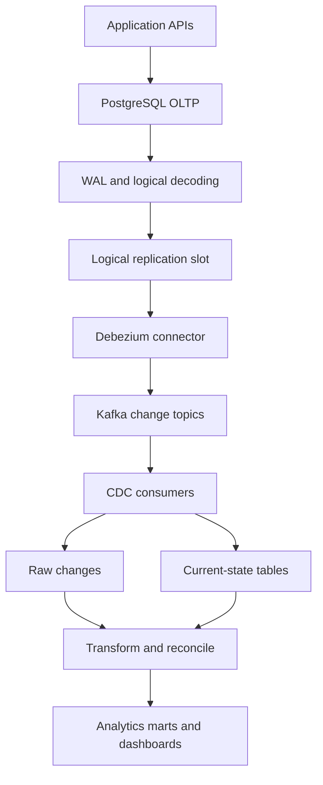
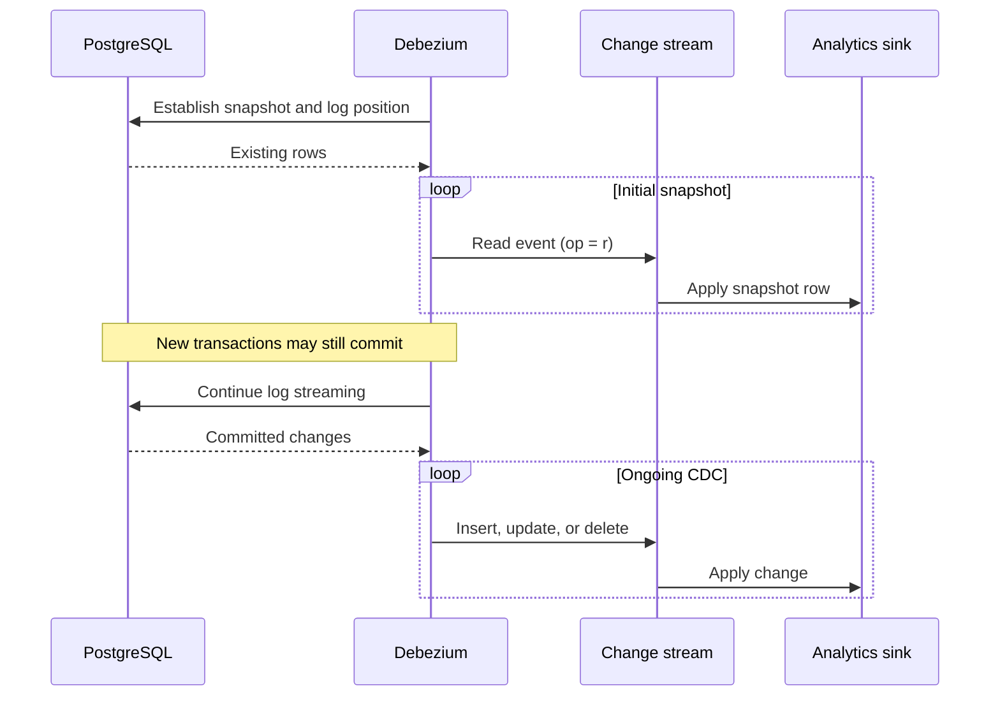

*An order has just been paid in PostgreSQL. How can the analytics system learn about it quickly without repeatedly running `SELECT` to ask what changed?*

## 1. When the pipeline falls behind the business

In the [OLTP vs OLAP article](../oltp-vs-olap-analytics-and-transactional-databases/), we separated transaction processing from analytics. PostgreSQL still handles orders and payments; another system serves reports. Now the data needs to move between them.

A first attempt is a scheduled query:

```sql
SELECT *
FROM orders
WHERE created_at > :last_sync_time;
```

It finds new orders but misses an older order refunded today and cannot see a row physically deleted from the source. Switching to `updated_at` catches more updates, provided every relevant write maintains that column, but still misses hard deletes. Timestamp boundaries, pagination, checkpoints, and transaction timing also need care. As the number of tables and polling jobs grows, repeated reads add load to the transactional database.

Instead of asking, "Has anything changed yet?", we would like a stream saying, "These changes were committed." That is the idea behind **Change Data Capture (CDC)**.

## 2. What CDC captures

CDC collects source changes, typically `INSERT`, `UPDATE`, and `DELETE`, and delivers them to downstream systems. An order might move from `pending` to `paid` and later to `refunded`. A log-based pipeline can observe each change rather than infer it from occasional snapshots of current state.

| Question | Timestamp polling | Log-based CDC |
| :--- | :--- | :--- |
| How are changes found? | Repeated queries | Decoded transaction log |
| Physical deletes? | Need an extra mechanism | Delete change can be emitted |
| Typical freshness | Depends on schedule | Can be near real time |
| Source cost | Repeated queries | WAL, logical decoding, replication overhead |
| Operations | Jobs and checkpoints | Connector, offsets, slots, lag, recovery |

CDC is not free, and it is not always preferable. A small daily report may be simpler as a batch job. CDC becomes more compelling when updates and deletes matter, freshness requirements are tighter, or several consumers need a change feed. It can avoid *repeated full polling*, not the need for an initial data load or occasional reconciliation.

## 3. WAL, logical decoding, slots, and LSNs

PostgreSQL's **write-ahead log (WAL)** is part of its durability and recovery design. Changes are logged before the corresponding data pages are written through the storage process. WAL is not a ready-made JSON stream of business events; it is designed for the database engine.

**Logical decoding** converts WAL information into a stream of logical data changes using an output plugin. PostgreSQL provides `pgoutput`; a connector such as Debezium can use it to receive configured table changes. The availability of old row values on updates and deletes depends on replica identity.

An **LSN** (Log Sequence Number) identifies a WAL position. A **replication slot** tracks what WAL a consumer may still need and the progress it has acknowledged. If a connector stops, the slot can help it resume from an appropriate position. The tradeoff is serious: a stalled slot can cause WAL to be retained and storage use to grow.

## 4. From PostgreSQL to an analytics model

One possible architecture uses Debezium and Kafka:



PostgreSQL remains the operational source. Debezium decodes committed changes and publishes structured events; Kafka can distribute and retain them according to its configuration. Consumers build raw history, current-state tables, or both. Transformations then apply business definitions to produce reports.

Kafka is **one deployment option, not a requirement of CDC**. More importantly, getting a row change into a topic does not automatically compute revenue or profit. CDC carries changes; analytical modeling gives them meaning.

## 5. What does a change event look like?

If `ORD-1001` changes from `pending` to `paid`, a simplified Debezium-style envelope might look like this:

```json
{
  "before": { "id": "ORD-1001", "status": "pending" },
  "after": { "id": "ORD-1001", "status": "paid" },
  "source": {
    "db": "retail",
    "schema": "public",
    "table": "orders",
    "lsn": 12345678
  },
  "op": "u"
}
```

This is an **illustration**, not a guaranteed payload: the real envelope and representation depend on connector and converter settings. `before` may be absent or incomplete. Debezium commonly uses `c` for create, `u` for update, `d` for delete, and `r` for snapshot read.

PostgreSQL's **replica identity** determines which old values are available for an update or delete. With a primary key, the default identity commonly supplies identifying key information, not necessarily a complete old row. If full previous values are essential, `REPLICA IDENTITY FULL` can be considered:

```sql
ALTER TABLE orders REPLICA IDENTITY FULL;
```

That can increase WAL volume and overhead; do not enable it on every table by default. For many current-state sinks, the key and the `after` state are enough.

## 6. Existing data needs a snapshot

Suppose PostgreSQL already contains 20 million orders when CDC is introduced. WAL is not an infinite archive of the database's entire history. Streaming only new changes leaves the analytics sink without the existing rows.

Debezium can take an **initial snapshot** of the selected tables and then continue from a coordinated log position:



The snapshot and WAL position must be coordinated so writes occurring during the snapshot are not silently skipped. Consumers still need to handle snapshot records, possible replays, and ordering correctly. A completed connector snapshot does not mean all analytical models have been reconciled and published.

Debezium also supports **incremental snapshots**, which read a table in chunks while change streaming continues. Its collision-handling mechanisms help avoid an older snapshot row overriding a newer streamed change in supported cases. If building a custom backfill, this race needs deliberate handling.

## 7. CDC is not an end-to-end exactly-once guarantee

Consider a `pending` to `paid` event. A connector publishes it, or a consumer applies it, and then a process crashes before its offset or progress is durably recorded. On recovery, an already-seen event may appear again.

**At-most-once** delivery risks loss; **at-least-once** delivery may repeat; **exactly-once** is meaningful only for a specifically defined boundary and mechanism. A guarantee within Kafka or a stream processor does not automatically cover a separate analytics database.

This consumer is unsafe under replay:

```python
daily_revenue += order_amount
```

Processing the same payment change twice doubles the amount. A current-state sink can instead upsert by primary key, while checking source position or version so an older event cannot overwrite a newer one. For additive aggregates, record an appropriate event identity and the aggregate update atomically in the sink, or use an equivalent deduplication design. Do **not** assume a single LSN is a universally unique event ID across connectors, tables, snapshots, and transactions.

**CDC supplies changes; consumers are responsible for turning them into correct destination state.**

## 8. Ordering, updates, and deletes

### Ordering is scoped

An order moves `pending -> paid -> refunded`. If a sink applies `refunded` and later overwrites it with an older `paid` event, analytics is wrong. Kafka preserves order **within a partition**, not globally across all partitions. Using a stable key such as `order_id` can keep one order's events together when partitioning is configured accordingly. It does not create global ordering across tables or topics.

A source transaction may change both `orders` and `payments`; consumers of two topics may see them at different times. Debezium can provide transaction metadata when configured, but consumers must decide how to use it.

### An update is not a second sale

If an order is paid and later refunded, adding its full value to a running total after each update is wrong. Maintain a current-state table and recompute affected aggregates, or calculate a well-defined delta between previous and new states. Whether a refund adjusts the original sales period or the refund period is a **business rule**, not a CDC setting.

### A delete is not always a business event

A physical source delete can yield a delete event and, with Kafka compaction configurations, an additional null-valued tombstone. A product marked `inactive`, however, is an update, not a physical delete. An order cancellation may need to remain in analytical history. Decide how each operation should affect current-state and historical models.

Likewise, `UPDATE status = 'paid'` is a row change; an `OrderPaid` business event may require stronger evidence that payment was confirmed. If downstream systems need explicit business events, a [transactional outbox](https://debezium.io/documentation/reference/stable/transformations/outbox-event-router.html) may express them more clearly than inferring all semantics from raw table changes.

## 9. Raw changes are not business metrics

Debezium can synchronize `orders`, `order_items`, and `payments` quickly, yet still cannot answer "What was August revenue?" without rules about status, discounts, refunds, time zones, and historical adjustments.

| Logical layer | Responsibility |
| :--- | :--- |
| Raw changes | Preserve source changes and metadata within a defined retention policy. |
| Current state or staging | Maintain usable entity state or normalized records. |
| Analytical models or marts | Apply business rules and publish facts, dimensions, and metrics. |

These need not be three separate physical systems. They separate responsibilities. A pipeline may be **CDC-correct** yet **metric-wrong** because its transformation rules are wrong. Both need their own validation.

## 10. The operational risk: stalled slots and WAL retention

If Debezium stops while PostgreSQL keeps processing transactions, the logical slot may retain WAL needed by the connector. On a busy source, retained WAL can grow enough to threaten disk capacity. Monitor the source, not just the connector's `RUNNING` state.

```sql
SELECT
    slot_name,
    active,
    restart_lsn,
    confirmed_flush_lsn,
    wal_status
FROM pg_replication_slots
WHERE slot_type = 'logical';
```

`restart_lsn` relates to the oldest WAL that might still be needed; `confirmed_flush_lsn` reflects progress acknowledged by a logical consumer. Neither number alone is the end-to-end freshness of the analytics dashboard. Monitor slot status, WAL retention, source disk usage, connector progress, and downstream consumer lag together.

PostgreSQL can limit slot-retained WAL with `max_slot_wal_keep_size`. That protects storage at a cost: if required WAL is removed, the slot may become unusable and the connector may need resnapshotting or another recovery path. Debezium heartbeats can help in some configurations where progress acknowledgements would otherwise lag. The settings and recovery plan are operational decisions, not defaults to copy blindly.

## 11. Schema evolution and backfills

Adding `promotion_code` to `orders` may be a simple application migration but a breaking event-schema change for a rigid consumer. Evolve producers and consumers with compatibility in mind; a schema registry can help enforce structural rules for formats such as Avro or Protobuf. It cannot detect that an unchanged column name has acquired a new business meaning.

Suppose the dashboard's refund formula was wrong for six months. New CDC events will not fix already-published history. You need a **backfill** from adequately retained raw data or another authoritative source. While it runs, live changes continue arriving. Without a version, watermark, partition-replacement, or cutover strategy, an old backfill row can overwrite a newer current-state row. Backfill is a coordination problem, not merely rerunning an old SQL query.

## 12. How to know the pipeline is correct

A connector reporting `RUNNING` is not proof that the dashboard is accurate. Observe the whole path:

- Source-to-connector lag, slot state, and retained WAL.
- Topic backlog and consumer lag.
- End-to-end freshness at the sink and at the dashboard, including cache age.
- Duplicate or failed records, dead-letter events, and snapshot/backfill progress.
- Reconciliation of destination records and aggregates against source data under the **same time window and business rules**.

Test failures deliberately in isolation: connector restart, broker outage, consumer replay, repeated updates, deletes, schema changes, and writes during a snapshot or backfill. A recent event timestamp does not prove every earlier record has arrived. Watermarks or completion states may be needed before publishing a period's numbers.

## 13. CDC, batch, or both?

| Decision | Batch pipeline | Log-based CDC |
| :--- | :--- | :--- |
| Good fit | Periodic reports, modest volume | Frequent changes, deletes, multiple consumers |
| Freshness | Scheduled | Potentially near real time |
| Source work | Scheduled queries | Logical replication overhead |
| Operations | Jobs, checkpoints, retries | Slots, offsets, lag, retries, recovery |
| Historical recovery | Source history or snapshots | Retained events plus snapshot/backfill plan |

The choice is not exclusive. CDC can keep current-state data fresh; batch can reconcile, backfill, or close a financial period after adjustments are confirmed. A daily report with little data does not need Debezium and Kafka merely because streaming exists.

## 14. The destination is the real test

PostgreSQL WAL and logical decoding make committed changes available; Debezium can turn them into events; snapshots provide an initial state; slots allow progress tracking. But a dependable pipeline must also deal with replays, ordering, deletes, schema changes, backfills, WAL retention, and recovery.

Most importantly, CDC does not turn raw order updates into correct business metrics. That still requires data modeling, clear rules, reconciliation, and honest freshness reporting.

**A reliable data pipeline does more than carry new changes. It preserves their meaning and produces a correct destination state while the source keeps changing.**

## References and further reading

- [PostgreSQL: Logical Decoding](https://www.postgresql.org/docs/current/logicaldecoding.html)
- [PostgreSQL: Logical Replication](https://www.postgresql.org/docs/current/logical-replication.html)
- [PostgreSQL: WAL Configuration](https://www.postgresql.org/docs/current/runtime-config-wal.html)
- [PostgreSQL: pg_replication_slots](https://www.postgresql.org/docs/current/view-pg-replication-slots.html)
- [Debezium: PostgreSQL Connector](https://debezium.io/documentation/reference/stable/connectors/postgresql.html)
- [Debezium: Outbox Event Router](https://debezium.io/documentation/reference/stable/transformations/outbox-event-router.html)
- [Debezium: Architecture](https://debezium.io/documentation/reference/stable/architecture.html)
- [Apache Kafka: Documentation](https://kafka.apache.org/documentation/)
