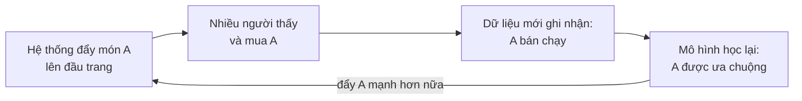
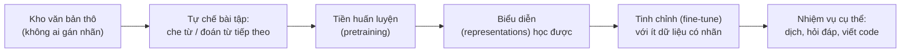
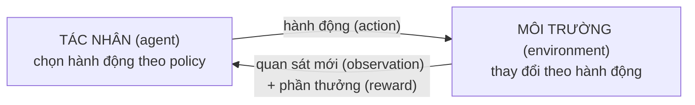
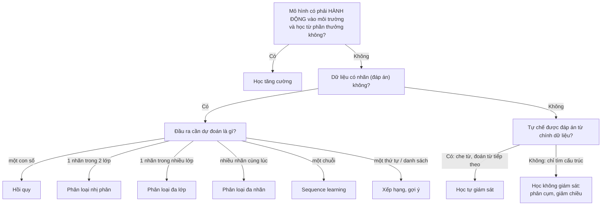

> **Mục tiêu bài học:** Sau bài này, bạn sẽ nhận diện được các dạng bài toán machine learning thường gặp - hồi quy, phân loại (nhị phân / đa lớp / đa nhãn), sequence learning, tìm kiếm - gợi ý, học không giám sát, tự giám sát và học tăng cường - và biết một bài toán thực tế nên được "đóng khung" theo dạng nào.

## 1. Một buổi tối, năm bài toán machine learning

Buổi tối, bạn cầm điện thoại lên:

- Gõ vài chữ vào ô tìm kiếm → máy phải **xếp hạng** hàng triệu trang web xem trang nào đáng đứng đầu.
- Mở app xem phim → hệ thống **gợi ý** phim theo lịch sử xem của riêng bạn.
- Nhắn tin, bàn phím **đoán từ tiếp theo** bạn định gõ.
- Một email lạ bị tự động ném vào mục spam → máy vừa **phân loại**.
- App thời tiết báo "ngày mai mưa 12mm" → máy vừa **dự đoán một con số**.

Năm hành vi, năm *dạng bài toán* khác nhau. Bài 01 đã phát cho bạn tấm bản đồ tổng quát (có giám sát / không giám sát / tăng cường); bài này zoom vào từng vùng đất. Chọn **đúng dạng bài toán** là bước đầu tiên khi áp dụng ML vào việc thật - và cũng là bước dễ làm sai nhất. Phần lớn nội dung bài đi theo cách trình bày của chương mở đầu sách *Dive into Deep Learning*.

Trước khi đi, hãy cầm theo một tấm bản đồ có **hai trục** - và hai trục này hay bị trộn làm một:

| Trục | Câu hỏi đặt ra | Các "vùng đất" trên trục |
|---|---|---|
| **Dạng bài toán** | Đầu ra của mô hình là gì? | hồi quy, phân loại (nhị phân / đa lớp / đa nhãn), sequence learning, xếp hạng, gợi ý |
| **Cách tạo tín hiệu học** (learning paradigm) | Đáp án để học đến từ đâu? | có giám sát, không giám sát, tự giám sát, học tăng cường |

Hai trục ghép chéo được với nhau - và cặp ví dụ dưới đây gây bất ngờ với nhiều người mới:

| Ví dụ | Dạng bài toán | Cách tạo tín hiệu học |
|---|---|---|
| Dịch máy | chuỗi-sang-chuỗi | **có giám sát** - cặp câu song ngữ do người dịch |
| "Đoán từ tiếp theo" của mô hình ngôn ngữ | **phân loại** - chọn 1 từ trong từ điển | **tự giám sát** - đáp án nằm sẵn trong câu |

Đúng vậy: mô hình ngôn ngữ lớn về bản chất đang giải một bài toán *phân loại*. Mục 2-4 của bài đi theo trục thứ nhất, mục 5-7 đi theo trục thứ hai.

## 2. Hồi quy: khi câu trả lời là một con số

Nhớ người thợ sửa ống nước ở Bài 01? Làm 3 giờ tính 350 nghìn, làm 2 giờ tính 250 nghìn - và bạn nhẩm ra ngay: **100 nghìn/giờ + 50 nghìn phí đến nhà**, nên 4 giờ sẽ là 450 nghìn. Lúc đó bạn đã giải một bài **hồi quy (regression)** mà chưa cần biết tên nó.

Hồi quy là bài toán học có giám sát mà nhãn cần dự đoán là **một giá trị số** - giá tiền, số giờ, số milimét mưa. Ví dụ kinh điển là dự đoán **giá nhà**, đúng bảng giá nhà mini bạn đã gặp ở Bài 02-03: mỗi căn là một hàng, mỗi cột là một đặc trưng (feature):

| Diện tích (m²) | Số phòng ngủ | Km đến trung tâm | → Giá bán (tỷ đồng) |
|---|---|---|---|
| 30 | 1 | 5 | 1,8 |
| 80 | 3 | 2 | 5,1 |
| 55 | 2 | 4 | 2,9 |
| 70 | 2 | 6 | **?** ← mô hình cần đoán |

Mẹo nhận diện (sách *Dive into Deep Learning*): câu hỏi dạng **"how much / how many" (bao nhiêu)** thường là hồi quy:

- Ca phẫu thuật này kéo dài *bao nhiêu* giờ?
- Sáu giờ tới, thành phố này mưa *bao nhiêu* milimét?
- Đơn hàng này *bao lâu* nữa thì giao tới?

Một ví dụ đáng nhớ trong sách *Dive into Deep Learning*: dự đoán **số sao** một người dùng sẽ chấm cho một bộ phim cũng là hồi quy - và ai giải tốt bài này năm 2009 đã có cơ hội thắng giải Netflix Prize trị giá **1 triệu USD**.

Khi huấn luyện, mô hình hồi quy tìm bộ tham số sao cho các dự đoán **gần với giá trị thật nhất**. "Gần" được đo bằng một hàm mất mát, thường là bình phương sai số - chi tiết dành cho Bài 10.

## 3. Phân loại: khi câu trả lời là một nhãn

App ngân hàng quét tấm séc viết tay: với mỗi ký tự trong ảnh, câu hỏi không phải "bao nhiêu" mà là **"which one" (cái nào / loại nào)** - ký tự này là chữ số nào, chữ cái nào? Đó là **phân loại (classification)**: đầu ra là một **lớp (class)** trong một tập hữu hạn các lựa chọn.

### 3.1. Nhị phân và đa lớp

- **Phân loại nhị phân (binary classification):** chỉ có 2 lớp. Email này *spam hay không spam*? Giao dịch thẻ này *gian lận hay bình thường*? Ảnh này *có mèo hay không*?
- **Phân loại đa lớp (multiclass classification):** nhiều hơn 2 lớp, mỗi mẫu thuộc **đúng một** lớp. Ví dụ tấm séc ở trên (lấy từ sách *Dive into Deep Learning*): mỗi ký tự là một trong các lớp {0, 1, ..., 9, a, b, c, ...}.

### 3.2. Phân loại trả về xác suất - và xác suất chưa phải quyết định

Mô hình phân loại tốt thường không phán chắc nịch "đây là mèo", mà trả về **xác suất cho từng lớp**: *"mèo: 0,9 - chó: 0,1"*. Con số 0,9 cho biết mô hình khá tự tin; *"mèo: 0,55 - chó: 0,45"* nghĩa là nó đang phân vân - thông tin rất hữu ích cho người dùng kết quả.

Giờ là bài học đắt giá nhất, qua ví dụ cây nấm trong sách *Dive into Deep Learning*. Bạn nhặt được một cây nấm đẹp, đưa qua mô hình phân loại nấm độc. Mô hình nói: *"xác suất đây là nấm death cap (nấm tử thần): 0,2"* - tức 80% an toàn. Ăn không?

**Tuyệt đối không.** Đặt hậu quả lên bàn cân: cái giá của 20% kia là mạng sống, lớn đến mức không bữa tối nào bù nổi; còn vứt cây nấm đi chỉ "thiệt hại"... một bữa ngon. **Quyết định hợp lý = xác suất × hậu quả**, chứ không phải cứ chọn phương án có xác suất cao nhất. Cái kết trong sách: cây nấm trong ảnh minh họa *đúng là* death cap.

> 🔧 **Thử ngay (tính tay):** gán thiệt hại "chết người" = 1.000.000 đơn vị (sách dùng luôn ký hiệu ∞), thiệt hại "bỏ lỡ bữa ngon" = 1 đơn vị. Tính thiệt hại kỳ vọng của hai lựa chọn:
> - **Ăn:** $0{,}2 \times 1.000.000 + 0{,}8 \times 0 = ?$
> - **Vứt:** $0{,}2 \times 0 + 0{,}8 \times 1 = ?$
>
> *Đáp số:* ăn = **200.000**, vứt = **0,8** - vứt "rẻ" hơn khoảng 250.000 lần. Hãy thử lại với xác suất death cap chỉ 0,01: ăn vẫn tốn 10.000, còn vứt chỉ tốn 0,99 - vẫn nên vứt.

Nguyên tắc này áp dụng khắp nơi - chẩn đoán y tế, duyệt vay vốn, phanh khẩn cấp của xe tự lái - những nơi mà sai mỗi hướng có cái giá rất khác nhau. Bài 08 (xác suất) và Bài 15 (đánh giá mô hình) sẽ quay lại ý này.

### 3.3. Đa nhãn: khi một mẫu mang nhiều nhãn cùng lúc

Bộ phân loại mèo/chó của bạn chạy rất tốt - cho đến khi gặp bức tranh minh họa truyện cổ tích *Town Musicians of Bremen* (Những nhạc sĩ thành Bremen) mà sách *Dive into Deep Learning* dùng làm ví dụ: một con lừa cõng một con chó, trên lưng chó là một con mèo, trên mèo là một chú gà trống. Buộc mô hình chọn **một** nhãn duy nhất là ra đề sai: câu trả lời đúng phải là *"có mèo, VÀ chó, VÀ lừa, VÀ gà trống"*.

Bài toán dự đoán các nhãn **không loại trừ lẫn nhau** như vậy gọi là **phân loại đa nhãn (multi-label classification)**. Nó xuất hiện ở mọi bài toán "gắn thẻ" (tagging): một bài blog kỹ thuật có thể mang đồng thời các thẻ "machine learning", "Python", "cloud computing" - một bài điển hình mang 5-10 thẻ.

Chi tiết bất ngờ từ sách *Dive into Deep Learning*: Thư viện Y khoa Quốc gia Mỹ thuê đội ngũ chuyên gia chọn thẻ trong bộ khoảng **28.000 thẻ MeSH** để gắn cho từng bài báo trên PubMed - công việc chậm đến mức từ lúc bài được lưu trữ tới lúc gắn thẻ xong thường trễ khoảng **một năm**. ML được dùng để gắn thẻ tạm trong lúc chờ người duyệt.

| | Số lớp | Mỗi mẫu nhận | Ví dụ |
|---|---|---|---|
| **Nhị phân** | 2 | đúng 1 nhãn | email → spam / không spam |
| **Đa lớp** | ≥ 3 | đúng 1 nhãn | ảnh chữ số → một trong 0-9 |
| **Đa nhãn** | ≥ 2 | 0, 1 hoặc nhiều nhãn | ảnh Bremen → {lừa, chó, mèo, gà} |

<details>
<summary><strong>Đào sâu (không bắt buộc): khi các lớp có thứ bậc</strong></summary>

Có những bài toán mà **sai cũng có năm bảy đường sai**. Nhầm chó poodle thành chó schnauzer là lỗi nhẹ; nhầm poodle thành... khủng long là lỗi nặng. Khi các lớp được tổ chức thành cây phân cấp (như hệ thống phân loại sinh vật của Linnaeus) và ta muốn phạt lỗi "nhầm sang họ hàng xa" nặng hơn lỗi "nhầm sang họ hàng gần", bài toán gọi là **phân loại phân cấp (hierarchical classification)**. Sách *Dive into Deep Learning* lưu ý thêm: cây phân cấp nào là phù hợp còn tùy mục đích sử dụng - rắn chuông (kịch độc) và rắn sọc (vô hại) rất gần nhau về sinh học, nhưng với ứng dụng cảnh báo an toàn thì nhầm lẫn giữa chúng là lỗi chết người.

</details>

## 4. Chuỗi, xếp hạng và gợi ý: những dạng bài "hàng xóm"

Hồi quy và phân loại kinh điển giả định đầu vào - đầu ra có **kích thước cố định**: một vector đặc trưng vào, một con số hoặc một nhãn ra. Nhiều bài toán thực tế không chịu nằm gọn trong khuôn đó.

### 4.1. Sequence learning - vào là chuỗi, ra là chuỗi

*"The red book"* dịch sang tiếng Việt thành *"cuốn sách màu đỏ"* - tính từ nhảy ra sau danh từ, số từ cũng khác. Không thể dịch kiểu thay từng từ một; máy phải đọc **cả chuỗi** rồi sinh ra **một chuỗi khác**.

**Sequence learning (học trên chuỗi)** xử lý đầu vào và/hoặc đầu ra là **chuỗi có độ dài thay đổi**, và thứ tự mang thông tin:

- **Dịch máy (machine translation):** câu tiếng Anh vào, câu tiếng Việt ra - hai chuỗi khác độ dài, trật tự từ có thể đảo lộn.
- **Speech-to-text (nhận dạng tiếng nói):** đầu vào là âm thanh - theo sách *Dive into Deep Learning*, tiếng nói thường được lấy mẫu 8.000-16.000 con số mỗi giây - còn đầu ra chỉ là vài con chữ; không hề có tương ứng 1-1 giữa "mẫu âm thanh" và "ký tự". Chiều ngược lại là **text-to-speech**: đầu ra dài hơn đầu vào rất nhiều.
- **Theo dõi bệnh nhân:** mô hình đọc chuỗi chỉ số sức khỏe theo giờ để cảnh báo nguy cơ - quá khứ của chuỗi mang thông tin, không thể chỉ nhìn số đo mới nhất.

### 4.2. Tìm kiếm và xếp hạng (ranking)

Với công cụ tìm kiếm, câu hỏi không phải *"trang này có liên quan không?"* mà là *"trong số các trang liên quan, trang nào nên đứng **trên**?"*. Cách làm chung: gán cho mỗi kết quả một **điểm số**, rồi sắp xếp.

Sách *Dive into Deep Learning* nhắc đến một ví dụ sơ khai là thuật toán PageRank của Google thuở đầu, chấm điểm "uy tín" cho trang web. Điều lạ: điểm PageRank **không phụ thuộc vào câu truy vấn** - một bộ lọc đơn giản chọn ra các trang liên quan, rồi PageRank xếp trang uy tín hơn lên trên. Các hệ thống tìm kiếm về sau dùng ML để tính độ liên quan theo từng truy vấn và hành vi người dùng.

### 4.3. Hệ gợi ý (recommender systems) - và cái bẫy vòng lặp phản hồi

Gợi ý giống xếp hạng, cộng thêm yếu tố **cá nhân hóa**: trang phim gợi ý cho người mê khoa học viễn tưởng phải khác trang của người mê phim hài. Dữ liệu học đến từ phản hồi **tường minh** (chấm sao, viết đánh giá) lẫn **ngầm** (bỏ qua bài hát, lướt qua sản phẩm).

Hai điểm yếu đáng nhớ:

- **Phản hồi bị "kiểm duyệt" tự nhiên:** người ta chủ yếu chấm điểm thứ họ có cảm xúc mạnh - thang 5 sao đầy điểm 1 và 5, hiếm điểm 3 - nên dữ liệu không đại diện cho số đông im lặng.
- **Vòng lặp phản hồi (feedback loop):** mô hình học trên dữ liệu do chính nó tạo ra, và tự củng cố định kiến của mình:



Món hàng có thể nổi tiếng *vì được gợi ý* chứ không phải *vì tốt*.

## 5. Học không giám sát: tìm cấu trúc khi không có đáp án

Điện thoại của bạn có 10.000 bức ảnh, không ai gắn nhãn cho tấm nào. Máy còn làm được gì? Khi dữ liệu **không có nhãn**, ta chuyển sang câu hỏi mở: *"trong đống dữ liệu này có cấu trúc gì thú vị?"*. Hai bài toán tiêu biểu (Bài 01 đã giới thiệu qua, giờ ta nhìn gần hơn):

- **Phân cụm (clustering):** tự gom các mẫu "giống nhau" vào một nhóm - gom ảnh thành nhóm phong cảnh / thú cưng / em bé, gom khách hàng theo hành vi mua sắm để chăm sóc khác nhau. Mấu chốt nằm ở chữ *"giống nhau"*: máy cần một thước đo **khoảng cách / độ tương đồng** giữa hai mẫu - chủ đề trung tâm của Bài 07.
- **Giảm chiều (dimensionality reduction):** tìm một số ít con số "cốt lõi" mô tả được dữ liệu nhiều cột. Sách *Dive into Deep Learning* có ví dụ đắt: thợ may từ lâu đã mô tả cơ thể người - vốn phức tạp - bằng vài số đo (vòng ngực, vòng eo, chiều dài tay) đủ để cắt áo vừa vặn. Giảm chiều làm điều tương tự với dữ liệu nghìn cột; kỹ thuật kinh điển cho quan hệ tuyến tính mang tên **principal component analysis (PCA - phân tích thành phần chính)**.

Một câu hỏi khác trong học không giám sát mà sách *Dive into Deep Learning* nêu ra: có thể biểu diễn các khái niệm bằng vector sao cho phép tính số học phản ánh được ý nghĩa không? Kết quả nổi tiếng: **"Rome" − "Italy" + "France" = "Paris"** - các vector học được từ văn bản thô nắm được cả quan hệ "thủ đô của". Bài 07 sẽ gặp lại các vector kiểu này dưới tên embedding.

Ngoài ra còn các **mô hình sinh (generative models)** học "phân bố" của dữ liệu để tạo mẫu mới - nền móng của làn sóng AI tạo sinh đã nhắc ở Bài 01.

## 6. Học tự giám sát: "đáp án" nằm sẵn trong dữ liệu

Bạn muốn dạy máy hiểu tiếng Việt. Trên mạng có hàng tỷ câu, nhưng thuê người gán nhãn cho từng câu thì tốn tiền và thời gian khổng lồ. **Học tự giám sát (self-supervised learning)** đi đường vòng: **tự chế bài tập từ dữ liệu không nhãn**, sao cho đáp án nằm sẵn trong chính dữ liệu.

Ví dụ với văn bản - trò **điền từ bị che**: lấy một câu bất kỳ trên mạng, che ngẫu nhiên một từ, bắt mô hình đoán:

```
Đề bài:   "Hôm nay trời [...] to quá nên tôi phải mang áo mưa."
Đáp án:   "mưa"   ← nằm sẵn trong câu gốc, không cần ai gán nhãn!
```

> 🔧 **Thử ngay (3 dòng Python):** một câu cho ra bao nhiêu bài tập?
> ```python
> words = "Hôm nay trời mưa to quá nên tôi phải mang áo mưa".split()
> for i, word in enumerate(words):
>     print(" ".join(words[:i] + ["[...]"] + words[i+1:]), "→", word)
> ```
> *Đáp số:* **12 bài tập kèm đáp án** từ một câu 12 từ - chi phí gán nhãn bằng không. Nhân với hàng tỷ câu trên mạng là bạn hiểu vì sao cách này tạo ra khác biệt lớn đến vậy.

Một kiểu bài tập họ hàng - nhưng đáng phân biệt - là **đoán từ tiếp theo**: cho mô hình đọc *"Hôm nay trời mưa to quá nên tôi phải mang..."* và yêu cầu đoán từ kế tiếp. Đây là hai "trường phái" tiền huấn luyện khác nhau:

- **Điền từ bị che (masked language modeling)** - cách của các mô hình như BERT. Theo sách *Dive into Deep Learning*, BERT chọn ngẫu nhiên **15%** số token trong mỗi câu để che và bắt mô hình đoán.
- **Đoán từ tiếp theo (next-token prediction)** - cách của dòng GPT và nhiều chatbot như ChatGPT, Claude.

Điểm chung khiến cả hai đều là tự giám sát: mỗi câu văn có sẵn trên đời tự động là một bài tập kèm đáp án. Nhờ vậy các **mô hình ngôn ngữ lớn** được **tiền huấn luyện (pretraining)** trên kho văn bản khổng lồ. Với ảnh cũng có các trò tương tự: che một mảng ảnh rồi bắt mô hình vẽ lại, hoặc đoán vị trí tương đối giữa hai mảnh cắt từ cùng một bức ảnh.

Điều thú vị: để đoán từ tốt trên đủ loại văn bản, mô hình buộc phải học được rất nhiều quy luật hữu ích - về cú pháp, ngữ nghĩa và các mẫu hình lặp đi lặp lại trong dữ liệu. Các **biểu diễn (representations)** học được sau đó được **tinh chỉnh (fine-tune)** cho nhiệm vụ cụ thể với lượng dữ liệu có nhãn nhỏ hơn nhiều:



## 7. Học tăng cường: học qua va chạm với môi trường

Dạy máy chơi cờ. Không có bảng dữ liệu "thế cờ → nước đi đúng" nào cả - chỉ có kết quả thắng/thua ở cuối ván. Và mỗi nước máy đi lại làm thay đổi thế cờ nó sẽ thấy tiếp theo. Các dạng bài phía trên đều giả định dữ liệu đã **thu thập sẵn từ trước**, và trong lúc học, mô hình không *tác động* gì vào thế giới; **học tăng cường (reinforcement learning - RL)** dành cho tình huống khác hẳn.

Ở đây một **tác nhân (agent)** tương tác với **môi trường (environment)** qua nhiều bước; hành động của nó **ảnh hưởng ngược lại** đến những gì nó quan sát được và phần thưởng nó nhận ở bước sau:



Ở mỗi bước, agent quan sát môi trường, chọn một hành động, rồi nhận về quan sát mới kèm **phần thưởng (reward)**. Chiến lược chọn hành động của agent gọi là **policy (chính sách)**; mục tiêu của RL là tìm policy thu về nhiều phần thưởng nhất về lâu dài.

Khác biệt cốt lõi so với học có giám sát: **không ai chỉ cho agent hành động đúng** - nó chỉ nhận được phần thưởng, mà phần thưởng có khi đến rất muộn. Chơi cờ chẳng hạn: phần thưởng thực sự chỉ xuất hiện ở nước cuối (thắng +1, thua −1); vậy nước đi nào trong 40 nước trước đó đáng khen, nước nào đáng trách? Bài toán "truy công luận tội" này gọi là **credit assignment** - giống một nhân viên được thăng chức phải tự luận ra thành quả ấy đến từ những việc làm nào trong cả năm trước.

Một tình thế đặc trưng nữa của RL là **exploration vs. exploitation (khám phá hay tận dụng)**: trưa nay ăn quán quen - chắc chắn 7/10 điểm - hay thử quán mới, có thể là 9/10 mà cũng có thể là 4/10? Cứ tận dụng mãi thì không bao giờ tìm ra lựa chọn tốt hơn; cứ khám phá mãi thì phần thưởng trung bình thấp. Agent giỏi phải cân bằng cả hai.

> 🔧 **Thử ngay (tính tay):** bạn còn 100 bữa trưa. Quán quen chắc chắn 7 điểm. Quán mới: 50% là 9 điểm, 50% là 4 điểm (chất lượng ổn định sau lần thử đầu).
> - **Chỉ tận dụng:** 100 × 7 = ?
> - **Thử quán mới 1 lần, rồi 99 bữa còn lại ăn quán tốt hơn:** nếu quán mới 9 điểm → 9 + 99 × 9; nếu 4 điểm → 4 + 99 × 7. Kỳ vọng = trung bình hai kịch bản = ?
>
> *Đáp số:* chỉ tận dụng = **700**; thử một lần = (900 + 697) / 2 = **798,5**. Một bữa "mạo hiểm" mua được thông tin dùng cho 99 bữa sau - đó là lý do agent nên khám phá, nhất là khi còn nhiều bước phía trước.

RL được dùng trong robot, hệ thống hội thoại, AI chơi game; nó cũng góp mặt trong khâu tinh chỉnh các mô hình ngôn ngữ lớn, qua kỹ thuật thường gọi là RLHF (học tăng cường từ phản hồi của con người).

> ⚠️ **Lưu ý nhỏ:** hai ví dụ nổi tiếng sách *Dive into Deep Learning* nhắc đến là deep Q-network (chơi game Atari chỉ từ hình ảnh trên màn hình, đạt mức vượt con người) và **AlphaGo** - chương trình thắng nhà vô địch cờ vây thế giới. Nhưng AlphaGo không "thuần" RL: nó kết hợp học có giám sát từ các ván đấu của con người, RL qua tự chơi với chính mình, và thuật toán tìm kiếm trên cây nước đi. RL là *một* thành phần của hệ thống, không phải toàn bộ.

<details>
<summary><strong>Đào sâu (không bắt buộc): các trường hợp đặc biệt của RL</strong></summary>

Bài toán RL tổng quát rất khó, nên người ta tách ra nghiên cứu các trường hợp đơn giản hơn. Khi môi trường được **quan sát đầy đủ**, ta có **Markov decision process (MDP)**. Khi trạng thái không phụ thuộc các hành động trước đó, ta có **contextual bandit** - mỗi lần ra quyết định gần như là một bài toán độc lập: thấy bối cảnh, chọn hành động, nhận phần thưởng, hết; hành động hôm nay không đẩy môi trường sang trạng thái mà ngày mai ta phải gánh, nên không cần tối ưu phần thưởng dài hạn. Và khi thậm chí không có trạng thái - chỉ còn một dàn lựa chọn với phần thưởng chưa biết - ta có bài toán **multi-armed bandit** kinh điển: người chơi đứng trước dãy máy kéo xèng, phải thử mới biết máy nào "thơm". Bandit chính là phiên bản cô đọng nhất của tình thế exploration vs. exploitation.

Ngược lại, khi môi trường chỉ được **quan sát một phần**, agent phải suy luận thêm từ quá khứ. Ví dụ trong sách *Dive into Deep Learning*: robot hút bụi bị kẹt trong một trong nhiều chiếc tủ giống hệt nhau - nhìn quanh không đủ để biết mình đang ở tủ nào, phải nhớ lại mình đã đi đường nào trước khi chui vào.

</details>

## 8. Bảng tổng hợp: nhìn cả bản đồ một lượt

Gặp một bài toán mới, bạn có thể lần theo cây câu hỏi sau để tìm cách đóng khung:



> ⚠️ **Lưu ý nhỏ:** cây trên là công cụ định hướng nhanh, không phải luật. Xếp hạng và gợi ý học từ phản hồi người dùng (nhấp chuột, chấm sao) - một dạng nhãn "ngầm"; và một bài toán thật thường ghép nhiều dạng (mô hình ngôn ngữ: phân loại + tự giám sát, rồi tinh chỉnh bằng RLHF).

| Loại bài toán | Đầu vào | Đầu ra | Ví dụ |
|---|---|---|---|
| **Hồi quy** | vector đặc trưng | một con số | diện tích, vị trí → giá nhà |
| **Phân loại nhị phân** | vector đặc trưng | 1 trong 2 nhãn (kèm xác suất) | email → spam / không spam |
| **Phân loại đa lớp** | ảnh, văn bản... | 1 trong nhiều nhãn | ảnh chữ viết tay → chữ số 0-9 |
| **Phân loại đa nhãn** | ảnh, bài viết | nhiều nhãn cùng lúc | ảnh Bremen → {lừa, chó, mèo, gà} |
| **Sequence learning** | chuỗi (câu, âm thanh) | chuỗi | câu tiếng Anh → câu tiếng Việt |
| **Ranking / tìm kiếm** | truy vấn + kho tài liệu | danh sách xếp hạng | từ khóa → 10 kết quả đầu trang |
| **Hệ gợi ý** | lịch sử hành vi người dùng | danh sách gợi ý cá nhân hóa | lịch sử xem phim → phim nên xem |
| **Phân cụm** (không giám sát) | dữ liệu không nhãn | các cụm | khách hàng → các nhóm hành vi |
| **Giảm chiều** (không giám sát) | dữ liệu nhiều cột | ít chiều hơn | 1.000 cột → vài trục chính |
| **Tự giám sát** | dữ liệu tự che một phần | phần bị che | câu khuyết từ → từ bị che |
| **Học tăng cường** | quan sát từ môi trường | hành động | thế cờ → nước đi tiếp theo |

## Tóm tắt bài học

- **Hồi quy** dự đoán một **con số** (câu hỏi "bao nhiêu?"); **phân loại** dự đoán một **nhãn** (câu hỏi "loại nào?") - đây là hai dạng chính của học có giám sát.
- Phân loại chia nhỏ thành **nhị phân** (2 lớp), **đa lớp** (nhiều lớp, mỗi mẫu đúng 1 nhãn) và **đa nhãn** (một mẫu có thể mang nhiều nhãn - như bức ảnh Bremen có cả lừa, chó, mèo, gà).
- Mô hình phân loại trả về **xác suất**, nhưng hành động hợp lý phải cân cả **hậu quả**: 80% "không phải nấm độc" vẫn chưa đủ để dám ăn cây nấm.
- **Sequence learning** (dịch máy, speech-to-text) xử lý chuỗi độ dài thay đổi; **ranking** xếp hạng kết quả; **hệ gợi ý** thêm cá nhân hóa nhưng dễ mắc **vòng lặp phản hồi** tự khuếch đại.
- **Học không giám sát** tìm cấu trúc trong dữ liệu không nhãn: phân cụm (cần thước đo khoảng cách - Bài 07) và giảm chiều.
- **Học tự giám sát** tự chế bài tập từ dữ liệu thô (điền từ bị che, đoán từ tiếp theo) - cách các mô hình ngôn ngữ lớn được tiền huấn luyện mà không cần người gán nhãn.
- **Học tăng cường**: agent hành động trong môi trường, học từ phần thưởng đến muộn; phải cân bằng **khám phá** và **tận dụng**. AlphaGo dùng RL như *một* thành phần, bên cạnh học có giám sát và tìm kiếm.

## Câu hỏi tự kiểm tra

1. Xếp các bài toán sau vào đúng dạng (hồi quy / phân loại nhị phân / đa lớp / đa nhãn): (a) dự đoán mực nước sông ngày mai; (b) đoán một khách hàng có hủy gói dịch vụ trong tháng tới không; (c) nhận diện một bức ảnh món ăn là phở, bún chả hay bánh mì; (d) gắn thẻ chủ đề cho một bài báo (một bài có thể vừa "kinh tế" vừa "công nghệ").
2. Vì sao bức ảnh *Town Musicians of Bremen* làm lộ điểm yếu của một bộ phân loại đa lớp? Cần đổi cách đóng khung bài toán như thế nào?
3. Mô hình nói cây nấm bạn hái có 85% khả năng vô hại. Bạn có ăn không? Phát biểu nguyên tắc ra quyết định đứng sau câu trả lời của bạn.
4. Học tự giám sát khác học có giám sát ở điểm nào về **nguồn gốc của nhãn**? Tự nghĩ một "bài tập điền từ" tiếng Việt và chỉ ra đáp án nằm sẵn ở đâu.
5. Giải thích vòng lặp phản hồi trong hệ gợi ý bằng một ví dụ cụ thể (ví dụ một quán ăn trên app giao đồ ăn). Vì sao dữ liệu thu về sau đó không còn "trong sạch"?
6. Trong học tăng cường, thế nào là tình thế "khám phá hay tận dụng"? Kể một tình huống trong đời bạn ứng với tình thế này và cách bạn đã cân bằng.

## Đọc thêm

**Nguồn nền tảng của bài:**

| Nguồn | Đọc phần nào |
|---|---|
| **Sách *Dive into Deep Learning*** | Chương 1, mục *Kinds of Machine Learning Problems* - regression, classification (kèm ví dụ nấm death cap và ảnh Bremen), tagging, search, recommender, sequence learning, unsupervised/self-supervised, reinforcement learning |
| **Sách *An Introduction to Statistical Learning*** | Chương 2, mục 2.2.3 *The Classification Setting* - phân loại dưới góc nhìn xác suất, error rate, bộ phân loại Bayes |

**Nguồn online bổ sung (miễn phí):**

- [MLU-Explain](https://mlu-explain.github.io/) - loạt bài giảng trực quan tương tác của Machine Learning University (Amazon), có các bài riêng về logistic regression, decision tree, ROC...
- [What are Masked Language Models (MLMs)? - TechTarget](https://www.techtarget.com/searchenterpriseai/definition/masked-language-models-MLMs) - giải thích ngắn gọn cơ chế "điền từ bị che" trong tiền huấn luyện mô hình ngôn ngữ.
- [Machine Learning cơ bản - Phân nhóm các thuật toán Machine Learning](https://machinelearningcoban.com/2016/12/27/categories/) - bài tiếng Việt phân loại các nhóm thuật toán ML với nhiều ví dụ.

> **Bài tiếp theo:** [Vector, ma trận và tensor](../vectors-matrices-tensors-vi/) - mọi dạng bài toán ở trên đều bắt đầu bằng việc biến dữ liệu thành những dãy số - đã đến lúc làm quen với ngôn ngữ của chúng: vector, ma trận và tensor.
