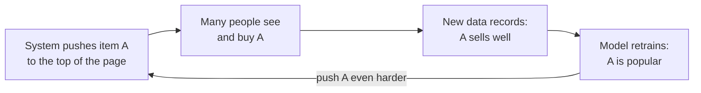
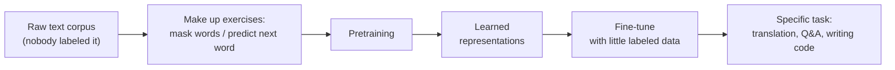
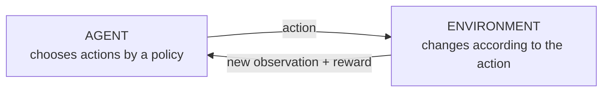
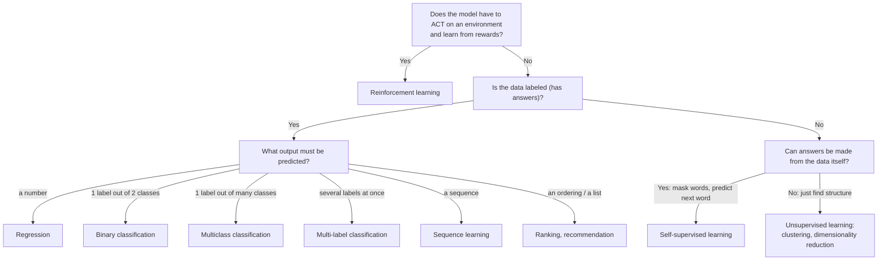

> **Learning objectives:** After this lesson, you will be able to recognize the common types of machine learning problems - regression, classification (binary / multiclass / multi-label), sequence learning, search and recommendation, unsupervised, self-supervised and reinforcement learning - and know how a real-world problem should be "framed".

## 1. One evening, five machine learning problems

In the evening, you pick up your phone:

- Type a few words into the search box → the machine has to **rank** millions of web pages to decide which deserves the top spot.
- Open a movie app → the system **recommends** films based on your own viewing history.
- Text someone, and the keyboard **predicts the next word** you are about to type.
- A strange email gets automatically thrown into the spam folder → the machine just **classified**.
- The weather app says "12mm of rain tomorrow" → the machine just **predicted a number**.

Five behaviors, five different *types of problem*. Lesson 01 handed you the general map (supervised / unsupervised / reinforcement); this lesson zooms into each territory. Choosing the **right type of problem** is the first step in applying ML to real work - and also the step that is easiest to get wrong. Most of this lesson follows the presentation in the opening chapter of the book *Dive into Deep Learning*.

Before we set off, take along a map with **two axes** - and these two axes are often mixed into one:

| Axis | The question asked | The "territories" along the axis |
|---|---|---|
| **Type of problem** | What is the model's output? | regression, classification (binary / multiclass / multi-label), sequence learning, ranking, recommendation |
| **How the learning signal is produced** (learning paradigm) | Where do the answers to learn from come from? | supervised, unsupervised, self-supervised, reinforcement learning |

The two axes can be crossed with each other - and the pair of examples below surprises many newcomers:

| Example | Type of problem | How the learning signal is produced |
|---|---|---|
| Machine translation | sequence-to-sequence | **supervised** - pairs of bilingual sentences translated by humans |
| A language model's "predict the next word" | **classification** - pick 1 word from the vocabulary | **self-supervised** - the answer is already in the sentence |

That's right: at heart, a large language model is solving a *classification* problem. Sections 2-4 of this lesson follow the first axis, Sections 5-7 the second.

## 2. Regression: when the answer is a number

Remember the plumber from Lesson 01? 3 hours of work costs 350,000 VND, 2 hours costs 250,000 VND - and you immediately work it out: **100,000 VND/hour + a 50,000 VND call-out fee**, so 4 hours will be 450,000 VND. At that moment you solved a **regression** problem without knowing its name.

Regression is the supervised learning problem in which the label to predict is **a numeric value** - a price, a number of hours, millimeters of rain. The classic example is predicting **house prices**, exactly the mini house-price table you met in Lessons 02-03: each house is a row, each column is a feature:

| Area (m²) | Bedrooms | Km to city center | → Sale price (billion VND) |
|---|---|---|---|
| 30 | 1 | 5 | 1.8 |
| 80 | 3 | 2 | 5.1 |
| 55 | 2 | 4 | 2.9 |
| 70 | 2 | 6 | **?** ← the model has to guess |

A tip for recognizing it (from the book *Dive into Deep Learning*): questions of the form **"how much / how many"** are usually regression:

- *How many* hours will this surgery take?
- In the next six hours, *how many* millimeters of rain will fall on this city?
- *How long* until this order is delivered?

A memorable example from the book *Dive into Deep Learning*: predicting the **number of stars** a user will give a movie is also regression - and whoever solved that problem well in 2009 had a shot at winning the Netflix Prize, worth **1 million USD**.

During training, a regression model looks for the set of parameters that makes its predictions **as close to the true values as possible**. "Close" is measured by a loss function, usually the squared error - details saved for Lesson 10.

## 3. Classification: when the answer is a label

A banking app scans a handwritten check: for each character in the image, the question is not "how much" but **"which one"** - which digit, which letter is this character? That is **classification**: the output is a **class** from a finite set of options.

### 3.1. Binary and multiclass

- **Binary classification:** only 2 classes. Is this email *spam or not spam*? Is this card transaction *fraudulent or normal*? Does this image *contain a cat or not*?
- **Multiclass classification:** more than 2 classes, each example belongs to **exactly one** class. For example the check above (taken from the book *Dive into Deep Learning*): each character is one of the classes {0, 1, ..., 9, a, b, c, ...}.

### 3.2. Classification returns probabilities - and a probability is not yet a decision

A good classification model usually does not declare flatly "this is a cat", but returns **a probability for each class**: *"cat: 0.9 - dog: 0.1"*. The number 0.9 says the model is fairly confident; *"cat: 0.55 - dog: 0.45"* means it is torn - very useful information for whoever uses the result.

Now for the most expensive lesson, via the mushroom example in the book *Dive into Deep Learning*. You pick up a beautiful mushroom and run it through a poisonous-mushroom classifier. The model says: *"probability that this is a death cap: 0.2"* - that is, 80% safe. Do you eat it?

**Absolutely not.** Put the consequences on the scale: the price of that 20% is your life, so large that no dinner can make up for it; while throwing the mushroom away only "costs" you... one tasty meal. **A rational decision = probability × consequence**, not simply picking the option with the highest probability. The ending in the book: the mushroom in the illustration *really is* a death cap.

> 🔧 **Try it now (by hand):** assign the loss "death" = 1,000,000 units (the book simply uses the symbol ∞), and the loss "missing a tasty meal" = 1 unit. Compute the expected loss of the two choices:
> - **Eat:** $0.2 \times 1{,}000{,}000 + 0.8 \times 0 = ?$
> - **Discard:** $0.2 \times 0 + 0.8 \times 1 = ?$
>
> *Answer:* eat = **200,000**, discard = **0.8** - discarding is about 250,000 times "cheaper". Try again with a death-cap probability of only 0.01: eating still costs 10,000 versus 0.99 for discarding - still discard.

This principle applies everywhere - medical diagnosis, loan approval, the emergency brake of a self-driving car - wherever an error in each direction carries a very different price. Lesson 08 (probability) and Lesson 15 (model evaluation) will come back to this idea.

### 3.3. Multi-label: when one example carries several labels at once

Your cat/dog classifier runs very well - until it meets the illustration of the fairy tale *Town Musicians of Bremen* that the book *Dive into Deep Learning* uses as an example: a donkey carrying a dog, on the dog's back a cat, and on the cat a rooster. Forcing the model to pick **one** single label is asking the wrong question: the correct answer has to be *"there is a cat, AND a dog, AND a donkey, AND a rooster"*.

The problem of predicting labels that are **not mutually exclusive** like this is called **multi-label classification**. It shows up in every "tagging" problem: a technical blog post can carry the tags "machine learning", "Python", "cloud computing" all at once - a typical post carries 5-10 tags.

A surprising detail from the book *Dive into Deep Learning*: the US National Library of Medicine employs a team of experts to tag each article on PubMed from a set of roughly **28,000 MeSH tags** - work so slow that there is usually a delay of about **one year** between an article being archived and its tagging being finished. ML is used to assign provisional tags while waiting for human review.

| | Number of classes | Each example receives | Example |
|---|---|---|---|
| **Binary** | 2 | exactly 1 label | email → spam / not spam |
| **Multiclass** | ≥ 3 | exactly 1 label | digit image → one of 0-9 |
| **Multi-label** | ≥ 2 | 0, 1 or several labels | Bremen picture → {donkey, dog, cat, rooster} |

<details>
<summary><strong>Going deeper (optional): when classes have a hierarchy</strong></summary>

There are problems where **there are many different ways to be wrong**. Mistaking a poodle for a schnauzer is a minor error; mistaking a poodle for... a dinosaur is a serious one. When the classes are organized into a hierarchical tree (like Linnaeus's classification of living things) and we want to penalize "mistaken for a distant relative" more heavily than "mistaken for a close relative", the problem is called **hierarchical classification**. The book *Dive into Deep Learning* adds a caveat: which hierarchy is appropriate depends on the purpose - the rattlesnake (highly venomous) and the garter snake (harmless) are biologically very close, but for a safety-warning application, confusing the two is a deadly error.

</details>

## 4. Sequences, ranking and recommendation: the "neighboring" problem types

Classic regression and classification assume inputs and outputs of **fixed size**: one feature vector in, one number or one label out. Many real problems refuse to fit neatly into that mold.

### 4.1. Sequence learning - a sequence in, a sequence out

*"The red book"* becomes *"cuốn sách màu đỏ"* in Vietnamese - the adjective jumps behind the noun, and the word count differs too. You cannot translate by swapping one word at a time; the machine has to read **the whole sequence** and then generate **another sequence**.

**Sequence learning** handles inputs and/or outputs that are **sequences of variable length**, where the order carries information:

- **Machine translation:** an English sentence in, a Vietnamese sentence out - two sequences of different lengths, and the word order can be shuffled around.
- **Speech-to-text (speech recognition):** the input is audio - according to the book *Dive into Deep Learning*, speech is typically sampled at 8,000-16,000 numbers per second - while the output is just a few characters; there is no 1-to-1 correspondence between "audio samples" and "characters". The reverse direction is **text-to-speech**: the output is far longer than the input.
- **Patient monitoring:** the model reads a sequence of hourly health readings to warn of risk - the sequence's past carries information; you cannot just look at the latest measurement.

### 4.2. Search and ranking

For a search engine, the question is not *"is this page relevant?"* but *"among the relevant pages, which should rank **higher**?"*. The general approach: assign each result a **score**, then sort.

An early example mentioned in the book *Dive into Deep Learning* is Google's original PageRank algorithm, which scored the "authority" of web pages. The odd thing: the PageRank score **did not depend on the query** - a simple filter picked out the relevant pages, and then PageRank put the more authoritative ones on top. Later search systems use ML to compute relevance per query and per user behavior.

### 4.3. Recommender systems - and the feedback-loop trap

Recommendation is like ranking, plus **personalization**: the movie page recommended to a science-fiction fan must differ from the one shown to a comedy fan. The learning data comes from both **explicit** feedback (star ratings, written reviews) and **implicit** feedback (skipping a song, scrolling past a product).

Two weaknesses worth remembering:

- **Feedback is naturally "censored":** people mostly rate things they feel strongly about - the 5-star scale is full of 1s and 5s and rarely a 3 - so the data does not represent the silent majority.
- **The feedback loop:** the model learns from data it created itself, and reinforces its own biases:



An item can become popular *because it was recommended*, not *because it is good*.

## 5. Unsupervised learning: finding structure when there are no answers

Your phone has 10,000 photos, and nobody has labeled a single one. What can the machine still do? When data has **no labels**, we switch to an open question: *"what interesting structure is there in this pile of data?"*. Two representative problems (Lesson 01 said hello to them; now a closer look):

- **Clustering:** automatically group "similar" examples together - grouping photos into landscapes / pets / babies, grouping customers by shopping behavior so they can be served differently. The whole game lies in the word *"similar"*: the machine needs a measure of **distance / similarity** between two examples - the central topic of Lesson 07.
- **Dimensionality reduction:** find a small number of "core" numbers that describe many-column data. The book *Dive into Deep Learning* has a great example: tailors have long described the human body - complex as it is - with a few measurements (chest, waist, arm length) that are enough to cut a well-fitting garment. Dimensionality reduction does the same for thousand-column data; the classic technique for linear relationships is called **principal component analysis (PCA)**.

Another unsupervised question raised in the book *Dive into Deep Learning*: can concepts be represented as vectors so that arithmetic reflects meaning? The famous result: **"Rome" − "Italy" + "France" = "Paris"** - vectors learned from raw text capture even the "capital of" relationship. Lesson 07 will meet vectors of this kind again under the name embeddings.

There are also **generative models**, which learn the "distribution" of the data to create new samples - the foundation of the generative AI wave mentioned in Lesson 01.

## 6. Self-supervised learning: the "answers" are already in the data

You want to teach a machine to understand English. There are billions of sentences online, but hiring people to label each one would cost enormous amounts of money and time. **Self-supervised learning** takes a detour: it **makes up exercises from unlabeled data** so that the answers are already in the data itself.

An example with text - the **fill in the masked word** game: take any sentence from the web, randomly mask one word, and make the model guess:

```
Exercise:   "It is [...] so hard today that I must bring a raincoat."
Answer:     "raining"   ← already in the original sentence, no labeler needed!
```

> 🔧 **Try it now (3 lines of Python):** how many exercises does one sentence yield?
> ```python
> words = "It is raining so hard today that I must bring a raincoat".split()
> for i, word in enumerate(words):
>     print(" ".join(words[:i] + ["[...]"] + words[i+1:]), "→", word)
> ```
> *Answer:* **12 exercises with answers** from a single 12-word sentence - labeling cost zero. Multiply by the billions of sentences online and you see why this approach changed the game.

A related kind of exercise - but worth distinguishing - is **predicting the next word**: let the model read *"It is raining so hard today that I must bring..."* and ask it to guess the next word. These are two different "schools" of pretraining:

- **Masked language modeling** - the approach of models like BERT. According to the book *Dive into Deep Learning*, BERT randomly picks **15%** of the tokens in each sentence to mask and makes the model guess them.
- **Next-token prediction** - the approach of the GPT family and many chatbots such as ChatGPT and Claude.

What makes both self-supervised: every sentence that exists in the world is automatically an exercise with its answer. That is how **large language models** get **pretrained** on gigantic text corpora. For images there are similar games: mask out a patch of an image and make the model paint it back, or guess the relative position of two pieces cut from the same image.

The interesting part: to predict words well across all kinds of text, the model is forced to learn a great many useful regularities - about syntax, semantics and the recurring patterns in the data. The learned **representations** are then **fine-tuned** for a specific task with a much smaller amount of labeled data:



## 7. Reinforcement learning: learning by bumping into the environment

Teaching a machine to play chess. There is no data table of "board position → correct move" at all - only the win/loss result at the end of the game. And every move the machine makes changes the position it will see next. All the problem types above picture data **collected in advance**, with the model not *acting* on the world while it learns; **reinforcement learning (RL)** is for this entirely different situation.

Here an **agent** interacts with an **environment** over many steps; its actions **feed back into** what it observes and the reward it receives next:



At each step, the agent observes the environment, chooses an action, and receives a new observation together with a **reward**. The agent's strategy for choosing actions is called its **policy**; the goal of RL is to find the policy that collects the most reward in the long run.

The core difference from supervised learning: **nobody tells the agent the correct action** - it only receives rewards, and rewards sometimes arrive very late. Take chess: the real reward only appears at the final move (win +1, lose −1); so which of the 40 preceding moves deserve praise, and which deserve blame? This "assigning credit and blame" problem is called **credit assignment** - like an employee who gets promoted and has to work out which of the past year's efforts actually earned it.

Another situation characteristic of RL is **exploration vs. exploitation**: for lunch today, go to the usual place - a guaranteed 7/10 - or try a new one, which might be a 9/10 but might also be a 4/10? Exploit forever and you will never discover a better option; explore forever and your average reward stays low. A good agent has to balance both.

> 🔧 **Try it now (by hand):** you have 100 lunches left. The usual place is a guaranteed 7 points. The new place: 50% chance it's 9 points, 50% chance it's 4 points (quality is stable after the first try).
> - **Exploit only:** 100 × 7 = ?
> - **Try the new place once, then eat at the better place for the remaining 99 lunches:** if the new place is 9 points → 9 + 99 × 9; if 4 points → 4 + 99 × 7. Expected value = the average of the two scenarios = ?
>
> *Answer:* exploit only = **700**; try once = (900 + 697) / 2 = **798.5**. One "risky" meal buys information used for the next 99 - that is why an agent should explore, especially when many steps still lie ahead.

RL is used in robotics, dialogue systems, game-playing AI; it also plays a part in fine-tuning large language models, through the technique commonly called RLHF (reinforcement learning from human feedback).

> ⚠️ **A small note:** two famous examples mentioned in the book *Dive into Deep Learning* are the deep Q-network (playing Atari games from screen pixels alone, reaching superhuman level) and **AlphaGo** - the program that beat the world Go champion. But AlphaGo is not "pure" RL: it combines supervised learning from human games, RL through self-play, and a tree search over moves. RL is *one* component of the system, not the whole thing.

<details>
<summary><strong>Going deeper (optional): special cases of RL</strong></summary>

The general RL problem is very hard, so people single out simpler cases to study. When the environment is **fully observed**, we have a **Markov decision process (MDP)**. When the state does not depend on previous actions, we have a **contextual bandit** - each decision is almost an independent problem: see the context, choose an action, receive the reward, done; today's action does not push the environment into a state we have to bear tomorrow, so there is no need to optimize long-term reward. And when there is not even a state - just a row of options with unknown rewards - we have the classic **multi-armed bandit** problem: a gambler stands in front of a row of slot machines and has to try them to find out which one is "generous". The bandit is the most distilled version of the exploration vs. exploitation dilemma.

Conversely, when the environment is only **partially observed**, the agent has to reason further from the past. An example from the book *Dive into Deep Learning*: a robot vacuum stuck in one of several identical closets - looking around is not enough to tell which closet it is in; it has to recall the path it took before going in.

</details>

## 8. Summary table: the whole map at a glance

Faced with a new problem, you can follow the decision tree below to find a framing:



> ⚠️ **A small note:** the tree above is a quick orientation tool, not a law. Ranking and recommendation learn from user feedback (clicks, star ratings) - a kind of "implicit" label; and a real problem often combines several types (a language model: classification + self-supervised, then fine-tuned with RLHF).

| Problem type | Input | Output | Example |
|---|---|---|---|
| **Regression** | feature vector | a number | area, location → house price |
| **Binary classification** | feature vector | 1 of 2 labels (with a probability) | email → spam / not spam |
| **Multiclass classification** | image, text... | 1 of many labels | handwriting image → digit 0-9 |
| **Multi-label classification** | image, article | several labels at once | Bremen picture → {donkey, dog, cat, rooster} |
| **Sequence learning** | sequence (sentence, audio) | sequence | English sentence → Vietnamese sentence |
| **Ranking / search** | query + document collection | ranked list | keyword → top 10 results |
| **Recommender system** | user behavior history | personalized recommendation list | viewing history → movies to watch |
| **Clustering** (unsupervised) | unlabeled data | clusters | customers → behavior groups |
| **Dimensionality reduction** (unsupervised) | many-column data | fewer dimensions | 1,000 columns → a few principal axes |
| **Self-supervised** | data with part of itself masked | the masked part | sentence with a missing word → the masked word |
| **Reinforcement learning** | observations from the environment | actions | board position → next move |

## Lesson summary

- **Regression** predicts a **number** (the question "how much?"); **classification** predicts a **label** (the question "which one?") - these are the two main types of supervised learning.
- Classification subdivides into **binary** (2 classes), **multiclass** (many classes, exactly 1 label per example) and **multi-label** (one example may carry several labels - like the Bremen picture with a donkey, dog, cat and rooster all at once).
- A classification model returns **probabilities**, but a rational action must also weigh the **consequences**: 80% "not a poisonous mushroom" is still not worth eating the mushroom.
- **Sequence learning** (machine translation, speech-to-text) handles variable-length sequences; **ranking** orders results; **recommender systems** add personalization but easily fall into a self-amplifying **feedback loop**.
- **Unsupervised learning** finds structure in unlabeled data: clustering (needs a distance measure - Lesson 07) and dimensionality reduction.
- **Self-supervised learning** makes up exercises from raw data (fill in the masked word, predict the next word) - the way large language models are pretrained without human labelers.
- **Reinforcement learning**: an agent acts in an environment and learns from delayed rewards; it must balance **exploration** and **exploitation**. AlphaGo uses RL as *one* component, alongside supervised learning and search.

## Self-check questions

1. Sort the following problems into the right type (regression / binary classification / multiclass / multi-label): (a) predicting tomorrow's river water level; (b) guessing whether a customer will cancel their subscription next month; (c) recognizing whether a food photo shows pho, bun cha or banh mi; (d) tagging a news article by topic (an article can be both "economy" and "technology").
2. Why does the *Town Musicians of Bremen* picture expose the weakness of a multiclass classifier? How should the problem be reframed?
3. The model says the mushroom you picked has an 85% chance of being harmless. Do you eat it? State the decision principle behind your answer.
4. How does self-supervised learning differ from supervised learning in the **origin of the labels**? Make up a "fill-in-the-blank exercise" of your own and point out where the answer already sits.
5. Explain the feedback loop in a recommender system with a concrete example (say, a restaurant on a food-delivery app). Why is the data collected afterwards no longer "clean"?
6. In reinforcement learning, what is the "exploration vs. exploitation" dilemma? Describe a situation from your own life that matches it and how you balanced the two.

## Further reading

**Primary sources for this lesson:**

| Source | Which part to read |
|---|---|
| **The book *Dive into Deep Learning*** | Chapter 1, the *Kinds of Machine Learning Problems* section - regression, classification (with the death cap and Bremen examples), tagging, search, recommender, sequence learning, unsupervised/self-supervised, reinforcement learning |
| **The book *An Introduction to Statistical Learning*** | Chapter 2, Section 2.2.3 *The Classification Setting* - classification from a probabilistic viewpoint, error rate, the Bayes classifier |

**Additional free online sources:**

- [MLU-Explain](https://mlu-explain.github.io/) - a series of interactive visual lectures from Machine Learning University (Amazon), with separate pieces on logistic regression, decision trees, ROC...
- [What are Masked Language Models (MLMs)? - TechTarget](https://www.techtarget.com/searchenterpriseai/definition/masked-language-models-MLMs) - a concise explanation of the "fill in the masked word" mechanism in language-model pretraining.
- [Machine Learning cơ bản - Categories of Machine Learning Algorithms](https://machinelearningcoban.com/2016/12/27/categories/) - a Vietnamese-language article classifying the groups of ML algorithms with many examples.

> **Next lesson:** [Vectors, Matrices & Tensors](../vectors-matrices-tensors/) - every problem type above starts by turning data into sequences of numbers - time to get acquainted with their language: vectors, matrices and tensors.
