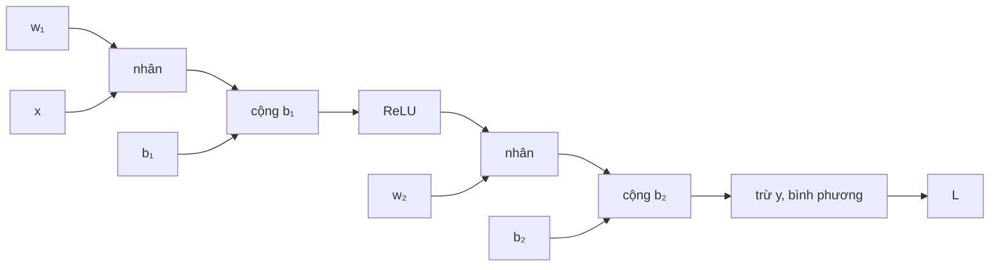

> **Mục tiêu bài học:** Sau bài này, bạn sẽ tính tay được gradient của một mạng tí hon rồi đối chiếu với `backward()`, hiểu đồ thị tính toán là gì và vì sao nó cho phép một lời gọi lo cho mọi tham số, và đo được bằng số hiện tượng gradient yếu dần khi đi ngược qua nhiều tầng.

## 1. Chỗ Foundations dừng lại, và chỗ bài này bắt đầu

Foundations · Bài 09 đã dựng xong nền: đạo hàm là tốc độ thay đổi, gradient là la bàn chỉ hướng dốc nhất, chain rule cho phép tính đạo hàm của hàm lồng trong hàm, và `backward()` của PyTorch làm việc đó thay bạn. Bài ấy chốt bằng một ví dụ: $f(x) = x^2$, gọi `y.backward()`, ra `4.0` tại $x = 2$.

Câu hỏi bài này trả lời là câu tiếp theo: **một hàm số một biến thì hiểu được, nhưng làm sao cùng cơ chế ấy lo nổi 203.530 tham số của mạng ở bài 03 - và tại sao chi phí lại không tăng gấp 203.530 lần?**

## 2. Tính tay một mạng tí hon

Mạng nhỏ nhất còn đáng gọi là mạng: một đầu vào, một nơ-ron ẩn có ReLU, một đầu ra, loss bình phương.

```
  x ──(w₁,b₁)──▶ z₁ ──ReLU──▶ a₁ ──(w₂,b₂)──▶ z₂ ──▶ L = (z₂ − y)²
```

Đặt số cụ thể: $x = 2$, $y = 1$, và bốn tham số $w_1 = 0{,}5$, $b_1 = 0{,}1$, $w_2 = -1{,}5$, $b_2 = 0{,}3$.

**Lượt xuôi (forward)** - đi từ trái sang phải, ghi lại mọi giá trị trung gian:

$$z_1 = 0{,}5 \times 2 + 0{,}1 = 1{,}1 \qquad a_1 = \max(0; 1{,}1) = 1{,}1$$
$$z_2 = -1{,}5 \times 1{,}1 + 0{,}3 = -1{,}35 \qquad L = (-1{,}35 - 1)^2 = 5{,}5225$$

**Lượt ngược (backward)** - đi từ phải sang trái, mỗi bước nhân thêm một đạo hàm cục bộ. Bắt đầu từ loss:

$$\frac{\partial L}{\partial z_2} = 2(z_2 - y) = 2(-1{,}35 - 1) = -4{,}7$$

Có con số đó rồi thì hai tham số của tầng cuối tính ra ngay:

$$\frac{\partial L}{\partial w_2} = \frac{\partial L}{\partial z_2} \cdot a_1 = -4{,}7 \times 1{,}1 = -5{,}17 \qquad \frac{\partial L}{\partial b_2} = -4{,}7$$

Đi tiếp về bên trái, qua $w_2$ rồi qua ReLU:

$$\frac{\partial L}{\partial a_1} = -4{,}7 \times w_2 = 7{,}05 \qquad \frac{\partial L}{\partial z_1} = 7{,}05 \times 1 = 7{,}05$$

(Đạo hàm của ReLU bằng 1 vì $z_1 = 1{,}1 > 0$; nếu $z_1$ âm thì nó bằng 0 và **toàn bộ** tín hiệu phía sau bị chặn - đó chính là nơ-ron chết ở bài 02.)

$$\frac{\partial L}{\partial w_1} = 7{,}05 \times x = 14{,}1 \qquad \frac{\partial L}{\partial b_1} = 7{,}05$$

Giờ để PyTorch làm lại:

```python
import torch
w1 = torch.tensor(0.5,  requires_grad=True)
b1 = torch.tensor(0.1,  requires_grad=True)
w2 = torch.tensor(-1.5, requires_grad=True)
b2 = torch.tensor(0.3,  requires_grad=True)
x, y = torch.tensor(2.0), torch.tensor(1.0)

L = ((w2 * torch.relu(w1 * x + b1) + b2) - y) ** 2
L.backward()
print(w1.grad, b1.grad, w2.grad, b2.grad)
```

| | $\partial L/\partial w_1$ | $\partial L/\partial b_1$ | $\partial L/\partial w_2$ | $\partial L/\partial b_2$ |
|---|---|---|---|---|
| **Tính tay** | 14,1000 | 7,0500 | −5,1700 | −4,7000 |
| **`backward()`** | 14,1000 | 7,0500 | −5,1700 | −4,7000 |

Khớp từng chữ số. `backward()` không làm gì huyền bí - nó chạy đúng chuỗi phép nhân bạn vừa làm bằng bút chì.

## 3. Đồ thị tính toán: thứ PyTorch âm thầm ghi lại

Điều đáng nói không phải *phép tính* mà là **cách tổ chức**.

Khi bạn viết dòng `L = ((w2 * torch.relu(w1 * x + b1) + b2) - y) ** 2`, PyTorch không chỉ tính ra 5,5225. Nó vừa tính vừa ghi lại một sơ đồ: phép nào sinh ra giá trị nào, từ những đầu vào nào. Sơ đồ đó gọi là **đồ thị tính toán (computational graph)**.



Lượt xuôi đi theo chiều mũi tên. `L.backward()` đi **ngược** chiều mũi tên, và tại mỗi nút nó chỉ cần biết đúng hai thứ: đạo hàm đã tích lũy được từ phía sau, và đạo hàm cục bộ của riêng phép toán tại nút đó. Nhân hai thứ ấy với nhau rồi đẩy tiếp về phía trước - đúng chain rule của Foundations · Bài 09, lặp lại một cách máy móc.

Từ đó ra hai tính chất quan trọng:

**Một lượt ngược lo cho toàn bộ tham số.** Mỗi cạnh trong đồ thị được đi qua đúng một lần theo mỗi chiều, nên lượt ngược tốn cùng *bậc* chi phí với lượt xuôi - thực nghiệm thường thấy khoảng gấp đôi. Điều đó không có nghĩa là chi phí độc lập với số tham số: mạng to gấp mười thì cả hai lượt đều đắt lên. Cái đáng nói là **203.530 đạo hàm riêng cùng ra trong một lượt ngược duy nhất**. Cách làm ngây thơ - nhích từng tham số một rồi đo loss thay đổi bao nhiêu - cần 203.530 lượt xuôi để có cùng lượng thông tin, tức đắt hơn hàng trăm nghìn lần. Đây là lý do huấn luyện mạng lớn khả thi.

**Giá phải trả là bộ nhớ.** Để tính lượt ngược, PyTorch phải giữ lại các giá trị trung gian của lượt xuôi ($a_1$ chẳng hạn, vì $\partial L/\partial w_2$ cần nó). Với mạng lớn và batch lớn, chính đống giá trị trung gian này - chứ không phải bản thân tham số - mới là thứ làm đầy bộ nhớ. Đó là lý do lỗi hết bộ nhớ thường được chữa bằng cách giảm batch size trước tiên.

> ⚠️ **Lưu ý nhỏ:** hai chi tiết hay làm người mới vấp. Thứ nhất, gradient trong PyTorch **cộng dồn** chứ không ghi đè: gọi `backward()` hai lần mà không xóa thì `.grad` là tổng của hai lần. Vì thế mọi vòng lặp huấn luyện đều bắt đầu bằng `optimizer.zero_grad()` - quên dòng này là một trong những lỗi kinh điển. Thứ hai, khi chỉ cần dự đoán chứ không train, hãy bọc trong `with torch.no_grad():` để PyTorch khỏi dựng đồ thị. Đo trên một mạng 14,2 triệu tham số với batch 1.024: lượt xuôi trong `no_grad()` tốn thêm 58 MB, còn lượt xuôi có dựng đồ thị tốn thêm **56 MB nữa** - đồ thị gần như nhân đôi bộ nhớ cho giá trị trung gian. Thời gian chạy thì gần như không đổi (0,98 giây cho cả hai, đo trên CPU), nên cái bạn tiết kiệm được là bộ nhớ chứ không phải tốc độ.

## 4. Trên đường đi ngược, tín hiệu yếu dần

Giờ dùng chính cơ chế trên để đo cái mà bài 03 đã đụng phải: vì sao mạng 4 tầng lại tệ hơn mạng 3 tầng.

Dựng mạng 6 tầng ẩn, mỗi tầng 128 nơ-ron, đưa qua một batch FashionMNIST, gọi `backward()` một lần, rồi in **độ lớn gradient của trọng số từng tầng**:

```python
loss = criterion(model(xb), yb)
loss.backward()
for name, p in model.named_parameters():
    if "weight" in name:
        print(name, p.grad.norm().item())
```

| Tầng | 1 | 2 | 3 | 4 | 5 | 6 | 7 (ra) |
|---|---|---|---|---|---|---|---|
| **ReLU** | 7,5·10⁻³ | 2,6·10⁻³ | 2,3·10⁻³ | 2,6·10⁻³ | 4,8·10⁻³ | 1,0·10⁻² | 2,7·10⁻² |
| **Sigmoid** | 1,5·10⁻⁵ | 2,7·10⁻⁵ | 2,0·10⁻⁴ | 1,4·10⁻³ | 1,0·10⁻² | 6,8·10⁻² | 4,9·10⁻¹ |

Với **ReLU**, gradient tầng cuối lớn hơn tầng đầu khoảng **4 lần**. Chênh nhưng cùng bậc - mọi tầng đều nhận được tín hiệu dùng được.

Với **sigmoid**, tỉ lệ ấy là **33.585 lần**. Tầng cuối có gradient 0,49; tầng đầu chỉ còn 0,000015. Nghĩa là trong khi tầng cuối đang học nhanh, tầng đầu gần như đứng yên - nó nhận được tín hiệu nhỏ tới mức cập nhật không đáng kể. Mạng có 6 tầng nhưng thực chất chỉ vài tầng cuối đang học.

Đây chính là con số đằng sau bảng ở bài 02, nơi sigmoid cho 0,7611 còn ReLU cho 0,8549. Và nó cũng giải thích vì sao xếp thêm tầng ở bài 03 nhanh chóng đụng trần: càng nhiều tầng, quãng đường tín hiệu phải đi ngược càng dài, và mỗi chặng lại nhân thêm một đạo hàm nhỏ hơn 1.

Hiện tượng này có tên: **vanishing gradient (gradient tiêu biến)**. Bài 08 dành trọn cho nó - nguyên nhân toán học, và ba cách chữa.

> 🔧 **Thử ngay:** vì sao sigmoid làm gradient teo còn ReLU thì không? Nhìn vào đạo hàm của hai hàm.
> Đạo hàm của sigmoid đạt cực đại 0,25 tại $z = 0$ và nhỏ dần về 0 ở hai đầu. Đi ngược qua 6 tầng là nhân ít nhất 6 con số $\le 0{,}25$: $0{,}25^6 \approx 0{,}00024$ - teo gần bốn bậc chỉ vì các hàm kích hoạt. Đạo hàm của ReLU ở nhánh dương bằng đúng **1**, nên bản thân hàm kích hoạt không góp thừa số nào làm gradient co lại. Chú ý chữ "bản thân hàm kích hoạt": gradient đầy đủ còn phải nhân qua các **ma trận trọng số** ở mỗi tầng nữa, nên ReLU chỉ gỡ được một trong hai nguồn gây teo - nó không bảo đảm gradient sống sót. Bài 08 sẽ cho thấy một mạng 20 tầng dùng ReLU vẫn hỏng nếu trọng số khởi tạo sai. Đổi lại, nhánh âm cho đạo hàm 0 và chặn hẳn - đó là cái giá của ReLU, đã gặp ở bài 02.

## Tóm tắt bài học

- `backward()` chạy đúng chuỗi phép nhân chain rule mà bạn có thể làm bằng tay: trên mạng bốn tham số, tính tay và PyTorch cho cùng kết quả tới từng chữ số (14,1000 / 7,0500 / −5,1700 / −4,7000).
- PyTorch vừa tính lượt xuôi vừa ghi lại **đồ thị tính toán**; `backward()` đi ngược đồ thị đó, mỗi nút nhân đạo hàm tích lũy với đạo hàm cục bộ.
- Nhờ vậy một lời gọi `backward()` cho ra đạo hàm của cả 203.530 núm vặn, với chi phí cùng bậc một lượt xuôi - thay vì 203.530 lượt xuôi nếu dò từng núm một. Đây là lý do huấn luyện mạng lớn khả thi.
- Giá phải trả là bộ nhớ giữ giá trị trung gian; khi hết bộ nhớ, giảm batch size là việc nên thử trước.
- Gradient **cộng dồn** giữa các lần gọi, nên vòng lặp huấn luyện phải bắt đầu bằng `optimizer.zero_grad()`; khi chỉ dự đoán thì bọc `torch.no_grad()`.
- Đo trên mạng 6 tầng: với ReLU, gradient tầng cuối gấp 4 lần tầng đầu; với sigmoid, gấp 33.585 lần - tầng đầu gần như không học. Đó là vanishing gradient, chủ đề bài 08.

## Câu hỏi tự kiểm tra

1. Trong ví dụ mục 2, nếu $w_1$ đổi thành $-0{,}5$ thì $z_1$ âm. Gradient của $w_1$ và $b_1$ khi ấy bằng bao nhiêu, và vì sao?
2. Vì sao chi phí của lượt ngược không tăng theo số tham số? Nếu phải tính từng đạo hàm riêng một cách độc lập thì sao?
3. Bạn gặp lỗi hết bộ nhớ khi train. Vì sao giảm batch size lại giúp, trong khi số tham số của mô hình không đổi?
4. Một người quên `optimizer.zero_grad()` trong vòng lặp. Mô tả chuyện xảy ra với `.grad` sau ba vòng lặp.
5. Nhìn bảng gradient theo tầng ở mục 4: với sigmoid, tầng nào học nhanh nhất và tầng nào gần như đứng yên? Điều đó nói gì về "mạng 6 tầng" ấy trong thực tế?
6. Đạo hàm cực đại của sigmoid là 0,25. Với mạng 10 tầng ẩn dùng sigmoid, ước lượng thô xem gradient tới tầng đầu bị teo bao nhiêu lần chỉ do các hàm kích hoạt.

## Đọc thêm

**Nguồn nền tảng của bài:**

| Nguồn | Đọc phần nào |
|---|---|
| **Dive into Deep Learning (d2l.ai)** | Chương 2.5 *Automatic Differentiation* - đồ thị tính toán, `backward()`, gradient cộng dồn; chương 5.3 *Forward Propagation, Backward Propagation, and Computational Graphs* - đúng nội dung mục 3, có sơ đồ đồ thị cho một MLP; chương 5.4 *Numerical Stability and Initialization* - vanishing/exploding gradient |
| **Foundations · Bài 09** | Đạo hàm, gradient, chain rule và autograd - bài này bắt đầu từ đúng chỗ đó dừng |

**Nguồn online bổ sung (miễn phí):**

- [A Gentle Introduction to `torch.autograd`](https://pytorch.org/tutorials/beginner/blitz/autograd_tutorial.html) - hướng dẫn chính thức về đồ thị tính toán và `backward()`.
- [Autograd mechanics - tài liệu PyTorch](https://pytorch.org/docs/stable/notes/autograd.html) - giải thích kỹ chuyện gradient cộng dồn và `no_grad()`.
- [Karpathy - micrograd](https://github.com/karpathy/micrograd) - cài đặt autograd đầy đủ trong khoảng 100 dòng Python, đọc hết là hiểu tận gốc mục 3; kèm [video giải thích từng dòng](https://www.youtube.com/watch?v=VMj-3S1tku0).
- [Calculus on Computational Graphs: Backpropagation (Christopher Olah)](https://colah.github.io/posts/2015-08-Backprop/) - bài viết ngắn về vì sao lượt ngược rẻ, với hình minh họa đồ thị.

> **Bài tiếp theo:** [PyTorch: vòng lặp huấn luyện đầu tiên](../pytorch-your-first-training-loop-vi/) - đã hiểu cơ chế bên dưới, giờ đến lúc ráp thành một chương trình chạy được từ đầu đến cuối - và phân biệt cho rõ hai chế độ mà người mới hay lẫn: lúc huấn luyện và lúc dự đoán.
