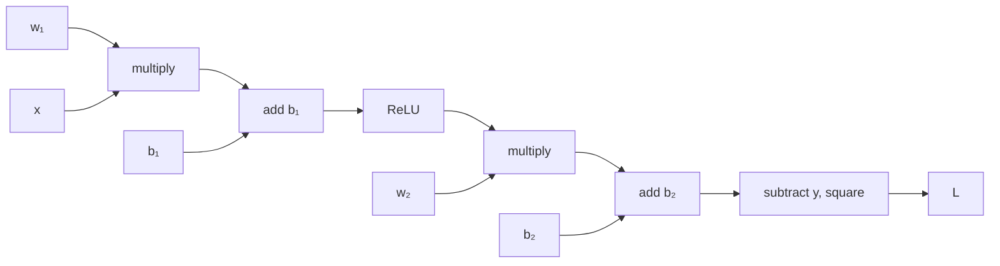

> **Learning objectives:** After this lesson, you will be able to compute the gradients of a tiny network by hand and check them against `backward()`, understand what a computational graph is and why it lets a single call take care of every parameter, and measure in numbers how gradients fade as they flow back through many layers.

## 1. Where Foundations stopped, and where this lesson begins

Foundations · Lesson 09 laid the groundwork: a derivative is a rate of change, a gradient is a compass pointing in the steepest direction, the chain rule lets you differentiate a function nested inside a function, and PyTorch's `backward()` does that for you. That lesson closed with an example: $f(x) = x^2$, call `y.backward()`, get `4.0` at $x = 2$.

The question this lesson answers is the next one: **a function of one variable is easy to understand, but how does that same mechanism handle the 203,530 parameters of the network in lesson 03 - and why does the cost not grow 203,530-fold?**

## 2. Computing a tiny network by hand

The smallest network still worth calling a network: one input, one hidden neuron with ReLU, one output, squared loss.

```
  x ──(w₁,b₁)──▶ z₁ ──ReLU──▶ a₁ ──(w₂,b₂)──▶ z₂ ──▶ L = (z₂ − y)²
```

Plug in concrete numbers: $x = 2$, $y = 1$, and four parameters $w_1 = 0.5$, $b_1 = 0.1$, $w_2 = -1.5$, $b_2 = 0.3$.

**The forward pass** - go from left to right, recording every intermediate value:

$$z_1 = 0.5 \times 2 + 0.1 = 1.1 \qquad a_1 = \max(0, 1.1) = 1.1$$
$$z_2 = -1.5 \times 1.1 + 0.3 = -1.35 \qquad L = (-1.35 - 1)^2 = 5.5225$$

**The backward pass** - go from right to left, multiplying in one more local derivative at each step. Start from the loss:

$$\frac{\partial L}{\partial z_2} = 2(z_2 - y) = 2(-1.35 - 1) = -4.7$$

With that number in hand, the two parameters of the last layer follow immediately:

$$\frac{\partial L}{\partial w_2} = \frac{\partial L}{\partial z_2} \cdot a_1 = -4.7 \times 1.1 = -5.17 \qquad \frac{\partial L}{\partial b_2} = -4.7$$

Continue to the left, through $w_2$ and then through ReLU:

$$\frac{\partial L}{\partial a_1} = -4.7 \times w_2 = 7.05 \qquad \frac{\partial L}{\partial z_1} = 7.05 \times 1 = 7.05$$

(The derivative of ReLU is 1 because $z_1 = 1.1 > 0$; if $z_1$ were negative it would be 0 and **all** of the signal from behind would be blocked - that is exactly the dead neuron from lesson 02.)

$$\frac{\partial L}{\partial w_1} = 7.05 \times x = 14.1 \qquad \frac{\partial L}{\partial b_1} = 7.05$$

Now let PyTorch do it again:

```python
import torch
w1 = torch.tensor(0.5,  requires_grad=True)
b1 = torch.tensor(0.1,  requires_grad=True)
w2 = torch.tensor(-1.5, requires_grad=True)
b2 = torch.tensor(0.3,  requires_grad=True)
x, y = torch.tensor(2.0), torch.tensor(1.0)

L = ((w2 * torch.relu(w1 * x + b1) + b2) - y) ** 2
L.backward()
print(w1.grad, b1.grad, w2.grad, b2.grad)
```

| | $\partial L/\partial w_1$ | $\partial L/\partial b_1$ | $\partial L/\partial w_2$ | $\partial L/\partial b_2$ |
|---|---|---|---|---|
| **By hand** | 14.1000 | 7.0500 | −5.1700 | −4.7000 |
| **`backward()`** | 14.1000 | 7.0500 | −5.1700 | −4.7000 |

A match to every digit. `backward()` does nothing mysterious - it runs exactly the chain of multiplications you just did with a pencil.

## 3. The computational graph: what PyTorch quietly records

What is worth talking about is not the *computation* but **how it is organized**.

When you write the line `L = ((w2 * torch.relu(w1 * x + b1) + b2) - y) ** 2`, PyTorch does not just compute 5.5225. While computing, it also records a diagram: which operation produced which value, from which inputs. That diagram is called a **computational graph**.



The forward pass follows the direction of the arrows. `L.backward()` goes **against** the arrows, and at each node it needs to know exactly two things: the derivative accumulated so far from behind, and the local derivative of that node's own operation. Multiply the two together and pass the result on toward the front - exactly the chain rule of Foundations · Lesson 09, repeated mechanically.

Two important properties follow from this:

**One backward pass takes care of every parameter.** Each edge in the graph is traversed exactly once in each direction, so the backward pass costs the same *order* as the forward pass - in practice usually about twice as much. That does not mean the cost is independent of the number of parameters: a network ten times larger makes both passes more expensive. The point is that **all 203,530 partial derivatives come out of one single backward pass**. The naive approach - nudging one parameter at a time and measuring how much the loss changes - needs 203,530 forward passes to get the same information, which is hundreds of thousands of times more expensive. This is why training large networks is feasible.

**The price is memory.** To compute the backward pass, PyTorch has to keep the intermediate values of the forward pass ($a_1$, for example, since $\partial L/\partial w_2$ needs it). With large networks and large batches, it is this pile of intermediate values - not the parameters themselves - that fills up memory. That is why an out-of-memory error is usually fixed first by reducing the batch size.

> ⚠️ **A small note:** two details often trip up beginners. First, gradients in PyTorch **accumulate** rather than overwrite: call `backward()` twice without clearing and `.grad` holds the sum of the two. That is why every training loop starts with `optimizer.zero_grad()` - forgetting this line is one of the classic bugs. Second, when you only need predictions and are not training, wrap the code in `with torch.no_grad():` so PyTorch does not build the graph. Measured on a 14.2-million-parameter network with a batch of 1,024: a forward pass inside `no_grad()` takes an extra 58 MB, while a forward pass that builds the graph takes **another 56 MB** - the graph nearly doubles the memory for intermediate values. Running time is almost unchanged (0.98 seconds for both, measured on CPU), so what you save is memory, not speed.

## 4. On the way back, the signal fades

Now let us use this very mechanism to measure what lesson 03 ran into: why the 4-layer network was worse than the 3-layer one.

Build a network with 6 hidden layers of 128 neurons each, pass one FashionMNIST batch through it, call `backward()` once, and print **the gradient magnitude of each layer's weights**:

```python
loss = criterion(model(xb), yb)
loss.backward()
for name, p in model.named_parameters():
    if "weight" in name:
        print(name, p.grad.norm().item())
```

| Layer | 1 | 2 | 3 | 4 | 5 | 6 | 7 (output) |
|---|---|---|---|---|---|---|---|
| **ReLU** | 7.5·10⁻³ | 2.6·10⁻³ | 2.3·10⁻³ | 2.6·10⁻³ | 4.8·10⁻³ | 1.0·10⁻² | 2.7·10⁻² |
| **Sigmoid** | 1.5·10⁻⁵ | 2.7·10⁻⁵ | 2.0·10⁻⁴ | 1.4·10⁻³ | 1.0·10⁻² | 6.8·10⁻² | 4.9·10⁻¹ |

With **ReLU**, the gradient of the last layer is about **4 times** larger than that of the first. A difference, but of the same order - every layer receives a usable signal.

With **sigmoid**, that ratio is **33,585 times**. The last layer has a gradient of 0.49; the first layer is down to 0.000015. This means that while the last layer is learning fast, the first layer is almost standing still - it receives a signal so small that its updates are negligible. The network has 6 layers, but in reality only the last few are learning.

This is the number behind the table in lesson 02, where sigmoid gave 0.7611 and ReLU gave 0.8549. And it also explains why adding layers in lesson 03 quickly hit a ceiling: the more layers, the longer the path the signal has to travel back, and each leg multiplies in another derivative smaller than 1.

This phenomenon has a name: **vanishing gradient**. Lesson 08 is devoted entirely to it - the mathematical cause, and three ways to fix it.

> 🔧 **Try it now:** why does sigmoid make gradients shrink while ReLU does not? Look at the derivatives of the two functions.
> The derivative of sigmoid peaks at 0.25 at $z = 0$ and shrinks toward 0 at both ends. Going back through 6 layers means multiplying at least 6 numbers $\le 0.25$: $0.25^6 \approx 0.00024$ - shrinking by nearly four orders of magnitude from the activation functions alone. The derivative of ReLU on the positive branch is exactly **1**, so the activation function itself contributes no factor that shrinks the gradient. Note the words "the activation function itself": the full gradient also has to be multiplied through the **weight matrices** at each layer, so ReLU removes only one of the two sources of shrinking - it does not guarantee that the gradient survives. Lesson 08 will show that a 20-layer network using ReLU still breaks if the weights are initialized badly. In exchange, the negative branch has derivative 0 and blocks completely - that is the price of ReLU, already seen in lesson 02.

## Lesson summary

- `backward()` runs exactly the chain of chain-rule multiplications you can do by hand: on a four-parameter network, the hand calculation and PyTorch give the same results to every digit (14.1000 / 7.0500 / −5.1700 / −4.7000).
- PyTorch computes the forward pass while recording a **computational graph**; `backward()` walks that graph in reverse, and each node multiplies the accumulated derivative by its local derivative.
- Thanks to this, one `backward()` call yields the derivatives of all 203,530 knobs, at a cost of the same order as one forward pass - instead of 203,530 forward passes if you probed the knobs one by one. This is why training large networks is feasible.
- The price is the memory that holds intermediate values; when you run out of memory, reducing the batch size is the first thing to try.
- Gradients **accumulate** between calls, so a training loop must begin with `optimizer.zero_grad()`; when you only predict, wrap it in `torch.no_grad()`.
- Measured on a 6-layer network: with ReLU, the last layer's gradient is 4 times the first layer's; with sigmoid, 33,585 times - the first layer barely learns. That is vanishing gradient, the topic of lesson 08.

## Self-check questions

1. In the example in section 2, if $w_1$ changes to $-0.5$ then $z_1$ is negative. What are the gradients of $w_1$ and $b_1$ then, and why?
2. Why does the cost of the backward pass not grow with the number of parameters? What if each partial derivative had to be computed independently?
3. You hit an out-of-memory error during training. Why does reducing the batch size help, when the model's number of parameters does not change?
4. Someone forgets `optimizer.zero_grad()` in the loop. Describe what happens to `.grad` after three iterations.
5. Look at the per-layer gradient table in section 4: with sigmoid, which layer learns fastest and which is almost standing still? What does that say about that "6-layer network" in practice?
6. The maximum derivative of sigmoid is 0.25. For a network with 10 hidden layers using sigmoid, give a rough estimate of how many times the gradient reaching the first layer shrinks from the activation functions alone.

## Further reading

**Core sources for this lesson:**

| Source | What to read |
|---|---|
| **Dive into Deep Learning (d2l.ai)** | Chapter 2.5 *Automatic Differentiation* - computational graphs, `backward()`, gradient accumulation; chapter 5.3 *Forward Propagation, Backward Propagation, and Computational Graphs* - exactly the content of section 3, with a graph diagram for an MLP; chapter 5.4 *Numerical Stability and Initialization* - vanishing/exploding gradients |
| **Foundations · Lesson 09** | Derivatives, gradients, the chain rule and autograd - this lesson starts exactly where that one stops |

**Additional online sources (free):**

- [A Gentle Introduction to `torch.autograd`](https://pytorch.org/tutorials/beginner/blitz/autograd_tutorial.html) - the official tutorial on computational graphs and `backward()`.
- [Autograd mechanics - PyTorch documentation](https://pytorch.org/docs/stable/notes/autograd.html) - a careful explanation of gradient accumulation and `no_grad()`.
- [Karpathy - micrograd](https://github.com/karpathy/micrograd) - a complete autograd implementation in about 100 lines of Python; read it all and you will understand section 3 down to the roots; with a [line-by-line video explanation](https://www.youtube.com/watch?v=VMj-3S1tku0).
- [Calculus on Computational Graphs: Backpropagation (Christopher Olah)](https://colah.github.io/posts/2015-08-Backprop/) - a short article on why the backward pass is cheap, with illustrated graphs.

> **Next lesson:** [PyTorch: Your First Training Loop](../pytorch-your-first-training-loop/) - now that you understand the mechanism underneath, it is time to assemble it into a program that runs end to end - and to clearly separate the two modes beginners often mix up: training and prediction.
