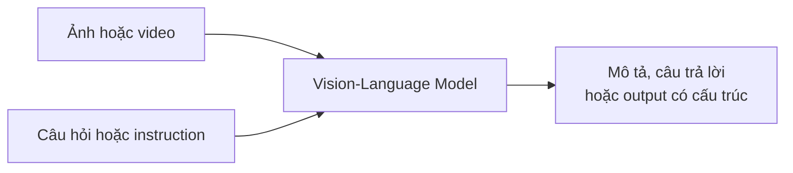
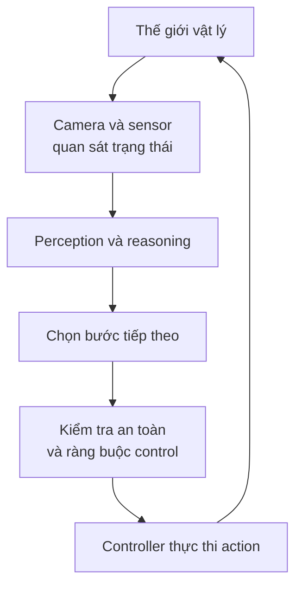
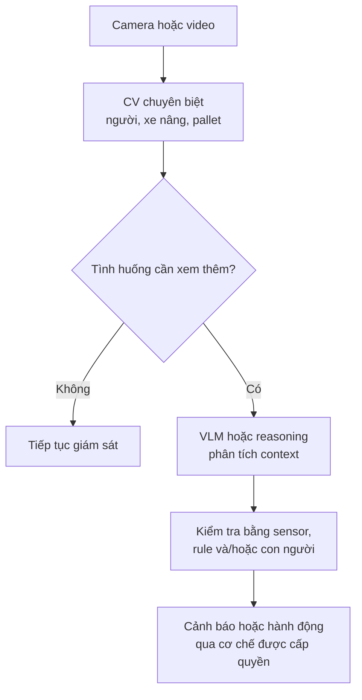

Một camera nhìn vào chiếc bàn. Trên đó có một chiếc cốc đặt sát mép. Detector có thể trả về `cup`, một bounding box và confidence 97%. Đó là kết quả hữu ích: hệ thống đã tìm được **vật gì ở đâu**.

Nhưng nếu hỏi "Có gì đáng chú ý?", ta mong một câu khác: "Chiếc cốc có vẻ gần mép bàn, nên có thể rơi nếu bị va chạm." Rồi nếu hỏi "Nên làm gì?", hệ thống có thể đề xuất di chuyển cốc vào trong.

Ba câu hỏi này không giống nhau:

| Câu hỏi | Năng lực cần thiết | Kết quả điển hình |
| --- | --- | --- |
| Có gì trong ảnh? | Perception | Nhãn, vị trí, mask |
| Tình huống có ý nghĩa gì? | Perception + ngôn ngữ + suy luận | Mô tả, quan hệ, rủi ro có thể có |
| Làm gì tiếp theo? | Lập kế hoạch + hành động + kiểm tra | Quyết định, robot action, feedback |

Đây là một cách nhìn về sự mở rộng của Computer Vision: từ **nhận biết pixel** sang **dùng thông tin thị giác để trả lời câu hỏi và, trong một số hệ thống, tác động lại thế giới**. Không có nghĩa mọi camera đều cần thành robot hay mọi model vision cũ đã lỗi thời.

## 1. Computer Vision chuyên biệt vẫn rất quan trọng

Classification nhận diện loại ảnh. Object detection cho biết vật thể và vị trí. Segmentation xác định vùng pixel. Pose estimation ước lượng những điểm và khớp quan trọng. Các output có cấu trúc này vẫn là nền tảng của inspection, robotics và nhiều hệ thống camera khác.

Một dây chuyền chỉ cần kiểm tra nắp chai đã đóng đúng chưa có thể dùng model chuyên biệt để trả về `PASS` hoặc `FAIL`. Nếu task rõ, dữ liệu được kiểm soát và throughput cao, hệ thống nhỏ, nhanh và dễ kiểm thử thường hợp lý hơn một VLM lớn được hỏi về từng frame.

Giới hạn của cách tiếp cận **mỗi task một output cố định** xuất hiện khi yêu cầu thay đổi. Model phân loại `scratch / no scratch` có thể rất tốt, nhưng câu hỏi "Vết xước gần cạnh pin có nghiêm trọng hơn không?" đòi thêm vị trí, context và tiêu chí đánh giá. Có thể ghép detector, classifier và rule engine để giải quyết. Điều đó vẫn hợp lý; chỉ là capability phải được thiết kế khá rõ từ trước.

## 2. Ngôn ngữ trở thành interface cho hình ảnh

Vision-Language Model (VLM) nhận thông tin thị giác cùng câu hỏi hoặc instruction bằng ngôn ngữ. Một ảnh kho hàng có thể được dùng để hỏi "Có bao nhiêu pallet?", "Lối đi có bị chắn không?" hoặc "Điểm nào cần nhân viên kiểm tra?" mà không cần tạo một classifier riêng cho từng cách đặt câu hỏi.

Đây là **interface linh hoạt hơn**, không phải lời hứa model luôn trả lời đúng. Cùng một ảnh có thể hỗ trợ nhiều câu hỏi, nhưng mỗi câu vẫn cần visual evidence phù hợp. Một ảnh tĩnh, chẳng hạn, không đủ để kết luận chắc chắn xe nâng *đang tiến tới* người công nhân; muốn nói về chuyển động cần video hoặc tín hiệu theo thời gian.

[NVIDIA mô tả Cosmos 3](https://research.nvidia.com/labs/cosmos-lab/cosmos3/) như một hướng kết hợp hình ảnh, video, ngôn ngữ và hành động để reasoning về quan hệ không gian, trạng thái vật thể và sự kiện. Đó là ví dụ cho việc visual information ngày càng được dùng bên ngoài một task gán nhãn cố định.

## 3. Nói được về cảnh chưa có nghĩa "hiểu" như con người

Một VLM có thể nói "Chiếc cốc gần mép bàn" nhưng cũng có thể thấy nhầm vật, đếm sai hoặc suy luận sai quan hệ trái-phải, trước-sau. [Nghiên cứu R-Bench công bố tại ICML 2024](https://proceedings.mlr.press/v235/wu24l.html) chỉ ra lỗi hallucination về **quan hệ giữa các vật thể** ở các large vision-language model được đánh giá. Vì vậy, câu mô tả nghe hợp lý chưa đủ làm bằng chứng rằng hệ thống đã nhận thức chính xác cảnh đó.

Ngay cả ví dụ chiếc cốc cũng có sự bất định. Từ một góc camera, mép bàn có thể bị che; ta chưa chắc biết khoảng cách trong 3D hay chiếc cốc có thực sự sắp rơi không. Một hệ thống nghiêm túc phải phân biệt **điều quan sát được** với **rủi ro được suy ra** và có thể yêu cầu thêm góc nhìn, depth hoặc xác nhận của con người.

Khoảng cách còn lớn hơn khi output không chỉ là câu chữ. Mô tả sai một vật thể gây ra câu trả lời sai; điều khiển cánh tay robot về phía vật thể sai có thể gây va chạm.

## 4. Từ VLM đến Vision-Language-Action

Giả sử người dùng nói "Bỏ lon nước vào thùng tái chế." VLM có thể mô tả lon ở đâu và thùng nào phù hợp. Robot còn cần biểu diễn hành động: tiếp cận, đặt gripper, nắm, di chuyển và thả. Sau mỗi bước, nó phải kiểm tra điều gì đã thực sự xảy ra.

**Vision-Language-Action (VLA)** là tên gọi cho hướng model kết hợp visual input và instruction để tạo ra **action representation** cho robot, thay vì chỉ trả lời bằng ngôn ngữ. Trong [RT-2 năm 2023](https://deepmind.google/blog/rt-2-new-model-translates-vision-and-language-into-action/), Google DeepMind mở rộng VLM bằng dữ liệu robotics và biểu diễn robot action thành token đầu ra. [Gemini Robotics](https://deepmind.google/blog/gemini-robotics-brings-ai-into-the-physical-world/) sau đó tiếp tục hướng vision + language → motor control.

| Thành phần | Input chính | Output điển hình |
| --- | --- | --- |
| Detector hoặc segmentation model | Ảnh | Nhãn, box, mask |
| VLM | Ảnh/video + ngôn ngữ | Câu trả lời, mô tả, output có cấu trúc |
| VLA | Quan sát + instruction + có thể cả robot state | Action representation hoặc motor command |

Đây là cách phân biệt **vai trò**, không phải ranh giới cứng. Một VLM có thể đưa ra kế hoạch hoặc gọi tool; một VLA có thể có bước reasoning nội bộ. Và model action vẫn phải hoạt động trong một hệ thống có actuator, controller cùng cơ chế an toàn.

## 5. Hành động là một vòng lặp, không phải một câu trả lời

Trong thế giới vật lý, vị trí của vật thay đổi sau mỗi lần chạm. Gripper có thể trượt. Người có thể đi vào vùng làm việc. Do đó robot cần quan sát lại và điều chỉnh, chứ không chỉ chạy một chuỗi lệnh được viết từ ảnh đầu tiên.

Tùy robot và task, hệ thống có thể cần depth, LiDAR, trạng thái khớp, force sensing, ước lượng 3D, kinematics và collision checking. Không thể suy ra một thao tác nắm an toàn chỉ từ câu "Tôi thấy chiếc cốc."

[Google DeepMind mô tả](https://deepmind.google/models/gemini-robotics/embodied-reasoning/) Gemini Robotics ER 2 như model reasoning cấp cao cho hiểu không gian và lập kế hoạch nhiều bước, sau đó giao phần motor execution cho VLA cấp thấp hơn. Đó là **một thiết kế cụ thể**, không phải sơ đồ bắt buộc cho mọi robot. DeepMind cũng nhấn mạnh [an toàn semantic, physical và operational](https://deepmind.google/models/gemini-robotics/responsibly-advancing-ai-and-robotics/) như những lớp cần phối hợp khi AI hành động ngoài đời.

## 6. Ví dụ ở nhà máy: nhìn thấy nguy cơ chưa đủ để tự động can thiệp

Hãy tưởng tượng **một tình huống minh họa**, không phải deployment cụ thể: camera quan sát người công nhân, pallet và xe nâng. Detector nhận ra từng đối tượng. Video hoặc sensor thời gian giúp ước lượng hướng di chuyển. VLM có thể diễn đạt giả thuyết "Pallet che một phần tầm nhìn giữa người và xe nâng." Một lớp quyết định riêng cân nhắc rủi ro và luật vận hành.

Nếu được thiết kế để hành động, hệ thống có thể phát cảnh báo hoặc đề xuất giảm tốc. Nhưng **quyền điều khiển xe nâng không nên được suy ra từ một câu trả lời VLM**. Nó cần sensor đáng tin, ngưỡng an toàn, controller được kiểm chứng và quy trình xử lý khi model không chắc chắn.

Đây là một **kiến trúc minh họa**, không phải khuyến nghị triển khai nguyên xi. Nó cho thấy model nhỏ có thể xử lý phần thường nhật; model linh hoạt hơn chỉ được gọi khi cần. Không phải mọi camera đều phải trở thành Agent.

## 7. World Model bổ sung câu hỏi "Điều gì xảy ra nếu...?"

Ở [bài trước về World Models](../what-are-world-models-vi/), ta hỏi AI có thể dự đoán tình huống sau một hành động hay không. Trong robotics, câu hỏi ấy trở nên cụ thể: "Nếu đẩy chiếc hộp sang trái, nó sẽ đi đâu và có va vào thứ khác không?"

World model có thể mô phỏng hoặc ước lượng **trạng thái tương lai có thể xảy ra**. [NVIDIA Cosmos 3](https://research.nvidia.com/labs/cosmos-lab/cosmos3/) là một ví dụ nghiên cứu kết nối visual reasoning, world generation và action. Nhưng dự đoán cũng có sai số; simulation không thay thế việc quan sát, kiểm tra và kiểm soát rủi ro trong thế giới thật.

Có thể nhớ nhanh bằng những câu hỏi:

| Lớp năng lực | Câu hỏi |
| --- | --- |
| CV chuyên biệt | "Trong cảnh có gì và ở đâu?" |
| VLM | "Cảnh đó có thể có ý nghĩa gì với yêu cầu này?" |
| World model | "Nếu làm A, điều gì có thể xảy ra tiếp?" |
| VLA hoặc policy | "Nên tạo action nào?" |
| Controller + feedback | "Thực thi và kiểm tra action đã thành công chưa?" |

Các lớp này **có thể nằm trong cùng model hoặc nhiều thành phần khác nhau**. Bảng chỉ là mental model để không đánh đồng một câu trả lời về hình ảnh với khả năng điều khiển robot.

## "Nhìn thấy" vẫn là bước đầu tiên

Computer Vision không biến mất khi VLM và VLA phát triển. Detector nhanh, segmentation ổn định và geometry chính xác vẫn hữu ích, đặc biệt khi task hẹp và cần kiểm thử chặt chẽ. Ngôn ngữ cho ta interface linh hoạt hơn để đặt câu hỏi về visual evidence. Robotics thêm câu hỏi khó hơn: làm sao biến nhận định thành action **an toàn và có thể sửa sai**.

Vì vậy, hướng phát triển không đơn giản là `image → label` được thay bằng `image → robot action`. Nó là một vòng lặp rộng hơn: **quan sát → suy luận → quyết định → hành động → quan sát lại**. Không phải ứng dụng nào cũng cần đi hết vòng lặp, nhưng khả năng nối các phần ấy đang mở rộng phạm vi của visual AI.

## Nguồn tham khảo

- [RT-2: New model translates vision and language into action - Google DeepMind](https://deepmind.google/blog/rt-2-new-model-translates-vision-and-language-into-action/)
- [Gemini Robotics brings AI into the physical world - Google DeepMind](https://deepmind.google/blog/gemini-robotics-brings-ai-into-the-physical-world/)
- [Gemini Robotics ER 2 - Google DeepMind](https://deepmind.google/models/gemini-robotics/embodied-reasoning/)
- [Cosmos 3: Omnimodal World Models for Physical AI - NVIDIA Research](https://research.nvidia.com/labs/cosmos-lab/cosmos3/)
- [Evaluating and Analyzing Relationship Hallucinations in Large Vision-Language Models - ICML 2024](https://proceedings.mlr.press/v235/wu24l.html)
- [Responsibly advancing AI and robotics - Google DeepMind](https://deepmind.google/models/gemini-robotics/responsibly-advancing-ai-and-robotics/)
