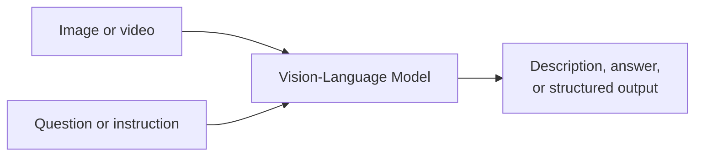
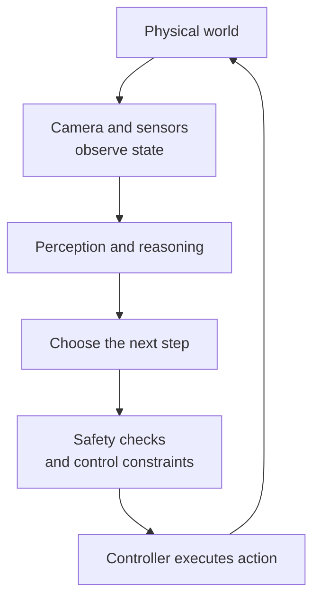
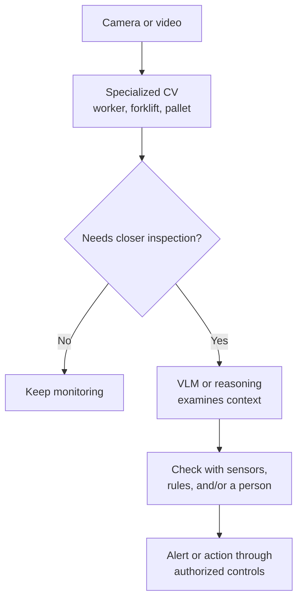

A camera looks at a table. A cup sits near its edge. An object detector may return `cup`, a bounding box, and 97% confidence. That is useful: the system has found **what is where**.

But ask "What matters here?" and we want a different answer: "The cup appears close to the edge, so it might fall if bumped." Ask "What should happen next?" and the system might suggest moving it farther onto the table.

These are three different questions:

| Question | Capability needed | Typical result |
| --- | --- | --- |
| What is in the image? | Perception | Labels, positions, masks |
| What does the situation mean? | Perception + language + reasoning | Description, relationships, possible risks |
| What should happen next? | Planning + action + verification | Decision, robot action, feedback |

This is one way to understand the expanding scope of Computer Vision: from **recognizing pixels** to **using visual evidence to answer questions and, in some systems, affect the world**. It does not mean every camera needs to become a robot or older vision models are obsolete.

## 1. Specialized Computer Vision still matters

Classification identifies an image category. Object detection returns objects and locations. Segmentation identifies pixel regions. Pose estimation predicts important points or joints. These structured outputs remain foundations for inspection, robotics, and many camera systems.

A production line that only needs to check whether a bottle cap is properly closed may use a specialized model returning `PASS` or `FAIL`. When the task is narrow, the data is controlled, and throughput matters, a smaller, faster, easier-to-test system may be more appropriate than asking a large VLM about every frame.

The limitation of **one fixed output per task** appears when requirements change. A `scratch / no scratch` classifier may be excellent, but "Is a scratch near the battery edge more serious?" requires location, context, and evaluation criteria. A team can combine a detector, classifier, and rule engine to answer it. That can be the right design; it simply means these capabilities need to be defined fairly explicitly in advance.

## 2. Language becomes an interface to images

A Vision-Language Model (VLM) takes visual input along with a question or instruction in language. The same warehouse photo might support "How many pallets are there?", "Is the aisle blocked?", and "What should an employee inspect?" without training a separate classifier for every wording.

That is a **more flexible interface**, not a promise of correct answers. One image can support many questions, but each answer still needs sufficient visual evidence. A still image, for example, is not enough to conclude with certainty that a forklift *is moving toward* a worker; motion requires video or another time-based signal.

[NVIDIA describes Cosmos 3](https://research.nvidia.com/labs/cosmos-lab/cosmos3/) as a direction that brings images, video, language, and actions together to reason about spatial relationships, object states, and events. It illustrates how visual information is being used beyond a single fixed-label task.

## 3. Describing a scene is not human-like understanding

A VLM might say "The cup is near the table edge," but it can also invent an object, count incorrectly, or misread a left-right or front-back relationship. [R-Bench research published at ICML 2024](https://proceedings.mlr.press/v235/wu24l.html) documents **relationship hallucinations** in the large vision-language models it evaluated. A plausible-sounding description therefore does not prove the scene was perceived correctly.

Even the cup example contains uncertainty. The table edge might be obscured from one camera angle; we may not know the 3D distance or whether the cup is actually about to fall. A serious system should distinguish **what it observed** from **a risk it inferred** and may need another view, depth data, or human confirmation.

The gap becomes larger when the output is not just words. Misdescribing an object produces a wrong answer; moving a robot arm toward the wrong object could cause a collision.

## 4. From VLM to Vision-Language-Action

Suppose a user says, "Put the can in the recycling bin." A VLM can describe where the can is and which bin is appropriate. A robot needs more: an action representation for approaching, positioning its gripper, grasping, moving, and releasing. It must also check what actually happened after each step.

**Vision-Language-Action (VLA)** names the approach of combining visual input and instructions to produce an **action representation** for a robot rather than only a language response. In [RT-2 in 2023](https://deepmind.google/blog/rt-2-new-model-translates-vision-and-language-into-action/), Google DeepMind extended a VLM with robotics data and represented robot actions as output tokens. [Gemini Robotics](https://deepmind.google/blog/gemini-robotics-brings-ai-into-the-physical-world/) continued the direction of vision + language → motor control.

| Component | Main input | Typical output |
| --- | --- | --- |
| Detector or segmentation model | Image | Label, box, mask |
| VLM | Image/video + language | Answer, description, structured output |
| VLA | Observation + instruction + possibly robot state | Action representation or motor command |

These are **roles**, not rigid boundaries. A VLM may plan or call tools; a VLA may include internal reasoning. An action model also needs to operate inside a system with actuators, controllers, and safety mechanisms.

## 5. Action is a loop, not a single answer

In the physical world, objects move after contact. A gripper may slip. A person may enter the workspace. The robot therefore needs to observe again and adjust, not simply execute a sequence of commands written from its first image.

Depending on the robot and task, the system may need depth, LiDAR, joint state, force sensing, 3D estimation, kinematics, and collision checking. A safe grasp cannot be inferred from "I see the cup" alone.

[Google DeepMind describes](https://deepmind.google/models/gemini-robotics/embodied-reasoning/) Gemini Robotics ER 2 as a high-level model for spatial understanding and multi-step planning that hands motor execution to a lower-level VLA. That is **one specific design**, not a mandatory diagram for every robot. DeepMind also emphasizes [semantic, physical, and operational safety](https://deepmind.google/models/gemini-robotics/responsibly-advancing-ai-and-robotics/) as layers that must work together when AI acts in the world.

## 6. A factory example: noticing risk is not permission to intervene

Imagine **a hypothetical scenario**, not a particular deployment: a camera observes a worker, a pallet, and a forklift. A detector identifies each object. Video or time-based sensors help estimate movement. A VLM might raise the hypothesis "The pallet partially blocks the view between the worker and forklift." A separate decision layer considers risk and operating rules.

If the system is designed to act, it might issue an alert or propose slowing down. But **control of the forklift should not follow from a VLM sentence alone**. It requires reliable sensors, safety thresholds, a validated controller, and a procedure for uncertainty.

This is an **illustrative architecture**, not a deployment recipe. A small model can handle routine work, while a more flexible model is used when needed. Not every camera should become an Agent.

## 7. A World Model adds the question "What if...?"

In the [earlier article on World Models](../what-are-world-models/), we asked whether AI could predict what follows an action. In robotics, that becomes concrete: "If I push this box left, where might it go, and could it hit something?"

A world model can simulate or estimate **possible future states**. [NVIDIA Cosmos 3](https://research.nvidia.com/labs/cosmos-lab/cosmos3/) is a research example connecting visual reasoning, world generation, and action. Predictions remain imperfect, though; simulation cannot replace observation, verification, or risk control in the real world.

A compact way to remember the roles:

| Capability | Question |
| --- | --- |
| Specialized CV | "What is in the scene, and where?" |
| VLM | "What might this scene mean for the request?" |
| World model | "If we do A, what might happen next?" |
| VLA or policy | "What action should be produced?" |
| Controller + feedback | "Execute it, then check whether it worked." |

These capabilities **may live in one model or several components**. The table is a mental model to keep an answer about an image distinct from reliable robot control.

## Seeing is still the first step

Computer Vision does not disappear as VLMs and VLAs improve. Fast detectors, stable segmentation, and accurate geometry remain useful, especially for narrow tasks that demand careful validation. Language offers a more flexible way to ask questions about visual evidence. Robotics adds the harder problem: turning a conclusion into **safe, recoverable action**.

The shift is not simply replacing `image → label` with `image → robot action`. It is a wider loop: **observe → reason → decide → act → observe again**. Not every application needs the whole loop, but connecting its parts is expanding what visual AI can do.

## References

- [RT-2: New model translates vision and language into action - Google DeepMind](https://deepmind.google/blog/rt-2-new-model-translates-vision-and-language-into-action/)
- [Gemini Robotics brings AI into the physical world - Google DeepMind](https://deepmind.google/blog/gemini-robotics-brings-ai-into-the-physical-world/)
- [Gemini Robotics ER 2 - Google DeepMind](https://deepmind.google/models/gemini-robotics/embodied-reasoning/)
- [Cosmos 3: Omnimodal World Models for Physical AI - NVIDIA Research](https://research.nvidia.com/labs/cosmos-lab/cosmos3/)
- [Evaluating and Analyzing Relationship Hallucinations in Large Vision-Language Models - ICML 2024](https://proceedings.mlr.press/v235/wu24l.html)
- [Responsibly advancing AI and robotics - Google DeepMind](https://deepmind.google/models/gemini-robotics/responsibly-advancing-ai-and-robotics/)
