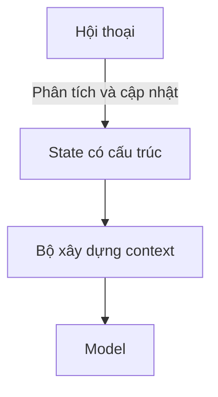

Prompt engineering hỏi cách diễn đạt chỉ dẫn. Context engineering đặt ra câu hỏi rộng hơn:

> **Để đưa ra quyết định này, model cần thấy thông tin nào, dưới dạng gì và vào lúc nào?**

Cách đặt vấn đề đó hữu ích hơn khi xây hệ thống LLM cho production.

## Context window là không gian làm việc có giới hạn

Model có context window hữu hạn. Trong khoảng đó, ứng dụng có thể phải đặt:

- chính sách của hệ thống;
- yêu cầu của người dùng;
- lịch sử hội thoại;
- state của workflow;
- bằng chứng truy xuất được;
- kết quả từ tools;
- memory;
- ràng buộc về đầu ra.

Thêm nhiều thông tin không phải lúc nào cũng tốt. Context không liên quan làm tăng chi phí, có thể khiến chỉ dẫn quan trọng bị loãng và đưa thêm những thông tin mâu thuẫn.

## Các phần context có mức độ tin cậy khác nhau

Không nên xem mọi token đều đáng tin như nhau.

Một kiến trúc hữu ích phân biệt:

- chính sách của sản phẩm hoặc hệ thống;
- state có cấu trúc đã được xác minh;
- tài liệu nguồn được truy xuất;
- thông tin do người dùng cung cấp;
- giả thuyết do model tạo ra.

Trộn tất cả vào một bản ghi hội thoại không cấu trúc sẽ khiến việc xác định nguồn gốc và kiểm soát trở nên khó hơn.

## State không phải lịch sử hội thoại

Một workflow có thể cần biết cửa hàng đã chọn, khoảng ngày, loại báo cáo hoặc ý định đã xác nhận. Những dữ kiện này thường nên nằm trong **state tường minh**, thay vì mỗi lượt lại suy ra từ toàn bộ đoạn chat.

Cách này giảm bớt sự mơ hồ có thể tránh được.

## Chỉ retrieval khi cần

Không phải câu hỏi nào cũng cần RAG. Không phải kết quả gọi tool nào cũng cần đưa vào context. Context engineering gồm cả việc quyết định **có cần nguồn thông tin đó không**, trước khi quyết định đưa nó vào bằng cách nào.

Điều này có thể giảm latency và tránh để bằng chứng không liên quan lái câu trả lời đi sai hướng.

## Nén thông tin luôn làm mất một phần nội dung

Hội thoại và tài liệu dài có thể cần được tóm tắt. Một bản tóm tắt giữ lại một số ý và bỏ đi những ý khác.

Vì vậy, cách nén tốt phụ thuộc vào mục đích sử dụng về sau. Bản tóm tắt chung chung có thể đánh mất ngày tháng chính xác, quyết định đã chốt hoặc vấn đề chưa giải quyết mà workflow vẫn cần.

Memory có cấu trúc và bản tóm tắt theo đúng nhiệm vụ thường an toàn hơn việc liên tục nén văn bản tùy ý.

## Cần quan sát được cách context được lắp ráp

Khi câu trả lời sai, kỹ sư nên có thể kiểm tra:

- Chỉ dẫn nào đã có mặt?
- State nào được giữ từ bước trước?
- Bằng chứng nào đã được truy xuất?
- Kết quả tool nào được đưa vào?
- Thông tin nào bị bỏ vì hết ngân sách context?

Thiếu dấu vết này, team dễ phản ứng bằng cách viết prompt dài hơn và hy vọng hành vi sẽ tốt lên.

## Context engineering là một bài toán kiến trúc

Khi ứng dụng LLM trở nên phức tạp hơn, phần khó dịch chuyển từ việc viết một prompt hoàn hảo sang phối hợp nhiều nguồn thông tin quanh model.

Model vẫn quan trọng, nhưng chính ứng dụng quyết định model được nhìn thấy phần nào của thực tế.
