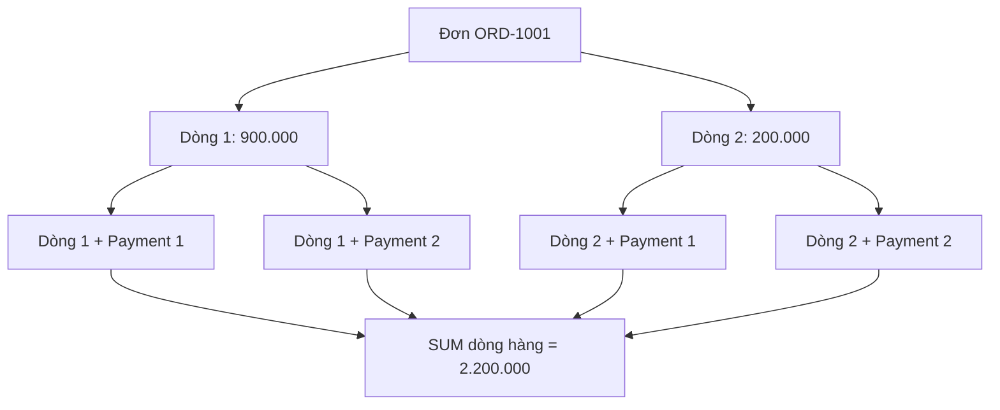
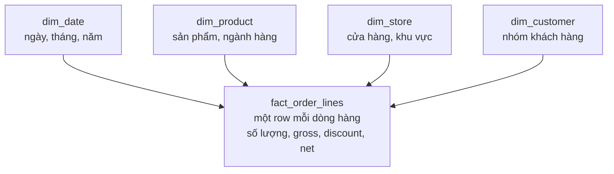

*Dữ liệu đơn hàng, thanh toán và sản phẩm đều đầy đủ. Pipeline chạy thành công. Nhưng khi JOIN các bảng, doanh số lại tăng gấp đôi. Nguồn dữ liệu không sai; mô hình phân tích đã hiểu sai ý nghĩa của mỗi row.*

## 1. Khi phép JOIN đúng nhưng con số sai

Xét đơn hàng `ORD-1001`. Nó có hai dòng sản phẩm trị giá 900.000 và 200.000 đồng, cùng hai giao dịch thanh toán thành công trị giá 700.000 và 400.000 đồng. Tổng dòng hàng và tổng thanh toán đều bằng **1.100.000 đồng**.

Giờ chạy:

```sql
SELECT
    o.id AS order_id,
    SUM(oi.net_amount) AS sales_amount
FROM orders o
JOIN order_items oi ON oi.order_id = o.id
JOIN payments p ON p.order_id = o.id
WHERE p.status = 'paid'
GROUP BY o.id;
```

Kết quả có thể là **2.200.000 đồng**. Mỗi dòng hàng khớp với cả hai payments, tạo thành bốn rows sau JOIN. PostgreSQL làm đúng phép JOIN được yêu cầu; chính phép tổng hợp đã đếm mỗi dòng hàng hai lần.



Đây là **Join Fanout**: hai quan hệ one-to-many cùng được JOIN qua một đơn hàng mà không kiểm soát Cardinality. Tổng hợp trước khi JOIN là một cách sửa SQL hợp lý. Nhưng khi báo cáo ngày càng nhiều, ta còn cần Data Model thể hiện rõ Grain và những phép tổng hợp hợp lệ.

## 2. Modeling bắt đầu từ ý nghĩa, không phải danh sách cột

Transactional Schema được thiết kế để quản lý đúng đơn hàng, dòng hàng, sản phẩm và thanh toán. Analytics lại hỏi doanh số theo ngành hàng và tháng, sản phẩm lợi nhuận thấp hay hiệu quả từng khu vực. Schema vận hành được chuẩn hóa tốt không tự động là mô hình phân tích tốt.

Dimensional Modeling hỏi:

1. Ta đang đo **Business Process** nào?
2. **Một row** trong dữ liệu phân tích đại diện cho điều gì?
3. Người dùng sẽ phân tích theo những **Dimensions** nào?

Cách tiếp cận của Kimball xác định Process, Grain, Dimensions và Facts trước khi điền cột vào bảng. Điểm xuất phát là ý nghĩa dữ liệu.

## 3. Grain là hợp đồng của Fact Table

**Grain** xác định chính xác một row đại diện cho điều gì. Với Sales, Grain có thể là một đơn hàng, một dòng hàng, một sản phẩm mỗi ngày hoặc một cửa hàng mỗi tháng. Mỗi lựa chọn trả lời câu hỏi khác nhau.

Giả sử `fact_order_lines` có **một row cho mỗi dòng sản phẩm của đơn hàng**:

| order_line_id | order_id | product_id | net_amount |
| :--- | :--- | :--- | ---: |
| LINE-01 | ORD-1001 | PROD-01 | 900.000 |
| LINE-02 | ORD-1001 | PROD-02 | 200.000 |

Muốn tính doanh số theo đơn:

```sql
SELECT order_id, SUM(net_amount) AS sales_amount
FROM fact_order_lines
GROUP BY order_id;
```

Nhưng `COUNT(*)` đếm **dòng hàng**, không đếm đơn. Đếm đơn có thể cần `COUNT(DISTINCT order_id)` hoặc một Fact khác ở Order Grain. Bảng tên `sales` không cho biết Grain. **Grain là hợp đồng về ý nghĩa mỗi row; Measures và Dimensions phải phù hợp với hợp đồng đó.**

## 4. Fact và Dimension tạo nên Star Schema

**Fact Tables** ghi nhận Events, Measurements hoặc Snapshots. Hệ thống có thể có `fact_order_lines`, `fact_payments`, `fact_refunds`, `fact_inventory_daily`, mỗi bảng một Grain riêng. **Dimension Tables** mô tả ngữ cảnh dùng để nhóm và lọc: ngành hàng, khu vực cửa hàng, ngày kinh doanh hoặc nhóm khách hàng được phép phân tích.

Với Fact ở Order-Line Grain:



Fact nằm giữa, Dimensions bao quanh, nên gọi là *Star Schema*. Lợi ích không chỉ ở tốc độ: bảng được tổ chức gần câu hỏi nghiệp vụ hơn, thay vì buộc mỗi người làm báo cáo tự dựng lại toàn bộ Operational Schema. Tuy nhiên, hình ngôi sao không tự ngăn phép JOIN hay Metric Definition sai.

## 5. Đừng JOIN Facts chỉ vì chúng có chung khóa

`fact_order_lines` có một row cho mỗi dòng hàng. `fact_payments` có một row cho mỗi Transaction thanh toán. JOIN trực tiếp theo `order_id` sẽ tái tạo Fanout. Hãy tổng hợp mỗi Fact về **cùng Grain kết quả**, chẳng hạn một row cho mỗi đơn:

```sql
WITH sales_by_order AS (
    SELECT order_id, SUM(net_amount) AS sales_amount
    FROM fact_order_lines
    GROUP BY order_id
),
payments_by_order AS (
    SELECT order_id, SUM(amount) AS paid_amount
    FROM fact_payments
    WHERE status = 'paid'
    GROUP BY order_id
)
SELECT
    s.order_id,
    s.sales_amount,
    COALESCE(p.paid_amount, 0) AS paid_amount
FROM sales_by_order s
LEFT JOIN payments_by_order p ON p.order_id = s.order_id;
```

Hai phía giờ đều không có nhiều rows cho một `order_id`, nên không bị nhân số rows. Nhưng hai Measures không nhất thiết luôn bằng nhau: đơn có thể thanh toán một phần, hoàn tiền sau đó hoặc được điều chỉnh. Căn chỉnh Grain tránh một loại lỗi; Business Definition mới quyết định con số có cần đối soát bằng nhau không.

## 6. Không phải Measure nào cũng có thể SUM

- **Additive:** số lượng và doanh số có cùng định nghĩa thường có thể cộng qua các Dimensions phù hợp, nếu Facts không bị nhân đôi.
- **Semi-additive:** tồn kho có thể cộng qua sản phẩm hoặc cửa hàng ở **cùng thời điểm**, nhưng không cộng tùy tiện các Daily Snapshots. Tồn kho 100 ngày thứ Hai và 90 ngày thứ Ba không phải 190 sản phẩm tồn.
- **Non-additive:** tỷ lệ như Margin Rate không thể cộng hoặc lấy trung bình đơn giản giữa các nhóm.

Ví dụ, cửa hàng A có doanh thu 100, lợi nhuận 20 nên Margin là 20%. Cửa hàng B có doanh thu 900, lợi nhuận 90 nên Margin là 10%. Trung bình không trọng số của hai tỷ lệ là 15%, nhưng Margin chung là `(20 + 90) / (100 + 900) = 11%`.

Khi có thể, hãy lưu các thành phần Additive như doanh thu và lợi nhuận, tổng hợp chúng về phạm vi cần phân tích, **rồi mới tính tỷ lệ**. Mô hình tốt cho người dùng biết Measure nào được tổng hợp thế nào, không chỉ cho biết nó nằm ở đâu.

## 7. Slowly Changing Dimensions giữ đúng lịch sử cần thiết

Giả sử `PROD-02` thuộc **Accessories** vào tháng 8, rồi chuyển sang **Lifestyle** vào tháng 9. Nếu `dim_product` chỉ giữ ngành hàng hiện tại, báo cáo tháng 8 khi chạy lại sẽ xếp giao dịch cũ vào Lifestyle. Điều đó đúng hay sai phụ thuộc câu hỏi. "Ngành hàng tại thời điểm bán" khác với "phân loại lại toàn bộ lịch sử theo ngành hàng hôm nay".

**SCD Type 1** ghi đè thuộc tính cũ. Nó phù hợp để sửa lỗi chính tả hoặc khi chỉ cần phân loại hiện tại. **SCD Type 2** tạo phiên bản Dimension mới cho thay đổi cần giữ lịch sử:

| product_key | product_id | category | valid_from | valid_to |
| ---: | :--- | :--- | :--- | :--- |
| 201 | PROD-02 | Accessories | 2026-01-01 | 2026-09-01 |
| 202 | PROD-02 | Lifestyle | 2026-09-01 | NULL |

Với quy ước khoảng nửa mở, row có hiệu lực khi `valid_from <= event_time < valid_to`; bản hiện tại có `valid_to = NULL` cần xử lý riêng. Fact tháng 8 có thể tham chiếu `product_key = 201`, còn Fact từ tháng 9 là `202`.

**Đừng** chỉ JOIN Fact với Type 2 Dimension theo `product_id`: một giao dịch có thể khớp cả hai phiên bản và bị tính đôi. Hãy chọn đúng phiên bản theo thời gian nghiệp vụ rồi lưu Surrogate Key trong Fact, hoặc thực hiện Temporal Join có kiểm soát, với các khoảng hiệu lực không chồng nhau.

## 8. Vì sao cần Surrogate Key?

`product_id` là **Business Key** nhận diện sản phẩm. `product_key` là **Surrogate Key** nhận diện một Dimension Row cụ thể. Một sản phẩm giữ cùng Business ID nhưng có thể có nhiều phiên bản lịch sử.

Surrogate Keys còn giúp Warehouse độc lập hơn với quy tắc định danh của nguồn. Nếu hai hệ thống sau sáp nhập cùng dùng một `product_id` cho hai mặt hàng khác nhau, Warehouse có thể cần thêm `source_system` vào Business Key hoặc một quy trình chuẩn hóa Identity. Surrogate Key không thay thế việc theo dõi những phiên bản nào thuộc cùng một Business Entity.

## 9. Facts và Dimensions đến muộn

Một giao dịch bán hàng có thể đến Warehouse trước Product Dimension tương ứng. Có thể giữ Fact lại để chờ, hoặc liên kết với Dimension Member **Unknown / Not Yet Available** rồi sửa liên kết sau. Lựa chọn này đánh đổi Freshness với Completeness; Unknown không được ngụy trang thành một ngành hàng thật.

Transaction cũng có thể đến muộn. Payment thực hiện ngày 31/8 nhưng được ingest ngày 3/9 thì báo cáo theo `paid_at` phải tính vào tháng 8, không phải tháng 9. Aggregate tháng 8 đã công bố có thể cần tính lại. Hãy phân biệt:

| Thời gian | Ý nghĩa |
| :--- | :--- |
| Event Time | Khi sự kiện nghiệp vụ diễn ra. |
| Ingestion Time | Khi Pipeline nhận dữ liệu. |
| Processing Time | Khi Pipeline biến đổi hoặc công bố dữ liệu. |

Các thời điểm này trả lời câu hỏi khác nhau. Báo cáo tháng kinh doanh thường dựa vào Event Time; giám sát Pipeline Lag lại cần những mốc sau. Muốn tái hiện chính xác "chúng ta biết gì tại thời điểm quá khứ" có thể cần Temporal Modeling phức tạp hơn một cột `updated_at`.

## 10. dbt Snapshots và Incremental Models hỗ trợ gì?

**dbt Snapshots** có thể lưu những phiên bản đã quan sát của bảng nguồn thay đổi theo thời gian, với metadata như `dbt_valid_from` và `dbt_valid_to`. Chúng thường phục vụ lịch sử kiểu Type 2. Nhưng Snapshot theo lịch chỉ ghi được những trạng thái nó *nhìn thấy*: nếu nguồn đổi nhiều lần giữa hai lần chạy và không lưu history, các trạng thái trung gian có thể mất. CDC hoặc Event History phù hợp hơn khi cần theo dõi mọi chuyển trạng thái ấy.

**dbt Incremental Models** tránh xây lại Target lớn trong mỗi lần chạy. Ví dụ tối giản:

```sql
{{ config(materialized='incremental', unique_key='order_line_id') }}

SELECT order_line_id, order_id, product_key, net_amount, updated_at
FROM {{ ref('int_order_lines') }}


WHERE updated_at >= (
    SELECT COALESCE(MAX(updated_at), TIMESTAMP '1900-01-01')
    FROM {{ this }}
)

```

Đây là minh họa, **không phải chính sách Change Capture đủ dùng cho Production**. `unique_key` nhận diện Target Row cho những Incremental Strategies có thể cập nhật; nó không tự xử lý Late Updates, Deletes, Timestamps bằng nhau hay thứ tự nguồn. Production có thể cần Overlap Window, Change Position, Backfill và Reconciliation. Nếu phép JOIN trong Model nhân đôi Facts, Incremental Processing chỉ tạo dữ liệu sai nhanh hơn.

## 11. Xây Data Mart theo câu hỏi thực tế

Khi có Atomic Facts và Dimensions, những truy vấn Dashboard lặp lại có thể cần Aggregate như:

```text
mart_daily_store_sales
  business_date
  store_key
  gross_sales
  discount_amount
  net_sales
  order_count
  units_sold
```

Grain của Mart này là **một row cho mỗi ngày kinh doanh và cửa hàng**. Có thể tổng hợp tiếp thành số theo tháng nếu Measure và định nghĩa cho phép. Không thể suy ra doanh số theo sản phẩm từ Mart đã bỏ chi tiết sản phẩm. Hãy giữ Atomic Facts để linh hoạt, rồi xây Aggregate Marts theo nhu cầu truy vấn đã đo.

Tránh một bảng khổng lồ chứa mọi KPI. Sales ở Order-Line Grain, Inventory ở Product-Store-Day Snapshot Grain và số đơn ở Order Grain không thể ép phẳng an toàn nếu thiếu quy tắc JOIN và Aggregation rõ ràng.

## 12. Conformed Dimensions nối các Business Processes

Sales, Inventory và Marketing Marts đều có thể phân tích theo cửa hàng, sản phẩm. Nếu một Mart đặt khu vực là `North`, Mart khác gọi `Northern Region`, việc so sánh trở nên mơ hồ. **Conformed Dimensions** giữ các thuộc tính chung có miền giá trị và ý nghĩa nhất quán giữa những Business Processes.

Chúng không biến Grain của các Facts thành giống nhau. Sales vẫn có thể theo Order Line, còn Inventory theo Daily Snapshot. Muốn so sánh, hãy tổng hợp riêng mỗi Fact về các Dimensions chung và Grain so sánh, rồi kết hợp kết quả. Conformed Dimension tạo ngữ cảnh chung, không phải giấy phép để JOIN trực tiếp Fact với Fact.

## 13. Semantic Layer vẫn có việc cần làm

Một Mart có `net_sales` và `order_count`. Dashboard A tính **Average Order Value** bằng `net_sales / order_count`. Dashboard B lấy trung bình AOV hằng ngày để ra AOV tháng. Hai kết quả có thể khác vì cách thứ hai không tính trọng số. AOV tháng thông thường phải lấy **tổng phù hợp trong tháng** theo cùng định nghĩa số đơn được tính.

Semantic Layer có thể tập trung hóa định nghĩa Metrics và Dimensions được phép sử dụng cho BI Tools, APIs. Project nhỏ cũng có thể quản lý các định nghĩa ấy trong SQL Models hoặc Code có Test. Điều cốt yếu là không để mỗi Consumer tự quyết định ý nghĩa riêng cho cùng một KPI.

## 14. Kiểm thử những cam kết của Model

Test đúng Grain đã khai báo. Nếu `fact_order_lines` có một row cho mỗi `order_line_id`, truy vấn sau phải trả về rỗng:

```sql
SELECT order_line_id, COUNT(*) AS row_count
FROM fact_order_lines
GROUP BY order_line_id
HAVING COUNT(*) > 1;
```

Kiểm tra thêm `product_key` nhận diện duy nhất Dimension Row; `product_id` ở Type 2 có thể lặp hợp lệ. Với mỗi sản phẩm, các khoảng hiệu lực không được chồng nhau và chỉ nên có tối đa một bản hiện hành. Xác minh Foreign Keys của Fact tìm được Dimension hoặc Unknown Member đã định nghĩa. Đối soát tổng Fact với Mart theo **cùng kỳ, phạm vi và định nghĩa Metric**.

Thêm Regression Cases cho những nơi dễ sai: hai dòng hàng và hai payments trong cùng đơn, sản phẩm đổi ngành hàng, payment đến muộn, refund, chạy lại Incremental Model và Fact đến trước Dimension. Schema Validation đơn thuần không nhận ra `SUM` đã bị nhân đôi.

## 15. Một trình tự Modeling thực tế

1. Bắt đầu từ câu hỏi nghiệp vụ và xác định Processes như Sales, Payments, Refunds, Inventory.
2. Khai báo Grain của từng Fact **trước khi** chọn Measures và Dimensions.
3. Định nghĩa Measures, cách tổng hợp chúng và những Dimensions dùng chung.
4. Quyết định thuộc tính Dimension nào cần giữ lịch sử và xử lý Late Data thế nào.
5. Xây Atomic Facts trước, sau đó tạo Aggregates cho Workloads đã chứng minh nhu cầu.
6. Test Grain, Relationships, Reconciliation và các Business Edge Cases.
7. Đo Query Latency, Transformation Cost, Freshness và giá trị của mỗi Mart mới.

Model đúng logic nhưng chạy quá chậm có thể cần tối ưu. Bảng rất nhanh nhưng tạo con số không đáng tin cũng không phải thiết kế tốt.

## 16. Những sai lầm thường gặp

- Không định nghĩa Grain rồi coi Line Count là Order Count.
- JOIN trực tiếp Facts có Grain khác nhau và nhân đôi Measures.
- Chỉ lưu Dimension Attributes hiện tại khi báo cáo cần diễn giải theo lịch sử.
- Dùng Type 2 nhưng JOIN theo Business Key mà không chọn phiên bản.
- Cộng các Ratios hoặc Inventory Snapshots qua thời gian.
- Chỉ công bố Marts quá thô rồi mất chi tiết cho câu hỏi mới.
- Dùng Incremental Models nhưng không xử lý Late Changes và Deletes.
- Để mỗi Dashboard tự định nghĩa cùng một KPI.

Dùng Star Schema không tự làm dữ liệu đúng. Grain, Business Meaning, Relationships và chính sách lịch sử mới thực hiện công việc đó.

## 17. Câu hỏi nằm dưới mọi Data Model

Pipeline có thể chuyển đầy đủ Source Records mà báo cáo vẫn sai. Grain định nghĩa một row; Facts lưu Events và Measurements; Dimensions cung cấp ngữ cảnh; Type 2 giữ phần lịch sử đã chọn; Marts phục vụ truy vấn thường gặp; Conformed Dimensions và Metric Definitions giúp các báo cáo có thể so sánh.

Trước khi hỏi bảng hay Dashboard có nhanh không, hãy hỏi: **Row này đại diện cho điều gì, và Measure này được phép tổng hợp theo những Dimensions nào?** Nếu chưa rõ, SQL đúng cú pháp và Jobs xanh vẫn có thể tạo kết luận sai.

**Data Warehouse hữu ích không chỉ Query nhanh. Nó giúp con người tính đúng và hiểu đúng những gì đã xảy ra.**

## References và tài liệu đọc thêm

- [Kimball Group: Dimensional Modeling Techniques](https://www.kimballgroup.com/data-warehouse-business-intelligence-resources/kimball-techniques/dimensional-modeling-techniques/)
- [Kimball Group: Grain](https://www.kimballgroup.com/data-warehouse-business-intelligence-resources/kimball-techniques/dimensional-modeling-techniques/grain/)
- [Kimball Group: Additive, Semi-Additive, and Non-Additive Facts](https://www.kimballgroup.com/data-warehouse-business-intelligence-resources/kimball-techniques/dimensional-modeling-techniques/additive-semi-additive-non-additive-fact/)
- [Kimball Group: Drilling Across](https://www.kimballgroup.com/2003/04/the-soul-of-the-data-warehouse-part-two-drilling-across/)
- [Microsoft Learn: Star Schema](https://learn.microsoft.com/en-us/power-bi/guidance/star-schema)
- [Microsoft Learn: Dimensional Modeling in Fabric](https://learn.microsoft.com/en-us/fabric/data-warehouse/dimensional-modeling-overview)
- [dbt: Snapshots](https://docs.getdbt.com/docs/build/snapshots)
- [dbt: Incremental Models](https://docs.getdbt.com/docs/build/incremental-models)
