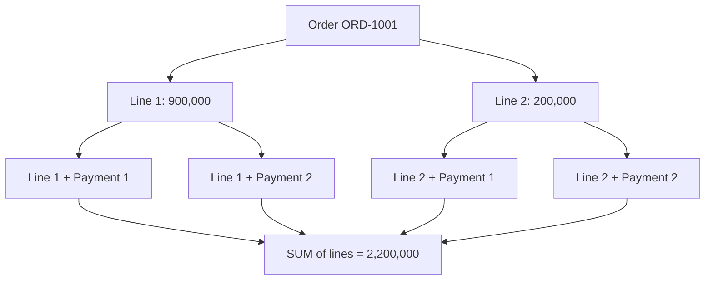
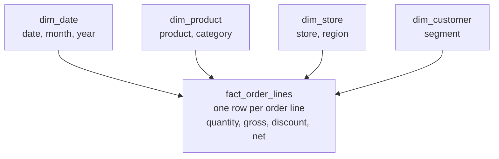

*The order, payment, and product records are all present. The pipeline succeeds. Yet a join doubles reported sales. The source data is not wrong; the analytical model has misunderstood what each row represents.*

## 1. When a correct join produces the wrong number

Consider order `ORD-1001`. It has two order lines worth 900,000 and 200,000 VND, and two successful payments worth 700,000 and 400,000 VND. Both line value and payment total are **1,100,000 VND**.

Now run:

```sql
SELECT
    o.id AS order_id,
    SUM(oi.net_amount) AS sales_amount
FROM orders o
JOIN order_items oi ON oi.order_id = o.id
JOIN payments p ON p.order_id = o.id
WHERE p.status = 'paid'
GROUP BY o.id;
```

It can report **2,200,000 VND**. Each of the two lines matches each of the two payments, creating four joined rows. PostgreSQL has performed the requested join correctly; the aggregation counts every line twice.



This is **join fanout**: two one-to-many relationships were joined through an order without controlling cardinality. Fixing this SQL by pre-aggregating is sensible. As reporting grows, however, we also need data models that make grain and valid aggregations explicit.

## 2. Modeling starts with meaning, not a list of columns

A transactional schema is designed to manage orders, items, products, and payments accurately. Analytics asks different questions: sales by category and month, low-margin products, or regional performance. A good normalized operational design does not automatically become a good analytical design.

Dimensional modeling asks:

1. Which **business process** are we measuring?
2. What does **one row** of the analytical data represent?
3. Which **dimensions** will people use to analyze it?

The Kimball approach declares process, grain, dimensions, and facts before filling tables with columns. The organizing principle is the meaning of the data.

## 3. Grain is the fact table's contract

**Grain** says exactly what one row represents. For sales, valid grains include one order, one order line, one product per day, or one store per month. They answer different questions.

Suppose `fact_order_lines` has **one row per order line**:

| order_line_id | order_id | product_id | net_amount |
| :--- | :--- | :--- | ---: |
| LINE-01 | ORD-1001 | PROD-01 | 900,000 |
| LINE-02 | ORD-1001 | PROD-02 | 200,000 |

To calculate value by order:

```sql
SELECT order_id, SUM(net_amount) AS sales_amount
FROM fact_order_lines
GROUP BY order_id;
```

But `COUNT(*)` counts **lines**, not orders. Counting orders may require `COUNT(DISTINCT order_id)` or a separate order-grain fact. A table called `sales` does not tell us its grain. **Grain is a contract about the meaning of each row; measures and dimensions must be compatible with that contract.**

## 4. Facts and dimensions make a star schema

**Fact tables** record events, measurements, or snapshots. The system might have `fact_order_lines`, `fact_payments`, `fact_refunds`, and `fact_inventory_daily`, each with its own grain. **Dimension tables** describe the context for grouping and filtering: product category, store region, business date, or permitted customer segment.

For an order-line fact:



The fact sits at the center with dimensions around it, hence *star schema*. The benefit is not only speed: reports can use tables organized around business questions rather than asking each author to reconstruct the entire operational schema. But a star shape alone does not prevent incorrect joins or metric definitions.

## 5. Do not join facts merely because they share a key

`fact_order_lines` has one row per line. `fact_payments` has one row per payment transaction. Joining them directly on `order_id` recreates the fanout. First aggregate each fact to a **common result grain**, such as one row per order:

```sql
WITH sales_by_order AS (
    SELECT order_id, SUM(net_amount) AS sales_amount
    FROM fact_order_lines
    GROUP BY order_id
),
payments_by_order AS (
    SELECT order_id, SUM(amount) AS paid_amount
    FROM fact_payments
    WHERE status = 'paid'
    GROUP BY order_id
)
SELECT
    s.order_id,
    s.sales_amount,
    COALESCE(p.paid_amount, 0) AS paid_amount
FROM sales_by_order s
LEFT JOIN payments_by_order p ON p.order_id = s.order_id;
```

Now neither side has several rows per `order_id`. This avoids multiplying rows, but the two measures need not match at every moment: an order can be partially paid, later refunded, or adjusted. Grain alignment prevents one class of error; business definitions determine whether the numbers should reconcile.

## 6. Not every measure can be summed

- **Additive:** quantities and compatible sales amounts can be summed across appropriate dimensions when facts are not duplicated.
- **Semi-additive:** stock on hand can be summed across products or stores at the **same time**, but not across daily snapshots. Stock of 100 on Monday and 90 on Tuesday is not 190 units of stock.
- **Non-additive:** ratios such as margin rate cannot be summed or simply averaged across groups.

For example, store A has revenue 100 and profit 20, so its margin is 20%. Store B has revenue 900 and profit 90, so its margin is 10%. The unweighted average of their rates is 15%, but the combined margin is `(20 + 90) / (100 + 900) = 11%`.

Store additive components such as revenue and profit when possible, aggregate them to the requested scope, **then calculate the ratio**. A useful model tells consumers how measures may be aggregated, not just where they are stored.

## 7. Slowly changing dimensions preserve the right history

Suppose `PROD-02` belongs to **Accessories** in August and moves to **Lifestyle** in September. If `dim_product` stores only the current category, an August sale will appear under Lifestyle when the old report is rerun. Is that wrong? It depends on the business question. "Category at sale time" and "all past sales under today's categories" are different views.

**SCD Type 1** overwrites the old attribute. This is useful for corrections such as a misspelled name, or when only the current classification matters. **SCD Type 2** inserts a new dimension version for a history-sensitive change:

| product_key | product_id | category | valid_from | valid_to |
| ---: | :--- | :--- | :--- | :--- |
| 201 | PROD-02 | Accessories | 2026-01-01 | 2026-09-01 |
| 202 | PROD-02 | Lifestyle | 2026-09-01 | NULL |

With half-open validity intervals, the row applies when `valid_from <= event_time < valid_to`; the open-ended current row needs separate handling. An August fact can refer to `product_key = 201`, and a September fact to `202`.

Do **not** simply join the fact to this Type 2 dimension on `product_id`: one sale may match both dimension versions and be counted twice. Resolve the correct version at the business event time, store its surrogate key in the fact, or perform a carefully constrained temporal join with non-overlapping intervals.

## 8. Why use a surrogate key?

`product_id` is a **business key** naming the product. `product_key` is a **surrogate key** naming one particular dimension row. One product can keep its business ID while acquiring several historical versions.

Surrogate keys also help isolate the warehouse from source-system identity rules. If two acquired systems both use the same `product_id` for different items, the warehouse may need `source_system` plus business key or an identity-resolution process. A surrogate key does not remove the need to track which versions belong to the same business entity.

## 9. Late-arriving facts and dimensions

A sale can reach the warehouse before its product dimension. One option is to hold the fact; another is to link it to an explicit **Unknown / Not Yet Available** dimension member and resolve it later. The choice trades freshness against completeness, and the unknown category must not masquerade as a real category.

A transaction can also arrive late. If a payment made on August 31 is ingested on September 3, a report based on `paid_at` belongs in August, not September. A previously published August aggregate may need recalculation. Distinguish:

| Time | Meaning |
| :--- | :--- |
| Event time | When the business event happened. |
| Ingestion time | When the pipeline received it. |
| Processing time | When the pipeline transformed or published it. |

These times answer different questions. A business-month report usually follows event time; pipeline-lag monitoring needs the later timestamps. Reproducing what was known at a past point in time may require even richer temporal modeling than one `updated_at` column.

## 10. What dbt snapshots and incremental models help with

**dbt snapshots** can record observed versions of mutable source rows, with fields such as `dbt_valid_from` and `dbt_valid_to`. They are often used for Type 2-style history. But a scheduled snapshot only captures states it *observes*: if a source changes several times between runs and keeps no history, intermediate states may be missed. A CDC log or event history may be more suitable when those transitions matter.

**dbt incremental models** avoid rebuilding a large target on every run. A minimal example is:

```sql
{{ config(materialized='incremental', unique_key='order_line_id') }}

SELECT order_line_id, order_id, product_key, net_amount, updated_at
FROM {{ ref('int_order_lines') }}


WHERE updated_at >= (
    SELECT COALESCE(MAX(updated_at), TIMESTAMP '1900-01-01')
    FROM {{ this }}
)

```

This is illustrative, **not a production-ready change-capture policy**. `unique_key` identifies the target row for update-capable incremental strategies; it does not automatically solve late updates, deletes, equal timestamps, or source ordering. Production may need overlap windows, change positions, backfills, and reconciliation. If the model's join multiplies facts, incremental execution only generates wrong data more efficiently.

## 11. Build marts for real questions

Once atomic facts and dimensions exist, repeated dashboard queries may justify an aggregate such as:

```text
mart_daily_store_sales
  business_date
  store_key
  gross_sales
  discount_amount
  net_sales
  order_count
  units_sold
```

Its grain is **one row per business day and store**. Monthly store totals can be built from it, assuming the measures and definitions permit that aggregation. Product-level sales cannot be recovered from a mart that discarded product detail. Keep atomic-grain facts for flexibility, then build aggregate marts around measured query needs.

Avoid one enormous table with every KPI. Sales at order-line grain, inventory at product-store-day snapshot grain, and order counts at order grain cannot safely be flattened together without carefully defined joins and aggregation rules.

## 12. Conformed dimensions connect processes

Sales, Inventory, and Marketing Marts may all analyze stores and products. If one labels a region `North` and another `Northern Region`, cross-mart comparison becomes ambiguous. **Conformed dimensions** give shared attributes consistent domains and meaning across business processes.

They do not make fact grains identical. Sales can remain order-line-grained while inventory is a daily snapshot. To compare them, aggregate each fact separately to the shared dimensions and comparison grain, then combine the resulting measures. Conformance creates a common context; it does not license a direct fact-to-fact join.

## 13. A semantic layer still has a job

A mart might expose `net_sales` and `order_count`. One dashboard calculates **average order value** as `net_sales / order_count`. Another averages daily AOV values to get monthly AOV. Those answers can differ because the second is unweighted. The monthly rate should generally be calculated from the relevant **monthly totals**, under an agreed definition of which orders count.

A semantic layer can centralize metric definitions and allowed dimensions for BI tools and APIs. A small project may keep the same definitions in tested SQL models or application code. The essential point is that every consumer should not invent its own meaning for the same KPI.

## 14. Test the model's promises

Test the declared grain. If `fact_order_lines` is one row per `order_line_id`, this query should return nothing:

```sql
SELECT order_line_id, COUNT(*) AS row_count
FROM fact_order_lines
GROUP BY order_line_id
HAVING COUNT(*) > 1;
```

Also verify that `product_key` uniquely identifies a dimension row; Type 2 `product_id` may legitimately repeat. For each product, check that validity intervals do not overlap and that there is at most one current version. Verify fact foreign keys resolve to a dimension or a documented unknown member. Reconcile fact totals against marts for the **same business period, scope, and metric definition**.

Add regression cases that exercise the dangerous joins and time rules: two order lines and two payments, a product changing category, a late payment, a refund, an incremental rerun, and a fact arriving before its dimension. Schema validation alone will not detect a doubled `SUM`.

## 15. A practical modeling sequence

1. Start with the business questions and identify processes such as Sales, Payments, Refunds, and Inventory.
2. Declare the grain of each fact **before** choosing measures and dimensions.
3. Define measures, their aggregation rules, and shared dimensions.
4. Decide which dimension attributes need historical versions and how late data will be handled.
5. Build atomic facts first, then aggregates for proven workloads.
6. Test grain, relationships, reconciliation, and the business edge cases.
7. Measure query latency, transformation cost, freshness, and the value of each additional mart.

A model that is logically correct but unusably slow may need tuning. A fast table that produces untrustworthy numbers is not a good model either.

## 16. Common mistakes

- Leaving grain undefined, then treating line counts as order counts.
- Directly joining facts with different grains and multiplying measures.
- Keeping only current dimension attributes when historical interpretation matters.
- Using Type 2 dimensions but joining on business key without choosing a version.
- Summing ratios or inventory snapshots across time.
- Publishing only coarse marts and losing detail needed for new questions.
- Using incremental models without handling late changes and deletions.
- Letting each dashboard redefine the same KPI.

Using a star schema does not by itself make data correct. Grain, business meaning, relationships, and history policies do that work.

## 17. The question underneath every model

A pipeline can transfer all source records and still create a wrong report. Grain defines what one row means; facts hold events and measurements; dimensions provide context; Type 2 versions preserve chosen history; marts serve common queries; conformed dimensions and shared metric definitions keep reports comparable.

Before asking whether a table or dashboard is fast, ask: **What does this row represent, and along which dimensions may this measure be aggregated?** If the answer is unclear, valid SQL and green jobs can still produce false conclusions.

**A useful data warehouse does more than query quickly. It helps people calculate and interpret what actually happened.**

## References and further reading

- [Kimball Group: Dimensional Modeling Techniques](https://www.kimballgroup.com/data-warehouse-business-intelligence-resources/kimball-techniques/dimensional-modeling-techniques/)
- [Kimball Group: Grain](https://www.kimballgroup.com/data-warehouse-business-intelligence-resources/kimball-techniques/dimensional-modeling-techniques/grain/)
- [Kimball Group: Additive, Semi-Additive, and Non-Additive Facts](https://www.kimballgroup.com/data-warehouse-business-intelligence-resources/kimball-techniques/dimensional-modeling-techniques/additive-semi-additive-non-additive-fact/)
- [Kimball Group: Drilling Across](https://www.kimballgroup.com/2003/04/the-soul-of-the-data-warehouse-part-two-drilling-across/)
- [Microsoft Learn: Star Schema](https://learn.microsoft.com/en-us/power-bi/guidance/star-schema)
- [Microsoft Learn: Dimensional Modeling in Fabric](https://learn.microsoft.com/en-us/fabric/data-warehouse/dimensional-modeling-overview)
- [dbt: Snapshots](https://docs.getdbt.com/docs/build/snapshots)
- [dbt: Incremental Models](https://docs.getdbt.com/docs/build/incremental-models)
