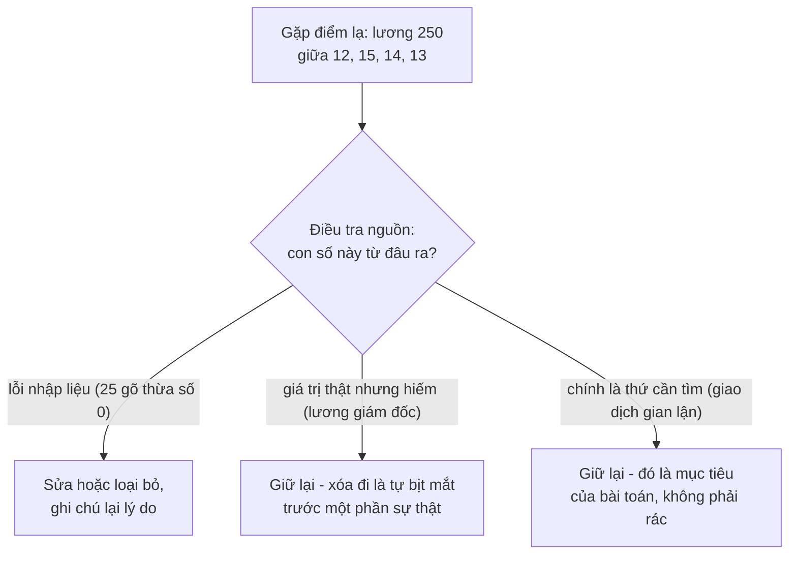
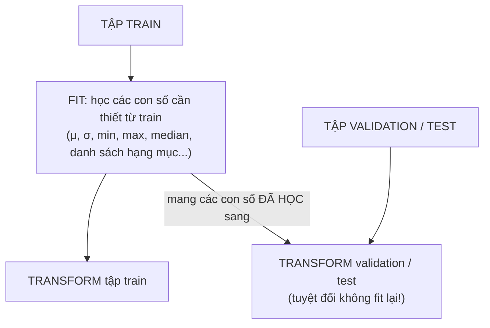
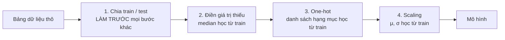

> **Mục tiêu bài học:** Sau bài này, bạn sẽ biết cách "dọn dẹp" một bảng dữ liệu thực tế trước khi đưa vào mô hình: xử lý giá trị thiếu, mã hóa biến phân loại, co giãn thang đo, ứng xử với outlier - và nắm được nguyên tắc vàng *fit trên train, transform lên phần còn lại* để không tự đánh lừa chính mình.

## 1. Dữ liệu ngoài đời không giống dữ liệu trong sách

Sáng thứ Hai, đồng nghiệp gửi cho bạn "bảng khách hàng" để xây mô hình. Bạn mở ra và thấy thế này:

| Khách | Tuổi | Thành phố | Thu nhập/tháng | Ngày đăng ký |
|---|---|---|---|---|
| A | 25 | Hà Nội | 10.000.000 | 2024-03-01 |
| B | *(trống)* | hà nội | 12 triệu | 01/03/2024 |
| C | 250 | HN | 30.000.000 | 2024-03-02 |
| D | 25 | Hà Nội | 10.000.000 | 2024-03-01 |

Chỉ 4 dòng. Bạn đếm được bao nhiêu vấn đề? Hãy thử trước khi đọc tiếp.

Đáp án: ít nhất **năm**. Ô tuổi bị **thiếu** (B); tuổi 250 rõ ràng là **lỗi nhập liệu** (C); cùng một thành phố viết **ba kiểu khác nhau** (Hà Nội / hà nội / HN); thu nhập lúc ghi số lúc ghi chữ "triệu" - **lẫn lộn định dạng và đơn vị**; và dòng D có vẻ là **bản trùng** của dòng A. Máy tính không "đoán ý" như người đọc: với nó, "Hà Nội" và "HN" là hai giá trị khác hẳn nhau.

Các ví dụ trong loạt bài này đến giờ - kể cả bảng 6 căn nhà mini ở Bài 02-03 - dùng toàn bảng dữ liệu sạch sẽ: đủ ô, đúng kiểu, sẵn sàng đưa vào mô hình. Ngoài đời, chuyện đó gần như không xảy ra. Bạn còn nhớ *garbage in, garbage out* ở Bài 01 chứ? Chuẩn bị dữ liệu chính là công đoạn ngăn "rác" đi vào mô hình. Sách *Dive into Deep Learning* ví giá trị thiếu như **"rệp giường" của khoa học dữ liệu** - mối phiền toái dai dẳng bám theo bạn suốt sự nghiệp.

Và đây không phải việc phụ. Khảo sát *State of Data Science* của Anaconda năm 2022 (3.493 người trả lời từ 133 quốc gia và vùng lãnh thổ) cho thấy chuẩn bị và làm sạch dữ liệu chiếm khoảng **38%** thời gian làm việc - công đoạn ngốn nhiều thời gian nhất, gấp gần ba lần khâu trực quan hóa dữ liệu (13%). Học kỹ bài này, bạn sẽ vững tay ở đúng công đoạn tốn công nhất của nghề.

Bài 03 đã bàn *khái niệm* feature và label; bài này bàn phần *kỹ thuật*: làm gì với dữ liệu thô để các feature thật sự dùng được.

## 2. Giá trị thiếu (missing values): xóa hay điền?

Khi đọc file CSV bằng Pandas, các ô trống hoặc ghi `NA` sẽ hiện thành `NaN` (*not a number*). Lấy một bảng nhỏ về nhà đất (phỏng theo ví dụ trong sách *Dive into Deep Learning*):

| Nhà | Số phòng | Loại mái | Giá (triệu đồng) |
|---|---|---|---|
| 1 | NaN | NaN | 1.500 |
| 2 | 2 | NaN | 1.200 |
| 3 | 4 | Ngói | 2.100 |
| 4 | NaN | NaN | 1.600 |

Bạn sẽ làm gì với 5 ô NaN kia? Có hai hướng chính: **xóa (deletion)** và **điền (imputation - điền giá trị ước lượng)**.

### 2.1. Xóa dòng hoặc xóa cột

- **Xóa dòng** chứa ô thiếu: chỉ xóa các dòng thiếu "Số phòng" thì bảng còn nhà 2 và nhà 3 - mất **một nửa dữ liệu**; xóa mọi dòng có *bất kỳ* ô thiếu nào thì chỉ còn nhà 3 - mất **ba phần tư**! Với dữ liệu đã ít, đây là cái giá rất đắt. Tệ hơn, nếu việc thiếu không ngẫu nhiên (ví dụ nhà cũ hay bị thiếu thông tin hơn nhà mới), xóa dòng sẽ làm dữ liệu còn lại bị **lệch**.
- **Xóa cột**: nếu cột "Loại mái" thiếu đến 3/4 thì có khi bỏ cả cột lại hợp lý - một cột gần như trống thường chẳng đóng góp được bao nhiêu. Nhưng nếu cột đó là feature quan trọng, bỏ đi là mất thông tin quý.

### 2.2. Điền giá trị (imputation)

Với **cột số**, cách điền thường gặp:

- **Mean (trung bình):** cột "Số phòng" có hai giá trị 2 và 4 → mean = 3 → điền 3 vào hai ô trống. Đơn giản, giữ được toàn bộ dòng.
- **Median (trung vị):** giá trị đứng giữa khi sắp xếp. Ít bị outlier kéo lệch hơn mean - nếu trong cột thu nhập có một tỷ phú, mean bị kéo vọt lên còn median gần như đứng yên.
- **Mode (giá trị xuất hiện thường xuyên nhất trong cột):** hợp với cột phân loại, ví dụ điền loại mái hay gặp nhất.

> 🔧 **Thử ngay:** Cột lương (triệu đồng/tháng) có 5 giá trị: 12, 15, 14, 13, 250. Tính mean và median.
> Mean = 304 / 5 = **60,8** - một con số chẳng giống lương của ai trong cột. Median: sắp xếp thành 12, 13, 14, 15, 250 → giá trị đứng giữa = **14**. Nếu phải điền một ô lương thiếu, bạn chọn số nào? (Con số 250 sẽ quay lại ở mục 5.)

Với **cột phân loại**, còn một mẹo hay: coi chính việc "thiếu" là **một hạng mục riêng**. Cột "Loại mái" khi đó có hai giá trị: "Ngói" và "không rõ" - biết đâu việc *không ghi loại mái* tự nó cũng là một tín hiệu (nhà cũ, hồ sơ sơ sài...).

| Cách xử lý | Ưu điểm | Nhược điểm |
|---|---|---|
| Xóa dòng | Đơn giản, không "bịa" số liệu | Mất dữ liệu; dễ gây lệch nếu thiếu không ngẫu nhiên |
| Xóa cột | Gọn khi cột thiếu quá nhiều | Mất hẳn một feature |
| Điền mean/median | Giữ đủ dòng, dễ làm | Giá trị điền là ước đoán; làm phân bố "co cụm" quanh giá trị điền |
| Coi "thiếu" là một hạng mục | Giữ được tín hiệu "vì sao thiếu" | Chỉ áp dụng cho biến phân loại |

Không có lựa chọn đúng cho mọi tình huống - quyết định phụ thuộc vào *lượng* dữ liệu thiếu, *lý do* thiếu và *tầm quan trọng* của cột.

## 3. Mã hóa biến phân loại: vì sao không gán bừa 1, 2, 3

Mô hình ML chỉ ăn **số** (Bài 06: đầu vào của mô hình rốt cuộc là các vector số). Vậy cột "Thành phố" với các giá trị Hà Nội, Đà Nẵng, TP.HCM thì sao? Cách "ngây thơ" là gán: Hà Nội = 1, Đà Nẵng = 2, TP.HCM = 3.

**Đừng làm vậy.** Với mô hình, các con số mang theo *quan hệ số học*: nó sẽ "hiểu" rằng TP.HCM (3) lớn gấp ba Hà Nội (1), rằng Đà Nẵng (2) nằm "chính giữa" hai thành phố kia, rằng **trung bình cộng của Hà Nội và TP.HCM là... Đà Nẵng**. Toàn là những **thứ tự và khoảng cách giả** mà bạn vô tình bịa ra - ba thành phố vốn chỉ là ba cái tên, không hơn kém nhau theo nghĩa số học nào cả.

Giải pháp tiêu chuẩn là **one-hot encoding**: tách cột phân loại thành nhiều cột 0/1, mỗi cột ứng với một hạng mục, và mỗi dòng chỉ có đúng một cột bằng 1 ("one hot" - một vị trí "nóng").

**Trước:**

| Khách | Thành phố |
|---|---|
| A | Hà Nội |
| B | Đà Nẵng |
| C | TP.HCM |
| D | Hà Nội |

**Sau one-hot:**

| Khách | TP là Hà Nội | TP là Đà Nẵng | TP là TP.HCM |
|---|---|---|---|
| A | 1 | 0 | 0 |
| B | 0 | 1 | 0 |
| C | 0 | 0 | 1 |
| D | 1 | 0 | 0 |

Giờ ba thành phố "bình đẳng": không cái nào lớn hơn cái nào, khoảng cách giữa hai thành phố bất kỳ là như nhau. Giới thống kê gọi các cột 0/1 này là **dummy variables (biến giả)** - sách *An Introduction to Statistical Learning* có hẳn một mục về chúng (mục 3.3.1) và ghi chú rằng cộng đồng ML gọi chính kỹ thuật này là "one-hot encoding".

> 🔧 **Thử ngay:** Ba dòng Pandas (Bài 02):
>
> ```python
> import pandas as pd
> cities = pd.Series(["Hà Nội", "Đà Nẵng", "TP.HCM", "Hà Nội"])
> print(pd.get_dummies(cities, dtype=int))
> ```
>
> Bạn phải thấy 3 cột 0/1, mỗi dòng có đúng **một** số 1 (tổng mỗi dòng bằng 1). Hai bất ngờ nhỏ: Pandas xếp cột theo bảng mã nên "Đà Nẵng" đứng sau "TP.HCM"; và nếu bỏ `dtype=int`, Pandas bản mới (ví dụ 2.3) in True/False thay vì 1/0 - cùng một ý nghĩa.

Một ngoại lệ đáng nhớ: nếu hạng mục **có thứ tự thật** - cỡ áo S < M < L, học vấn THPT < Đại học < Sau đại học - thì gán số theo thứ tự (0, 1, 2) lại là hợp lý, vì thứ tự đó phản ánh đúng thực tế. Đó gọi là **ordinal encoding (mã hóa thứ bậc)**.

<details>
<summary><b>Đào sâu: bỏ bớt một cột, và khi hạng mục quá nhiều</b></summary>

- **Bỏ bớt một cột (drop first).** Trong hồi quy tuyến tính, người ta thường chỉ tạo $k-1$ cột cho $k$ hạng mục; hạng mục không có cột riêng trở thành **mốc (baseline)** để so sánh. Lý do: cột thứ $k$ suy ra được từ $k-1$ cột kia (tổng các cột luôn bằng 1), giữ cả $k$ cột gây trùng lặp thông tin. Sách *An Introduction to Statistical Learning* trình bày cách này với ví dụ biến vùng miền (East làm baseline). Trong Pandas: `pd.get_dummies(..., drop_first=True)`. Với nhiều mô hình ML khác, giữ đủ $k$ cột cũng không sao.
- **Hạng mục quá nhiều (high cardinality).** Cột "mã khách hàng" có 100.000 giá trị khác nhau → one-hot sinh ra 100.000 cột, vừa cồng kềnh vừa vô nghĩa (mỗi cột chỉ có một số 1). Khi đó cần cân nhắc: gộp các hạng mục hiếm thành nhóm "Khác", hoặc dùng các kỹ thuật nâng cao hơn (embedding - bạn sẽ gặp lại ý tưởng này khi học deep learning).

</details>

## 4. Co giãn thang đo (feature scaling): cho các cột "nói cùng một ngôn ngữ"

Xét bảng 4 khách hàng với hai feature:

| Khách | Tuổi | Thu nhập (đồng/tháng) |
|---|---|---|
| A | 25 | 10.000.000 |
| B | 30 | 12.000.000 |
| C | 45 | 30.000.000 |
| D | 50 | 8.000.000 |

Ở Bài 07, ta đo độ giống nhau giữa hai khách hàng bằng khoảng cách. Thử tính khoảng cách A-B: chênh lệch tuổi là $5$, chênh lệch thu nhập là $2.000.000$. Khi bình phương rồi cộng lại, con số $5^2 = 25$ chìm nghỉm cạnh $2.000.000^2 = 4 \times 10^{12}$. Kết quả: **feature thu nhập (hàng triệu) lấn át hoàn toàn feature tuổi (hàng chục)** - mô hình k-NN của bạn thực chất chỉ so thu nhập, còn tuổi bị bỏ qua, không phải vì tuổi kém quan trọng, mà chỉ vì *đơn vị đo* của nó nhỏ hơn.

Chuyện tương tự xảy ra với gradient descent (Bài 11): khi các feature có thang đo chênh nhau quá xa, "địa hình" của hàm mất mát trở thành một khe núi hẹp và dài, khiến người xuống núi zigzag rất lâu mới hội tụ. Co các feature về cùng thang đo giúp địa hình "tròn trịa" hơn, học nhanh và ổn định hơn.

Hai cách co giãn thường dùng:

### 4.1. Min-max normalization - ép về đoạn [0, 1]

$$x' = \frac{x - x_{\min}}{x_{\max} - x_{\min}}$$

Giá trị nhỏ nhất thành 0, lớn nhất thành 1, còn lại nằm giữa. Áp lên bảng trên (tuổi: min 25, max 50; thu nhập: min 8 triệu, max 30 triệu):

| Khách | Tuổi (gốc) | Tuổi (min-max) | Thu nhập (gốc) | Thu nhập (min-max) |
|---|---|---|---|---|
| A | 25 | 0,00 | 10 triệu | 0,09 |
| B | 30 | 0,20 | 12 triệu | 0,18 |
| C | 45 | 0,80 | 30 triệu | 1,00 |
| D | 50 | 1,00 | 8 triệu | 0,00 |

Giờ hai cột nằm trên cùng một thang đo, nên thu nhập không còn lấn át tuổi chỉ vì đơn vị của nó tính bằng hàng triệu. Chú ý điều đó không có nghĩa hai cột *quan trọng* ngang nhau - cột nào ảnh hưởng tới nhãn nhiều hơn thì mô hình vẫn phải tự học từ dữ liệu.

> 🔧 **Thử ngay:** Diện tích nhà trong tập train chạy từ 30 đến 300 m². Một căn 120 m² sau min-max bằng bao nhiêu?
> $(120 - 30) / (300 - 30) = 90 / 270 = 1/3 \approx$ **0,33**. Tự kiểm: căn 30 m² phải ra 0, căn 300 m² phải ra 1.

### 4.2. Standardization (z-score) - đưa về mean 0, độ lệch chuẩn 1

$$z = \frac{x - \mu}{\sigma}$$

trong đó $\mu$ là trung bình và $\sigma$ là độ lệch chuẩn của cột (Bài 08). Giá trị $z$ trả lời câu hỏi: *"quan sát này cách trung bình mấy độ lệch chuẩn?"*. Với cột tuổi ($\mu = 37{,}5$; $\sigma \approx 10{,}3$): khách A có $z \approx -1{,}21$, khách D có $z \approx +1{,}21$.

### 4.3. Chọn cách nào?

| | Min-max normalization | Standardization (z-score) |
|---|---|---|
| Kết quả nằm trong | đoạn [0, 1] *trên chính tập dùng để fit* | không bị chặn (thường rơi quanh −3 … +3) |
| Nhạy với outlier? | **Rất nhạy** - một giá trị cực lớn ép mọi giá trị khác co cụm sát 0 | Đỡ hơn, nhưng vẫn nhạy: outlier kéo cả trung bình lẫn độ lệch chuẩn |
| Hợp với | dữ liệu cần miền giá trị cố định (ví dụ điểm ảnh 0-255 → 0-1) | dữ liệu khác đơn vị, khác độ phân tán; là lựa chọn mặc định an toàn |

Nếu phân vân, standardization là điểm khởi đầu hợp lý; và vì cả hai đều tính rất nhanh, bạn hoàn toàn có thể thử cả hai rồi so kết quả trên validation set.

> ⚠️ **Lưu ý nhỏ:** Không phải mô hình nào cũng cần scaling. Các mô hình dựa trên khoảng cách (k-NN) và các mô hình huấn luyện bằng gradient descent hưởng lợi rõ; một số mô hình dạng cây quyết định thì gần như không bị ảnh hưởng bởi thang đo - chúng chỉ hỏi "lớn hơn hay nhỏ hơn ngưỡng?", mà câu hỏi đó không đổi khi co giãn.

## 5. Outliers: điểm lạ chưa chắc là điểm sai

Quay lại cột lương ở mục 2: `12, 15, 14, 13, 250` (triệu đồng/tháng). Con số 250 đập ngay vào mắt - nó là một **outlier (điểm ngoại lai)**: quan sát nằm cách xa phần còn lại của dữ liệu. Cách phát hiện đơn giản nhất, làm được ngay hôm nay: gọi `df.describe()` và **nhìn min/max từng cột**. Tuổi min = 0 hay max = 250? Thu nhập âm? Diện tích nhà 5 m²? Vẽ thêm histogram hoặc boxplot (Bài 02) là các điểm lạ hiện ra ngay.

Điều quan trọng hơn kỹ thuật là **thái độ xử lý**. Con số 250 có thể là một trong ba thứ rất khác nhau:



1. **Lỗi nhập liệu** - ai đó gõ thừa số 0 (25 thành 250): nên sửa hoặc loại bỏ.
2. **Giá trị thật nhưng hiếm** - đó là lương của giám đốc: xóa đi là bạn đang tự bịt mắt trước một phần sự thật của dữ liệu.
3. **Chính là thứ cần tìm** - trong bài toán phát hiện gian lận thẻ, giao dịch "lạ" là *mục tiêu* chứ không phải rác.

Vậy nên nguyên tắc là: **điều tra trước, hành động sau**. Truy lại nguồn dữ liệu nếu được; nếu quyết định sửa/xóa, ghi chú lại lý do. "Cứ lạ là xóa" nghe gọn gàng nhưng là thói quen nguy hiểm. Dữ liệu thực tế đầy rẫy outlier, số đo bị lỗi từ cảm biến và lỗi ghi chép. Nhưng *phân biệt* được lỗi với tín hiệu thật thì cần hiểu biết về bài toán, không chỉ cần công thức.

<details>
<summary><b>Đào sâu: quy tắc IQR - một tiêu chí phát hiện outlier hay gặp</b></summary>

Gọi $Q_1$, $Q_3$ là phân vị 25% và 75% của cột, và $IQR = Q_3 - Q_1$ (interquartile range - khoảng tứ phân vị). Một quy ước thông dụng: điểm nằm ngoài đoạn $[Q_1 - 1{,}5 \times IQR;\; Q_3 + 1{,}5 \times IQR]$ được *đánh dấu* là outlier tiềm năng - đây cũng chính là quy ước vẽ "râu" của boxplot. Nhớ rằng đây là tiêu chí *gắn cờ để xem xét*, không phải lệnh xóa tự động. Nếu buộc phải scale dữ liệu có nhiều outlier, scikit-learn có `RobustScaler` - co giãn dựa trên median và IQR thay vì mean và độ lệch chuẩn.

</details>

## 6. Nguyên tắc vàng: fit trên train, transform lên phần còn lại

Đây là điều quan trọng bậc nhất của cả bài. Hầu hết phép biến đổi ở trên đều phải **"học" một thứ gì đó từ dữ liệu**: điền mean cần *tính mean*; standardization cần *tính $\mu$ và $\sigma$*; min-max cần *tìm min và max*. Câu hỏi là: tính trên dữ liệu nào?

**Câu trả lời: chỉ trên tập train.** Quy trình chuẩn gồm hai động tác:

- **fit** - học các con số cần thiết ($\mu$, $\sigma$, min, max, median...) **từ tập train**;
- **transform** - dùng chính các con số đã học đó để biến đổi *cả* train, validation lẫn test. **Không tính lại** trên validation/test. Ví dụ với standardization: sau khi biến đổi, chỉ tập train mới có trung bình đúng 0 và độ lệch chuẩn đúng 1; validation/test thường lệch đi chút ít - và đúng ra là phải vậy.



Vì sao nghiêm trọng vậy? Nhớ lại Bài 04: validation/test phải đóng vai **dữ liệu tương lai mà mô hình chưa từng thấy**. Nếu bạn tính $\mu$, $\sigma$ trên *toàn bộ* dữ liệu rồi mới chia train/test, thì thông tin của tập test đã "rò" vào các con số mà mô hình sử dụng - hiện tượng gọi là **data leakage (rò rỉ dữ liệu)**. Điều đáng ngạc nhiên: bạn không hề đụng tới nhãn của tập test, chỉ tính vài con số thống kê, mà vẫn rò. Kết quả đánh giá sẽ đẹp hơn thực tế, mà cái đẹp đó là giả - y như một kỳ thi bị **lộ đề**: thí sinh được xem trước một phần đề, điểm cao nhưng không nói lên năng lực thật. Đến khi mô hình chạy với dữ liệu tương lai thật sự - nơi không có gì để "rò" - chất lượng rơi tự do, và bạn không hiểu vì sao.

Quy tắc thực hành rút gọn: **chia dữ liệu trước, biến đổi sau**, và mọi phép biến đổi chỉ được nhìn tập train. Bài 14 sẽ mổ xẻ "lộ đề" cùng những biến thể tinh vi hơn của nó.

## 7. Ghép tất cả lại bằng vài dòng code

Thứ tự an toàn của cả bài gói gọn trong một quy trình (pipeline):



Đoạn code Pandas + scikit-learn dưới đây đi qua đủ các bước đó, theo đúng thứ tự:

```python
import pandas as pd
from sklearn.model_selection import train_test_split
from sklearn.preprocessing import OneHotEncoder, StandardScaler

# 1) CHIA TRƯỚC - mọi bước "học" từ dữ liệu chỉ được nhìn tập train
X = df.drop(columns=["gia"])
y = df["gia"]
X_train, X_test, y_train, y_test = train_test_split(
    X, y, test_size=0.2, random_state=42)

# 2) Điền giá trị thiếu: median học TỪ TRAIN, áp cho cả hai tập
median_room_count = X_train["so_phong"].median()
X_train["so_phong"] = X_train["so_phong"].fillna(median_room_count)
X_test["so_phong"]  = X_test["so_phong"].fillna(median_room_count)

# 3) One-hot: DANH SÁCH HẠNG MỤC cũng được học từ train
#    (handle_unknown="ignore": test gặp hạng mục lạ thì mã hóa thành toàn 0)
encoder = OneHotEncoder(handle_unknown="ignore", sparse_output=False)
encoded_cities_train = encoder.fit_transform(X_train[["thanh_pho"]])  # fit + transform train
encoded_cities_test  = encoder.transform(X_test[["thanh_pho"]])       # CHỈ transform test

# 4) Co giãn thang đo cột số: fit trên train, transform cả hai tập
scaler = StandardScaler()
numeric_train = scaler.fit_transform(X_train[["so_phong"]])    # học μ, σ + biến đổi train
numeric_test  = scaler.transform(X_test[["so_phong"]])         # CHỈ biến đổi test
```

Vài ghi chú:

- Để ý: **one-hot cũng tuân theo nguyên tắc fit-trên-train** - encoder "học" *danh sách hạng mục* từ tập train. Lệnh `pd.get_dummies` của Pandas tiện khi thăm dò nhanh (như ở mục 3), nhưng nó không tách được hai bước fit/transform (và test có hạng mục lạ là lệch cột ngay), nên với pipeline nghiêm túc hãy dùng `OneHotEncoder`.
- Cặp phương thức `fit_transform` (cho train) và `transform` (cho test) của scikit-learn được thiết kế đúng theo nguyên tắc vàng ở mục 6 - API đã nhắc bạn làm điều đúng, chỉ cần đừng "tiện tay" gọi `fit_transform` lên test.
- Khi các bước nhiều lên, scikit-learn có `Pipeline` và `ColumnTransformer` để gói toàn bộ chuỗi tiền xử lý + mô hình vào một đối tượng duy nhất, ghép các nhánh cột số/cột chữ lại gọn gàng - bạn sẽ gặp chúng khi làm project thật.

## Tóm tắt bài học

- Dữ liệu thực tế thường thiếu, sai, trùng và lẫn lộn đơn vị; khảo sát ngành (Anaconda 2022) cho thấy chuẩn bị và làm sạch dữ liệu là công đoạn ngốn nhiều thời gian nhất (~38%) - đây là kỹ năng "cơm áo" chứ không phải việc phụ.
- **Giá trị thiếu:** xóa dòng/cột thì mất dữ liệu và dễ gây lệch; điền mean/median/mode giữ được dữ liệu nhưng là ước đoán. Median ít bị outlier kéo lệch hơn mean; với biến phân loại, "thiếu" có thể là một hạng mục riêng.
- **Biến phân loại:** gán bừa 1, 2, 3 tạo ra thứ tự và khoảng cách giả; **one-hot encoding** (dummy variables) tách thành các cột 0/1 bình đẳng. Hạng mục có thứ tự thật thì dùng ordinal encoding.
- **Feature scaling:** min-max đưa *tập dùng để fit* về [0, 1] (dữ liệu mới có thể vượt ra ngoài) và rất nhạy outlier; standardization (z-score) đưa về mean 0, độ lệch chuẩn 1. Scaling giúp khoảng cách (Bài 07) công bằng giữa các feature và gradient descent (Bài 11) hội tụ êm hơn; các mô hình dạng cây thì ít nhạy với thang đo.
- **Outlier:** phát hiện bằng `describe()`, histogram, boxplot; nhưng điều tra trước khi xóa - điểm lạ có thể là lỗi, là sự thật hiếm, hoặc chính là thứ cần tìm.
- **Nguyên tắc vàng:** mọi phép biến đổi phải **fit trên train** rồi **transform** lên validation/test. Làm ngược lại là data leakage - kết quả đánh giá đẹp giả tạo (chi tiết ở Bài 14).

## Câu hỏi tự kiểm tra

1. Nêu hai hướng xử lý giá trị thiếu và một nhược điểm chính của mỗi hướng. Khi nào điền median hợp lý hơn điền mean?
2. Cột "Quận" có các giá trị {Hoàn Kiếm, Cầu Giấy, Hà Đông}. Đồng nghiệp đề xuất gán lần lượt 1, 2, 3. Hãy chỉ ra hai "quan hệ giả" mà cách mã hóa này bịa ra, và trình bày bảng kết quả nếu dùng one-hot encoding thay thế.
3. Cột "Cỡ áo" có giá trị {S, M, L, XL}. Trường hợp này nên dùng one-hot hay gán số 0, 1, 2, 3? Vì sao câu trả lời khác với câu 2?
4. Một tập dữ liệu có feature "diện tích nhà" (30-300 m²) và "số tầng" (1-5). Nếu đưa thẳng vào k-NN mà không co giãn thang đo, chuyện gì xảy ra với vai trò của "số tầng"? Viết công thức min-max và tính giá trị sau scaling của căn nhà 120 m², 3 tầng.
5. Cột thu nhập có một giá trị lớn gấp 20 lần phần còn lại. Giữa min-max normalization và standardization, cách nào bị ảnh hưởng nặng hơn? Bạn sẽ làm gì với giá trị đó trước khi quyết định xóa?
6. Một bạn tính $\mu$ và $\sigma$ trên toàn bộ 10.000 dòng dữ liệu, standardize xong mới chia train/test, và khoe kết quả test rất cao. Hãy giải thích vì sao kết quả này đáng ngờ và mô tả lại quy trình đúng.

## Đọc thêm

**Nguồn nền tảng của bài:**

| Nguồn | Đọc phần nào |
|---|---|
| **Dive into Deep Learning (d2l.ai)** | Chương 2 (Preliminaries) - mục *Data Preprocessing*: đọc CSV với Pandas, xử lý missing values, `get_dummies` |
| **An Introduction to Statistical Learning (ISLP)** | Chương 3, mục 3.3.1 - *Qualitative Predictors*: biến định tính, dummy variables (one-hot) và khái niệm baseline |

**Nguồn online bổ sung (miễn phí):**

- [Importance of Feature Scaling - scikit-learn](https://scikit-learn.org/stable/auto_examples/preprocessing/plot_scaling_importance.html) - ví dụ trực quan chính chủ về việc scaling thay đổi kết quả mô hình ra sao.
- [Preprocessing data - scikit-learn User Guide](https://scikit-learn.org/stable/modules/preprocessing.html) - tài liệu đầy đủ về `StandardScaler`, `MinMaxScaler`, `OneHotEncoder` và cặp `fit`/`transform`.
- [About Feature Scaling and Normalization - Sebastian Raschka](https://sebastianraschka.com/Articles/2014_about_feature_scaling.html) - bài viết kinh điển so sánh min-max và z-score kèm minh họa.
- [Kaggle Learn: Data Cleaning](https://www.kaggle.com/learn/data-cleaning) - loạt bài thực hành ngắn miễn phí: missing values, scaling, sửa dữ liệu chữ không nhất quán.

> **Bài tiếp theo:** [Tham số, siêu tham số và capacity của mô hình](../parameters-hyperparameters-model-capacity-vi/) - dữ liệu đã sạch - giờ quay lại chính cỗ máy: núm vặn nào mô hình tự học, núm vặn nào bạn phải tự chọn, và "sức chứa" của mô hình nghĩa là gì.
