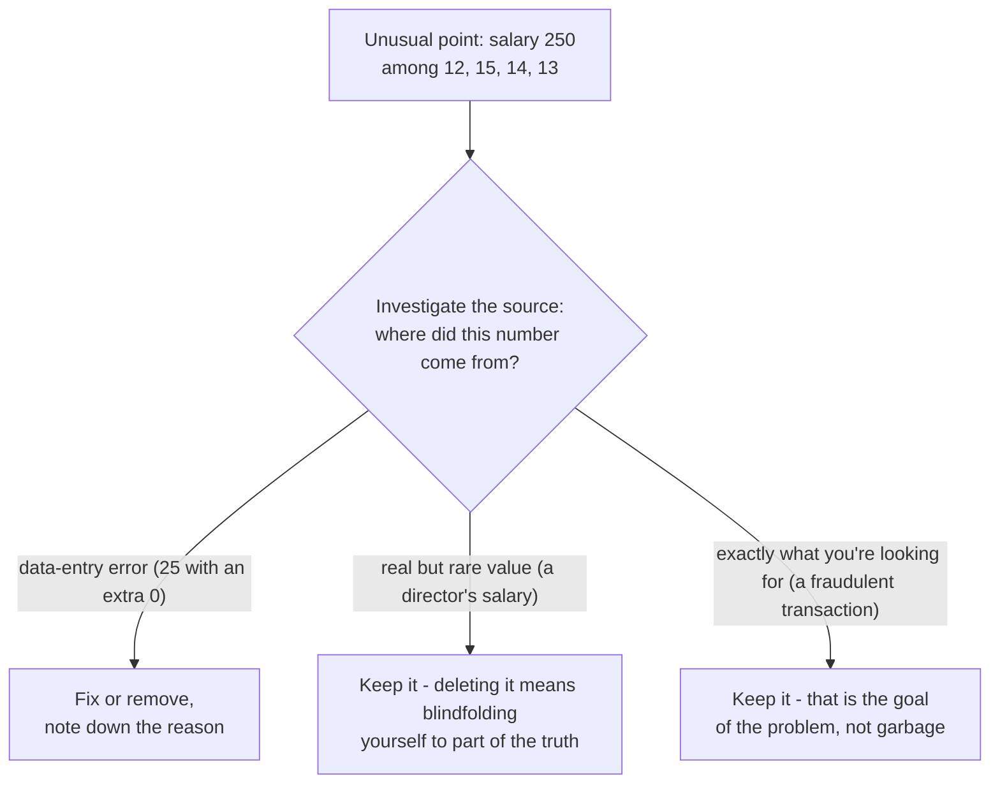
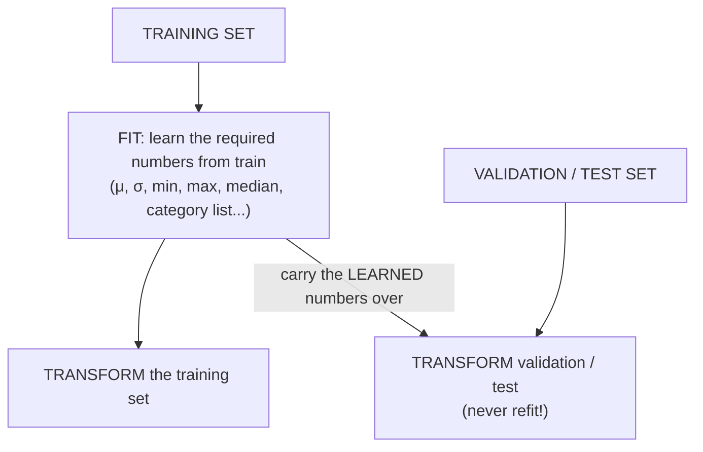
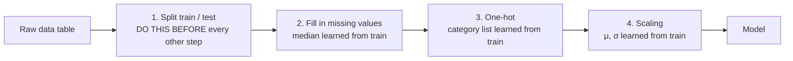

> **Learning objectives:** After this lesson, you will know how to "clean up" a real-world data table before feeding it to a model: handling missing values, encoding categorical variables, scaling features, dealing with outliers - and you will grasp the golden rule *fit on train, transform the rest* so that you do not fool yourself.

## 1. Real-world data does not look like textbook data

Monday morning, a colleague sends you the "customer table" to build a model on. You open it and see this:

| Customer | Age | City | Monthly income | Sign-up date |
|---|---|---|---|---|
| A | 25 | Hà Nội | 10,000,000 | 2024-03-01 |
| B | *(blank)* | hà nội | 12 million | 01/03/2024 |
| C | 250 | HN | 30,000,000 | 2024-03-02 |
| D | 25 | Hà Nội | 10,000,000 | 2024-03-01 |

Only 4 rows. How many problems can you count? Try before reading on.

Answer: at least **five**. An age cell is **missing** (B); age 250 is clearly a **data-entry error** (C); the same city is written **three different ways** (Hà Nội / hà nội / HN); income is sometimes a number and sometimes the word "million" - **mixed formats and units**; and row D looks like a **duplicate** of row A. A computer does not "read intent" the way a human reader does: to it, "Hà Nội" and "HN" are two completely different values.

The examples in this series so far - including the mini table of 6 houses in Lessons 02-03 - have all used clean data tables: no missing cells, correct types, ready to feed into a model. In real life, that almost never happens. Remember *garbage in, garbage out* from Lesson 01? Data preparation is precisely the stage that keeps "garbage" out of the model. The book *Dive into Deep Learning* compares missing values to **the "bed bugs" of data science** - a persistent nuisance that follows you throughout your career.

And this is not a side task. Anaconda's *State of Data Science* survey in 2022 (3,493 respondents from 133 countries and territories) found that data preparation and cleaning takes up about **38%** of working time - the most time-consuming stage, nearly three times as much as data visualization (13%). Getting good at this lesson makes you better at exactly the most labor-intensive part of the job.

Lesson 03 discussed the *concept* of features and labels; this lesson covers the *technique*: what to do with raw data so that the features are actually usable.

## 2. Missing values: delete or fill in?

When you read a CSV file with Pandas, blank cells or cells containing `NA` show up as `NaN` (*not a number*). Take a small real-estate table (adapted from the example in the book *Dive into Deep Learning*):

| House | Rooms | Roof type | Price (million VND) |
|---|---|---|---|
| 1 | NaN | NaN | 1,500 |
| 2 | 2 | NaN | 1,200 |
| 3 | 4 | Tile | 2,100 |
| 4 | NaN | NaN | 1,600 |

What will you do with those 5 NaN cells? There are two main directions: **deletion** and **imputation** (filling in an estimated value).

### 2.1. Delete rows or delete columns

- **Delete rows** containing missing cells: deleting only the rows missing "Rooms" leaves houses 2 and 3 - **half the data** is lost; deleting every row with *any* missing cell leaves only house 3 - **three quarters** lost! With data that is already scarce, this is a very steep price. Worse, if the missingness is not random (for example, older houses tend to have more missing information than newer ones), deleting rows will make the remaining data **biased**.
- **Delete columns**: if the "Roof type" column is 3/4 missing, dropping the entire column may well be reasonable - a nearly empty column usually contributes little. But if that column is an important feature, dropping it throws away valuable information.

### 2.2. Imputation

For **numeric columns**, common ways to fill in:

- **Mean:** the "Rooms" column has two values, 2 and 4 → mean = 3 → fill 3 into the two empty cells. Simple, keeps every row.
- **Median:** the middle value when sorted. More robust than the mean when there are outliers - if the income column contains a billionaire, the mean shoots up while the median barely moves.
- **Mode (the most frequently occurring value in the column):** suits categorical columns, for example filling in the most common roof type.

> 🔧 **Try it now:** A salary column (million VND/month) has 5 values: 12, 15, 14, 13, 250. Compute the mean and the median.
> Mean = 304 / 5 = **60.8** - a number that looks like nobody's salary in the column. Median: sort into 12, 13, 14, 15, 250 → middle value = **14**. If you had to fill in a missing salary cell, which number would you choose? (The number 250 will come back in Section 5.)

For **categorical columns**, there is one more useful trick: treat "missing" itself as **a separate category**. The "Roof type" column then has two values: "Tile" and "unknown" - who knows, the fact that *the roof type was not recorded* might itself be a signal (an old house, a sloppy file...).

| Approach | Advantages | Disadvantages |
|---|---|---|
| Delete rows | Simple, no "made-up" numbers | Loses data; easily biased if missingness is not random |
| Delete columns | Clean when a column is mostly missing | Loses an entire feature |
| Fill in mean/median | Keeps every row, easy to do | The filled value is a guess; makes the distribution "bunch up" around the filled value |
| Treat "missing" as a category | Preserves the "why is it missing" signal | Only applies to categorical variables |

There is no right choice for every situation - the decision depends on the *amount* of missing data, the *reason* it is missing, and the *importance* of the column.

## 3. Encoding categorical variables: why not just assign 1, 2, 3

ML models only eat **numbers** (Lesson 06: a model's input is ultimately numeric vectors). So what about the "City" column with the values Hà Nội, Đà Nẵng, TP.HCM? The "naive" way is to assign: Hà Nội = 1, Đà Nẵng = 2, TP.HCM = 3.

**Don't do that.** To the model, numbers carry *arithmetic relationships*: it will "understand" that TP.HCM (3) is three times Hà Nội (1), that Đà Nẵng (2) sits "exactly in the middle" of the other two cities, that **the average of Hà Nội and TP.HCM is... Đà Nẵng**. All of these are **fake orderings and distances** that you accidentally invented - the three cities are just three names, with no arithmetic ranking among them whatsoever.

The standard solution is **one-hot encoding**: split the categorical column into several 0/1 columns, one per category, with exactly one column equal to 1 in each row ("one hot" - a single "hot" position).

**Before:**

| Customer | City |
|---|---|
| A | Hà Nội |
| B | Đà Nẵng |
| C | TP.HCM |
| D | Hà Nội |

**After one-hot:**

| Customer | City is Hà Nội | City is Đà Nẵng | City is TP.HCM |
|---|---|---|---|
| A | 1 | 0 | 0 |
| B | 0 | 1 | 0 |
| C | 0 | 0 | 1 |
| D | 1 | 0 | 0 |

Now the three cities are "equal": none is larger than another, and the distance between any two cities is the same. Statisticians call these 0/1 columns **dummy variables** - the book *An Introduction to Statistical Learning* has a whole section on them (Section 3.3.1) and notes that the ML community calls this very technique "one-hot encoding".

> 🔧 **Try it now:** Three lines of Pandas (Lesson 02):
>
> ```python
> import pandas as pd
> cities = pd.Series(["Hà Nội", "Đà Nẵng", "TP.HCM", "Hà Nội"])
> print(pd.get_dummies(cities, dtype=int))
> ```
>
> You should see 3 columns of 0/1, each row with exactly **one** 1 (each row sums to 1). Two small surprises: Pandas orders the columns by character code, so "Đà Nẵng" comes after "TP.HCM"; and if you drop `dtype=int`, newer Pandas versions (for example 2.3) print True/False instead of 1/0 - same meaning.

One exception worth remembering: if the categories **have a genuine order** - shirt sizes S < M < L, education level high school < bachelor's < postgraduate - then assigning numbers by order (0, 1, 2) is in fact reasonable, because that order reflects reality. This is called **ordinal encoding**.

<details>
<summary><b>Going deeper: dropping one column, and when there are too many categories</b></summary>

- **Dropping one column (drop first).** In linear regression, people usually create only $k-1$ columns for $k$ categories; the category without its own column becomes the **baseline** for comparison. The reason: the $k$-th column can be deduced from the other $k-1$ (the columns always sum to 1), so keeping all $k$ columns duplicates information. The book *An Introduction to Statistical Learning* presents this with the example of a region variable (East as the baseline). In Pandas: `pd.get_dummies(..., drop_first=True)`. For many other ML models, keeping all $k$ columns is fine too.
- **Too many categories (high cardinality).** A "customer ID" column with 100,000 distinct values → one-hot produces 100,000 columns, both unwieldy and meaningless (each column has a single 1). In that case, consider: grouping rare categories into an "Other" bucket, or using more advanced techniques (embeddings - you will meet this idea again when you study deep learning).

</details>

## 4. Feature scaling: making the columns "speak the same language"

Consider a table of 4 customers with two features:

| Customer | Age | Income (VND/month) |
|---|---|---|
| A | 25 | 10,000,000 |
| B | 30 | 12,000,000 |
| C | 45 | 30,000,000 |
| D | 50 | 8,000,000 |

In Lesson 07, we measured the similarity between two customers by distance. Try computing the distance A-B: the age difference is $5$, the income difference is $2{,}000{,}000$. When squared and added, the number $5^2 = 25$ drowns next to $2{,}000{,}000^2 = 4 \times 10^{12}$. Result: **the income feature (millions) completely overwhelms the age feature (tens)** - your k-NN model is effectively comparing income only, while age is ignored, not because age matters less, but simply because its *unit of measurement* is smaller.

Something similar happens with gradient descent (Lesson 11): when the features have wildly different scales, the "landscape" of the loss function becomes a long, narrow ravine, making the hiker zigzag for a very long time before converging. Bringing the features onto the same scale makes the landscape "rounder", so learning is faster and more stable.

Two commonly used ways to scale:

### 4.1. Min-max normalization - squeezing into the interval [0, 1]

$$x' = \frac{x - x_{\min}}{x_{\max} - x_{\min}}$$

The smallest value becomes 0, the largest becomes 1, and the rest fall in between. Applied to the table above (age: min 25, max 50; income: min 8 million, max 30 million):

| Customer | Age (raw) | Age (min-max) | Income (raw) | Income (min-max) |
|---|---|---|---|---|
| A | 25 | 0.00 | 10 million | 0.09 |
| B | 30 | 0.20 | 12 million | 0.18 |
| C | 45 | 0.80 | 30 million | 1.00 |
| D | 50 | 1.00 | 8 million | 0.00 |

Now both columns sit on the same scale, so income no longer overwhelms age just because its unit is counted in millions. Note that this does not mean the two columns are equally *important* - which column influences the label more is still something the model has to learn from the data.

> 🔧 **Try it now:** House areas in the training set run from 30 to 300 m². What does a 120 m² house become after min-max?
> $(120 - 30) / (300 - 30) = 90 / 270 = 1/3 \approx$ **0.33**. Self-check: a 30 m² house must give 0, a 300 m² house must give 1.

### 4.2. Standardization (z-score) - bringing to mean 0, standard deviation 1

$$z = \frac{x - \mu}{\sigma}$$

where $\mu$ is the mean and $\sigma$ the standard deviation of the column (Lesson 08). The value $z$ answers the question: *"how many standard deviations is this observation from the mean?"*. For the age column ($\mu = 37.5$; $\sigma \approx 10.3$): customer A has $z \approx -1.21$, customer D has $z \approx +1.21$.

### 4.3. Which one to choose?

| | Min-max normalization | Standardization (z-score) |
|---|---|---|
| Result lies in | the interval [0, 1] *on the very set used for fitting* | unbounded (usually falls around −3 … +3) |
| Sensitive to outliers? | **Very sensitive** - one extreme value squeezes every other value close to 0 | Less so, but still sensitive: an outlier pulls both the mean and the standard deviation |
| Suits | data that needs a fixed range (for example pixel values 0-255 → 0-1) | data with different units and different spreads; the safe default choice |

If in doubt, standardization is a reasonable starting point; and since both are cheap, you can perfectly well try both and compare the results on the validation set.

> ⚠️ **A small note:** Not every model needs scaling. Distance-based models (k-NN) and models trained by gradient descent clearly benefit; some decision-tree-type models are almost unaffected by scale - they only ask "greater or smaller than the threshold?", and that question does not change under scaling.

## 5. Outliers: an unusual point is not necessarily a wrong point

Back to the salary column in Section 2: `12, 15, 14, 13, 250` (million VND/month). The number 250 jumps out - it is an **outlier**: an observation lying far from the rest of the data. The simplest detection method, which you can do today: call `df.describe()` and **look at the min/max of each column**. Age min = 0 or max = 250? Negative income? A 5 m² house? Draw a histogram or boxplot on top (Lesson 02) and the unusual points show up right away.

More important than the technique is the **attitude toward handling them**. The number 250 could be one of three very different things:



1. **A data-entry error** - someone typed an extra 0 (25 became 250): it should be fixed or removed.
2. **A real but rare value** - that is the director's salary: deleting it means blindfolding yourself to part of the truth in the data.
3. **Exactly what you are looking for** - in a card-fraud detection problem, the "unusual" transaction is the *target*, not garbage.

So the principle is: **investigate first, act second**. Trace back to the data source if you can; if you decide to fix/delete, note down the reason. "If it's unusual, delete it" sounds tidy but is a dangerous habit. Real-world data is full of outliers, broken sensor readings and recording errors. But *distinguishing* errors from real signal requires understanding the problem, not just formulas.

<details>
<summary><b>Going deeper: the IQR rule - a common criterion for spotting outliers</b></summary>

Let $Q_1$, $Q_3$ be the 25% and 75% percentiles of the column, and $IQR = Q_3 - Q_1$ (the interquartile range). A common convention: a point outside the interval $[Q_1 - 1.5 \times IQR;\; Q_3 + 1.5 \times IQR]$ is *flagged* as a potential outlier - this is also the very convention used to draw the "whiskers" of a boxplot. Remember that this is a *flag-for-review* criterion, not an automatic delete command. If you must scale data with many outliers, scikit-learn has `RobustScaler` - it scales based on the median and IQR instead of the mean and standard deviation.

</details>

## 6. The golden rule: fit on train, transform the rest

This is the single most important point of the whole lesson. Most of the transformations above have to **"learn" something from the data**: filling in the mean requires *computing the mean*; standardization requires *computing $\mu$ and $\sigma$*; min-max requires *finding the min and max*. The question is: computed on which data?

**The answer: only on the training set.** The standard procedure has two moves:

- **fit** - learn the required numbers ($\mu$, $\sigma$, min, max, median...) **from the training set**;
- **transform** - use those very learned numbers to transform *all* of train, validation and test. **Do not recompute** on validation/test. For example, with standardization: after transforming, only the training set has a mean of exactly 0 and a standard deviation of exactly 1; validation/test are usually slightly off - and that is exactly as it should be.



Why is this so serious? Recall Lesson 04: validation/test must play the role of **future data the model has never seen**. If you compute $\mu$, $\sigma$ on *all* the data and only then split train/test, then information from the test set has "leaked" into the numbers the model uses - a phenomenon called **data leakage**. The surprising part: you never touched the test labels, you only computed a few statistics, and it still leaks. The evaluation result will look better than reality, and that improvement is fake - just like an exam whose paper has been **leaked**: the candidate got to see part of the paper in advance, scores high, but the score says nothing about real ability. When the model runs on genuinely new future data - where there is nothing to "leak" - quality falls off a cliff, and you don't understand why.

The shortened practical rule: **split the data first, transform afterwards**, and every transformation may only look at the training set. Lesson 14 will dissect the "leaked exam" together with its subtler variants.

## 7. Putting it all together in a few lines of code

The safe order for the whole lesson packed into one pipeline:



The Pandas + scikit-learn code below walks through all of those steps, in exactly that order:

```python
import pandas as pd
from sklearn.model_selection import train_test_split
from sklearn.preprocessing import OneHotEncoder, StandardScaler

# 1) SPLIT FIRST - every step that "learns" from data may only look at the training set
X = df.drop(columns=["gia"])
y = df["gia"]
X_train, X_test, y_train, y_test = train_test_split(
    X, y, test_size=0.2, random_state=42)

# 2) Fill in missing values: median learned FROM TRAIN, applied to both sets
median_room_count = X_train["so_phong"].median()
X_train["so_phong"] = X_train["so_phong"].fillna(median_room_count)
X_test["so_phong"]  = X_test["so_phong"].fillna(median_room_count)

# 3) One-hot: the CATEGORY LIST is also learned from train
#    (handle_unknown="ignore": an unseen category in test is encoded as all 0s)
encoder = OneHotEncoder(handle_unknown="ignore", sparse_output=False)
encoded_cities_train = encoder.fit_transform(X_train[["thanh_pho"]])  # fit + transform train
encoded_cities_test  = encoder.transform(X_test[["thanh_pho"]])       # ONLY transform test

# 4) Scale the numeric column: fit on train, transform both sets
scaler = StandardScaler()
numeric_train = scaler.fit_transform(X_train[["so_phong"]])    # learn μ, σ + transform train
numeric_test  = scaler.transform(X_test[["so_phong"]])         # ONLY transform test
```

A few notes:

- Notice: **one-hot also follows the fit-on-train rule** - the encoder "learns" the *category list* from the training set. Pandas' `pd.get_dummies` is handy for quick exploration (as in Section 3), but it cannot separate the two fit/transform steps (and an unseen category in test immediately misaligns the columns), so for a serious pipeline use `OneHotEncoder`.
- scikit-learn's pair of methods `fit_transform` (for train) and `transform` (for test) is designed exactly around the golden rule of Section 6 - the API already nudges you toward doing the right thing; just don't "conveniently" call `fit_transform` on test.
- As the steps multiply, scikit-learn has `Pipeline` and `ColumnTransformer` to wrap the entire preprocessing chain + model into a single object, neatly combining the numeric-column and text-column branches - you will meet them when working on real projects.

## Lesson summary

- Real-world data is often missing, wrong, duplicated and mixed in its units; an industry survey (Anaconda 2022) shows that data preparation and cleaning is the most time-consuming stage (~38%) - this is a "bread-and-butter" skill, not a side task.
- **Missing values:** deleting rows/columns loses data and easily introduces bias; filling in mean/median/mode keeps the data but is a guess. The median is more robust to outliers than the mean; for categorical variables, "missing" can be its own category.
- **Categorical variables:** carelessly assigning 1, 2, 3 creates fake orderings and distances; **one-hot encoding** (dummy variables) splits them into equal 0/1 columns. Categories with a genuine order use ordinal encoding.
- **Feature scaling:** min-max brings *the set used for fitting* into [0, 1] (new data can fall outside it) and is very sensitive to outliers; standardization (z-score) brings to mean 0, standard deviation 1. Scaling makes distances (Lesson 07) fair between features and helps gradient descent (Lesson 11) converge more smoothly; tree-type models are less sensitive to scale.
- **Outliers:** detect with `describe()`, histograms, boxplots; but investigate before deleting - an unusual point may be an error, a rare truth, or exactly what you are looking for.
- **The golden rule:** every transformation must be **fit on train** and then **transformed** onto validation/test. Doing it the other way around is data leakage - artificially pretty evaluation results (details in Lesson 14).

## Self-check questions

1. Name the two directions for handling missing values and one main drawback of each. When is filling in the median more reasonable than filling in the mean?
2. The "District" column has the values {Hoàn Kiếm, Cầu Giấy, Hà Đông}. A colleague proposes assigning 1, 2, 3 respectively. Point out two "fake relationships" this encoding invents, and present the resulting table if one-hot encoding is used instead.
3. The "Shirt size" column has the values {S, M, L, XL}. In this case, should you use one-hot or assign the numbers 0, 1, 2, 3? Why does the answer differ from question 2?
4. A dataset has the features "house area" (30-300 m²) and "number of floors" (1-5). If fed straight into k-NN without scaling, what happens to the role of "number of floors"? Write the min-max formula and compute the scaled values for a house of 120 m² with 3 floors.
5. The income column has one value 20 times larger than the rest. Between min-max normalization and standardization, which is affected more heavily? What would you do with that value before deciding to delete it?
6. Someone computes $\mu$ and $\sigma$ on all 10,000 rows of data, standardizes, and only then splits train/test, and brags about a very high test result. Explain why this result is suspicious and describe the correct procedure.

## Further reading

**Primary sources for this lesson:**

| Source | Which part to read |
|---|---|
| **Dive into Deep Learning (d2l.ai)** | Chapter 2 (Preliminaries) - section *Data Preprocessing*: reading CSV with Pandas, handling missing values, `get_dummies` |
| **An Introduction to Statistical Learning (ISLP)** | Chapter 3, Section 3.3.1 - *Qualitative Predictors*: qualitative variables, dummy variables (one-hot) and the notion of a baseline |

**Additional free online sources:**

- [Importance of Feature Scaling - scikit-learn](https://scikit-learn.org/stable/auto_examples/preprocessing/plot_scaling_importance.html) - an official, visual example of how scaling changes model results.
- [Preprocessing data - scikit-learn User Guide](https://scikit-learn.org/stable/modules/preprocessing.html) - full documentation on `StandardScaler`, `MinMaxScaler`, `OneHotEncoder` and the `fit`/`transform` pair.
- [About Feature Scaling and Normalization - Sebastian Raschka](https://sebastianraschka.com/Articles/2014_about_feature_scaling.html) - a classic article comparing min-max and z-score with illustrations.
- [Kaggle Learn: Data Cleaning](https://www.kaggle.com/learn/data-cleaning) - a short free series of hands-on lessons: missing values, scaling, fixing inconsistent text data.

> **Next lesson:** [Parameters, Hyperparameters & Model Capacity](../parameters-hyperparameters-model-capacity/) - the data is clean - now back to the machine itself: which knobs the model learns by itself, which knobs you have to choose, and what a model's "capacity" means.
