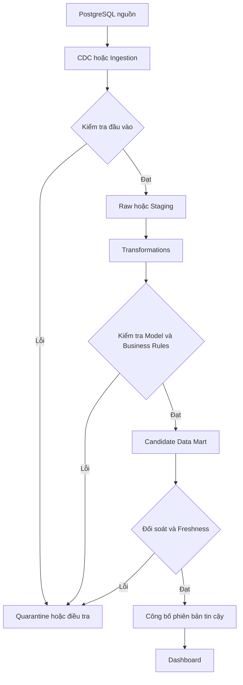
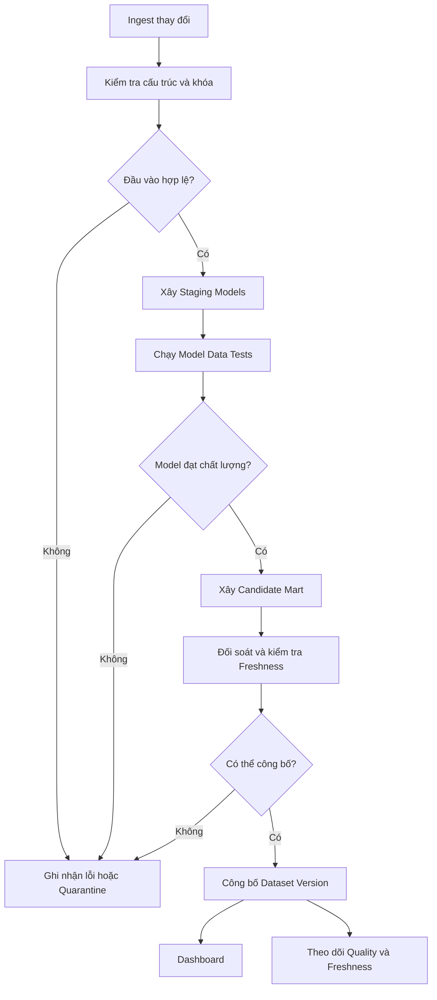

*Mọi job trong Data Pipeline đều báo thành công, không có exception. Nhưng dashboard lại hiển thị doanh thu cao hơn số tiền thực tế. Khi không có thành phần nào trông như bị lỗi, ta nên tìm ở đâu?*

## 1. Tất cả đều màu xanh, nhưng dashboard lại sai

Hãy tưởng tượng một nền tảng thương mại điện tử đưa dữ liệu thanh toán từ PostgreSQL qua Debezium và Kafka sang Data Warehouse. Jobs chạy đúng lịch, Consumers không báo lỗi, Dashboard trả HTTP 200. Nhưng tổng thanh toán thành công hôm qua là 126 triệu đồng trên dashboard và 125 triệu đồng trong hệ thống giao dịch.

Nguyên nhân là một khoản thanh toán một triệu đồng đã được xử lý hai lần. Consumer áp dụng một CDC event, gặp lỗi trước khi xác nhận tiến độ, rồi áp dụng lại event đó sau khi khởi động. Điều này có thể xảy ra với cơ chế phân phối at-least-once. Nếu Transformation cứ cộng giá trị của mỗi event vào tổng, lần replay trở thành một triệu đồng khác trong báo cáo.

Mỗi lần xử lý đều có thể thành công về mặt kỹ thuật. **Pipeline thành công về mặt thực thi, nhưng thất bại về mặt dữ liệu đáng tin cậy.** Như [bài CDC](../change-data-capture-without-scanning-the-database-vi/) đã bàn, đưa thay đổi đến đích mới là một phần công việc. Ta còn phải biết kết quả đủ đầy, không trùng ở nơi cần duy nhất, đủ mới và đúng ý nghĩa nghiệp vụ hay chưa.

## 2. Job chạy thành công khác với dữ liệu đúng

**Pipeline Reliability** hỏi task có chạy, kết nối, retry và ghi kết quả hay không. **Data Quality** hỏi kết quả đó có phù hợp với mục đích sử dụng hay không.

| Tình huống | Vấn đề |
| :--- | :--- |
| Consumer không kết nối được Kafka | Lỗi thực thi. |
| Consumer hoàn thành nhưng ghi hai rows cho cùng payment | Lỗi chất lượng dữ liệu. |
| Rows unique và hợp lệ nhưng khoản hoàn tiền vẫn được cộng vào doanh thu | Lỗi logic nghiệp vụ. |

Job kiểm tra chất lượng có thể chạy thành công *và báo rằng dữ liệu không đạt yêu cầu*. Khi đó hệ thống validation đang làm đúng việc, chứ không nhất thiết là bản thân job bị lỗi.

## 3. Data Quality có nhiều khía cạnh

| Khía cạnh | Câu hỏi | Ví dụ |
| :--- | :--- | :--- |
| Completeness | Có thiếu dữ liệu cần thiết không? | Đơn hàng thiếu `store_id`. |
| Uniqueness | Có bản ghi trùng ngoài mong đợi không? | Hai current-state rows cho cùng `payment_id`. |
| Validity | Giá trị có nằm trong miền đã định nghĩa không? | Giá trị `status` không hợp lệ. |
| Consistency | Các trường và bảng liên quan có khớp không? | Payment tham chiếu order không tồn tại. |
| Freshness | Dữ liệu có đủ mới cho nhu cầu này không? | Báo cáo theo giờ vẫn dùng dữ liệu hôm qua. |
| Accuracy | Có khớp với nguồn tham chiếu đáng tin không? | Amount trong Mart khác nguồn đã đối soát. |

Các nhóm này có thể chồng lấn. Quan trọng hơn, quy tắc kiểm tra phụ thuộc vào **grain**: một row đại diện cho điều gì? Current-state table có thể yêu cầu một row cho mỗi `payment_id`; bảng CDC Event History lại có thể chứa nhiều rows hợp lệ cho cùng payment. Ở một mô hình kế toán, giá trị hoàn tiền âm hoàn toàn có thể đúng. "Payment ID không trùng" và "mọi amount không âm" không phải quy tắc phổ quát.

## 4. Kiểm tra tại những ranh giới dữ liệu

Chỉ chạy test sau khi tạo xong Data Mart vẫn hữu ích, nhưng khó tìm gốc lỗi. Row đã mất khi ingest, bị nhân đôi do JOIN hay bị đổi sai status khi Transformation? Hãy đặt checks tại các ranh giới có ý nghĩa:



Input Checks xác minh dữ liệu đã đến. Model Checks bảo vệ Grain, Relationships và công thức. Publication Checks quyết định phiên bản mới đã an toàn để hiển thị hay chưa. Không phải lỗi nào cũng dừng mọi báo cáo: thiếu mô tả sản phẩm không bắt buộc có thể chỉ cần cảnh báo, còn tổng thanh toán lệch nguồn có thể là lý do giữ lại báo cáo tài chính.

## 5. Kiểm tra cấu trúc trước, rồi kiểm tra ý nghĩa

Một dataset thanh toán có thể yêu cầu `payment_id`, `order_id`, `amount`, `currency`, `status` và `paid_at`. Trường bị đổi tên hoặc status mới có thể làm Consumer lỗi. Tinh vi hơn, Producer giữ nguyên tên và type của `amount` nhưng thay đổi đơn vị. Schema Validation không nhận ra thay đổi ngữ nghĩa ấy.

Hãy nhìn Contract ở hai lớp:

- **Structural:** trường, kiểu dữ liệu, khả năng null, khóa, tập giá trị hợp lệ.
- **Semantic:** đơn vị, Grain, ý nghĩa status, quy tắc tính và yêu cầu Freshness.

dbt có các Generic Data Tests như `unique`, `not_null`, `accepted_values` và `relationships`. Với model `stg_payments` đã chuẩn hóa, một row cho mỗi payment, cấu hình minh họa là:

```yaml
models:
  - name: stg_payments
    columns:
      - name: payment_id
        data_tests:
          - unique
          - not_null
      - name: order_id
        data_tests:
          - not_null
      - name: status
        data_tests:
          - accepted_values:
              arguments:
                values: [pending, paid, failed, refunded]
```

Dạng `arguments` được hỗ trợ ở các phiên bản dbt gần đây; project cũ có thể dùng cú pháp khác. Quan trọng hơn, `unique` trên `payment_id` phù hợp với model **Current State** này, không tự động phù hợp với Raw CDC History.

## 6. Phát hiện trùng mà không xóa mất thay đổi hợp lệ

Vì sao không dùng `DISTINCT` trước khi `SUM`? Vì `pending -> paid -> refunded` là ba events thật của cùng `payment_id`. Xóa trùng theo payment ID sẽ làm mất thay đổi. `SELECT DISTINCT *` cũng có thể không nhận ra replay nếu mỗi lần ingest có timestamp khác.

Phải phân biệt **Entity Identity** với **Event Identity**. Payment ID định danh một khoản thanh toán; Event Identity hoặc metadata nguồn phù hợp định danh một lần thay đổi. Current-state sink có thể dùng UPSERT idempotent cùng kiểm tra version hoặc thứ tự nguồn. Event History cần nhận diện những thay đổi bị phát lại. Với Aggregate, có thể lưu bản ghi event đã xử lý và cập nhật tổng trong cùng Transaction của Sink, hoặc thiết kế deduplication tương đương.

Independent Test vẫn quan trọng. Nếu `stg_payments` cam kết một row cho mỗi payment, truy vấn sau phải trả về rỗng:

```sql
SELECT payment_id, COUNT(*) AS row_count
FROM stg_payments
GROUP BY payment_id
HAVING COUNT(*) > 1;
```

Nó phát hiện Contract bị vi phạm, nhưng không thay thế việc Ingestion phải idempotent.

## 7. Quan hệ có thể sai dù từng trường đều hợp lệ

Giả sử `stg_order_items` có dòng hàng của `ORD-2001`, nhưng `stg_orders` không có đơn tương ứng. Cả hai bảng vẫn có Schema hợp lệ, không Null, nhưng phép INNER JOIN âm thầm loại dòng hàng khỏi tính doanh thu. Relationship Check sẽ phát hiện:

```sql
SELECT oi.order_id
FROM stg_order_items oi
LEFT JOIN stg_orders o ON oi.order_id = o.order_id
WHERE o.order_id IS NULL;
```

Trong CDC, records của hai bảng nguồn có thể tới vào hai thời điểm khác nhau. Thiếu Parent giữa lúc đang đồng bộ có thể chỉ là tạm thời. Hãy chạy kiểm tra quan hệ chặt khi Data Window hoặc Watermark liên quan đã hoàn chỉnh, hoặc quy định mức trễ chấp nhận được. Check phải phù hợp với Consistency Model và Freshness của Pipeline.

## 8. Business Validation bảo vệ phần Schema không thấy

Rows hợp lệ vẫn có thể tạo Metric sai. Payment `paid` và `refunded` đều có amount, status hợp lệ; giá trị nào được tính vào "thanh toán thành công còn hiệu lực" phụ thuộc định nghĩa đã thống nhất. Hệ thống khác có thể biểu diễn refund bằng một Transaction điều chỉnh riêng.

**Business Invariant** là quy tắc dữ liệu hợp lệ phải giữ đúng. Có thể viết nó thành Query trả về các rows thất bại. Nếu Net Amount của dòng hàng được định nghĩa bằng số lượng nhân đơn giá trừ giảm giá:

```sql
SELECT order_line_id
FROM fact_order_lines
WHERE ABS(net_amount - (quantity * unit_price - discount_amount)) > 0.01;
```

Ngưỡng `0.01` chỉ minh họa; hãy chọn độ chính xác và cách làm tròn theo đơn vị tiền tệ, kiểu dữ liệu thực tế. Nên dùng kiểu decimal/numeric phù hợp thay vì floating-point không kiểm soát cho tiền. Dù mọi dòng đều đúng công thức, cả một payment vẫn có thể bị thiếu. Ta cần thêm **Reconciliation**.

## 9. Đối soát với một nguồn có thể so sánh

Reconciliation so kết quả đích với nguồn tham chiếu có thẩm quyền. Chênh lệch 125 và 126 triệu chỉ có ý nghĩa nếu hai bên dùng **cùng cửa hàng, cùng kỳ, múi giờ, trạng thái giao dịch, quy tắc hoàn tiền, tiền tệ và phiên bản dữ liệu**.

Nếu PostgreSQL được Query lúc 10:00 còn Analytics mới xử lý đến 09:55, chênh lệch có thể là Lag dự kiến chứ không phải mất dữ liệu. Chỉ thêm cùng bộ lọc Timestamp vẫn chưa chắc đủ nếu Row cũ được cập nhật sau đó. Đối soát nghiêm ngặt cần Snapshot chung, Source Position, Watermark hoặc cơ chế xác nhận Completeness khác.

Có thể đối soát nhiều mức:

- **Record-level:** `PAY-001` có Amount và Status đúng ở cả hai bên không?
- **Aggregate-level:** tổng thanh toán theo ngày, theo cửa hàng có khớp theo cùng định nghĩa không?
- **Business-level:** kỳ đã chốt có khớp báo cáo kế toán hoặc vận hành được duyệt không?

Không cần so từng Row của bảng lớn trong mọi lần chạy. Nhưng Metric quan trọng phải có nguồn tham chiếu đáng tin và ranh giới so sánh rõ ràng.

## 10. Freshness không chỉ là `MAX(updated_at)`

Dữ liệu có thể hợp lệ và đầy đủ ở một thời điểm cũ, nhưng quá cũ so với Dashboard yêu cầu trễ tối đa 15 phút. Một phép kiểm tra phổ biến là:

```sql
SELECT MAX(updated_at) FROM stg_orders;
```

Nó có thể gây hiểu nhầm. Cửa hàng đóng cửa ba giờ sẽ không có đơn mới dù Pipeline khỏe. Ngược lại, chỉ một Row mới cũng khiến giá trị Max trông rất gần hiện tại dù hàng nghìn thay đổi cũ còn kẹt.

Hãy theo dõi từng lớp: dữ liệu phát sinh ở nguồn khi nào, Ingestion nhận đến đâu, Transformations xử lý đến mốc nào và Dashboard đang dùng phiên bản công bố nào. Batch Completion và Stream Offsets hoặc Watermarks có thể hữu ích hơn một Timestamp trên Row. dbt hỗ trợ Source Freshness Checks, nhưng cột được đo phải đại diện đúng câu hỏi: `updated_at` và `ingested_at` không cùng ý nghĩa.

## 11. Data Contract biến kỳ vọng thành điều rõ ràng

Khi Payment Service thêm Status `partially_refunded`, Backend có thể chạy bình thường nhưng Analytics âm thầm bỏ qua các Payments ấy. **Data Contract** nói rõ Producer cung cấp gì và Consumer có thể dựa vào đâu: Owner, Schema, Grain, đơn vị, Status hợp lệ, Freshness và chính sách thay đổi.

Ví dụ sau là **YAML minh họa ý tưởng**, không phải cấu hình chạy trực tiếp cho công cụ cụ thể:

```yaml
dataset: payments_current_state
owner: payments-platform
grain: one_row_per_payment_id
required_fields: [payment_id, order_id, amount, status]
rules:
  payment_id_unique: true
  order_id_not_null: true
freshness:
  expected_delay_minutes: 15
```

Contract có ích khi các cam kết quan trọng được chuyển thành Tests, Compatibility Checks và quy trình thông báo thay đổi. Tài liệu đứng một mình không làm dữ liệu tự đúng.

## 12. Quality Gates quyết định có nên công bố

Phát hiện lỗi chưa đủ. Chênh lệch 1% trong Metric tài chính quan trọng có thể buộc chặn phiên bản dữ liệu mới; thiếu trường mô tả không bắt buộc có thể chỉ cần cảnh báo.

| Mức độ | Ví dụ | Phản ứng có thể áp dụng |
| :--- | :--- | :--- |
| Critical | Tổng Payment đối soát bị lệch | Không công bố bản mới; điều tra. |
| High | Business Key trùng trong Current State | Quarantine hoặc chặn Models phụ thuộc. |
| Warning | Phân bố dữ liệu đổi bất thường | Cảnh báo và xem xét. |
| Informational | Tỷ lệ Null của trường tùy chọn tăng | Theo dõi xu hướng. |

Để Dashboard không đọc Mart đang cập nhật dở, hãy dựng **Candidate Version**, chạy Checks rồi mới công bố bằng Cutover có kiểm soát. Tùy hệ lưu trữ, đó có thể là Version Pointer, đổi View hoặc Atomic Swap nếu được hỗ trợ; không phải Warehouse nào cũng có cùng bảo đảm. Nếu giữ phiên bản tốt cũ, phải hiển thị Version và thời điểm *as-of*. Đừng trình bày dữ liệu cũ như thể vừa được xác nhận.

## 13. Theo dõi bất thường nhưng đừng coi mọi bất ngờ là lỗi

Cửa hàng thường bán 100 triệu đồng mỗi ngày, hôm nay chỉ có 20 triệu. Có thể Ingestion bỏ sót nguồn, cũng có thể cửa hàng đóng cửa sớm. Cả hai trường hợp đều không cần có Null, Duplicate hay Value sai định dạng.

Hãy theo dõi Row Counts, Totals, Null Rates, Status Distributions, số cửa hàng có dữ liệu và độ lệch với Baseline có tính mùa vụ. Dùng **Deterministic Checks** cho điều kiện luôn phải đúng và **Statistical Monitoring** cho dấu hiệu khác thường cần điều tra. Khuyến mãi, ngày lễ hoặc thay đổi kinh doanh thật có thể là Anomaly nhưng không phải dữ liệu lỗi; đừng biến mọi biến động lớn thành điều kiện chặn cứng.

## 14. Lineage giúp truy nguồn sai số

Nếu tổng Payment trên Dashboard tăng sai, hãy lần theo phụ thuộc:

```text
dashboard_payment_summary
  -> mart_daily_payments
  -> fct_payments
  -> stg_payments
  -> raw_payment_changes
  -> PostgreSQL payments
```

Nếu Duplicate bắt đầu ở `stg_payments` nhưng Raw History chỉ chứa các event replays có thể xảy ra, hãy kiểm tra cơ chế Deduplication của Current State. Nếu Staging đúng mà Mart sai, hãy xem JOIN hoặc Aggregation. **Lineage cho biết quan hệ phụ thuộc, không chứng minh dữ liệu đúng.**

OpenLineage mô tả Datasets, Jobs và Runs, đồng thời hỗ trợ Metadata như Quality Metrics và Assertions. Kể cả chưa có Metadata Platform lớn, nên giữ Run ID, Input Versions hoặc Source Positions, Transformation Version, Output Version, Test Results và Publication Status. Hệ thống phải trả lời được: **Con số này do dữ liệu nào và phiên bản logic nào tạo ra?**

## 15. Một Data Quality Pipeline tối thiểu



Hãy bắt đầu bằng vài Checks có giá trị cao: khóa Unique và Not-null ở **đúng Grain**, Relationships hợp lệ sau khi Data Window hoàn chỉnh, Status được hỗ trợ, Amount và đơn vị tiền tệ rõ ràng, tổng quan trọng đối soát được và ngưỡng Freshness trước khi công bố. Sau sự cố, bổ sung Regression Test. Nếu Event Replay từng làm Payment bị nhân đôi, hãy đưa cùng Event vào hai lần rồi xác minh Current State và Aggregate không đổi sai. Thử cả `paid -> refunded` và điều chỉnh đến muộn của một kỳ cũ.

## 16. Những bẫy thường gặp

- Chỉ Test Mart cuối rồi không biết lỗi bắt đầu ở đâu.
- Áp quy tắc Uniqueness trước khi xác định Grain.
- Coi `MAX(timestamp)` là bằng chứng mọi Record đã tới.
- So Totals giữa hai kỳ hoặc hai định nghĩa nghiệp vụ khác nhau.
- Chặn mọi Statistical Anomaly như thể đã chứng minh dữ liệu sai.
- Ghi trực tiếp vào bảng phục vụ người dùng mà không có kế hoạch Publication an toàn.
- Để Data Contract chỉ nằm trong tài liệu, không được kiểm tra hoặc dùng trong quy trình thay đổi.
- Chỉ theo dõi Job Success Rate trong khi con số sai vẫn đến người dùng.

Metric quan trọng cần nhiều hơn SQL Shape Checks: cần Business Definitions và điểm đối chiếu đáng tin cậy.

## 17. Điều kiện thành công thực sự

Pipeline chạy thành công không tự tạo dữ liệu đáng tin. Records có thể thiếu, trùng, cũ hoặc sai ý nghĩa. Hãy kiểm tra tại các ranh giới, định nghĩa Grain, áp dụng Structural và Business Rules, đối soát số quan trọng, đo Freshness và chỉ công bố phiên bản đáp ứng mức rủi ro đã thống nhất. Dùng Lineage để điều tra lỗi, rồi biến sự cố thành Regression Tests.

Sản phẩm nhỏ có thể bắt đầu nhỏ: vài SQL Checks, đối soát hằng ngày và cảnh báo Freshness đã giúp tránh nhiều sai lầm. Mở rộng Contracts, Gates và Monitoring khi quy mô dữ liệu và tác động nghiệp vụ tăng lên.

**Data Pipeline đáng tin không chỉ đưa Rows đến đúng nơi. Nó phải chứng minh kết quả đủ đúng, đủ đầy và đủ mới cho quyết định mà người dùng sắp đưa ra.**

## References và tài liệu đọc thêm

- [dbt: Data Tests](https://docs.getdbt.com/docs/build/data-tests)
- [dbt: Source Freshness](https://docs.getdbt.com/docs/deploy/source-freshness)
- [dbt: Sources](https://docs.getdbt.com/docs/build/sources)
- [Great Expectations: Validate Data](https://docs.greatexpectations.io/docs/core/introduction/try_gx/)
- [Great Expectations: Run a Checkpoint](https://docs.greatexpectations.io/docs/core/trigger_actions_based_on_results/run_a_checkpoint/)
- [Soda: SodaCL Overview](https://docs.soda.io/soda-documentation/soda-v3/soda-cl-overview)
- [Soda: Data Contracts](https://docs.soda.io/soda-documentation/soda-v3/data-contracts)
- [OpenLineage: Documentation](https://openlineage.io/docs/)
- [OpenLineage: Dataset Facets](https://openlineage.io/docs/spec/facets/dataset-facets/)
- [Debezium: PostgreSQL Connector](https://debezium.io/documentation/reference/stable/connectors/postgresql.html)
