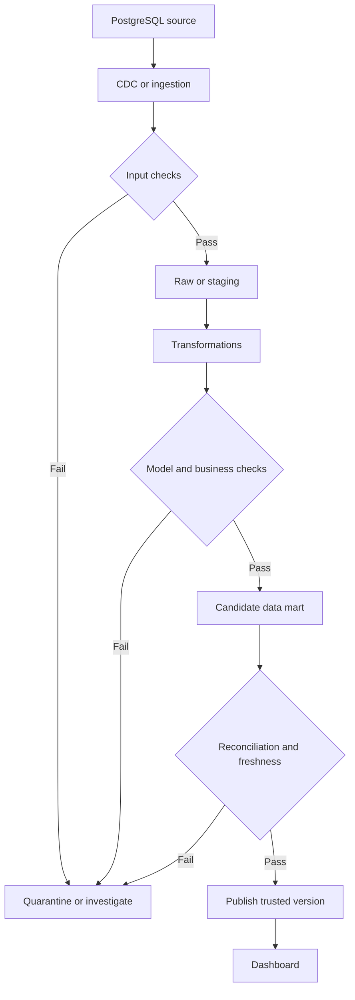
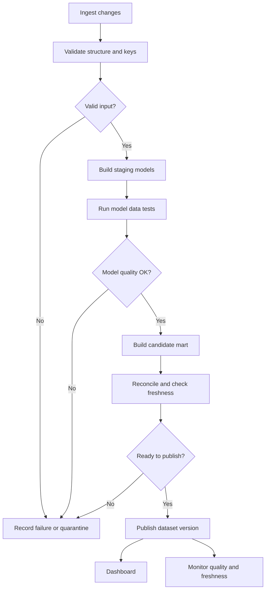

*Every pipeline job finishes successfully. There are no exceptions. Yet the dashboard reports more revenue than the business actually received. Where do we look when nothing appears to be broken?*

## 1. Everything is green, but the dashboard is wrong

Imagine an e-commerce platform moving payment changes from PostgreSQL through Debezium and Kafka into an analytics warehouse. The jobs run on schedule, consumers report no errors, and the dashboard returns HTTP 200. But yesterday's successful payments total 126 million VND in the dashboard and 125 million VND in the transaction system.

The missing explanation is a one-million-VND payment processed twice. A consumer applied a CDC event, failed before acknowledging its progress, then applied the replay after restarting. This can happen with at-least-once delivery. If the transformation blindly adds each event to a running total, a replay becomes another million in the report.

Each processing attempt may have succeeded technically. **The pipeline succeeded as a process and failed as a source of trustworthy data.** As the [CDC article](../change-data-capture-without-scanning-the-database/) explains, moving changes to the destination is only part of the job. We also need to know whether the result is complete, unique where it should be, fresh enough, and faithful to business meaning.

## 2. Job success and data correctness answer different questions

**Pipeline reliability** asks whether a task ran, connected, retried, and wrote output. **Data quality** asks whether that output is fit for its intended use.

These failures are different:

| Situation | What went wrong? |
| :--- | :--- |
| Consumer cannot connect to Kafka | Execution failed. |
| Consumer completes but writes duplicate payment rows | Data quality failed. |
| Rows are unique and valid, but refunded payments count as revenue | Business logic failed. |

A quality-check job can run successfully *and report that the data failed its checks*. That is the validation system doing its work, not necessarily a broken validation job.

## 3. Data quality has several dimensions

| Dimension | Question | Example |
| :--- | :--- | :--- |
| Completeness | Is required data missing? | An order lacks `store_id`. |
| Uniqueness | Are there unintended duplicates? | Two current-state rows for one `payment_id`. |
| Validity | Are values within the defined domain? | An invalid `status` value. |
| Consistency | Do related fields and tables agree? | Payment points to a nonexistent order. |
| Freshness | Is data recent enough for this use? | Hourly report still reflects yesterday. |
| Accuracy | Does it match an authoritative reference? | Mart payment amount differs from the reconciled source. |

These categories can overlap. More importantly, their rules depend on the **grain** of the data: what does one row represent? A current-state table might require one row per `payment_id`; a CDC event history should contain several legitimate rows for the same payment. A refund amount might correctly be negative in one accounting model. "No duplicate payment IDs" and "all amounts nonnegative" are not universal quality rules.

## 4. Check quality at data boundaries

Running tests only after the final mart is useful but makes root-cause analysis harder. Did a row disappear during ingestion, get duplicated by a join, or acquire the wrong status during transformation? Put checks at meaningful boundaries:



Input checks verify what arrived. Model checks protect grain, relationships, and formulas. Publication checks decide whether the latest version is safe to expose. Not every failure must stop every report: a missing optional product description may warrant a warning, while a payment total mismatch may justify holding a financial dashboard.

## 5. Start with structure, then check meaning

A payment dataset might require `payment_id`, `order_id`, `amount`, `currency`, `status`, and `paid_at`. A renamed field or new status can break a consumer. More subtly, a producer can keep the field name and type `amount` while changing its unit. Structural schema validation will not notice that semantic change.

Think of the contract in two layers:

- **Structural:** fields, types, nullability, keys, allowed values.
- **Semantic:** units, grain, status meaning, calculation rules, and expected freshness.

dbt includes generic data tests such as `unique`, `not_null`, `accepted_values`, and `relationships`. For a normalized `stg_payments` model with one row per payment, an illustrative configuration is:

```yaml
models:
  - name: stg_payments
    columns:
      - name: payment_id
        data_tests:
          - unique
          - not_null
      - name: order_id
        data_tests:
          - not_null
      - name: status
        data_tests:
          - accepted_values:
              arguments:
                values: [pending, paid, failed, refunded]
```

The `arguments` form is supported in recent dbt versions; syntax may vary in older projects. Crucially, `unique` on `payment_id` belongs on this **current-state** model, not automatically on raw CDC history.

## 6. Detect duplicates without erasing legitimate changes

Why not use `DISTINCT` before `SUM`? Because `pending -> paid -> refunded` is three real events for one `payment_id`. Deduplicating by payment ID would lose changes. `SELECT DISTINCT *` may not remove a replay if ingestion timestamps differ.

Distinguish **entity identity** from **event identity**. The payment ID names a payment; event identity or suitable source metadata identifies one change. A current-state sink may use an idempotent UPSERT plus version or source-order checks. Event history needs a way to recognize replayed changes. Aggregate updates may need a processed-event record and the update in the same sink transaction, or an equivalent deduplication design.

Independent tests still matter. If `stg_payments` promises one row per payment, this query should return no rows:

```sql
SELECT payment_id, COUNT(*) AS row_count
FROM stg_payments
GROUP BY payment_id
HAVING COUNT(*) > 1;
```

It detects a violated contract; it does not replace idempotent ingestion.

## 7. Relationships can break without invalid fields

Suppose `stg_order_items` contains `ORD-2001` but `stg_orders` does not. Both tables can have valid schemas and no nulls, yet an inner join silently drops that order line from revenue calculations. A relationship check can surface it:

```sql
SELECT oi.order_id
FROM stg_order_items oi
LEFT JOIN stg_orders o ON oi.order_id = o.order_id
WHERE o.order_id IS NULL;
```

With CDC, records from the two source tables can arrive at different times. A missing parent during synchronization can be temporary. Run strict relationship checks only once the relevant data window or watermark is complete, or define a tolerated delay. The check must match the pipeline's consistency and freshness model.

## 8. Business validation protects what schema cannot

Valid rows can still yield a wrong metric. A `paid` payment and a `refunded` payment may both have legal amounts and statuses; which values contribute to "successful payments still in force" depends on the agreed definition. Another system might represent a refund as a separate adjustment transaction.

A **business invariant** is a rule valid data must preserve. It can be expressed as a failing-row query. If a line's net amount is defined as quantity times unit price minus discount:

```sql
SELECT order_line_id
FROM fact_order_lines
WHERE ABS(net_amount - (quantity * unit_price - discount_amount)) > 0.01;
```

The `0.01` threshold is illustrative; choose precision and rounding rules for the actual currency and data types. Prefer appropriate decimal/numeric storage over uncontrolled floating-point arithmetic for money. Even if every line passes, however, an entire payment could still be missing. That requires **reconciliation**.

## 9. Reconcile with a comparable source

Reconciliation compares a destination with an authoritative reference. A 125-versus-126-million gap is useful only when the two figures cover the **same stores, period, timezone, transaction statuses, refund policy, currency, and data version**.

If PostgreSQL is queried at 10:00 while analytics has only processed through 09:55, a difference may be expected lag, not loss. Using the same timestamp filter alone may still be insufficient if older rows were changed later. Strict comparisons need a shared snapshot, source position, watermark, or another completeness mechanism.

Use multiple levels:

- **Record-level:** does `PAY-001` have the expected amount and status?
- **Aggregate-level:** do daily paid totals by store match under the same definition?
- **Business-level:** does a closed period match the approved accounting or operational report?

Not every pipeline needs full row-by-row comparison on every run. But important metrics need a defensible reference and a clear comparison boundary.

## 10. Freshness is not simply `MAX(updated_at)`

Data can be valid and complete for an old point in time but too stale for a 15-minute dashboard requirement. A common probe is:

```sql
SELECT MAX(updated_at) FROM stg_orders;
```

It can mislead. A shop closed for three hours produces no new orders even with a healthy pipeline. Conversely, one recent row can make the maximum look fresh while thousands of older changes remain backlogged.

Track the layers separately: when source events occur, when ingestion receives them, how far transformations have processed, and which published version the dashboard is using. Batch completion and stream offsets or watermarks may be more informative than one row timestamp. dbt offers source freshness checks, but the measured timestamp must represent the question you intend to ask: `updated_at` and `ingested_at` mean different things.

## 11. Data contracts make expectations explicit

When a payment service introduces a new `partially_refunded` status, the backend may work while analytics silently drops those payments. A **data contract** states what a producer provides and what consumers can rely on: owner, schema, grain, units, valid statuses, freshness, and change policy.

For example, this is **conceptual YAML**, not directly executable configuration for a particular tool:

```yaml
dataset: payments_current_state
owner: payments-platform
grain: one_row_per_payment_id
required_fields: [payment_id, order_id, amount, status]
rules:
  payment_id_unique: true
  order_id_not_null: true
freshness:
  expected_delay_minutes: 15
```

A contract becomes useful when its important claims are turned into tests, compatibility checks, and a process for communicating change. Documentation alone does not keep data correct.

## 12. Quality gates decide what to publish

Detection is not enough. A 1% mismatch in a critical financial metric might require blocking a new data version; a missing optional description might only trigger a warning.

| Severity | Example | Possible response |
| :--- | :--- | :--- |
| Critical | Reconciled payment total differs | Do not publish new version; investigate. |
| High | Duplicate current-state business keys | Quarantine or block dependent models. |
| Warning | Unexpected distribution shift | Alert and review. |
| Informational | Rising null rate in optional field | Track trend. |

To avoid exposing half-updated marts, build a **candidate version**, run checks, then publish it through a controlled cutover. The mechanism might be a version pointer, view change, or atomic swap where the storage system supports it; not every warehouse provides the same guarantees. If the last good version stays live, show its version and *as-of* time. Never present stale data as if it were freshly validated.

## 13. Monitor anomalies without calling every surprise an error

A store that normally sells 100 million VND a day reports 20 million today. This could mean ingestion dropped a source, or the store closed early. No null, duplicate, or invalid value is required for either case.

Monitor row counts, totals, null rates, status distributions, active stores, and deviations from seasonal baselines. Use **deterministic checks** for rules that must always hold and **statistical monitoring** for unusual patterns needing investigation. A promotion, holiday, or genuine business change can be an anomaly without being bad data; avoid turning every large movement into a hard publishing block.

## 14. Lineage helps find the failure's origin

If the payment dashboard is high, trace its dependencies:

```text
dashboard_payment_summary
  -> mart_daily_payments
  -> fct_payments
  -> stg_payments
  -> raw_payment_changes
  -> PostgreSQL payments
```

If duplicates start in `stg_payments` but raw history contains only legitimate event replays, investigate current-state deduplication. If staging is correct but the mart is wrong, inspect joins or aggregation. **Lineage shows dependencies; it does not prove correctness.**

OpenLineage models datasets, jobs, and runs and supports metadata such as quality metrics and assertions. Even without a large metadata platform, preserve run ID, input versions or source positions, transformation version, output version, test results, and publication status. You should be able to answer: **which input and which logic produced this number?**

## 15. A small but useful quality pipeline



Start with a few high-value checks: unique non-null keys at the *right grain*, valid relationships after a data window is complete, supported statuses, well-defined amounts and units, reconciled critical totals, and a freshness threshold. Add new tests after incidents. If an event replay once doubled a payment, make replaying that event twice a regression test and verify that current state and aggregates remain correct. Also test `paid -> refunded` and a late adjustment to an older period.

## 16. Common traps

- Testing only final marts, then not knowing where an error began.
- Applying a uniqueness rule before defining the table's grain.
- Treating `MAX(timestamp)` as proof that every record arrived.
- Comparing totals with different time windows or business definitions.
- Blocking every statistical anomaly as though it were a proven data defect.
- Writing directly into a served table without a safe publication plan.
- Keeping data contracts as documents that no check or change process enforces.
- Monitoring only job success rate while incorrect numbers reach users.

Important metrics require more than SQL shape checks: they require business definitions and a trustworthy point of comparison.

## 17. The real success condition

A successful pipeline run does not automatically produce trustworthy data. Records can be missing, duplicated, stale, or semantically wrong. Test at the boundaries, define the grain, enforce structural and business rules, reconcile important numbers, measure freshness, and publish only versions that meet the agreed risk threshold. Use lineage to investigate failures, then turn incidents into regression tests.

Start small if the product is small. A handful of SQL checks, daily reconciliation, and a freshness alert can already prevent expensive mistakes. Expand contracts, gates, and monitoring when data volume and business impact justify them.

**A reliable data pipeline does more than deliver rows. It demonstrates that the result is correct enough, complete enough, and fresh enough for the decision someone is about to make.**

## References and further reading

- [dbt: Data Tests](https://docs.getdbt.com/docs/build/data-tests)
- [dbt: Source Freshness](https://docs.getdbt.com/docs/deploy/source-freshness)
- [dbt: Sources](https://docs.getdbt.com/docs/build/sources)
- [Great Expectations: Validate Data](https://docs.greatexpectations.io/docs/core/introduction/try_gx/)
- [Great Expectations: Run a Checkpoint](https://docs.greatexpectations.io/docs/core/trigger_actions_based_on_results/run_a_checkpoint/)
- [Soda: SodaCL Overview](https://docs.soda.io/soda-documentation/soda-v3/soda-cl-overview)
- [Soda: Data Contracts](https://docs.soda.io/soda-documentation/soda-v3/data-contracts)
- [OpenLineage: Documentation](https://openlineage.io/docs/)
- [OpenLineage: Dataset Facets](https://openlineage.io/docs/spec/facets/dataset-facets/)
- [Debezium: PostgreSQL Connector](https://debezium.io/documentation/reference/stable/connectors/postgresql.html)
