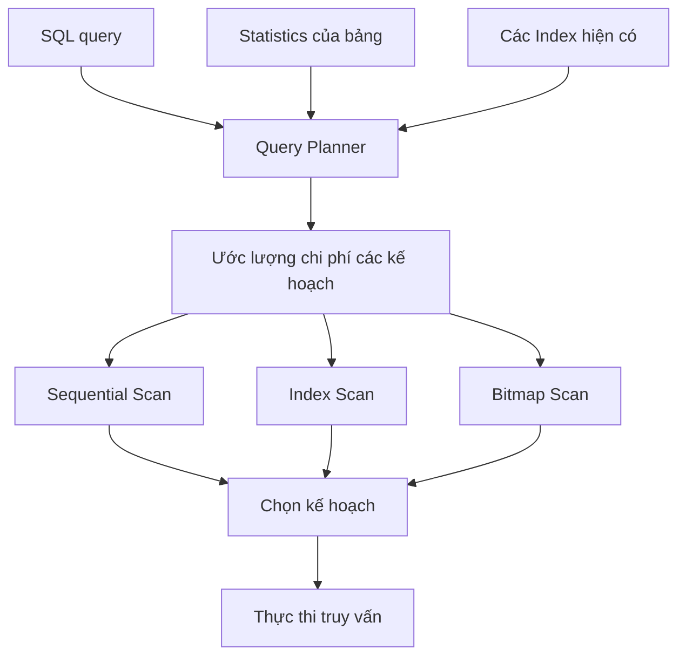
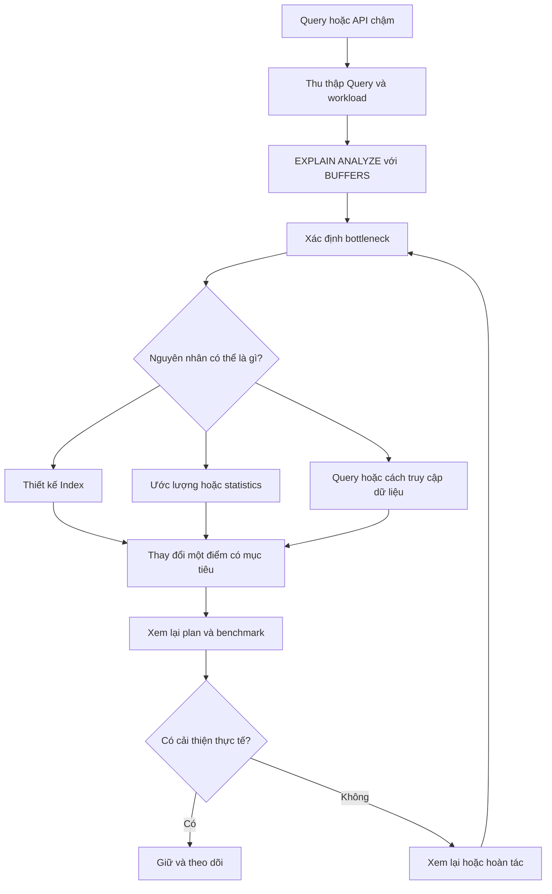

*Một câu SQL chạy chậm, chúng ta thêm Index để tối ưu. Nhưng đôi khi PostgreSQL vẫn quét toàn bộ bảng, thậm chí workload còn chậm hơn. Điều gì thực sự xảy ra bên trong database?*

## 1. Đã tạo Index nhưng Query vẫn chậm

Giả sử một hệ thống quản lý đơn hàng có API:

```http
GET /api/orders?store_id=42
```

API lấy 20 đơn hàng gần nhất của một cửa hàng:

```sql
SELECT *
FROM orders
WHERE store_id = 42
ORDER BY created_at DESC
LIMIT 20;
```

Khi bảng chỉ có vài nghìn đơn hàng, truy vấn chạy nhanh. Nhưng khi dữ liệu tăng lên hàng triệu rows, độ trễ bắt đầu tăng. Phản xạ tự nhiên là thêm Index:

```sql
CREATE INDEX idx_orders_store_id ON orders (store_id);
```

Thế nhưng mức cải thiện có thể không đáng kể. Có lúc `EXPLAIN` vẫn hiển thị `Seq Scan`. Tại sao PostgreSQL không dùng Index đã có?

**Index là một phương án truy cập dữ liệu, không phải chỉ thị bắt buộc database phải sử dụng.** Query Planner chọn kế hoạch mà nó *ước lượng* là rẻ hơn. Ước lượng đó phụ thuộc vào câu SQL, phân bố dữ liệu, kích thước bảng và statistics.

## 2. Sequential Scan không mặc định là lỗi

`Seq Scan` đọc các trang dữ liệu của bảng và kiểm tra rows nào thỏa điều kiện. Nếu chỉ cần vài rows trong một bảng rất lớn, cách này có thể tốn kém. Nhưng nếu cần đọc phần lớn bảng, quét tuần tự có thể rẻ hơn việc liên tục đi qua Index rồi quay lại bảng để lấy từng row.

Ví dụ, nếu 90% đơn hàng đã hoàn thành, Index trên `status` có thể không giúp nhiều cho truy vấn:

```sql
SELECT * FROM orders WHERE status = 'completed';
```

Với bảng chỉ có vài chục rows, đọc toàn bộ bảng cũng có thể nhanh hơn đi qua Index. Mục tiêu không phải ép mọi execution plan hiện `Index Scan`. Mục tiêu là **giảm chi phí thực tế của workload**.

## 3. B-Tree Index giúp được gì?

PostgreSQL mặc định tạo B-tree khi dùng `CREATE INDEX`. Các khóa được sắp thứ tự, phù hợp với nhiều truy vấn so sánh bằng, khoảng giá trị và sắp xếp. Có thể hình dung nó như một cuốn danh mục có cấu trúc: đi từ root qua các trang trung gian tới leaf entries, rồi xác định rows tương ứng trong bảng.

Với `WHERE store_id = 42`, Index có thể thu hẹp phạm vi tìm kiếm vào các entries của cửa hàng 42. Nhưng tìm thấy vị trí chưa có nghĩa là đã lấy xong dữ liệu. Với `SELECT *`, database thường cần những cột không nằm trong Index, nên phải truy cập *heap* (dữ liệu bảng). Nếu nhiều rows phù hợp nằm rải rác trên nhiều trang, các lần truy cập heap có thể làm lợi ích của Index giảm đi.

**Tìm được row qua Index không đồng nghĩa đọc kết quả truy vấn sẽ rẻ.**

## 4. Query Planner chọn cách đọc dữ liệu

PostgreSQL xem xét những kế hoạch có thể dùng và chọn kế hoạch có *chi phí ước lượng* thấp nhất. Sơ đồ dưới đây đã đơn giản hóa quá trình; một execution plan thực tế có thể kết hợp nhiều thao tác, không chỉ chọn đúng một loại scan:



Ba yếu tố đặc biệt quan trọng:

- **Selectivity:** dự kiến bao nhiêu rows thỏa điều kiện? Tìm 100 trong một triệu rows rất khác với lấy 900.000.
- **Kích thước bảng:** quét một bảng nhỏ thường không tốn bao nhiêu.
- **Statistics:** PostgreSQL dùng các ước lượng về số rows và phân bố giá trị, được cập nhật qua `ANALYZE` và cơ chế bảo trì tự động. Statistics cũ hoặc chưa đủ tốt có thể dẫn tới ước lượng sai.

Một cột xuất hiện trong `WHERE` không tự động có nghĩa cột đó cần Index.

## 5. Xem Query Plan trước khi sửa schema

`EXPLAIN` hiển thị kế hoạch PostgreSQL dự kiến sử dụng:

```sql
EXPLAIN
SELECT * FROM orders WHERE store_id = 42;
```

Muốn biết điều gì thực sự xảy ra, hãy dùng:

```sql
EXPLAIN (ANALYZE, BUFFERS)
SELECT * FROM orders WHERE store_id = 42;
```

`ANALYZE` **thực sự chạy** câu lệnh rồi báo thời gian và số rows thực tế. `BUFFERS` cho biết mức sử dụng database buffers. Hãy xem loại scan, `Index Cond` so với `Filter`, estimated rows so với actual rows, thao tác sort, buffer activity và execution time. Chênh lệch lớn giữa rows ước lượng và thực tế có thể gợi ý vấn đề ở statistics. Giá trị `cost` trong plan là **đơn vị chi phí nội bộ của Planner, không phải milliseconds**.

Hai đoạn sau chỉ minh họa cấu trúc plan, không phải kết quả benchmark:

```text
Seq Scan on orders
  Filter: (store_id = 42)

Index Scan using idx_orders_store_id on orders
  Index Cond: (store_id = 42)
```

Cẩn thận với `EXPLAIN ANALYZE` trên `UPDATE`, `DELETE` và các câu lệnh ghi khác: nó thực sự thực thi chúng. Hãy kiểm thử an toàn trước khi dùng trên dữ liệu production.

## 6. Composite Index: kết hợp lọc, sắp xếp và LIMIT

Quay lại truy vấn ban đầu. Index trên `store_id` giúp tìm đơn hàng của cửa hàng, nhưng PostgreSQL có thể vẫn phải sort theo `created_at` trước khi lấy 20 rows. Composite Index có thể hỗ trợ cả hai phần:

```sql
CREATE INDEX idx_orders_store_created
ON orders (store_id, created_at DESC);
```

Với `store_id = 42`, B-tree sắp các entries theo `created_at`. Nếu kế hoạch phù hợp, database có thể đọc những đơn mới nhất rồi dừng khi đã lấy đủ, thay vì sort một tập dữ liệu lớn. Cách này đặc biệt hữu ích cho `ORDER BY ... LIMIT`, nhưng vẫn cần đo để xác nhận.

Thứ tự cột rất quan trọng. `(store_id, created_at)` và `(created_at, store_id)` không phục vụ mọi workload hiệu quả như nhau. Điều kiện bằng trên cột đầu `store_id` khiến Index thứ nhất là ứng viên tự nhiên cho truy vấn này. PostgreSQL đôi khi vẫn dùng được multicolumn index khi thiếu điều kiện trên cột đầu, gồm cả skip scan trong tình huống thích hợp. Vì vậy đây là quy tắc về **hiệu quả thường gặp**, không phải tuyên bố rằng chiều ngược lại luôn bất khả thi.

## 7. Vì sao Index có thể không được chọn?

Nếu Index không được dùng, hãy kiểm tra plan và dữ liệu trước khi thêm Index khác:

1. **Quá nhiều rows phù hợp.** Khi điều kiện lọc trả về gần hết bảng, Seq Scan có thể rẻ hơn.
2. **Biểu thức thay đổi kiểu tìm kiếm.** Index thông thường trên `created_at` không tự động hỗ trợ `WHERE created_at::date = DATE '2026-11-15'` như một điều kiện khoảng trên cột gốc. Khi phù hợp, có thể viết lại thành khoảng thời gian:

   ```sql
   WHERE created_at >= TIMESTAMPTZ '2026-11-15 00:00:00+00'
     AND created_at <  TIMESTAMPTZ '2026-11-16 00:00:00+00'
   ```

   Ví dụ này giả định `created_at` là `timestamptz` và ngày nghiệp vụ được tính theo UTC. Nếu tính theo múi giờ địa phương, phải xác định hai mốc theo múi giờ đó. Expression Index là một lựa chọn khác nếu workload thực sự dùng biểu thức ấy.
3. **Statistics cũ hoặc chưa đủ.** So sánh estimated rows với actual rows; `ANALYZE orders;` có thể hữu ích sau khi dữ liệu thay đổi mạnh.
4. **Bảng quá nhỏ.** Quét toàn bộ có thể thật sự nhanh hơn.
5. **Index chưa khớp cả câu Query.** Lọc được theo một cột nhưng vẫn phải sort nhiều hoặc truy cập heap liên tục.

Đây là những giả thuyết cần kiểm tra, không phải chẩn đoán có thể đưa ra chỉ vì nhìn thấy `Seq Scan`.

## 8. Thiết kế Index theo workload

### Partial Index

Giả sử chỉ 5% đơn hàng đang `pending`, nhưng ứng dụng thường xuyên truy vấn nhóm này. Partial Index có thể tập trung đúng phần dữ liệu cần thiết:

```sql
CREATE INDEX idx_orders_pending
ON orders (store_id, created_at DESC)
WHERE status = 'pending';
```

Index này có thể giúp những truy vấn có điều kiện suy ra `status = 'pending'`. PostgreSQL phải nhận ra mối quan hệ đó khi lập kế hoạch. Điều kiện viết theo cách khác hoặc dùng tham số, đặc biệt với generic plan của prepared statement, có thể khiến Index không được chọn. Hãy kiểm tra plan từ truy vấn ứng dụng thực sự chạy, không chỉ bản SQL viết tay với giá trị cố định.

### Covering Index

`INCLUDE` lưu thêm cột trong B-tree mà không biến chúng thành search keys:

```sql
CREATE INDEX idx_orders_lookup
ON orders (store_id, created_at DESC)
INCLUDE (status, total_amount);
```

Nếu Query chỉ cần những cột có trong Index, PostgreSQL có thể dùng `Index Only Scan`. Tuy nhiên, cơ chế MVCC vẫn có thể buộc database truy cập heap để kiểm tra row có hiển thị hay không; lợi ích phụ thuộc visibility map và tần suất cập nhật dữ liệu. Cột bổ sung cũng khiến Index lớn hơn. Đặc biệt, Index trên **không** bao phủ câu `SELECT *` ban đầu nếu còn cột khác chưa nằm trong nó.

### Các loại Index khác

| Loại | Tình huống thường gặp |
| :--- | :--- |
| B-tree | So sánh bằng, khoảng giá trị, sắp xếp |
| GIN | Arrays, nhiều phép toán `jsonb`, full-text search |
| GiST | Dữ liệu không gian và các phép toán đặc thù |
| BRIN | Bảng rất lớn, giá trị có tương quan với thứ tự lưu trữ vật lý |
| Hash | Tìm kiếm so sánh bằng |

Cấu trúc phù hợp được quyết định bởi phép toán và phân bố dữ liệu, không phải bởi tên Index mình thích.

## 9. Cái giá của việc thêm Index

Mỗi Index chiếm dung lượng lưu trữ. Các thao tác thêm, xóa và một số thao tác cập nhật row cần bảo trì Index. Nhiều Index hơn có thể tăng độ trễ ghi, I/O và công việc vận hành, ngay cả khi một câu `SELECT` được cải thiện. Index ít dùng không hề miễn phí.

Trên bảng production đang có nhiều giao dịch, cách tạo Index thông thường có thể ảnh hưởng thao tác ghi. PostgreSQL cung cấp:

```sql
CREATE INDEX CONCURRENTLY idx_orders_store_created
ON orders (store_id, created_at DESC);
```

Cách này tránh chặn các thao tác ghi thông thường theo kiểu của một lần build tiêu chuẩn, nhưng có thể chạy lâu hơn và vẫn tốn CPU, I/O. Nó không thể nằm trong transaction block thông thường; nếu thất bại, nó có thể để lại invalid index cần xử lý. Vì vậy phải có kế hoạch triển khai, theo dõi và rollback.

Indexing là một quyết định cho **toàn bộ workload**, không phải cuộc đua tạo càng nhiều Index càng tốt.

## 10. Một vòng lặp tối ưu có thể đo được



Đầu tiên, hãy tìm đúng Query gây tác động lớn. Một truy vấn mất 500 ms nhưng chỉ chạy mỗi ngày một lần có thể ít tốn tài nguyên hơn truy vấn 40 ms được gọi hàng nghìn lần mỗi phút. `pg_stat_statements` giúp tìm các câu lệnh đã chuẩn hóa được gọi nhiều hoặc tiêu tốn nhiều thời gian.

Sau đó xem plan, đưa ra **một** giả thuyết, thay đổi một điểm và chạy lại trên dữ liệu, tham số tương đương. So sánh thời gian thực thi, buffer activity, sorting và ảnh hưởng đến Query khác. Thử nhiều giá trị `store_id`: kế hoạch tốt cho cửa hàng nhỏ có thể không tốt cho cửa hàng rất lớn.

Với quyết định liên quan production, hãy đo p50/p95 latency, throughput, tác động lên thao tác ghi và mức concurrency đại diện. Trạng thái cache và quy mô dữ liệu có thể khiến bài test nhỏ cho kết quả lệch. Plan trông hợp lý hơn là một tín hiệu; **cải thiện workload đo được** mới là kết quả cần quan tâm.

## 11. Những sai lầm thường gặp

- **Thêm Index cho mọi cột trong `WHERE`:** selectivity và cách kết hợp lọc/sắp xếp quan trọng hơn việc cột có xuất hiện trong một clause hay không.
- **Xem mọi `Seq Scan` là lỗi:** đôi khi đó chính là cách rẻ nhất.
- **Bỏ qua `ORDER BY` và `LIMIT`:** tìm được rows mới là một phần công việc.
- **Chỉ test một câu `SELECT`:** thao tác ghi và những Query đọc khác cũng chịu tác động của Index mới.
- **Benchmark trên dữ liệu không đại diện:** bảng test vài nghìn rows khó phản ánh bảng production hàng triệu rows.
- **Mong Index xử lý mọi bottleneck:** các phép tổng hợp lớn, lặp đi lặp lại có thể cần pre-aggregation, materialized views, partitioning hoặc hệ thống phân tích phù hợp hơn.

## 12. Câu hỏi nên đặt ra

PostgreSQL quyết định cách thực thi Query dựa trên những đường truy cập hiện có và chi phí ước lượng. B-tree có thể rất tốt cho truy vấn chọn lọc; Composite Index có thể kết hợp lọc và sắp xếp; Partial và Covering Index phục vụ những workload hẹp hơn. Nhưng mỗi loại đều có chi phí lưu trữ và bảo trì.

Vì vậy, trước khi thêm Index, hãy đọc Query Plan và hiểu workload. Sau khi thêm, đọc lại plan và đo kết quả. **Một Index tốt không phải Index nằm trên cột có vẻ quan trọng, mà là Index giúp các Query quan trọng rẻ hơn mà không làm toàn hệ thống tệ đi.** Đôi khi quyết định tối ưu nhất là không thêm Index.

## References và tài liệu đọc thêm

- [PostgreSQL: Indexes](https://www.postgresql.org/docs/current/indexes.html)
- [PostgreSQL: Index Types](https://www.postgresql.org/docs/current/indexes-types.html)
- [PostgreSQL: Using EXPLAIN](https://www.postgresql.org/docs/current/using-explain.html)
- [PostgreSQL: Planner Statistics](https://www.postgresql.org/docs/current/planner-stats.html)
- [PostgreSQL: Multicolumn Indexes](https://www.postgresql.org/docs/current/indexes-multicolumn.html)
- [PostgreSQL: Indexes and ORDER BY](https://www.postgresql.org/docs/current/indexes-ordering.html)
- [PostgreSQL: Partial Indexes](https://www.postgresql.org/docs/current/indexes-partial.html)
- [PostgreSQL: Index-Only Scans and Covering Indexes](https://www.postgresql.org/docs/current/indexes-index-only-scans.html)
- [PostgreSQL: CREATE INDEX](https://www.postgresql.org/docs/current/sql-createindex.html)
- [PostgreSQL: pg_stat_statements](https://www.postgresql.org/docs/current/pgstatstatements.html)
