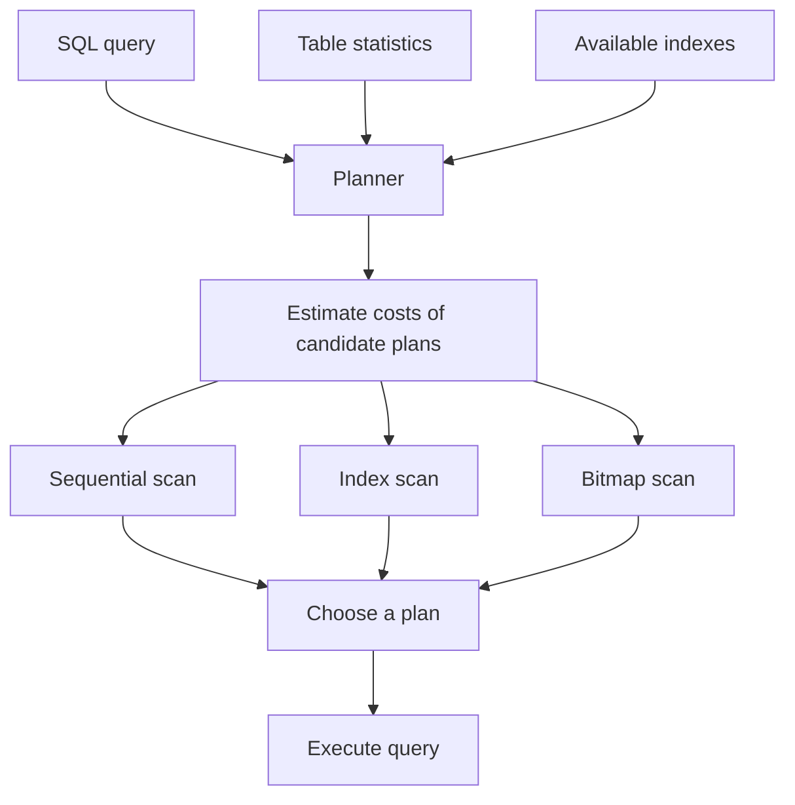
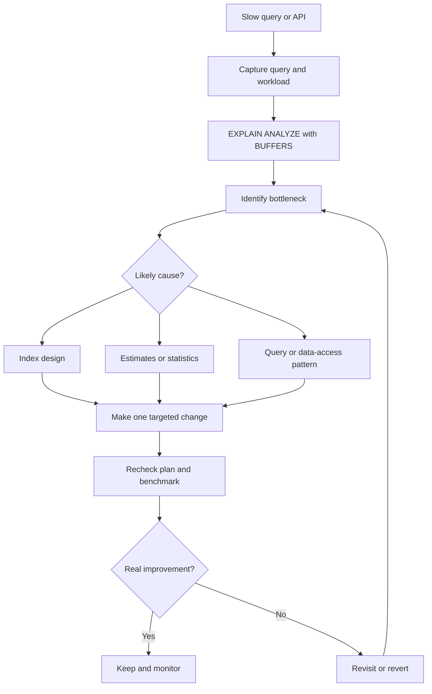

*A SQL query is slow, so we add an index. Yet PostgreSQL may still scan the whole table, or the workload may even get slower. What is the database actually optimizing?*

## 1. The index exists, but the query is still slow

Imagine an order-management API:

```http
GET /api/orders?store_id=42
```

Its database query returns the 20 most recent orders for a store:

```sql
SELECT *
FROM orders
WHERE store_id = 42
ORDER BY created_at DESC
LIMIT 20;
```

This works well with a few thousand orders. As the table grows to millions of rows, latency rises. The first instinct is to add an index:

```sql
CREATE INDEX idx_orders_store_id ON orders (store_id);
```

But the improvement may be small. In some cases, `EXPLAIN` still shows a `Seq Scan`. Why would PostgreSQL ignore an index it knows about?

**An index is an available path to the data, not an instruction to use it.** The query planner chooses a plan it *estimates* will cost less. Whether that estimate is good depends on the query, data distribution, table size, and statistics.

## 2. A sequential scan is not automatically a problem

A `Seq Scan` reads table pages and checks which rows satisfy the filter. If a query needs only a handful of rows from a large table, that can be wasteful. If it needs most of the table, sequential reading can be cheaper than repeatedly visiting an index and fetching rows from the table.

For example, an index on `status` might offer little benefit to this query if 90% of orders are already completed:

```sql
SELECT * FROM orders WHERE status = 'completed';
```

Likewise, for a tiny table, reading every row may be cheaper than traversing an index. The goal is not to make every plan say `Index Scan`. The goal is to lower the **real cost of the workload**.

## 3. What a B-tree index buys us

PostgreSQL uses a B-tree by default for `CREATE INDEX`. Its ordered keys support common equality and range searches, and can also help with ordering. You can picture it as a structured directory: navigate from the root through internal pages to leaf entries, then locate matching table rows.

For `WHERE store_id = 42`, an index can narrow the search to entries for that store. But locating entries is not necessarily the end of the work. With `SELECT *`, the database usually needs columns not stored in the index, so it fetches the corresponding rows from the *heap* (the table data). If there are many matches scattered across heap pages, those visits can outweigh the index benefit.

That is why **finding rows through an index is not the same as reading the query result cheaply**.

## 4. The planner chooses the access path

PostgreSQL considers possible plans and chooses one with the lowest *estimated* cost. This diagram simplifies the process; a real plan may combine several operations rather than choosing exactly one scan node:



Three inputs matter especially here:

- **Selectivity:** how many rows are expected to match? Finding 100 out of a million is different from fetching 900,000.
- **Table size:** scanning a very small table is often cheap.
- **Statistics:** PostgreSQL uses estimates of row counts and value distributions, refreshed by `ANALYZE` and automatic maintenance. Stale or insufficient statistics can lead to poor estimates.

A column appearing in `WHERE` is not, by itself, a reason to index it.

## 5. Inspect the plan before changing the schema

`EXPLAIN` shows the plan PostgreSQL expects to use:

```sql
EXPLAIN
SELECT * FROM orders WHERE store_id = 42;
```

To see what actually happened, use:

```sql
EXPLAIN (ANALYZE, BUFFERS)
SELECT * FROM orders WHERE store_id = 42;
```

`ANALYZE` **executes** the statement and reports actual timing and row counts. `BUFFERS` reports buffer usage. Inspect the scan type, `Index Cond` versus `Filter`, estimated versus actual rows, sorting, buffer activity, and execution time. A large estimate/actual mismatch can point to a statistics problem. The plan's `cost` values are planner units, **not milliseconds**.

The following are only illustrative plan fragments, not benchmark results:

```text
Seq Scan on orders
  Filter: (store_id = 42)

Index Scan using idx_orders_store_id on orders
  Index Cond: (store_id = 42)
```

Be careful with `EXPLAIN ANALYZE` on `UPDATE`, `DELETE`, or other write statements: it really runs them. Test safely before using it against production data.

## 6. Match a composite index to filtering, ordering, and LIMIT

Return to the original query. An index on `store_id` can find the store's orders, but PostgreSQL may still need to sort them by `created_at` before returning 20. A composite index can support both parts:

```sql
CREATE INDEX idx_orders_store_created
ON orders (store_id, created_at DESC);
```

For `store_id = 42`, the B-tree orders entries by `created_at`. A suitable plan can read recent entries and stop after finding enough rows, avoiding a large sort. This is particularly useful with `ORDER BY ... LIMIT`, but its value still needs measurement.

Column order matters. `(store_id, created_at)` and `(created_at, store_id)` do not serve the same workload equally well. An equality condition on the leading `store_id` column makes the first index a natural candidate here. PostgreSQL can sometimes use a multicolumn index without a condition on its first column, including via skip scan in appropriate cases, so the rule is about **typical efficiency**, not impossibility.

## 7. Why an index might not be chosen

When an index is unused, check the plan and data before creating another one:

1. **Too many matches.** If a filter returns most rows, a sequential scan may win.
2. **An expression changes the lookup.** An ordinary index on `created_at` does not automatically support `WHERE created_at::date = DATE '2026-11-15'` as a plain range condition. Where appropriate, rewrite it as a timestamp range:

   ```sql
   WHERE created_at >= TIMESTAMPTZ '2026-11-15 00:00:00+00'
     AND created_at <  TIMESTAMPTZ '2026-11-16 00:00:00+00'
   ```

   This example assumes `created_at` is `timestamptz` and the business day is defined in UTC. For a local calendar day, compute bounds in that time zone. An expression index is another option if the expression is truly the workload.
3. **Statistics are stale or inadequate.** Check estimates against actual rows; `ANALYZE orders;` may help after major data changes.
4. **The table is small.** A full scan may genuinely be faster.
5. **The index does not match the whole query.** Filtering on one column may still leave an expensive sort or many heap fetches.

These are hypotheses, not diagnoses you can make from the mere presence of `Seq Scan`.

## 8. Index designs for particular workloads

### Partial indexes

If only 5% of orders are `pending` and the application frequently queries that subset, a partial index may be more targeted:

```sql
CREATE INDEX idx_orders_pending
ON orders (store_id, created_at DESC)
WHERE status = 'pending';
```

It can help queries whose predicates imply `status = 'pending'`. PostgreSQL must recognize that implication at planning time. Parameterized or differently expressed predicates, especially generic prepared plans, may not qualify. Inspect the plan generated by the application, not just a hand-written query with literals.

### Covering indexes

`INCLUDE` stores extra columns in a B-tree without making them search keys:

```sql
CREATE INDEX idx_orders_lookup
ON orders (store_id, created_at DESC)
INCLUDE (status, total_amount);
```

If the query needs only columns available from this index, an `Index Only Scan` may be possible. It is not guaranteed to avoid heap visits: PostgreSQL's MVCC visibility checks can still require them, depending on the visibility map and update pattern. Extra columns also make the index larger. In particular, this index does **not** cover our original `SELECT *` unless every selected column is present.

### Other index types

| Type | Common fit |
| :--- | :--- |
| B-tree | Equality, ranges, ordering |
| GIN | Arrays, many `jsonb` operations, full-text search |
| GiST | Spatial and other specialized operators |
| BRIN | Very large tables where values correlate with physical row order |
| Hash | Equality lookups |

The right structure follows the operators and data distribution, not a preference for one index name.

## 9. An index has a cost beyond reads

Every index uses storage. Inserts, deletes, and some updates need index maintenance. More indexes can add write latency, I/O, and operational work even when a single `SELECT` improves. An unused index is not free.

On a busy production table, a regular index build can interfere with writes. PostgreSQL offers:

```sql
CREATE INDEX CONCURRENTLY idx_orders_store_created
ON orders (store_id, created_at DESC);
```

Concurrent creation avoids blocking ordinary writes in the same way as a standard build, but it can take longer and still consumes CPU and I/O. It cannot run inside a normal transaction block, and a failed build can leave an invalid index that needs attention. Schedule, monitor, and have a rollback plan.

Indexing is therefore a **workload-level decision**, not a contest to maximize the number of indexes.

## 10. A measurable optimization loop



First find the queries that matter. A 500 ms query called once a day may cost less overall than a 40 ms query called thousands of times each minute. `pg_stat_statements` can help identify frequent or expensive normalized statements.

Then inspect the plan, form **one** hypothesis, change one thing, and rerun the test with comparable data and parameters. Compare execution time, buffer activity, sorting, and effects on other queries. Include different `store_id` values: a plan good for a small store may be poor for a very large one.

For production-facing decisions, measure p50/p95 latency, throughput, write impact, and representative concurrency. Cache state and data scale can distort a small test. A better-looking plan is useful evidence; a measured workload improvement is the result we care about.

## 11. Common traps

- **Index every `WHERE` column:** selectivity and combined filter/order patterns matter more than the presence of a column in a clause.
- **Treat every `Seq Scan` as failure:** sometimes it is the cheapest path.
- **Ignore `ORDER BY` and `LIMIT`:** finding rows is only part of the query.
- **Test only one `SELECT`:** writes and other reads also pay for the new index.
- **Benchmark on unrepresentative data:** a thousand-row test table rarely behaves like a production table with millions of rows.
- **Expect indexing to solve every bottleneck:** large recurring aggregations may call for pre-aggregation, materialized views, partitioning, or an analytical system instead.

## 12. The useful question

PostgreSQL decides how to execute a query using the available access paths and its estimates of their costs. A B-tree can be excellent for a selective lookup; a composite index can align filtering and ordering; partial and covering indexes can suit narrower workloads. Each also has storage and maintenance costs.

So before adding an index, inspect the query plan and understand the workload. After adding one, inspect and measure again. **A good index is not one on a column that looks important. It is one that makes important queries cheaper without making the overall system worse.** Sometimes the best optimization is not adding an index at all.

## References and further reading

- [PostgreSQL: Indexes](https://www.postgresql.org/docs/current/indexes.html)
- [PostgreSQL: Index Types](https://www.postgresql.org/docs/current/indexes-types.html)
- [PostgreSQL: Using EXPLAIN](https://www.postgresql.org/docs/current/using-explain.html)
- [PostgreSQL: Planner Statistics](https://www.postgresql.org/docs/current/planner-stats.html)
- [PostgreSQL: Multicolumn Indexes](https://www.postgresql.org/docs/current/indexes-multicolumn.html)
- [PostgreSQL: Indexes and ORDER BY](https://www.postgresql.org/docs/current/indexes-ordering.html)
- [PostgreSQL: Partial Indexes](https://www.postgresql.org/docs/current/indexes-partial.html)
- [PostgreSQL: Index-Only Scans and Covering Indexes](https://www.postgresql.org/docs/current/indexes-index-only-scans.html)
- [PostgreSQL: CREATE INDEX](https://www.postgresql.org/docs/current/sql-createindex.html)
- [PostgreSQL: pg_stat_statements](https://www.postgresql.org/docs/current/pgstatstatements.html)
