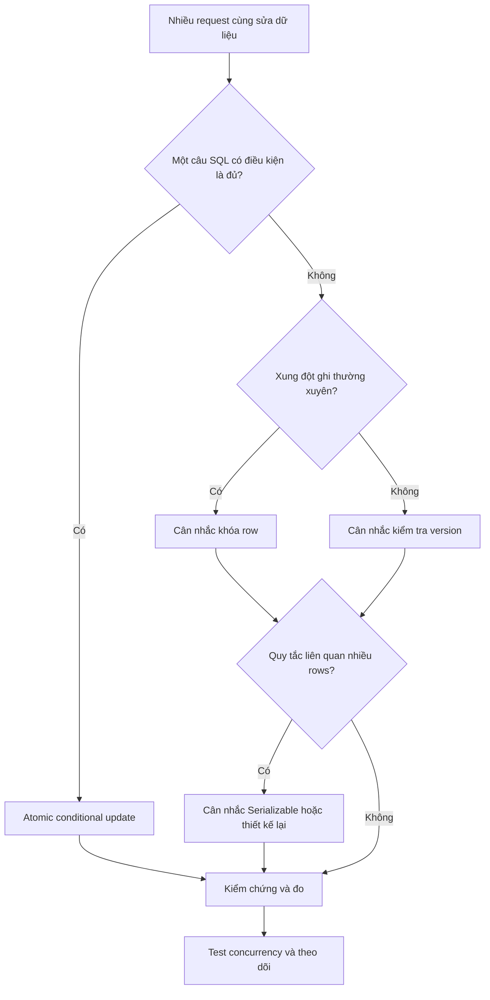

*Một sản phẩm chỉ còn một món trong kho, nhưng hai khách hàng lại đặt mua thành công cùng lúc. Database không báo lỗi, các câu SQL đều chạy. Vậy hệ thống đã sai ở đâu?*

## 1. Hai request thành công, một quy tắc nghiệp vụ bị phá vỡ

Giả sử `SKU-001` chỉ còn một món. Ứng dụng xử lý mỗi đơn hàng như sau:

```python
stock = get_product_stock("SKU-001")

if stock > 0:
    create_order("SKU-001")
    update_product_stock("SKU-001", stock - 1)
```

Với một request, đoạn code có vẻ ổn. Nhưng khi hai request đến cùng lúc, cả hai có thể cùng đọc được `1`, cùng tạo đơn, rồi cùng ghi giá trị đã tính trước là `0`. Kết quả: tồn kho bằng không, nhưng đã bán hai món. Không cần có câu SQL nào thất bại thì **quy tắc nghiệp vụ** vẫn có thể bị vi phạm.

```mermaid
sequenceDiagram
    participant A as Request A
    participant DB as PostgreSQL
    participant B as Request B
    A->>DB: Đọc tồn kho
    DB-->>A: 1
    B->>DB: Đọc tồn kho
    DB-->>B: 1
    A->>DB: Ghi tồn kho = 0; tạo đơn A
    B->>DB: Ghi tồn kho = 0; tạo đơn B
    Note over A,B: Có 2 đơn hàng, tồn kho cuối = 0
```

Đây là **race condition**: kết quả phụ thuộc vào thứ tự và thời điểm các thao tác đồng thời xen vào nhau. Sơ đồ biểu diễn trình tự logic; thao tác ghi thực tế lên cùng một row có thể phải chờ lock của nhau. Lỗi tương tự có thể xảy ra với số dư, đặt ghế hoặc hai workers cùng nhận một công việc.

## 2. Transaction giải quyết điều gì, và không giải quyết điều gì?

Một đơn hàng cần cả việc trừ kho lẫn tạo bản ghi đơn. Nếu trừ kho thành công nhưng tạo đơn thất bại, ta không muốn chỉ một thay đổi được giữ lại. Transaction nhóm chúng thành một đơn vị:

```sql
BEGIN;

UPDATE inventory
SET available_stock = available_stock - 1
WHERE product_id = 'SKU-001';

INSERT INTO orders (order_id, product_id)
VALUES (1001, 'SKU-001');

COMMIT;
```

Nếu có lỗi, ứng dụng có thể `ROLLBACK`. Đây là **Atomicity**, một trong bốn tính chất ACID:

| Tính chất | Ý nghĩa thực tế |
| :--- | :--- |
| Atomicity | Các thay đổi cùng được commit hoặc cùng bị rollback. |
| Consistency | Các ràng buộc dữ liệu đã định nghĩa phải được giữ đúng. |
| Isolation | Việc các Transactions đồng thời nhìn thấy và ảnh hưởng lẫn nhau được kiểm soát. |
| Durability | Thay đổi đã commit được bảo vệ bởi cơ chế lưu trữ bền vững của database. |

Consistency không có nghĩa PostgreSQL tự biết mọi quy tắc nghiệp vụ. Nếu ta chưa thể hiện rằng tồn kho không được âm hoặc số hàng bán không thể vượt số hàng sẵn có, database không thể tự suy ra. Và **bọc bước đọc, quyết định, ghi trong `BEGIN/COMMIT` không tự động ngăn hai request cùng quyết định dựa trên giá trị cũ**.

## 3. MVCC: vừa đọc vừa ghi như thế nào?

PostgreSQL dùng **Multi-Version Concurrency Control** (MVCC). Khi một row được cập nhật, các Transactions có thể nhìn thấy phiên bản phù hợp với snapshot của mình. Nếu A đổi tồn kho từ `10` xuống `9` nhưng chưa commit, một câu `SELECT` thông thường của B ở mức mặc định `READ COMMITTED` vẫn thấy giá trị đã commit trước đó là `10`, không thấy `9` chưa commit. Sau khi A commit, statement tiếp theo của B có thể thấy `9`.

Nhờ vậy, thao tác đọc thông thường không cần chờ thao tác ghi thông thường như trong mô hình khóa đọc/ghi đơn giản. Nhưng MVCC **không có nghĩa là database không dùng locks**: những thao tác ghi xung đột và thao tác đọc có yêu cầu khóa vẫn cần phối hợp. Snapshot cũng không giống nhau ở mọi isolation level.

## 4. Isolation Levels: Transaction được nhìn thấy gì?

Tiêu chuẩn SQL gọi tên bốn mức. Trong PostgreSQL, `READ UNCOMMITTED` hoạt động như `READ COMMITTED`, nên không cho phép đọc dữ liệu chưa commit (*dirty read*). Những mức còn lại có bảo đảm khác nhau:

| Mức trong PostgreSQL | Cách lấy snapshot | Hệ quả quan trọng |
| :--- | :--- | :--- |
| Read Committed | Snapshot mới theo từng statement | Hai lần đọc trong một Transaction có thể khác nhau. |
| Repeatable Read | Snapshot ổn định từ statement đầu tiên không phải lệnh điều khiển Transaction | Ngăn non-repeatable và phantom reads trong PostgreSQL, nhưng chưa ngăn mọi serialization anomaly. |
| Serializable | Snapshot ổn định và kiểm tra quan hệ phụ thuộc | Kết quả đã commit tương đương một thứ tự chạy tuần tự; xung đột có thể cần retry. |

### Read Committed

Đây là mức mặc định của PostgreSQL. Một câu `SELECT` thông thường thấy dữ liệu đã commit trước khi *câu lệnh đó* bắt đầu, cộng những thay đổi trước đó của chính Transaction. Nếu A đọc tồn kho `10`, B cập nhật thành `9` và commit, rồi A đọc lại, A có thể thấy `9`. Đây là **non-repeatable read**.

Race condition về tồn kho vẫn có thể xảy ra nếu application đọc `1`, tính ra `0`, rồi gửi `UPDATE inventory SET available_stock = 0`. Sau khi chờ một writer khác, lệnh đến sau vẫn có thể ghi giá trị `0` đã tính từ thông tin cũ. PostgreSQL không thực thi sai lệnh; chính lệnh đó chưa thể hiện quy tắc mà ứng dụng muốn bảo vệ.

### Repeatable Read

Các statements trong một Transaction chia sẻ snapshot ổn định hơn. Nếu A đọc `10` và sau đó B commit giá trị `9`, một lần đọc thông thường tiếp theo của A vẫn thấy `10`. PostgreSQL còn ngăn phantom reads ở mức này, dù tiêu chuẩn SQL không bắt buộc bảo đảm thêm đó.

Nếu A cố cập nhật row đã được một Transaction khác thay đổi sau khi snapshot của A được thiết lập, PostgreSQL có thể hủy A với lỗi serialization. Ứng dụng phải retry **toàn bộ Transaction**. Tuy nhiên, hai Transactions vẫn có thể đọc cùng một trạng thái chung rồi cập nhật *hai rows khác nhau*, khiến quy tắc liên quan nhiều rows bị phá vỡ. Đây là một tình huống **write skew**.

### Serializable

Mức này nhằm bảo đảm kết quả của các Transactions commit thành công tương đương việc chạy chúng lần lượt theo một thứ tự nào đó. Nó không bắt mọi Transaction thực sự chạy từng cái một. PostgreSQL dùng Serializable Snapshot Isolation để phát hiện những quan hệ phụ thuộc nguy hiểm và hủy một Transaction khi cần.

Ví dụ, quy tắc yêu cầu luôn có ít nhất một trong hai nhân viên trực ca. Mỗi Transaction nhìn thấy người kia vẫn đang trực rồi cho *một người khác nhau* nghỉ. Repeatable Read có thể cho cả hai commit, làm quy tắc bị vi phạm. Serializable có thể từ chối một Transaction. Đổi lại, hệ thống có thêm chi phí theo dõi và phải xử lý retries. Dù ở mức này, ứng dụng vẫn cần thể hiện đúng quy tắc nghiệp vụ và xử lý lần thử bị hủy.

## 5. Giải quyết lỗi tồn kho bằng conditional UPDATE

Với một row tồn kho, cách đơn giản thường là đưa phép kiểm tra và cập nhật vào **cùng một câu SQL**:

```sql
UPDATE inventory
SET available_stock = available_stock - 1
WHERE product_id = 'SKU-001'
  AND available_stock > 0
RETURNING available_stock;
```

Ở `READ COMMITTED`, nếu hai Transactions cùng muốn sửa row, lệnh đến sau phải chờ. Khi lệnh đầu commit, PostgreSQL kiểm tra lại điều kiện `WHERE` trên row đã cập nhật. Nếu tồn kho đã bằng không, lệnh thứ hai không sửa row nào và `RETURNING` không trả về kết quả. Ứng dụng có thể báo hết hàng.

Thao tác tạo đơn vẫn phải nằm trong **cùng Transaction** với lần trừ kho thành công:

```sql
BEGIN;

UPDATE inventory
SET available_stock = available_stock - 1
WHERE product_id = 'SKU-001'
  AND available_stock > 0
RETURNING available_stock;

-- Nhánh xử lý ở application: nếu không có row, ROLLBACK và báo hết hàng.
-- Chỉ khi có row được trả về mới chạy INSERT:
INSERT INTO orders (order_id, product_id)
VALUES (1001, 'SKU-001');

COMMIT;
```

Các comment biểu diễn **luồng điều khiển của application**, không phải câu lệnh SQL tự rẽ nhánh: đừng chạy `INSERT` một cách máy móc nếu `UPDATE` không trả về row. Nếu bước tạo đơn thất bại, rollback cả Transaction. Conditional UPDATE xử lý cuộc đua; Transaction giữ hai thay đổi thành một đơn vị.

## 6. Pessimistic Locking: khóa row trước khi quyết định

Nếu quyết định cần nhiều lần đọc hoặc kiểm tra, `SELECT ... FOR UPDATE` có thể khóa row cần thiết trong Transaction:

```sql
BEGIN;

SELECT available_stock
FROM inventory
WHERE product_id = 'SKU-001'
FOR UPDATE;

-- Application kiểm tra tồn kho khi đang giữ lock.
-- Nếu không đủ, ROLLBACK. Nếu đủ, UPDATE, INSERT rồi COMMIT.
```

Transaction thứ hai muốn lấy lock xung đột phải chờ. Ở Read Committed, sau khi Transaction đầu commit, nó có thể thấy phiên bản row mới rồi kiểm tra lại tồn kho. Đây là **pessimistic locking**: phối hợp từ sớm vì xung đột có thể xảy ra.

Lock có đánh đổi. Row được nhiều request tranh chấp sẽ thành hàng chờ; Transaction dài làm tăng thời gian đợi; nhiều locks có thể dẫn đến deadlock. Chỉ khóa dữ liệu quy tắc thật sự cần, giữ Transaction ngắn. Nếu conditional UPDATE đã diễn đạt đủ quy tắc, cách đó thường đơn giản hơn.

## 7. Optimistic Concurrency Control: kiểm tra khi ghi

Với **Optimistic Concurrency Control**, các request đọc mà không khóa trước, sau đó kiểm tra dữ liệu có thay đổi trước lúc ghi hay không. Một cách làm là thêm cột `version`:

| product_id | available_stock | version |
| :--- | ---: | ---: |
| SKU-001 | 1 | 5 |

Hai request có thể cùng đọc version `5`, nhưng khi ghi đều phải thử:

```sql
UPDATE inventory
SET available_stock = available_stock - 1,
    version = version + 1
WHERE product_id = 'SKU-001'
  AND version = 5
  AND available_stock > 0
RETURNING version;
```

Một request chuyển version thành `6`; request còn lại không tìm thấy row phù hợp. Ứng dụng có thể đọc lại và quyết định retry hay báo xung đột. Cách này phù hợp khi xung đột ghi hiếm, chẳng hạn hai người cùng sửa một tài liệu. Nếu một row bị cập nhật liên tục, xung đột và retry có thể rất tốn kém. Kiểm tra version trên một row cũng không bảo vệ được quy tắc trải qua nhiều rows.

## 8. Deadlock: khi các Transactions chờ nhau

Giả sử Transaction 1 khóa tài khoản A rồi cần B. Transaction 2 khóa B rồi cần A. Mỗi bên đều chờ lock bên kia đang giữ. PostgreSQL phát hiện **deadlock** và hủy một Transaction; ứng dụng có thể retry sau khi rollback.

Hãy lấy locks theo thứ tự nhất quán, giữ Transaction ngắn, tránh việc không cần thiết khi đang giữ lock. `pg_stat_activity` và `pg_locks` giúp chẩn đoán các sessions đang chờ. Một Query chạy nhanh khi thử riêng vẫn có thể chậm ở production vì nó mất thời gian **chờ lock**, không phải thực thi.

## 9. Database Transaction dừng ở ranh giới database

Một đơn hàng thực tế có thể liên quan tới database đơn hàng, payment provider, inventory service và dịch vụ email. PostgreSQL `ROLLBACK` không thể thu hồi một email đã gửi hoặc tự động đảo ngược lệnh gọi payment API. Timeout sau yêu cầu thanh toán cũng không chứng minh thanh toán đã thất bại.

Hai mẫu thiết kế có thể hỗ trợ:

- **Idempotency:** dùng `idempotency_key` để nhận diện các lần thử lại của cùng một ý định. Unique constraint như `UNIQUE (user_id, idempotency_key)` ngăn tạo hai bản ghi đơn với cùng key, nhưng application còn phải trả lại kết quả cũ và tránh lặp các side effects bên ngoài.
- **Transactional outbox:** ghi đơn hàng và một sự kiện outbox trong cùng Database Transaction. Worker sẽ phát sự kiện sau khi commit. Cách này tránh khoảng trống giữa dữ liệu đã commit và sự kiện chưa hề được ghi nhận. Tuy vậy, worker có thể gửi lại nên bên nhận vẫn cần idempotency hoặc deduplication.

ACID bảo vệ những gì Database Transaction quản lý. Công việc trải qua nhiều services cần thêm cơ chế phối hợp, phục hồi và đôi khi cả đối soát.

## 10. Chọn chiến lược nào?



| Phương pháp | Phù hợp khi | Đánh đổi |
| :--- | :--- | :--- |
| Conditional UPDATE | Quy tắc nằm trong một statement | Khó áp dụng cho quyết định phức tạp |
| Pessimistic locking | Cần bảo vệ nhiều bước trên cùng dữ liệu | Chờ lock, deadlock |
| Optimistic version check | Xung đột hiếm | Xử lý conflict và retry |
| Serializable | Bất biến phức tạp giữa Transactions | Chi phí theo dõi và retry |
| Unique / check constraints | Quy tắc diễn đạt được trong schema | Không diễn đạt được mọi quy tắc nghiệp vụ |

Những cách này không loại trừ nhau. Hệ thống có thể dùng conditional UPDATE để trừ kho, `CHECK (available_stock >= 0)` để ngăn số âm và unique order key để chống tạo trùng. Mỗi lớp bảo vệ một dạng lỗi khác nhau.

## 11. Kiểm thử concurrency, không chỉ từng request

Unit test gửi request lần lượt có thể không bao giờ tạo được race condition. Hãy thử hai database sessions cùng đọc một giá trị tồn kho, rồi cập nhật theo các thứ tự khác nhau. Ở tầng API, gửi nhiều yêu cầu mua đồng thời cho sản phẩm chỉ còn một món và kiểm tra:

- Số đơn thành công không vượt số hàng có lúc đầu.
- Tồn kho không âm, lượng trừ khớp với số hàng phân bổ thành công.
- Retry không vô tình tạo đơn trùng.
- Transaction thất bại không để lại thay đổi dở dang trong database.

Thử thêm timeout, retry, worker restart và các xung đột có chủ đích. Với SQLSTATE `40001`, hãy retry **toàn bộ Transaction**, gồm cả logic chọn SQL và giá trị; đừng chỉ chạy lại statement cuối. Deadlock có mã `40P01`; sau rollback, ứng dụng cũng có thể retry Transaction theo chính sách phù hợp.

Tính đúng đắn mới là một nửa bài kiểm tra. Hãy đo p95/p99 latency, thời gian chờ lock, tỷ lệ conflicts và deadlocks, số lần retry, thời lượng Transaction và mức sử dụng connection pool. Chú ý sessions bị `idle in transaction`: Transaction kéo dài có thể giữ locks và cản trở bảo trì.

## 12. Những sai lầm nên tránh

- Nghĩ `BEGIN/COMMIT` tự loại bỏ mọi race condition.
- Đọc dữ liệu, tính sẵn giá trị thay thế ở application rồi ghi mà không kiểm tra dữ liệu đã đổi hay chưa.
- Thêm `FOR UPDATE` cho mọi lần đọc dù conditional UPDATE đã đủ.
- Chuyển toàn bộ hệ thống sang Serializable nhưng không retry cả Transaction.
- Chờ external API trong lúc đang giữ database locks.
- Nghĩ Database Transaction bao phủ cả email, thanh toán hay message broker.
- Chỉ kiểm thử các requests gửi lần lượt.

Nhiều locks hơn không tự động an toàn hay nhanh hơn. Hãy bảo vệ đúng bất biến với mức phối hợp vừa đủ.

## 13. Quy tắc quan trọng nhất

Transactions là nền tảng, nhưng tính đúng đắn khi có nhiều request đồng thời đòi hỏi nhiều hơn các câu SQL chạy thành công. MVCC quyết định Transaction nhìn thấy gì; isolation levels quy định những bất thường nào có thể xảy ra; conditional update, locks, version checks, constraints và Serializable bảo vệ các loại quy tắc khác nhau.

**Một hệ thống xử lý dữ liệu đúng phải giữ được các quy tắc nghiệp vụ quan trọng, bất kể các requests xen vào nhau theo thứ tự nào.** Trong production, hai request đến cùng lúc không phải tình huống ngoại lệ. Đó là điều nên tính đến ngay từ lúc thiết kế.

## References và tài liệu đọc thêm

- [PostgreSQL: Transactions](https://www.postgresql.org/docs/current/tutorial-transactions.html)
- [PostgreSQL: MVCC Introduction](https://www.postgresql.org/docs/current/mvcc-intro.html)
- [PostgreSQL: Transaction Isolation](https://www.postgresql.org/docs/current/transaction-iso.html)
- [PostgreSQL: Explicit Locking](https://www.postgresql.org/docs/current/explicit-locking.html)
- [PostgreSQL: SELECT locking clauses](https://www.postgresql.org/docs/current/sql-select.html)
- [PostgreSQL: Serialization Failure Handling](https://www.postgresql.org/docs/current/mvcc-serialization-failure-handling.html)
- [PostgreSQL: Constraints](https://www.postgresql.org/docs/current/ddl-constraints.html)
- [PostgreSQL: INSERT and ON CONFLICT](https://www.postgresql.org/docs/current/sql-insert.html)
- [PostgreSQL: Monitoring Database Activity](https://www.postgresql.org/docs/current/monitoring-stats.html)
- [PostgreSQL: WAL and Reliability](https://www.postgresql.org/docs/current/wal-reliability.html)
- [Debezium: Outbox Event Router](https://debezium.io/documentation/reference/stable/transformations/outbox-event-router.html)
