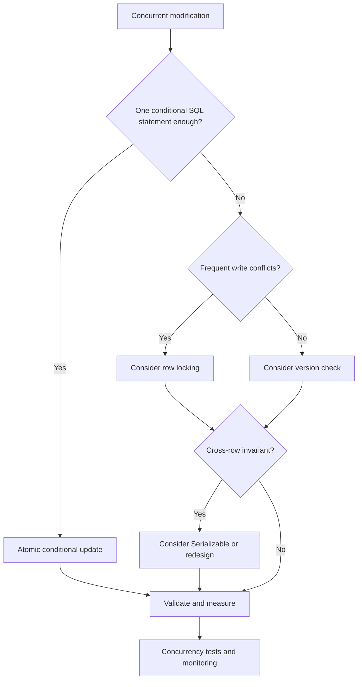

*Only one item remains in stock, but two customers both place successful orders. The SQL statements succeed. Where did the system go wrong?*

## 1. Two successful requests, one broken business rule

Suppose `SKU-001` has one item left. The application handles each order like this:

```python
stock = get_product_stock("SKU-001")

if stock > 0:
    create_order("SKU-001")
    update_product_stock("SKU-001", stock - 1)
```

This works with one request. With two concurrent requests, both can read `1`, both can create an order, and both can write the previously computed value `0`. The final stock is zero, but two items were sold. No individual SQL statement has to fail for the **business invariant** to fail.

```mermaid
sequenceDiagram
    participant A as Request A
    participant DB as PostgreSQL
    participant B as Request B
    A->>DB: Read stock
    DB-->>A: 1
    B->>DB: Read stock
    DB-->>B: 1
    A->>DB: Write stock = 0; create order A
    B->>DB: Write stock = 0; create order B
    Note over A,B: Two orders, final stock = 0
```

This is a **race condition**: the outcome depends on how concurrent operations interleave. The diagram shows the logical sequence; actual writes to the same row may wait for each other's locks. Similar bugs occur with balances, seat reservations, and workers claiming the same job.

## 2. What a transaction does, and what it does not

An order needs both a stock change and an order record. If the stock update succeeds but the order insertion fails, we want neither change to remain. A transaction groups them into one unit:

```sql
BEGIN;

UPDATE inventory
SET available_stock = available_stock - 1
WHERE product_id = 'SKU-001';

INSERT INTO orders (order_id, product_id)
VALUES (1001, 'SKU-001');

COMMIT;
```

On failure, the application can `ROLLBACK`. This illustrates **atomicity**, one of ACID's four properties:

| Property | Practical meaning |
| :--- | :--- |
| Atomicity | The transaction's changes commit together or are rolled back. |
| Consistency | Defined database constraints and invariants must remain valid. |
| Isolation | Concurrent transactions have controlled visibility and interaction. |
| Durability | A successful commit is protected by the database's durability mechanisms. |

Consistency does not mean PostgreSQL knows every business rule. If we never encode the rule that stock cannot go negative or sales cannot exceed stock, the database cannot infer it. And **wrapping a read, decision, and write in `BEGIN/COMMIT` does not automatically prevent both requests from making a decision based on an old value**.

## 3. MVCC: reading while another transaction writes

PostgreSQL uses **multi-version concurrency control** (MVCC). When a row changes, different transactions can see versions appropriate to their snapshots. If A changes stock from `10` to `9` but has not committed, a normal `SELECT` in B at the default `READ COMMITTED` level sees the previously committed `10`, not A's uncommitted `9`. After A commits, B's next statement can see `9`.

Ordinary reads therefore do not need to wait for ordinary writes in the way a simple read/write locking model would require. MVCC does **not** mean "no locks": conflicting writes and explicit locking reads still need coordination. It also does not give every isolation level the same snapshot behavior.

## 4. Isolation levels: what may each transaction observe?

The SQL standard names four levels. In PostgreSQL, `READ UNCOMMITTED` behaves like `READ COMMITTED`, so dirty reads are not allowed. The remaining levels provide different guarantees:

| PostgreSQL level | Snapshot behavior | Important consequence |
| :--- | :--- | :--- |
| Read Committed | New snapshot per statement | Two reads in one transaction can differ. |
| Repeatable Read | Stable snapshot from the first non-transaction-control statement | Prevents non-repeatable and phantom reads in PostgreSQL, but not every serialization anomaly. |
| Serializable | Stable snapshot plus dependency checks | Committed results match some serial ordering; conflicts may require retry. |

### Read Committed

This is PostgreSQL's default. A plain `SELECT` sees data committed before *that statement* starts, plus the transaction's own earlier changes. If A reads stock `10`, B commits an update to `9`, and A reads again, A can now see `9`. This is a **non-repeatable read**.

The stock race remains possible if application code reads `1`, computes `0`, then sends `UPDATE inventory SET available_stock = 0`. After waiting for a conflicting writer, the later update can still write that stale computed value. The problem is not that PostgreSQL failed to execute either command; the commands did not encode the rule the application needed.

### Repeatable Read

Statements within a transaction share a more stable snapshot. If A reads `10` and B later commits `9`, A still sees `10` on a subsequent plain read. PostgreSQL's implementation also prevents phantom reads at this level, although the SQL standard does not require that extra protection.

If A tries to update a row that another transaction changed after A's snapshot was established, PostgreSQL can abort A with a serialization failure. The application must retry the **whole transaction**. Yet two transactions can still read the same overall state and update *different* rows in a way that violates a cross-row rule. This is a **write skew** scenario.

### Serializable

Serializable aims for the committed outcome to be equivalent to executing the transactions one after another in some order. It does not literally run every transaction one at a time. PostgreSQL uses Serializable Snapshot Isolation to detect dangerous dependencies and abort a transaction when necessary.

Imagine a rule that at least one of two employees must remain on duty. Each transaction sees the other employee on duty and marks a *different* employee off duty. Repeatable Read may allow both to commit; the rule is broken. Serializable can reject one of them. It is powerful, but it brings dependency-tracking overhead and retries. Even here, the application must correctly express its business rule and handle aborted attempts.

## 5. Fix the stock race with a conditional update

For one inventory row, the simplest fix is often to put the check and change into **one SQL statement**:

```sql
UPDATE inventory
SET available_stock = available_stock - 1
WHERE product_id = 'SKU-001'
  AND available_stock > 0
RETURNING available_stock;
```

At `READ COMMITTED`, if two transactions contend for the row, the later one waits. Once the first commits, PostgreSQL rechecks the `WHERE` condition against the updated row. With stock now at zero, the second update changes no row and `RETURNING` returns nothing. The application can report "out of stock".

The order insertion still belongs in the **same transaction** as the successful stock decrement:

```sql
BEGIN;

UPDATE inventory
SET available_stock = available_stock - 1
WHERE product_id = 'SKU-001'
  AND available_stock > 0
RETURNING available_stock;

-- Application branch: if no row was returned, ROLLBACK and report out of stock.
-- Only after a row was returned, insert the order:
INSERT INTO orders (order_id, product_id)
VALUES (1001, 'SKU-001');

COMMIT;
```

The comment represents **application control flow**, not executable SQL branching: do not run the `INSERT` blindly when the `UPDATE` returns no row. If insertion fails, roll back the entire transaction. The conditional update controls the race; the transaction keeps the two successful changes atomic.

## 6. Pessimistic locking: reserve the row before deciding

When the decision requires several reads or checks, `SELECT ... FOR UPDATE` can lock the relevant row inside a transaction:

```sql
BEGIN;

SELECT available_stock
FROM inventory
WHERE product_id = 'SKU-001'
FOR UPDATE;

-- Application checks stock while holding the lock.
-- If insufficient, ROLLBACK. Otherwise UPDATE, INSERT, then COMMIT.
```

A second transaction seeking a conflicting lock must wait. At Read Committed, after the first commits, it can see the updated row and recheck stock. This is **pessimistic locking**: coordinate early because conflict is plausible.

It has a cost. Hot rows become queues; long transactions extend wait time; multiple locks can deadlock. Lock only what the rule needs and keep the transaction short. If a conditional update expresses the rule cleanly, it is often simpler.

## 7. Optimistic concurrency: check at write time

With **optimistic concurrency control**, requests can read without first locking, then detect whether the data changed before writing. Add a `version` column:

| product_id | available_stock | version |
| :--- | ---: | ---: |
| SKU-001 | 1 | 5 |

Both requests might read version `5`. Each later attempts:

```sql
UPDATE inventory
SET available_stock = available_stock - 1,
    version = version + 1
WHERE product_id = 'SKU-001'
  AND version = 5
  AND available_stock > 0
RETURNING version;
```

One can move the version to `6`; the other finds no matching row. The application can reread and decide whether to retry or show a conflict. This is useful when write conflicts are rare, such as two people editing the same document. With a hot row, repeated conflicts and retries can be expensive. A version on one row also does not protect an invariant spanning several rows.

## 8. Deadlocks: when transactions wait on each other

Suppose transaction 1 locks account A, then needs B. Transaction 2 locks B, then needs A. Each waits for a lock held by the other. PostgreSQL detects this **deadlock** and aborts one transaction; the application may then retry it after rollback.

Acquire locks in a consistent order, keep transactions short, and avoid unnecessary work while holding locks. `pg_stat_activity` and `pg_locks` can help diagnose waiting sessions. A query that is fast by itself can still be slow in production because it spends time **waiting**, not executing.

## 9. Database transactions stop at the database boundary

A real order may touch an order database, payment provider, inventory service, and email service. A PostgreSQL `ROLLBACK` cannot unsend an email or automatically reverse a payment API call. A timeout after a payment request also does not prove the payment failed.

Two complementary patterns help:

- **Idempotency:** identify retries of the same intention with an `idempotency_key`. A unique constraint such as `UNIQUE (user_id, idempotency_key)` prevents duplicate order records for the same key, but the application must also return the prior result and avoid repeating external side effects.
- **Transactional outbox:** write the order and an outbox event in the same database transaction. A worker later publishes the event. This closes the gap between committed data and an event that was never recorded, but the publisher can retry, so consumers still need idempotency or deduplication.

ACID protects what the database transaction manages. Cross-service work needs additional coordination, recovery, and often reconciliation.

## 10. How should we choose a strategy?



| Approach | Good fit | Tradeoff |
| :--- | :--- | :--- |
| Conditional update | Rule fits one statement | Less suitable for complex decisions |
| Pessimistic locking | Several steps must protect the same data | Waiting and deadlocks |
| Optimistic version check | Conflicts are uncommon | Conflict handling and retries |
| Serializable | Complex transaction-wide invariants | Overhead and serialization retries |
| Unique / check constraints | Rule can be expressed in schema | Cannot express every business rule |

These are not mutually exclusive. An inventory system can use a conditional update, a `CHECK (available_stock >= 0)` constraint, and a unique order key, each guarding a different failure mode.

## 11. Test concurrency, not just individual requests

Sequential unit tests can miss the race entirely. Try two database sessions that read the same stock and then update in different orders. At the API layer, submit concurrent purchase requests for a product with one item left and verify the invariants:

- Successful orders do not exceed starting stock.
- Stock never goes negative, and decrements match successful allocations.
- Retries do not create unintended duplicate orders.
- Failed transactions leave no partial database changes.

Also test timeouts, retries, worker restarts, and deliberate conflicts. On SQLSTATE `40001`, retry the **complete transaction**, including the logic that chooses SQL and values; do not replay only the last statement. A deadlock reports `40P01`, which may also warrant a carefully controlled transaction retry.

Correctness is only half the test. Measure p95/p99 latency, lock waits, conflict and deadlock rates, retry counts, transaction duration, and connection-pool use. Investigate sessions left `idle in transaction`: long-lived transactions can retain locks and interfere with maintenance.

## 12. Mistakes to avoid

- Assuming `BEGIN/COMMIT` alone eliminates races.
- Reading a value, computing a replacement in application code, and writing it without checking whether the data changed.
- Adding `FOR UPDATE` to every read when a conditional update would suffice.
- Switching everything to Serializable without implementing full-transaction retries.
- Waiting for an external API while holding database locks.
- Assuming a database transaction also covers email, payment, or a message broker.
- Testing only requests sent one after another.

More locking is not automatically safer or faster. Protect the invariant with the least coordination that actually works.

## 13. The rule that matters

Transactions are a foundation, but concurrent correctness requires more than successful SQL statements. MVCC determines what a transaction can see; isolation levels determine which anomalies are allowed; conditional updates, locks, version checks, constraints, and Serializable protect different kinds of rules.

**A correct data system keeps its business invariants true no matter how requests interleave.** In production, two requests arriving together are not an edge case. They are something to design for.

## References and further reading

- [PostgreSQL: Transactions](https://www.postgresql.org/docs/current/tutorial-transactions.html)
- [PostgreSQL: MVCC Introduction](https://www.postgresql.org/docs/current/mvcc-intro.html)
- [PostgreSQL: Transaction Isolation](https://www.postgresql.org/docs/current/transaction-iso.html)
- [PostgreSQL: Explicit Locking](https://www.postgresql.org/docs/current/explicit-locking.html)
- [PostgreSQL: SELECT locking clauses](https://www.postgresql.org/docs/current/sql-select.html)
- [PostgreSQL: Serialization Failure Handling](https://www.postgresql.org/docs/current/mvcc-serialization-failure-handling.html)
- [PostgreSQL: Constraints](https://www.postgresql.org/docs/current/ddl-constraints.html)
- [PostgreSQL: INSERT and ON CONFLICT](https://www.postgresql.org/docs/current/sql-insert.html)
- [PostgreSQL: Monitoring Database Activity](https://www.postgresql.org/docs/current/monitoring-stats.html)
- [PostgreSQL: WAL and Reliability](https://www.postgresql.org/docs/current/wal-reliability.html)
- [Debezium: Outbox Event Router](https://debezium.io/documentation/reference/stable/transformations/outbox-event-router.html)
