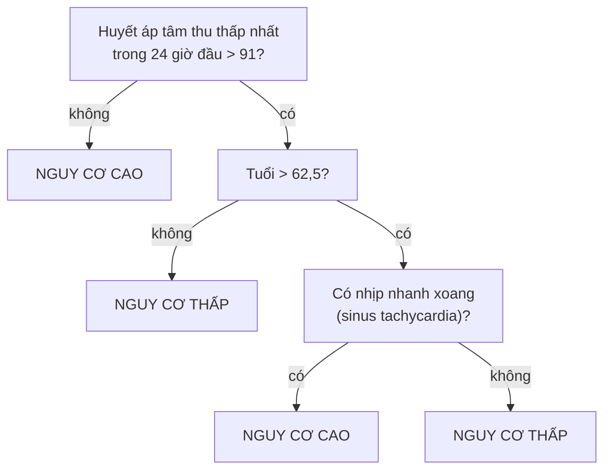
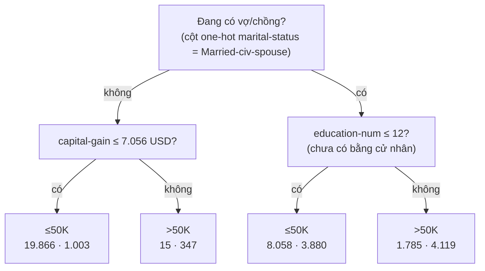

> **Mục tiêu bài học:** Sau bài này, bạn sẽ hiểu cây quyết định chọn câu hỏi bằng độ "sạch" (Gini) ra sao và tính tay được, đọc được một cây thật huấn luyện trên dữ liệu `adult`, thấy bằng số liệu vì sao cây sâu học tủ và cách kìm nó, biết cây hồi quy dự đoán kiểu bậc thang, và cân được ưu-nhược của cây trước khi sang các mô hình gom nhiều cây.

## 1. Khi "vì sao" quan trọng không kém "đúng bao nhiêu"

Foundations · Bài 13 kết thúc bằng một cảnh khó chịu: ngân hàng từ chối khoản vay, bạn hỏi "vì sao?", và nhân viên không trả lời được vì quyết định đến từ một mô hình hàng triệu trọng số. Ở Mỹ, câu trả lời ấy là nghĩa vụ pháp lý: Regulation B (12 CFR 1002.9) buộc bên cho vay nêu **lý do chính, cụ thể** khi từ chối, và lý do ấy phải phản ánh những yếu tố thực sự được dùng để quyết định. Cục Bảo vệ Tài chính Người tiêu dùng (CFPB) từng nhấn mạnh điều này cho riêng các mô hình "hộp đen" trong Thông tư 2022-03 (26/5/2022), với ý: "không hiểu mô hình của chính mình" không phải lời bào chữa. Thông tư đó **đã bị CFPB rút ngày 12/5/2025** trong một đợt thu hồi hàng loạt văn bản hướng dẫn, nhưng nghĩa vụ nền trong Regulation B thì vẫn còn nguyên.

Y tế còn khắt khe hơn. Một ví dụ được dẫn nhiều trong khoa học nhận thức: bệnh nhân nhồi máu cơ tim nhập viện, bác sĩ cần xếp ngay vào nhóm nguy cơ cao hay thấp. Cây phân loại của Breiman và cộng sự - tác giả phương pháp CART - chỉ hỏi tối đa **ba câu có/không**:



Theo Todd và Gigerenzer (*Behavioral and Brain Sciences*, 2000), cây này bỏ qua phần lớn các chỉ số đo được, bỏ qua cả độ lớn (hơn 62,5 tuổi bao nhiêu không quan trọng), thế mà phân loại **chính xác hơn một số phương pháp thống kê phức tạp**. Và bác sĩ nhìn một lần là hiểu vì sao bệnh nhân này bị xếp nguy cơ cao.

Đó là **cây quyết định (decision tree)**: một chuỗi câu hỏi dạng "feature này ≤ ngưỡng kia?", đi từ **gốc (root)** qua các **nút (node)** xuống **lá (leaf)** - nơi ghi dự đoán. Mỗi dự đoán là *một đường đi* từ gốc xuống lá, và đường đi ấy chính là lời giải thích. Sách *An Introduction to Statistical Learning* nhận xét cây còn dễ giải thích hơn cả hồi quy tuyến tính.

## 2. Chọn câu hỏi bằng độ "sạch"

Ai đặt ra các câu hỏi? Máy - từ dữ liệu. Lấy 10 khách vay cũ với hai feature: thu nhập (triệu đồng/tháng) và có từng nợ quá hạn hay không; nhãn: 6 người trả đúng hạn (T), 4 người trễ (N):

| Khách | a | b | c | d | e | f | g | h | i | j |
|---|---|---|---|---|---|---|---|---|---|---|
| Thu nhập | 30 | 22 | 18 | 12 | 9 | 25 | 20 | 14 | 8 | 10 |
| Từng nợ quá hạn | không | không | không | không | không | không | có | có | có | có |
| Kết quả | T | T | T | T | T | N | T | N | N | N |

Một câu hỏi tốt phải tách 10 người thành hai nhóm **"sạch"** hơn - mỗi nhóm nghiêng hẳn về một nhãn. Thước đo sạch thông dụng là **chỉ số Gini (Gini index)**: với tỷ lệ các lớp $p_1, p_2, \ldots$ trong một nhóm,

$$G = 1 - \sum_k p_k^2$$

Nhóm thuần một lớp có $G = 0$; nhóm chia đôi 50/50 có $G = 0{,}5$ - mức "bẩn" nhất với hai lớp. Cả 10 người (6 T, 4 N): $G = 1 - (0{,}6^2 + 0{,}4^2) = 0{,}48$.

So hai câu hỏi ứng viên. **Câu A - "thu nhập > 15?"**: nhóm *có* (a, b, c, f, g) gồm 4 T, 1 N → $G = 1 - (0{,}8^2 + 0{,}2^2) = 0{,}32$; nhóm *không* (d, e, h, i, j) gồm 2 T, 3 N → $G = 0{,}48$. Độ bẩn sau khi tách là trung bình có trọng số theo cỡ nhóm: $0{,}5 \times 0{,}32 + 0{,}5 \times 0{,}48 = 0{,}40$.

**Câu B - "từng nợ quá hạn?"**: nhóm *không* (a-f) gồm 5 T, 1 N → $G = 1 - (25/36 + 1/36) = 10/36 \approx 0{,}28$; nhóm *có* (g-j) gồm 1 T, 3 N → $G = 1 - (1/16 + 9/16) = 0{,}375$. Trung bình: $0{,}6 \times 0{,}28 + 0{,}4 \times 0{,}375 \approx 0{,}32$.

Câu B kéo độ bẩn từ 0,48 xuống 0,32, câu A chỉ xuống 0,40 → cây chọn B làm câu hỏi gốc. Thuật toán làm đúng như bạn vừa làm, nhưng thử *mọi* feature và *mọi* ngưỡng có thể (với thu nhập: 8,5; 9,5; 11; ...), chọn cặp cho độ bẩn thấp nhất, rồi **lặp lại trong từng nhánh**. Sách *An Introduction to Statistical Learning* gọi đây là *recursive binary splitting*, một chiến lược **tham lam (greedy)**: chọn câu hỏi giảm độ bẩn nhiều nhất *ở bước hiện tại*, không nhìn xa hơn.

Thay Gini bằng **entropy** (bạn đã gặp trong cross-entropy ở Foundations · Bài 10) sẽ cho cây gần như tương tự - sách nhận xét hai thước đo cho ra những con số khá giống nhau; scikit-learn cho chọn qua `criterion="gini"` hoặc `"entropy"`.

> 🔧 **Thử ngay:** cho scikit-learn tự chọn trên chính bảng 10 khách:
> ```python
> import pandas as pd
> from sklearn.tree import DecisionTreeClassifier, export_text
> df = pd.DataFrame({"thu_nhap": [30, 22, 18, 12, 9, 25, 20, 14, 8, 10],
>                    "no_qua_han": [0, 0, 0, 0, 0, 0, 1, 1, 1, 1],
>                    "tra_dung_han": [1, 1, 1, 1, 1, 0, 1, 0, 0, 0]})
> tree = DecisionTreeClassifier(max_depth=1, random_state=42).fit(df[["thu_nhap", "no_qua_han"]], df["tra_dung_han"])
> print(export_text(tree, feature_names=["thu_nhap", "no_qua_han"], show_weights=True))
> print(tree.tree_.impurity.round(3))     # Gini của gốc và hai nhánh
> ```
> Đáp số: gốc là `no_qua_han <= 0.50`, hai lá `[1, 5] class: 1` và `[3, 1] class: 0`; Gini in ra `[0.48 0.278 0.375]` - đúng các con số bạn vừa tính tay.

## 3. Đọc một cây thật: ai có thu nhập trên 50K?

Trở lại bộ `adult` (Bài 03): 48.842 người từ điều tra dân số Mỹ năm 1994, nhãn là thu nhập trên hay dưới 50.000 USD/năm; 23,9% thuộc nhóm >50K. Huấn luyện một cây chỉ 2 tầng:

```python
from sklearn.datasets import fetch_openml
from sklearn.model_selection import train_test_split
from sklearn.compose import ColumnTransformer
from sklearn.impute import SimpleImputer
from sklearn.pipeline import make_pipeline
from sklearn.preprocessing import OneHotEncoder

X, y = fetch_openml("adult", version=2, as_frame=True, return_X_y=True)
X_train, X_test, y_train, y_test = train_test_split(X, y, test_size=0.2, random_state=42, stratify=y)
num = X.select_dtypes("number").columns;  cat = X.select_dtypes(exclude="number").columns
pre = ColumnTransformer([("num", SimpleImputer(strategy="median"), num),          # cây KHÔNG cần scale
                         ("cat", make_pipeline(SimpleImputer(strategy="most_frequent"),
                                               OneHotEncoder(handle_unknown="ignore", sparse_output=False)), cat)])
tree = make_pipeline(pre, DecisionTreeClassifier(max_depth=2, random_state=42)).fit(X_train, y_train)
print(export_text(tree[-1], feature_names=list(pre.get_feature_names_out()), show_weights=True, decimals=0))
print(round(tree.score(X_train, y_train), 3), round(tree.score(X_test, y_test), 3))   # 0.829 0.831
```

`export_text` in ra:

```
|--- cat__marital-status_Married-civ-spouse <= 0
|   |--- num__capital-gain <= 7056
|   |   |--- weights: [19866, 1003] class: <=50K
|   |--- num__capital-gain >  7056
|   |   |--- weights: [15, 347] class: >50K
|--- cat__marital-status_Married-civ-spouse >  0
|   |--- num__education-num <= 12
|   |   |--- weights: [8058, 3880] class: <=50K
|   |--- num__education-num >  12
|   |   |--- weights: [1785, 4119] class: >50K
```

Vẽ lại đúng cây đó - mỗi lá ghi nhãn dự đoán và số người ≤50K · >50K trong tập train rơi vào lá:



Cách đọc: cột one-hot `marital-status_Married-civ-spouse` bằng 1 nếu người đó đang có vợ/chồng, nên "≤ 0" là nhánh *không*. `education-num` là số năm học quy đổi: 12 là cao đẳng, 13 là cử nhân. `capital-gain` là lãi từ bán tài sản trong năm. Vậy cây nói: *người không có vợ/chồng gần như đều ≤50K, trừ khi có lãi vốn lớn; người đang có vợ/chồng và có bằng cử nhân trở lên thì phần lớn >50K.* Bốn lá, ba câu hỏi - accuracy 83,1% trên test, so với 76,1% nếu đoán cùn "ai cũng ≤50K".

Hai điều cần cẩn thận khi đọc. Thứ nhất, đây là *tương quan* trong một cuộc điều tra năm 1994, không phải nhân quả - kết hôn không làm lương tăng. Thứ hai, chính vì dễ đọc mà cây để lộ luôn nó đang dựa vào cái gì - ở đây là tình trạng hôn nhân. Đó là một manh mối về thiên lệch mà Bài 12 sẽ bàn kỹ.

## 4. Cây sâu = học tủ

Nếu 2 tầng đã được 83%, sao không để cây mọc tự do? Thử ngay trên `adult` - bỏ `max_depth`:

| `max_depth` | 1 | 2 | 3 | 5 | 8 | 12 | không giới hạn |
|---|---|---|---|---|---|---|---|
| Số lá | 2 | 4 | 8 | 30 | 130 | 568 | **5.661** |
| Accuracy train | 76,1% | 82,9% | 84,3% | 85,1% | 86,2% | 87,8% | **99,99%** |
| Accuracy test | 76,1% | 83,1% | 84,6% | 85,3% | 85,8% | 85,6% | **81,5%** |

Cây không giới hạn sâu **66 tầng** với 5.661 lá, thuộc lòng tập train tới 99,99% - rồi trên test thua cả cây 4 lá. Đó là An của Foundations · Bài 04: luyện đến thuộc từng đề, gặp đề mới thì đứng hình. Sách *An Introduction to Statistical Learning* mô tả cơ chế: cây cứ mọc cho tới khi mỗi lá chỉ còn vài quan sát, và những lá bé xíu ấy học *nhiễu* chứ không học *quy luật*.

Ba cách kìm:

- **`max_depth`** - giới hạn số tầng; bảng trên cho thấy 5-8 tầng là vùng ổn trên dữ liệu này.
- **`min_samples_leaf`** - mỗi lá phải chứa ít nhất bao nhiêu mẫu. Với 100 mẫu/lá, cây còn 247 lá và đạt 85,7% test.
- **Cắt tỉa (pruning)** - mọc cây to rồi cắt bớt nhánh ít giá trị, cân bằng giữa độ khớp và số lá bằng một tham số phạt $\alpha$ (sách gọi là *cost complexity pruning*; trong scikit-learn là `ccp_alpha`). Với `ccp_alpha=0.001`, cây chỉ còn 18 lá mà vẫn đạt 85,4% test.

Con số nào cũng là hyperparameter → chọn bằng cross-validation (Foundations · Bài 13), không phải bằng test set. Trên tập train, cross-validation 5 phần cho 82,9% (2 tầng), 84,3% (3 tầng) và 81,1% (không giới hạn) - cùng kết luận với test.

> ⚠️ **Lưu ý nhỏ:** với bộ dữ liệu nhỏ, test set nhỏ cũng "nhiễu". Trên `breast_cancer` (114 mẫu test), cây 2 tầng được 89,5% còn cây không giới hạn được 91,2% - thoạt nhìn như thể cây sâu tốt hơn, nhưng cây sâu ấy đạt 100% trên train và cross-validation xếp nó dưới các cây 3-4 tầng. Khi các con số chênh nhau chỉ 1-2 mẫu, hãy tin cross-validation hơn một lần chia may rủi.

## 5. Cây hồi quy: dự đoán bằng bậc thang

Cây cũng đoán được con số. `DecisionTreeRegressor` chọn câu hỏi sao cho tổng bình phương sai số trong hai nhánh nhỏ nhất (RSS - chính là MSE ở Foundations · Bài 10 nhưng chưa chia cho số mẫu), và mỗi lá dự đoán bằng **giá trị trung bình** của các mẫu rơi vào lá. Trên California Housing, cây 2 tầng chỉ hỏi về thu nhập trung vị `MedInc`:

```
|--- MedInc <= 5.09
|   |--- MedInc <= 3.07   → dự đoán 1.36
|   |--- MedInc >  3.07   → dự đoán 2.09
|--- MedInc >  5.09
|   |--- MedInc <= 6.89   → dự đoán 2.95
|   |--- MedInc >  6.89   → dự đoán 4.26
```

Cả 20.640 khu dân cư chỉ nhận **bốn** mức giá (đơn vị 100.000 USD). Đồ thị dự đoán vì thế là **bậc thang**, không phải đường trơn - cây không nội suy giữa các mức và không ngoại suy được ra ngoài giá đã thấy. Càng sâu, bậc thang càng mịn: RMSE test giảm từ 0,87 (2 tầng) xuống 0,80 (3 tầng) và 0,65 (8 tầng) - thấp hơn hồi quy tuyến tính của Bài 01 (0,746). Nhưng cây không giới hạn có 15.854 lá, RMSE train **0,0** và RMSE test 0,70: lại học tủ.

> 🔧 **Thử ngay:** huấn luyện `DecisionTreeRegressor(max_depth=3, random_state=42)` trên California Housing (chia 80/20, `random_state=42`) rồi đếm `len(np.unique(tree.predict(X_test)))`.
> Đáp số: **8** - cây 3 tầng có 8 lá, nên mọi khu dân cư trong test chỉ nhận 8 mức giá. RMSE test ≈ 0,80.

## 6. Ưu, nhược - và vì sao bài sau gom nhiều cây

**Ưu điểm.** Diễn giải được - cả người không biết ML cũng đọc được sơ đồ. Không cần scale: cây chỉ hỏi "lớn hơn ngưỡng không?", và câu hỏi ấy không đổi khi co giãn cột (trên `breast_cancer`, cây 3 tầng có và không có `StandardScaler` cho cùng 93,86% test). Ăn được cột chữ sau one-hot và cần rất ít tiền xử lý. Tài liệu scikit-learn lưu ý bản cài của họ chưa xử lý trực tiếp biến phân loại, nên vẫn phải mã hóa như ở mục 3; sách *An Introduction to Statistical Learning* cũng nhắc điều này trong lab chương 8.

**Nhược điểm.** *Bất ổn*: một thay đổi nhỏ trong dữ liệu có thể sinh ra cây khác hẳn. *Ranh giới bậc thang*: các nhát cắt luôn song song với trục, nên một ranh giới chéo đơn giản cần rất nhiều nhát cắt mới xấp xỉ được (Hình 8.7 của sách). *Độ chính xác*: sách nhận xét một cây đơn lẻ thường không sánh được với các phương pháp khác - trên `adult`, cây 8 tầng đạt 85,8% còn hồi quy logistic (Bài 03) là 85,2%: hòa, chưa thắng.

> 🔧 **Thử ngay:** kiểm chứng tính bất ổn. Trên `breast_cancer`, đổi `random_state` của `train_test_split` lần lượt thành 0, 1, 4 (vẫn 80/20, `stratify=y`), huấn luyện `DecisionTreeClassifier(max_depth=2, random_state=42)` và in câu hỏi gốc.
> Đáp số: seed 0 hỏi `worst concave points <= 0.142`, seed 1 hỏi `worst radius <= 16.795`, seed 4 hỏi `worst perimeter <= 111.5`. Cùng bài toán, ba mẫu train chỉ khác nhau 20% dữ liệu, ba "lý do" khác nhau.

Điểm bất ổn này hóa ra lại là gợi ý: nếu mỗi cây nhìn dữ liệu theo một cách khác, sao không trồng hàng trăm cây rồi cho chúng bỏ phiếu? Đó là random forest và boosting - Bài 07.

## Tóm tắt bài học

- Cây quyết định = chuỗi câu hỏi "feature ≤ ngưỡng?" từ gốc xuống lá; đường đi tới lá chính là lời giải thích - thứ ngân hàng (Regulation B) và bác sĩ cần.
- Máy chọn câu hỏi bằng độ "sạch": Gini $G = 1 - \sum p_k^2$; chọn câu hỏi giảm Gini có trọng số nhiều nhất, rồi lặp trong từng nhánh (tham lam). Với 10 khách: "nợ quá hạn" (0,48 → 0,32) thắng "thu nhập" (0,48 → 0,40).
- Cây 2 tầng trên `adult` đạt 83,1% với ba câu hỏi (hôn nhân, lãi vốn, học vấn); dễ đọc cũng là dễ thấy mô hình đang dựa vào gì.
- Cây không giới hạn: 5.661 lá, 99,99% train, 81,5% test - học tủ. Kìm bằng `max_depth`, `min_samples_leaf`, `ccp_alpha`; chọn bằng cross-validation.
- Cây hồi quy dự đoán bằng trung bình của lá → bậc thang; 3 tầng = 8 mức giá, không ngoại suy được.
- Ưu: diễn giải, không cần scale, ít tiền xử lý. Nhược: bất ổn, ranh giới song song trục, độ chính xác thường thua → gom nhiều cây (Bài 07).

## Câu hỏi tự kiểm tra

1. Vì sao ngân hàng có thể "đọc" lý do từ chối từ cây quyết định nhưng khó đọc từ k-NN (Bài 05) hay mạng nơ-ron?
2. **Tính tay:** một nút có 8 mẫu: 6 lớp A, 2 lớp B. Tính Gini. Một câu hỏi tách thành nhóm (4 A, 0 B) và (2 A, 2 B): Gini có trọng số sau khi tách là bao nhiêu? (Đáp số để tự kiểm: 0,375 → 0,25.)
3. Nhìn cây ở mục 3: một người 30 tuổi, độc thân, có bằng thạc sĩ, không có lãi vốn sẽ được dự đoán thế nào? Đường đi qua những nút nào? Dự đoán đó có thể sai ở đâu?
4. Cây không giới hạn trên `adult` đạt 99,99% train. Giải thích vì sao con số này gần như vô nghĩa, và nêu hai hyperparameter để kìm cây kèm ý nghĩa của chúng.
5. Vì sao cây hồi quy không thể dự đoán giá nhà cao hơn mọi giá đã thấy trong tập train? Hồi quy tuyến tính có hạn chế đó không?
6. Bạn cần mô hình vừa giải thích được cho khách hàng, vừa không cần scale, trên bảng có nhiều cột chữ. Cây hay k-NN? Nêu hai lý do, và một điểm yếu của lựa chọn đó.

## Đọc thêm

**Nguồn nền tảng của bài:**

| Nguồn | Đọc phần nào |
|---|---|
| **An Introduction to Statistical Learning (ISLP)** | Chương 8, mục 8.1 - cây hồi quy (dữ liệu Hitters), cost complexity pruning, cây phân loại (Gini, entropy, dữ liệu Heart), cây so với mô hình tuyến tính, ưu-nhược (8.1.4); mục 8.3.1-8.3.2 - lab với `DecisionTreeClassifier`, `export_text`, `ccp_alpha` |
| **scikit-learn User Guide** | Mục 1.10 *Decision Trees* - ưu/nhược điểm, mẹo thực hành (`max_depth`, `min_samples_leaf`), Gini/entropy, minimal cost-complexity pruning |

**Nguồn online bổ sung (miễn phí):**

- [export_text - scikit-learn](https://scikit-learn.org/stable/modules/generated/sklearn.tree.export_text.html) - in cây dưới dạng chữ, không cần cài thêm gì.
- [Decision trees - Google Machine Learning, Decision Forests course](https://developers.google.com/machine-learning/decision-forests/decision-trees) - bài giảng ngắn, có hình, đi từ một cây tới random forest.
- [CFPB Circular 2022-03 - Adverse action notification requirements in connection with credit decisions based on complex algorithms](https://www.consumerfinance.gov/compliance/circulars/circular-2022-03-adverse-action-notification-requirements-in-connection-with-credit-decisions-based-on-complex-algorithms/) - vì sao "lý do" là nghĩa vụ pháp lý trong tín dụng.
- [Todd & Gigerenzer, Précis of *Simple heuristics that make us smart* (Behavioral and Brain Sciences, 2000)](https://pure.mpg.de/rest/items/item_2102521/component/file_2102520/content) - Hình 1: cây ba câu hỏi phân loại bệnh nhân nhồi máu cơ tim.

> **Bài tiếp theo:** [Random Forest & Gradient Boosting: sức mạnh của đám đông](../random-forest-gradient-boosting-vi/) - một cây thì bất ổn và hay học tủ - nhưng hàng trăm cây cùng bỏ phiếu lại thường thắng trên dữ liệu bảng, và bài sau giải thích vì sao.
