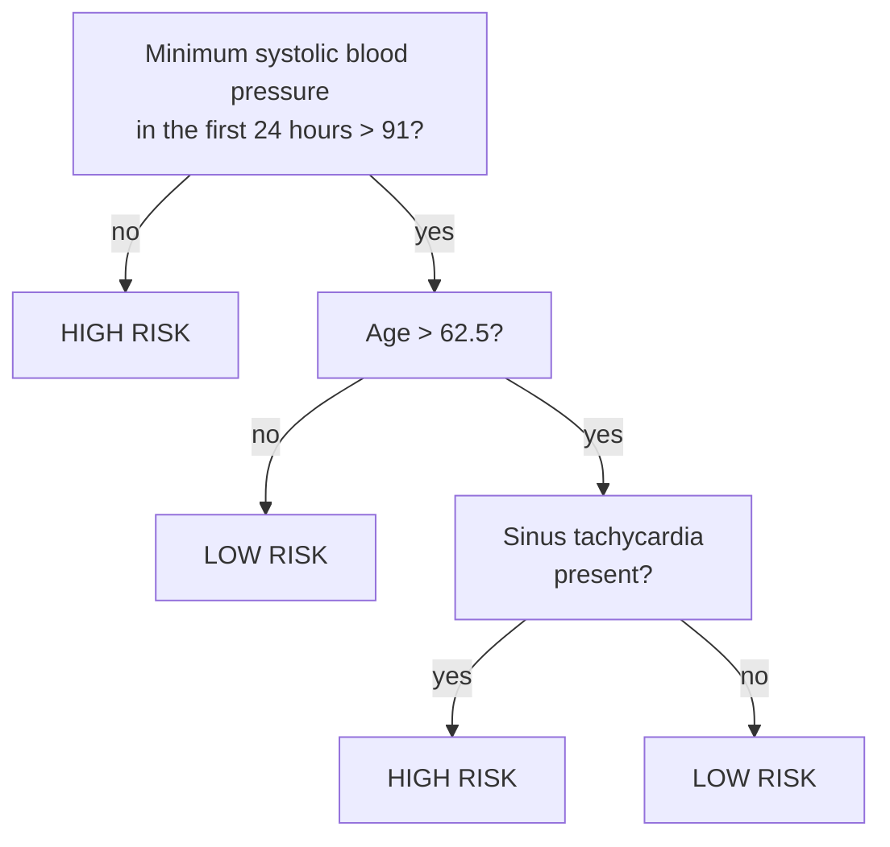
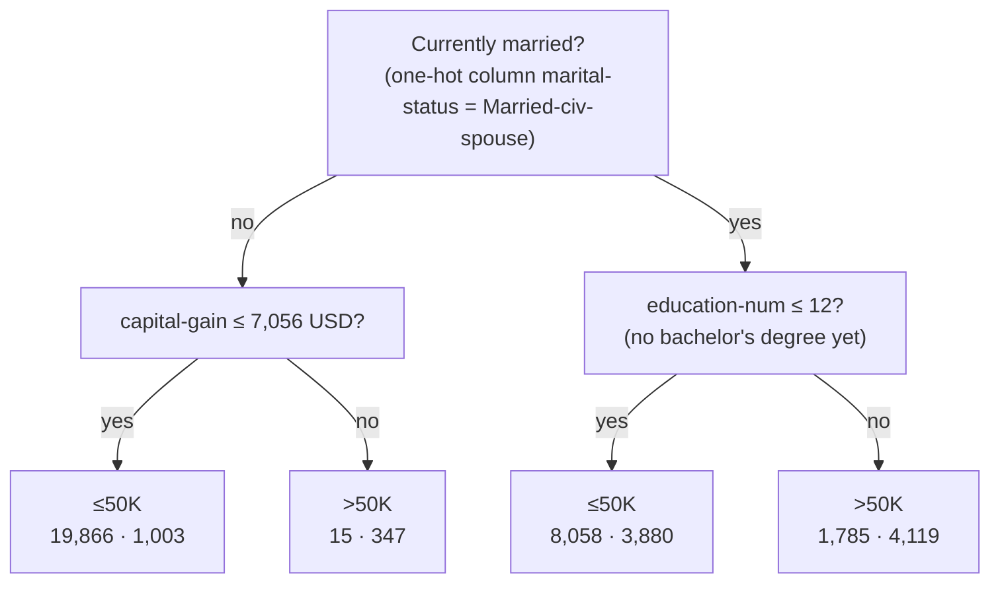

> **Learning objectives:** After this lesson, you will understand how a decision tree picks its questions using "purity" (Gini) and be able to compute it by hand, read a real tree trained on the `adult` data, see in numbers why a deep tree overfits and how to rein it in, know that regression trees predict in steps, and weigh the pros and cons of trees before moving on to models that combine many trees.

## 1. When "why" matters as much as "how accurate"

Foundations · Lesson 13 ended with an uncomfortable scene: the bank rejects a loan, you ask "why?", and the clerk cannot answer because the decision came from a model with millions of weights. In the United States, that answer is a legal obligation: Regulation B (12 CFR 1002.9) requires the lender to give the **principal, specific reasons** for a denial, and those reasons must reflect the factors actually used in the decision. The Consumer Financial Protection Bureau (CFPB) once stressed this specifically for "black box" models in Circular 2022-03 (26 May 2022), in essence: "we don't understand our own model" is not an excuse. That circular **was withdrawn by the CFPB on 12 May 2025** in a mass rescission of guidance documents, but the underlying obligation in Regulation B remains fully in place.

Medicine is even stricter. An example widely cited in cognitive science: a heart-attack patient is admitted, and the doctor must immediately place them in the high-risk or low-risk group. The classification tree of Breiman and colleagues - the authors of the CART method - asks at most **three yes/no questions**:



According to Todd and Gigerenzer (*Behavioral and Brain Sciences*, 2000), this tree ignores most of the measurable indicators, and even ignores magnitude (how far past 62.5 the patient is does not matter), yet it classifies **more accurately than some complex statistical methods**. And a doctor understands at a glance why this patient was placed in the high-risk group.

That is a **decision tree**: a sequence of questions of the form "is this feature ≤ that threshold?", running from the **root** through **nodes** down to a **leaf** - where the prediction is written. Each prediction is *one path* from the root to a leaf, and that path is the explanation itself. *An Introduction to Statistical Learning* remarks that trees are even easier to explain than linear regression.

## 2. Choosing a question by "purity"

Who comes up with the questions? The machine - from the data. Take 10 past borrowers with two features: income (million VND/month) and whether they have ever been overdue on a debt; labels: 6 people paid on time (T), 4 paid late (N):

| Customer | a | b | c | d | e | f | g | h | i | j |
|---|---|---|---|---|---|---|---|---|---|---|
| Income | 30 | 22 | 18 | 12 | 9 | 25 | 20 | 14 | 8 | 10 |
| Ever overdue | no | no | no | no | no | no | yes | yes | yes | yes |
| Outcome | T | T | T | T | T | N | T | N | N | N |

A good question must split the 10 people into two **"purer"** groups - each group leaning clearly towards one label. The common measure of purity is the **Gini index**: with class proportions $p_1, p_2, \ldots$ in a group,

$$G = 1 - \sum_k p_k^2$$

A group of a single class has $G = 0$; a 50/50 split has $G = 0.5$ - the "impurest" possible with two classes. All 10 people (6 T, 4 N): $G = 1 - (0.6^2 + 0.4^2) = 0.48$.

Compare two candidate questions. **Question A - "income > 15?"**: the *yes* group (a, b, c, f, g) has 4 T, 1 N → $G = 1 - (0.8^2 + 0.2^2) = 0.32$; the *no* group (d, e, h, i, j) has 2 T, 3 N → $G = 0.48$. The impurity after the split is the average weighted by group size: $0.5 \times 0.32 + 0.5 \times 0.48 = 0.40$.

**Question B - "ever overdue?"**: the *no* group (a-f) has 5 T, 1 N → $G = 1 - (25/36 + 1/36) = 10/36 \approx 0.28$; the *yes* group (g-j) has 1 T, 3 N → $G = 1 - (1/16 + 9/16) = 0.375$. Weighted average: $0.6 \times 0.28 + 0.4 \times 0.375 \approx 0.32$.

Question B brings the impurity down from 0.48 to 0.32, question A only down to 0.40 → the tree picks B as the root question. The algorithm does exactly what you just did, but tries *every* feature and *every* possible threshold (for income: 8.5; 9.5; 11; ...), picks the pair with the lowest impurity, then **repeats inside each branch**. *An Introduction to Statistical Learning* calls this *recursive binary splitting*, a **greedy** strategy: pick the question that reduces impurity the most *at the current step*, without looking further ahead.

Replacing Gini with **entropy** (which you met in cross-entropy in Foundations · Lesson 10) gives an almost identical tree - the book notes that the two measures produce quite similar numbers; scikit-learn lets you choose via `criterion="gini"` or `"entropy"`.

> 🔧 **Try it now:** let scikit-learn choose on the very same table of 10 customers:
> ```python
> import pandas as pd
> from sklearn.tree import DecisionTreeClassifier, export_text
> df = pd.DataFrame({"thu_nhap": [30, 22, 18, 12, 9, 25, 20, 14, 8, 10],
>                    "no_qua_han": [0, 0, 0, 0, 0, 0, 1, 1, 1, 1],
>                    "tra_dung_han": [1, 1, 1, 1, 1, 0, 1, 0, 0, 0]})
> tree = DecisionTreeClassifier(max_depth=1, random_state=42).fit(df[["thu_nhap", "no_qua_han"]], df["tra_dung_han"])
> print(export_text(tree, feature_names=["thu_nhap", "no_qua_han"], show_weights=True))
> print(tree.tree_.impurity.round(3))     # Gini of the root and the two branches
> ```
> Answer: the root is `no_qua_han <= 0.50`, the two leaves are `[1, 5] class: 1` and `[3, 1] class: 0`; the printed Gini values are `[0.48 0.278 0.375]` - exactly the numbers you just computed by hand.

## 3. Reading a real tree: who earns more than 50K?

Back to the `adult` dataset (Lesson 03): 48,842 people from the 1994 US census, the label being whether income is above or below 50,000 USD/year; 23.9% belong to the >50K group. Train a tree of only 2 levels:

```python
from sklearn.datasets import fetch_openml
from sklearn.model_selection import train_test_split
from sklearn.compose import ColumnTransformer
from sklearn.impute import SimpleImputer
from sklearn.pipeline import make_pipeline
from sklearn.preprocessing import OneHotEncoder

X, y = fetch_openml("adult", version=2, as_frame=True, return_X_y=True)
X_train, X_test, y_train, y_test = train_test_split(X, y, test_size=0.2, random_state=42, stratify=y)
num = X.select_dtypes("number").columns;  cat = X.select_dtypes(exclude="number").columns
pre = ColumnTransformer([("num", SimpleImputer(strategy="median"), num),          # trees do NOT need scaling
                         ("cat", make_pipeline(SimpleImputer(strategy="most_frequent"),
                                               OneHotEncoder(handle_unknown="ignore", sparse_output=False)), cat)])
tree = make_pipeline(pre, DecisionTreeClassifier(max_depth=2, random_state=42)).fit(X_train, y_train)
print(export_text(tree[-1], feature_names=list(pre.get_feature_names_out()), show_weights=True, decimals=0))
print(round(tree.score(X_train, y_train), 3), round(tree.score(X_test, y_test), 3))   # 0.829 0.831
```

`export_text` prints:

```
|--- cat__marital-status_Married-civ-spouse <= 0
|   |--- num__capital-gain <= 7056
|   |   |--- weights: [19866, 1003] class: <=50K
|   |--- num__capital-gain >  7056
|   |   |--- weights: [15, 347] class: >50K
|--- cat__marital-status_Married-civ-spouse >  0
|   |--- num__education-num <= 12
|   |   |--- weights: [8058, 3880] class: <=50K
|   |--- num__education-num >  12
|   |   |--- weights: [1785, 4119] class: >50K
```

Redrawing that exact tree - each leaf shows the predicted label and the number of people ≤50K · >50K in the training set that land in the leaf:



How to read it: the one-hot column `marital-status_Married-civ-spouse` equals 1 if the person is currently married, so "≤ 0" is the *no* branch. `education-num` is the number of years of schooling, converted: 12 is an associate degree, 13 is a bachelor's. `capital-gain` is profit from selling assets during the year. So the tree says: *unmarried people are almost all ≤50K, unless they have a large capital gain; married people with a bachelor's degree or higher are mostly >50K.* Four leaves, three questions - 83.1% accuracy on test, compared with 76.1% if you crudely guess "everyone is ≤50K".

Two things to be careful about when reading. First, this is a *correlation* in a 1994 survey, not causation - getting married does not raise your salary. Second, precisely because it is easy to read, the tree also exposes what it is relying on - here, marital status. That is a clue about bias, which Lesson 12 will discuss in depth.

## 4. Deep tree = overfitting

If 2 levels already reach 83%, why not let the tree grow freely? Try it right away on `adult` - drop `max_depth`:

| `max_depth` | 1 | 2 | 3 | 5 | 8 | 12 | unlimited |
|---|---|---|---|---|---|---|---|
| Number of leaves | 2 | 4 | 8 | 30 | 130 | 568 | **5,661** |
| Train accuracy | 76.1% | 82.9% | 84.3% | 85.1% | 86.2% | 87.8% | **99.99%** |
| Test accuracy | 76.1% | 83.1% | 84.6% | 85.3% | 85.8% | 85.6% | **81.5%** |

The unlimited tree is **66 levels** deep with 5,661 leaves, memorizes the training set to 99.99% - and then loses on test even to the 4-leaf tree. That is An from Foundations · Lesson 04: drilling until every past exam is memorized, then freezing when a new one appears. *An Introduction to Statistical Learning* describes the mechanism: the tree keeps growing until each leaf holds only a few observations, and those tiny leaves learn *noise* rather than *patterns*.

Three ways to rein it in:

- **`max_depth`** - limit the number of levels; the table above shows 5-8 levels is the stable zone on this data.
- **`min_samples_leaf`** - the minimum number of samples each leaf must contain. With 100 samples/leaf, the tree has 247 leaves and reaches 85.7% on test.
- **Pruning** - grow a large tree, then cut back the branches of little value, balancing fit against the number of leaves with a penalty parameter $\alpha$ (the book calls this *cost complexity pruning*; in scikit-learn it is `ccp_alpha`). With `ccp_alpha=0.001`, the tree has only 18 leaves yet still reaches 85.4% on test.

Every one of these numbers is a hyperparameter → choose it with cross-validation (Foundations · Lesson 13), not with the test set. On the training set, 5-fold cross-validation gives 82.9% (2 levels), 84.3% (3 levels) and 81.1% (unlimited) - the same conclusion as the test set.

> ⚠️ **A small note:** with a small dataset, a small test set is "noisy" too. On `breast_cancer` (114 test samples), the 2-level tree gets 89.5% while the unlimited tree gets 91.2% - at first glance the deep tree looks better, but that deep tree reaches 100% on train and cross-validation ranks it below the 3-4-level trees. When the numbers differ by only 1-2 samples, trust cross-validation over a single lucky split.

## 5. Regression trees: predicting in steps

Trees can predict numbers too. `DecisionTreeRegressor` chooses the question so that the total squared error in the two branches is smallest (RSS - the same as MSE in Foundations · Lesson 10 but not yet divided by the number of samples), and each leaf predicts the **mean** of the samples that land in it. On California Housing, a 2-level tree asks only about the median income `MedInc`:

```
|--- MedInc <= 5.09
|   |--- MedInc <= 3.07   → predicts 1.36
|   |--- MedInc >  3.07   → predicts 2.09
|--- MedInc >  5.09
|   |--- MedInc <= 6.89   → predicts 2.95
|   |--- MedInc >  6.89   → predicts 4.26
```

All 20,640 districts receive only **four** price levels (in units of 100,000 USD). The prediction plot is therefore a **staircase**, not a smooth line - the tree does not interpolate between levels and cannot extrapolate beyond the prices it has seen. The deeper the tree, the finer the staircase: test RMSE drops from 0.87 (2 levels) to 0.80 (3 levels) and 0.65 (8 levels) - lower than the linear regression of Lesson 01 (0.746). But the unlimited tree has 15,854 leaves, a train RMSE of **0.0** and a test RMSE of 0.70: overfitting again.

> 🔧 **Try it now:** train `DecisionTreeRegressor(max_depth=3, random_state=42)` on California Housing (80/20 split, `random_state=42`), then count `len(np.unique(tree.predict(X_test)))`.
> Answer: **8** - a 3-level tree has 8 leaves, so every district in the test set receives one of only 8 price levels. Test RMSE ≈ 0.80.

## 6. Pros, cons - and why the next lesson combines many trees

**Pros.** Interpretable - even people who know no ML can read the diagram. No scaling needed: a tree only asks "greater than the threshold?", and that question does not change when a column is rescaled (on `breast_cancer`, a 3-level tree with and without `StandardScaler` gives the same 93.86% on test). Handles text columns after one-hot encoding and needs very little preprocessing. The scikit-learn documentation notes that their implementation does not yet handle categorical variables directly, so you still have to encode them as in section 3; *An Introduction to Statistical Learning* also mentions this in the chapter 8 lab.

**Cons.** *Instability*: a small change in the data can produce a completely different tree. *Staircase boundaries*: the cuts are always parallel to the axes, so a simple diagonal boundary needs a great many cuts to approximate (Figure 8.7 of the book). *Accuracy*: the book notes that a single tree usually does not match other methods - on `adult`, the 8-level tree reaches 85.8% while logistic regression (Lesson 03) gets 85.2%: a draw, not a win.

> 🔧 **Try it now:** verify the instability. On `breast_cancer`, change the `random_state` of `train_test_split` to 0, 1, 4 in turn (still 80/20, `stratify=y`), train `DecisionTreeClassifier(max_depth=2, random_state=42)` and print the root question.
> Answer: seed 0 asks `worst concave points <= 0.142`, seed 1 asks `worst radius <= 16.795`, seed 4 asks `worst perimeter <= 111.5`. Same problem, three training samples differing in only 20% of the data, three different "reasons".

This instability turns out to be a hint: if each tree looks at the data in a different way, why not grow hundreds of trees and let them vote? That is random forests and boosting - Lesson 07.

## Lesson summary

- Decision tree = a sequence of "feature ≤ threshold?" questions from root to leaf; the path to the leaf is the explanation itself - what banks (Regulation B) and doctors need.
- The machine picks questions by "purity": Gini $G = 1 - \sum p_k^2$; pick the question that reduces weighted Gini the most, then repeat in each branch (greedy). With the 10 customers: "overdue" (0.48 → 0.32) beats "income" (0.48 → 0.40).
- A 2-level tree on `adult` reaches 83.1% with three questions (marital status, capital gain, education); being easy to read also means it is easy to see what the model relies on.
- The unlimited tree: 5,661 leaves, 99.99% train, 81.5% test - overfitting. Rein it in with `max_depth`, `min_samples_leaf`, `ccp_alpha`; choose them with cross-validation.
- A regression tree predicts with the leaf mean → a staircase; 3 levels = 8 price levels, no extrapolation.
- Pros: interpretable, no scaling, little preprocessing. Cons: unstable, axis-parallel boundaries, accuracy usually behind → combine many trees (Lesson 07).

## Self-check questions

1. Why can a bank "read" the reason for a denial from a decision tree but not easily from k-NN (Lesson 05) or a neural network?
2. **By hand:** a node has 8 samples: 6 of class A, 2 of class B. Compute the Gini. A question splits it into groups (4 A, 0 B) and (2 A, 2 B): what is the weighted Gini after the split? (Answer for self-checking: 0.375 → 0.25.)
3. Look at the tree in section 3: how would a 30-year-old, single, with a master's degree and no capital gain be predicted? Which nodes does the path pass through? Where could that prediction go wrong?
4. The unlimited tree on `adult` reaches 99.99% on train. Explain why this number is almost meaningless, and name two hyperparameters for reining in the tree along with what they mean.
5. Why can a regression tree not predict a house price higher than every price seen in the training set? Does linear regression have that limitation?
6. You need a model that is both explainable to customers and needs no scaling, on a table with many text columns. Tree or k-NN? Give two reasons, and one weakness of that choice.

## Further reading

**Foundational sources for this lesson:**

| Source | Which part to read |
|---|---|
| **An Introduction to Statistical Learning (ISLP)** | Chapter 8, section 8.1 - regression trees (Hitters data), cost complexity pruning, classification trees (Gini, entropy, Heart data), trees versus linear models, pros and cons (8.1.4); sections 8.3.1-8.3.2 - lab with `DecisionTreeClassifier`, `export_text`, `ccp_alpha` |
| **scikit-learn User Guide** | Section 1.10 *Decision Trees* - advantages/disadvantages, practical tips (`max_depth`, `min_samples_leaf`), Gini/entropy, minimal cost-complexity pruning |

**Additional online sources (free):**

- [export_text - scikit-learn](https://scikit-learn.org/stable/modules/generated/sklearn.tree.export_text.html) - prints the tree as text, no extra installation needed.
- [Decision trees - Google Machine Learning, Decision Forests course](https://developers.google.com/machine-learning/decision-forests/decision-trees) - a short illustrated lecture, going from a single tree to random forests.
- [CFPB Circular 2022-03 - Adverse action notification requirements in connection with credit decisions based on complex algorithms](https://www.consumerfinance.gov/compliance/circulars/circular-2022-03-adverse-action-notification-requirements-in-connection-with-credit-decisions-based-on-complex-algorithms/) - why the "reason" is a legal obligation in lending.
- [Todd & Gigerenzer, Précis of *Simple heuristics that make us smart* (Behavioral and Brain Sciences, 2000)](https://pure.mpg.de/rest/items/item_2102521/component/file_2102520/content) - Figure 1: the three-question tree classifying heart-attack patients.

> **Next lesson:** [Random Forest & Gradient Boosting: The Power of the Crowd](../random-forest-gradient-boosting/) - a single tree is unstable and prone to overfitting - but hundreds of trees voting together usually win on tabular data, and the next lesson explains why.
