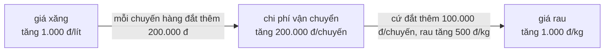
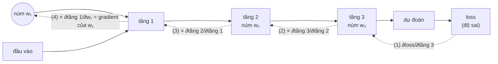

> **Mục tiêu bài học:** Sau bài này, bạn sẽ hiểu đạo hàm là gì qua ví dụ đời thường và ví dụ số, biết gradient chỉ hướng nào và vì sao "đi ngược gradient" giúp mô hình bớt sai, đồng thời nắm được vì sao chain rule là trái tim của việc huấn luyện mạng nơ-ron.

## 1. Hàng tỷ núm vặn - xoay núm nào, về bên nào?

Ở Bài 01, mô hình ML là **cỗ máy nhiều núm vặn**: mỗi núm là một tham số, và "học" là tìm vị trí núm sao cho mô hình đoán ít sai nhất. Vòng lặp huấn luyện có một bước nghe rất nhẹ nhàng: *"chỉnh núm để đoán đỡ sai hơn"*.

Nhưng chỉnh **thế nào**? Cách mò mẫm: vặn thử một núm sang phải, chạy lại mô hình, đo độ sai; vặn sang trái, chạy lại, đo lại. Một mạng nơ-ron có **hàng triệu đến hàng tỷ núm** - mỗi vòng chỉnh sẽ tốn hàng tỷ lần chạy mô hình, chỉ để biết nên xoay mỗi núm về bên nào.

Toán học cho ta một "giác quan" tốt hơn hẳn: với mỗi núm, **không cần vặn thử** vẫn biết trước *nếu vặn nhẹ sang phải thì độ sai tăng hay giảm, và nhạy đến mức nào*. Giác quan đó là **đạo hàm (derivative)**. Và điều đáng ngạc nhiên hơn, xin để dành đến mục 7: nhờ chain rule, hàng tỷ câu hỏi "núm này nên xoay bên nào" được trả lời **trong cùng một lượt**, với chi phí chỉ gấp vài lần so với một lần chạy mô hình.

Đây là mảnh ghép toán cuối cùng bạn cần trước khi bước vào hàm mất mát (Bài 10) và gradient descent (Bài 11).

## 2. Đạo hàm: tốc độ thay đổi tức thời

### 2.1. Đồng hồ tốc độ trên xe

Bạn chạy xe từ nhà đến quán cà phê. Quãng đường đã đi là một hàm theo thời gian. Con số trên đồng hồ tốc độ - 40 km/h - không nói bạn *đã đi* bao xa; nó nói *ngay khoảnh khắc này* quãng đường đang tăng nhanh cỡ nào: "cứ đà này, mỗi giờ thêm 40 km".

**Tốc độ chính là đạo hàm của quãng đường theo thời gian.** Tổng quát: đạo hàm của hàm $f$ tại một điểm cho biết **khi đầu vào nhích lên một chút xíu, đầu ra thay đổi nhanh chậm ra sao**. Trên đồ thị, đó là **độ dốc (slope)** của đường cong tại điểm ấy.

### 2.2. Tự tay "đo" đạo hàm của f(x) = x²

Chưa cần công thức nào, bạn vẫn đo được đạo hàm bằng số. Lấy $f(x) = x^2$ tại $x = 1$, ở đó $f(1) = 1$. Nhích $x$ thêm một lượng nhỏ $h$ rồi xem $f$ thay đổi bao nhiêu **so với** mức nhích:

| Mức nhích $h$ | $f(1+h)$ | Thay đổi $f(1+h) - f(1)$ | Tỷ số thay đổi / nhích |
|---|---|---|---|
| 0,1 | 1,21 | 0,21 | **2,1** |
| 0,01 | 1,0201 | 0,0201 | **2,01** |
| 0,001 | 1,002001 | 0,002001 | **2,001** |

Mức nhích càng nhỏ, tỷ số càng sát về **2**. Ta nói đạo hàm của $f(x) = x^2$ tại $x = 1$ bằng 2, ký hiệu $f'(1) = 2$. Ý nghĩa thực dụng: quanh $x = 1$, *đầu vào nhích 1 phần thì đầu ra nhích khoảng 2 phần*.

Tỷ số ở cột cuối có tên riêng: **thương số sai phân (difference quotient)** - độ dốc của đoạn thẳng nối hai điểm trên đồ thị; sách *Mathematics for Machine Learning* xây dựng khái niệm đạo hàm từ đúng đại lượng này. Cho $h$ nhỏ dần, hai điểm sáp lại nhau, đoạn thẳng trở thành tiếp tuyến và độ dốc của nó là đạo hàm. Sách *Dive into Deep Learning* cũng mở đầu chương giải tích bằng đúng kiểu thí nghiệm số này - với hàm $3x^2 - 4x$, cũng tại $x = 1$, và tỷ số cũng tiến về 2.

```
 f(x) = x²                       .
   ▲                          .
   |                        .
   |                      .   ← tại x = 1: dốc lên,
   |                   _.        độ dốc = 2
   |               _ .
   |          _  .
   |     ~  .
   +---·-------------► x
       0    1
```

> 🔧 **Thử ngay:** Tính tay tỷ số tại $x = 2$ với $h = 0{,}01$: $f(2{,}01) = 4{,}0401$ và $f(2) = 4$, nên $(4{,}0401 - 4)/0{,}01 = $ **4,01**. Rất gần 4 - đúng bằng $2 \times 2$. Quy luật: đạo hàm của $x^2$ tại điểm $x$ bất kỳ là $2x$.

Các hàm quen thuộc có công thức tính nhanh như vậy (đạo hàm của $x^2$ là $2x$, của $x^3$ là $3x^2$). Trong loạt bài này bạn **không cần thuộc bảng công thức** - mục 8 sẽ giải thích vì sao; chỉ cần nhớ $2x$ cho các ví dụ phía dưới.

> ⚠️ **Lưu ý nhỏ:** Thí nghiệm "cho $h$ nhỏ dần" là một ước lượng thuyết phục chứ chưa phải chứng minh chặt chẽ. Định nghĩa chính thức của đạo hàm dùng khái niệm **giới hạn (limit)**: giá trị mà tỷ số tiến về khi $h$ tiến về 0. Trực giác "nhích một chút, xem đổi bao nhiêu" là tất cả những gì bạn cần cho các bài sau.

## 3. Dấu của đạo hàm cho biết đường nào đi xuống

Sương mù dày đặc, bạn đứng trên sườn núi - hình ảnh người xuống núi ở Bài 01. Bạn không thấy chân núi, cũng không cần biết dốc chính xác bao nhiêu độ; bạn chỉ cần biết **phía nào là xuống**. Với mục tiêu "giảm độ sai" cũng vậy: thứ quý giá nhất ở đạo hàm không phải con số chính xác, mà là **cái dấu** của nó.

| Đạo hàm tại điểm đang đứng | Hàm đang... | Muốn **giảm** giá trị hàm thì... |
|---|---|---|
| Dương (> 0) | đi lên khi $x$ tăng | **giảm** $x$ (lùi lại) |
| Âm (< 0) | đi xuống khi $x$ tăng | **tăng** $x$ (tiến tới) |
| Bằng 0 | phẳng tại chỗ | đứng yên - có thể đang ở đáy |

Kiểm chứng với $f(x) = x^2$ (đồ thị hình chữ U, đáy tại $x = 0$), dùng công thức $f'(x) = 2x$:

- Tại $x = 1$: $f'(1) = 2 > 0$ → muốn xuống đáy phải giảm $x$. Đúng: đáy nằm bên trái.
- Tại $x = -1$: $f'(-1) = -2 < 0$ → muốn xuống đáy phải tăng $x$. Đúng: đáy nằm bên phải.
- Tại $x = 0$: $f'(0) = 0$ → đang ở đáy.

Quy tắc rút gọn đáng giá cả bài: **đi ngược dấu đạo hàm, với một bước đủ nhỏ, thì hàm giảm**. "Cảm nhận độ dốc dưới chân" của người xuống núi chính là tính đạo hàm; "bước về phía dốc xuống" là đi ngược dấu của nó.

> ⚠️ **Lưu ý nhỏ:** Đạo hàm bằng 0 chỉ nói "chỗ này phẳng", chưa chắc đã là đáy. Với $f(x) = -x^2$ (chữ U úp ngược), đạo hàm tại $x = 0$ cũng bằng 0 - nhưng đó là đỉnh. Bài 10 và Bài 11 sẽ gặp thêm những chỗ phẳng "giả" như điểm yên ngựa trên địa hình loss.

## 4. Đạo hàm riêng: mỗi lần chỉ hỏi một núm

Lợi nhuận của một quán cà phê phụ thuộc vào cả *giá bán* lẫn *chi phí quảng cáo*. Chủ quán hỏi: *"Tăng giá 1 nghìn thì lợi nhuận đổi bao nhiêu - giả sử quảng cáo giữ nguyên?"* Giữ một thứ cố định để hỏi riêng thứ kia: đó chính là cách toán học xử lý hàm nhiều biến.

Độ sai của mô hình phụ thuộc **hàng triệu** núm cùng lúc, nhưng cách làm không đổi: **mỗi lần chỉ hỏi một núm**. Muốn biết núm thứ $i$ ảnh hưởng ra sao, ta *giữ nguyên mọi núm còn lại* và chỉ nhích riêng núm đó, rồi đo tốc độ thay đổi y như mục 2. Kết quả gọi là **đạo hàm riêng (partial derivative)**, ký hiệu $\partial f / \partial x_i$. Chữ $\partial$ (đọc là "partial") cố tình viết "cong" khác chữ $d$, để nhắc rằng còn nhiều biến khác đang bị giữ cố định.

Ví dụ nhỏ: $f(x, y) = x^2 + 3y$.

- Hỏi núm $x$ (coi $y$ như hằng số): phần $3y$ đứng im, chỉ $x^2$ chuyển động → $\partial f/\partial x = 2x$.
- Hỏi núm $y$ (coi $x$ như hằng số): phần $x^2$ đứng im → $\partial f/\partial y = 3$.

Tại điểm $(x, y) = (1, 5)$: nhích $x$ một chút thì $f$ tăng với tốc độ $2 \times 1 = 2$; nhích $y$ một chút thì $f$ tăng với tốc độ $3$. Núm $y$ đang "nhạy" hơn núm $x$ - và đó chính là thông tin để quyết định nên chỉnh núm nào mạnh tay hơn.

## 5. Gradient: la bàn chỉ hướng dốc nhất

Hỏi xong từng núm, bạn có một danh sách các tốc độ. Nhưng người xuống núi chỉ bước được **một bước** - kết hợp tất cả câu trả lời thế nào để biết bước về hướng nào?

Gom mọi đạo hàm riêng vào **một vector** (đúng kiểu "danh sách con số" của Bài 06):

$$\nabla f = \left[\frac{\partial f}{\partial x_1}, \frac{\partial f}{\partial x_2}, \ldots, \frac{\partial f}{\partial x_n}\right]$$

Vector này là **gradient** (ký hiệu $\nabla$, đọc là "nabla"). Nó không chỉ là danh sách cho tiện, mà có một tính chất hình học rất đáng giá: **tại điểm đang đứng, gradient chỉ đúng hướng làm hàm tăng nhanh nhất**, và độ dài của nó cho biết dốc gắt đến đâu. Đó là chiếc **la bàn** của mô hình.

Chỉ có điều, la bàn này lại chỉ về hướng **lên** dốc nhất. Muốn **giảm** hàm nhanh nhất, hãy bước theo hướng **ngược** gradient - toàn bộ linh hồn của thuật toán **gradient descent (hạ dốc theo gradient)** mà Bài 11 sẽ khai thác triệt để.

Ví dụ với "lòng chảo" $f(x, y) = x^2 + y^2$ (đáy tại gốc tọa độ), đứng tại điểm $(1, 2)$:

- $\partial f/\partial x = 2x = 2$; $\partial f/\partial y = 2y = 4$ → gradient $= [2, 4]$.
- Hướng ngược gradient $= [-2, -4]$: giảm cả $x$ lẫn $y$, và giảm $y$ "mạnh tay" gấp đôi - hợp lý, vì ta đang đứng xa đáy theo trục $y$ hơn.

```
 Nhìn lòng chảo f = x² + y² từ trên xuống
 (mỗi vòng là một đường đồng mức, như bản đồ địa hình):

        ┌───────────────────┐
        │   ╭─────────╮     │      ↗ gradient [2, 4]: hướng LÊN dốc
        │  ╭│  ╭───╮ ●│╮    │        (luôn cắt vuông góc các vòng)
        │  ││  │ ⊙ │  ││    │      ⊙ = đáy (0, 0)
        │  ╰│  ╰───╯  │╯    │      ● = (1, 2): đang đứng đây
        │   ╰─────────╯     │      ↙ đi ngược gradient [−2, −4]
        └───────────────────┘        để XUỐNG đáy
```

Một chi tiết đẹp mà bản đồ địa hình nào cũng thể hiện: mũi tên gradient **luôn cắt vuông góc các đường đồng mức**. Đi dọc theo một vòng đồng mức thì độ cao không đổi; muốn lên (hay xuống) nhanh nhất, phải cắt ngang các vòng.

> 🔧 **Thử ngay:** Với cùng lòng chảo $f(x, y) = x^2 + y^2$, tính gradient tại $(3, 1)$: $[2 \times 3,\ 2 \times 1] = $ **[6, 2]**. Hướng xuống dốc nhanh nhất là $[-6, -2]$: lần này núm $x$ cần chỉnh mạnh gấp 3 lần núm $y$, vì ta đang xa đáy theo trục $x$ hơn.

> ⚠️ **Lưu ý nhỏ:** Gradient là thông tin **cục bộ** - nó chỉ mô tả địa hình ngay quanh chỗ đang đứng. Bước một bước nhỏ theo hướng ngược gradient thì hàm giảm; bước quá dài có thể trượt qua đáy sang sườn bên kia. "Bước dài bao nhiêu" chính là learning rate, chủ đề của Bài 11.

## 6. Chain rule: đạo hàm của hàm lồng trong hàm

### 6.1. Xăng tăng giá, rau ngoài chợ tăng bao nhiêu?

Giá rau không phụ thuộc *trực tiếp* vào giá xăng, mà qua một mắt xích trung gian là chi phí vận chuyển:



Giả sử tiểu thương cho bạn biết hai "tốc độ" cục bộ:

- Xăng tăng **1.000 đồng/lít** → chi phí mỗi chuyến chở hàng tăng **200.000 đồng**.
- Chi phí mỗi chuyến tăng **100.000 đồng** → giá rau tăng **500 đồng/kg**.

Vậy xăng tăng 1.000 đồng/lít thì giá rau tăng bao nhiêu? Chuyến hàng đắt thêm 200.000 = 2 lần mức "100.000", nên rau tăng $2 \times 500 = 1.000$ đồng/kg. Bạn vừa **nhân hai tốc độ** dọc theo dây chuyền:

$$\frac{\text{đổi giá rau}}{\text{đổi giá xăng}} = \frac{\text{đổi giá rau}}{\text{đổi chi phí}} \times \frac{\text{đổi chi phí}}{\text{đổi giá xăng}}$$

Đó chính là **chain rule (quy tắc dây chuyền / quy tắc mắt xích)**: đạo hàm của một chuỗi hàm lồng nhau bằng **tích các đạo hàm của từng mắt xích**. Ghi bằng ký hiệu: nếu $y$ phụ thuộc $u$, và $u$ phụ thuộc $x$, thì

$$\frac{dy}{dx} = \frac{dy}{du} \cdot \frac{du}{dx}$$

> ⚠️ **Lưu ý nhỏ:** Công thức trên nhìn như hai "phân số" rút gọn $du$ cho nhau - một cách nhớ tiện, nhưng không phải phép rút gọn thật: $dy/du$ là ký hiệu của một đạo hàm, không phải phép chia hai con số.

### 6.2. Kiểm chứng bằng số

Lấy $y = u^2$ với $u = 3x$ - tức $y$ là hàm lồng: bên trong nhân 3, bên ngoài bình phương.

- Mắt xích ngoài: $dy/du = 2u$.
- Mắt xích trong: $du/dx = 3$.
- Chain rule: $dy/dx = 2u \times 3 = 6u = 18x$. Tại $x = 1$: **18**.

Đối chiếu bằng đường vòng: thay thẳng $u = 3x$ vào được $y = (3x)^2 = 9x^2$, đạo hàm là $18x$ - tại $x = 1$ cũng ra **18**. Khớp! Cái hay của chain rule là khi chuỗi dài cả trăm mắt xích, ta *không cần* (và không thể) "thay thẳng" như vậy nữa - cứ nhân dồn từng mắt xích là xong.

## 7. Chain rule là trái tim của backpropagation

Quay lại câu hỏi mở đầu bài: núm $w_1$ nằm ở tầng đầu tiên, còn loss nằm ở tận cuối. Vặn $w_1$ thì loss đổi bao nhiêu? Một mạng nơ-ron sâu (Bài 01) chính là **chuỗi hàm lồng nhau rất dài**: dữ liệu đi qua tầng 1, kết quả đó vào tầng 2, rồi tầng 3... và cuối cùng đổ vào hàm mất mát (loss) đo độ sai. Trong sơ đồ dưới, mũi tên liền là lượt **xuôi** (tính dự đoán), mũi tên đứt là lượt **ngược** (nhân dồn tốc độ từng mắt xích):



Đúng bài toán "giá xăng → giá rau", chỉ là dây chuyền dài hơn: nhân dồn tốc độ của từng mắt xích, **lần ngược từ loss về tầng 1**:

$$\frac{\partial \, \text{loss}}{\partial w_1} = \frac{\partial \, \text{loss}}{\partial \, \text{tầng 3}} \times \frac{\partial \, \text{tầng 3}}{\partial \, \text{tầng 2}} \times \frac{\partial \, \text{tầng 2}}{\partial \, \text{tầng 1}} \times \frac{\partial \, \text{tầng 1}}{\partial w_1}$$

Thuật toán tổ chức việc "nhân dồn ngược chiều" này một cách hiệu quả, cho *mọi* tham số cùng lúc, được gọi là **backpropagation (lan truyền ngược)**: dữ liệu chạy **xuôi** qua chuỗi khi dự đoán, còn đạo hàm được tính bằng cách đi **ngược** chuỗi đó, và phần lớn tính toán quy về các phép nhân ma trận quen thuộc từ Bài 06. Vòng lặp huấn luyện của các mạng nơ-ron trong loạt bài này lặp đi lặp lại hai nhịp: **xuôi để đoán, ngược để tính gradient, rồi chỉnh núm ngược hướng gradient.**

Điều bất ngờ nằm ở chi phí. Cách mò mẫm ở mục 1 phải chạy mô hình một lần *cho mỗi núm* - hàng tỷ lần. Lan truyền ngược tính **toàn bộ gradient trong một lượt**, và một kết quả kinh điển của Baur và Strassen (1983) - thường gọi là nguyên lý "gradient rẻ" (cheap gradient principle) - cho biết chi phí ấy không vượt quá một hằng số nhỏ (khoảng 5 lần) chi phí tính hàm một lần, **bất kể mô hình có bao nhiêu núm**. Không có chain rule thì không có cách thực tế nào để biết hàng tỷ núm nên xoay hướng nào; theo nghĩa đó, nó là trái tim của deep learning.

<details>
<summary>Vì sao huấn luyện tốn bộ nhớ hơn dự đoán nhiều đến vậy?</summary>

Để nhân dồn ngược, lượt ngược phải dùng lại các giá trị trung gian mà lượt xuôi đã tính (đầu ra của từng tầng), nên chúng phải được **giữ trong bộ nhớ** cho đến khi lan truyền ngược xong. Lượng giá trị này tăng theo số tầng và theo kích thước batch (Bài 11). Vì thế mạng sâu hơn hay batch lớn hơn dễ gây lỗi hết bộ nhớ (out-of-memory) khi train, trong khi cùng mô hình ấy chạy dự đoán vẫn nhẹ nhàng.

</details>

## 8. Autograd: để thư viện tính đạo hàm thay bạn

Tin vui cuối bài: **bạn hầu như không bao giờ phải tự tay làm những phép nhân dồn ở mục 7.** Các thư viện deep learning như PyTorch, TensorFlow, JAX có sẵn **automatic differentiation (tự động vi phân, gọi tắt autograd)**: khi bạn viết các phép tính, thư viện âm thầm ghi lại một **đồ thị tính toán (computational graph)** - sơ đồ "giá trị nào được tính từ giá trị nào" - rồi khi bạn yêu cầu, nó tự chạy ngược đồ thị đó và áp dụng chain rule giúp bạn.

Minh họa bằng PyTorch, tính lại đúng ví dụ $f(x) = x^2$ tại $x = 1$ của mục 2:

```python
import torch

x = torch.tensor(1.0, requires_grad=True)  # "hãy theo dõi x giúp tôi"
y = x ** 2                                 # tính xuôi: y = 1.0
y.backward()                               # chạy ngược, áp dụng chain rule
print(x.grad)                              # tensor(2.) - đúng bằng f'(1) = 2
```

Ba dòng lệnh thay cho cả bảng "nhích $h$ nhỏ dần". Với mạng hàng tỷ tham số, cũng vẫn chỉ là một lời gọi `backward()`.

> 🔧 **Thử ngay:** Đổi `1.0` thành `3.0` rồi chạy lại: `x.grad` phải in ra `tensor(6.)` - đúng $2 \times 3$. Thử tiếp `y = x ** 3` tại $x = 2$: kết quả `tensor(12.)`, khớp công thức $3x^2$.

Ý tưởng này không hề mới: sách *Dive into Deep Learning* dẫn tài liệu sớm nhất về tự động vi phân từ năm 1964 (Wengert), còn các ý tưởng cốt lõi của backpropagation hiện đại đến từ một luận án tiến sĩ năm 1980 và được phát triển tiếp vào cuối thập niên 1980 - rất lâu trước khi các thư viện autograd trở thành chuyện thường ngày.

Vậy học đạo hàm để làm gì, nếu máy tính hộ hết? Để **hiểu chuyện gì đang diễn ra**: khi Bài 11 nói về "learning rate quá lớn làm loss nhảy loạn", hay Bài 10 giải thích vì sao hàm mất mát phải cho ra *tín hiệu độ dốc dùng được*, bạn sẽ thấy tất cả quy về những trực giác của bài hôm nay. Bạn cần hiểu la bàn chỉ gì; còn việc chế tạo la bàn, cứ để thư viện lo.

## Tóm tắt bài học

- Huấn luyện = chỉnh núm vặn để giảm độ sai; **đạo hàm** cho biết trước "nhích núm này thì độ sai tăng hay giảm, nhạy cỡ nào" mà không cần vặn thử.
- Đạo hàm = **tốc độ thay đổi tức thời** = độ dốc; đo được bằng số bằng cách nhích đầu vào một lượng $h$ nhỏ dần (với $f(x)=x^2$ tại $x=1$, tỷ số tiến về 2).
- **Dấu đạo hàm** là kim chỉ nam: dương → hàm đang tăng → muốn giảm thì lùi; âm → tiến; bằng 0 → có thể đang ở đáy. Quy tắc vàng: **đi ngược dấu đạo hàm, với một bước đủ nhỏ, thì hàm giảm**.
- Hàm nhiều biến: **đạo hàm riêng** hỏi từng núm một (giữ các núm khác cố định); **gradient** gom tất cả thành một vector chỉ **hướng tăng nhanh nhất** (và cắt vuông góc các đường đồng mức) → đi ngược gradient để giảm nhanh nhất (nền tảng của Bài 11).
- **Chain rule**: đạo hàm của chuỗi hàm lồng nhau = tích đạo hàm từng mắt xích (xăng → vận chuyển → giá rau).
- Mạng nơ-ron là chuỗi hàm lồng rất dài; **backpropagation** = áp dụng chain rule ngược chuỗi để tính gradient cho mọi tham số trong một lượt, với chi phí chỉ gấp một hằng số nhỏ so với một lượt chạy xuôi - trái tim của deep learning.
- **Autograd** trong PyTorch/TensorFlow/JAX tự ghi đồ thị tính toán và tính đạo hàm thay bạn; nhiệm vụ của bạn là hiểu ý nghĩa, không phải tính tay.

## Câu hỏi tự kiểm tra

1. Giải thích cho một người bạn không học toán: "tốc độ xe là đạo hàm của quãng đường" nghĩa là gì?
2. **Tính tay:** với $f(x) = x^2$ tại $x = 3$, lấy $h = 0{,}01$ và tính tỷ số $\big(f(3{,}01) - f(3)\big) / 0{,}01$. Kết quả gần con số nào? Đối chiếu với công thức $f'(x) = 2x$.
3. Đang đứng tại điểm có đạo hàm bằng $-5$. Hàm đang tăng hay giảm khi $x$ tăng? Muốn **giảm** giá trị hàm, bạn nên tăng hay giảm $x$?
4. **Tính tay:** với lòng chảo $f(x, y) = x^2 + y^2$, tính gradient tại điểm $(2, 1)$. Từ điểm đó, hướng bước để hàm *giảm* nhanh nhất là hướng nào? Núm nào cần chỉnh mạnh tay hơn, vì sao?
5. Dùng chain rule tính đạo hàm của $y = u^2$ với $u = x + 1$ tại $x = 2$, rồi kiểm chứng bằng cách khai triển $y = (x+1)^2 = x^2 + 2x + 1$ và lấy đạo hàm trực tiếp.
6. Vì sao nói "không có chain rule thì không huấn luyện được mạng nơ-ron nhiều tầng"? Vẽ lại sơ đồ chuỗi tầng và chỉ ra chain rule được áp dụng ở đâu.

## Đọc thêm

**Nguồn nền tảng của bài:**

| Nguồn | Đọc phần nào |
|---|---|
| **Sách *Dive into Deep Learning* (d2l.ai)** | Chương 2.4 - *Calculus*: đạo hàm bằng thí nghiệm số, đạo hàm riêng, gradient, chain rule; Chương 2.5 - *Automatic Differentiation*: autograd, đồ thị tính toán và đôi nét lịch sử; Chương 5.3 - *Forward Propagation, Backward Propagation, and Computational Graphs*: vì sao train tốn bộ nhớ hơn dự đoán |
| **Sách *Mathematics for Machine Learning*** | Chương 5 (phần đầu) - *Vector Calculus*: difference quotient, quy tắc đạo hàm, ví dụ chain rule $(2x+1)^4$, đạo hàm riêng và gradient |

**Nguồn online bổ sung (miễn phí):**

- [Essence of Calculus - 3Blue1Brown (playlist YouTube)](https://www.youtube.com/playlist?list=PLZHQObOWTQDMsr9K-rj53DwVRMYO3t5Yr) - loạt video hoạt hình giúp "nhìn thấy" giải tích; đặc biệt xem [Chapter 4 về chain rule](https://www.youtube.com/watch?v=YG15m2VwSjA).
- [Tài liệu autograd của PyTorch](https://pytorch.org/tutorials/beginner/blitz/autograd_tutorial.html) - hướng dẫn chính thức, chạy thử đoạn code ở mục 8 và mở rộng thêm.
- [Machine Learning cơ bản](https://machinelearningcoban.com/) - blog tiếng Việt của Vũ Hữu Tiệp, có phần ôn giải tích cho ML.
- [Who Invented the Reverse Mode of Differentiation? - Andreas Griewank (PDF)](https://ftp.gwdg.de/pub/misc/EMIS/journals/DMJDMV/vol-ismp/52_griewank-andreas-b.pdf) - dành cho ai tò mò lịch sử: lan truyền ngược được "phát minh lại" nhiều lần ra sao, và nguyên lý "gradient rẻ" đến từ đâu.

> **Bài tiếp theo:** [Hàm mất mát và bài toán tối ưu](../loss-functions-optimization-vi/) - đã có la bàn (gradient), giờ cần đích đến - hàm mất mát cho từng loại bài toán, và bức tranh tối ưu hóa mà nó tạo ra.
