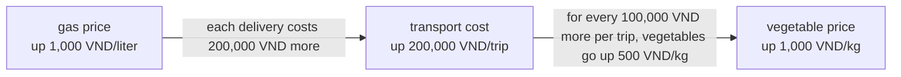
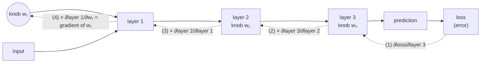

> **Learning objectives:** After this lesson, you will understand what a derivative is through everyday and numerical examples, know which direction the gradient points and why "going against the gradient" makes a model less wrong, and grasp why the chain rule is the heart of training neural networks.

## 1. Billions of knobs - which knob to turn, and which way?

In Lesson 01, an ML model is a **machine with many knobs**: each knob is a parameter, and "learning" means finding the knob positions at which the model guesses least wrong. The training loop has a step that sounds very gentle: *"adjust the knobs to guess a little less wrong"*.

But adjust them **how**? The trial-and-error way: turn one knob a bit to the right, run the model again, measure the error; turn it to the left, run again, measure again. A neural network has **millions to billions of knobs** - each adjustment round would cost billions of model runs, just to find out which way to turn each knob.

Mathematics gives us a far better "sense": for each knob, **without turning it**, we can know in advance *whether nudging it slightly to the right makes the error go up or down, and how sensitive it is*. That sense is the **derivative**. And even more surprising, saved for Section 7: thanks to the chain rule, billions of questions "which way should this knob turn" are answered **in a single pass**, at a cost of only a few times one model run.

This is the last mathematical piece you need before stepping into loss functions (Lesson 10) and gradient descent (Lesson 11).

## 2. The derivative: instantaneous rate of change

### 2.1. The speedometer in a car

You drive from home to a coffee shop. The distance traveled is a function of time. The number on the speedometer - 40 km/h - does not tell you how far you *have gone*; it tells you *at this very moment* how fast the distance is increasing: "at this pace, 40 km more every hour".

**Speed is exactly the derivative of distance with respect to time.** In general: the derivative of a function $f$ at a point tells you **when the input nudges up by a tiny bit, how fast the output changes**. On a graph, that is the **slope** of the curve at that point.

### 2.2. "Measuring" the derivative of f(x) = x² by hand

Without any formula yet, you can still measure a derivative numerically. Take $f(x) = x^2$ at $x = 1$, where $f(1) = 1$. Nudge $x$ by a small amount $h$ and see how much $f$ changes **relative to** the nudge:

| Nudge $h$ | $f(1+h)$ | Change $f(1+h) - f(1)$ | Ratio change / nudge |
|---|---|---|---|
| 0.1 | 1.21 | 0.21 | **2.1** |
| 0.01 | 1.0201 | 0.0201 | **2.01** |
| 0.001 | 1.002001 | 0.002001 | **2.001** |

The smaller the nudge, the closer the ratio gets to **2**. We say the derivative of $f(x) = x^2$ at $x = 1$ equals 2, written $f'(1) = 2$. The practical meaning: around $x = 1$, *nudge the input by 1 part and the output nudges by about 2 parts*.

The ratio in the last column has its own name: the **difference quotient** - the slope of the line segment joining two points on the graph; *Mathematics for Machine Learning* builds the concept of the derivative from exactly this quantity. Let $h$ shrink, the two points merge, the segment becomes the tangent line and its slope is the derivative. *Dive into Deep Learning* also opens its calculus chapter with exactly this kind of numerical experiment - with the function $3x^2 - 4x$, also at $x = 1$, and the ratio also approaches 2.

```
 f(x) = x²                       .
   ▲                          .
   |                        .
   |                      .   ← at x = 1: sloping up,
   |                   _.        slope = 2
   |               _ .
   |          _  .
   |     ~  .
   +---·-------------► x
       0    1
```

> 🔧 **Try it now:** Compute the ratio by hand at $x = 2$ with $h = 0.01$: $f(2.01) = 4.0401$ and $f(2) = 4$, so $(4.0401 - 4)/0.01 = $ **4.01**. Very close to 4 - exactly $2 \times 2$. The rule: the derivative of $x^2$ at any point $x$ is $2x$.

Familiar functions have quick formulas like that (the derivative of $x^2$ is $2x$, of $x^3$ is $3x^2$). In this series you **do not need to memorize the table of formulas** - Section 8 will explain why; just remember $2x$ for the examples below.

> ⚠️ **A small note:** The "let $h$ shrink" experiment is a convincing estimate, not yet a rigorous proof. The formal definition of the derivative uses the concept of a **limit**: the value the ratio approaches as $h$ approaches 0. The intuition "nudge a little, see how much it changes" is all you need for the lessons ahead.

## 3. The sign of the derivative tells you which way is downhill

Thick fog, and you are standing on a mountainside - the image of the person descending the mountain from Lesson 01. You cannot see the foot of the mountain, nor do you need to know the exact slope in degrees; you only need to know **which side is down**. The same goes for the goal of "reducing the error": the most valuable thing about the derivative is not its exact number, but its **sign**.

| Derivative at the current point | The function is... | To **decrease** the function's value... |
|---|---|---|
| Positive (> 0) | going up as $x$ increases | **decrease** $x$ (step back) |
| Negative (< 0) | going down as $x$ increases | **increase** $x$ (step forward) |
| Zero | flat right here | stay put - you may be at the bottom |

Check with $f(x) = x^2$ (a U-shaped graph, bottom at $x = 0$), using the formula $f'(x) = 2x$:

- At $x = 1$: $f'(1) = 2 > 0$ → to reach the bottom, decrease $x$. Correct: the bottom is to the left.
- At $x = -1$: $f'(-1) = -2 < 0$ → to reach the bottom, increase $x$. Correct: the bottom is to the right.
- At $x = 0$: $f'(0) = 0$ → at the bottom.

The condensed rule worth the whole lesson: **go against the sign of the derivative, with a small enough step, and the function decreases**. The mountain descender's "feeling the slope underfoot" is computing the derivative; "stepping toward the downhill side" is going against its sign.

> ⚠️ **A small note:** A derivative of 0 only says "it is flat here", not necessarily that it is the bottom. With $f(x) = -x^2$ (an upside-down U), the derivative at $x = 0$ is also 0 - but that is the peak. Lesson 10 and Lesson 11 will meet more "fake" flat spots such as saddle points on the loss landscape.

## 4. Partial derivatives: ask one knob at a time

A coffee shop's profit depends on both the *selling price* and the *advertising spend*. The owner asks: *"If I raise the price by 1,000 VND, how much does profit change - assuming advertising stays the same?"* Holding one thing fixed to ask about the other on its own: that is exactly how mathematics handles functions of several variables.

A model's error depends on **millions** of knobs at once, but the approach does not change: **ask one knob at a time**. To know how knob number $i$ matters, we *hold every other knob fixed* and nudge only that one, then measure the rate of change just as in Section 2. The result is called a **partial derivative**, written $\partial f / \partial x_i$. The symbol $\partial$ (read "partial") is deliberately written "curly", unlike the letter $d$, as a reminder that other variables are being held fixed.

A small example: $f(x, y) = x^2 + 3y$.

- Ask knob $x$ (treat $y$ as a constant): the $3y$ part stands still, only $x^2$ moves → $\partial f/\partial x = 2x$.
- Ask knob $y$ (treat $x$ as a constant): the $x^2$ part stands still → $\partial f/\partial y = 3$.

At the point $(x, y) = (1, 5)$: nudge $x$ a little and $f$ rises at a rate of $2 \times 1 = 2$; nudge $y$ a little and $f$ rises at a rate of $3$. Knob $y$ is more "sensitive" than knob $x$ - and that is exactly the information for deciding which knob to adjust more aggressively.

## 5. The gradient: a compass pointing up the steepest slope

Having asked every knob, you have a list of rates. But the mountain descender can only take **one step** - how do you combine all the answers to know which way to step?

Gather all the partial derivatives into **one vector** (exactly the "list of numbers" of Lesson 06):

$$\nabla f = \left[\frac{\partial f}{\partial x_1}, \frac{\partial f}{\partial x_2}, \ldots, \frac{\partial f}{\partial x_n}\right]$$

This vector is the **gradient** (symbol $\nabla$, read "nabla"). It is not just a list for convenience; it has a very valuable geometric property: **at the current point, the gradient points in exactly the direction in which the function increases fastest**, and its length tells you how steep the slope is. It is the model's **compass**.

The only catch is that this compass points **up** the steepest slope. To **decrease** the function fastest, step in the direction **opposite** to the gradient - the whole soul of the **gradient descent** algorithm that Lesson 11 will exploit to the full.

Example with the "bowl" $f(x, y) = x^2 + y^2$ (bottom at the origin), standing at the point $(1, 2)$:

- $\partial f/\partial x = 2x = 2$; $\partial f/\partial y = 2y = 4$ → gradient $= [2, 4]$.
- The direction opposite to the gradient $= [-2, -4]$: decrease both $x$ and $y$, and decrease $y$ twice as "aggressively" - sensible, since we are farther from the bottom along the $y$ axis.

```
 Looking at the bowl f = x² + y² from above
 (each ring is a contour line, like a topographic map):

        ┌───────────────────┐
        │   ╭─────────╮     │      ↗ gradient [2, 4]: direction UP the slope
        │  ╭│  ╭───╮ ●│╮    │        (always crosses the rings at right angles)
        │  ││  │ ⊙ │  ││    │      ⊙ = bottom (0, 0)
        │  ╰│  ╰───╯  │╯    │      ● = (1, 2): standing here
        │   ╰─────────╯     │      ↙ go against the gradient [−2, −4]
        └───────────────────┘        to get DOWN to the bottom
```

A beautiful detail that every topographic map shows: the gradient arrow **always crosses the contour lines at right angles**. Walk along a contour ring and the altitude does not change; to go up (or down) fastest, you must cut across the rings.

> 🔧 **Try it now:** With the same bowl $f(x, y) = x^2 + y^2$, compute the gradient at $(3, 1)$: $[2 \times 3,\ 2 \times 1] = $ **[6, 2]**. The fastest downhill direction is $[-6, -2]$: this time knob $x$ needs adjusting 3 times as hard as knob $y$, because we are farther from the bottom along the $x$ axis.

> ⚠️ **A small note:** The gradient is **local** information - it only describes the terrain right around where you stand. Take a small step against the gradient and the function decreases; take too long a step and you may overshoot the bottom onto the opposite slope. "How long a step" is exactly the learning rate, the subject of Lesson 11.

## 6. The chain rule: the derivative of a function nested inside a function

### 6.1. Gas prices rise - how much do vegetables at the market go up?

The price of vegetables does not depend *directly* on the price of gas, but through an intermediate link, the cost of transport:



Suppose the traders give you two local "rates":

- Gas goes up **1,000 VND/liter** → the cost of each delivery trip goes up **200,000 VND**.
- The cost per trip goes up **100,000 VND** → the price of vegetables goes up **500 VND/kg**.

So if gas goes up 1,000 VND/liter, how much do vegetables go up? A trip costs 200,000 more = 2 times the "100,000" unit, so vegetables go up $2 \times 500 = 1{,}000$ VND/kg. You just **multiplied the two rates** along the chain:

$$\frac{\text{change in vegetable price}}{\text{change in gas price}} = \frac{\text{change in vegetable price}}{\text{change in cost}} \times \frac{\text{change in cost}}{\text{change in gas price}}$$

That is the **chain rule**: the derivative of a chain of nested functions equals **the product of the derivatives of each link**. In symbols: if $y$ depends on $u$, and $u$ depends on $x$, then

$$\frac{dy}{dx} = \frac{dy}{du} \cdot \frac{du}{dx}$$

> ⚠️ **A small note:** The formula above looks like two "fractions" with $du$ canceling out - a handy mnemonic, but not a real cancellation: $dy/du$ is the notation for a derivative, not a division of two numbers.

### 6.2. Checking with numbers

Take $y = u^2$ with $u = 3x$ - that is, $y$ is a nested function: multiply by 3 on the inside, square on the outside.

- Outer link: $dy/du = 2u$.
- Inner link: $du/dx = 3$.
- Chain rule: $dy/dx = 2u \times 3 = 6u = 18x$. At $x = 1$: **18**.

Cross-check by the long way round: substitute $u = 3x$ directly to get $y = (3x)^2 = 9x^2$, whose derivative is $18x$ - at $x = 1$ that also gives **18**. They match! The beauty of the chain rule is that when the chain is a hundred links long, we *no longer need* (and no longer can) "substitute directly" like that - just multiply link by link and you are done.

## 7. The chain rule is the heart of backpropagation

Back to the question that opened the lesson: knob $w_1$ sits in the very first layer, while the loss sits at the very end. Turn $w_1$ and how much does the loss change? A deep neural network (Lesson 01) is exactly a **very long chain of nested functions**: data goes through layer 1, that result goes into layer 2, then layer 3... and finally pours into the loss function that measures the error. In the diagram below, solid arrows are the **forward** pass (computing the prediction), dashed arrows are the **backward** pass (multiplying up the rates of each link):



Exactly the "gas price → vegetable price" problem, just a longer chain: multiply up the rate of each link, **tracing backward from the loss to layer 1**:

$$\frac{\partial \, \text{loss}}{\partial w_1} = \frac{\partial \, \text{loss}}{\partial \, \text{layer 3}} \times \frac{\partial \, \text{layer 3}}{\partial \, \text{layer 2}} \times \frac{\partial \, \text{layer 2}}{\partial \, \text{layer 1}} \times \frac{\partial \, \text{layer 1}}{\partial w_1}$$

The algorithm that organizes this "multiply up in reverse" efficiently for *every* parameter at once is called **backpropagation**: data runs **forward** through the chain when predicting, while derivatives are computed by going **backward** along that chain, and most of the computation reduces to the matrix multiplications familiar from Lesson 06. The training loop of the neural networks in this series repeats two beats over and over: **forward to predict, backward to compute the gradient, then adjust the knobs against the gradient.**

The surprise is in the cost. The trial-and-error approach of Section 1 has to run the model once *per knob* - billions of times. Backpropagation computes **the entire gradient in a single pass**, and a classic result of Baur and Strassen (1983) - often called the "cheap gradient principle" - states that this cost does not exceed a small constant (about 5 times) the cost of evaluating the function once, **regardless of how many knobs the model has**. Without the chain rule, there is no practical way to know which way billions of knobs should turn; in that sense, it is the heart of deep learning.

<details>
<summary>Why does training use so much more memory than prediction?</summary>

To multiply up in reverse, the backward pass has to reuse the intermediate values the forward pass computed (the output of each layer), so they must be **kept in memory** until backpropagation is finished. The amount of these values grows with the number of layers and with the batch size (Lesson 11). That is why a deeper network or a larger batch easily causes out-of-memory errors during training, while the same model running prediction stays lightweight.

</details>

## 8. Autograd: let the library compute derivatives for you

Good news to close the lesson: **you almost never have to do the multiplying-up of Section 7 by hand.** Deep learning libraries like PyTorch, TensorFlow and JAX come with **automatic differentiation (autograd for short)**: as you write your computations, the library quietly records a **computational graph** - a diagram of "which value is computed from which" - and then, when asked, it runs backward through the graph and applies the chain rule for you.

Illustrated with PyTorch, recomputing exactly the $f(x) = x^2$ at $x = 1$ example from Section 2:

```python
import torch

x = torch.tensor(1.0, requires_grad=True)  # "please track x for me"
y = x ** 2                                 # forward pass: y = 1.0
y.backward()                               # run backward, apply the chain rule
print(x.grad)                              # tensor(2.) - exactly f'(1) = 2
```

Three lines of code in place of the whole "shrinking $h$" table. For a network with billions of parameters, it is still just one call to `backward()`.

> 🔧 **Try it now:** Change `1.0` to `3.0` and run again: `x.grad` should print `tensor(6.)` - exactly $2 \times 3$. Next try `y = x ** 3` at $x = 2$: the result is `tensor(12.)`, matching the formula $3x^2$.

The idea is not new at all: *Dive into Deep Learning* cites the earliest reference on automatic differentiation from 1964 (Wengert), while the core ideas of modern backpropagation come from a 1980 PhD thesis and were developed further in the late 1980s - long before autograd libraries became everyday tools.

So why learn derivatives, if the computer does it all for you? To **understand what is going on**: when Lesson 11 talks about "a learning rate too large making the loss jump around", or Lesson 10 explains why a loss function has to produce *a usable slope signal*, you will see that it all comes back to today's intuitions. You need to understand what the compass points at; building the compass, leave to the library.

## Lesson summary

- Training = adjusting knobs to reduce the error; the **derivative** tells you in advance "nudge this knob and the error goes up or down, and how sensitively" without turning it.
- Derivative = **instantaneous rate of change** = slope; measurable numerically by nudging the input by an ever-smaller amount $h$ (with $f(x)=x^2$ at $x=1$, the ratio approaches 2).
- **The sign of the derivative** is the guide: positive → the function is rising → step back to decrease; negative → step forward; zero → you may be at the bottom. The golden rule: **go against the sign of the derivative, with a small enough step, and the function decreases**.
- Functions of several variables: a **partial derivative** asks one knob at a time (holding the other knobs fixed); the **gradient** gathers them all into one vector pointing in the **direction of fastest increase** (and crossing contour lines at right angles) → go against the gradient to decrease fastest (the foundation of Lesson 11).
- **Chain rule**: the derivative of a chain of nested functions = the product of the derivatives of each link (gas → transport → vegetable price).
- A neural network is a very long chain of nested functions; **backpropagation** = applying the chain rule backward along the chain to compute the gradient for every parameter in one pass, at a cost of only a small constant times one forward pass - the heart of deep learning.
- **Autograd** in PyTorch/TensorFlow/JAX records the computational graph and computes derivatives for you; your job is to understand the meaning, not to compute by hand.

## Self-check questions

1. Explain to a friend who has not studied math: what does "the car's speed is the derivative of distance" mean?
2. **Compute by hand:** with $f(x) = x^2$ at $x = 3$, take $h = 0.01$ and compute the ratio $\big(f(3.01) - f(3)\big) / 0.01$. What number is the result close to? Compare with the formula $f'(x) = 2x$.
3. You are standing at a point where the derivative is $-5$. Is the function rising or falling as $x$ increases? To **decrease** the function's value, should you increase or decrease $x$?
4. **Compute by hand:** for the bowl $f(x, y) = x^2 + y^2$, compute the gradient at the point $(2, 1)$. From that point, which direction should you step for the function to *decrease* fastest? Which knob needs adjusting harder, and why?
5. Use the chain rule to compute the derivative of $y = u^2$ with $u = x + 1$ at $x = 2$, then verify by expanding $y = (x+1)^2 = x^2 + 2x + 1$ and differentiating directly.
6. Why do we say "without the chain rule, you cannot train a multi-layer neural network"? Redraw the diagram of the chain of layers and point out where the chain rule is applied.

## Further reading

**Primary sources for this lesson:**

| Source | Which part to read |
|---|---|
| ***Dive into Deep Learning* (d2l.ai)** | Chapter 2.4 - *Calculus*: derivatives by numerical experiment, partial derivatives, gradient, chain rule; Chapter 2.5 - *Automatic Differentiation*: autograd, computational graphs and a bit of history; Chapter 5.3 - *Forward Propagation, Backward Propagation, and Computational Graphs*: why training uses more memory than prediction |
| ***Mathematics for Machine Learning*** | Chapter 5 (first part) - *Vector Calculus*: difference quotient, differentiation rules, the chain rule example $(2x+1)^4$, partial derivatives and gradient |

**Additional free online sources:**

- [Essence of Calculus - 3Blue1Brown (YouTube playlist)](https://www.youtube.com/playlist?list=PLZHQObOWTQDMsr9K-rj53DwVRMYO3t5Yr) - an animated video series that helps you "see" calculus; in particular watch [Chapter 4 on the chain rule](https://www.youtube.com/watch?v=YG15m2VwSjA).
- [PyTorch autograd documentation](https://pytorch.org/tutorials/beginner/blitz/autograd_tutorial.html) - the official tutorial; run the code from Section 8 and extend it further.
- [Machine Learning cơ bản](https://machinelearningcoban.com/) - a Vietnamese-language blog by Vũ Hữu Tiệp, with a calculus refresher for ML.
- [Who Invented the Reverse Mode of Differentiation? - Andreas Griewank (PDF)](https://ftp.gwdg.de/pub/misc/EMIS/journals/DMJDMV/vol-ismp/52_griewank-andreas-b.pdf) - for those curious about history: how backpropagation was "reinvented" many times, and where the "cheap gradient" principle comes from.

> **Next lesson:** [Loss Functions & Optimization](../loss-functions-optimization/) - you have the compass (the gradient), now you need the destination - the loss function for each kind of problem, and the optimization picture it creates.
