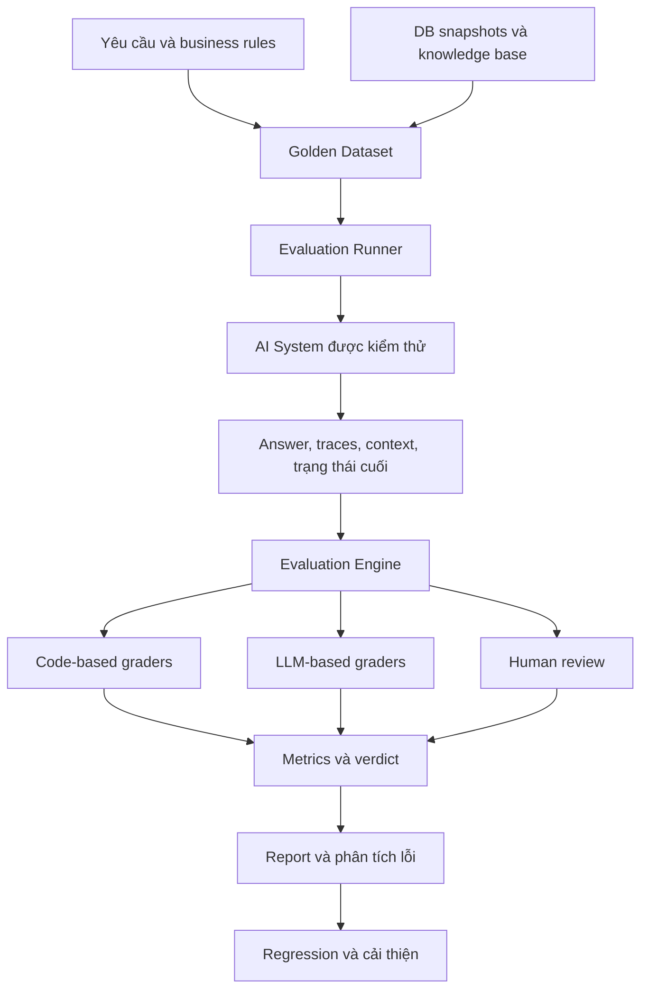
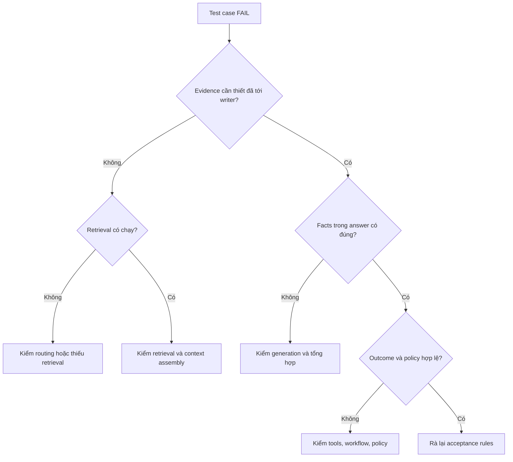

Khi một AI System có nhiều thành phần, biết câu trả lời đúng hay sai mới chỉ là điểm bắt đầu. Ta còn cần biết **lỗi xảy ra ở đâu, vì sao xảy ra và phiên bản mới có thực sự tốt hơn phiên bản trước không**.

## 1. Một bài test PASS vẫn chưa nói lên toàn bộ câu chuyện

Giả sử ta xây AI Assistant hỗ trợ phân tích hoạt động kinh doanh cho chuỗi cửa hàng bán lẻ. Người quản lý hỏi:

> "Vì sao doanh thu tháng 8 tăng nhưng lợi nhuận lại giảm? Hãy phân tích và đề xuất hướng cải thiện."

Hệ thống có thể chia việc: Analytics Agent truy vấn doanh thu, chi phí và lợi nhuận; Knowledge Agent tìm chính sách kinh doanh và tài liệu khuyến mãi; Report Agent tổng hợp kết quả.

Giả sử Assistant trả lời:

> "Doanh thu tháng 8 tăng 15%, nhưng lợi nhuận giảm 25%. Nguyên nhân chính là chi phí quảng cáo tăng mạnh. Cửa hàng nên cắt giảm ngân sách quảng cáo trong tháng tới."

Các con số có thể đúng, nhưng dữ liệu chỉ cho thấy **tổng chi phí** tăng. Nó chưa chứng minh quảng cáo là nguyên nhân chính, càng chưa đủ để khẳng định cắt ngân sách là giải pháp tốt. Numeric grader có thể cho PASS; grader kiểm nhận định thiếu bằng chứng thì không.

Đây là chuyện thường gặp với AI System thực tế: **một phần kết quả đúng không có nghĩa toàn bộ kết quả đúng**.

Ở hai bài trước, ta đã [xây Golden Dataset](../building-ground-truth-for-ai-evaluation-vi/) và [chọn cách đánh giá Chatbot, RAG, Agent](../evaluating-ai-systems-chatbot-rag-agents-vi/). Giờ hãy nối những mảnh ghép đó thành *Evaluation Harness*: một quy trình lặp lại được để chạy case, thu bằng chứng, chấm đúng hành vi cần chấm và giải thích thất bại. Mục tiêu không phải tự xây lại tất cả những gì các framework đã có.

## 2. Bắt đầu từ sản phẩm, không phải framework

Trước hết cần biết sản phẩm phải làm được gì. Retail AI Assistant có ít nhất ba nhóm nhiệm vụ:

| Nhóm nhiệm vụ | Ví dụ | Cần kiểm chứng |
| :-- | :-- | :-- |
| Data Analytics | So sánh doanh thu theo tháng | Số liệu, công thức, kỳ dữ liệu |
| Knowledge Q&A | Hỏi đáp chính sách | Evidence, factual correctness |
| Agent Analysis | Giải thích biến động và đề xuất | Kết hợp bằng chứng, tool use, outcome |

Một cách chấm duy nhất khó bao phủ tốt cả ba. LLM Judge có thể đánh giá kết luận có suy diễn quá mức không, nhưng không nên là nguồn xác nhận duy nhất cho phép tính doanh thu mà code kiểm được. Numeric assertion kiểm được 15%, nhưng không tự biết đề xuất kinh doanh có đủ bằng chứng hay không.

Thay vì một evaluator "biết tuốt", hãy **kết hợp những grader chuyên trách**. Đó là ý tưởng của Hybrid Evaluation.

## 3. Kiến trúc của Hybrid Evaluation Harness

Có thể chia harness thành bốn phần:

1. **Golden Dataset:** Test cases, dữ kiện kỳ vọng, ràng buộc và phiên bản nguồn đã được kiểm chứng.
2. **Execution Runner:** Chuẩn bị môi trường và chạy từng case trên AI System.
3. **Evaluation Engine:** Áp dụng các grader phù hợp cho mỗi case.
4. **Reporting & Analysis:** Tổng hợp chất lượng, chẩn đoán lỗi và so sánh phiên bản.



*Hình 1. Chọn grader theo nhiệm vụ, thay vì ép mọi case qua một cơ chế chấm duy nhất.*

Harness không nhất thiết phải hiểu mọi logic bên trong từng Agent. Nó cần một interface rõ để cung cấp input, dựng môi trường kiểm thử, gọi hệ thống và thu artifacts: câu trả lời, tool calls và arguments, evidence được retrieve, context thực sự gửi cho writer model, trạng thái cuối, thời gian, usage và lỗi.

Code grader kiểm dữ liệu và trạng thái. LLM Judge đánh giá những nhận định cần hiểu ngôn ngữ tự nhiên. Human Review xử lý case quan trọng hoặc mơ hồ. Kiến trúc này chỉ phát huy tác dụng khi Golden Dataset ghi rõ mỗi grader cần kiểm điều gì.

## 4. Một test case thực tế cần chứa những gì?

Trở lại câu hỏi doanh thu và lợi nhuận. Hãy cố định dữ liệu test:

| Chỉ số | Tháng 7 | Tháng 8 |
| :-- | --: | --: |
| Doanh thu | 200 triệu đồng | 230 triệu đồng |
| Tổng chi phí | 160 triệu đồng | 200 triệu đồng |
| Lợi nhuận | 40 triệu đồng | 30 triệu đồng |

Đây là số liệu giả lập, với lợi nhuận được đơn giản hóa thành doanh thu trừ tổng chi phí. Code xác minh được doanh thu tăng **15%**, tổng chi phí tăng **25%**, lợi nhuận giảm **25%**. Nhưng bảng không tách chi phí quảng cáo, vận chuyển và giá vốn. Vì thế chưa thể kết luận quảng cáo là nguyên nhân chính.

Một Golden Test Case có thể được biểu diễn như sau:

```json
{
  "id": "TC-SALES-001",
  "scenario": "business_analysis",
  "input": "Vì sao doanh thu tháng 8 tăng nhưng lợi nhuận giảm?",
  "ground_truth": {
    "expected_facts": {
      "revenue_growth": 15.0,
      "cost_growth": 25.0,
      "profit_growth": -25.0
    },
    "source": "retail_snapshot_v1"
  },
  "expected_behavior": [
    "Explain revenue and profit changes",
    "Use verified numerical facts",
    "Distinguish observations from hypotheses"
  ],
  "prohibited_behavior": [
    "Claim an unverified root cause"
  ]
}
```

Đây là schema minh họa, không bắt buộc theo framework nào. Case dùng Knowledge Base có thể cần thêm expected evidence IDs và phiên bản chính sách. Những kỳ vọng đó phải được xác định từ nguồn sự thật **độc lập với thứ hệ thống tình cờ retrieve được**. Nếu lấy chính tài liệu AI chọn rồi coi là đáp án chuẩn, lỗi retrieval dễ bị che khuất.

Nên lưu phiên bản database snapshot, tài liệu, business rules và rubric để có thể tái lập ý nghĩa của case khi hệ thống thay đổi.

## 5. Runner cần thu thập những gì?

Sau khi nhận case, Runner gọi AI System. Nếu chỉ lưu final answer, ta mất thông tin quan trọng. Giả sử AI nói doanh thu tăng 20%: SQL tool trả sai, Analytics Agent tính sai hay Report Agent diễn giải lại kết quả đúng thành sai?

Execution trace cần đủ dữ liệu để tách các khả năng đó:

| Artifact | Mục đích |
| :-- | :-- |
| Input và scenario | Xác định case và thiết lập ban đầu |
| Tool calls | Kiểm tool được chọn và tham số |
| Tool results | Biết hệ thống thực sự nhận dữ liệu nào |
| Retrieved candidates | Đánh giá tìm kiếm và xếp hạng |
| Writer context | Biết thông tin nào thật sự tới bước generation |
| Final answer | Đánh giá kết quả người dùng thấy |
| Trạng thái cuối | Kiểm hành động và side effects |
| Timing, usage, errors | Phân tích chi phí, latency, reliability |

Với RAG, cần phân biệt **retrieved candidates** với **writer context**. Retriever có thể lấy mười chunks, nhưng sau reranking và context assembly chỉ năm chunks vào prompt. Tập đầu cho biết retrieval hoạt động thế nào; tập sau cho biết LLM có nhận đủ evidence không. Citations trong câu trả lời cũng không nhất thiết phản ánh toàn bộ context model đã thấy.

[Hướng dẫn Agent workflow evaluation của OpenAI](https://developers.openai.com/api/docs/guides/agent-evals) cũng nhấn mạnh traces gồm model calls, tool calls, guardrails và handoffs khi chẩn đoán hành vi. Harness cần nói rõ **mỗi metric đang chấm artifact nào**.

## 6. Thiết kế Evaluation Engine bằng các grader chuyên trách

Khi đã có artifacts, ta chấm case bằng những phép kiểm bổ sung cho nhau.

### 6.1. Deterministic Graders

Code có thể kiểm doanh thu tháng 8 có đúng 230 triệu, tỷ lệ tăng có đúng 15%, SQL tool có dùng đúng tháng, structured output hợp lệ không và có hành động bị cấm không. Với Agent thay đổi dữ liệu, code còn kiểm được database hoặc API state sau khi chạy.

Các phép kiểm này dễ tái lập và không tốn thêm LLM call cho câu hỏi có đáp án xác định. Nhưng logic kiểm vẫn phải phản ánh định nghĩa nghiệp vụ; kiểm rất chuẩn một công thức sai vẫn cho kết luận sai.

### 6.2. Retrieval Graders

Với case cần Knowledge Base, ta kiểm evidence kỳ vọng có được tìm thấy không. Có thể dùng Recall@K, Precision@K, Hit Rate hoặc metric theo context của [Ragas](https://docs.ragas.io/en/latest/concepts/metrics/available_metrics/).

Trước khi tính, hãy thống nhất:

- Đang chấm retrieved candidates hay writer context?
- K bằng bao nhiêu, và relevance dựa trên document ID, chunk ID hay nội dung?
- Chunk trùng lặp được tính thế nào?
- Nếu không có chunk nào, metric nào bằng 0, metric nào không xác định?
- Case này có thực sự cần retrieval không?

Nếu retrieval là bắt buộc, expected evidence tồn tại nhưng không lấy được gì, recall bằng 0. Nếu task vốn không cần Knowledge Base, retrieval metric là **không áp dụng**, không phải FAIL. Metric cần điều kiện áp dụng chứ không chỉ công thức.

### 6.3. LLM-Based Graders

Xét câu: "Doanh thu tăng 15% và lợi nhuận giảm 25% vì chi phí quảng cáo tăng mạnh." Numeric grader có thể chấp nhận hai tỷ lệ, nhưng bảng tổng chi phí không chứng minh nguyên nhân quảng cáo.

LLM Judge có thể nhận câu hỏi, câu trả lời, golden facts và evidence để chấm **Faithfulness**, **Factual Correctness**, **Answer Relevancy** và **Completeness**. Nhưng đừng bắt nó đoán những gì trace đã ghi rõ. Muốn biết API có nhận sai tham số, hãy kiểm tool call. Muốn biết một kết luận có suy diễn quá mức không, LLM Judge có thể hữu ích nếu rubric rõ và đã đối chiếu với đánh giá của chuyên gia.

Sự kết hợp này để mỗi grader làm phần việc nó phù hợp nhất.

## 7. Biến điểm số thành chẩn đoán lỗi

Một eval chỉ nói `FAIL` vẫn để người phát triển tự bắt đầu điều tra. Report hữu ích nên chỉ ra giai đoạn đáng kiểm tra:



*Hình 2. Sơ đồ gợi ý hướng điều tra, không thể tự chứng minh nguyên nhân gốc của mọi lỗi.*

Nếu case cần hai nguồn evidence nhưng chỉ một nguồn tới writer, hãy xem retrieval hoặc context assembly. Nếu cả hai đã tới mà câu trả lời vẫn sai, hãy kiểm generation, prompt hoặc cách tổng hợp. Nếu answer đúng nhưng Agent làm hành động chưa được phép, hãy xem tool và workflow.

Report có thể lưu verdict cùng chẩn đoán ngắn:

| Test Case | Verdict | Diagnostic |
| :-- | :-- | :-- |
| TC-SALES-001 | FAIL | Unsupported causal claim |
| TC-RAG-002 | FAIL | Required evidence not retrieved |
| TC-REPORT-003 | PASS | All mandatory conditions met |
| TC-TOOL-004 | ERROR | Evaluation runner timed out |

*Kết quả giả lập để minh họa, không phải dữ liệu benchmark thực tế.*

Phải phân biệt lỗi AI System với lỗi Harness. Agent chọn sai tool có thể là FAIL. Judge service timeout trước khi chấm thì chưa đủ căn cứ kết luận Agent đúng hay sai; hãy ghi ERROR của evaluation. Metric mô tả một khía cạnh chất lượng, còn verdict áp dụng điều kiện chấp nhận đã xác định trước. Chỉ một điều kiện bắt buộc bị vi phạm cũng có thể khiến case FAIL, dù các điểm khác cao.

## 8. Evaluation Report nên cho thấy điều gì?

Một Pass Rate chung có thể che khuất vấn đề. Hệ thống làm tốt Q&A đơn giản nhưng liên tục sai ở task thay đổi dữ liệu không nên được xem là ổn chỉ vì điểm trung bình cao. Report hữu ích có ba lớp:

1. **Quality Summary:** PASS, FAIL, ERROR, tỷ lệ thành công và các metric quan trọng theo từng nhóm nhiệm vụ.
2. **Failure Analysis:** Nhóm lỗi nghi ngờ như wrong retrieval, unsupported claims, sai tool arguments và policy violations.
3. **Operational Diagnostics:** Latency, token usage, chi phí, timeout, retry và tín hiệu reliability.

Cần nói rõ cách xử lý case không thể chấm. Nếu loại ERROR khỏi mẫu số Pass Rate, vẫn phải hiện số lượng và tỷ lệ ERROR riêng. Nếu không, Harness hoạt động kém có thể làm một phiên bản trông tốt hơn thực tế. Với Agent có tính biến thiên, hãy chạy nhiều trials cho task quan trọng và báo mức dao động.

Mỗi run nên lưu đủ để tái lập điều kiện: phiên bản dataset, model, prompt, grader và rubric, tool configuration và dữ liệu nguồn. Output không nhất thiết giống hệt từng chữ, nhưng ta cần biết khác biệt đến từ phiên bản đang thử hay môi trường đã thay đổi.

## 9. Dùng Harness để so sánh phiên bản

Giả sử ta đổi model hoặc cải thiện retrieval pipeline. Hãy chạy phiên bản hiện tại và phiên bản mới trên cùng Golden Dataset, cùng snapshot dữ liệu, cùng rubric và môi trường có thể so sánh. Sau đó xem nhiều chiều, không chỉ một score:

| Khía cạnh | Câu hỏi cần trả lời |
| :-- | :-- |
| Overall Quality | Nhiều case đạt điều kiện bắt buộc hơn không? |
| Numerical Correctness | Các phép tính còn chính xác không? |
| Retrieval Quality | Evidence cần thiết được tìm đầy đủ hơn không? |
| Answer Quality | Có ít nhận định thiếu bằng chứng hơn không? |
| Agent Behavior | Tool calls và hành động có an toàn hơn không? |
| Efficiency | Latency và chi phí thay đổi đáng kể không? |

Câu trả lời tốt hơn có thể đổi lại thời gian gấp đôi. Model reasoning mạnh hơn có thể chọn nhầm tool thường xuyên hơn. Quyết định release cần dựa trên yêu cầu bắt buộc của sản phẩm, mức đánh đổi chấp nhận được và những regression không được phép xuất hiện.

**Regression Suite** biến mỗi lỗi đã xác minh thành case để những lần thay đổi sau không tái phạm. Nhưng vẫn phải thêm case mới và một tập đánh giá độc lập. Nếu chỉ tối ưu những case quen thuộc, điểm số tăng chưa chắc đồng nghĩa khả năng tổng quát hóa tăng.

## 10. Có cần tự xây toàn bộ framework không?

Thường là không. Nhiều công cụ đã xử lý những phần hạ tầng chung:

- [Ragas](https://docs.ragas.io/en/latest/concepts/metrics/available_metrics/) có metric cho RAG, retrieval, factual correctness và bài toán Agent liên quan.
- [DeepEval](https://deepeval.com/docs/metrics-introduction) hỗ trợ datasets và metrics, gồm kiểm tra dùng LLM Judge và hướng Agent.
- [LangSmith](https://docs.langchain.com/langsmith/evaluation-types) hỗ trợ datasets, experiments, tracing cùng offline và online evaluation.
- [Inspect AI](https://inspect.aisi.org.uk/tasks.html) tổ chức eval bằng dataset, solver, [scorer](https://inspect.aisi.org.uk/scorers.html) và công cụ cho Agent task.
- [Promptfoo](https://www.promptfoo.dev/docs/configuration/expected-outputs/) hỗ trợ cấu hình test, deterministic assertions và model-graded checks.

Không công cụ nào tự biết công ty bạn định nghĩa doanh thu thế nào, quy tắc duyệt bắt buộc ra sao hay phiên bản chính sách nào là nguồn sự thật. Hãy tận dụng framework cho execution, tracing, datasets và grader phổ biến; xây thêm adapter và acceptance rules mang tính nghiệp vụ ở những chỗ cần thiết.

## 11. Những nguyên tắc đáng giữ lại

**Đừng để LLM vừa tạo Ground Truth vừa tự xác nhận mọi kết quả.** Dùng database, tài liệu và business rules độc lập cho facts có thể kiểm chứng.

**Chấm đúng thứ hệ thống đã dùng hoặc đã làm.** Tách retrieved candidates khỏi writer context; kiểm tool calls và trạng thái cuối thay vì chỉ đọc câu trả lời.

**Đừng nhầm metric với nghiệm thu.** Relevancy cao vẫn không thể cứu một con số bắt buộc bị sai hoặc một hành động vi phạm policy.

**Kiểm thử cả Harness.** Grader lỗi, môi trường bất ổn hoặc Ground Truth quá hạn có thể tạo kết quả thuyết phục nhưng sai lệch.

**Biến kết quả thành hành động cụ thể.** Retrieval lỗi nên hướng điều tra tới index, filter, reranking hoặc context assembly. Generation sai dù evidence đúng lại là câu chuyện khác. Bảng điểm không giúp tìm đường sửa thì chưa tận dụng hết giá trị của Evaluation.

## 12. Evaluation trở thành một phần của quá trình phát triển

Evaluation Harness hữu ích bắt đầu từ yêu cầu sản phẩm, Golden Dataset đáng tin, Runner có môi trường kiểm soát được, artifacts cần thiết và grader phù hợp từng task. Code xử lý facts và states có thể kiểm chính xác. RAG cần chấm retrieval lẫn generation. Agent cần traces và outcome. LLM Judge hỗ trợ phần ngôn ngữ tinh tế hơn nhưng phải có rubric và được hiệu chỉnh bằng chuyên gia.

Khi kết nối lại, các phần này không chỉ cho PASS hay FAIL. Chúng chỉ ra hệ thống yếu ở đâu, làm rõ đánh đổi giữa các phiên bản và giúp cải tiến dựa trên bằng chứng.

**Harness tốt không chỉ hỏi "AI có tốt hơn không?" mà còn hỏi "Tốt hơn ở đâu, đánh đổi điều gì và đã đủ bằng chứng để tin vào kết luận đó chưa?"**

Khi ấy, Evaluation không còn là ô kiểm trước release mà là một phần liên tục của quá trình xây AI System đáng tin cậy.

## Nguồn tham khảo

1. [Anthropic - Demystifying Evals for AI Agents](https://www.anthropic.com/engineering/demystifying-evals-for-ai-agents) - tasks, trials, graders, outcomes, môi trường và thiết kế harness.
2. [OpenAI - Evaluate Agent Workflows](https://developers.openai.com/api/docs/guides/agent-evals) - traces và graders cho tool use, handoffs, workflow.
3. [LangSmith - Evaluation Types](https://docs.langchain.com/langsmith/evaluation-types) - offline, online, code-based và model-based evaluation.
4. [Ragas - Available Evaluation Metrics](https://docs.ragas.io/en/latest/concepts/metrics/available_metrics/) - metric cho RAG, retrieval, factual correctness và Agent.
5. [Inspect AI - Tasks](https://inspect.aisi.org.uk/tasks.html) và [Scorers](https://inspect.aisi.org.uk/scorers.html) - dataset, solver, scorer và Agent evaluation.
6. [Promptfoo - Assertions and Metrics](https://www.promptfoo.dev/docs/configuration/expected-outputs/) - deterministic assertions và model-graded checks.
7. [DeepEval - Evaluation Metrics](https://deepeval.com/docs/metrics-introduction) - metric và LLM Judge cho ứng dụng GenAI.
